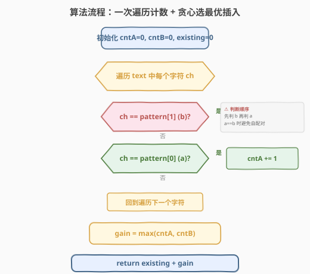
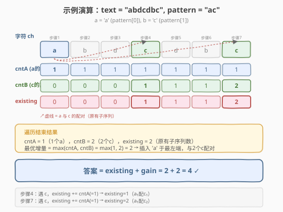

# LeetCode 字符串中最多数目的子序列 题解

## 1. 题目概述

- **标题 / 题号**：字符串中最多数目的子序列（#2207，medium）
- **链接**：https://leetcode.cn/problems/maximize-number-of-subsequences-in-a-string/
- **难度**：中等
- **标签**：字符串、贪心、计数

**题意**：给你一个下标从 0 开始的字符串 `text` 和另一个长度为 2 的字符串 `pattern`，两者都只包含小写英文字母。你可以在 `text` 中**任意位置**插入**一个**字符，这个字符必须是 `pattern[0]` 或 `pattern[1]`。返回插入一个字符后，`text` 中最多包含多少个等于 `pattern` 的**子序列**。

子序列指的是将一个字符串删除若干个字符后（也可以不删除），剩余字符保持原本顺序得到的字符串。

**示例 1**：

```text
输入：text = "abdcdbc", pattern = "ac"
输出：4
解释：在 text[1] 和 text[2] 之间插入 pattern[0] = 'a'，得到 "abadcdbc"
      其中 "ac" 作为子序列出现 4 次。
```

**示例 2**：

```text
输入：text = "aabb", pattern = "ab"
输出：6
解释：可以得到 6 个 "ab" 子序列的方案有 "aaabb"、"aaabb" 和 "aabbb"。
```

**约束**：

- $1 \le$ `text.length` $\le 10^5$
- `pattern.length == 2`
- `text` 和 `pattern` 都只包含小写英文字母

> 💡 本题的核心是**贪心 + 一次遍历计数**。暴力枚举插入位置 $O(n^2)$ 会超时（$n \le 10^5$），但只要想清楚「插入一个字符最多能新增多少个子序列」，就能把问题拆成「原有子序列数 + 插入带来的增量」，各 $O(n)$ 一次搞定。

## 2. 解题思路

### 2.1 暴力思路：枚举插入位置

最直观的做法：对每个插入位置 $i$（$0 \le i \le n$，共 $n+1$ 个位置）和每种字符选择（`pattern[0]` 或 `pattern[1]`），构造新字符串后统计其中 `pattern` 子序列的个数，取最大值。

统计子序列个数本身是 $O(n)$（维护 `pattern[0]` 计数，遇 `pattern[1]` 累加），因此总时间 $O(n^2)$。$n = 10^5$ 时约 $10^{10}$ 次操作，远超时限。

> ⚠️ 暴力法的瓶颈：**枚举插入位置**导致重复统计。突破口是把「插入后的总数」拆成「原有的 + 插入新增的」——原有子序列数与插入位置无关（插入不破坏已有子序列），而新增量只取决于「插入的字符能与原 text 中多少个配对字符组成新子序列」。

### 2.2 核心观察：拆分 + 贪心选最优插入

**关键拆解**：插入一个字符后，`text` 中 `pattern` 子序列的总数 = **原有子序列数** + **插入带来的增量**。

- **原有子序列数**：插入字符不会破坏已有的子序列（子序列只需保持相对顺序，新增一个字符不影响已有字符间的配对），所以原有数与插入位置无关，可以预先 $O(n)$ 算出。
- **插入增量**：新插入的字符只能与**原 text 中的字符**配对组成**新**子序列（不会与自身配对）。增量取决于插入哪个字符、插在哪里。

**贪心选最优插入**：设 `pattern = [a, b]`（`a = pattern[0]`, `b = pattern[1]`），原 text 中 `a` 出现 `cntA` 次、`b` 出现 `cntB` 次。

| 插入选择 | 最优位置 | 新增子序列数 |
|----------|----------|-------------|
| 插入 `a`（`pattern[0]`） | **最左端**（`b` 之前的所有位置） | 该 `a` 与原 text 中每个 `b` 组成一个新子序列 → 增量 = `cntB` |
| 插入 `b`（`pattern[1]`） | **最右端**（`a` 之后的所有位置） | 该 `b` 与原 text 中每个 `a` 组成一个新子序列 → 增量 = `cntA` |

- 插入 `a` 时，`a` 作为子序列的第一个字符，需要配对一个在它**之后**的 `b`。把 `a` 插在最左端，原 text 中所有 `b` 都在它之后，增量最大 = `cntB`。
- 插入 `b` 时，`b` 作为子序列的第二个字符，需要配对一个在它**之前**的 `a`。把 `b` 插在最右端，原 text 中所有 `a` 都在它之前，增量最大 = `cntA`。

因此**最优增量** $= \max(\text{cntA}, \text{cntB})$。

![插入策略：pattern[0] 插最左 vs pattern[1] 插最右](../images/mos_insert_strategy.svg)

> ⚠️ **`pattern[0] == pattern[1]` 的特例**：设 `a = b`（如 `pattern = "aa"`），则 `cntA = cntB = cnt`。插入 `a` 在最左端，增量 = `cntB = cnt`；插入 `a` 在最右端，增量 = `cntA = cnt`。两者相同，最优增量仍为 $\max(\text{cntA}, \text{cntB}) = \text{cnt}$，公式天然兼容。此时原有子序列数为 $C(\text{cnt}, 2) = \text{cnt} \cdot (\text{cnt}-1) / 2$，插入后变为 $C(\text{cnt}+1, 2)$，增量恰好为 $\text{cnt}$，验证无误。

**原有子序列数的计算**（一次遍历 $O(n)$）：

```text
cntA = 0, existing = 0
for ch in text:
    if ch == pattern[1]:
        existing += cntA        # 当前 b 与之前所有 a 配对
    if ch == pattern[0]:
        cntA += 1               # 累计 a 的个数
```

> 💡 注意遍历顺序：**先判断 `pattern[1]` 再累计 `pattern[0]`**。当 `pattern[0] == pattern[1]` 时，同一个字符不能既是第一个又是第二个，所以必须先用**之前的** `cntA` 配对，再更新 `cntA`。若先加 `cntA` 再配对，会把当前字符与自己配对，多算。

### 2.3 算法流程图

```text
maxSubsequenceValue(text, pattern):
  a = pattern[0], b = pattern[1]

  # ---- 第一步：一次遍历，同时算原有子序列数 + 统计 cntA / cntB ----
  cntA = 0, cntB = 0, existing = 0
  for ch in text:
      if ch == b:
          existing += cntA       # b 与之前所有 a 配对
          cntB += 1
      if ch == a:
          cntA += 1              # 累计 a

  # ---- 第二步：贪心选最优插入 ----
  gain = max(cntA, cntB)         # 插 a→增益 cntB，插 b→增益 cntA

  # ---- 第三步：合并 ----
  return existing + gain
```



> 💡 一次遍历同时完成三件事：① 累计 `cntA`（`pattern[0]` 个数）；② 累计 `cntB`（`pattern[1]` 个数）；③ 计算 `existing`（原有子序列数）。遍历结束后用 `max(cntA, cntB)` 得到最优增量，无需二次扫描。

### 2.4 示例演算

以 `text = "abdcdbc"`, `pattern = "ac"` 为例（`a = 'a'`, `b = 'c'`）：



| 步骤 | `ch` | `cntA`（a 的累计） | `cntB`（c 的累计） | `existing`（原有子序列） | 说明 |
|------|------|-------|-------|-----------|------|
| 1 | `a` | 1 | 0 | 0 | 遇 a，cntA 加 1 |
| 2 | `b` | 1 | 0 | 0 | 非 a 非 c，跳过 |
| 3 | `d` | 1 | 0 | 0 | 非 a 非 c，跳过 |
| 4 | `c` | 1 | 1 | 0→**1** | 遇 c，existing += cntA = 1 |
| 5 | `d` | 1 | 1 | 1 | 非 a 非 c，跳过 |
| 6 | `b` | 1 | 1 | 1 | 非 a 非 c，跳过 |
| 7 | `c` | 1 | 2 | 1→**2** | 遇 c，existing += cntA = 1 |

- **原有子序列数** `existing = 2`
- `cntA = 1`（1 个 `a`），`cntB = 2`（2 个 `c`）
- **最优增量** $= \max(1, 2) = 2$（插入 `a` 在最左端，与 2 个 `c` 配对）
- **答案** $= 2 + 2 = 4$ ✓

验证：插入 `a` 在最左端得 `"aabdcdbc"`，其中 `ac` 子序列 = 第 1 个 `a` 配 2 个 `c` + 第 2 个 `a` 配 2 个 `c` = 4。

> 💡 对比示例 2 `text = "aabb"`, `pattern = "ab"`：遍历得 `cntA = 2`, `cntB = 2`, `existing = 4`（第 1 个 a 配 2 个 b + 第 2 个 a 配 2 个 b）。增量 $= \max(2, 2) = 2$，答案 $= 4 + 2 = 6$ ✓。

## 3. 参考代码

### C++

```cpp
// 字符串中最多数目的子序列 —— 一次遍历 + 贪心 O(n)
// 编译: g++ -O2 -std=c++17 solution.cpp -o mos
#include <string>
#include <algorithm>
using namespace std;

class Solution {
public:
    long long maximumSubsequenceCount(string text, string pattern) {
        char a = pattern[0], b = pattern[1];
        long long cntA = 0, cntB = 0, existing = 0;
        for (char ch : text) {
            if (ch == b) {
                existing += cntA;   // b 与之前所有 a 配对
                cntB++;
            }
            if (ch == a) {
                cntA++;             // 累计 a（放 b 判断之后，避免自配对）
            }
        }
        long long gain = max(cntA, cntB);  // 插 a→增益 cntB，插 b→增益 cntA
        return existing + gain;
    }
};
```

### Python

```python
class Solution:
    def maximumSubsequenceCount(self, text: str, pattern: str) -> int:
        a, b = pattern[0], pattern[1]
        cnt_a = cnt_b = existing = 0
        for ch in text:
            if ch == b:
                existing += cnt_a   # b 与之前所有 a 配对
                cnt_b += 1
            if ch == a:
                cnt_a += 1          # 累计 a（放 b 判断之后，避免自配对）
        gain = max(cnt_a, cnt_b)    # 插 a→增益 cnt_b，插 b→增益 cnt_a
        return existing + gain
```

> 💡 **实现细节**：① 用 `long long`（C++），因为 $n \le 10^5$，原有子序列数可达 $O(n^2) \approx 10^{10}$，超 32 位。Python 无此问题。② **判断顺序**：先 `if ch == b` 再 `if ch == a`，当 `a == b` 时避免当前字符与自己配对（先用旧 `cntA` 配对，再更新 `cntA`）。③ `cntA` 和 `cntB` 可以在同一个 `if` 链中累计——当 `a != b` 时两个 `if` 互斥，当 `a == b` 时先走 `b` 分支再走 `a` 分支，顺序正确。

## 4. 复杂度分析

| 维度 | 复杂度 | 说明 |
|------|--------|------|
| **时间复杂度** | $O(n)$ | 一次遍历 `text`，每个字符 $O(1)$ 判断；遍历后 $O(1)$ 求 `max` |
| **空间复杂度** | $O(1)$ | 仅用 `cntA`、`cntB`、`existing` 三个变量，与输入规模无关 |

> ⚠️ 暴力法 $O(n^2)$ 在 $n = 10^5$ 下约 $10^{10}$ 次操作，远超时限。关键在于**不枚举插入位置**——通过贪心证明最优插入位置必在最左或最右端，把 $O(n)$ 种插入方案降为 2 种选择，每种选择的增量 $O(1)$ 可算（等于对应字符的总计数）。

## 5. 扩展：贪心正确性的交换论证

### 5.1 为什么插入 `pattern[0]` 必在最左端最优？

设 `pattern = [a, b]`，将 `a` 插入位置 $i$（在第 $i$ 个字符之前）。新增子序列数 = 原文本中位置 $i$ 及之后的 `b` 的个数。

- 插在位置 $i$：增量 = `cntB` −（位置 $i$ 之前的 `b` 的个数）
- 插在位置 $0$（最左端）：增量 = `cntB`（所有 `b` 都在之后）

显然位置 $0$ 的增量 $\ge$ 任意位置 $i$ 的增量，故**最左端最优**。同理，插入 `b` 必在最右端最优（所有 `a` 都在之前）。

### 5.2 为什么不需要考虑插入字符与「原有子序列被破坏」？

子序列的定义是「删除若干字符后剩余字符保持原顺序」。插入一个新字符不会删除或重排已有字符，因此**原有子序列全部保留**。新字符只会**额外**参与配对，产生增量。这是「原有 + 增量」拆分成立的根本原因。

### 5.3 与子序列计数模板的关系

「原有子序列数」的计算是经典的**子序列匹配计数**模板：维护 `pattern[0]` 的累计个数，遇 `pattern[1]` 则累加。这与 [828. 统计子串中的唯一字符](https://leetcode.cn/problems/count-unique-characters-of-all-substrings-of-a-given-string/) 的贡献计数同源——都是「不枚举子序列，而是对每个配对字符问能组成多少子序列」。本题在此基础上叠加了一个「贪心插入」的决策层。

## 6. 面试要点

1. **为什么可以拆成「原有 + 增量」？**

   - 插入字符不删除、不重排已有字符，原有子序列全部保留。新字符只额外参与配对产生增量。因此总数 = 原有数 + 增量，两部分独立计算。

2. **最优插入位置为什么一定在最左或最右端？**

   - 插入 `pattern[0]` 作为子序列首字符，需要配对其后的 `pattern[1]`。插在最左端使所有 `pattern[1]` 都在之后，增量最大化 = `cntB`。插在内部只会让部分 `pattern[1]` 排在之前而无法配对，增量更小。`pattern[1]` 同理（插最右端，所有 `pattern[0]` 在之前）。

3. **`pattern[0] == pattern[1]` 时公式还成立吗？**

   - 成立。此时 `cntA = cntB = cnt`，增量 = $\max(\text{cnt}, \text{cnt}) = \text{cnt}$。原有数为 $C(\text{cnt}, 2)$，插入后 $C(\text{cnt}+1, 2) - C(\text{cnt}, 2) = \text{cnt}$，验证一致。代码无需特判，但**判断顺序**要先 `if ch == b` 再 `if ch == a`，避免当前字符自配对。

4. **为什么要用 `long long`？**

   - $n \le 10^5$，最坏情况 `text` 全为同一字符、`pattern` 也为该字符重复，原有子序列数 = $C(10^5, 2) \approx 5 \times 10^9$，加增量后约 $5 \times 10^9 + 10^5$，超 32 位 `int` 上限（约 $2.1 \times 10^9$）。必须用 `long long`（C++）。

5. **遍历中 `if ch == b` 和 `if ch == a` 的顺序重要吗？**

   - 当 `a != b` 时两个 `if` 互斥，顺序无关。当 `a == b` 时**至关重要**：必须先走 `b` 分支（用旧 `cntA` 配对），再走 `a` 分支（更新 `cntA`）。若反过来，当前字符会先把自己计入 `cntA`，再与自己配对，多算一个子序列。这是本题最隐蔽的坑。

> 💡 **一句话总结**：2207 是「子序列计数 + 贪心插入」的组合题——一次遍历 $O(n)$ 算出原有子序列数和两字符计数，再用 $\max(\text{cntA}, \text{cntB})$ 得到最优插入增量。核心难点是**判断 `a == b` 时的遍历顺序**与**贪心最优位置在最左/最右端**的证明。

## 同类练习题

| # | 题目 | 与本题的关联 |
|---|------|-------------|
| 828 | [统计子串中的唯一字符](https://leetcode.cn/problems/count-unique-characters-of-all-substrings-of-a-given-string/) | 贡献计数思想（每个字符作为多少子串的唯一字符），本题子序列计数的字符串镜像 |
| 2563 | [统计公平数对的数目](https://leetcode.cn/problems/count-the-number-of-fair-pairs/) | 排序 + 双指针统计满足条件的数对，与本题的「配对计数」思想同源 |
| 2083 | [求以相同字母开头和结尾的子串数量](https://leetcode.cn/problems/substrings-that-begin-and-end-with-the-same-letter/) | 按首尾字符分组计数子串，贡献计数的另一种应用 |
| 2145 | [统计隐藏数组数目](https://leetcode.cn/problems/count-the-hidden-sequences/) | 差分约束 + 计数，同属「不枚举而是贡献计数」的思路 |
| 2952 | [需要添加的硬币的最小数量](https://leetcode.cn/problems/minimum-number-of-coins-to-be-added/) | 贪心 + 排序，与本题贪心选最优插入的决策思路类似 |
