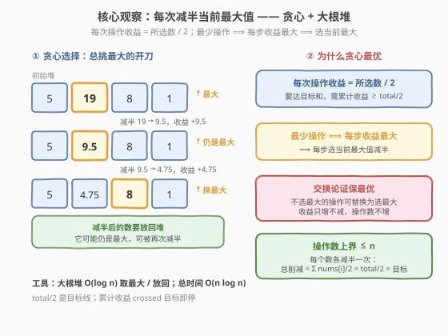
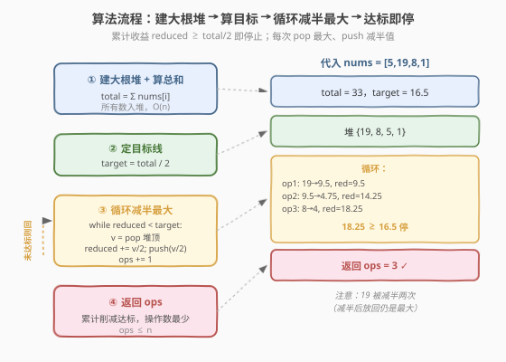

# 将数组和减半的最少操作次数

- **题目名称**：将数组和减半的最少操作次数
- **链接**：[2208. 将数组和减半的最少操作次数](https://leetcode.cn/problems/minimum-operations-to-halve-array-sum/)
- **难度**：中等
- **标签**：贪心、堆、优先队列

## 1. 题目概述

给你一个正整数数组 `nums`。每一次操作中，你可以从 `nums` 中选择**任意**一个数并将它减小到**恰好**一半（注意，在后续操作中你可以对减半过的数继续执行操作）。请你返回将 `nums` 数组和**至少**减少一半的**最少**操作数。

**示例 1**：

```text
输入：nums = [5,19,8,1]
输出：3
解释：初始和为 5 + 19 + 8 + 1 = 33，目标至少减少 33 / 2 = 16.5。
  操作 1：选 19 → 9.5（削减 9.5）
  操作 2：选 9.5 → 4.75（削减 4.75，累计 14.25）
  操作 3：选 8 → 4（削减 4，累计 18.25 ≥ 16.5）
最终数组 [5, 4.75, 4, 1]，和为 14.75，减少了 18.25。返回 3。
```

**示例 2**：

```text
输入：nums = [3,8,20]
输出：3
解释：初始和为 31，目标至少减少 15.5。
  操作 1：选 20 → 10（削减 10）
  操作 2：选 10 → 5（削减 5，累计 15）
  操作 3：选 8 → 4（削减 4，累计 19 ≥ 15.5）
返回 3。
```

**约束条件**：

- $1 \le \text{nums.length} \le 10^5$
- $1 \le \text{nums[i]} \le 10^7$

> 💡 题眼在于「每次操作收益 = 所选数的一半」+「同一数可反复减半」。要最少操作数达到目标和，等价于**每一步都要让收益最大化**——即每次都挑当前最大的数开刀。减半后的数仍可能很大，需放回候选集继续参与比较，这正是**大根堆**的用武之地。

---

## 2. 解题思路

### 2.1 暴力思路：每步线性找最大

模拟操作过程：每次扫描整个数组找出当前最大值，将其减半，累计削减量，直到累计 $\ge \text{total}/2$。

单次找最大 $O(n)$，最多操作 $O(n)$ 次（见 2.2 的上界证明），总时间 $O(n^2)$，在 $n = 10^5$ 下不可行。

> 💡 暴力法的瓶颈在于「反复找最大」。把找最大从 $O(n)$ 压到 $O(\log n)$ 即可破局——这正是堆（优先队列）的招牌能力。

### 2.2 核心观察：贪心 + 大根堆



**观察一：每次操作的收益 = 所选数的一半**

把一个数 $v$ 减半为 $v/2$，数组和减少了 $v - v/2 = v/2$。要让**最少操作数**达到目标和 $\text{total}/2$，等价于让**每一步的收益尽量大**，因此每步都应选**当前最大值**。

**观察二：减半后的数要放回候选集**

题目允许对同一数反复减半。减半后的 $v/2$ 仍可能比其它数大（如示例 1 中 $19 \to 9.5$ 仍是最大），需放回堆中继续参与比较。因此用**大根堆**：每步弹出堆顶（最大）、减半、累计收益、再把减半值 push 回去。

**观察三：贪心最优（交换论证）**

> ⚠️ 设某最优解在某步选了 $o$（非当前最大），而当前最大为 $g > o$。把这一步换成选 $g$，收益从 $o/2$ 增到 $g/2$，累计收益只增不减，后续操作不受影响（$g$ 减半后放回，仍可再选）。若替换后累计提前达标，操作数只可能更少——矛盾于「最优解操作数已最少」。故每步选最大不会比任何策略差。

**观察四：操作数上界 $\le n$（关键复杂度保证）**

考虑一种特定策略：**把每个数各减半恰好一次**。每个数 $v$ 减半一次贡献削减 $v/2$，总削减 $= \sum v/2 = \text{total}/2 = \text{目标}$。这是一种合法的 $n$ 步方案，因此最优解操作数 $k \le n$。这把堆操作次数锁定在 $O(n)$ 内。

### 2.3 算法流程图



算法步骤总结：

1. **建堆 + 算总和**：所有数入大根堆，计算 $\text{total}$。
2. **定目标线**：$\text{target} = \text{total} / 2$。
3. **循环减半**：`while reduced < target`：弹出堆顶 $v$，令 $h = v/2$，`reduced += h`，`push(h)`，`ops += 1`。
4. **返回** `ops`。

### 2.4 示例演算

以 `nums = [5,19,8,1]` 为例，$\text{total} = 33$，$\text{target} = 16.5$：

![示例演算：[5,19,8,1] 大根堆逐步减半](../images/2208_example_walkthrough.svg)

| 步 | 堆顶最大 | 减半为 | 本次收益 | 累计削减 | $\ge 16.5$? | 堆(操作后) |
|----|----------|--------|----------|----------|-------------|------------|
| 1 | 19 | 9.5 | 9.5 | 9.5 | 否 | {9.5, 8, 5, 1} |
| 2 | 9.5 | 4.75 | 4.75 | 14.25 | 否 | {8, 5, 4.75, 1} |
| 3 | 8 | 4 | 4 | 18.25 | 是 ✓ | {5, 4.75, 4, 1} |

第 3 步累计 $18.25 \ge 16.5$，停止，返回 $\mathbf{3}$。

> 💡 注意第 1、2 步对同一个 $19$ 连续减半两次（$19 \to 9.5 \to 4.75$）：减半后的 $9.5$ 放回堆后仍是最大值，被再次选中。这正是「同一数可反复操作」的体现，也是必须把减半值 push 回堆的原因。

---

## 3. 参考代码

### C++

```cpp
class Solution {
  public:
    int halveArray(vector<int>& nums) {
        priority_queue<double> pq;          // 大根堆
        double total = 0;
        for (int x : nums) {
            pq.push((double)x);
            total += x;
        }
        double target = total / 2.0;
        double reduced = 0;
        int ops = 0;
        while (reduced < target) {
            double v = pq.top(); pq.pop();  // 当前最大
            double half = v / 2.0;
            reduced += half;                // 本次削减量
            pq.push(half);                  // 放回，后续可能再减
            ++ops;
        }
        return ops;
    }
};
```

### Python

```python
class Solution:
    def halveArray(self, nums: List[int]) -> int:
        pq = [-x for x in nums]             # Python 无大根堆，用负数模拟
        heapq.heapify(pq)
        total = sum(nums)
        target = total / 2
        reduced = 0.0
        ops = 0
        while reduced < target:
            v = -heapq.heappop(pq)          # 取出当前最大
            half = v / 2
            reduced += half
            heapq.heappush(pq, -half)       # 放回减半值
            ops += 1
        return ops
```

> ⚠️ **浮点精度**：所有中间值都是形如「整数 / $2^t$」的二进分数，且 $\text{total} \le 10^{12} < 2^{40}$，`double` 的 53 位尾数足够精确表示。更关键的是，贪心每次选最大，每步加入 `reduced` 的收益都远大于累加和所在量级的 ULP（如累加到 $5 \times 10^{11}$ 时 ULP 仅约 $10^{-4}$，而单步收益 $\ge 0.5$），故累加过程实质无损。若仍不放心，可把所有数乘 $2^{20}$ 转成 `long long` 在整数域运算，但此处并无必要。

---

## 4. 复杂度分析

| 维度 | 复杂度 | 说明 |
|------|--------|------|
| 时间复杂度 | $O(n \log n)$ | 建堆 $O(n)$；循环至多 $k \le n$ 次（见 2.2 上界），每次 pop/push 各 $O(\log n)$，总体 $O(n \log n)$ |
| 空间复杂度 | $O(n)$ | 堆最多存 $n$ 个元素（减半值放回不增加元素总数，始终为 $n$） |

> 💡 **为何 $k \le n$**：把每个数各减半一次即贡献 $\sum \text{nums[i]}/2 = \text{total}/2 = \text{目标}$，故存在 $n$ 步合法方案，最优解操作数不超过 $n$。这一上界把堆操作次数锁在 $O(n)$，是时间复杂度 $O(n \log n)$ 而非 $O(n \log M \log n)$ 的关键。最坏情形 $k = n$ 可在「所有元素相等」时取到（如示例 2 的 $[3,8,20]$ 中 $k=3=n$）。

---

## 5. 扩展：贪心最优性的另一种视角——合并 $k$ 条有序流

把每个原始数 $\text{nums}[i]$ 看作一条「减半收益流」：第 $t$ 次减半它贡献 $\text{nums}[i] / 2^t$（$t = 1,2,\dots$），且**必须按顺序取**（要拿到 $\text{nums}[i]/4$ 必先拿 $\text{nums}[i]/2$）。每条流单调递减。

于是问题转化为：**有 $n$ 条单调递减的流，从中取最少个数的收益，使其和 $\ge \text{target}$**。这正是「合并 $k$ 条有序流」的经典贪心——每次取所有流当前头部中最大者，与归并排序的 `k-way merge` 同构，只是这里取最大而非最小。

交换论证：若某最优解在某步未取当前最大头 $g$ 而取了 $o < g$，把 $o$ 换成 $g$（$g$ 也是某条流的当前头，可取），总收益只增不减，操作数不增；若收益提前达标还可进一步删操作，矛盾于最优。故贪心每步取最大头最优。

> 💡 这一视角把 2208 与「$k$ 路归并」「Dijkstra 堆取最小」串成同一族：堆维护 $n$ 个候选头，每次弹出极值并 push 后继。区别仅在取最大/最小、后继如何生成。2208 的后继就是「当前值的一半」。

---

## 6. 面试要点

1. **为什么每次都要减半当前最大值？**

   - 每次操作的收益 = 所选数 / 2。要最少操作达到目标和，每步收益最大化 ⟹ 选当前最大。减半后的数放回堆，可能仍是最大，可再次被选（如示例 1 中 19 被减半两次）。

2. **为什么用大根堆而不是排序后从大到小依次减半？**

   - 减半后的数会变小，但可能仍大于其它未处理的数，需要重新参与比较。排序是一次性的，无法动态更新；大根堆支持 $O(\log n)$ 弹出最大 + push 回减半值，天然支持动态候选集。

3. **操作数上界为什么是 $n$？**

   - 把每个数各减半一次，总削减 $= \sum \text{nums[i]}/2 = \text{total}/2 = \text{目标}$，是合法的 $n$ 步方案，故最优 $k \le n$。这保证时间 $O(n \log n)$。若没有这个上界，单看「同一数可被减半 $\log M$ 次」会误估为 $O(n \log M)$。

4. **浮点数比较 `reduced < target` 会有精度问题吗？**

   - 不会。所有值为二进分数（整数 / $2^t$），`total` $\le 10^{12} < 2^{40}$，`double` 53 位尾数精确覆盖。且贪心每次加入的收益远大于累加和所在量级的 ULP，累加实质无损。若面试官追问，可改用「所有数乘 $2^{20}$ 转 `long long`」在整数域计算彻底规避。

5. **如果题目改成「每个数最多减半一次」会怎样？**

   - 变成排序后贪心：从大到小依次减半，累计收益达标即停。无需堆，$O(n \log n)$ 排序 + $O(n)$ 扫描。原题允许反复减半才需要堆动态维护最大。

---

## 7. 同类练习题

- [2530. 执行 K 次操作后的最大分数](https://leetcode.cn/problems/maximal-score-after-applying-k-operations/)：每次取最大并向上取整减半（ceil(v/3)），固定操作次数最大化收益，与 2208 同为「堆 + 反复取极值」骨架
- [1046. 最后一块石头的重量](https://leetcode.cn/problems/last-stone-weight/)：每次取两块最大石头相撞，大根堆模拟碰撞过程，堆的招牌应用
- [703. 数据流中的第 K 大元素](https://leetcode.cn/problems/kth-largest-element-in-a-stream/)：小根堆维护前 K 大，与 2208 互为「取最大 vs 留最大」的堆方向对照
- [2141. 同时运行 N 台电脑的最长时间](https://leetcode.cn/problems/maximum-running-time-of-n-computers/)（[题解](../2101-2200/2141_同时运行N台电脑的最长时间.md)）：排序 + 贪心枚举阈值，同为「贪心 + 上界分析」的中等题
- [502. IPO](https://leetcode.cn/problems/ipo/)（[题解](../0501-0600/502_IPO.md)）：排序解锁 + 大根堆每轮取最大利润，堆 + 贪心的经典组合
