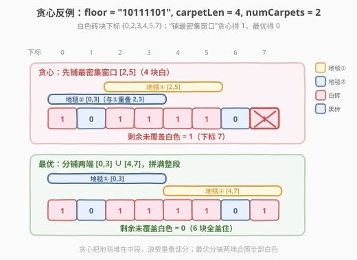
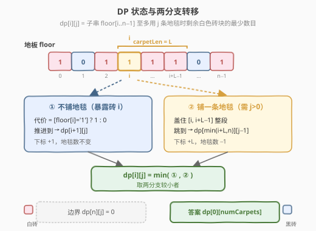
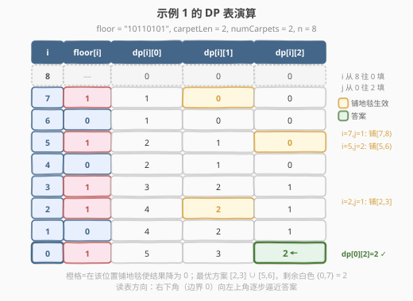

# LeetCode 用地毯覆盖后的最少白色砖块 题解

## 1. 题目概述

- **标题 / 题号**：用地毯覆盖后的最少白色砖块（#2209，hard）
- **链接**：https://leetcode.cn/problems/minimum-white-tiles-after-covering-with-carpets/
- **难度**：困难
- **标签**：动态规划、字符串、记忆化搜索

**题意**：给定下标从 0 开始的二进制字符串 `floor`，表示地板上砖块的颜色：

- `floor[i] = '0'`：第 $i$ 块砖为**黑色**；
- `floor[i] = '1'`：第 $i$ 块砖为**白色**。

另给整数 `numCarpets` 和 `carpetLen`。你有 `numCarpets` 条**黑色**地毯，每条长度均为 `carpetLen` 块砖。地毯可铺在任意连续段上，**相互之间可以覆盖**。问：铺完这些地毯后，**未被覆盖的白色砖块**的最少数目。

**示例 1**：

```text
输入：floor = "10110101", numCarpets = 2, carpetLen = 2
输出：2
解释：可在 [2,3] 与 [5,6] 各铺一条地毯，覆盖下标 2,3,5 的白色砖块；
      剩余未覆盖的白色砖块为下标 0、7，共 2 块。无方案能做到少于 2 块。
```

**示例 2**：

```text
输入：floor = "11111", numCarpets = 2, carpetLen = 3
输出：0
解释：在 [0,2] 与 [2,4] 各铺一条地毯（重叠下标 2 无妨），5 块白色砖块全被覆盖。
```

**约束**：

- $1 \leq \text{carpetLen} \leq \text{floor.length} \leq 1000$
- `floor[i]` 为 `'0'` 或 `'1'`
- $1 \leq \text{numCarpets} \leq 1000$

> 💡 **关键性质**：地毯是**黑色**的，盖住白色砖块就等于"消去"它；盖住黑色砖块无收益但也无害。因此问题等价于：用 `numCarpets` 个长度为 `carpetLen` 的区间（可重叠）去"吃掉" `floor` 中的 `'1'`，最小化剩余 `'1'` 的个数。地毯可重叠是难点所在——它让贪心失效，必须 DP。

## 2. 解题思路

### 2.1 暴力思路与贪心反例

**暴力枚举**：每条地毯的起点有 $n$ 种选择，`numCarpets` 条地毯的方案数为 $O(n^{\text{numCarpets}})$，$n, \text{numCarpets} \leq 1000$ 时完全不可行。

**最自然的贪心**是"每一步把地毯铺在当前未被覆盖白色砖块最多的长度为 `carpetLen` 的窗口上"。但它会**失败**：

取 `floor = "10111101"`，`numCarpets = 2`，`carpetLen = 4`。白色砖块在下标 $\{0,2,3,4,5,7\}$。

- 贪心第一步：长度为 4 的窗口中，$[2,5]$ 覆盖白色 $\{2,3,4,5\}$ 共 4 块（唯一最大），于是铺在此处；
- 贪心第二步：剩余白色 $\{0,7\}$ 相距 7，一条长度 4 的地毯至多再盖住 1 块 → 剩余 **1 块**；
- 最优解：把两条地毯分别铺在 $[0,3]$ 与 $[4,7]$，两者恰好拼满整段，6 块白色**全盖住**，剩余 **0 块**。



> ⚠️ **为何贪心失效？** 贪心把地毯"堆"在白色最密集的中间段，却丢掉了分散在两端的白色；最优解宁愿每条地毯少盖一点，也要**分铺两端**合围全部白色。局部"吃最多"会牺牲全局覆盖范围——这是带"重叠"的区间覆盖问题的典型陷阱，必须用 DP 统筹。

### 2.2 核心观察：后缀动态规划

把决策按**从左到右**逐个位置考虑。定义：

$$
\text{dp}[i][j] = \text{在子串 } \text{floor}[i..n{-}1] \text{ 上，至多用 } j \text{ 条地毯时，剩余未覆盖白色砖块的最少数目}
$$

对位置 $i$（$0 \leq i \leq n$）与剩余地毯数 $j$（$0 \leq j \leq \text{numCarpets}$），只有两种**互斥决策**：

1. **不在此处铺地毯**（让砖块 $i$ 暴露）：暴露的代价为 $\text{floor}[i] == \text{'1'} ? 1 : 0$，问题规模缩小到 $\text{dp}[i+1][j]$；
2. **在此处铺一条地毯**（仅当 $j > 0$）：覆盖 $[i,\ i+\text{carpetLen}-1]$，整段被"吃掉"，问题跳到 $\text{dp}[\min(i+\text{carpetLen},\ n)][j-1]$。

取两者最小：

$$
\text{dp}[i][j] = \min\begin{cases}
[\text{floor}[i]\text{='1'}] \;+\; \text{dp}[i+1][j] & \text{(暴露砖块 } i\text{)}\\[4pt]
\text{dp}[\min(i+\text{carpetLen},\,n)][\,j-1\,] & \text{(铺地毯，需 } j>0\text{)}
\end{cases}
$$

**边界**：$\text{dp}[n][j] = 0$（没有砖块，剩余白色为 0）。
**答案**：$\text{dp}[0][\text{numCarpets}]$。



> 💡 **为何这样定义是对的？**
> - **"至多 $j$ 条"而非"恰好 $j$ 条"**：多用地毯不会让结果变差（大不了铺在没白色的段，无收益也无害），所以"至多"自动涵盖"恰好"。递推中"不铺"分支保留了"少用地毯"的可能。
> - **只需考虑"地毯起点恰好为 $i$"**：任何方案中，每条地毯都有一个起点；按起点从左到右排序后，第 $k$ 条地毯的起点处必然触发"铺"分支，其余位置触发"不铺"分支。于是所有合法方案都能被这两条转移唯一编码，不会遗漏。
> - **$i+\text{carpetLen}$ 可能越界**：用 $\min(\cdot, n)$ 处理，越界等价于铺到地板末尾。

> ⚠️ **可重叠为何不破坏无后效性？** 状态只记"当前下标 $i$ + 剩余地毯数 $j$"，不记之前地毯铺在哪。两条转移都把问题推向**更右**的下标（$i+1$ 或 $i+\text{carpetLen}$），已决策部分不会回头影响未来——这正是 DP 所需的"子问题独立性"，与"地毯能否重叠"无关。

### 2.3 算法流程图


### 2.4 示例演算

以示例 1 `floor = "10110101"`，`numCarpets = 2`，`carpetLen = 2`，$n = 8$ 为例。白色砖块下标 $\{0,2,3,5,7\}$。下表给出完整的 $\text{dp}[i][j]$（行 $i$ 从 8 递减到 0，列 $j \in \{0,1,2\}$）：



| $i$ | $\text{floor}[i]$ | $\text{dp}[i][0]$ | $\text{dp}[i][1]$ | $\text{dp}[i][2]$ | 说明 |
|----:|:--:|---:|---:|---:|------|
| 8 | — | 0 | 0 | 0 | 边界：无砖块 |
| 7 | `1` | 1 | 0 | 0 | $j{=}1$：铺 $[7,8)$ 盖住 7 |
| 6 | `0` | 1 | 0 | 0 | 黑砖，无代价 |
| 5 | `1` | 2 | 1 | 0 | $j{=}2$：铺 $[5,6)$ + 剩 1 条盖 7 |
| 4 | `0` | 2 | 1 | 0 | 黑砖 |
| 3 | `1` | 3 | 2 | 1 | |
| 2 | `1` | 4 | 2 | 1 | $j{=}1$：铺 $[2,3]$ 盖住 2、3 |
| 1 | `0` | 4 | 2 | 1 | 黑砖 |
| 0 | `1` | 5 | 3 | **2** | 答案 $\text{dp}[0][2]=2$ |

最终 $\text{dp}[0][2] = 2$，与示例输出一致。最优方案：在 $[2,3]$、$[5,6]$ 各铺一条地毯，盖住白色 $\{2,3,5\}$，剩余白色 $\{0,7\}$ 共 2 块。

> 💡 读表方向：$i$ 从 $n$ 往 $0$ 填（依赖更靠右的行），$j$ 从 $0$ 往 $\text{numCarpets}$ 填（"铺"分支依赖 $j-1$）。表格右下角到左上角逐步逼近答案。

## 3. 参考代码

### C++

```cpp
class Solution {
public:
    int minimumWhiteTiles(string floor, int numCarpets, int carpetLen) {
        int n = floor.size();
        // dp[i][j]: 子串 floor[i..n-1] 至多用 j 条地毯时，剩余未覆盖白色砖块的最少数目
        vector<vector<int>> dp(n + 1, vector<int>(numCarpets + 1, 0));
        for (int i = n - 1; i >= 0; --i) {
            for (int j = 0; j <= numCarpets; ++j) {
                int skip = (floor[i] == '1' ? 1 : 0) + dp[i + 1][j];
                int place = INT_MAX;
                if (j > 0) {
                    int ni = min(i + carpetLen, n);
                    place = dp[ni][j - 1];
                }
                dp[i][j] = min(skip, place);
            }
        }
        return dp[0][numCarpets];
    }
};
```

### Python

```python
class Solution:
    def minimumWhiteTiles(self, floor: str, numCarpets: int, carpetLen: int) -> int:
        n = len(floor)
        dp = [[0] * (numCarpets + 1) for _ in range(n + 1)]
        for i in range(n - 1, -1, -1):
            white = 1 if floor[i] == '1' else 0
            for j in range(numCarpets + 1):
                skip = white + dp[i + 1][j]
                place = float('inf')
                if j > 0:
                    ni = min(i + carpetLen, n)
                    place = dp[ni][j - 1]
                dp[i][j] = min(skip, place)
        return dp[0][numCarpets]
```

> 💡 **工程细节**：外层 $i$ **递减**、内层 $j$ **递增**，保证计算 $\text{dp}[i][j]$ 时所需依赖 $\text{dp}[i+1][j]$（更靠右的行）与 $\text{dp}[\min(i+\text{carpetLen},n)][j-1]$（更小的 $j$）均已就绪。`ni = min(i + carpetLen, n)` 把"地毯伸过地板末尾"归一化为指向第 $n$ 块（即越界哨兵行 $\text{dp}[n][\cdot]=0$），无需特判。

## 4. 复杂度分析

| 维度 | 复杂度 | 说明 |
|------|--------|------|
| 时间复杂度 | $O(n \cdot \text{numCarpets})$ | 双层循环：$i$ 走 $n+1$ 步、$j$ 走 $\text{numCarpets}+1$ 步，每步 $O(1)$ 转移 |
| 空间复杂度 | $O(n \cdot \text{numCarpets})$ | 二维 DP 表 $(n+1) \times (\text{numCarpets}+1)$ |

> ⚠️ 上限 $n, \text{numCarpets} \leq 1000$，乘积 $10^6$，内存约 4 MB（`int`），完全在限制内。若某一维放宽到 $10^5$，需改用滚动数组或记忆化搜索（见第 5 节）。

## 5. 扩展：空间优化与记忆化搜索

### 5.1 记忆化搜索（自顶向下）

递推可改写为递归 + 记忆化，逻辑更贴近状态定义，便于面试时先讲清思路再写：

```cpp
class Solution {
public:
    int minimumWhiteTiles(string floor, int numCarpets, int carpetLen) {
        int n = floor.size();
        vector<vector<int>> memo(n + 1, vector<int>(numCarpets + 1, -1));
        function<int(int,int)> dfs = [&](int i, int j) -> int {
            if (i == n) return 0;
            if (memo[i][j] != -1) return memo[i][j];
            int skip = (floor[i] == '1') + dfs(i + 1, j);
            int place = INT_MAX;
            if (j > 0) place = dfs(min(i + carpetLen, n), j - 1);
            return memo[i][j] = min(skip, place);
        };
        return dfs(0, numCarpets);
    }
};
```

> 💡 自顶向下只计算**真正可达**的状态；本题状态空间几乎全部可达，故复杂度与递推一致，常数略大。

### 5.2 滚动数组降空间

观察依赖：$\text{dp}[i][j]$ 只用到 $\text{dp}[i+1][j]$ 与 $\text{dp}[\min(i+\text{carpetLen},n)][j-1]$。前者是"下一行同列"，后者是"再往后若干行、少一列"——跨越的行数等于 `carpetLen`，因此**不能**用单行滚动覆盖。可行做法是保留一个长度为 $\text{carpetLen}+1$ 的**行环形缓冲**：

```cpp
int mod = carpetLen + 1;
vector<vector<int>> row(mod, vector<int>(numCarpets + 1, 0));  // dp[n][*] = 0
for (int i = n - 1; i >= 0; --i) {
    int cur = i % mod, nxt = (i + 1) % mod, jump = (i + carpetLen) % mod;
    for (int j = 0; j <= numCarpets; ++j) {
        int skip = (floor[i] == '1') + row[nxt][j];
        int place = INT_MAX;
        if (j > 0) place = row[jump][j - 1];
        row[cur][j] = min(skip, place);
    }
}
return row[0 % mod][numCarpets];
```

空间降到 $O(\text{carpetLen} \cdot \text{numCarpets})$。当 $\text{carpetLen} \ll n$ 时收益明显；本题两者同阶，收益有限，**主解法用满表更直观**。

## 6. 面试要点

1. **为什么贪心"铺最密集窗口"会错？**
   - 局部最密集的窗口可能位于中段，铺在此处会让分散两端的白色无法被剩余地毯同时覆盖。最优解常需"分铺两端"以最大化覆盖**范围**，而非最大化单次覆盖**数量**。给出 `floor="10111101"`、`carpetLen=4`、`numCarpets=2` 的反例即可说服面试官。

2. **状态为什么只记 $(i, j)$，不记"之前铺在哪"？**
   - 决策只影响"从 $i$ 往右"的子问题：不铺则暴露砖 $i$ 并推进到 $i+1$；铺则整段 $[i, i+\text{carpetLen})$ 被吃掉并跳到 $i+\text{carpetLen}$。两种转移都把下标右移，已铺地毯不会回头影响未来——满足无后效性。"可重叠"仅意味着多铺不冲突，不改变这一性质。

3. **为什么用"至多 $j$ 条"而非"恰好 $j$ 条"？**
   - 多铺地毯不会让结果变差（铺在无白色段无收益也无害），所以"至多 $j$"的最优值等于"恰好 $k \leq j$ 中最优者"。递推里"不铺"分支天然支持少用地毯，答案 $\text{dp}[0][\text{numCarpets}]$ 即所求。

4. **$i+\text{carpetLen}$ 越界怎么处理？**
   - 用 $\min(i+\text{carpetLen}, n)$ 指向哨兵行 $\text{dp}[n][\cdot] = 0$，等价于"地毯铺到地板末尾"，无需特判。

5. **能否用一维滚动数组降到 $O(\text{numCarpets})$ 空间？**
   - 不能。"铺"分支依赖 $\text{dp}[i+\text{carpetLen}][j-1]$，跨越 `carpetLen` 行，单行滚动会覆盖所需历史值。需保留 $\text{carpetLen}+1$ 行的环形缓冲，降到 $O(\text{carpetLen}\cdot\text{numCarpets})$。

## 同类练习题

| # | 题目 | 与本题的关联 |
|---|------|-------------|
| 410 | [分割数组的最大值](https://leetcode.cn/problems/split-array-largest-sum/)（[题解](../0401-0500/410_分割数组的最大值.md)） | 同样是"用 $k$ 个资源分段、最小化代价"的二维 DP，对照"分割"与"覆盖"两种区间划分视角 |
| 1011 | [在 D 天内送达包裹的能力](https://leetcode.cn/problems/capacity-to-ship-packages-within-d-days/)（[题解](../1001-1100/1011_在D天内送达包裹的能力.md)） | 用 $k$ 段资源约束的最优化问题，可与本题对照"二分答案 vs DP"两种范式选择 |
| 1043 | [分隔数组以得到最大和](https://leetcode.cn/problems/partition-array-for-maximum-sum/) | 按位置推进、在当前位置枚举"段长"做转移的区间 DP，结构与本题"在 $i$ 处选择铺/不铺"同构 |
| 1416 | [恢复数组](https://leetcode.cn/problems/restore-the-array/) | 从左到右逐位推进、在当前位枚举一段长度的 DP，承接本题的"位置 + 剩余资源"二维状态设计 |
| 132 | [分割回文串 II](https://leetcode.cn/problems/palindrome-partitioning-ii/)（[题解](../0001-0100/132_分割回文串II.md)） | 预处理 + 位置推进 DP，对照"段间代价"与"段内覆盖"的转移写法 |
