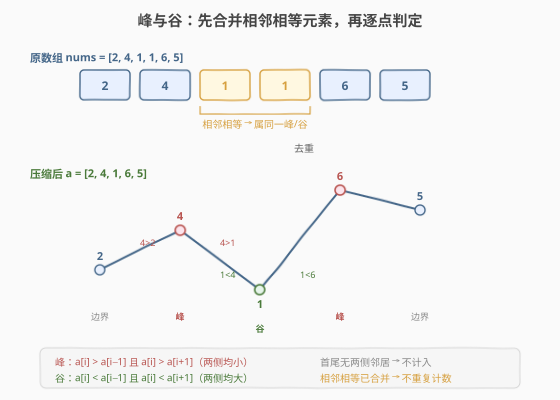
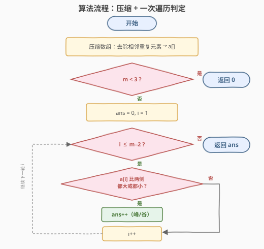
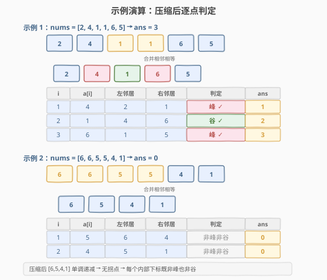

# LeetCode 统计数组中峰和谷的数量 题解

## 1. 题目概述

- **标题 / 题号**：统计数组中峰和谷的数量（#2210，easy）
- **链接**：https://leetcode.cn/problems/count-hills-and-valleys-in-an-array/
- **难度**：简单
- **标签**：数组、模拟、一次遍历

**题意**：给你一个下标从 **0** 开始的整数数组 `nums`。如果两侧距 `i` 最近的不相等邻居的值**均小于** `nums[i]`，则下标 `i` 是某个**峰**的一部分；如果两侧距 `i` 最近的不相等邻居的值**均大于** `nums[i]`，则下标 `i` 是某个**谷**的一部分。

对于相邻下标 `i` 和 `j`，如果 `nums[i] == nums[j]`，则认为这两下标属于**同一个**峰或谷。注意，要使某个下标成为峰或谷的一部分，它左右两侧必须**都**存在不相等邻居。

返回 `nums` 中峰和谷的数量。

**示例 1**：

```text
输入：nums = [2, 4, 1, 1, 6, 5]
输出：3
解释：
  下标 1（值 4）：左邻居 2、右邻居 1，4 > 2 且 4 > 1 → 峰
  下标 2（值 1）：左邻居 4、右邻居 6，1 < 4 且 1 < 6 → 谷
  下标 3（值 1）：与下标 2 属同一谷，不重复计数
  下标 4（值 6）：左邻居 1、右邻居 5，6 > 1 且 6 > 5 → 峰
  共 3 个峰和谷。
```

**示例 2**：

```text
输入：nums = [6, 6, 5, 5, 4, 1]
输出：0
解释：压缩后 [6, 5, 4, 1] 单调递减，无任何拐点 → 0 个峰和谷。
```

**约束**：

- $3 \le \text{nums.length} \le 100$
- $1 \le \text{nums[i]} \le 100$

> 💡 题眼在于「相邻相等属同一峰/谷」+「最近不相等邻居」。如果直接逐下标判定，相邻相等的位置会重复计数，需要去重。**先压缩（合并相邻相等元素），再对压缩后数组的每个内部下标做一次比较**，即可干净地解决去重问题。

## 2. 解题思路

### 2.1 暴力思路：逐下标找最近不相等邻居

对每个下标 `i`（$1 \le i \le n-2$），向左扫描找到最近的 `j` 使 `nums[j] != nums[i]`，向右扫描找到最近的 `k` 使 `nums[k] != nums[i]`。若两侧均存在，则判定峰/谷。

但这样会**重复计数**：示例 1 中下标 2 和下标 3 都是值 1，左右邻居相同（4 和 6），会被分别判定为谷，而题意要求它们算**同一个**谷。补救方法是只计数「每个等值段的起始位置」，但这本质上就是在做压缩。

单次找邻居 $O(n)$，共 $n$ 个位置，总时间 $O(n^2)$。$n \le 100$ 时可过，但不够优雅。

> ⚠️ 暴力法的核心痛点不是时间复杂度，而是**去重逻辑容易写错**。「相邻相等属同一峰/谷」这一规则，最自然的实现就是先把相邻相等元素合并——即压缩。

### 2.2 核心观察：压缩后逐点判定



**观察一：相邻相等元素合并后不影响判定**

题意说「相邻下标 `nums[i] == nums[j]` 属同一峰/谷」。这意味着一段连续相等的值整体构成一个「组」，组的左右邻居就是两侧最近的不相等值。把相邻相等元素压缩成一个代表值后，**组的判定等价于代表值的判定**——代表值的左右邻居恰好就是压缩后数组中的前后元素。

**观察二：压缩后每个内部下标独立判定**

压缩后数组 `a = [a₀, a₁, …, aₘ₋₁]` 中**没有相邻相等元素**（已被合并）。因此对任意内部下标 `i`（$1 \le i \le m-2$），`a[i-1]` 和 `a[i+1]` 就是 `a[i]` 的最近不相等邻居，无需再扫描寻找：

$$\text{峰} \iff a[i] > a[i-1] \;\land\; a[i] > a[i+1]$$

$$\text{谷} \iff a[i] < a[i-1] \;\land\; a[i] < a[i+1]$$

**观察三：首尾不计入**

压缩后数组的首元素 `a[0]` 无左邻居，尾元素 `a[m-1]` 无右邻居，均不满足「两侧都有不相等邻居」的条件，故遍历范围为 $i \in [1, m-2]$。若 $m < 3$，则没有任何内部下标，直接返回 0。

> 💡 **乘积判别技巧**：峰和谷的判定可合并为一个表达式——$(a[i] - a[i-1]) \times (a[i] - a[i+1]) > 0$。当 `a[i]` 同时大于两侧（差均为正）或同时小于两侧（差均为负）时，乘积为正；若 `a[i]` 介于两侧之间（一正一负），乘积为负，既非峰也非谷。

### 2.3 算法流程图



算法步骤总结：

1. **压缩数组**：遍历 `nums`，跳过与前一个相同的元素，得到无相邻重复的数组 `a`。
2. **边界检查**：若 `m = len(a) < 3`，返回 0。
3. **逐点判定**：`for i = 1 to m-2`：若 `a[i]` 比两侧都大或都小，`ans++`。
4. **返回** `ans`。

### 2.4 示例演算

以示例 1 `nums = [2, 4, 1, 1, 6, 5]`（答案 3）和示例 2 `nums = [6, 6, 5, 5, 4, 1]`（答案 0）逐步演算：



**示例 1 要点**：原数组中两个 `1` 合并为一个，压缩后 `[2, 4, 1, 6, 5]`。`i=1`（值 4）两侧均小 → 峰；`i=2`（值 1）两侧均大 → 谷；`i=3`（值 6）两侧均小 → 峰。合计 3。

**示例 2 要点**：原数组中两对 `6,6` 和 `5,5` 分别合并，压缩后 `[6, 5, 4, 1]` 单调递减。`i=1`（值 5）：`5 < 6` 但 `5 > 4`，一升一降 → 非峰非谷；`i=2`（值 4）：`4 < 5` 但 `4 > 1`，同理跳过。合计 0。

> 💡 **单调序列无峰谷**：若压缩后数组单调（递增或递减），则每个内部元素都介于两侧之间，一正一负，乘积为负，答案恒为 0。这是判定「无峰谷」的充分条件。

## 3. 参考代码

### C++：压缩 + 一次遍历（$O(n)$ / $O(n)$）

```cpp
class Solution {
public:
    int countHillValley(vector<int>& nums) {
        vector<int> a;
        for (int x : nums) {
            if (a.empty() || a.back() != x) {
                a.push_back(x);
            }
        }
        int m = a.size();
        int ans = 0;
        for (int i = 1; i + 1 < m; ++i) {
            int dl = a[i] - a[i - 1];
            int dr = a[i] - a[i + 1];
            if (dl * dr > 0) {
                ++ans;
            }
        }
        return ans;
    }
};
```

### Python：压缩 + 一次遍历（$O(n)$ / $O(n)$）

```python
class Solution:
    def countHillValley(self, nums: List[int]) -> int:
        a = []
        for x in nums:
            if not a or a[-1] != x:
                a.append(x)
        m = len(a)
        ans = 0
        for i in range(1, m - 1):
            if (a[i] - a[i - 1]) * (a[i] - a[i + 1]) > 0:
                ans += 1
        return ans
```

### Python：`groupby` 一行压缩 + 生成器计数

```python
from itertools import groupby

class Solution:
    def countHillValley(self, nums: List[int]) -> int:
        a = [k for k, _ in groupby(nums)]
        return sum(
            (a[i] - a[i - 1]) * (a[i] - a[i + 1]) > 0
            for i in range(1, len(a) - 1)
        )
```

> 💡 `itertools.groupby` 按连续相同值分组，`k for k, _ in groupby(nums)` 恰好就是「去除相邻重复」后的数组，与手写压缩逻辑等价但更简洁。

## 4. 复杂度分析

| 维度 | 复杂度 | 说明 |
|------|--------|------|
| **时间复杂度** | $O(n)$ | 压缩遍历一次 $O(n)$；判定遍历压缩后数组 $O(m)$，$m \le n$ |
| **空间复杂度** | $O(n)$ | 压缩数组最坏 $m = n$（无相邻重复时）；可用 $O(1)$ 在线法优化（见第 5 节） |

> 💡 本题 $n \le 100$，即使 $O(n^2)$ 暴力也能通过。重点在于正确处理「相邻相等属同一峰/谷」的去重逻辑，而非时间优化。

## 5. 扩展：$O(1)$ 空间在线判定

压缩法需要 $O(n)$ 额外空间存储压缩数组。实际上无需显式建数组——**在线维护三个连续不等值 `prev / curr / next`**，遇到新值时立即判定 `curr` 即可：

```python
class Solution:
    def countHillValley(self, nums: List[int]) -> int:
        ans = 0
        prev = nums[0]
        i = 1
        while i < len(nums) and nums[i] == prev:
            i += 1
        if i >= len(nums):
            return 0
        curr = nums[i]
        i += 1
        while i < len(nums):
            if nums[i] == curr:
                i += 1
                continue
            nxt = nums[i]
            if (curr - prev) * (curr - nxt) > 0:
                ans += 1
            prev = curr
            curr = nxt
            i += 1
        return ans
```

**原理**：`prev` 是 `curr` 之前最近的不等值，`nxt` 是 `curr` 之后最近的不等值——三者恰好是压缩数组中连续的三个元素。每当 `nums[i] != curr` 时，`curr` 的两侧邻居都已确定，可立即判定并滚动前移（`prev = curr, curr = nxt`）。空间 $O(1)$，时间仍 $O(n)$。

> ⚠️ **初始化陷阱**：`prev` 和 `curr` 必须是前两个**不等的**值。若数组开头有连续重复（如 `[6,6,5,...]`），需先跳过开头的重复段才能正确定位 `prev = 6, curr = 5`。这一步容易被忽略，是 $O(1)$ 法最常见的 WA 来源。

## 6. 面试要点

1. **为什么要先压缩数组？**

   - 题目规定「相邻下标值相等则属同一峰/谷」。若逐下标判定，一段连续相等的值会被重复计数。压缩（合并相邻相等元素）后，每个值代表一个「组」，组的判定等价于代表值的判定，天然避免重复计数。

2. **压缩后为什么直接看 `a[i-1]` 和 `a[i+1]` 就够了？**

   - 压缩后数组无相邻相等元素，所以 `a[i-1] != a[i]` 且 `a[i+1] != a[i]` 恒成立。`a[i-1]` 就是 `a[i]` 左侧最近的不相等邻居，`a[i+1]` 就是右侧最近的不相等邻居，无需额外扫描。

3. **乘积判别技巧 `(a[i]-a[i-1])*(a[i]-a[i+1]) > 0` 是什么原理？**

   - 峰：`a[i]` 同时大于两侧 → 两个差都为正 → 乘积为正。谷：同时小于两侧 → 两个差都为负 → 负×负=正。介于两侧之间 → 一正一负 → 乘积为负。一个表达式统一了峰和谷的判定。

4. **首尾元素为什么不计入？**

   - 题目要求「左右两侧都存在不相等邻居」。压缩后数组的首元素无左邻居、尾元素无右邻居，不满足条件。因此遍历范围为 `[1, m-2]`，$m < 3$ 时直接返回 0。

5. **能否不用额外空间？**

   - 可以。在线维护 `prev / curr / next` 三个最近不等值，遇到新值时立即判定 `curr` 并滚动前移，空间 $O(1)$。但初始化需跳过开头重复段，代码稍复杂。面试中优先写压缩法（清晰不易错），再提 $O(1)$ 法作为优化。

> 💡 **一句话总结**：2210 是「相邻相等去重 + 逐点比较」的模板题——先压缩数组去除相邻重复，再对每个内部下标用 `(a[i]-a[i-1])*(a[i]-a[i+1]) > 0` 判定峰谷，$O(n)$ 一趟搞定。

## 同类练习题

| # | 题目 | 与本题的关联 |
|---|------|-------------|
| 845 | [数组中的最长山脉](https://leetcode.cn/problems/longest-mountain-in-array/) | 基于相邻差判定上升/下降段，run-based 双指针求最长山脉长度，本题「分组」思路的进阶形态 |
| 941 | [有效的山脉数组](https://leetcode.cn/problems/valid-mountain-array/) | 判定数组是否构成严格单峰山脉，本题「单峰」的严格判定版（必须先增后减） |
| 162 | [寻找峰值](https://leetcode.cn/problems/find-peak-element/) | 二分 $O(\log n)$ 找任意一个峰元素，对照本题 $O(n)$ 全量扫描计数，体会「找任一个 vs 数全部」的复杂度差异 |
| 2012 | [数组美丽值求和](https://leetcode.cn/problems/sum-of-beauty-in-the-array/) | 同样基于相邻元素比较求统计量，中等难度，判定条件更分级 |
