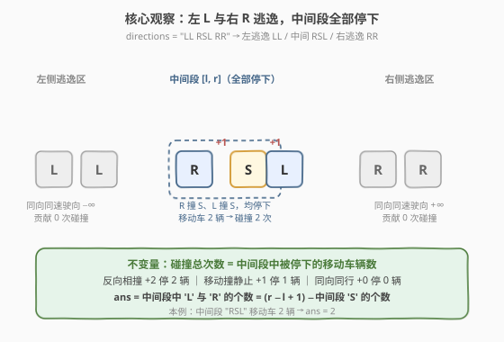
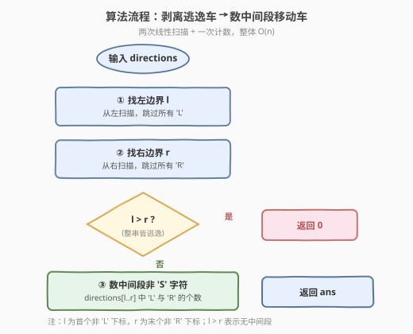
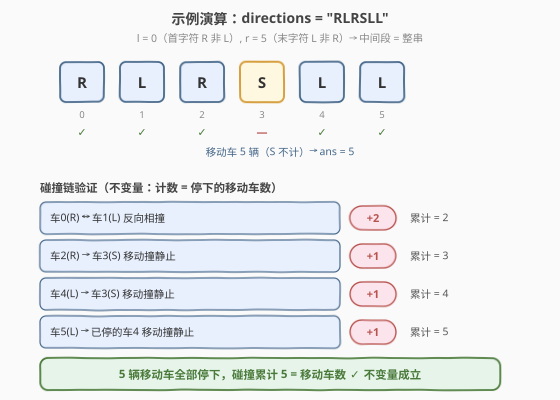

# 统计道路上的碰撞次数

- **题目名称**：统计道路上的碰撞次数
- **链接**：[2211. 统计道路上的碰撞次数](https://leetcode.cn/problems/count-collisions-on-a-road/)
- **难度**：中等
- **标签**：栈、字符串、模拟

## 1. 题目概述

在一条无限长的公路上有 `n` 辆汽车行驶，从左到右编号 `0` 到 `n-1`，每辆车都在**唯一**的位置。给定字符串 `directions`（长度 `n`），`directions[i]` 为 `'L'`（向左）、`'R'`（向右）或 `'S'`（停留）。所有移动的车**速度相同**。碰撞计数规则：

- 两辆**方向相反**的移动车相撞：$+2$；
- 一辆移动车撞一辆**静止**车：$+1$。

碰撞后涉及的车辆停在碰撞位置，不再移动；除此之外车辆不改变状态或方向。返回碰撞**总次数**。

**示例 1**：

```text
输入：directions = "RLRSLL"
输出：5
解释：
  车 0 (R) 与车 1 (L) 反向相撞 → +2，均停下
  车 2 (R) 撞车 3 (S) → +1，车 2 停下
  车 4 (L) 撞车 3 (S) → +1，车 4 停下
  车 5 (L) 撞已停下的车 4 → +1，车 5 停下
  合计 2 + 1 + 1 + 1 = 5
```

**示例 2**：

```text
输入：directions = "LLRR"
输出：0
解释：左侧两辆 L 同向驶向 -∞，右侧两辆 R 同向驶向 +∞，互不追尾，无碰撞。
```

**约束条件**：

- $1 \le \text{directions.length} \le 10^5$
- `directions[i]` $\in \{`L`, `R`, `S`\}$

> 💡 题眼在「碰撞后停下」这一约束：一旦某辆车停下，它就变成后续车辆的「墙」。直觉会让人想去模拟一整条碰撞链，但其实存在一个**不变量**——碰撞总次数恰等于「最终被停下的移动车辆数」。抓住它，问题就坍缩成「剥离逃逸车 + 数中间段移动车」的一次扫描。

---

## 2. 解题思路

### 2.1 暴力思路：逐事件物理模拟

最直观的做法是真正「演一遍」碰撞过程：维护每辆车的当前状态（方向 / 是否已停），反复扫描所有相邻活动车对，找出最先碰撞的一对，结算该碰撞（$+2$ 或 $+1$），把涉及车辆标记为停下，重复直到没有任何可碰撞的车对。

每次扫描 $O(n)$；链式场景（如 `"RRRR...S"`）会触发 $O(n)$ 次碰撞事件（最右的 R 先撞 S 停下，次右的 R 再撞这堵「墙」停下，逐个传递），总计 $O(n^2)$，在 $n = 10^5$ 下不可行。此外位置是实数（题只保证唯一不保证整数），按时刻排序碰撞事件实现繁琐、易错。

> ⚠️ 暴力法的瓶颈在于「逐事件结算」——它把每一条碰撞链都展开成一串独立事件。突破口是发现**不必关心碰撞顺序**：所有被停下的移动车加起来就是答案，与谁先撞谁无关。

### 2.2 核心观察：边界逃逸 + 不变量计数



**观察一：左侧连续的 `L` 永远不碰撞（向左逃逸）**

最左边的车若为 `L`，它左侧无车，直接驶向 $-\infty$；若前 $k$ 辆车都是 `L`，它们同向同速、间距不变，互不追尾，全部从左侧逃逸，贡献 $0$ 次碰撞。

**观察二：右侧连续的 `R` 永远不碰撞（向右逃逸）**

对称地，最右边的 `R` 右侧无车，驶向 $+\infty$；连续的 `R` 同向同速，从右侧逃逸，贡献 $0$。

**观察三：中间段 $[l, r]$ 的所有车最终都会停下**

设 $l$ 为首个非 `L` 下标、$r$ 为末个非 `R` 下标，则中间段满足 $\text{directions}[l] \in \{R, S\}$、$\text{directions}[r] \in \{L, S\}$。中间段被两端「夹住」：

- 左端不向左逃逸（不是 `L`），右端不向右逃逸（不是 `R`）；
- 向右行的 `R` 会被右端的 `L`/`S` 或途中已停的车拦下；
- 向左行的 `L` 会被左端的 `R`/`S` 或已停的车拦下。

于是中间段没有车能逃逸，所有车最终都停在公路上。

**观察四（不变量）：碰撞总次数 = 中间段中移动车辆数**

关键是发现每次碰撞的**计数 = 它停下的移动车辆数**：

| 碰撞类型 | 涉及移动车 | 计数 | 被停下的移动车 |
|----------|-----------|------|---------------|
| 反向相撞 `R` vs `L` | 2 辆 | $+2$ | 2 辆 |
| 移动撞静止 `R`/`L` vs `S` | 1 辆 | $+1$ | 1 辆 |
| 同向同行 `R`-`R` / `L`-`L` | — | $0$（同速不追尾） | 0 |

> ⚠️ 注意「同向不追尾」：两辆同向移动的车速度相同，间距恒定，永远不碰撞。只有当**前方那辆停下**后，后方同向车才会撞上——而此时被撞方已是静止车，按「移动撞静止」$+1$ 结算，仍满足「计数 = 停下的移动车数」。

因此把所有碰撞事件累加，**总计数 = 总共被停下的移动车辆数**。结合观察三，中间段的移动车（`L`/`R`）全部被停下，边界外的逃逸车一辆也没停。故：

$$\text{碰撞数} = \text{中间段中 } `L` \text{ 与 } `R` \text{ 的个数} = (r - l + 1) - \text{中间段 } `S` \text{ 的个数}$$

> 💡 这是一个典型的**不变量降维**：不去模拟「谁先撞谁、撞几次」，而是抓住「每单位计数对应一辆被停下的移动车」这个守恒关系，把动态过程折叠成一次静态计数。

### 2.3 算法流程图



算法步骤：

1. **找左边界 $l$**：从左扫描，跳过所有 `'L'`，停在首个非 `'L'` 字符。
2. **找右边界 $r$**：从右扫描，跳过所有 `'R'`，停在末个非 `'R'` 字符。
3. **若 $l > r$**：整串全是逃逸车（如 `"LLRR"`），返回 $0$。
4. **数中间段**：统计 $\text{directions}[l..r]$ 中不等于 `'S'` 的字符个数，即为答案。

### 2.4 示例演算

以 `directions = "RLRSLL"` 为例：



**第一步：剥离边界逃逸车**

| 方向 | 扫描 | 结果 |
|------|------|------|
| 左边界 $l$ | `directions[0] = 'R'` ≠ `'L'`，无需跳过 | $l = 0$ |
| 右边界 $r$ | `directions[5] = 'L'` ≠ `'R'`，无需跳过 | $r = 5$ |

中间段 = `"RLRSLL"`（整串，无逃逸车）。

**第二步：数中间段移动车**

| 下标 | 字符 | 移动车? | 说明 |
|------|------|---------|------|
| 0 | `R` | ✓ | 向右 |
| 1 | `L` | ✓ | 向左 |
| 2 | `R` | ✓ | 向右 |
| 3 | `S` | ✗ | 静止，不计 |
| 4 | `L` | ✓ | 向左 |
| 5 | `L` | ✓ | 向左 |

移动车共 **5** 辆 → 答案 $= 5$ ✓

**第三步：用碰撞链验证不变量**

| 事件 | 碰撞 | 计数 | 停下的移动车 | 累计 |
|------|------|------|-------------|------|
| 1 | 车 0 (R) ↔ 车 1 (L) 反向 | $+2$ | 车 0、车 1 | 2 |
| 2 | 车 2 (R) → 车 3 (S) | $+1$ | 车 2 | 3 |
| 3 | 车 4 (L) → 车 3 (S) | $+1$ | 车 4 | 4 |
| 4 | 车 5 (L) → 已停的车 4 | $+1$ | 车 5 | 5 |

5 辆移动车全部停下，累计 $5$ ——与「数移动车」结果一致，不变量成立。

> 💡 对比示例 2 `"LLRR"`：$l$ 跳过前两个 `L` 得 $l=2$，$r$ 跳过后两个 `R` 得 $r=1$，$l > r$，返回 $0$ ✓。

---

## 3. 参考代码

### C++

```cpp
// 统计道路上的碰撞次数 —— 不变量计数 O(n)
// 编译: g++ -O2 -std=c++17 solution.cpp -o cc
#include <string>
using namespace std;

class Solution {
public:
    int countCollisions(string directions) {
        int n = directions.size();
        int l = 0, r = n - 1;
        while (l < n && directions[l] == 'L') l++;   // 跳过左侧逃逸的 L
        while (r >= 0 && directions[r] == 'R') r--;   // 跳过右侧逃逸的 R
        int ans = 0;
        for (int i = l; i <= r; i++) {
            if (directions[i] != 'S') ans++;         // 中间段每辆移动车贡献 1
        }
        return ans;
    }
};
```

### Python

```python
class Solution:
    def countCollisions(self, directions: str) -> int:
        n = len(directions)
        l, r = 0, n - 1
        while l < n and directions[l] == 'L':
            l += 1                               # 跳过左侧逃逸的 L
        while r >= 0 and directions[r] == 'R':
            r -= 1                               # 跳过右侧逃逸的 R
        return sum(1 for i in range(l, r + 1) if directions[i] != 'S')
```

> 💡 **Python 一行版**：`directions.lstrip('L').rstrip('R')` 恰好得到中间段——`lstrip('L')` 去掉前缀所有 `L`（即下标 $0..l-1$），对结果 `rstrip('R')` 去掉后缀所有 `R`（即下标 $r+1..n-1$），剩下正是 $\text{directions}[l..r]$。于是 `return sum(c != 'S' for c in directions.lstrip('L').rstrip('R'))`。两步 `strip` 各 $O(n)$，整体仍 $O(n)$。
>
> ⚠️ **数据范围**：$n \le 10^5$，答案上界 $10^5$，32 位 `int` 足够，无需 `long long`。

---

## 4. 复杂度分析

| 维度 | 复杂度 | 说明 |
|------|--------|------|
| **时间复杂度** | $O(n)$ | 左、右各一次线性扫描定 $l$、$r$，中间段一次扫描计数；总共遍历每个字符至多 3 次，线性 |
| **空间复杂度** | $O(1)$ | 仅用 $l$、$r$、$ans$ 三个变量，与输入规模无关 |

> ⚠️ 暴力逐事件模拟 $O(n^2)$ 的根源是「把链式碰撞展开成一串事件」。不变量把「$k$ 辆车连环撞」整段折叠成一个数 $k$，无需逐个结算，故降到 $O(n)$。

---

## 5. 扩展：栈模拟——直接建模碰撞链

不变量法虽然简洁，但跳过了碰撞的动态过程。若面试官追问「如何不靠不变量、直接模拟出碰撞过程」，可用**栈**从左到右扫描，维护一串「待结算的向右行驶车」计数 `r_cnt`：

```python
def countCollisions(self, directions: str) -> int:
    n = len(directions)
    i = 0
    while i < n and directions[i] == 'L':    # 跳过左侧逃逸 L
        i += 1
    ans = 0
    r_cnt = 0                                 # 当前向右行驶、尚未撞停的车数
    while i < n:
        c = directions[i]
        if c == 'R':
            r_cnt += 1                        # 入列，待后续结算
        elif c == 'S':
            ans += r_cnt                      # 这堵墙拦下所有待结算 R，各 +1
            r_cnt = 0
        else:                                 # c == 'L'
            if r_cnt > 0:
                ans += 2                      # 最右的 R 与本 L 反向相撞 +2
                r_cnt -= 1
                ans += r_cnt                  # 其余待结算 R 撞这堵新墙，各 +1
                r_cnt = 0
            else:
                ans += 1                      # 左侧已有静止墙（S 或碰撞堆），L 撞之 +1
        i += 1
    return ans                                # 末尾 r_cnt 为右侧逃逸 R，不计
```

**正确性要点**：

- `r_cnt` 跟踪「当前向右行驶、随时可能被前方拦下的车数」。遇 `S` 时它们逐个撞墙（各 $+1$）；遇 `L` 时最右那辆与 `L` 反向相撞（$+2$），余下的撞这堵新墙（各 $+1$）。
- `c == 'L'` 且 `r_cnt == 0`：说明左侧已有静止物（必为 `S` 或之前的碰撞堆，因为左侧逃逸 `L` 已被前置循环跳过），故 `L` 撞之 $+1$。
- 循环结束时残留的 `r_cnt` 即右侧逃逸 `R`，贡献 $0$。

对 `"RLRSLL"` 的栈模拟轨迹：`R`(r_cnt=1) → `L`(ans+=2, r_cnt=0) → `R`(r_cnt=1) → `S`(ans+=1, r_cnt=0) → `L`(r_cnt=0, ans+=1) → `L`(r_cnt=0, ans+=1) → 得 $5$ ✓。

> 💡 栈模拟与不变量法殊途同归：前者逐事件结算、显式建模碰撞链（$O(n)$ 但状态多）；后者抓住「计数 = 停下的移动车数」直接折叠（$O(n)$ 且无状态）。理解栈模拟能反向印证不变量的正确性——把栈模拟中所有 `+=` 求和，正好等于中间段移动车数。

---

## 6. 面试要点

1. **为什么左侧 `L` 和右侧 `R` 一定逃逸、不参与碰撞？**

   - 最左侧的 `L` 左边无车，无碰撞对象，驶向 $-\infty$；连续的 `L` 同向同速、间距不变，互不追尾，整段逃逸。右侧 `R` 对称。故先剥离这两段，剩下的中间段才是碰撞发生区。

2. **核心不变量是什么？为什么成立？**

   - 「碰撞总次数 = 最终被停下的移动车辆数」。因为每类碰撞的计数都等于它停下的移动车数：反向 $+2$ 停 2 辆，移动撞静止 $+1$ 停 1 辆；同向同速不追尾（$+0$ 停 0 辆）。把所有事件求和，计数总和 = 停下的移动车总和。

3. **为什么中间段所有车最终都停下？**

   - 中间段左端不是 `L`（不向左逃逸）、右端不是 `R`（不向右逃逸），被两端「夹住」。向右的 `R` 会被右端 `L`/`S` 或途中停下的车拦下，向左的 `L` 会被左端 `R`/`S` 或停下的车拦下，无人能逃逸，故全部停下。

4. **同向行驶的两辆车会追尾吗？**

   - 都在移动时不会——速度相同、间距恒定。只有当**前方那辆因碰撞停下**后，后方同向车才会撞上。此时被撞方已是静止车，按「移动撞静止」$+1$ 结算，仍满足不变量。这也是为何「`RRRRS`」会产生 $n-1$ 次碰撞：从右到左逐个撞墙。

5. **如果不变量没想起来，如何直接模拟？**

   - 用栈维护待结算的 `R` 计数 `r_cnt`，从左到右一次扫描：遇 `R` 入列，遇 `S` 全部撞墙（各 $+1$），遇 `L` 则最右 `R` 与之反向相撞（$+2$）、其余撞新墙（各 $+1$）。仍是 $O(n)$，但需处理 `r_cnt==0` 时 `L` 撞左侧静止墙的情况，状态比不变量法繁琐。

> 💡 **一句话总结**：2211 的精髓是**不变量降维**——抓住「碰撞计数 = 被停下的移动车数」，把动态碰撞链折叠成「剥离左右逃逸车 + 数中间段 `L`/`R`」的一次 $O(n)$ 扫描。难点不在编码，而在**相信不必模拟**。

---

## 7. 同类练习题

- [735. 行星碰撞](https://leetcode.cn/problems/asteroid-collision/)：栈模拟左右移动天体相撞，本题「直接建模」的姊妹题（2211 用不变量折叠，735 用栈逐个结算，互为镜像）
- [1046. 最后一块石头的重量](https://leetcode.cn/problems/last-stone-weight/)：每次取两块最大石头相撞消去，大根堆模拟碰撞，碰撞族的另一形态
- [2197. 替换数组中的非互质数](https://leetcode.cn/problems/replace-non-coprime-numbers-in-array/)：栈 + 相邻合并消去，同为「从左到右扫描、遇条件结算」的过程式归约
- [1753. 移除石子的最大得分](https://leetcode.cn/problems/maximum-score-from-removing-stones/)：数学不变量替代模拟，同为「找守恒关系直接计数、跳过过程」的思路
- [150. 逆波兰表达式求值](https://leetcode.cn/problems/evaluate-reverse-polish-notation/)：栈求值招牌题，与本文扩展节的栈模拟同属「扫描 + 栈结算」骨架
