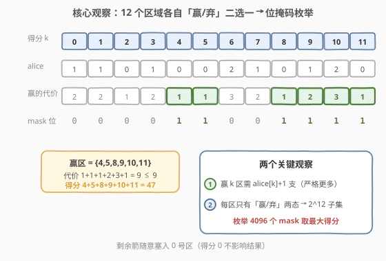
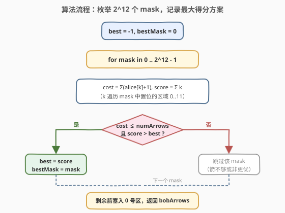
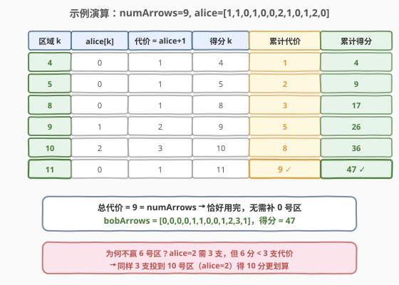

# LeetCode 射箭比赛中的最大得分 题解

## 1. 题目概述

- **标题 / 题号**：射箭比赛中的最大得分（#2212，medium）
- **链接**：https://leetcode.cn/problems/maximum-points-in-an-archery-competition/
- **难度**：中等
- **标签**：位运算、枚举、回溯

**题意**：Alice 和 Bob 进行一场射箭比赛，两人各射 `numArrows` 支箭。箭靶有 `12` 个计分区域，编号 `0` 到 `11`，区域 `k` 的得分就是 `k` 分。Alice 在区域 `k` 射中 `aliceArrows[k]` 支，Bob 需要决定自己在每个区域射中多少支（记为 `bobArrows[k]`，总和恰为 `numArrows`）。

得分规则：对每个区域 `k`，若 $a_k \geq b_k$ 则 Alice 得 $k$ 分；若 $a_k < b_k$ 则 Bob 得 $k$ 分；若 $a_k = b_k = 0$ 则无人得分。Bob 想最大化自己的总分，返回任意一种最优的 `bobArrows`。

**示例 1**：

```text
输入：numArrows = 9, aliceArrows = [1,1,0,1,0,0,2,1,0,1,2,0]
输出：[0,0,0,0,1,1,0,0,1,2,3,1]
解释：Bob 赢得区域 4,5,8,9,10,11，得分 4+5+8+9+10+11 = 47。
```

**示例 2**：

```text
输入：numArrows = 3, aliceArrows = [0,0,1,0,0,0,0,0,0,0,0,2]
输出：[0,0,0,0,0,0,0,0,1,1,1,0]
解释：Bob 赢得区域 8,9,10，得分 8+9+10 = 27。
```

**约束**：

- $1 \leq \text{numArrows} \leq 10^5$
- $\text{aliceArrows.length} == \text{bobArrows.length} == 12$
- $0 \leq \text{aliceArrows}[i], \text{bobArrows}[i] \leq \text{numArrows}$
- $\sum \text{aliceArrows}[i] == \text{numArrows}$

> 💡 **审题关键**：① **严格更多才赢**——Bob 赢区域 `k` 当且仅当 $b_k > a_k$，即至少投 $a_k + 1$ 支；投得「刚好相等」仍算 Alice 赢；② **区域只有 12 个**，每个区域 Bob 只有「赢/弃」两种有意义的选择（投了却没赢纯属浪费箭），因此可枚举 $2^{12} = 4096$ 个子集；③ **剩余箭不影响得分**——多出的箭可塞入任意已赢区域或 `0` 号区，不改变胜负，只需保证总和等于 `numArrows`。

## 2. 解题思路

### 2.1 暴力思路：枚举 Bob 赢的区域子集

最直接的做法：Bob 对每个区域要么「赢」（投 $a_k + 1$ 支），要么「弃」（投 $0$ 支）。这样共有 $2^{12} = 4096$ 种组合，对每种组合计算所需总箭数与可得总分，挑选满足「总箭数 $\leq$ `numArrows`」且得分最大的方案。

- **正确性**：对任意区域，Bob 投 $b_k$ 支有两种结果——$b_k > a_k$ 赢得 $k$ 分，或 $b_k \leq a_k$ 不得分。若 Bob 决定赢某区域，最优投数恰为 $a_k + 1$（多投无益、徒耗箭）；若决定不赢，投 $0$ 最省。因此最优解必在「每个区域投 $0$ 或 $a_k+1$」的方案中。
- **效率**：$2^{12} \times 12 \approx 5 \times 10^4$ 次操作，毫秒级。

> ⚠️ **为何不必考虑「投 $b_k$ 介于 $1$ 和 $a_k$ 之间」？** 这种情况既不得分又浪费箭，严格劣于投 $0$；把省下的箭投到能赢的区域或 `0` 号区，结果只会更好或持平。

### 2.2 核心观察：12 区域二选一 → 位掩码枚举



整个解法建立在**两个关键观察**上。

**观察 1：赢区域 `k` 的最小代价是 $a_k + 1$**

Bob 要让 $b_k > a_k$，最少投 $a_k + 1$ 支。这是该区域的「赢的代价」。多投不增加得分，纯属浪费——因此一旦决定赢某区，就精准投 $a_k + 1$ 支。

**观察 2：每区域只有「赢/弃」两态 → $2^{12}$ 子集**

12 个区域，每个区域独立决定赢或弃，共 $2^{12} = 4096$ 种「赢区集合」。用 12 位整数 `mask` 编码：第 `k` 位为 `1` 表示赢区域 `k`。对每个 `mask`：

$$\text{cost}(\text{mask}) = \sum_{k \in \text{mask}} (a_k + 1), \qquad \text{score}(\text{mask}) = \sum_{k \in \text{mask}} k$$

当 $\text{cost}(\text{mask}) \leq \text{numArrows}$ 时方案可行，取使 $\text{score}$ 最大的 `mask` 即可。

> 💡 **剩余箭处理**：若 $\text{cost}(\text{mask}) < \text{numArrows}$，多出的 `numArrows - cost` 支箭塞入 `0` 号区（得分 `0`，无论胜负都不影响总分），或塞入任意已赢区域（已赢则更多箭仍赢）。塞 `0` 号区最简单且绝对安全。

### 2.3 算法流程图



**完整步骤**：

1. 初始化 `best = -1`，`bestMask = 0`。
2. **外层循环** `mask` 从 `0` 到 `2^12 - 1`：
   - `cost = 0`，`score = 0`。
   - **内层循环** `k` 从 `0` 到 `11`：若 `mask` 第 `k` 位为 `1`，则 `cost += aliceArrows[k] + 1`，`score += k`。
   - 若 `cost <= numArrows` 且 `score > best`：`best = score`，`bestMask = mask`。
3. 按 `bestMask` 构造 `bobArrows`：第 `k` 位为 `1` 则 `bobArrows[k] = aliceArrows[k] + 1`，否则 `0`。
4. `bobArrows[0] += numArrows - sum(bobArrows)`（剩余塞入 `0` 号区）。
5. **返回** `bobArrows`。

> 💡 **写法要点**：① `best` 初始化为 `-1` 而非 `0`，确保 `mask = 0`（全弃）也能被记录——此时得分 `0` 仍是合法方案；② 第 `k` 位判定用 `mask >> k & 1`；③ 剩余箭塞 `0` 号区时注意 `0` 号区可能本身已赢（`aliceArrows[0]+1` 支），追加后仍赢，无副作用。

### 2.4 示例演算

以示例 1 `numArrows = 9, aliceArrows = [1,1,0,1,0,0,2,1,0,1,2,0]` 演算最优方案 `mask = {4,5,8,9,10,11}`：



**逐区拆解**：

| 区域 k | alice[k] | 代价 = alice+1 | 得分 k | 累计代价 | 累计得分 |
|--------|----------|----------------|--------|----------|----------|
| 4 | 0 | 1 | 4 | 1 | 4 |
| 5 | 0 | 1 | 5 | 2 | 9 |
| 8 | 0 | 1 | 8 | 3 | 17 |
| 9 | 1 | 2 | 9 | 5 | 26 |
| 10 | 2 | 3 | 10 | 8 | 36 |
| 11 | 0 | 1 | 11 | 9 | 47 |

总代价 $9 = \text{numArrows}$ 恰好用完，`bobArrows = [0,0,0,0,1,1,0,0,1,2,3,1]`，得分 $47$。✓

> 💡 **为何不赢 6 号区？** `alice[6] = 2`，赢需 `3` 支但只得 `6` 分；同样 `3` 支投到 `10` 号区（`alice[10] = 2`）可得 `10` 分。枚举会自动比较所有组合并选出性价比最高的子集。

## 3. 参考代码

### 方法一：位掩码枚举（$O(2^{12} \cdot 12)$，推荐）

### C++

```cpp
class Solution {
public:
    vector<int> maximumBobPoints(int numArrows, vector<int>& aliceArrows) {
        int best = -1, bestMask = 0;
        for (int mask = 0; mask < (1 << 12); ++mask) {
            int cost = 0, score = 0;
            for (int k = 0; k < 12; ++k) {
                if (mask >> k & 1) {
                    cost += aliceArrows[k] + 1;
                    score += k;
                }
            }
            if (cost <= numArrows && score > best) {
                best = score;
                bestMask = mask;
            }
        }
        vector<int> bobArrows(12, 0);
        int used = 0;
        for (int k = 0; k < 12; ++k) {
            if (bestMask >> k & 1) {
                bobArrows[k] = aliceArrows[k] + 1;
                used += bobArrows[k];
            }
        }
        bobArrows[0] += numArrows - used;
        return bobArrows;
    }
};
```

### Python

```python
class Solution:
    def maximumBobPoints(self, numArrows: int, aliceArrows: list[int]) -> list[int]:
        best, best_mask = -1, 0
        for mask in range(1 << 12):
            cost = score = 0
            for k in range(12):
                if mask >> k & 1:
                    cost += aliceArrows[k] + 1
                    score += k
            if cost <= numArrows and score > best:
                best, best_mask = score, mask
        bob = [0] * 12
        used = 0
        for k in range(12):
            if best_mask >> k & 1:
                bob[k] = aliceArrows[k] + 1
                used += bob[k]
        bob[0] += numArrows - used
        return bob
```

> 💡 **写法要点**：① 外层枚举 `mask`，内层按位提取赢区；② `best = -1` 保证全弃方案（得分 `0`）也能被选中；③ 剩余箭 `numArrows - used` 全部塞入 `0` 号区，无需特判 `0` 号区是否已赢（追加后仍满足 $b_0 > a_0$ 或不影响 `0` 分）。

## 4. 复杂度分析

| 维度 | 方法 | 复杂度 | 说明 |
|------|------|--------|------|
| 时间 | 位掩码枚举 | $O(2^{12} \cdot 12)$ | $4096 \times 12 \approx 5 \times 10^4$，毫秒级 |
| 空间 | 位掩码枚举 | $O(1)$ | 仅几个整型变量与长度 `12` 的输出数组 |

> 💡 区域数恒为 `12`，复杂度实为常数级 $O(1)$。`numArrows` 上界 $10^5$ 仅影响剩余箭的数值大小，不影响枚举规模。

## 5. 扩展：DFS 回溯写法

若区域数变大（假设 `n` 个区域），位掩码枚举的 $O(2^n \cdot n)$ 在 $n \leq 20$ 仍可接受，但 $n$ 更大时需转 DP。这里给出等价的 DFS 回溯写法，便于理解「逐区域决策」的本质，也方便剪枝扩展。

```cpp
class Solution {
    int best = -1;
    int bestPath[12] = {};
    void dfs(int k, int arrows, int score, int path[12], vector<int>& alice) {
        if (k == 12) {
            if (score > best) { best = score; memcpy(bestPath, path, sizeof(bestPath)); }
            return;
        }
        // 弃区域 k
        path[k] = 0;
        dfs(k + 1, arrows, score, path, alice);
        // 赢区域 k（若箭够）
        int need = alice[k] + 1;
        if (arrows >= need) {
            path[k] = need;
            dfs(k + 1, arrows - need, score + k, path, alice);
        }
    }
public:
    vector<int> maximumBobPoints(int numArrows, vector<int>& aliceArrows) {
        int path[12] = {};
        dfs(0, numArrows, 0, path, aliceArrows);
        vector<int> bob(bestPath, bestPath + 12);
        bob[0] += numArrows - accumulate(bob.begin(), bob.end(), 0);
        return bob;
    }
};
```

> ⚠️ DFS 与位掩码枚举等价（都遍历 $2^{12}$ 个子集），但位掩码写法更紧凑、常数更小。DFS 的优势在于可加剪枝：如「剩余区域最大可能得分 + 当前得分 $\leq$ best 则剪枝」，在区域数较多时收益明显。

## 6. 面试要点

**Q1：为什么 Bob 赢某区域时最优投数恰为 $a_k + 1$？**

> 得分只取决于 $b_k > a_k$ 是否成立，与 $b_k$ 的具体数值无关。投 $a_k + 1$ 是满足条件的下界，多投不增加得分反而挤占其他区域的箭预算。因此「赢则投 $a_k + 1$，弃则投 $0$」覆盖了所有最优解。

**Q2：为什么不需要考虑 $1 \leq b_k \leq a_k$ 的「半投」？**

> 此范围下 $b_k \leq a_k$，Bob 不得分却消耗了箭。把这些箭挪到能赢的区域或 `0` 号区，得分只会增不会减。故「半投」严格劣于投 `0`，最优解中不会出现。

**Q3：剩余的箭为什么要塞到 `0` 号区？塞别处行不行？**

> `0` 号区得分恒为 `0`，无论胜负都不影响总分，是最安全的「垃圾桶」。塞到已赢区域也安全（更多箭仍赢）；但塞到「Alice 赢且 $a_k \geq b_k$」的区域可能翻盘成 Bob 赢——若该区 $k > 0$ 会额外加分（可能改变最优性，但题目只要求返回任意最优方案，塞 `0` 号区最省心）。

**Q4：$2^{12}$ 枚举在 `numArrows = 10^5` 时还够快吗？**

> 够快。枚举规模只取决于区域数 `12`，与 `numArrows` 无关——`numArrows` 只影响 `cost` 的数值比较和剩余箭的大小。$4096 \times 12 \approx 5 \times 10^4$ 次整数运算，任意语言都是毫秒级。

**Q5：如果有多种最优方案，题目为何允许返回任意一种？**

> 题目明确「返回其中任意一种即可」。因为可能存在多个 `mask` 得分相同且 `cost ≤ numArrows`（剩余箭数不同但得分一致），它们都是合法最优解。代码中用 `score > best`（严格大于）保留**首个**达到最大得分的 `mask`，后续同分方案被自然跳过。

> 💡 **一句话总结**：12 个区域每个「赢/弃」二选一，赢则投 $a_k+1$ 支，$2^{12}$ 枚举所有子集取最大得分，剩余箭塞 `0` 号区。核心是把「连续分配问题」降维成「0/1 子集选择」。

## 同类练习题

| # | 题目 | 与本题的关联 |
|---|------|-------------|
| 1986 | [任务调度的简单得分](https://leetcode.cn/problems/task-scheduler-ii/) | 同为「按位掩码枚举子集 + 代价约束下最大化得分」——以时间窗调度替代箭预算，状态压缩枚举 |
| 1655 | [分配重复整数](https://leetcode.cn/problems/distribute-repeating-integers/) | 将整数分配给多个需求组——「能否满足所有需求」的子集 DP，与本题「赢区子集」思想同源 |
| 473 | [火柴拼正方形](https://leetcode.cn/problems/matchsticks-to-square/) | 将火柴分成 4 组等和——回溯/位掩码枚举子集的经典应用，对照本题的「逐元素二选一」 |
| 2397 | [被列覆盖的最多行数](https://leetcode.cn/problems/maximum-rows-covered-by-columns/) | 选 `numSelect` 列覆盖最多全 1 行——位掩码枚举列子集 + 计数，与本题「枚举 mask 取最大」完全同构 |
| 1601 | [最多可达成的换楼请求数](https://leetcode.cn/problems/maximum-number-of-achievable-transfer-requests/) | 枚举请求子集判定净流量为零——$2^n$ 枚举 + $O(n)$ 验证的招牌题，思路与本题一致 |
