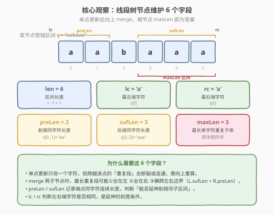
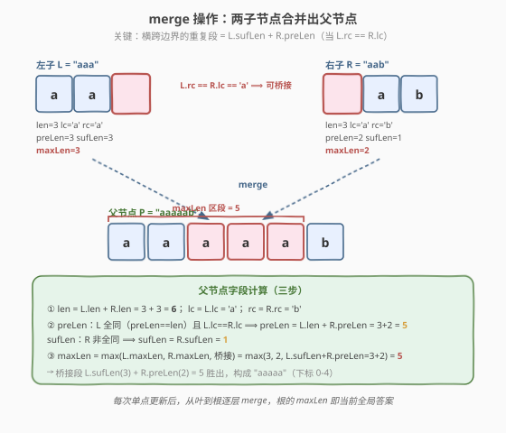
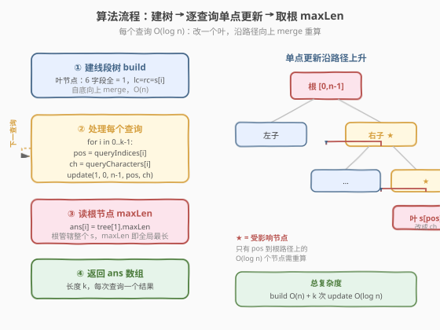
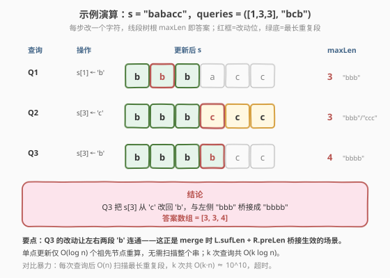

# 由单个字符重复的最长子字符串

- **题目名称**：由单个字符重复的最长子字符串
- **链接**：[2213. 由单个字符重复的最长子字符串](https://leetcode.cn/problems/longest-substring-of-one-repeating-character/)
- **难度**：困难
- **标签**：线段树、字符串、单点更新

## 1. 题目概述

给你一个下标从 0 开始的字符串 `s`，以及 `k` 个查询。第 `i` 个查询会将 `s[queryIndices[i]]` 更新为 `queryCharacters[i]`。每次查询后，返回 `s` 中**仅由单个字符重复组成**的**最长子字符串**的长度。返回长度为 `k` 的数组 `lengths`。

**示例 1**：

```text
输入：s = "babacc", queryCharacters = "bcb", queryIndices = [1,3,3]
输出：[3,3,4]
解释：
- 第 1 次查询：s[1] ← 'b'，s = "bbbacc"，最长重复段 "bbb"，长度 3
- 第 2 次查询：s[3] ← 'c'，s = "bbbccc"，最长重复段 "bbb" / "ccc"，长度 3
- 第 3 次查询：s[3] ← 'b'，s = "bbbbcc"，最长重复段 "bbbb"，长度 4
```

**示例 2**：

```text
输入：s = "abyzz", queryCharacters = "aa", queryIndices = [2,1]
输出：[2,3]
解释：
- 第 1 次查询：s[2] ← 'a'，s = "abazz"，最长重复段 "zz"，长度 2
- 第 2 次查询：s[1] ← 'a'，s = "aaazz"，最长重复段 "aaa"，长度 3
```

**约束条件**：

- $1 \le \text{s.length} \le 10^5$
- `s` 由小写英文字母组成
- $k = \text{queryCharacters.length} = \text{queryIndices.length}$
- $1 \le k \le 10^5$
- $0 \le \text{queryIndices[i]} < \text{s.length}$

> 💡 **题目本质**：这是「**带单点修改的区间最值查询**」——每次只改一个字符，却要回答**全局**最长重复段。暴力每次 $O(n)$ 扫描，$k$ 次共 $O(k \cdot n) \approx 10^{10}$ 必超时。突破口在于：单点修改只影响 $O(\log n)$ 条到根路径上的节点，用**线段树**维护「区间内最长同字符连续段」即可把每次查询压到 $O(\log n)$。

---

## 2. 解题思路

### 2.1 暴力思路：每次查询后线性扫描

最直观的做法：执行每个查询（改一个字符）后，从头到尾扫描 `s`，维护「当前连续段长度」和「全局最长」，$O(n)$ 回答一次。$k$ 次查询总时间 $O(k \cdot n)$，在 $n, k = 10^5$ 下约 $10^{10}$ 次操作，远超时限。

> ⚠️ 暴力法的瓶颈：**每次查询都重新扫描整个串**，而一次单点修改实际只波及改动位置附近的若干段。能否把「全局最长」增量维护，避免全量重算？答案是**线段树**——每个节点缓存一段区间的聚合信息，修改时只重算到根路径上的 $O(\log n)$ 个节点。

### 2.2 核心观察：线段树节点维护 6 个字段

把串 `s` 看作叶子为单字符的线段树。每个节点管辖一段区间 $[l, r]$，需缓存足够信息，使**两子节点合并后能算出父节点的全部信息**——这是线段树「可合并性」的要求。对「最长同字符连续段」，一个节点维护 **6 个字段**：

| 字段 | 含义 | 作用 |
|------|------|------|
| `len` | 区间长度 $r - l + 1$ | 判断子区间是否「全同字符」（`preLen == len` 等） |
| `lc` | 最左端字符 `s[l]` | 判断左子区间前缀能否延伸到右子 |
| `rc` | 最右端字符 `s[r]` | 判断右子区间后缀能否延伸到左子 |
| `preLen` | 前缀由同一字符组成的长度 | merge 时可能「跨边界延长」 |
| `sufLen` | 后缀由同一字符组成的长度 | merge 时可能「跨边界延长」 |
| `maxLen` | 区间内最长单字符重复子串长度 | **本题所求**，根节点即全局答案 |

以 `s = "aabaaa"` 为例（某节点管辖区间），6 字段取值如下：



> 💡 **为什么需要 `preLen` / `sufLen`？** 最长重复段可能：① 全在左子区间；② 全在右子区间；③ **横跨左右边界**。第③种情况无法从两子各自的 `maxLen` 推出——必须知道左子的**后缀连续长度** `L.sufLen` 和右子的**前缀连续长度** `R.preLen`，且仅当 `L.rc == R.lc`（边界两侧字符相同）时才能桥接，桥接长度为 `L.sufLen + R.preLen`。`preLen` / `sufLen` 还要在子区间「全同字符」时跨边界延伸，故还需 `lc` / `rc` 与 `len` 辅助判断。

### 2.3 merge 操作：三步合并两子节点

设左子节点为 $L$、右子节点为 $R$，合并出父节点 $P$：

**第一步：基础字段**

- $\text{P.len} = \text{L.len} + \text{R.len}$
- $\text{P.lc} = \text{L.lc}$（继承左子最左端）
- $\text{P.rc} = \text{R.rc}$（继承右子最右端）

**第二步：前缀 / 后缀长度（可能跨边界延伸）**

- $\text{P.preLen} = \text{L.preLen}$；若 $\text{L.preLen} == \text{L.len}$（左子全同字符）**且** $\text{L.lc} == \text{R.lc}$，则 $\text{P.preLen} = \text{L.len} + \text{R.preLen}$
- $\text{P.sufLen} = \text{R.sufLen}$；若 $\text{R.sufLen} == \text{R.len}$（右子全同字符）**且** $\text{L.rc} == \text{R.lc}$，则 $\text{P.sufLen} = \text{R.len} + \text{L.sufLen}$

**第三步：最长重复段（三者取最大）**

$$\text{P.maxLen} = \max\big(\text{L.maxLen},\ \text{R.maxLen},\ \text{L.rc} == \text{R.lc}\ ?\ \text{L.sufLen} + \text{R.preLen}\ :\ 0\big)$$



> ⚠️ **易错点**：`preLen` 延伸的条件是「**左子全同字符** `L.preLen == L.len`」而**不是**「`L.lc == R.lc` 单独成立」。例如左子 `"aab"`（`preLen=2`，`len=3`），即使 `R.lc='a'`，左子前缀 `"aa"` 也无法延伸——因为左子并非全由 `'a'` 组成，前缀在左子内部已被 `'b'` 截断。`L.preLen == L.len` 才保证左子整体可视为一段同字符，才有资格向右延伸。

### 2.4 算法流程图

整体流程：建树 $O(n)$ → 逐查询单点更新 $O(\log n)$ → 取根 `maxLen` 作为答案。



**单点更新 `update(p, l, r, pos, ch)`**：

1. 若 $l == r$（叶节点）：把该节点重置为 `len=maxLen=preLen=sufLen=1`，`lc=rc=ch`，返回。
2. 否则取 $\text{mid} = \lfloor(l+r)/2\rfloor$，递归更新 `pos` 所在的那一侧子节点。
3. 递归返回后，用 `merge` 重算当前节点 $p$。

由于只递归到 `pos` 一个叶子，沿途仅 $O(\log n)$ 个节点被重算，每次查询 $O(\log n)$。

### 2.5 示例演算

以 `s = "babacc"`，`queryCharacters = "bcb"`，`queryIndices = [1,3,3]` 为例：



| 查询 | 操作 | 更新后 `s` | 最长重复段 | `maxLen` | 说明 |
|------|------|------------|------------|----------|------|
| Q1 | `s[1] ← 'b'` | `bbbacc` | `"bbb"` | 3 | 改动后 `s[0..2]="bbb"` 连通 |
| Q2 | `s[3] ← 'c'` | `bbbccc` | `"bbb"`/`"ccc"` | 3 | 改动后 `s[3..5]="ccc"` 连通，与 `"bbb"` 等长 |
| Q3 | `s[3] ← 'b'` | `bbbbcc` | `"bbbb"` | 4 | `s[3]` 改回 `'b'`，与左段 `"bbb"` 桥接成 `"bbbb"` |

> 💡 **Q3 是关键**：把 `s[3]` 从 `'c'` 改回 `'b'`，让原本被隔开的左右两段 `'b'` 重新连通，最长段从 3 跳到 4。这正是 `merge` 中 `L.sufLen + R.preLen` 桥接生效的典型场景——改动位置恰好在两段同字符的「桥」上，向上 merge 时桥接长度胜过两子各自的 `maxLen`。

---

## 3. 参考代码

### C++

```cpp
// 由单个字符重复的最长子字符串 —— 线段树单点更新 O((n+k) log n)
// 编译: g++ -O2 -std=c++17 solution.cpp -o lsr
#include <vector>
#include <string>
#include <algorithm>
using namespace std;

class Solution {
    struct Node {
        int len, maxLen, preLen, sufLen;
        char lc, rc;
    };
    vector<Node> tree;
    int n;

    Node merge(const Node& L, const Node& R) {
        Node p;
        p.len = L.len + R.len;
        p.lc = L.lc;
        p.rc = R.rc;
        p.preLen = L.preLen;
        if (L.preLen == L.len && L.lc == R.lc) p.preLen = L.len + R.preLen;
        p.sufLen = R.sufLen;
        if (R.sufLen == R.len && L.rc == R.lc) p.sufLen = R.len + L.sufLen;
        p.maxLen = max(L.maxLen, R.maxLen);
        if (L.rc == R.lc) p.maxLen = max(p.maxLen, L.sufLen + R.preLen);
        return p;
    }

    void build(int p, int l, int r, const string& s) {
        if (l == r) {
            tree[p] = {1, 1, 1, 1, s[l], s[l]};
            return;
        }
        int mid = (l + r) / 2;
        build(p * 2, l, mid, s);
        build(p * 2 + 1, mid + 1, r, s);
        tree[p] = merge(tree[p * 2], tree[p * 2 + 1]);
    }

    void update(int p, int l, int r, int pos, char ch) {
        if (l == r) {
            tree[p] = {1, 1, 1, 1, ch, ch};
            return;
        }
        int mid = (l + r) / 2;
        if (pos <= mid) update(p * 2, l, mid, pos, ch);
        else update(p * 2 + 1, mid + 1, r, pos, ch);
        tree[p] = merge(tree[p * 2], tree[p * 2 + 1]);
    }

public:
    vector<int> longestRepeating(string s, string queryCharacters, vector<int>& queryIndices) {
        n = s.size();
        tree.resize(4 * n);
        build(1, 0, n - 1, s);
        vector<int> ans;
        ans.reserve(queryIndices.size());
        for (int i = 0; i < (int)queryIndices.size(); i++) {
            update(1, 0, n - 1, queryIndices[i], queryCharacters[i]);
            ans.push_back(tree[1].maxLen);
        }
        return ans;
    }
};
```

### Python

```python
class Solution:
    def longestRepeating(self, s: str, queryCharacters: str, queryIndices: List[int]) -> List[int]:
        n = len(s)
        lc = [''] * (4 * n)
        rc = [''] * (4 * n)
        length = [0] * (4 * n)
        max_len = [0] * (4 * n)
        pre_len = [0] * (4 * n)
        suf_len = [0] * (4 * n)

        def merge(p: int) -> None:
            L, R = p * 2, p * 2 + 1
            length[p] = length[L] + length[R]
            lc[p] = lc[L]
            rc[p] = rc[R]
            pre_len[p] = pre_len[L]
            if pre_len[L] == length[L] and lc[L] == lc[R]:
                pre_len[p] = length[L] + pre_len[R]
            suf_len[p] = suf_len[R]
            if suf_len[R] == length[R] and rc[L] == lc[R]:
                suf_len[p] = length[R] + suf_len[L]
            max_len[p] = max(max_len[L], max_len[R])
            if rc[L] == lc[R]:
                max_len[p] = max(max_len[p], suf_len[L] + pre_len[R])

        def build(p: int, l: int, r: int) -> None:
            if l == r:
                lc[p] = rc[p] = s[l]
                length[p] = max_len[p] = pre_len[p] = suf_len[p] = 1
                return
            mid = (l + r) // 2
            build(p * 2, l, mid)
            build(p * 2 + 1, mid + 1, r)
            merge(p)

        def update(p: int, l: int, r: int, pos: int, ch: str) -> None:
            if l == r:
                lc[p] = rc[p] = ch
                length[p] = max_len[p] = pre_len[p] = suf_len[p] = 1
                return
            mid = (l + r) // 2
            if pos <= mid:
                update(p * 2, l, mid, pos, ch)
            else:
                update(p * 2 + 1, mid + 1, r, pos, ch)
            merge(p)

        build(1, 0, n - 1)
        ans = []
        for ch, pos in zip(queryCharacters, queryIndices):
            update(1, 0, n - 1, pos, ch)
            ans.append(max_len[1])
        return ans
```

> 💡 **实现细节**：① 线段树数组开 `4n` 大小，是「安全上界」（对任意 $n$ 都够，含 $n$ 非 $2$ 的幂的情形）。② `merge` 是**纯函数**（C++ 版返回 `Node`，Python 版就地写入 `p`），build 与 update 复用同一段逻辑，避免重复代码。③ Python 用 6 个并行数组而非对象数组，省去对象创建开销，常数更优。④ 递归深度 $= O(\log n) \approx 17$（$n = 10^5$），无需调高递归上限。⑤ 不必在 update 中同步修改原始 `s`——叶节点直接用参数 `ch` 重置，`s` 仅在建树时被读取一次。

---

## 4. 复杂度分析

| 维度 | 复杂度 | 说明 |
|------|--------|------|
| **时间复杂度** | $O((n + k) \log n)$ | 建树 $O(n)$（共 $2n-1$ 个节点，每个 $O(1)$ merge）；$k$ 次查询每次单点更新 $O(\log n)$（只重算到根路径上的 $\approx \log n$ 个节点） |
| **空间复杂度** | $O(n)$ | 线段树数组 $4n$，与输入规模线性相关；递归栈 $O(\log n)$ |

> ⚠️ 对比暴力 $O(k \cdot n) \approx 10^{10}$，线段树 $O((n+k)\log n) \approx 2 \times 10^5 \times 17 \approx 3.4 \times 10^6$，快约 $3000$ 倍。关键在于**单点修改的局部性**：改动一个字符只影响从该叶到根的一条路径，其余子树完全不变，无需重算。

---

## 5. 扩展：为什么这题必须用线段树？

### 5.1 与其它数据结构的对比

| 方案 | 单次查询 | 总时间 | 可行性 |
|------|----------|--------|--------|
| 暴力扫描 | $O(n)$ | $O(k \cdot n)$ | $10^{10}$，超时 |
| **线段树** | $O(\log n)$ | $O((n+k)\log n)$ | ✅ 约 $3 \times 10^6$ |
| 树状数组 | — | — | ❌ 树状数组维护的是「可减」的加法信息（前缀和），而最长重复段**不可减**（无法从右子反推左子），不满足交换群结构 |
| ST 表 | — | — | ❌ ST 表只支持**静态**区间查询，不支持单点修改 |

> 💡 判断依据：本题是「**单点修改 + 全局最值查询**」的动态模型，且信息**不可减**——这正是线段树的招牌甜区。若信息可减（如和、异或）可考虑树状数组；若查询静态（无修改）可考虑 ST 表。

### 5.2 merge 函数的正确性论证

`maxLen` 的三取最大覆盖了最长重复段在父区间内的所有可能位置：

- **全在左子**：$\text{L.maxLen}$ 已记录左子内最长段。
- **全在右子**：$\text{R.maxLen}$ 已记录右子内最长段。
- **横跨边界**：段必然从左子后缀某处延伸到右子前缀某处。由于段是「同字符连续」，左子后缀部分必为 `L.sufLen`（左子后缀全同 `L.rc`），右子前缀部分必为 `R.preLen`（右子前缀全同 `R.lc`），且仅当 `L.rc == R.lc` 才能连通，桥接长度 $= \text{L.sufLen} + \text{R.preLen}$。

`preLen` / `sufLen` 的延伸条件同理：左子前缀要延伸到右子，必须左子**整体**全同字符（`L.preLen == L.len`），否则前缀在左子内部就被截断，无法越过边界。

### 5.3 区间并查集的替代思路

另一种思路是「**区间并查集 / 有序集合维护同字符段**」：用有序结构维护所有「同字符连续段」的起止与字符，改动一个字符时分裂/合并相邻段，用堆或有序容器维护各段长度。最坏情况下单次操作可能涉及 $O(\log n)$ 个段的分裂合并（如 `std::set` 的 `split`），但实现复杂且常数较大。线段树的优势在于**结构统一、merge 逻辑清晰**，是此类「区间聚合 + 单点修改」问题的标准武器。

---

## 6. 面试要点

1. **为什么想到线段树？**

   - 题目是「单点修改 + 全局最值查询」且查询次数与串长同阶（$k, n \le 10^5$）。暴力 $O(k \cdot n)$ 必超时，而单点修改的局部性（只影响 $O(\log n)$ 个节点）天然契合线段树。

2. **节点为什么要维护 6 个字段，而不是只存 `maxLen`？**

   - 最长重复段可能横跨左右子边界，仅靠两子的 `maxLen` 无法推出桥接段长度。必须额外存 `preLen` / `sufLen` 记录端点同字符连续长度，以及 `lc` / `rc` / `len` 判断能否延伸。

3. **`preLen` 延伸的条件为什么是 `L.preLen == L.len` 而非 `L.lc == R.lc`？**

   - 前缀要越过边界延伸到右子，左子必须**整体**全同字符。若左子内部已有截断（如 `"aab"`），其前缀 `"aa"` 在左子内部就被 `'b'` 截断，无法向右延伸——即使右子最左端也是 `'a'`。`L.preLen == L.len` 保证左子无截断。

4. **`maxLen` 桥接项为什么是 `L.sufLen + R.preLen`？**

   - 横跨边界的同字符段，左半部分必是左子的后缀（长度 `L.sufLen`，全同 `L.rc`），右半部分必是右子的前缀（长度 `R.preLen`，全同 `R.lc`）。仅当 `L.rc == R.lc` 两半同字符才能拼成一段，总长为两者之和。

5. **如果题目改成「区间赋值」（把一段子串全改成同一字符）怎么做？**

   - 引入**懒标记**（lazy propagation）：节点维护一个「待下传的统一字符」标记，区间赋值时打标记并直接重置该节点 6 字段（`len` 不变，`maxLen=preLen=sufLen=len`，`lc=rc=赋值字符`），查询/更新时下传到子节点。复杂度降为 $O(\log n)$ 每次区间操作。这是线段树 lazy 标记的经典扩展。

> 💡 **一句话总结**：2213 是「单点修改 + 全局最长同字符段」的线段树招牌题。核心是设计**可合并**的节点信息——`len/lc/rc/preLen/sufLen/maxLen` 六字段，merge 时三取最大并处理跨边界桥接。难点在于想清楚 `preLen`/`sufLen` 的延伸条件与桥接项的推导。

---

## 7. 同类练习题

- [1157. 子数组中占绝大多数的元素](https://leetcode.cn/problems/online-majority-element-in-subarray/)（[题解](../1101-1200/1157_子数组中占绝大多数的元素.md)）：线段树维护区间「候选众数 + 计数」，节点可合并的区间聚合查询，与 2213 同属线段树信息设计题
- [732. 我的日程安排表 III](https://leetcode.cn/problems/my-calendar-iii/)（[题解](../0701-0800/732_我的日程安排表III.md)）：线段树 + 懒标记维护区间最大重叠数，动态插入区间后实时回答全局最值，与 2213 同为「动态聚合 + 全局最值」骨架
- [307. 区域和检索 - 数组可修改](https://leetcode.cn/problems/range-sum-query-mutable/)：线段树单点修改 + 区间求和的入门题，2213 的「信息可减」对照面（和可减故也能用树状数组）
- [715. Range 模块](https://leetcode.cn/problems/range-module/)（[题解](../0701-0800/715_Range模块.md)）：线段树 + 懒标记维护区间覆盖布尔状态，动态区间修改与查询的另一应用
- [2407. 最长递增子序列 II](https://leetcode.cn/problems/longest-increasing-subsequence-ii/)：线段树维护值域上「以某值结尾的 LIS 长度」，单点更新取区间最值，线段树优化 DP 的代表题
