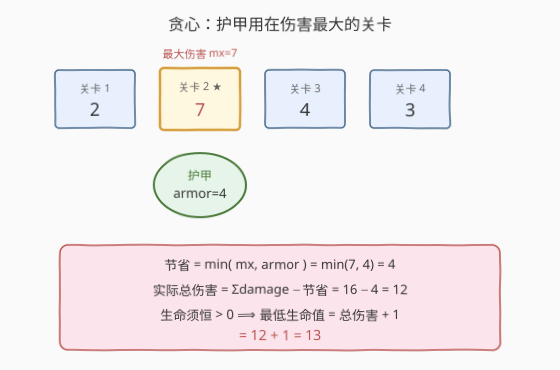
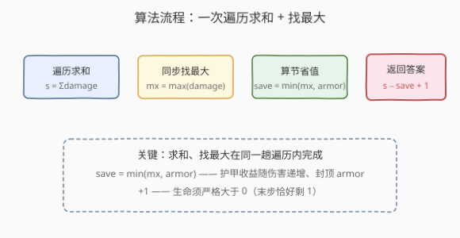

# 通关游戏所需的最低生命值

- **题目名称**：通关游戏所需的最低生命值
- **链接**：[2214. 通关游戏所需的最低生命值](https://leetcode.cn/problems/minimum-health-to-beat-game/)
- **难度**：中等
- **标签**：贪心、数组

## 1. 题目概述

你正在玩一个有 $n$ 个关卡的游戏，关卡编号 $0$ 到 $n-1$。给定下标从 $0$ 开始的整数数组 `damage`，其中 `damage[i]` 是完成第 $i$ 个关卡所损失的生命值。另外给定整数 `armor`：你**最多**只能在**任意**一个关卡使用**一次**护甲技能，它能保护你免受**最多** `armor` 点伤害（即把该关卡伤害抵扣 $\min(\text{damage}[i],\ \text{armor})$）。

你必须**按顺序**完成关卡，且生命值必须一直**大于** $0$ 才能通关。返回开始通关所需的**最低**生命值。

**示例 1**：

```text
输入：damage = [2,7,4,3], armor = 4
输出：13
解释：从 13 点生命值开始：
  第 1 回合，受 2 点伤害，剩 13 - 2 = 11。
  第 2 回合，受 7 点伤害，剩 11 - 7 = 4。
  第 3 回合，使用护甲抵扣 4 点伤害，剩 4 - 0 = 4。
  第 4 回合，受 3 点伤害，剩 4 - 3 = 1。
  13 是能通关的最低初始生命值。
```

**示例 2**：

```text
输入：damage = [2,5,3,4], armor = 7
输出：10
解释：从 10 点生命值开始：
  第 1 回合，受 2 点伤害，剩 8。
  第 2 回合，使用护甲抵扣 5 点伤害，剩 8。
  第 3 回合，受 3 点伤害，剩 5。
  第 4 回合，受 4 点伤害，剩 1。
```

**示例 3**：

```text
输入：damage = [3,3,3], armor = 0
输出：10
解释：护甲为 0，不抵扣任何伤害。总伤害 9，生命须 > 9，故最低 10。
```

**约束条件**：

- $n = \text{damage.length}$
- $1 \le n \le 10^5$
- $0 \le \text{damage}[i] \le 10^5$
- $0 \le \text{armor} \le 10^5$

> 💡 题眼有二：① 护甲只能用一次，自然要把它用在「收益最大」的关卡；② 生命须**每一步**都 $> 0$，但伤害非负、累计单调不减，最坏在末步——所以只要初始生命 $>$ 总伤害即可，无需逐前缀检查。

---

## 2. 解题思路

### 2.1 暴力思路：枚举护甲关卡

护甲用在第 $i$ 关时，该关实际伤害变为 $\text{damage}[i] - \min(\text{damage}[i],\ \text{armor})$，总伤害为

$$
T_i = \sum_{j} \text{damage}[j] \;-\; \min(\text{damage}[i],\ \text{armor})
$$

枚举每个 $i$ 取 $\min_i T_i + 1$。若每次重算总和，时间 $O(n^2)$，在 $n = 10^5$ 下不可行。即便预计算 $\text{sum}$ 后只遍历一遍，也是 $O(n)$，但**仍未点破「哪个 $i$ 最优」的本质**——还得逐个比较。

> 💡 暴力法的瓶颈在于「不知道该选哪一关」。一旦看清楚抵扣量 $\min(\text{damage}[i],\text{armor})$ 的单调性，就能直接锁定最优关卡，免去逐个枚举。

### 2.2 核心观察：贪心 + 末步最大



**观察一：抵扣量随该关伤害递增，封顶于 armor**

护甲用在第 $i$ 关的抵扣量为 $g(i) = \min(\text{damage}[i],\ \text{armor})$。它关于 $\text{damage}[i]$ 单调不减：伤害越大抵扣越多，直到触顶 `armor`。因此 $g(i)$ 在 $\text{damage}[i]$ **最大**处取到最大值——**把护甲用在伤害最大的那一关**。

> ⚠️ 注意是「抵扣量」最大，不是「伤害」最大本身。当 `armor` 很大、超过所有伤害时，任意一关都触顶 `armor`，此时选最大伤害关和选别的关抵扣相同（都等于 `armor`）；但选最大伤害关**永远不亏**，故贪心策略统一成立。

**观察二：生命每步 > 0 ⟺ 初始生命 > 总伤害**

因为每关伤害 $\text{damage}[i] \ge 0$，累计伤害是**单调不减**的，最坏情形出现在**最后一关**。设实际总伤害为 $T$（已扣除护甲抵扣），则：

- 初始生命 $H = T + 1$ 时，末步剩余 $H - T = 1 > 0$；
- 任一中间步累计 $\le T$，故 $H - \text{累计} \ge 1 > 0$ 恒成立。

因此**无需逐前缀检查**，只要 $H > T$ 即可，最低 $H = T + 1$（末步恰好剩 1）。

**观察三：综合公式**

把抵扣最大化（观察一）与末步最大（观察二）结合：

$$
\boxed{\;\text{answer} = \sum \text{damage} \;-\; \min\!\big(\max \text{damage},\ \text{armor}\big) \;+\; 1\;}
$$

其中 $+1$ 来自「严格大于 $0$」：末步累计恰为总伤害 $T$，生命须 $> T$，整数下即 $T + 1$。

### 2.3 算法流程图



算法步骤总结：

1. **一趟遍历**：同时累计总和 $s = \sum \text{damage}$ 与最大值 $\text{mx} = \max \text{damage}$。
2. **算抵扣**：$\text{save} = \min(\text{mx},\ \text{armor})$。
3. **返回**：$s - \text{save} + 1$。

### 2.4 示例演算

以 `damage = [2,7,4,3], armor = 4` 为例，$\text{mx} = 7$，$\text{save} = \min(7,4) = 4$，护甲用在第 3 关（伤害 4，恰好被全额抵扣；等价地用在第 2 关抵扣 4 也是 4，总抵扣相同）：

![示例演算：[2,7,4,3] armor=4 初始生命=13](../images/2214_example_walkthrough.svg)

| 回合 | 伤害 | 用护甲? | 实际伤害 | 累计伤害 | 剩余生命(初始13) |
|------|------|---------|----------|----------|------------------|
| 1 | 2 | 否 | 2 | 2 | 11 |
| 2 | 7 | 否 | 7 | 9 | 4 |
| 3 | 4 | 是（抵扣4） | 0 | 9 | 4 |
| 4 | 3 | 否 | 3 | 12 | 1 |

实际总伤害 $T = 2+7+0+3 = 12$，初始生命 $13 = 12 + 1$，每步剩余均 $> 0$，末步恰好剩 $1$。

> 💡 本例中 `armor=4` 恰等于第 3 关的伤害 4，也恰等于 $\min(7,4)=4$——无论护甲用在第 2 关（抵扣 4，剩 3 伤害）还是第 3 关（抵扣 4，剩 0 伤害），**总抵扣都是 4**，最终答案同为 13。这印证了观察一：只要抵扣量达到上界 $\min(\text{mx},\text{armor})$，用在哪一关不影响总伤害（但用在最大伤害关永远能取到该上界）。

---

## 3. 参考代码

### C++

```cpp
class Solution {
  public:
    long long minimumHealth(vector<int>& damage, int armor) {
        long long s = 0;
        int mx = 0;
        for (int v : damage) {
            s += v;
            mx = max(mx, v);
        }
        return s - min(mx, armor) + 1;
    }
};
```

### Python

```python
class Solution:
    def minimumHealth(self, damage: List[int], armor: int) -> int:
        return sum(damage) - min(max(damage), armor) + 1
```

> ⚠️ **溢出**：$n \le 10^5$ 且 $\text{damage}[i] \le 10^5$，总和至多 $10^{10}$，超过 32 位 `int` 上界（约 $2.1 \times 10^9$）。C++ 中 `s` 必须用 `long long`，返回类型也是 `long long`；Python 整数无此问题。`mx` 与 `armor` 均 $\le 10^5$，`min(mx, armor)` 在 `int` 范围内。

---

## 4. 复杂度分析

| 维度 | 复杂度 | 说明 |
|------|--------|------|
| 时间复杂度 | $O(n)$ | 一趟遍历同时求和与找最大，后续 $O(1)$ 算抵扣与答案 |
| 空间复杂度 | $O(1)$ | 只用常数个变量 `s`、`mx`，无额外数据结构 |

> 💡 本题的「简单」在于贪心可直接闭式求解，无需排序、堆或 DP。难点全在**想清楚两个观察**：抵扣量取最大伤害关、生命只需大于总伤害。一旦想通，代码只有一行。

---

## 5. 扩展：为何「逐前缀检查」是多余的

直觉上「生命每步 $> 0$」像要逐前缀维护最大累计伤害，类似 [174. 地下城游戏](https://leetcode.cn/problems/dungeon-game/) 的反向 DP。但本题与 174 的关键区别在于**伤害恒非负**：

- 174 中格子伤害可正（加血）可负（掉血），累计可升可降，最坏步可能在**中间**某处，故须从终点反向 DP。
- 本题 `damage[i]` $\ge 0$，累计**单调不减**，最坏必在末步，故 $H > T$ 一条即可覆盖全程。

若把本题改成「伤害可正可负」（部分关卡回血），则贪心失效，需回到类似 174 的反向 DP 或前缀最大值方法：维护每步累计伤害的最大值 $\text{peak} = \max_k \sum_{j \le k} \text{actual}[j]$，答案为 $\text{peak} + 1$，再在所有护甲放置方案中取最小。这就退化成了带一次「区间减免」的前缀最值优化问题，超出本题范畴。

---

## 6. 面试要点

1. **为什么护甲要用在伤害最大的那一关？**

   - 护甲抵扣量 $g(i) = \min(\text{damage}[i],\ \text{armor})$ 随该关伤害单调不减，在最大伤害处取到最大值。抵扣越多总伤害越小，所需生命越低。

2. **`armor` 很大（超过所有伤害）时怎么办？**

   - 此时 $\min(\text{mx},\text{armor}) = \text{mx}$，护甲在最大伤害关被「全额抵扣」。其实任意一关都触顶 `armor`（抵扣等于自身伤害），但选最大伤害关保证不亏，公式统一为 $\sum - \text{mx} + 1$。

3. **为什么不用逐前缀检查生命是否 $> 0$？**

   - 伤害非负 ⟹ 累计单调不减 ⟹ 最坏在末步。初始生命 $> \text{总伤害}$ 即保证每步剩余 $> 0$。若伤害可正可负（如 174 地下城），此结论不成立。

4. **`+1` 是怎么回事？**

   - 题目要求生命**严格大于** $0$。末步累计恰为总伤害 $T$，须 $H > T$，整数下最小 $H = T + 1$（末步剩 1）。漏掉 $+1$ 是最常见的 off-by-one 错误。

5. **数据范围与溢出要注意什么？**

   - 总和可达 $10^{10}$，C++ 须用 `long long`；`mx`、`armor` $\le 10^5$ 用 `int` 即可。Python 无溢出问题。

---

## 7. 同类练习题

- [174. 地下城游戏](https://leetcode.cn/problems/dungeon-game/)（[题解](../0101-0200/174_地下城游戏.md)）：反向网格 DP，伤害可正可负，最坏步可能在中间——与本题对照「为何本题只需末步」的最佳反面教材
- [2210. 统计数组中峰和谷的数量](https://leetcode.cn/problems/count-hills-and-valleys-in-an-array/)：同区间简单贪心/数组遍历题，一趟扫描判定局部极值
- [53. 最大子数组和](https://leetcode.cn/problems/maximum-subarray-sum/)（[题解](../0001-0100/53_最大子数组和.md)）：Kadane 维护前缀最值，与本题「累计单调性 → 末步最大」同属前缀累计思想
- [121. 买卖股票的最佳时机](https://leetcode.cn/problems/best-time-to-buy-and-sell-stock/)（[题解](../0101-0200/121_买卖股票的最佳时机.md)）：一趟遍历维护最小值求最大差，同为 $O(n)$ 贪心 + 极值维护的简单题
