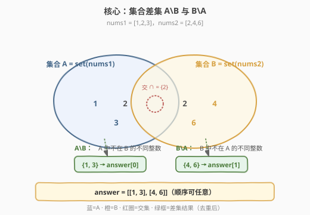
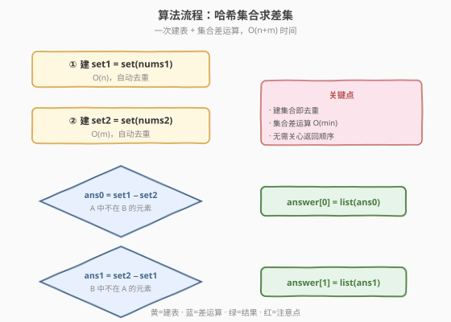

# LeetCode 找出两数组的不同 题解

## 1. 题目概述

- **标题 / 题号**：找出两数组的不同（#2215，easy）
- **链接**：https://leetcode.cn/problems/find-the-difference-of-two-arrays/
- **难度**：简单
- **标签**：数组、哈希表、集合

**题意**：给你两个下标从 **0** 开始的整数数组 `nums1` 和 `nums2`，请你返回一个长度为 2 的列表 `answer`，其中：

- `answer[0]` 是 `nums1` 中所有**不**存在于 `nums2` 中的**不同**整数组成的列表。
- `answer[1]` 是 `nums2` 中所有**不**存在于 `nums1` 中的**不同**整数组成的列表。

注意：列表中的整数可以按**任意**顺序返回。

**示例 1**：

```text
输入：nums1 = [1,2,3], nums2 = [2,4,6]
输出：[[1,3],[4,6]]
解释：
对于 nums1，nums1[1] = 2 出现在 nums2 中下标 0 处，然而 nums1[0] = 1 和 nums1[2] = 3 没有出现在 nums2 中。因此，answer[0] = [1,3]。
对于 nums2，nums2[0] = 2 出现在 nums1 中下标 1 处，然而 nums2[1] = 4 和 nums2[2] = 6 没有出现在 nums1 中。因此，answer[1] = [4,6]。
```

**示例 2**：

```text
输入：nums1 = [1,2,3,3], nums2 = [1,1,2,2]
输出：[[3],[]]
解释：
对于 nums1，nums1[2] 和 nums1[3] 没有出现在 nums2 中。由于 nums1[2] == nums1[3]，二者的值只需要在 answer[0] 中出现一次，故 answer[0] = [3]。
nums2 中的每个整数都在 nums1 中出现，因此，answer[1] = []。
```

**约束**：

- $1 \le \text{nums1.length},\ \text{nums2.length} \le 1000$
- $-1000 \le \text{nums1}[i],\ \text{nums2}[i] \le 1000$

> 💡 本题的本质是两次**集合差运算**：$A \setminus B$ 与 $B \setminus A$。关键在于题目强调「**不同**整数」——即结果需去重。把数组转成哈希集合后，去重与“是否存在”判定都变成 $O(1)$，集合差运算即为线性。

## 2. 解题思路

### 2.1 暴力思路：逐元素线性查找

最直白的做法：对 `nums1` 中每个元素 `x`，遍历 `nums2` 检查是否存在；不存在则加入 `answer[0]`，但需手动去重（再用一个已收集集合判重）。`answer[1]` 同理。

```text
ans0, seen0 = [], set()
for x in nums1:
    if x not in nums2 and x not in seen0:   # nums2 是 list，线性查找
        seen0.add(x); ans0.append(x)
# ans1 对称处理
```

外层 $n$ 次，每次 `x not in nums2` 对列表做 $O(m)$ 线性扫描，总最坏 $O(n \cdot m)$；约束 $n, m \le 1000$ 下约 $10^6$，能过但常数偏高，且需自己维护 `seen` 去重。

> ⚠️ 暴力有两个浪费：① 每次都对 `nums2`（列表）做线性查找，重复扫整段；② 题目要求“不同”整数，必须额外去重——`nums1` 本身可能含重复值（如示例 2 的两个 3），不做去重会重复入答案。

### 2.2 核心观察：集合化把“存在性 + 去重”一次解决



**观察：把两个数组各自塞进哈希集合，三件事一并完成。**

1. **去重**：集合天然不存重复元素。`set([1,2,3,3])` 直接得到 `{1,2,3}`，无需额外 `seen` 表。
2. **$O(1)$ 存在性判定**：`x in set2` 是平均 $O(1)$，远快于 `x in list2` 的 $O(m)$。
3. **差运算直接可用**：大多数语言的标准库都支持集合差 `set1 - set2`，一行即得 $A \setminus B$。

于是算法极其简洁：

1. `set1 = set(nums1)`，`set2 = set(nums2)`。
2. `answer[0] = list(set1 - set2)`。
3. `answer[1] = list(set2 - set1)`。

> 💡 **为什么集合差正好是答案**：`set1 - set2` 的语义是“在 `set1` 中但不在 `set2` 中的元素”，且结果仍是集合（无重复）——这与题目对 `answer[0]` 的定义（`nums1` 中不出现于 `nums2` 的**不同**整数）完全一致。`answer[1]` 对称。

**边界与特例**：

- **两数组完全不相交**：如 `nums1=[1,2]`、`nums2=[3,4]`，则 `answer[0]=[1,2]`、`answer[1]=[3,4]`，差集就是各自全集。
- **一个数组是另一个的子集**：如示例 2，`set2 ⊆ set1`，则 `set2 - set1 = ∅`，`answer[1] = []`。
- **大量重复值**：`nums1 = [5,5,5,5]`，`set1 = {5}`，去重后只剩一个 5，符合“不同整数”要求。
- **负数与零**：值域 $[-1000, 1000]$ 含负数与 0，哈希集合对它们一视同仁，无需特殊处理。
- **返回顺序任意**：无需对结果排序，集合转列表的迭代顺序即可作为答案。

### 2.3 算法流程图



**哈希集合差运算法**（$O(n + m)$，推荐）：

1. **建 set1**：`set1 = set(nums1)`，扫描 `nums1` 一次，$O(n)$，同时完成去重。
2. **建 set2**：`set2 = set(nums2)`，扫描 `nums2` 一次，$O(m)$，同时完成去重。
3. **求 `answer[0]`**：`list(set1 - set2)`。集合差运算遍历 `set1` 中较小一方，平均 $O(\min(|set1|, |set2|))$。
4. **求 `answer[1]`**：`list(set2 - set1)`，同理。
5. **返回** `[answer[0], answer[1]]`。

> 💡 **集合差的实现细节**：Python 的 `set1 - set2` 拷贝 `set1` 后逐个移除 `set2` 中元素，时间 $O(|set1|)$。C++ 的 `std::set_difference` 要求有序范围，因此 C++ 中更常用 `unordered_set` + 手动遍历判 `!count`。两种写法都是线性。

### 2.4 示例演算

![示例演算：nums1=[1,2,3,3], nums2=[1,1,2,2]](../images/2215_example_walkthrough.svg)

**示例 2：`nums1 = [1,2,3,3], nums2 = [1,1,2,2]`**

**第一步：建集合（去重）**

| 输入 | 数组 | 集合化结果 |
|------|------|------------|
| nums1 | `[1, 2, 3, 3]` | `set1 = {1, 2, 3}`（两个 3 合并为一个） |
| nums2 | `[1, 1, 2, 2]` | `set2 = {1, 2}`（重复 1、2 各合并） |

**第二步：求差集**

| 运算 | 含义 | 结果 |
|------|------|------|
| `set1 - set2` | `nums1` 中不出现于 `nums2` 的不同整数 | `{3}` → `answer[0] = [3]` |
| `set2 - set1` | `nums2` 中不出现于 `nums1` 的不同整数 | `{}` → `answer[1] = []` |

> 💡 注意 `nums1` 里有两个 3，但去重后 `set1` 只含一个 3，故 `answer[0]` 只出现一次 3——这正是“不同整数”的体现。`nums2` 的 1、2 全在 `set1` 中，`set2 - set1` 为空集，`answer[1]` 为空列表。

**第三步：返回**

`answer = [[3], []]` ✓

**示例 1：`nums1 = [1,2,3], nums2 = [2,4,6]`**

- `set1 = {1,2,3}`，`set2 = {2,4,6}`
- `set1 - set2 = {1,3}` → `answer[0] = [1,3]`
- `set2 - set1 = {4,6}` → `answer[1] = [4,6]`
- 返回 `[[1,3],[4,6]]` ✓

> ⚠️ 集合是无序的，`list(set1 - set2)` 的元素顺序不固定。题目允许任意顺序，故无需排序；若面试官要求有序结果，可在转列表后 `sort()`，增加 $O(k \log k)$。

## 3. 参考代码

### C++（unordered_set + 手动遍历判重）

```cpp
class Solution {
  public:
    vector<vector<int>> findDifference(vector<int>& nums1, vector<int>& nums2) {
        unordered_set<int> s1(nums1.begin(), nums1.end());
        unordered_set<int> s2(nums2.begin(), nums2.end());

        vector<int> ans0, ans1;
        // answer[0]: 在 s1 中但不在 s2 中
        for (int x : s1) {
            if (!s2.count(x)) {
                ans0.push_back(x);
            }
        }
        // answer[1]: 在 s2 中但不在 s1 中
        for (int x : s2) {
            if (!s1.count(x)) {
                ans1.push_back(x);
            }
        }
        return {ans0, ans1};
    }
};
```

> 💡 C++ 没有内置的集合差运算符，但遍历 `s1` 用 `s2.count(x)` 判重即可达到同样效果：遍历 $O(|s1|)$，每次 `count` 平均 $O(1)$。由于遍历的是 `unordered_set` 本身，结果天然无重复。

### Python（集合差运算符，最简洁）

```python
class Solution:
    def findDifference(self, nums1: List[int], nums2: List[int]) -> List[List[int]]:
        set1, set2 = set(nums1), set(nums2)
        return [list(set1 - set2), list(set2 - set1)]
```

### Python（手动遍历版，对照参考）

```python
class Solution:
    def findDifference(self, nums1: List[int], nums2: List[int]) -> List[List[int]]:
        set1, set2 = set(nums1), set(nums2)
        ans0 = [x for x in set1 if x not in set2]
        ans1 = [x for x in set2 if x not in set1]
        return [ans0, ans1]
```

> ⚠️ 手动版与 `-` 运算符版等价，只是显式写出“不在另一个集合中”的判定。面试中两种写法均可，`-` 运算符版更 Pythonic，手动版更便于讲解语义。

## 4. 复杂度分析

| 维度 | 复杂度 | 说明 |
|------|--------|------|
| 时间复杂度 | $O(n + m)$ | 建 `set1` 扫描 `nums1` 为 $O(n)$；建 `set2` 扫描 `nums2` 为 $O(m)$；两次集合差各遍历一个集合，平均 $O(\min(|s1|,|s2|)) \subseteq O(n+m)$ |
| 空间复杂度 | $O(n + m)$ | 两个哈希集合 `set1`、`set2` 最坏各存全部元素（无重复时），即 $O(n) + O(m)$；输出列表不计额外空间 |

> 💡 即便 `nums1`、`nums2` 全是重复值，集合大小也不会超过值域宽度 $2001$（$[-1000, 1000]$），故空间上界实际是 $O(\min(n+m,\ 2001))$。但按输入规模记号仍是 $O(n + m)$。若值域极小，可用定长布尔数组代替哈希集合，进一步降低常数（见第 5 节）。

## 5. 扩展：值域极小时的布尔数组优化

本题值域 $[-1000, 1000]$ 仅 2001 个可能值，是“小值域”的典型信号。当 $n, m$ 远大于值域宽度 $V$ 时，哈希集合的 $O(n + m)$ 仍正确，但常数可被进一步优化：

**方法：用偏移后的定长布尔数组代替哈希集合。**

- 开两个长度 $V = 2001$ 的 `bool` 数组 `in1[]`、`in2[]`，下标 `x + 1000` 映射到 $[0, 2000]$。
- 扫 `nums1` 置 `in1[x + 1000] = true`，扫 `nums2` 置 `in2[x + 1000] = true`（天然去重）。
- 遍历 $[0, 2000]$：`in1[i] && !in2[i]` 入 `answer[0]`；`in2[i] && !in1[i]` 入 `answer[1]`。

| 方法 | 时间 | 空间 | 适用场景 |
|------|------|------|----------|
| 哈希集合 | $O(n + m)$ | $O(n + m)$ | 值域任意、通用 |
| 布尔数组 | $O(n + m + V)$ | $O(V)$ | 值域 $V$ 小且已知 |

> ⚠️ 布尔数组法要求值域已知且稠密；若值域是任意 32 位整数（如 $[-10^9, 10^9]$），$V$ 过大不可行，必须用哈希集合。本题 $V = 2001$ 极小，两种方法都很快，哈希集合写法更通用、更不易出错，故作为主解。

## 6. 面试要点

1. **为什么先建集合而不是直接逐元素查找？**

   - 直接对 `nums2`（列表）做 `x in nums2` 是 $O(m)$ 线性查找，对 `nums1` 每个元素都查一次总 $O(n \cdot m)$。建哈希集合把“存在性判定”降到平均 $O(1)$，总 $O(n + m)$。同时集合化顺带完成去重，免去额外维护 `seen` 表。

2. **题目要求“不同整数”，去重是必须的吗？**

   - 是硬性要求。`answer[0]` 必须是 `nums1` 中的**不同**整数，若 `nums1` 含重复值（如示例 2 的两个 3），不去重会让 3 在答案里出现两次。集合化天然去重，是满足该要求的最自然方式。

3. **集合差运算 `set1 - set2` 的时间复杂度到底是多少？**

   - Python 中 `set1 - set2` 先拷贝 `set1`（$O(|s1|)$），再逐个移除 `set2` 中存在的元素（每个 $O(1)$，共 $O(|s2|)$），整体 $O(|s1| + |s2|)$。由于 $|s1| \le n$、$|s2| \le m$，故仍是 $O(n + m)$。

4. **返回顺序任意，需要排序吗？**

   - 不需要。题目明确“可以按任意顺序返回”。哈希集合转列表的迭代顺序不固定但合法。若面试官追加“要求有序”，再 `sort()` 即可，增加 $O(k \log k)$（$k$ 为结果长度）。

5. **C++ 中能否用 `std::set_difference`？**

   - 可以，但 `std::set_difference` 要求输入范围**已有序**。若用有序的 `std::set`，插入是 $O(\log n)$，建表退化为 $O(n \log n)$，不如 `unordered_set` 的 $O(n)$。因此 C++ 中通常用 `unordered_set` + 手动遍历 `count` 判重，保持线性。

## 同类练习题

| # | 题目 | 与本题的关联 |
|---|------|-------------|
| 349 | [两个数组的交集](https://leetcode.cn/problems/intersection-of-two-arrays/) | 同样是两数组 + 哈希集合，但求的是交集而非差集，互为镜像，巩固“集合化 + 库运算”模板 |
| 350 | [两个数组的交集 II](https://leetcode.cn/problems/intersection-of-two-arrays-ii/) | 交集的“带重复”版（按出现次数取 min），需用频率哈希而非集合，对照 349 理解“去重 vs 保留重复”的区别 |
| 1200 | [最小绝对差](https://leetcode.cn/problems/minimum-absolute-difference/) | 排序后扫描相邻对，虽非集合题，但同属“数组间关系”类，可对比不同数据结构选择 |
| 1 | [两数之和](https://leetcode.cn/problems/two-sum/) | 哈希表判存在性的经典入门，与本题“用哈希把查找从 $O(n)$ 降到 $O(1)$”同源，适合串联复习 |
| 448 | [找到所有数组中消失的数字](https://leetcode.cn/problems/find-all-numbers-disappeared-in-an-array/) | 值域小且连续时用原地标记代替哈希集合，是第 5 节“布尔数组优化”思想的进阶（原地而非额外数组） |
