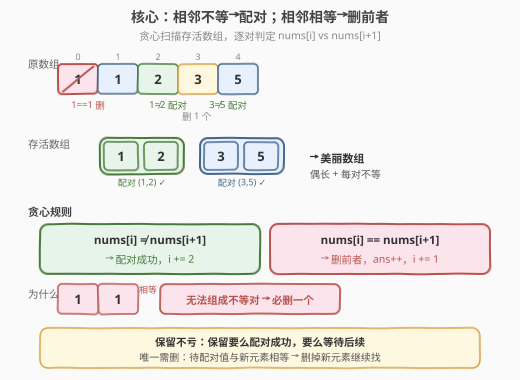
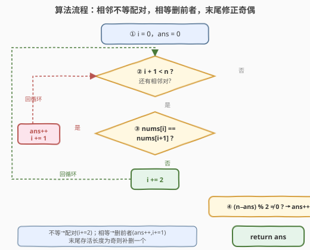

# LeetCode 美化数组的最少删除数 题解

## 1. 题目概述

- **标题 / 题号**：美化数组的最少删除数（#2216，medium）
- **链接**：https://leetcode.cn/problems/minimum-deletions-to-make-array-beautiful/
- **难度**：中等
- **标签**：贪心、数组、模拟

**题意**：给你一个下标从 **0** 开始的整数数组 `nums`，如果满足下述条件，则认为数组 `nums` 是一个**美丽数组**：

- `nums.length` 为偶数
- 对所有满足 `i % 2 == 0` 的下标 `i`，`nums[i] != nums[i + 1]` 均成立

注意，空数组同样认为是美丽数组。

你可以从 `nums` 中删除任意数量的元素。当你删除一个元素时，被删除元素右侧的所有元素将会向左移动一个单位以填补空缺，而左侧的元素将会保持**不变**。

返回使 `nums` 变为美丽数组所需删除的**最少**元素数目。

**示例 1**：

```text
输入：nums = [1,1,2,3,5]
输出：1
解释：可以删除 nums[0] 或 nums[1]，这样得到的 nums = [1,2,3,5] 是一个美丽数组。
```

**示例 2**：

```text
输入：nums = [1,1,2,2,3,3]
输出：2
解释：可以删除 nums[0] 和 nums[5]，这样得到的 nums = [1,2,2,3] 是一个美丽数组。
```

**约束**：

- $1 \le \text{nums.length} \le 10^5$
- $0 \le \text{nums[i]} \le 10^5$

> 💡 本题的关键在于把「美丽数组」的条件翻译成**配对模型**：偶数长度意味着元素两两配对，`nums[i] != nums[i+1]`（$i$ 为偶数）意味着每一对的两个元素**必须不等**。于是问题变为：从左到右贪心地组成「相邻不等」的数对，遇到相等的就删掉一个，最后若剩单则再删一个。

## 2. 解题思路

### 2.1 暴力思路：枚举删留

最直白的做法是对每个元素决定「保留」或「删除」，用回溯枚举所有 $2^n$ 种方案，验证保留下来的子序列是否满足美丽数组条件，取删除数最少的方案。

```text
dfs(i, has_pending, pending_val, deletions):
    if i == n:
        return deletions + (1 if has_pending else 0)   # 剩单则再删
    # 选择 1：删除 nums[i]
    best = dfs(i+1, has_pending, pending_val, deletions+1)
    # 选择 2：保留 nums[i]
    if not has_pending:
        best = min(best, dfs(i+1, True, nums[i], deletions))
    elif nums[i] != pending_val:
        best = min(best, dfs(i+1, False, 0, deletions))  # 配对成功
    return best
```

时间 $O(2^n)$，完全不可行（$n \le 10^5$）。但这个递归揭示了一个重要结构：**任意时刻只需关心一个「待配对元素」的值**——如果当前没有待配对元素，保留 `nums[i]` 就让它成为待配对；如果有待配对元素且 `nums[i]` 与之不等，则配对成功、清空待配对。

> ⚠️ 回溯的指数爆炸来自「每个位置都要在删/留之间二选一」。但仔细想：**保留永远不会比删除更差**——保留一个元素要么配对成功（减少最终删除数），要么成为待配对（不亏）。真正需要删除的唯一时机是「待配对元素与新元素相等」——此时保留也无用，必须删掉一个。这正是贪心的突破口。

### 2.2 核心观察：贪心配对——相邻不等则配，相等则删



**关键转化**：把美丽数组看成从左到右的**不相等数对序列**。我们用指针 `i` 扫描原数组，模拟「存活数组」的配对过程：

$$
\text{美丽数组} = \underbrace{(a_0, a_1),\; (a_2, a_3),\; \ldots}_{\text{每对相邻不等}}, \quad a_{2k} \neq a_{2k+1}
$$

**贪心策略**：从左到右扫描，维护当前是否有一个「待配对元素」：

| 当前状态 | 遇到新元素 `nums[i]` | 动作 | 理由 |
|----------|----------------------|------|------|
| 无待配对 | 任意 | 保留，设为待配对 | 保留永远不亏，尽早开始配对 |
| 有待配对 `v` | `nums[i] != v` | 配对成功，清空待配对 | 找到不等伙伴，立即成对 |
| 有待配对 `v` | `nums[i] == v` | 删除 `nums[i]`，计数 +1 | 相等无法配对，删掉它继续找 |

扫描结束后，若仍有待配对元素（存活长度为奇），再删掉它。

> 💡 **为什么贪心是最优的？** 核心在于「保留不亏」引理：
> - **保留一个元素不会导致更差的结果**——它要么配对成功（净减 0 删除），要么等待后续配对（不增删除）。
> - **唯一需要删除的时机是「待配对元素与新元素相等」**，此时无论如何都无法配对，删掉新元素是最优选择。
> - 删掉哪个不影响后续：待配对值 `v` 与新元素 `nums[i]` 相等，删 `nums[i]` 后待配对仍为 `v`，与删 `v` 后待配对变为 `nums[i] = v` **完全等价**。

**等价的紧凑写法**：用 `i` 指针直接在原数组上模拟，无需显式维护「待配对」状态：

```text
i = 0, ans = 0
while i + 1 < n:
    if nums[i] != nums[i+1]:    # 相邻不等 → 配对
        i += 2
    else:                        # 相邻相等 → 删前者
        ans += 1
        i += 1
if (n - ans) % 2 != 0:           # 存活长度为奇 → 再删一个
    ans += 1
return ans
```

> ⚠️ 注意最后的奇偶修正：循环只处理了能成对的部分，若 `i` 停在最后一个元素（存活长度为奇），需额外删掉它使长度变偶。用 `(n - ans) % 2` 判断存活长度奇偶——存活长度 = 原长 `n` − 删除数 `ans`。

### 2.3 算法流程图



1. **初始化**：`i = 0`（扫描指针），`ans = 0`（删除计数）。
2. **循环条件**：`i + 1 < n`（至少还有两个元素可比较）。
3. **判定 `nums[i]` 与 `nums[i+1]`**：
   - **不等** → 配对成功，`i += 2`（跳过这对，处理下一对）。
   - **相等** → 删除 `nums[i]`，`ans += 1`，`i += 1`（`nums[i+1]` 成为新的待配对元素）。
4. **奇偶修正**：循环结束后，若 `(n - ans)` 为奇数，说明存活数组长度为奇，`ans += 1`。
5. **返回** `ans`。

> 💡 时间 $O(n)$：指针 `i` 单调递增，每个元素至多被访问一次。空间 $O(1)$：只用 `i` 和 `ans` 两个变量。

### 2.4 示例演算

![示例演算：[1,1,2,3,5] 与 [1,1,2,2,3,3]](../images/2216_example_walkthrough.svg)

**示例 1：`nums = [1,1,2,3,5]`**

| 步骤 | `i` | 比较对象 | 结果 | 动作 | `ans` |
|------|-----|----------|------|------|-------|
| 1 | 0 | `nums[0]=1` vs `nums[1]=1` | 相等 | 删 `nums[0]`，`i→1` | 1 |
| 2 | 1 | `nums[1]=1` vs `nums[2]=2` | 不等 | 配对，`i→3` | 1 |
| 3 | 3 | `nums[3]=3` vs `nums[4]=5` | 不等 | 配对，`i→5` | 1 |

循环结束，`i=5`。存活长度 $= 5 - 1 = 4$（偶），无需修正。**答案 = 1** ✓

存活数组：`[1,2,3,5]`，配对 `(1,2)` 和 `(3,5)`，每对相邻不等 ✓

**示例 2：`nums = [1,1,2,2,3,3]`**

| 步骤 | `i` | 比较对象 | 结果 | 动作 | `ans` |
|------|-----|----------|------|------|-------|
| 1 | 0 | `nums[0]=1` vs `nums[1]=1` | 相等 | 删 `nums[0]`，`i→1` | 1 |
| 2 | 1 | `nums[1]=1` vs `nums[2]=2` | 不等 | 配对，`i→3` | 1 |
| 3 | 3 | `nums[3]=2` vs `nums[4]=3` | 不等 | 配对，`i→5` | 1 |
| — | 5 | `i+1=6 ≥ n=6` | 循环结束 | — | 1 |

存活长度 $= 6 - 1 = 5$（奇），修正 `ans += 1`。**答案 = 2** ✓

存活数组：`[1,2,2,3]`，配对 `(1,2)` 和 `(2,3)`，每对相邻不等 ✓

> ⚠️ 示例 2 末尾的 `nums[5]=3` 在循环中未被配对（`i=5` 时 `i+1=6 ≥ n`），成为孤元素。它无法单独组成数对，必须删除——这正是奇偶修正的作用。

## 3. 参考代码

### C++（紧凑指针版，推荐）

```cpp
class Solution {
  public:
    int minDeletion(vector<int>& nums) {
        int n = nums.size();
        int ans = 0;
        for (int i = 0; i + 1 < n;) {
            if (nums[i] != nums[i + 1]) {
                i += 2;
            } else {
                ++ans;
                ++i;
            }
        }
        if ((n - ans) % 2 != 0) {
            ++ans;
        }
        return ans;
    }
};
```

> 💡 `for` 循环中 `i` 的步进由条件决定：不等时 `i += 2`（配对），相等时 `i += 1`（删前者）。末尾 `(n - ans) % 2` 判断存活长度奇偶，奇则补删。

### C++（状态机版，思路更清晰）

```cpp
class Solution {
  public:
    int minDeletion(vector<int>& nums) {
        int n = nums.size();
        int ans = 0;
        bool has_pending = false;
        int pending_val = 0;
        for (int i = 0; i < n; ++i) {
            if (!has_pending) {
                pending_val = nums[i];
                has_pending = true;
            } else if (nums[i] != pending_val) {
                has_pending = false;
            } else {
                ++ans;
            }
        }
        if (has_pending) {
            ++ans;
        }
        return ans;
    }
};
```

> ⚠️ 状态机版显式维护「待配对元素」，逻辑与 2.2 节贪心策略表一一对应。两种写法等价，紧凑版用 `i` 的步进隐式表达了待配对状态。

### Python（紧凑指针版）

```python
class Solution:
    def minDeletion(self, nums: List[int]) -> int:
        n = len(nums)
        ans = 0
        i = 0
        while i + 1 < n:
            if nums[i] != nums[i + 1]:
                i += 2
            else:
                ans += 1
                i += 1
        if (n - ans) % 2 != 0:
            ans += 1
        return ans
```

### Python（状态机版）

```python
class Solution:
    def minDeletion(self, nums: List[int]) -> int:
        ans = 0
        has_pending = False
        pending_val = 0
        for v in nums:
            if not has_pending:
                pending_val = v
                has_pending = True
            elif v != pending_val:
                has_pending = False
            else:
                ans += 1
        if has_pending:
            ans += 1
        return ans
```

## 4. 复杂度分析

| 维度 | 复杂度 | 说明 |
|------|--------|------|
| 时间复杂度 | $O(n)$ | 指针 `i` 单调递增，每个元素至多访问一次；状态机版一次遍历 $O(n)$ |
| 空间复杂度 | $O(1)$ | 仅用 `i`、`ans`（紧凑版）或 `has_pending`、`pending_val`（状态机版），常数额外空间 |

> 💡 两种写法的时间空间复杂度一致。紧凑版代码更短，状态机版更贴近贪心策略的直觉描述。面试中推荐先讲状态机版理清思路，再优化为紧凑版。

## 5. 扩展：贪心正确性的交换论证

贪心策略的核心决策点是：**当 `nums[i] == nums[i+1]` 时，删 `nums[i]` 而非 `nums[i+1]`，是否影响最优性？**

**交换论证**：设最优解 $\text{OPT}$ 在此位置删掉了 `nums[i+1]`（保留 `nums[i]`）。由于 `nums[i] == nums[i+1]`，保留的值相同，后续所有配对决策面对的待配对值**完全一致**。因此将 $\text{OPT}$ 中的「删 `nums[i+1]`」替换为「删 `nums[i]`」，不改变后续任何配对结果，删除总数不变，仍是最优解。

$$
\text{nums[i]} = \text{nums[i+1]} = v \implies \text{删前者与删后者对后续完全等价}
$$

**更一般地**，「保留不亏」引理保证了贪心的全局最优性：

- 在任意位置，**保留**元素要么配对成功（减少 0 删除），要么成为待配对（不增删除）。
- **删除**元素只在「待配对值与新元素相等」时才是必要的——此时保留也无法配对。
- 因此贪心「能配对就配对，不能配对才删」每一步都取了**不劣于最优解**的选择。

> ⚠️ 这与 [944. 删除列以使之有序](https://leetcode.cn/problems/delete-columns-to-make-sorted/) 的贪心结构类似：都是「逐列/逐对判定，不满足就删」，且局部贪心不影响全局最优。区别在于本题的配对结构引入了「待配对状态」，但状态转移是确定性的（相等则删，不等则配），无需回溯。

## 6. 面试要点

1. **为什么可以用贪心而非 DP？贪心的最优性依据是什么？**

   - 贪心成立的关键是「保留不亏」引理：保留一个元素要么配对成功，要么等待后续配对，都不会比删除它更差。唯一需要删除的时机是「待配对值与新元素相等」，此时保留也无用。由于 `nums[i] == nums[i+1]` 时删哪个对后续完全等价（待配对值不变），局部决策不影响全局最优，因此无需 DP 枚举所有选择。

2. **末尾的奇偶修正 `(n - ans) % 2` 是在处理什么边界？**

   - 循环只处理了能成对的部分（`i + 1 < n`）。若循环结束时 `i` 恰好停在最后一个元素（存活长度为奇），这个元素无法单独组成数对，必须删除。存活长度 = 原长 `n` − 删除数 `ans`，用 `% 2` 判断奇偶即可决定是否补删。

3. **紧凑指针版中 `i += 2` 和 `i += 1` 分别对应什么语义？**

   - `nums[i] != nums[i+1]`：两个元素不等，配对成功，跳过这两个元素处理下一对 → `i += 2`。`nums[i] == nums[i+1]`：删除 `nums[i]`，`nums[i+1]` 成为新的待配对元素 → `i += 1`（相当于「待配对指针」前进一步）。`i` 的步进隐式编码了「是否有待配对元素」的状态。

4. **如果题目改为「每对元素必须相等」（而非不等），策略如何变化？**

   - 这退化为 [2206. 将数组划分成相等数对](https://leetcode.cn/problems/divide-array-into-equal-pairs/) 的判定问题：只需统计每个值的频次，全偶则可配对。贪心配对不再适用——因为「相邻相等」时不需要删除，而是要确认能否两两打包。条件从「不等」翻转为「相等」，策略从「贪心删除」变为「频次判定」。

5. **能否用排序简化本题？为什么不行？**

   - 不能。排序会破坏元素的**原始相邻关系**，而美丽数组的条件是基于存活数组中**相邻位置**的配对。排序后配对成功的方案无法映射回原数组的删除方案（因为删除后元素的相对顺序保持不变，而排序打乱了顺序）。本题必须在线性扫描中利用原始顺序进行贪心配对。

## 同类练习题

| # | 题目 | 与本题的关联 |
|---|------|-------------|
| 2206 | [将数组划分成相等数对](https://leetcode.cn/problems/divide-array-into-equal-pairs/)（[题解](../2201-2300/2206_将数组划分成相等数对.md)） | 同为数组配对问题，但要求每对**相等**（频次全偶判定），本题要求每对**不等**（贪心删除），条件翻转策略迥异 |
| 944 | [删除列以使之有序](https://leetcode.cn/problems/delete-columns-to-make-sorted/) | 同为「删除最少元素使满足条件」的贪心，逐列判定不满足就删，局部贪心不影响全局最优 |
| 945 | [使数组唯一的最小增量](https://leetcode.cn/problems/minimum-increment-to-make-array-unique/) | 同为「最小操作使数组满足条件」，排序后贪心调整，与本题的贪心删除形成「增量 vs 删除」对照 |
| 2760 | [最长奇偶子数组](https://leetcode.cn/problems/longest-even-odd-subarray-with-threshold/) | 同为相邻元素需满足特定关系，用滑动窗口/贪心处理相邻约束 |
| 1647 | [字符频次唯一的最少删除次数](https://leetcode.cn/problems/minimum-deletions-to-make-character-frequencies-unique/) | 同为「最少删除使满足条件」，按频次贪心调整，与本题的配对贪心结构相似 |
