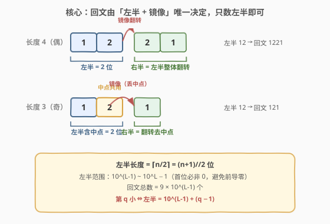
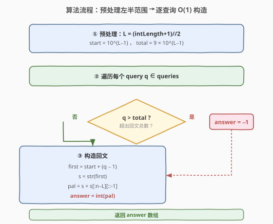

# 找到指定长度的回文数

- **题目名称**：找到指定长度的回文数
- **链接**：[2217. 找到指定长度的回文数](https://leetcode.cn/problems/find-palindrome-with-fixed-length/)
- **难度**：中等
- **标签**：数学、构造

## 1. 题目概述

给你一个整数数组 `queries` 和一个**正**整数 `intLength`，请你返回一个数组 `answer`，其中 `answer[i]` 是长度为 `intLength` 的**正回文数**中第 `queries[i]` 小的数字（1-indexed），如果不存在这样的回文数，则为 `-1`。

**回文数**指的是从前往后和从后往前读一模一样的数字。回文数**不能有前导 0**。

**示例 1**：

```text
输入：queries = [1,2,3,4,5,90], intLength = 3
输出：[101,111,121,131,141,999]
解释：长度为 3 的最小回文数依次是：
101, 111, 121, 131, 141, 151, 161, 171, 181, 191, 202, ...
第 90 个长度为 3 的回文数是 999。
```

**示例 2**：

```text
输入：queries = [2,4,6], intLength = 4
输出：[1111,1331,1551]
解释：长度为 4 的前 6 个回文数是：
1001, 1111, 1221, 1331, 1441 和 1551。
```

**约束条件**：

- $1 \le \text{queries.length} \le 5 \times 10^4$
- $1 \le \text{queries}[i] \le 10^9$
- $1 \le \text{intLength} \le 15$

> 💡 **题眼**：题目要的不是「判定某个数是否回文」，而是「按排名构造第 $q$ 小的回文数」。一旦意识到回文由「左半 + 镜像」唯一决定，问题就从「搜索枚举」降维成「$O(1)$ 直接构造」。

---

## 2. 解题思路

### 2.1 暴力思路：枚举后排序

最朴素的念头是按数值从小到大枚举所有 `intLength` 位的数，逐个判定回文，凑齐前 $k$ 个再回答查询。问题立刻暴露：

1. `intLength = 15` 时，15 位数的数量级是 $10^{14}$，枚举不可行；
2. `queries[i]` 可达 $10^9$，即便只枚举回文数也需要存海量结果；
3. 多次查询重复浪费——其实每个查询只依赖 `intLength` 和排名 $q$，彼此独立。

> ⚠️ 暴力法既不可行也不必要。回文数有**结构**，可以按结构直接编号，无需逐个枚举。

### 2.2 核心观察：左半决定一切



回文数左右对称，**只要确定左半部分，整个回文就唯一确定**。设回文长度为 $n$，左半长度（含奇数情况下的中点）为：

$$L = \left\lceil \frac{n}{2} \right\rceil = \left\lfloor \frac{n+1}{2} \right\rfloor$$

- **偶数长度**（$n=4$，$L=2$）：回文 = 左半 + 左半整体翻转。如左半 `12` → `12` + `21` = `1221`。
- **奇数长度**（$n=3$，$L=2$）：回文 = 左半 + 左半去末位后翻转。如左半 `12` → `12` + `1` = `121`，中点 `2` 被左右共用。

**左半的取值范围**（首位非零，避免前导 0）：

$$\text{左半} \in \left[10^{L-1},\ 10^{L}-1\right]$$

即从 `10…0`（$L$ 位，首位 1 后接 $L-1$ 个 0）到 `99…9`（$L$ 位全 9）。左半是个普通 $L$ 位整数，**按字典序/数值递增排列时，对应的回文也按数值递增**——这一点是「第 $q$ 小」能直接映射成「左半第 $q$ 小」的关键。

> 💡 **为何左半递增 ⇒ 回文递增**：左半是回文的**最高几位**，高位确定时低位对大小起决定作用。左半越小 ⇒ 最高位起的前缀越小 ⇒ 整个回文数值越小。镜像部分是左半的函数，不破坏这一单调性。因此「第 $q$ 小的回文」恰对应「第 $q$ 小的左半」。

**回文总数**：

$$\text{total} = (10^{L}-1) - 10^{L-1} + 1 = 9 \times 10^{L-1}$$

第 $q$ 小的左半（1-indexed）为：

$$\text{first} = 10^{L-1} + (q - 1)$$

若 $q > \text{total}$，则不存在，返回 `-1`。

### 2.3 算法流程图



预处理只算一次 `start` 与 `total`，之后每个查询 $O(1)$：

1. $L = (n+1)//2$，$\text{start} = 10^{L-1}$，$\text{total} = 9 \times 10^{L-1}$；
2. 对每个 $q$：若 $q > \text{total}$，答案为 $-1$；否则 $\text{first} = \text{start} + (q-1)$，再镜像构造完整回文串并转整数。

### 2.4 示例演算

![示例演算：queries=[1,2,3,4,5,90], intLength=3](../images/2217_example_walkthrough.svg)

以示例 1（$n=3$）展开：

- 预处理：$L = (3+1)//2 = 2$，$\text{start} = 10^1 = 10$，$\text{total} = 9 \times 10^1 = 90$；
- 镜像规则：`pal = s + s[:n-L][::-1]`，$n-L = 1$，即取 `s` 首位翻转后拼接；

| $q$ | $\text{first}=10+(q-1)$ | 左半串 `s` | 镜像 | 回文 |
|-----|-------------------------|-----------|------|------|
| 1 | 10 | `"10"` | `"1"` | `101` |
| 2 | 11 | `"11"` | `"1"` | `111` |
| 3 | 12 | `"12"` | `"1"` | `121` |
| 4 | 13 | `"13"` | `"1"` | `131` |
| 5 | 14 | `"14"` | `"1"` | `141` |
| 90 | 99 | `"99"` | `"9"` | `999` |

验证示例 2（$n=4$）：$L=2$，$\text{start}=10$，$n-L=2$，镜像取整个左半翻转。

| $q$ | $\text{first}$ | 左半串 | 镜像 | 回文 |
|-----|----------------|--------|------|------|
| 2 | 11 | `"11"` | `"11"` | `1111` |
| 4 | 13 | `"13"` | `"31"` | `1331` |
| 6 | 15 | `"15"` | `"51"` | `1551` |

与官方输出完全一致。

> ⚠️ **溢出提醒**：`intLength ≤ 15`，回文最多 15 位，最大值 $\approx 10^{15} < 9.2 \times 10^{18}$，可安全放入 64 位整型。C++ 中用 `long long` / `unsigned long long` 即可；`10^{L-1}` 与 `total` 的计算也用 `long long` 承载，避免 `9 * 10^7` 之类被误当作 32 位。

---

## 3. 参考代码

### C++

```cpp
class Solution {
  public:
    vector<long long> kthPalindrome(vector<int>& queries, int intLength) {
        int L = (intLength + 1) / 2;
        long long start = 1;
        for (int i = 1; i < L; ++i) start *= 10;
        long long total = 9 * start;

        vector<long long> ans;
        ans.reserve(queries.size());
        for (int q : queries) {
            if (q > total) {
                ans.push_back(-1);
                continue;
            }
            long long first = start + (q - 1);
            string s = to_string(first);
            int mirrorLen = intLength - L;
            string head = s.substr(0, mirrorLen);
            reverse(head.begin(), head.end());
            string pal = s + head;
            ans.push_back(stoll(pal));
        }
        return ans;
    }
};
```

> ⚠️ 题目返回类型按平台要求可能是 `vector<long long>`。若力扣中国版签名返回 `vector<long long>`，以上写法直接通过；若题目实际声明返回 `vector<int>`（仅 `intLength ≤ 8` 的旧约束），需相应调整——但本题约束 `intLength ≤ 15`，结果必用 64 位承载。

### Python

```python
class Solution:
    def kthPalindrome(self, queries: list[int], intLength: int) -> list[int]:
        L = (intLength + 1) // 2
        start = 10 ** (L - 1)
        total = 9 * start

        ans = []
        for q in queries:
            if q > total:
                ans.append(-1)
                continue
            first = start + (q - 1)
            s = str(first)
            pal = s + s[:intLength - L][::-1]
            ans.append(int(pal))
        return ans
```

> 💡 Python 的 `s[:k][::-1]` 等价于 `s[-(-1-k)::-1]`？不必绕弯——`s[:k][::-1]` 先取前 $k$ 个字符再整体翻转，语义最清晰。当 $k=0$（即 $n=L$，仅 $n=1$ 时出现）得到空串，回文即左半自身（一位数 1~9），逻辑正确。

### Python（数值版，避免字符串）

```python
class Solution:
    def kthPalindrome(self, queries: list[int], intLength: int) -> list[int]:
        L = (intLength + 1) // 2
        start = 10 ** (L - 1)
        total = 9 * start
        mirror_len = intLength - L

        ans = []
        for q in queries:
            if q > total:
                ans.append(-1)
                continue
            first = start + (q - 1)
            # 取 first 的低 mirror_len 位反转后拼接
            tail = 0
            x = first
            # 奇数长度时跳过中点：先丢掉末位（中点），再翻转剩余 mirror_len 位
            if intLength % 2 == 1:
                x //= 10
            for _ in range(mirror_len):
                tail = tail * 10 + x % 10
                x //= 10
            ans.append(first * (10 ** mirror_len) + tail)
        return ans
```

> ⚠️ 数值版需特别处理奇数长度：`first` 的最低位是中点，**不参与镜像**，故先 `x //= 10` 丢中点，再翻转 `mirror_len` 位。偶数长度时无中点，直接翻转。两种写法结果一致，字符串版更不易错。

---

## 4. 复杂度分析

| 维度 | 复杂度 | 说明 |
|------|--------|------|
| 时间复杂度 | $O\big(m \cdot \lceil n/2 \rceil\big)$ | $m = \text{len(queries)}$，每个查询构造长度为 $\lceil n/2 \rceil$ 的左半串并镜像；$n \le 15$ 时可视作 $O(m)$ |
| 空间复杂度 | $O(m)$ | 仅存答案数组；构造时的临时字符串长度 $O(n)$ 为常数 |

> 💡 $n \le 15$ 是个非常小的常数，单次构造最多处理 8 位左半，实际耗时与 $m$ 线性相关。瓶颈在查询数量 $m \le 5\times10^4$，$O(m)$ 完全够用。

---

## 5. 扩展：从构造到计数的统一视角

本题的「左半决定回文」思想可推广到一系列回文计数/构造问题：

**回文计数公式**：长度为 $n$ 的回文数总数恰为 $9 \times 10^{\lceil n/2\rceil - 1}$（首位非零）。这个公式是把「回文」和「$L$ 位普通整数」做**双射**得到的——左半的每个合法取值对应唯一回文，反之亦然。一旦建立双射，「第 $q$ 小回文」就等价于「第 $q$ 小的 $L$ 位整数」，直接 $+ (q-1)$ 即得。

**前导零的处理**：回文数不能有前导零，等价于左半首位不能为零。这把「首位非零约束」从 $n$ 位回文转移到 $L$ 位左半——$L$ 位整数的首位非零是个标准约束（范围 $[10^{L-1}, 10^L-1]$），无需额外特判。

**与位序定位的对照**：[400. 第 N 位数字](../0301-0400/400_第N位数字.md) 同样是「按位数分层定位」，把「第 $n$ 位」拆成「锁定层数 → 锁定数字 → 锁定数位」。本题把「第 $q$ 个回文」拆成「锁定左半 → 镜像」，二者共享「结构化编号 + 直接定位」的范式。

> 💡 **方法论**：遇到「第 $k$ 个满足某性质的数」类问题，先看这个性质是否带来**可枚举的参数化结构**——若性质把候选集压缩成某个低维参数（如本题的左半），就能把 $O(\text{全集})$ 的搜索压成 $O(1)$ 的定位。

---

## 6. 面试要点

1. **为什么左半递增时对应回文也递增？**

   - 左半是回文的最高 $\lceil n/2\rceil$ 位。整数大小比较从最高位起逐位决定，左半越小 ⇒ 最高几位越小 ⇒ 整个回文数值越小。镜像部分由左半完全决定，不破坏高位主导的单调性。因此「第 $q$ 小回文」⇔「第 $q$ 小左半」，可直接用 $\text{start} + (q-1)$。

2. **`intLength` 为奇数和偶数时，镜像构造有何区别？**

   - 偶数（$n=4, L=2$）：回文 = 左半 + 左半整体翻转，镜像长度 = $L$。
   - 奇数（$n=3, L=2$）：中点被左右共用，回文 = 左半 + 左半去末位翻转，镜像长度 = $L-1 = n-L$。
   - 统一写法：镜像长度 = $n - L$，取左半串的前 $n-L$ 位翻转拼接。$n$ 偶时 $n-L = L$（整体翻转），$n$ 奇时 $n-L = L-1$（去中点），一行兼容。

3. **如何判断查询无解（返回 -1）？**

   - 回文总数 $\text{total} = 9 \times 10^{L-1}$。当 $q > \text{total}$ 时无解。`intLength = 15` 时 $L = 8$，$\text{total} = 9\times10^7 = 90{,}000{,}000$，而 $q$ 可达 $10^9$，故大 `intLength` 下会有大量查询返回 -1。

4. **为什么 `first = start + (q - 1)` 而不是 `start + q`？**

   - 查询是 1-indexed：$q=1$ 对应最小回文（左半 = `start`），所以偏移量是 $q-1$。若误写成 `start + q`，会把第一个回文算成左半 `start+1`，整体错位一位。

5. **数值版与字符串版各有什么坑？**

   - 字符串版：注意 `s[:k][::-1]` 当 $k=0$ 时返回空串（$n=1$ 情形），逻辑正确，最不易错。
   - 数值版：奇数长度必须先 `x //= 10` 丢掉中点再翻转，否则会把中点也镜像进去（如 $n=3$ 左半 12 会错误地构造 1221 而非 121）。另外用 `long long` 承载结果，避免 $n=15$ 时溢出。

---

## 7. 同类练习题

- [9. 回文数](https://leetcode.cn/problems/palindrome-number/)（[题解](../0001-0100/9_回文数.md)）：回文判定的母题，反转一半数字的技巧与本题「左半决定回文」共享对称性洞察
- [400. 第 N 位数字](https://leetcode.cn/problems/nth-digit/)（[题解](../0301-0400/400_第N位数字.md)）：按位数分层定位第 $n$ 位数字，与本题「按左半定位第 $q$ 个回文」同属「结构化编号 + 直接定位」范式
- [479. 最大回文数乘积](https://leetcode.cn/problems/largest-palindrome-product/)：构造回文并验证因子分解，承接本题的回文构造技巧，反向求「最大」而非「第 $k$ 小」
- [866. 回文素数](https://leetcode.cn/problems/prime-palindrome/)：在回文数上叠加素数判定，需按回文结构枚举再筛，是本题构造思路的进阶应用
- [564. 寻找最近的回文数](https://leetcode.cn/problems/find-the-closest-palindrome/)：给定整数找最近回文，需构造若干候选（左半 ±1、全 9、全 10…），对左半镜像技巧的更深层运用
