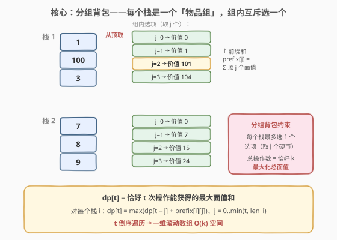
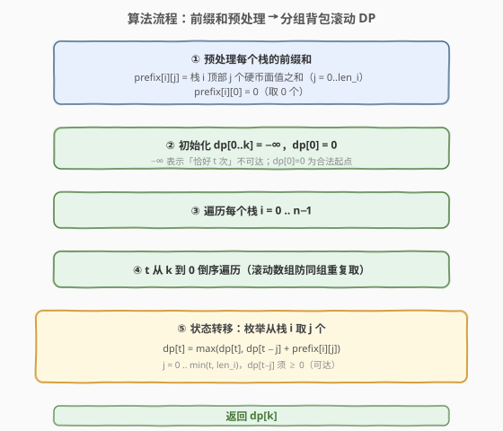

# 从栈中取出 K 个硬币的最大面值和

- **题目名称**：从栈中取出 K 个硬币的最大面值和
- **链接**：[2218. 从栈中取出 K 个硬币的最大面值和](https://leetcode.cn/problems/maximum-value-of-k-coins-from-piles/)
- **难度**：困难
- **标签**：数组、动态规划、分组背包

## 1. 题目概述

桌子上有 `n` 个硬币**栈**，每个栈从顶到底排列着带面值的硬币（正整数）。每次操作可从**任意一个栈的顶部**取走 1 枚硬币放入钱包。给定栈列表 `piles`（`piles[i]` 为第 `i` 个栈从顶到底的面值）和正整数 `k`，求**恰好**进行 `k` 次操作后钱包里面值之和的**最大值**。

**示例 1**：

```text
输入：piles = [[1,100,3],[7,8,9]], k = 2
输出：101
解释：从栈 1 取顶部 2 枚（1 + 100 = 101），优于其他组合。
```

**示例 2**：

```text
输入：piles = [[100],[100],[100],[100],[100],[100],[1,1,1,1,1,1,700]], k = 7
输出：706
解释：全部 7 次都从最后一个栈取：1+1+1+1+1+1+700 = 706。
```

**约束条件**：

- $1 \le n \le 1000$
- $1 \le \text{piles}[i][j] \le 10^5$
- $1 \le k \le \sum \text{len}(\text{piles}[i]) \le 2000$

> 💡 **题眼**：每个栈只能从顶部连续取，取 `j` 个的价值恰是前 `j` 个元素之和（前缀和）。把「从哪个栈取几个」翻译成「每组选一个选项」，问题立刻归约为**分组背包**——`n` 个组，每组选一个「取 $j$ 个」的选项，总份数恰好 $k$，最大化总价值。

---

## 2. 解题思路

### 2.1 暴力思路：回溯枚举

最朴素的想法是对每个栈决定取 0、1、2、… 枚，回溯所有组合，取满足总数恰为 $k$ 的最大价值。问题立刻暴露：

1. 每个栈最多取 $\min(k, \text{len}_i)$ 枚，组合数随 $n$ 指数膨胀；
2. $n \le 1000$ 时回溯树深达千层，完全不可行；
3. 大量子问题重复——「前 $i$ 个栈用了 $t$ 次操作的最大价值」被反复计算。

> ⚠️ 暴力回溯既超时又浪费。子问题具有**最优子结构**：前 $i$ 个栈的最优解可由前 $i-1$ 个栈的最优解递推。这正是分组背包 DP 的信号。

### 2.2 核心观察：分组背包 + 前缀和



**两个关键转化**：

**① 取 $j$ 个 ⇒ 前缀和**：栈是**从顶到底**的，取 $j$ 枚只能取最上面的 $j$ 个，没有选择余地。因此「从栈 $i$ 取 $j$ 枚的价值」就是该栈前 $j$ 个元素之和——预处理前缀和 $O(1)$ 查询：

$$\text{prefix}[i][j] = \sum_{t=0}^{j-1} \text{piles}[i][t], \quad j = 0, 1, \dots, \text{len}_i$$

其中 $\text{prefix}[i][0] = 0$（取 0 枚）。

**② 分组背包**：把每个栈视为一个**物品组**，组内有 $\text{len}_i + 1$ 个互斥选项（取 0 枚、取 1 枚、…、取 $\text{len}_i$ 枚），**每组至多选一个选项**。选项「取 $j$ 枚」的重量为 $j$、价值为 $\text{prefix}[i][j]$。目标：总重量恰好 $k$，最大化总价值。

> 💡 **为何是分组背包而非 0-1 背包**：0-1 背包每个物品独立选/不选；分组背包要求「同组物品互斥，至多选一个」。本题中「从同一个栈取 1 枚」和「从同一个栈取 2 枚」不能同时选（它们是同一栈的不同取法），正是分组背包的互斥约束。

**状态定义**：

$$\text{dp}[t] = \text{考虑前若干个栈后，恰好用 } t \text{ 次操作能获得的最大面值和}$$

**状态转移**（对第 $i$ 个栈）：

$$\text{dp}[t] = \max_{j=0}^{\min(t,\, \text{len}_i)} \big(\text{dp}_{\text{旧}}[t - j] + \text{prefix}[i][j]\big)$$

即：枚举从当前栈取 $j$ 枚（重量 $j$、价值 $\text{prefix}[i][j]$），剩余 $t - j$ 次操作由前 $i-1$ 个栈的最优解承接。

**滚动数组**：$\text{dp}$ 一维，$t$ **倒序**遍历（$k \to 0$），保证读到的 $\text{dp}[t-j]$ 是**上一轮**（前 $i-1$ 个栈）的旧值，不会被当前栈的更新污染——这与 0-1 背包倒序遍历防止「同物品重复取」是同一道理，这里防止「同组选了两个选项」。

### 2.3 算法流程图



完整步骤：

1. **预处理前缀和**：对每个栈 $i$，计算 $\text{prefix}[i][0..\text{len}_i]$；
2. **初始化**：$\text{dp}[0] = 0$，$\text{dp}[1..k] = -\infty$（$-\infty$ 表示「恰好 $t$ 次」不可达）；
3. **外层循环**：遍历每个栈 $i$；
4. **内层循环**：$t$ 从 $k$ 到 $0$ **倒序**；
5. **状态转移**：对每个 $t$，枚举 $j = 0 \dots \min(t, \text{len}_i)$，取 $\text{dp}[t-j] + \text{prefix}[i][j]$ 的最大值更新 $\text{dp}[t]$；
6. **返回** $\text{dp}[k]$。

> ⚠️ **初始化为何用 $-\infty$**：题目要求「恰好 $k$ 次」，$\text{dp}[t] = -\infty$ 表示「$t$ 次操作目前不可达」。若初始化为 $0$（即「至多 $k$ 次」），在硬币面值全为正数时结果恰好相同（多取总更优），但 $-\infty$ 写法语义更精确，也适用于面值可能为 $0$ 或负的变体。

### 2.4 示例演算

![示例演算：piles=[[1,100,3],[7,8,9]], k=2](../images/2218_example_walkthrough.svg)

以示例 1（`piles = [[1,100,3],[7,8,9]]`，`k = 2`）展开：

**预处理前缀和**：

| 栈 | 面值 | prefix[0] | prefix[1] | prefix[2] | prefix[3] |
|----|------|-----------|-----------|-----------|-----------|
| 1 | [1,100,3] | 0 | 1 | 101 | 104 |
| 2 | [7,8,9] | 0 | 7 | 15 | 24 |

**DP 演算**（初始 $\text{dp} = [0, -\infty, -\infty]$）：

**处理栈 1**（$t$ 从 $2 \to 0$）：

| $t$ | $j$ 候选 | $\text{dp}[t-j]+\text{prefix}[j]$ | 新 $\text{dp}[t]$ |
|-----|---------|-----------------------------------|-------------------|
| 2 | 0,1,2 | $-\infty+0,\ -\infty+1,\ \mathbf{0+101}$ | **101** |
| 1 | 0,1 | $-\infty+0,\ \mathbf{0+1}$ | **1** |
| 0 | 0 | $\mathbf{0+0}$ | **0** |

$\text{dp} = [0, 1, 101]$

**处理栈 2**（$t$ 从 $2 \to 0$）：

| $t$ | $j$ 候选 | $\text{dp}[t-j]+\text{prefix}[j]$ | 新 $\text{dp}[t]$ |
|-----|---------|-----------------------------------|-------------------|
| 2 | 0,1,2 | $\mathbf{101+0},\ 1+7,\ 0+15$ | **101** |
| 1 | 0,1 | $1+0,\ \mathbf{0+7}$ | **7** |
| 0 | 0 | $0+0$ | **0** |

$\text{dp} = [0, 7, 101]$

**答案**：$\text{dp}[2] = 101$（从栈 1 取 2 枚：$1 + 100 = 101$），与示例一致。

> 💡 注意处理栈 2 时 $\text{dp}[2]$ 候选有 $101+0=101$（栈 2 取 0 枚，沿用栈 1 的最优）、$1+7=8$（各取 1 枚）、$0+15=15$（栈 2 取 2 枚），最大仍为 101。这正体现了「每组互斥选一个」——栈 2 选了 $j$ 枚后，栈 1 的贡献由旧的 $\text{dp}[2-j]$ 承接。

---

## 3. 参考代码

### C++

```cpp
class Solution {
  public:
    int maxValueOfCoins(vector<vector<int>>& piles, int k) {
        int n = piles.size();
        // 预处理前缀和
        vector<vector<int>> prefix(n);
        for (int i = 0; i < n; ++i) {
            int m = piles[i].size();
            prefix[i].resize(m + 1, 0);
            for (int j = 0; j < m; ++j) {
                prefix[i][j + 1] = prefix[i][j] + piles[i][j];
            }
        }
        // 分组背包 DP
        vector<int> dp(k + 1, INT_MIN);
        dp[0] = 0;
        for (int i = 0; i < n; ++i) {
            int leni = piles[i].size();
            for (int t = k; t >= 0; --t) {
                for (int j = 1; j <= min(t, leni); ++j) {
                    if (dp[t - j] != INT_MIN) {
                        dp[t] = max(dp[t], dp[t - j] + prefix[i][j]);
                    }
                }
            }
        }
        return dp[k];
    }
};
```

> ⚠️ 内层 $j$ 从 $1$ 开始（$j=0$ 时 $\text{dp}[t-0]+\text{prefix}[0] = \text{dp}[t]+0$ 不改变值，跳过即可）。`dp[t-j] != INT_MIN` 的判断确保只从可达状态转移，避免 $-\infty$ 污染。由于面值全正且 $k \le \sum\text{len}$，`dp[k]` 最终必然可达。

### Python

```python
class Solution:
    def maxValueOfCoins(self, piles: list[list[int]], k: int) -> int:
        n = len(piles)
        # 预处理前缀和
        prefix = []
        for p in piles:
            acc = [0]
            for v in p:
                acc.append(acc[-1] + v)
            prefix.append(acc)
        # 分组背包 DP
        dp = [-10**9] * (k + 1)
        dp[0] = 0
        for i in range(n):
            leni = len(piles[i])
            for t in range(k, -1, -1):
                for j in range(1, min(t, leni) + 1):
                    if dp[t - j] >= 0:
                        dp[t] = max(dp[t], dp[t - j] + prefix[i][j])
        return dp[k]
```

> 💡 Python 用 $-10^9$ 代替 $-\infty$（足够小即可，因为最大面值和 $\le 2000 \times 10^5 = 2 \times 10^8$）。`dp[t-j] >= 0` 的判断等价于「该状态可达」——由于面值全正，任何可达状态的 $\text{dp}$ 值都 $\ge 0$。

---

## 4. 复杂度分析

| 维度 | 复杂度 | 说明 |
|------|--------|------|
| 时间复杂度 | $O(k \cdot S)$ | $S = \sum \text{len}(\text{piles}[i]) \le 2000$。每个栈 $i$ 的转移为 $O(k \cdot \min(k, \text{len}_i))$，求和 $\le k \cdot S = 2000 \times 2000 = 4 \times 10^6$ |
| 空间复杂度 | $O(k + S)$ | dp 数组 $O(k)$ + 前缀和 $O(S)$；若原地累加前缀和可降至 $O(k)$ |

> 💡 本题的复杂度甜区在于 $\sum\text{len} \le 2000$ 这一约束——它使得 $k \cdot S$ 不超过 $4 \times 10^6$，分组背包的三重循环（栈 × 容量 × 选项）在常数级内完成。若无此约束，需考虑前缀和优化或单调队列优化。

---

## 5. 扩展：分组背包的通用模板与变体

**通用模板**：分组背包的标准写法是三重循环——外层遍历组、中层容量倒序、内层遍历组内选项：

$$\text{dp}[t] = \max_{j \in \text{组}_i} \big(\text{dp}[t - w_j] + v_j\big)$$

与 0-1 背包的区别仅在于：0-1 背包的「组」只有一个物品（选或不选），分组背包的「组」有多个互斥物品。倒序遍历 $t$ 的目的相同——防止同组物品被重复选取。

**与 0-1 / 完全背包的对照**：

| 背包类型 | 物品关系 | 遍历方向 | 典型题 |
|----------|---------|---------|--------|
| 0-1 背包 | 每物独立选/不选 | 容量倒序 | [416. 分割等和子集](https://leetcode.cn/problems/partition-equal-subset-sum/) |
| 完全背包 | 每物可无限取 | 容量正序 | [322. 零钱兑换](https://leetcode.cn/problems/coin-change/) |
| 分组背包 | 同组互斥，至多选一 | 容量倒序 | **本题 2218** |
| 多重背包 | 每物有数量上限 | 二进制拆分 / 单调队列 | [279. 完全平方数](https://leetcode.cn/problems/perfect-squares/) |

**为何本题不能用完全背包**：完全背包允许同一物品取多次，但本题中「从栈 $i$ 取 1 枚」和「从栈 $i$ 取 2 枚」是**互斥选项**（取了 2 枚就不存在再「取 1 枚」的独立操作），不能用完全背包的正序遍历，否则会错误地把同栈的多个选项叠加。

> 💡 **方法论**：识别分组背包的关键信号是「候选选项天然分组且组内互斥」——如本题的「每个栈的不同取法」、多选题的「每题选一个选项」、资源分配的「每个项目选一种规模」。一旦识别出组结构，套用三重循环模板即可。

---

## 6. 面试要点

1. **为什么每个栈是「一组」而非「一个物品」？**

   - 一个物品只有选/不选两种状态。但栈 $i$ 有 $\text{len}_i + 1$ 种取法（取 0、1、…、$\text{len}_i$ 枚），每种取法的重量和价值都不同。这些取法**互斥**（取了 $j$ 枚就不能再独立取 $j'$ 枚），构成一个「物品组」。分组背包正是为「组内互斥多选一」建模。

2. **为什么 $t$ 要倒序遍历？**

   - 倒序保证转移时读到的 $\text{dp}[t-j]$ 是**上一轮**（前 $i-1$ 个栈）的旧值。若正序遍历，$\text{dp}[t-j]$ 可能已被当前栈 $i$ 更新过，导致「同一栈选了两个选项」（如先选取 1 枚再在更大的 $t$ 处又叠加选取 2 枚），破坏互斥约束。这与 0-1 背包倒序防重复选取是同一原理。

3. **前缀和预处理的作用是什么？**

   - 栈是 LIFO 结构，只能从顶部连续取。取 $j$ 枚的价值 = 前 $j$ 个面值之和，与取法无关（不存在「跳着取」）。预处理前缀和把每次查询从 $O(j)$ 降到 $O(1)$，总预处理 $O(S)$。没有前缀和，内层转移会多一层 $O(j)$ 的求和，总复杂度退化到 $O(k \cdot S^2)$。

4. **初始化用 $-\infty$ 还是 $0$？**

   - 题目要求「恰好 $k$ 次」，$-\infty$ 表示状态不可达，是精确写法。但由于面值全正（$\ge 1$），多取必更优，$k \le \sum\text{len}$ 保证 $k$ 次总可达，因此初始化为 $0$（「至多 $k$ 次」）结果也相同。面试中建议用 $-\infty$ 并解释原因，体现对「恰好」约束的理解。

5. **复杂度为什么是 $O(k \cdot S)$ 而非 $O(n \cdot k^2)$？**

   - 表面上三重循环是 $n \cdot k \cdot k$，但内层 $j$ 上限是 $\min(t, \text{len}_i) \le \text{len}_i$。对栈 $i$，转移总次数 $= \sum_{t=0}^{k} \min(t, \text{len}_i) \le k \cdot \text{len}_i$。求和得 $\sum_i k \cdot \text{len}_i = k \cdot S$。约束 $S \le 2000$、$k \le 2000$ 保证总操作 $\le 4 \times 10^6$。

---

## 7. 同类练习题

- [322. 零钱兑换](https://leetcode.cn/problems/coin-change/)（[题解](../0301-0400/322_零钱兑换.md)）：完全背包求最值，对照本题理解「正序=可重复取」与「倒序=互斥选一」的区别
- [416. 分割等和子集](https://leetcode.cn/problems/partition-equal-subset-sum/)（[题解](../0401-0500/416_分割等和子集.md)）：0-1 背包判定型，是分组背包「每组只有一个物品」的退化情况
- [474. 一和零](https://leetcode.cn/problems/ones-and-zeroes/)（[题解](../0401-0500/474_一和零.md)）：二维费用 0-1 背包，将「重量」推广到两维容量，与本题共享倒序遍历的滚动数组技巧
- [1049. 最后一块石头的重量 II](https://leetcode.cn/problems/last-stone-weight-ii/)（[题解](../1001-1100/1049_最后一块石头的重量II.md)）：0-1 背包求最值，问题转换为「赋 ± 号最小化两组差」，与本题同属背包家族的优化型
- [1155. 掷骰子等于给定总和的方法数](https://leetcode.cn/problems/number-of-dice-rolls-with-target-sum/)：分组背包计数型，每个骰子（组）选一个面值（选项），求总重量恰为目标的方法数——把本题的「求最大值」换成「求方案数」
