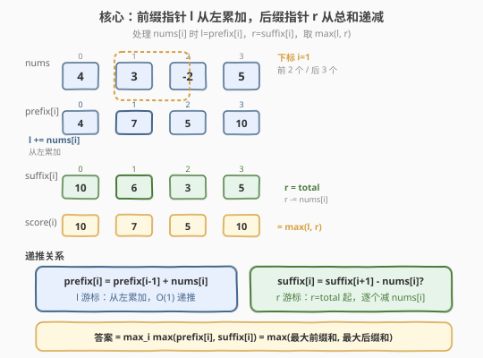
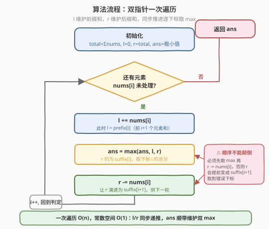

# LeetCode 数组的最大总分 题解

## 1. 题目概述

- **标题 / 题号**：数组的最大总分（#2219，medium）
- **链接**：https://leetcode.cn/problems/maximum-sum-score-of-array/
- **难度**：中等
- **标签**：数组、前缀和

**题意**：给你一个下标从 **0** 开始的整数数组 `nums`，数组长度为 `n`。

`nums` 在下标 `i`（$0 \le i \lt n$）处的**总分**等于下面两个分数中的**最大值**：

- `nums` **前** $i + 1$ 个元素的总和（即前缀和 $\text{prefix}[i] = \sum_{k=0}^{i}\text{nums}[k]$）
- `nums` **后** $n - i$ 个元素的总和（即后缀和 $\text{suffix}[i] = \sum_{k=i}^{n-1}\text{nums}[k]$）

返回数组 `nums` 在任一下标处能取得的**最大总分**。

**示例 1**：

```text
输入：nums = [4,3,-2,5]
输出：10
解释：
下标 0 处的最大总分是 max(4, 4+3+-2+5) = max(4, 10) = 10。
下标 1 处的最大总分是 max(4+3, 3+-2+5) = max(7, 6) = 7。
下标 2 处的最大总分是 max(4+3+-2, -2+5) = max(5, 3) = 5。
下标 3 处的最大总分是 max(4+3+-2+5, 5) = max(10, 5) = 10。
nums 可取得的最大总分是 10。
```

**示例 2**：

```text
输入：nums = [-3,-5]
输出：-3
解释：
下标 0 处的最大总分是 max(-3, -3+-5) = max(-3, -8) = -3。
下标 1 处的最大总分是 max(-3+-5, -5) = max(-8, -5) = -5。
nums 可取得的最大总分是 -3。
```

**约束**：

- $n == \text{nums.length}$
- $1 \le n \le 10^5$
- $-10^5 \le \text{nums[i]} \le 10^5$

> 💡 本题是会员题（🔒）。把「下标 $i$ 处的总分」翻译成公式就是 $\text{score}(i) = \max(\text{prefix}[i],\ \text{suffix}[i])$——前 $i+1$ 个元素的和 vs 后 $n-i$ 个元素的和，取大者。于是全局答案就是 $\max_i \max(\text{prefix}[i], \text{suffix}[i])$，可拆成「最大前缀和」与「最大后缀和」再取大，用一次扫描的双指针即可 $O(n)$/$O(1)$ 解决。

## 2. 解题思路

### 2.1 暴力思路：逐下标重算前缀/后缀和

最直白的做法是按定义逐个下标计算：对每个 $i$，从左累加到 $i$ 得前缀和，从 $i$ 累加到末尾得后缀和，取大者，最后取所有下标的大者。

```text
ans = -∞
for i in 0..n-1:
    pre = sum(nums[0..i])      # O(i) 累加
    suf = sum(nums[i..n-1])    # O(n-i) 累加
    ans = max(ans, pre, suf)
return ans
```

时间 $O(n^2)$（每个下标都要重算两段和），$n \le 10^5$ 时约 $10^{10}$ 次运算，不可行。但这个做法暴露了两个关键量：**前缀和** $\text{prefix}[i]$ 与**后缀和** $\text{suffix}[i]$——它们之间存在简单的递推关系，无需反复重算。

> ⚠️ 重复计算是暴力的根源：相邻下标 $i-1 \to i$ 的前缀和只差一个 $\text{nums}[i]$，后缀和也只差一个 $\text{nums}[i]$。把这两个递推用「双指针」同步推进，就能把 $O(n^2)$ 压成 $O(n)$。

### 2.2 核心观察：双指针同步推进——前缀和与后缀和的递推



**关键转化**：定义前缀和 $\text{prefix}[i] = \sum_{k=0}^{i}\text{nums}[k]$ 与后缀和 $\text{suffix}[i] = \sum_{k=i}^{n-1}\text{nums}[k]$。两者有天然的递推：

$$
\text{prefix}[i] = \text{prefix}[i-1] + \text{nums}[i], \qquad \text{suffix}[i] = \text{suffix}[i-1] - \text{nums}[i-1]
$$

更进一步，注意到 $\text{prefix}[i] + \text{suffix}[i+1] = \text{total}$（前 $i+1$ 个 + 后 $n-i-1$ 个 = 全数组），因此：

$$
\text{suffix}[i] = \text{total} - \text{prefix}[i-1] \quad (\text{prefix}[-1] \triangleq 0)
$$

于是我们用**两个游标同步推进**：左游标 `l` 维护前缀和（从 0 开始累加 $\text{nums}[i]$），右游标 `r` 维护后缀和（从 $\text{total}$ 开始减去 $\text{nums}[i-1]$）。在处理 $\text{nums}[i]$ 时，先让 `l += nums[i]` 得到 $\text{prefix}[i]$，此时 `r` 恰为 $\text{suffix}[i]$，取 $\max(\text{ans}, l, r)$ 后再 `r -= nums[i]` 让 `r` 演进为 $\text{suffix}[i+1]$。

**双指针状态表**：

| 阶段 | `l`（前缀指针） | `r`（后缀指针） | 含义 |
|------|------------------|------------------|------|
| 处理 `nums[i]` 前 | $\text{prefix}[i-1]$ | $\text{suffix}[i]$ | `r` 已是当前后缀和 |
| `l += nums[i]` 后 | $\text{prefix}[i]$ | $\text{suffix}[i]$ | 两者均为下标 $i$ 的值，取 $\max$ |
| `r -= nums[i]` 后 | $\text{prefix}[i]$ | $\text{suffix}[i+1]$ | 为下一轮做准备 |

**更进一步的化简**：由于 $\max_i \max(\text{prefix}[i], \text{suffix}[i]) = \max\big(\max_i \text{prefix}[i],\ \max_i \text{suffix}[i]\big)$，全局答案其实就是「最大前缀和」与「最大后缀和」的较大者。双指针在一次扫描中顺带维护了这两者的最大值，无需显式存储所有前缀/后缀和。

> 💡 **为什么 `ans` 要初始化为极小值？** 题目保证 $n \ge 1$，但元素可全为负（如示例 2 的 `[-3,-5]`，答案为 $-3$）。若把 `ans` 初值设为 `0` 会得到错误答案 `0`。应初始化为 $-10^{18}$（或语言中的 `INT64_MIN`/`-Infinity`），保证第一次比较即被真实值覆盖。另外总和可达 $10^5 \times 10^5 = 10^{10}$，超出 32 位整数范围，**必须用 64 位整数**（`long long` / `int` 在 Python 中自动大数）。

### 2.3 算法流程图



1. **预处理**：`total = sum(nums)`，初始化 `l = 0`（前缀游标）、`r = total`（后缀游标，等于下标 0 的后缀和）、`ans = -1e18`。
2. **遍历** `nums[i]`（$i$ 从 $0$ 到 $n-1$）：
   - **更新前缀**：`l += nums[i]`，此时 `l = prefix[i]`。
   - **取大**：`ans = max(ans, l, r)`，其中 `r = suffix[i]`，得到下标 $i$ 的总分。
   - **更新后缀**：`r -= nums[i]`，让 `r` 演进为 `suffix[i+1]`，供下一轮使用。
3. **返回** `ans`。

> 💡 时间 $O(n)$：一次遍历，每个元素做常数次加减与比较。空间 $O(1)$：只用 `l`、`r`、`ans` 三个变量（`total` 可在遍历前一次性求和，或边遍历边先累加）。

### 2.4 示例演算

![示例演算：[4,3,-2,5] 与 [-3,-5] 的双指针推进过程](../images/2219_example_walkthrough.svg)

**示例 1：`nums = [4,3,-2,5]`，`total = 10`**

| 步骤 | `nums[i]` | `l`（前缀） | `r`（后缀） | `max(l,r)` | `ans` |
|------|-----------|-------------|-------------|------------|-------|
| 初始 | — | 0 | 10 | — | $-\infty$ |
| ① i=0 | 4 | 4 | 10 | max(4,10)=10 | 10 |
| ② i=1 | 3 | 7 | 6 | max(7,6)=7 | 10 |
| ③ i=2 | -2 | 5 | 3 | max(5,3)=5 | 10 |
| ④ i=3 | 5 | 10 | 5 | max(10,5)=10 | 10 |

每步 `r` 的取值：处理 `nums[i]` **前** `r` 已是 `suffix[i]`（如 i=0 时 `r=10=suffix[0]`，i=1 时上一轮 `r-=4` 后 `r=6=suffix[1]`）。**答案 = 10** ✓

> 💡 注意 i=3（末尾）处 `r` 在 `r -= 5` 之前是 `suffix[3]=5`（只有最后一个元素），取 `max(10,5)=10`；末轮的 `r -= nums[i]` 让 `r=0`，但循环已结束，无影响。

**示例 2：`nums = [-3,-5]`，`total = -8`**

| 步骤 | `nums[i]` | `l`（前缀） | `r`（后缀） | `max(l,r)` | `ans` |
|------|-----------|-------------|-------------|------------|-------|
| 初始 | — | 0 | -8 | — | $-\infty$ |
| ① i=0 | -3 | -3 | -8 | max(-3,-8)=-3 | -3 |
| ② i=1 | -5 | -8 | -5 | max(-8,-5)=-5 | -3 |

**答案 = -3** ✓（全负数组，`ans` 初值必须为极小，否则会误判为 0）。

> ⚠️ 全负数组是本题最大的边界陷阱：`ans` 初始化为 `0` 会让示例 2 返回 `0` 而非 `-3`。务必用 `INT64_MIN` 或 `float('-inf')` 这类「比任何真实和都小」的初值。

## 3. 参考代码

### C++（双指针一次遍历，推荐）

```cpp
class Solution {
  public:
    long long maximumSumScore(vector<int>& nums) {
        long long l = 0;
        long long r = accumulate(nums.begin(), nums.end(), 0LL);
        long long ans = LLONG_MIN;
        for (int x : nums) {
            l += x;
            ans = max({ans, l, r});
            r -= x;
        }
        return ans;
    }
};
```

> 💡 `accumulate` 第三参数传 `0LL` 让累加在 `long long` 上进行，避免中途溢出。`max({ans, l, r})` 用初始化列表一次取三者最大。`ans` 初值用 `LLONG_MIN`（需 `#include <climits>`）或 `-1e18` 均可。

### C++（拆分观察版：最大前缀和 vs 最大后缀和）

```cpp
class Solution {
  public:
    long long maximumSumScore(vector<int>& nums) {
        long long ans = LLONG_MIN;
        long long prefix = 0;
        for (int x : nums) {
            prefix += x;
            ans = max(ans, prefix);
        }
        long long suffix = 0;
        for (int i = (int)nums.size() - 1; i >= 0; --i) {
            suffix += nums[i];
            ans = max(ans, suffix);
        }
        return ans;
    }
};
```

> ⚠️ 此版直接利用 $\max_i \max(\text{prefix}[i], \text{suffix}[i]) = \max(\max_i \text{prefix}[i],\ \max_i \text{suffix}[i])$ 的化简：分别求最大前缀和与最大后缀和，取大者。两趟扫描，逻辑更直观，适合面试时先讲清思路再优化为单趟双指针版。

### Python（双指针一次遍历）

```python
class Solution:
    def maximumSumScore(self, nums: List[int]) -> int:
        l = 0
        r = sum(nums)
        ans = float('-inf')
        for x in nums:
            l += x
            ans = max(ans, l, r)
            r -= x
        return ans
```

> 💡 Python 整数自带大数，无需担心溢出；`ans` 用 `float('-inf')` 作初值，返回时若全是真实整数会得到 `int`（`max(float('-inf'), int)` 在有真实值时返回 `int`）。若希望返回类型严格为 `int`，可把初值改为 `None` 并在首次单独赋值，或用 `-10**18`。

## 4. 复杂度分析

| 维度 | 复杂度 | 说明 |
|------|--------|------|
| 时间复杂度 | $O(n)$ | 双指针版一次遍历，每个元素做常数次加减与比较；拆分版两趟遍历仍为 $O(n)$ |
| 空间复杂度 | $O(1)$ | 仅用 `l`、`r`、`ans`（双指针版）或 `prefix`、`suffix`、`ans`（拆分版），常数额外空间，无需存储前缀和数组 |

> 💡 相比暴力的 $O(n^2)$，关键优化在于利用前缀和/后缀和的**递推关系**消除重复累加。若题目改为「多次区间和查询」，则应预处理完整前缀和数组 $O(n)$ 空间以支持 $O(1)$ 查询（见 [303. 区域和检索](https://leetcode.cn/problems/range-sum-query-immutable/)）；本题只需单次扫描的最大值，$O(1)$ 空间即可。

## 5. 扩展：从「逐点取大」到「双 max 拆分」的等价性

本题最优雅的观察是下面这个等价化简：

$$
\max_{0 \le i \lt n}\ \max\big(\text{prefix}[i],\ \text{suffix}[i]\big) \;=\; \max\Big(\max_i \text{prefix}[i],\ \max_i \text{suffix}[i]\Big)
$$

**证明**：令 $P = \max_i \text{prefix}[i]$，$S = \max_i \text{suffix}[i]$。

- 对任意 $i$，$\max(\text{prefix}[i], \text{suffix}[i]) \le \max(P, S)$，故左侧 $\le \max(P, S)$。
- 设 $P$ 在下标 $i^*$ 处取得（即 $\text{prefix}[i^*] = P$），则左侧 $\ge \max(\text{prefix}[i^*], \text{suffix}[i^*]) \ge \text{prefix}[i^*] = P$；同理左侧 $\ge S$。故左侧 $\ge \max(P, S)$。

两侧相等。这意味着我们可以把「每个下标算两个数再取大、最后取全局大」拆成「只求最大前缀和、最大后缀和、再取大」——双指针版在一次扫描中同时维护了这两者的最大值（`l` 的历史最大即 $P$，`r` 的历史最大即 $S$），因此本质上与拆分版等价。

> ⚠️ 这个「$\max$ 与 $\max$ 可交换」的性质只在**目标函数是分段取大**时成立。若题改为「下标 $i$ 处的总分是 $\min(\text{prefix}[i], \text{suffix}[i])$」，则 $\max_i \min(\text{prefix}[i], \text{suffix}[i]) \ne \min(\max_i \text{prefix}[i], \max_i \text{suffix}[i])$，化简失效，需另谋他法（如二分答案或单调性分析）。

## 6. 面试要点

1. **为什么答案等于「最大前缀和」与「最大后缀和」的较大者？**

   - 下标 $i$ 的总分是 $\max(\text{prefix}[i], \text{suffix}[i])$，全局答案是 $\max_i \max(\text{prefix}[i], \text{suffix}[i])$。由于「$\max$ 可交换」，这等于 $\max(\max_i \text{prefix}[i], \max_i \text{suffix}[i])$，即最大前缀和与最大后缀和的较大者。双指针版在一次扫描中顺带维护了这两个历史最大值。

2. **`ans` 为什么不能初始化为 0？应该初始化为多少？**

   - 元素可全为负（如 `[-3,-5]` 的答案是 $-3$），若 `ans` 初值为 `0` 会返回错误的 `0`。应初始化为「比任何真实和都小」的值：C++ 用 `LLONG_MIN`（或 `-1e18`，因 $|P|, |S| \le 10^{10}$），Python 用 `float('-inf')` 或 `-10**18`。注意总和可达 $10^{10}$，需用 64 位整数。

3. **双指针版中 `r` 的「时序」为什么是这样的——先取 max 再减？**

   - 进入循环体处理 `nums[i]` 时，`r` 保存的是上一轮 `r -= nums[i-1]` 之后的值，恰好等于 `suffix[i]`（后 $n-i$ 个元素的和）。因此先 `l += nums[i]` 得到 `prefix[i]`，立即 `ans = max(ans, l, r)` 取到下标 $i$ 的总分，最后 `r -= nums[i]` 让 `r` 演进为 `suffix[i+1]` 为下一轮做准备。顺序不能颠倒，否则 `r` 会提前变成 `suffix[i+1]` 导致取到错误的下标。

4. **能否只用一趟求最大后缀和？如何不求 total？**

   - 可以。最大后缀和 $\max_i \text{suffix}[i]$ 也可从右向左扫描维护一个反向累加变量得到（拆分版的第二趟）。若想严格一趟，需要先 $O(n)$ 求 `total` 再用双指针——总复杂度仍是 $O(n)$，但实际是「一次求和 + 一次遍历」两趟。真正的一趟做法是边遍历边累积 total 的延迟，但会让逻辑变绕，面试中双指针版已足够优雅。

5. **本题与 [724. 寻找数组的中心下标](https://leetcode.cn/problems/find-pivot-index/) 的前缀/后缀结构有何异同？**

   - 两者都用前缀和与后缀和。724 是判定型——找一个下标使 $\text{prefix}[i-1] == \text{suffix}[i+1]$（左和等于右和），关心「相等」；本题是优化型——找 $\max(\text{prefix}[i], \text{suffix}[i])$ 的全局最大，关心「取大」。724 的后缀和通过 $\text{total} - \text{prefix}[i] - \text{nums}[i]$ 推出，与本题 $\text{suffix}[i] = \text{total} - \text{prefix}[i-1]$ 同源，是前缀和应用的两种典型变体。

## 同类练习题

| # | 题目 | 与本题的关联 |
|---|------|-------------|
| 724 | [寻找数组的中心下标](https://leetcode.cn/problems/find-pivot-index/)（[题解](../0701-0800/724_寻找数组的中心下标.md)） | 同为前缀和 + 后缀和结构，但求「左和等于右和」的判定点，对照本题的「左和与右和取大」优化型 |
| 1732 | [找到最高海拔](https://leetcode.cn/problems/find-the-highest-altitude/) | 求最大前缀和的纯粹版（无后缀维度），是本题「最大前缀和」部分的母题 |
| 238 | [除自身以外数组的乘积](https://leetcode.cn/problems/product-of-array-except-self/) | 把前缀和/后缀和换成前缀积/后缀积的双指针同步推进，结构与本题的双游标同源 |
| 303 | [区域和检索 - 数组不可变](https://leetcode.cn/problems/range-sum-query-immutable/)（[题解](../0301-0400/303_区域和检索%20-%20数组不可变.md)） | 前缀和的最基础应用，预处理 $O(n)$ 支持任意区间和 $O(1)$ 查询，是理解本题前缀递推的入门 |
| 560 | [和为 K 的子数组](https://leetcode.cn/problems/subarray-sum-equals-k/)（[题解](../0501-0600/560_和为K的子数组.md)） | 前缀和 + 哈希的进阶应用，用前缀和差统计目标和子数组，展示前缀和在「子数组和」问题中的泛化 |
