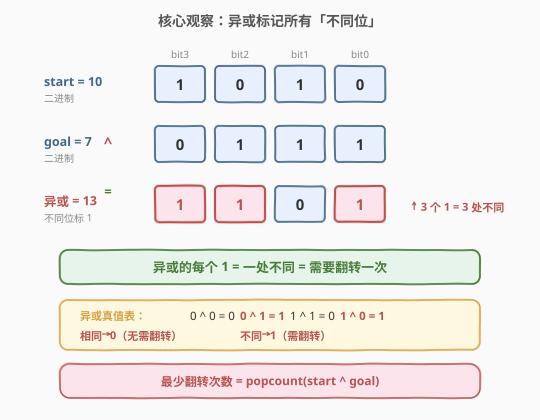
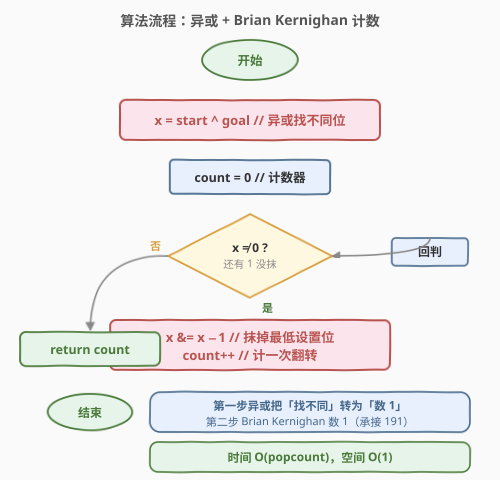
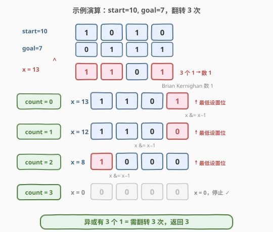

# LeetCode 转换数字的最少位翻转次数 题解

## 1. 题目概述

- **标题 / 题号**：转换数字的最少位翻转次数（#2220，easy）
- **链接**：https://leetcode.cn/problems/minimum-bit-flips-to-convert-number/
- **难度**：简单
- **标签**：位运算、异或

**题意**：一个整数的 **位翻转**（bit flip）是指在其二进制表示中任选一位，将该位从 `0` 变为 `1` 或从 `1` 变为 `0`。

给定两个整数 `start` 和 `goal`，返回将 `start` 转换为 `goal` 所需的**最少位翻转次数**。

**示例 1**：

```text
输入：start = 10, goal = 7
输出：3
解释：
  10 的二进制表示为 1010
   7 的二进制表示为 0111
  两者有 3 个二进制位不同（bit3、bit2、bit0），故需翻转 3 次。
```

**示例 2**：

```text
输入：start = 3, goal = 4
输出：3
解释：
   3 的二进制表示为 011
   4 的二进制表示为 100
  三个位全部不同，故需翻转 3 次。
```

**约束**：

- $0 \le \text{start}, \text{goal} \le 10^9$

> 💡 题眼在于「最少翻转次数」。逐位比较时，**只有两数二进制位不同的位置才需要翻转**，相同的位置无需动。因此问题等价于：**统计 `start` 与 `goal` 的二进制表示中有多少位不同**——这正是两数的**汉明距离（Hamming Distance）**。

## 2. 解题思路

### 2.1 暴力思路：逐位比较

最直观的做法是固定遍历每一位（对 $10^9$ 而言最多 30 位），每次取 `start` 和 `goal` 的同一位做比较：

```python
count = 0
for i in range(30):                      # 10^9 < 2^30
    if (start >> i) & 1 != (goal >> i) & 1:
        count += 1
return count
```

时间 $O(30) = O(1)$，空间 $O(1)$，能 AC。但逐位取值要循环满 30 次，即使大部分位相同也要逐个检查，且代码不够简洁。

> 💡 转机在于：能否**一次性找出所有不同的位**，再统计有多少个？异或运算 `^` 恰好能做到。

### 2.2 核心观察：异或标记所有「不同位」



关键性质是**异或运算**：对每一位，两数相同则结果为 `0`，不同则结果为 `1`。

$$\text{start} \oplus \text{goal} = \text{所有不同位的位置标 1}$$

异或的真值表一目了然：

| start 位 | goal 位 | 异或结果 | 含义 |
|----------|---------|----------|------|
| 0 | 0 | 0 | 相同，无需翻转 |
| 1 | 1 | 0 | 相同，无需翻转 |
| 0 | 1 | 1 | **不同，需翻转** |
| 1 | 0 | 1 | **不同，需翻转** |

因此：

$$\text{最少翻转次数} = \text{start} \oplus \text{goal} \text{ 中 } 1 \text{ 的个数}$$

> 💡 **关键转化**：异或运算把「找两数不同的位」这一操作压缩成**一步位运算**，之后只需对异或结果数 `1` 的个数（popcount）。这正是 [191. 位 1 的个数](../0001-0100/191_位1的个数.md) 和 [461. 汉明距离](https://leetcode.cn/problems/hamming-distance/) 的同一套路。

### 2.3 算法流程图



算法分两步：

1. **异或找不同**：`x = start ^ goal`，所有不同位在 `x` 中变为 `1`。
2. **数 1 的个数**：用 Brian Kernighan 技巧 `x &= x - 1` 逐个抹掉最低设置位，每抹一次 `count++`，直到 `x = 0`。

> 💡 Brian Kernighan 技巧 `x & (x - 1)` 会抹去 `x` 的最低设置位（最右边的 `1`），其余位不变。因此每执行一次，`x` 中 `1` 的个数严格减 1，循环次数恰好等于 popcount。详见 [191. 位 1 的个数](../0001-0100/191_位1的个数.md)。

### 2.4 示例演算

以示例 1 `start = 10, goal = 7`（答案 3）为例：



**第一步——异或**：

| | bit3 | bit2 | bit1 | bit0 | 十进制 |
|------|------|------|------|------|--------|
| start | 1 | 0 | 1 | 0 | 10 |
| goal | 0 | 1 | 1 | 1 | 7 |
| **异或 x** | **1** | **1** | 0 | **1** | 13 |

异或结果 `x = 13`（二进制 `1101`），有 3 个 `1`，意味着 3 处不同。

**第二步——Brian Kernighan 数 1**：

| 轮次 | x（十进制） | x（二进制） | x−1（二进制） | x & (x−1) | count |
|------|------------|------------|--------------|-----------|-------|
| 初始 | 13 | 1101 | — | — | 0 |
| 1 | 13 → 12 | 1101 | 1100 | 1100 | 1 |
| 2 | 12 → 8 | 1100 | 1011 | 1000 | 2 |
| 3 | 8 → 0 | 1000 | 0111 | 0000 | 3 |

3 轮后 `x = 0`，循环结束，`count = 3` ✓。每轮抹掉一个最低设置位（bit0 → bit2 → bit3），跳过中间的 `0` 位。

> 💡 **示例 2 验证**：`start = 3 (011)`, `goal = 4 (100)`，异或 `x = 7 (111)`，3 个 `1` → 翻转 3 次。三个位全不同，结论一致。

## 3. 参考代码

### C++：异或 + Brian Kernighan（$O(\text{popcount})$ / $O(1)$）

```cpp
class Solution {
public:
    int minBitFlips(int start, int goal) {
        int x = start ^ goal;
        int count = 0;
        while (x) {
            x &= x - 1;   // 抹掉最低设置位
            count++;
        }
        return count;
    }
};
```

### Python：异或 + Brian Kernighan（$O(\text{popcount})$ / $O(1)$）

```python
class Solution:
    def minBitFlips(self, start: int, goal: int) -> int:
        x = start ^ goal
        count = 0
        while x:
            x &= x - 1    # 抹掉最低设置位
            count += 1
        return count
```

也可一行调用内置函数（语义等价，底层走 C 实现）：

```python
class Solution:
    def minBitFlips(self, start: int, goal: int) -> int:
        return (start ^ goal).bit_count()        # Python 3.10+，最快
        # 或：return bin(start ^ goal).count('1')
```

> 💡 C++20 起可用 `std::popcount`（`<bit>` 头文件），Java 可用 `Integer.bitCount(x)`，均为底层最优实现。面试中先讲异或 + Brian Kernighan 的思路，再提内置函数作为「工程最优」补充。

## 4. 复杂度分析

| 维度 | 复杂度 | 说明 |
|------|--------|------|
| **时间复杂度** | $O(\text{popcount}(x))$ | 异或 $O(1)$；循环次数等于异或结果中 `1` 的个数；最坏情况（30 位全 `1`，$10^9 < 2^{30}$）为 $O(30) = O(1)$ |
| **空间复杂度** | $O(1)$ | 仅用 `x` 和 `count` 两个变量 |

> 💡 本题数据范围 $10^9 < 2^{30}$，位数为常数级，故时间复杂度严格说 $O(\text{popcount})$ 也可视作 $O(1)$。重点在于异或把「逐位比较」转化为「数 1」这一思维飞跃。

## 5. 扩展：逐位移位法与内置函数对比

数异或结果中 `1` 的个数有多种实现，复杂度与适用场景各异：

| 写法 | 循环次数 | 说明 |
|------|----------|------|
| 逐位移位 `(x >> i) & 1` | 固定 30 | 不跳 `0`，最朴素 |
| **Brian Kernighan `x &= x - 1`** | popcount | 跳过所有 `0` 位，本题最优解 |
| `(start ^ goal).bit_count()` | 1（CPU 指令） | Python 3.10+ / C++20 `std::popcount`，最快 |

**逐位移位法**也能 AC，适合讲解时作为对照：

```python
class Solution:
    def minBitFlips(self, start: int, goal: int) -> int:
        x = start ^ goal
        count = 0
        while x:
            count += x & 1
            x >>= 1
        return count
```

> ⚠️ 逐位移位法无需固定循环 30 次——当 `x` 右移到 `0` 即可停止，因此高位全 `0` 时比固定 30 次更快，但仍不如 Brian Kernighan（后者还跳过中间的 `0` 位）。

> 💡 **异或的另一个视角——汉明距离**：本题本质是求 `start` 和 `goal` 的汉明距离（两等长二进制串对应位不同的总数）。[461. 汉明距离](https://leetcode.cn/problems/hamming-distance/) 与本题完全同构：异或后数 `1`。掌握了本题，461 即可秒杀。

## 6. 面试要点

1. **为什么异或能找出所有不同的位？**

   - 异或的真值表：`0 ^ 0 = 0`、`1 ^ 1 = 0`（相同为 `0`），`0 ^ 1 = 1`、`1 ^ 0 = 1`（不同为 `1`）。因此 `start ^ goal` 的结果中，每个 `1` 恰好对应一个两数不同的位，每个 `0` 对应相同的位。翻转次数 = 不同位的个数 = 异或结果中 `1` 的个数。

2. **`x &= x - 1` 为什么能抹掉最低设置位？**

   - 设最低设置位在第 `k` 位。`x - 1` 向低位借位：第 `k` 位 `1→0`，第 `0..k-1` 位 `0→1`，更高位不变。与 `x` 按位与后，第 `k` 位 `1 & 0 = 0`（抹掉），更低位 `0 & 1 = 0`（仍为 `0`），更高位不变。故结果只比 `x` 少一个最低设置位。详见 [191. 位 1 的个数](../0001-0100/191_位1的个数.md)。

3. **本题与汉明距离有什么关系？**

   - 汉明距离定义为两等长二进制串对应位不同的总数。本题求「翻转次数」=「不同位的个数」= 汉明距离。[461. 汉明距离](https://leetcode.cn/problems/hamming-distance/) 与本题算法完全相同：异或后 popcount。

4. **时间复杂度是 $O(1)$ 还是 $O(\text{popcount})$？**

   - 严格说是 $O(\text{popcount}(x))$，循环次数等于异或结果中 `1` 的个数。但 $10^9 < 2^{30}$，popcount 上界为 30，故也可视作 $O(1)$（最坏 30 次常数级操作）。两种表述都对，关键是能说清「循环次数 = `1` 的个数」这一性质。

5. **能否不用循环，一步求出答案？**

   - 可以。Python 3.10+ 的 `int.bit_count()`、C++20 的 `std::popcount`、Java 的 `Integer.bitCount()` 均映射到 CPU 的 `POPCNT` 指令，一步完成。面试中先讲异或 + Brian Kernighan 展示位运算功底，再提内置函数作为工程最优补充。

> 💡 **一句话总结**：2220 是「异或找不同 + 数 1」的经典位运算模板题——`start ^ goal` 一步找出所有不同位，再用 Brian Kernighan `x &= x - 1` 数 `1` 的个数，$O(\text{popcount})$ 一趟搞定，承接 191 与 461。

## 同类练习题

| # | 题目 | 与本题的关联 |
|---|------|-------------|
| 461 | [汉明距离](https://leetcode.cn/problems/hamming-distance/) | 两数异或后数 `1`，与本题算法完全相同，本题的「原型题」 |
| 191 | [位 1 的个数](../0001-0100/191_位1的个数.md)（[题解](../0001-0100/191_位1的个数.md)） | Brian Kernighan `n & (n-1)` 数 `1` 的母题，本题第二步的技巧来源 |
| 338 | [比特位计数](https://leetcode.cn/problems/counting-bits/) | 对 `0..n` 每个数求 popcount，用 DP 复用 `ans[i & (i-1)]`，popcount 的批量版 |
| 231 | [2 的幂](https://leetcode.cn/problems/power-of-two/) | 用 `n & (n-1) == 0` 判定，同一 Brian Kernighan 技巧的另一经典应用 |
| 476 | [数字的补数](https://leetcode.cn/problems/number-complement/) | 位翻转的「全翻转」变体（翻转所有位），对照本题的「选择性翻转」 |
