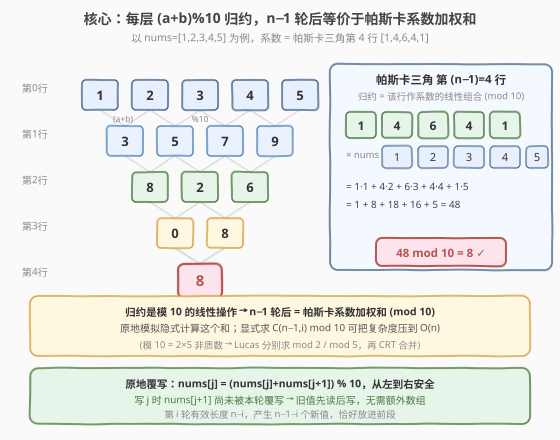
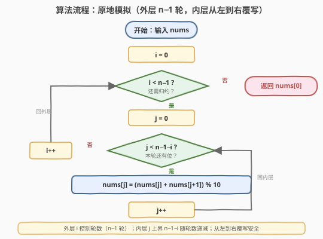

# LeetCode 数组的三角和 题解

## 1. 题目概述

- **标题 / 题号**：数组的三角和（#2221，medium）
- **链接**：https://leetcode.cn/problems/find-triangular-sum-of-an-array/
- **难度**：中等
- **标签**：数组、模拟、数学、组合数

**题意**：给定一个下标从 **0** 开始的整数数组 `nums`，其中 `nums.length >= 1`。数组的**三角和**是反复执行下述归约操作后剩下的唯一元素的值：

1. 构造一个长度为 `n - 1` 的新数组 `newNums`，其中 `newNums[i] = (nums[i] + nums[i+1]) % 10`（对每个 `0 <= i <= n - 2`）；
2. 令 `nums = newNums`；
3. 重复直到 `nums` 长度为 1。

返回最后剩下的那个元素。

**示例 1**：

```text
输入：nums = [1,2,3,4,5]
输出：8
解释：归约过程如下
  [1,2,3,4,5]
  [3,5,7,9]      // (1+2, 2+3, 3+4, 4+5) 各位取模 10
  [8,2,6]        // (3+5, 5+7, 7+9) 取模 10
  [0,8]          // (8+2, 2+6) 取模 10
  [8]            // (0+8) 取模 10
```

**示例 2**：

```text
输入：nums = [5]
输出：5
```

**约束**：

- $1 \le \text{nums.length} \le 1000$
- $0 \le \text{nums[i]} \le 9$

> 💡 本题看似是简单的「层层相邻求和取模」，但反复归约的实质是**以帕斯卡三角第 $n-1$ 行为系数的线性组合**。理解这一点后，既能写出 $O(n^2)$ 的原地模拟，也能进一步用 Lucas 定理 + 中国剩余定理把复杂度压到 $O(n)$。

## 2. 解题思路

### 2.1 暴力思路：逐层开新数组模拟

最直白的做法是完全照搬题目描述：每一轮申请一个长度减一的新数组，逐位填入 `(nums[i] + nums[i+1]) % 10`，再把 `nums` 指向新数组，直到长度为 1。

```text
while len(nums) > 1:
    newNums = [(nums[i] + nums[i+1]) % 10 for i in range(len(nums)-1)]
    nums = newNums
return nums[0]
```

共需 $n - 1$ 轮，第 $k$ 轮处理 $n - k$ 个元素，总运算量 $\sum_{k=1}^{n-1}(n-k) = \frac{n(n-1)}{2}$，时间 $O(n^2)$；每轮开新数组，空间 $O(n)$（峰值）。

> ⚠️ 对 $n \le 1000$，$O(n^2) \approx 5 \times 10^5$ 次运算完全可接受。真正的优化点是**空间**：每一轮的新值只依赖上一轮的相邻两位，且新数组更短——完全可以从左到右**原地覆写**前段，省掉所有额外数组。

### 2.2 核心观察：原地归约 + 帕斯卡三角的线性组合



**观察一：归约是线性的（模 10）**。每一步 `newNums[i] = (nums[i] + nums[i+1]) % 10` 是对原数组的**线性组合**（系数 1 和 1，模 10）。线性操作的复合仍是线性操作，所以经过 $n-1$ 轮后，最终结果可写成原数组每个元素的线性组合：

$$
\text{ans} = \sum_{i=0}^{n-1} c_i \cdot \text{nums[i]} \pmod{10}
$$

**观察二：系数恰好是帕斯卡三角的第 $n-1$ 行**。把归约过程画成金字塔，第 0 行是原数组，第 $k$ 行由第 $k-1$ 行相邻求和取模得到。这与帕斯卡三角的递推 $C(m,k) = C(m-1,k-1) + C(m-1,k)$ 完全同构（只是多了 `% 10`）。因此：

$$
c_i = \binom{n-1}{i}
$$

以 `nums = [1,2,3,4,5]`（$n=5$，$n-1=4$）为例，系数为帕斯卡第 4 行 $[1,4,6,4,1]$：

$$
\text{ans} = (1{\cdot}1 + 4{\cdot}2 + 6{\cdot}3 + 4{\cdot}4 + 1{\cdot}5) \bmod 10 = 48 \bmod 10 = 8 \;\checkmark
$$

> 💡 这解释了为什么模拟法正确——它就是在隐式地计算这个加权和。同时也意味着：**只要能求出 $\binom{n-1}{i} \bmod 10$，就能 $O(n)$ 直接算答案**（见第 5 节扩展）。

**观察三：原地覆写**。第 $k$ 轮产生的新值长度为 $n-k$，恰好能放进原数组的前 $n-k$ 个位置而不覆盖尚未使用的旧值。具体地，从左到右执行 `nums[j] = (nums[j] + nums[j+1]) % 10`：

| 写入 `nums[j]` 时 | 读取的 `nums[j]` | 读取的 `nums[j+1]` | 是否已被本轮覆写？ |
|------------------|------------------|---------------------|---------------------|
| `j = 0` | 旧值 `nums[0]` | 旧值 `nums[1]` | 否，`nums[1]` 本轮尚未写 |
| `j = 1` | **新值** `nums[1]`? | 旧值 `nums[2]` | — |

> ⚠️ 注意：若从左到右写，`j=0` 写完后 `nums[0]` 被覆盖，但 `j=1` 读的是 `nums[1]`（旧值，未覆写）和 `nums[2]`（旧值），**不读 `nums[0]`**，所以左到右是安全的！关键在于每个新值 `nums[j]` 只读 `nums[j]` 和 `nums[j+1]`，而 `nums[j+1]` 在写 `j` 时还未被覆写（它要等到 `j+1` 这一步才被写）。因此**从左到右原地覆写正确**。

```text
for i in 0 .. n-2:          # 共 n-1 轮
    for j in 0 .. n-2-i:    # 第 i 轮处理前 n-1-i 个
        nums[j] = (nums[j] + nums[j+1]) % 10
return nums[0]
```

### 2.3 算法流程图



1. **外层循环** `i` 从 $0$ 到 $n-2$（共 $n-1$ 轮归约）。
2. **内层循环** `j` 从 $0$ 到 $n-2-i$（第 `i` 轮后数组有效长度为 $n-i$，产生 $n-1-i$ 个新值）。
3. **原地更新**：`nums[j] = (nums[j] + nums[j+1]) % 10`，从左到右依次覆写。
4. **终止**：`n-1` 轮后有效长度为 1，`nums[0]` 即为答案。

> 💡 时间 $O(n^2)$，空间 $O(1)$ 额外（在传入数组上原地修改）。若不允许修改输入，先复制一份即可，空间 $O(n)$。

### 2.4 示例演算

![示例演算：[1,2,3,4,5] 的 4 轮归约过程](../images/2221_example_walkthrough.svg)

**示例 1：`nums = [1,2,3,4,5]`**（$n=5$，需 4 轮）

| 轮次 `i` | 有效数组（操作前） | 计算 `(a+b)%10` | 操作后有效数组 | 长度 |
|----------|---------------------|-----------------|----------------|------|
| 0 | `[1,2,3,4,5]` | `(1+2, 2+3, 3+4, 4+5)` | `[3,5,7,9]` | 4 |
| 1 | `[3,5,7,9]` | `(3+5, 5+7, 7+9)` = `(8, 12, 16)` | `[8,2,6]` | 3 |
| 2 | `[8,2,6]` | `(8+2, 2+6)` = `(10, 8)` | `[0,8]` | 2 |
| 3 | `[0,8]` | `(0+8)` = `(8)` | `[8]` | 1 |

原地覆写后数组实际内存变化（末位旧值被忽略）：

```text
初始:  [1, 2, 3, 4, 5]
i=0:  [3, 5, 7, 9, 5]   // 前 4 位覆写，nums[4]=5 不再使用
i=1:  [8, 2, 6, 9, 5]   // 前 3 位覆写
i=2:  [0, 8, 6, 9, 5]   // 前 2 位覆写
i=3:  [8, 8, 6, 9, 5]   // 前 1 位覆写 → nums[0]=8
```

**答案 = 8** ✓

**示例 2：`nums = [5]`**（$n=1$，无需归约）→ 直接返回 `nums[0] = 5` ✓

> ⚠️ $n=1$ 时外层循环 `i < n-1 = 0` 不执行，直接返回 `nums[0]`，边界天然正确。

## 3. 参考代码

### C++（原地模拟，推荐）

```cpp
class Solution {
  public:
    int triangularSum(vector<int>& nums) {
        int n = nums.size();
        for (int i = 0; i < n - 1; ++i) {
            for (int j = 0; j < n - 1 - i; ++j) {
                nums[j] = (nums[j] + nums[j + 1]) % 10;
            }
        }
        return nums[0];
    }
};
```

> 💡 外层 `i` 控制轮数，内层 `j` 的上界 `n - 1 - i` 随轮数递减——第 `i` 轮后有效长度为 `n - i`，只需产生 `n - 1 - i` 个新值。从左到右覆写安全（见 2.2 观察三）。

### Python（原地模拟）

```python
class Solution:
    def triangularSum(self, nums: List[int]) -> int:
        n = len(nums)
        for i in range(n - 1):
            for j in range(n - 1 - i):
                nums[j] = (nums[j] + nums[j + 1]) % 10
        return nums[0]
```

### Python（不修改输入版，先复制）

```python
class Solution:
    def triangularSum(self, nums: List[int]) -> int:
        a = nums[:]               # 复制，保护原数组
        n = len(a)
        for i in range(n - 1):
            for j in range(n - 1 - i):
                a[j] = (a[j] + a[j + 1]) % 10
        return a[0]
```

## 4. 复杂度分析

| 维度 | 复杂度 | 说明 |
|------|--------|------|
| 时间复杂度 | $O(n^2)$ | 共 $n-1$ 轮，第 $i$ 轮做 $n-1-i$ 次加法取模，总计 $\frac{n(n-1)}{2}$ 次运算 |
| 空间复杂度 | $O(1)$ 额外 | 原地覆写，仅用 `i`、`j` 两个循环变量；若复制输入则 $O(n)$ |

> 💡 对 $n \le 1000$，$O(n^2)$ 约 $5 \times 10^5$ 次运算，远在时限内。若 $n$ 大到 $10^5$，则需切换到第 5 节的 $O(n)$ 组合数法。

## 5. 扩展：$O(n)$ 组合数法（Lucas 定理 + 中国剩余定理）

由 2.2 节，$\text{ans} = \sum_{i=0}^{n-1} \binom{n-1}{i} \cdot \text{nums[i]} \pmod{10}$。若能在 $O(1)$ 内算出每个 $\binom{n-1}{i} \bmod 10$，整体即 $O(n)$。

**难点**：模 $10$ 不是质数（$10 = 2 \times 5$），不能直接用费马小定理求逆元。但 $2$ 与 $5$ 互素，可分别求模 $2$、模 $5$ 的值，再用**中国剩余定理（CRT）**合并。

**步骤一：求 $\binom{m}{i} \bmod 2$（$m = n-1$）**

由 Lucas 定理（基 $2$），$\binom{m}{i} \bmod 2 = 1$ 当且仅当 $i$ 的二进制是 $m$ 的子掩码，即 `(i & m) == i`。

**步骤二：求 $\binom{m}{i} \bmod 5$（Lucas 定理，基 $5$）**

将 $m$、$i$ 写成 $5$ 进制，逐位取组合数相乘：

$$
\binom{m}{i} \equiv \prod_{j} \binom{m_j}{i_j} \pmod{5}, \quad m_j, i_j \in \{0,1,2,3,4\}
$$

每位 $\binom{m_j}{i_j} \bmod 5$ 可用 $5 \times 5$ 预计算表直接查（数字只有 $0\sim4$）。

**步骤三：CRT 合并为模 $10$**

设 $a_2 = \binom{m}{i} \bmod 2$，$a_5 = \binom{m}{i} \bmod 5$。模 $5$ 同余 $a_5$ 的 $[0,10)$ 内候选只有 $a_5$ 与 $a_5 + 5$，挑出奇偶性匹配 $a_2$ 的那个即可：

```python
c = a5 if (a5 % 2 == a2) else (a5 + 5)
```

**验证（$m=4$，系数应为 $[1,4,6,4,1]$）**：

| $i$ | $a_2$ | $a_5$ | 候选 $\{a_5, a_5{+}5\}$ | 选 $c$（奇偶匹配 $a_2$） | $\binom{4}{i}$ |
|-----|-------|-------|--------------------------|--------------------------|----------------|
| 0 | 1 | 1 | $\{1,6\}$ | 1（奇） | 1 ✓ |
| 1 | 0 | 4 | $\{4,9\}$ | 4（偶） | 4 ✓ |
| 2 | 0 | 1 | $\{1,6\}$ | 6（偶） | 6 ✓ |
| 3 | 0 | 4 | $\{4,9\}$ | 4（偶） | 4 ✓ |
| 4 | 1 | 1 | $\{1,6\}$ | 1（奇） | 1 ✓ |

```python
class Solution:
    def triangularSum(self, nums: List[int]) -> int:
        m = len(nums) - 1
        # 预计算 C[a][b] mod 5（a, b 仅 0..4）
        C5 = [[0] * 5 for _ in range(5)]
        for a in range(5):
            C5[a][0] = 1
            for b in range(1, a + 1):
                C5[a][b] = (C5[a - 1][b - 1] + C5[a - 1][b]) % 5

        def lucas5(n_, k_):
            res = 1
            while n_ > 0 or k_ > 0:
                res = res * C5[n_ % 5][k_ % 5] % 5
                n_ //= 5
                k_ //= 5
            return res

        ans = 0
        for i in range(len(nums)):
            a2 = 1 if (i & m) == i else 0          # 模 2：子掩码判定
            a5 = lucas5(m, i)                       # 模 5：Lucas
            c = a5 if (a5 % 2 == a2) else (a5 + 5)  # CRT 合并模 10
            ans = (ans + c * nums[i]) % 10
        return ans
```

> ⚠️ 此法把时间压到 $O(n \log_5 m) \approx O(n)$，空间 $O(1)$。但实现较重，仅当 $n$ 极大（如 $10^5$）时才值得采用；$n \le 1000$ 时原地模拟更简单且足够快。面试中可作为「如何优化到线性」的进阶讨论。

## 6. 面试要点

1. **原地覆写为什么从左到右是安全的？**

   - 每个新值 `nums[j] = (nums[j] + nums[j+1]) % 10` 只读 `nums[j]` 和 `nums[j+1]`。从左到右写时，写 `j` 会覆盖 `nums[j]`，但下一步 `j+1` 读的是 `nums[j+1]`（旧值，本轮尚未被写）和 `nums[j+2]`（旧值），并不读已被覆盖的 `nums[j]`。因此旧值在被读取后才被覆盖，顺序安全。若改成从右到左则会出错：写 `j` 时 `nums[j+1]` 已被本轮新值覆盖。

2. **归约过程和帕斯卡三角有什么关系？为什么系数是 $\binom{n-1}{i}$？**

   - 归约递推 `f_k[i] = (f_{k-1}[i] + f_{k-1}[i+1]) % 10` 与帕斯卡三角 `C(m,k) = C(m-1,k-1) + C(m-1,k)` 同构。展开 $n-1$ 层后，原数组第 $i$ 个元素被相加的次数正是从顶端走到它的路径数，即 $\binom{n-1}{i}$。所以最终结果是 $\sum \binom{n-1}{i} \cdot \text{nums[i]} \pmod{10}$。

3. **为什么模 10 不能直接用费马小定理求逆元？如何处理？**

   - 费马小定理要求模数为质数，而 $10 = 2 \times 5$ 非质数，许多数与 10 不互素（如 2、5、4、6、8）没有逆元。处理方式是**分解为模 2 和模 5**（互素），分别用 Lucas 定理求组合数，再用中国剩余定理合并回模 10。

4. **$n=1$ 的边界如何处理？**

   - $n=1$ 时外层循环 `i < n-1 = 0` 不执行，直接返回 `nums[0]`，无需特判。单元素数组的三角和就是它本身。

5. **如果 `nums[i]` 范围扩大到 $0 \sim 10^9$（不再是个位数），模拟法还成立吗？**

   - 仍成立。`(a + b) % 10` 只保留个位，与 `nums[i]` 的量级无关——任何整数对 10 取模后等价于其个位。因此扩大范围不影响算法，取模 10 天然把大数归约到个位参与运算。

## 同类练习题

| # | 题目 | 与本题的关联 |
|---|------|-------------|
| 118 | [杨辉三角](https://leetcode.cn/problems/pascals-triangle/)（[题解](../0001-0100/118_杨辉三角.md)） | 本题归约系数即帕斯卡三角第 $n-1$ 行，118 是构造帕斯卡三角本身，二者递推结构完全同构 |
| 119 | [杨辉三角 II](https://leetcode.cn/problems/pascals-triangle-ii/)（[题解](../0101-0200/119_杨辉三角II.md)） | 只返回第 $k$ 行，对应本题的系数行，可用单数组倒序递推 $O(k)$ 空间 |
| 415 | [字符串相加](https://leetcode.cn/problems/add-strings/)（[题解](../0401-0500/415_字符串相加.md)） | 同为逐位求和的模拟思想——本题取模 10 丢弃进位，415 保留进位传递到高位，互为「取模 vs 进位」对照 |
| 62 | [不同路径](https://leetcode.cn/problems/unique-paths/) | 路径计数本质是组合数 $\binom{m+n-2}{m-1}$，与本题系数 $\binom{n-1}{i}$ 同源，理解帕斯卡递推即可贯通 |
| 877 | [石子游戏](https://leetcode.cn/problems/stone-game/)（[题解](../0801-0900/877_石子游戏.md)） | 同为「相邻元素层层归约」的区间结构，但用博弈型区间 DP 从两端取，与本题相邻求和归约形成「取端 vs 取邻」对照 |
