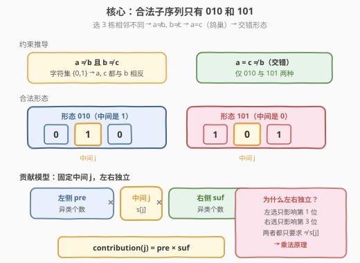
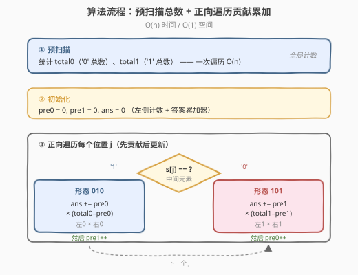
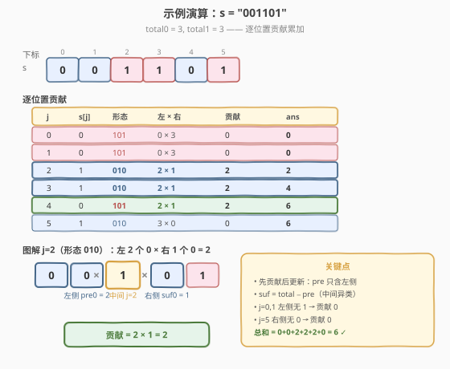

# 选择建筑的方案数

- **题目名称**：选择建筑的方案数
- **链接**：[2222. 选择建筑的方案数](https://leetcode.cn/problems/number-of-ways-to-select-buildings/)
- **难度**：中等
- **标签**：字符串、数学、计数、前缀和

## 1. 题目概述

给你一个下标从 0 开始的二进制字符串 `s`，表示一条街沿途的建筑类型：

- `s[i] = '0'` 表示第 `i` 栋建筑是办公楼，
- `s[i] = '1'` 表示第 `i` 栋建筑是一间餐厅。

需要随机**选择** 3 栋建筑（保持原顺序的子序列），且选出的 3 栋建筑中**相邻**的两栋不能是同一类型。返回可以选择 3 栋建筑的**有效方案数**。

**示例 1**：

```text
输入：s = "001101"
输出：6
解释：合法的下标集合有 [0,2,4]、[0,3,4]、[1,2,4]、[1,3,4]（均得到 "010"），
      以及 [2,4,5]、[3,4,5]（均得到 "101"），共 6 种。
```

**示例 2**：

```text
输入：s = "11100"
输出：0
解释：没有任何符合题意的选择。
```

**约束条件**：

- $3 \le \text{s.length} \le 10^5$
- `s[i]` 要么是 `'0'`，要么是 `'1'`

> 💡 本题的核心是**贡献计数**。选 3 栋且相邻不同类型，意味着合法子序列只有 `"010"` 和 `"101"` 两种形态。把每个位置当作「中间元素」，它对答案的贡献 = 「左侧异类个数 × 右侧异类个数」，一次遍历 $O(n)$ 即可统计完毕，无需 $O(n^3)$ 枚举三元组。

---

## 2. 解题思路

### 2.1 暴力思路：枚举三元组

最直观的做法：枚举所有满足 $i < j < k$ 的下标三元组，检查 $s[i], s[j], s[k]$ 是否相邻两两不同（即形如 `010` 或 `101`），统计合法数量。

```text
ans = 0
for i in 0..n-3:
    for j in i+1..n-2:
        for k in j+1..n-1:
            if s[i] != s[j] and s[j] != s[k]:
                ans += 1
```

时间 $O(n^3)$，$n = 10^5$ 时约 $1.6 \times 10^{14}$ 次操作，完全不可行。

> ⚠️ 暴力法的瓶颈在于**重复枚举左右端点**。突破口是固定中间元素 $j$：一旦 $j$ 确定，左侧选哪个、右侧选哪个是**独立**的——左侧只需挑一个与 $s[j]$ 不同的字符，右侧同理。于是三元组数 = 左侧异类数 × 右侧异类数，把 $O(n^2)$ 的左右枚举降为 $O(1)$ 的乘法。

### 2.2 核心观察：合法形态只有两种 + 贡献拆分



**关键观察 1：合法形态唯一确定**。选 3 栋建筑，相邻不能同类型。设三栋类型依次为 $a, b, c$，约束为 $a \neq b$ 且 $b \neq c$。由于字符集只有 $\{0, 1\}$：

- $a \neq b$ 且 $b \neq c$，由鸽巢原理（只有两种字符），$a$ 和 $c$ 必然**相等**（都与 $b$ 相反）。
- 因此合法子序列**只有两种**：`"010"`（中间是 1）和 `"101"`（中间是 0）。

$$
\text{合法子序列} \in \{\,010,\; 101\,\}
$$

**关键观察 2：固定中间，左右独立**。把每个位置 $j$ 当作三元组的「中间元素」，则：

| 中间 $s[j]$ | 合法形态 | 左侧需选 | 右侧需选 | 贡献 |
|-------------|----------|----------|----------|------|
| `'1'` | `010` | 一个 `'0'` | 一个 `'0'` | $\text{pre0}[j] \times \text{suf0}[j]$ |
| `'0'` | `101` | 一个 `'1'` | 一个 `'1'` | $\text{pre1}[j] \times \text{suf1}[j]$ |

其中 $\text{pre0}[j]$ 表示 $j$ **左侧** `'0'` 的个数，$\text{suf0}[j]$ 表示 $j$ **右侧** `'0'` 的个数（`pre1`/`suf1` 同理）。

> 💡 **为什么左右独立？** 中间元素 $j$ 固定后，左侧的选择只影响三元组的第一个位置，右侧的选择只影响第三个位置。两者都只要求「与 $s[j]$ 不同」，互不干扰。于是合法方案数 = 左侧候选数 × 右侧候选数（乘法原理）。这是把 $O(n^2)$ 枚举降为 $O(1)$ 乘法的关键。

**$O(1)$ 空间优化**：不需要显式建 `pre`/`suf` 数组。用一次预扫描得到 `total0`、`total1`（全局 0/1 总数），再正向遍历维护「左侧计数」`pre0`、`pre1`，则右侧计数 = 总数 − 左侧 − 自身：

$$
\text{suf0}[j] = \text{total0} - \text{pre0}[j] - \mathbb{1}[s[j] = 0], \quad
\text{suf1}[j] = \text{total1} - \text{pre1}[j] - \mathbb{1}[s[j] = 1]
$$

由于贡献公式中**只统计与中间相反的类型**，而中间自身不属于该类型，所以减自身项恒为 0，简化为：

$$
\text{suf}_{\text{相反}}[j] = \text{total}_{\text{相反}} - \text{pre}_{\text{相反}}[j]
$$

即中间为 `'1'` 时，右侧 0 的个数 = `total0 - pre0`（中间是 1，不计入 0 的总数）。

### 2.3 算法流程图



1. **预扫描**：统计 `total0`（`'0'` 总数）、`total1`（`'1'` 总数）。
2. **正向遍历**，维护左侧计数 `pre0`、`pre1`（初始均为 0）。对每个位置 $j$：
   - 若 $s[j] = \texttt{'1'}$（形态 `010`）：贡献 $= \text{pre0} \times (\text{total0} - \text{pre0})$，累加到 `ans`。
   - 若 $s[j] = \texttt{'0'}$（形态 `101`）：贡献 $= \text{pre1} \times (\text{total1} - \text{pre1})$，累加到 `ans`。
   - **先算贡献再更新左侧计数**（确保 `pre` 只含严格在 $j$ 左侧的字符）。
3. **返回** `ans`。

> 💡 注意「先贡献后更新」的顺序：在位置 $j$ 处，`pre0`/`pre1` 必须是严格在 $j$ 之前的字符计数，因此先用旧值算贡献，再执行 `pre0++`/`pre1++`。此时 `total0 - pre0` 表示位置 $j$ 及之后的 `'0'` 数，由于 $s[j] = \texttt{'1'}$（不计入 0），恰好等于 $j$ 之后的 `'0'` 数，无需额外减一。

### 2.4 示例演算



以 `s = "001101"` 为例，`total0 = 3`（下标 0,1,4），`total1 = 3`（下标 2,3,5）：

| 步骤 | $j$ | $s[j]$ | `pre0` | `pre1` | 形态 | 右侧异类数 | 贡献 | `ans` | 说明 |
|------|-----|--------|--------|--------|------|-----------|------|-------|------|
| 1 | 0 | `0` | 0 | 0 | `101` | `total1 - pre1 = 3` | $0 \times 3 = 0$ | 0 | 左侧无 1，贡献 0；`pre0→1` |
| 2 | 1 | `0` | 1 | 0 | `101` | `3 - 0 = 3` | $0 \times 3 = 0$ | 0 | 左侧无 1；`pre0→2` |
| 3 | 2 | `1` | 2 | 0 | `010` | `total0 - pre0 = 1` | $2 \times 1 = 2$ | 2 | 左 2 个 0 × 右 1 个 0；`pre1→1` |
| 4 | 3 | `1` | 2 | 1 | `010` | `3 - 2 = 1` | $2 \times 1 = 2$ | 4 | 左 2 个 0 × 右 1 个 0；`pre1→2` |
| 5 | 4 | `0` | 2 | 2 | `101` | `total1 - pre1 = 1` | $2 \times 1 = 2$ | 6 | 左 2 个 1 × 右 1 个 1；`pre0→3` |
| 6 | 5 | `1` | 3 | 2 | `010` | `3 - 3 = 0` | $3 \times 0 = 0$ | 6 | 右侧无 0；`pre1→3` |

- **最终答案** `ans = 6` ✓

对应 6 个合法子序列：`[0,2,4]`、`[0,3,4]`、`[1,2,4]`、`[1,3,4]`（`010`），`[2,4,5]`、`[3,4,5]`（`101`）。

> 💡 对比示例 2 `s = "11100"`：`total0 = 2, total1 = 3`。前 3 个位置都是 `'1'`，左侧 `pre0 = 0`，贡献均为 0；后 2 个位置是 `'0'`，但右侧 `total1 - pre1` 依次为 `0, 0`（3 个 1 都在左侧），贡献也均为 0。总和 = 0 ✓。规律：**同类型连续聚集时无法形成交错形态**，贡献自然为 0。

---

## 3. 参考代码

### C++

```cpp
// 选择建筑的方案数 —— 贡献计数 O(n) / O(1)
// 编译: g++ -O2 -std=c++17 solution.cpp -o nwsb
#include <string>
using namespace std;

class Solution {
public:
    long long numberOfWays(string s) {
        long long total0 = 0, total1 = 0;
        for (char c : s) (c == '0') ? ++total0 : ++total1;
        long long pre0 = 0, pre1 = 0, ans = 0;
        for (char c : s) {
            if (c == '0') {
                ans += pre1 * (total1 - pre1);   // 形态 101：左 1 × 右 1
                ++pre0;
            } else {
                ans += pre0 * (total0 - pre0);   // 形态 010：左 0 × 右 0
                ++pre1;
            }
        }
        return ans;
    }
};
```

### Python

```python
class Solution:
    def numberOfWays(self, s: str) -> int:
        total0 = s.count('0')
        total1 = len(s) - total0
        pre0 = pre1 = ans = 0
        for c in s:
            if c == '0':
                ans += pre1 * (total1 - pre1)   # 形态 101：左 1 × 右 1
                pre0 += 1
            else:
                ans += pre0 * (total0 - pre0)   # 形态 010：左 0 × 右 0
                pre1 += 1
        return ans
```

> 💡 **实现细节**：① 用 `long long`（C++），因为 $n \le 10^5$，最坏情况 `s = "010101..."` 交错排列时，每个中间位置贡献可达 $(n/2)^2 \approx 2.5 \times 10^9$，累加后总和可达 $O(n^3) \approx 10^{15}$ 量级，远超 32 位 `int`。Python 无溢出问题。② **先贡献后更新**：在累加贡献时 `pre0`/`pre1` 是严格在当前字符左侧的计数，累加完才自增。此时 `total0 - pre0` 恰为当前及之后的 `'0'` 数，而当前字符是 `'1'`（不计入 0），故等于右侧 `'0'` 数，无需再减一。

---

## 4. 复杂度分析

| 维度 | 复杂度 | 说明 |
|------|--------|------|
| **时间复杂度** | $O(n)$ | 一次预扫描统计总数 $O(n)$ + 一次正向遍历累加贡献 $O(n)$，每个字符 $O(1)$ |
| **空间复杂度** | $O(1)$ | 仅用 `total0`、`total1`、`pre0`、`pre1`、`ans` 五个变量，与输入规模无关 |

> ⚠️ 暴力法 $O(n^3)$ 在 $n = 10^5$ 下完全不可行。关键在于**固定中间元素**，利用「左右选择独立」的乘法原理，把每对左右端点的枚举 $O(n^2)$ 降为 $O(1)$ 的乘法，整体降至 $O(n)$。空间上无需显式 `pre`/`suf` 数组，右侧计数由「总数 − 左侧」差分得出。

---

## 5. 扩展：贡献计数的通用范式

### 5.1 「固定中间，左右独立」的乘法原理

本题是**贡献计数**的经典应用：不枚举所有合法三元组，而是把答案拆成每个位置对答案的**独立贡献**之和。

$$
\text{ans} = \sum_{j=0}^{n-1} \text{contribution}(j), \quad \text{contribution}(j) = \text{left}(j) \times \text{right}(j)
$$

这种「固定一个位置，左右独立计数再相乘」的范式在以下场景通用：

- **子序列计数**：固定中间字符，统计两侧满足条件的字符数（本题、[1930](https://leetcode.cn/problems/unique-length-3-palindromic-subsequences/)）。
- **数对计数**：固定一个元素，统计其前/后满足条件的元素数（[2207](https://leetcode.cn/problems/maximize-number-of-subsequences-in-a-string/)）。
- **回文计数**：固定回文中心，向两侧扩展（[5. 最长回文子串](https://leetcode.cn/problems/longest-palindromic-substring/) 的中心扩展法同源）。

### 5.2 为什么不需要去重？

本题统计的是**子序列**（按下标选三元组），不同的下标组合即使得到相同的字符串 `"010"` 也算不同方案。因此每个中间位置 $j$ 的贡献直接相加即可，无需去重。这与 [1930. 长度为 3 的不同回文子序列](https://leetcode.cn/problems/unique-length-3-palindromic-subsequences/) 不同——后者要求回文子序列**去重**（按字符值计），需要用集合记录两侧出现过的不同字符。

### 5.3 推广到长度为 $k$ 的交错子序列

若题目改为「选 $k$ 栋建筑，相邻不同类型」，则合法形态为长度 $k$ 的交错二进制串（$0101\ldots$ 或 $1010\ldots$，共 2 种）。可用 DP：`dp[i][c]` 表示以字符 $c$ 结尾、长度为 $i$ 的合法前缀方案数，转移 `dp[i][c] += dp[i-1][1-c]`。本题是 $k = 3$ 的特例，贡献公式是该 DP 在 $k=3$ 时的封闭形式。

---

## 6. 面试要点

1. **为什么合法子序列只有 `010` 和 `101` 两种？**

   - 选 3 栋建筑，相邻不能同类型，即 $a \neq b$ 且 $b \neq c$。字符集只有 $\{0, 1\}$，$a$ 和 $c$ 都必须与 $b$ 相反，因此 $a = c$ 且 $a \neq b$。只有 `010`（$b=1$）和 `101`（$b=0$）两种形态。

2. **如何把 $O(n^3)$ 优化到 $O(n)$？**

   - 固定中间元素 $j$ 后，左侧选哪个、右侧选哪个**相互独立**（都只要求与 $s[j]$ 相反）。由乘法原理，以 $j$ 为中间的合法方案数 = 左侧异类数 × 右侧异类数。遍历所有 $j$ 求和即得总数，每个 $j$ 贡献 $O(1)$ 可算，总计 $O(n)$。

3. **为什么不需要显式建 `pre`/`suf` 数组？**

   - 右侧计数可由「总数 − 左侧 − 自身」差分得出。而贡献公式只统计与中间**相反**的类型，中间自身不属于该类型，所以「总数 − 左侧」恰好等于右侧计数，无需再减一。维护左侧计数只需正向遍历时累加，$O(1)$ 空间即可。

4. **为什么要用 `long long`？**

   - $n \le 10^5$，最坏情况 `s = "010101..."` 完全交错时，中间位置的左右异类数各约 $n/2$，单点贡献约 $(n/2)^2 \approx 2.5 \times 10^9$，$n$ 个位置累加后总和可达 $O(n^3) \approx 10^{15}$，远超 32 位 `int` 上限（约 $2.1 \times 10^9$）。必须用 `long long`（C++）。

5. **「先贡献后更新」的顺序能反吗？**

   - 不能。若先 `pre0++` 再算贡献，`pre0` 就包含了当前字符，左侧计数多算一个。更严重的是 `total0 - pre0` 会少算一个（把当前字符从右侧扣除），导致右侧计数错误。必须**先用旧值算贡献，再自增**，保证 `pre` 严格只含左侧字符。

> 💡 **一句话总结**：2222 是「固定中间 + 乘法原理」的贡献计数题——合法形态只有 `010`/`101`，每个中间位置的贡献 = 左侧异类数 × 右侧异类数，一次遍历 $O(n)$ 累加。核心难点是**识别左右独立**把三元组枚举降为乘法，以及**先贡献后更新**保证左侧计数的正确性。

---

## 7. 同类练习题

- [1930. 长度为 3 的不同回文子序列](https://leetcode.cn/problems/unique-length-3-palindromic-subsequences/)：同为「固定中间元素，统计两侧字符」的贡献计数，但按字符值去重（集合记录），本题按下标计数（直接相乘）
- [2207. 字符串中最多数目的子序列](https://leetcode.cn/problems/maximize-number-of-subsequences-in-a-string/)（[题解](../2201-2300/2207_字符串中最多数目的子序列.md)）：同为子序列计数 + 一次遍历，叠加贪心插入决策，与本区间相邻
- [828. 统计子串中的唯一字符](https://leetcode.cn/problems/count-unique-characters-of-all-substrings-of-a-given-string/)：贡献计数经典题，每个字符对包含它的子串贡献独立，思想同源
- [2563. 统计公平数对的数目](https://leetcode.cn/problems/count-the-number-of-fair-pairs/)：固定一个元素，用排序 + 双指针/前缀和统计满足条件的数对，乘法计数思想的数对版
- [2083. 求以相同字母开头和结尾的子串数量](https://leetcode.cn/problems/substrings-that-begin-and-end-with-the-same-letter/)：按首尾字符分组计数，贡献计数的另一种应用
