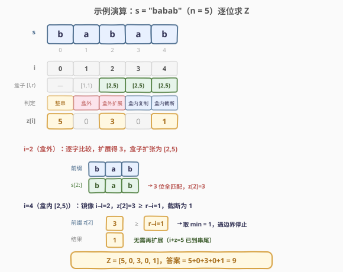

# 构造字符串的总得分和

- **题目名称**：构造字符串的总得分和
- **链接**：[2223. 构造字符串的总得分和](https://leetcode.cn/problems/sum-of-scores-of-built-strings/)
- **难度**：困难
- **标签**：字符串、Z 函数、哈希

## 1. 题目概述

你需要从空字符串开始**构造**一个长度为 `n` 的字符串 `s`，构造过程为每次给当前字符串**前面**添加**一个**字符。构造过程中得到的所有字符串编号为 `1` 到 `n`，其中长度为 `i` 的字符串编号为 $s_i$。

- 比方说，`s = "abaca"`，$s_1$ = `"a"`，$s_2$ = `"ca"`，$s_3$ = `"aca"`，依次类推。

$s_i$ 的**得分**为 $s_i$ 和 $s_n$ 的**最长公共前缀**的长度（注意 $s = s_n$）。给你最终的字符串 `s`，请你返回每一个 $s_i$ 的**得分之和**。

**示例 1**：

```text
输入：s = "babab"
输出：9
解释：
s1 == "b"   ，最长公共前缀是 "b"     ，得分为 1 。
s2 == "ab"  ，没有公共前缀           ，得分为 0 。
s3 == "bab" ，最长公共前缀为 "bab"   ，得分为 3 。
s4 == "abab"，没有公共前缀           ，得分为 0 。
s5 == "babab"，最长公共前缀为 "babab"，得分为 5 。
得分和为 1 + 0 + 3 + 0 + 5 = 9 。
```

**示例 2**：

```text
输入：s = "azbazbzaz"
输出：14
解释：
s2 == "az"      ，最长公共前缀为 "az"        ，得分为 2 。
s6 == "azbzaz"  ，最长公共前缀为 "azb"       ，得分为 3 。
s9 == "azbazbzaz"，最长公共前缀为 "azbazbzaz"，得分为 9 。
其他 si 得分均为 0 。
得分和为 2 + 3 + 9 = 14 。
```

**约束条件**：

- $1 \le \text{s.length} \le 10^5$
- `s` 只包含小写英文字母。

> 💡 **题眼**：构造时每步「往**前面**加一个字符」——先加的字符最终落在字符串**末尾**，最后加的字符落在**开头**。这意味着每个 $s_i$ 恰是 $s$ 的一个**后缀**。于是「$s_i$ 与 $s_n$ 的最长公共前缀」就变成「$s$ 的某个后缀与 $s$ 自身的最长公共前缀」，这正是 **Z 函数**的定义。一旦看穿这层映射，问题从「逐个 $O(n)$ 比较」直接降维成「$O(n)$ 一次扫描求 Z 数组」。

---

## 2. 解题思路

### 2.1 暴力思路：逐后缀比较

最朴素的做法：对每个 $i \in [1, n]$，取出后缀 $s_i = s[n-i:]$，再与 $s$ 逐字符比较，数出公共前缀长度。

```cpp
long long sumScores(string s) {
    int n = s.size();
    long long ans = 0;
    for (int i = 1; i <= n; i++) {
        int j = 0;
        while (j < i && s[j] == s[n - i + j]) j++;  // 与前缀 s[0..] 比较
        ans += j;
    }
    return ans;
}
```

共 $n$ 个后缀，每次比较最坏 $O(n)$（如全相同串 `"aaaa...a"`），总复杂度 $O(n^2)$。$n = 10^5$ 时约 $10^{10}$ 次比较，必然超时。

> ⚠️ 本质瓶颈：每个后缀都**从零开始**与前缀比对，没有复用「相邻后缀的公共前缀信息」。而字符串的高度自相似性恰恰提供了可复用的结构——这正是 Z 函数要利用的。

### 2.2 核心观察：$s_i$ 是后缀，得分即 Z 值

![核心：si 是 s 的后缀，score(si) = LCP(后缀, 前缀) = Z[i]](../images/2223_suffix_z_concept.svg)

**第一步：把构造过程翻译成后缀。** 构造每次「往前面加一个字符」，所以：

- 第 1 步加的字符 → 落在 $s$ 的**最后一位** $s[n-1]$；
- 第 2 步加的字符 → 落在 $s[n-2]$；
- ……
- 第 $n$ 步加的字符 → 落在 $s[0]$（最开头）。

因此长度为 $i$ 的中间串 $s_i$ 恰好是 $s$ 的**长度为 $i$ 的后缀**：

$$s_i = s[n-i:]$$

验证示例 1（$s$ = `"babab"`，$n=5$）：$s_5 = s[0:]$ = `"babab"`，$s_4 = s[1:]$ = `"abab"`，$s_3 = s[2:]$ = `"bab"`，$s_2 = s[3:]$ = `"ab"`，$s_1 = s[4:]$ = `"b"`，与题目描述完全一致。

**第二步：得分 = Z 值。** $s_i$ 的得分 = $\text{LCP}(s_i,\ s_n)$ = $\text{LCP}(s[n-i:],\ s)$。令 $j = n - i$（后缀起点），则得分 = $\text{LCP}(s[j:],\ s)$，这正是 Z 函数的定义：

$$z[j] = \text{LCP}\big(s,\ s[j:]\big) = \max\{\,k \mid s[0:k] = s[j:j+k]\,\}$$

即「从位置 $j$ 出发、能和前缀 $s[0..]$ 匹配的最大长度」。当 $i$ 从 $1$ 取到 $n$，$j = n - i$ 从 $n-1$ 取到 $0$，正好遍历所有位置。所以：

$$\text{答案} = \sum_{j=0}^{n-1} z[j]$$

其中 $z[0]$ = $\text{LCP}(s, s)$ = $n$（$s_n$ 的得分就是 $n$，因为 $s_n$ 与自身完全相同）。

> 💡 **为何 $z[0] = n$ 而不是 $0$**：很多 Z 函数实现把 $z[0]$ 约定为 $0$（避免平凡自匹配）。但本题 $s_n$ 的得分确确实实是 $n$（前缀与自己比，全部匹配），所以必须把 $z[0]$ 记作 $n$ 计入总和。

### 2.3 算法流程图

![Z 算法：维护最右匹配段 [l, r)，复用 z[i−l] + 暴力扩展](../images/2223_algorithm_flow.svg)

Z 算法在 $O(n)$ 时间内求出整个 $z$ 数组，关键在于维护一个**最右匹配段** $[l, r)$（又称 Z-box）：它是当前已知的、满足 $s[l:r] = s[0:r-l]$ 的、右端点 $r$ 最大的区间。处理位置 $i$ 时分两种情况：

1. **$i \ge r$（盒外）**：Z-box 没覆盖到 $i$，没有任何可复用信息，令 $z[i] = 0$，从头逐字比较 $s[i+k]$ 与 $s[k]$ 扩展。
2. **$i < r$（盒内）**：由 $s[l:r] = s[0:r-l]$ 知 $s[i:r]$ 镜像 $s[i-l:r-l]$，故 $z[i]$ 至少为 $\min\big(r-i,\ z[i-l]\big)$：
   - 若 $z[i-l] < r - i$：匹配段完全落在盒内，$z[i] = z[i-l]$，**无需任何额外比较**；
   - 若 $z[i-l] \ge r - i$：匹配段顶到盒子右边界，$z[i]$ 先置 $r - i$，再从 $s[i + (r-i)]$ 与 $s[r-i]$ 起继续向右扩展。

扩展完成后，若 $i + z[i] > r$，则更新 $l = i,\ r = i + z[i]$（扩张盒子）。

**线性证明**：每次「扩展比较」成功会使 $r$ 严格右移一位；$r$ 从 $0$ 单调增至 $n$，故扩展比较的总次数不超过 $n$。复制与判断均为 $O(1)$，总复杂度 $O(n)$。这与 KMP 前缀函数「$j$ 的回退总量不超过前进总量」的摊还论证如出一辙。

### 2.4 示例演算



以 $s$ = `"babab"`（$n=5$）展开：

| $i$ | Z-box $[l,r)$ | 判定 | 计算 | $z[i]$ |
|-----|---------------|------|------|--------|
| 0 | — | 整串自身 | $z[0] = n = 5$ | 5 |
| 1 | $[1,1)$ | 盒外 | $s[0]$=`b` ≠ $s[1]$=`a`，扩展失败 | 0 |
| 2 | $[2,5)$ | 盒外扩展 | `b`=`b`、`a`=`a`、`b`=`b`，3 位全中，扩张盒子 | 3 |
| 3 | $[2,5)$ | 盒内复制 | $z[i-l]=z[1]=0 < r-i=2$，直接复制 | 0 |
| 4 | $[2,5)$ | 盒内截断 | $z[i-l]=z[2]=3 \ge r-i=1$，取 $r-i=1$，$i+z=5$ 到串尾停止 | 1 |

$Z = [5, 0, 3, 0, 1]$，答案 $= 5+0+3+0+1 = 9$，与示例一致。

再核验示例 2（$s$ = `"azbazbzaz"`，$n=9$）：

| $i$ | 0 | 1 | 2 | 3 | 4 | 5 | 6 | 7 | 8 |
|-----|---|---|---|---|---|---|---|---|---|
| $z[i]$ | 9 | 0 | 0 | 3 | 0 | 0 | 0 | 2 | 0 |

- $z[3]$ = $\text{LCP}($`"azbazbzaz"`, `"azbzaz"`$)$ = `"azb"` = 3（第 4 位 `a`≠`z`）；
- $z[7]$ = $\text{LCP}($`"azbazbzaz"`, `"az"`$)$ = `"az"` = 2；
- 其余非零仅 $z[0]=9$。

答案 $= 9 + 3 + 2 = 14$，与示例一致。

> ⚠️ **溢出提醒**：全相同串 `"aaaa...a"`（$n=10^5$）时 $z[i] = n - i$，总和 $\sum_{i=0}^{n-1}(n-i) = \frac{n(n+1)}{2} \approx 5 \times 10^9$，超出 32 位整型（$\approx 2.1 \times 10^9$）。**答案必须用 `long long` / 64 位整型承载**。

---

## 3. 参考代码

### C++

```cpp
class Solution {
  public:
    long long sumScores(string s) {
        int n = s.size();
        vector<int> z(n, 0);
        z[0] = n;                       // LCP(s, s) = n，即 s_n 的得分
        int l = 0, r = 0;               // Z-box [l, r)：s[l..r) == s[0..r-l)
        long long ans = z[0];
        for (int i = 1; i < n; i++) {
            if (i < r) {
                z[i] = min(r - i, z[i - l]);   // 复用镜像位置 i-l 的结果
            }
            while (i + z[i] < n && s[z[i]] == s[i + z[i]]) {
                z[i]++;                        // 暴力扩展右边界
            }
            if (i + z[i] > r) {                // 扩张 Z-box
                l = i;
                r = i + z[i];
            }
            ans += z[i];
        }
        return ans;
    }
};
```

> 💡 **细节**：`z[0] = n` 在循环外单独赋值并累加，循环从 $i=1$ 开始。Z-box 初始 $[0, 0)$ 为空（$r=0$），使首个 $i=1$ 走「盒外」分支，从零扩展——这与「没有任何先验信息」的语义一致。

### Python

```python
class Solution:
    def sumScores(self, s: str) -> int:
        n = len(s)
        z = [0] * n
        z[0] = n                       # LCP(s, s) = n
        l = r = 0                      # Z-box [l, r)
        ans = z[0]
        for i in range(1, n):
            if i < r:
                z[i] = min(r - i, z[i - l])
            while i + z[i] < n and s[z[i]] == s[i + z[i]]:
                z[i] += 1
            if i + z[i] > r:
                l = i
                r = i + z[i]
            ans += z[i]
        return ans
```

> ⚠️ Python 的字符串索引 `s[i + z[i]]` 在 $i + z[i] == n$ 时会越界，故 `while` 条件必须**先**判 `i + z[i] < n`（短路求值），再取下标比较。C++ 中 `std::string::operator[]` 不做越界检查，逻辑一致即可，但同样依赖短路保证不读 `s[n]`。

### Python（滚动哈希 + 二分，替代实现）

若不熟悉 Z 函数，也可用**滚动哈希 + 二分**求每个后缀与前缀的 LCP：对每个起点 $i$，二分长度 $k \in [0, n-i]$，用前缀哈希 $O(1)$ 判定 $s[0:k] == s[i:i+k]$。总复杂度 $O(n \log n)$，能过但不如 Z 函数优雅。

```python
class Solution:
    def sumScores(self, s: str) -> int:
        n = len(s)
        BASE, MOD = 131, (1 << 61) - 1
        # 前缀哈希与幂次
        h = [0] * (n + 1)
        p = [1] * (n + 1)
        for i in range(n):
            h[i + 1] = (h[i] * BASE + (ord(s[i]) - 96)) % MOD
            p[i + 1] = (p[i] * BASE) % MOD

        def get_hash(a: int, length: int) -> int:
            # s[a:a+length] 的哈希
            return (h[a + length] - h[a] * p[length]) % MOD

        ans = n  # z[0] = n
        for i in range(1, n):
            lo, hi = 0, n - i
            while lo < hi:
                mid = (lo + hi + 1) // 2
                if get_hash(0, mid) == get_hash(i, mid):
                    lo = mid
                else:
                    hi = mid - 1
            ans += lo
        return ans
```

> 💡 哈希法天然支持「最长公共前缀 = 最长等哈希前缀」的二分判定，是字符串题的通用兜底武器。但单哈希存在碰撞风险，比赛场景建议双哈希或直接用 Z 函数。本题 $n \le 10^5$、$O(n \log n)$ 足够通过。

---

## 4. 复杂度分析

| 维度 | 复杂度 | 说明 |
|------|--------|------|
| 时间复杂度 | $O(n)$ | Z 算法：每次扩展比较使 $r$ 严格 $+1$，$r$ 单调增至 $n$，扩展总比较 $\le n$ 次；复制与盒子更新均 $O(1)$ |
| 空间复杂度 | $O(n)$ | Z 数组 $z[0..n-1]$；除答案外无额外大结构 |

> 💡 滚动哈希版为 $O(n \log n)$ 时间、$O(n)$ 空间（存前缀哈希与幂次），常数略大但实现直观。两种写法在 $n = 10^5$ 下都轻松通过。

---

## 5. 扩展：Z 函数与 KMP 前缀函数的对偶关系

Z 函数与 KMP 前缀函数 $\pi$ 是字符串自匹配的「两个对偶视角」，都能 $O(n)$ 预处理，但刻画的方向相反：

| | Z 函数 $z[i]$ | 前缀函数 $\pi[i]$ |
|---|---|---|
| **定义** | $s[i:]$ 与**前缀** $s[0:]$ 的最长公共前缀 | $s[0..i]$ 的最长「真前缀 = 后缀」长度 |
| **视角** | 每个后缀**向前**看，能接上多少前缀 | 每个前缀**向后**看，自身有多少前后缀重叠 |
| **典型应用** | 本题（后缀与前缀的 LCP）、多模式匹配 | [1392. 最长快乐前缀](../1301-1400/1392_最长快乐前缀.md)、[214. 最短回文串](../0201-0300/214_最短回文串.md)、KMP 匹配 |
| **状态维护** | 最右匹配段 $[l, r)$（Z-box） | 当前最长边界 $j = \pi[i-1]$，失配沿 $\pi$ 链回退 |

二者可以互相 $O(n)$ 转换：知道 $z$ 可推出 $\pi$，反之亦然。选择哪个取决于题意「向后接前缀」还是「前缀含后缀」更顺手。本题问的是「每个后缀与前缀的公共前缀长度」，正是 Z 函数的直接定义，所以 Z 是最贴切的工具。

**Z 函数的其他应用**：

- **单模式匹配**：拼接 $p + \texttt{'\#'} + t$，若 $z[|p|+1+j] = |p|$ 则模式 $p$ 在文本 $t$ 的位置 $j$ 出现，等价于 KMP 但思路更直接。
- **本质不同子串计数**：逐位向 $s$ 末尾加字符，新增子串数 = 当前长度 $- \max z$（与 [1698. 字符串的不同子字符串个数](../1601-1700/1698_字符串的不同子字符串个数.md) 的后缀数组思路相通）。
- **循环节判定**：若 $z[i] = n - i$（后缀等于整个前缀），则 $s[0..n-i)$ 是一个周期，与 [459. 重复的子字符串](../0401-0500/459_重复的子字符串.md) 用 $\pi$ 判循环节对偶。

> 💡 **方法论**：遇到「字符串的每个位置 / 每个后缀与前缀的关系」类问题，先联想 Z 函数；遇到「前缀自身的前后缀重叠」类问题，先联想 KMP 前缀函数。两者都是 $O(n)$ 的线性预处理，是字符串算法的两块基石。

---

## 6. 面试要点

1. **为什么 $s_i$ 是 $s$ 的后缀？构造时明明是「往前加」。**

   - 构造从空串开始，第 1 步加的字符最终被后续 $n-1$ 次「往前加」推到**末尾**，第 $k$ 步加的字符被推到倒数第 $k$ 位。所以长度为 $i$ 的中间串 $s_i$ = 最后 $i$ 次添加的字符按顺序排列 = $s$ 的长度为 $i$ 的后缀 $s[n-i:]$。关键是用「添加顺序 vs 最终位置」的反向关系把构造过程翻译成后缀。

2. **Z 函数为什么是 $O(n)$ 而不是 $O(n^2)$？**

   - 摊还分析：维护最右匹配段 $[l, r)$，每次「暴力扩展」比较成功一次，$r$ 就严格右移一位。$r$ 从 $0$ 单调增至 $n$，所以扩展比较的总次数 $\le n$。盒内复制和盒子更新都是 $O(1)$。总比较次数 $O(n)$，与 KMP 前缀函数「回退总量 $\le$ 前进总量」的论证同构。

3. **盒内分支 `z[i] = min(r - i, z[i - l])` 的两个取值分别意味着什么？**

   - $z[i-l] < r - i$：镜像位置的匹配段**完全落在** Z-box 内，$s[i..i+z]$ 也在盒内且等于前缀，$z[i] = z[i-l]$，无需额外比较。
   - $z[i-l] \ge r - i$：镜像匹配段**顶到或越过**盒子右边界，但盒内只保证到 $r-1$ 为止相等，$r$ 之后未知，故 $z[i]$ 先取 $r - i$，再从 $s[r]$ 与 $s[r-i]$ 起继续扩展。`min` 一行兼顾两种情况。

4. **$z[0]$ 该取 $n$ 还是 $0$？为什么？**

   - 本题必须取 $n$。$s_n$ 的得分 = $\text{LCP}(s, s) = n$（整个串与自己完全匹配），是答案的合法组成部分。许多 Z 函数模板把 $z[0]$ 约定为 $0$ 以排除平凡自匹配，若直接套用会漏掉 $n$ 导致答案偏小。务必按题意调整：求「每个后缀与前缀 LCP 之和」时 $z[0] = n$，求「除自身外的匹配」时 $z[0] = 0$。

5. **答案为什么可能溢出 32 位？**

   - 全相同串 `"aaaa...a"`（$n = 10^5$）时 $z[i] = n - i$，总和 $\frac{n(n+1)}{2} \approx 5 \times 10^9 > 2.1 \times 10^9$（`INT_MAX`）。故累加器用 `long long` / `int64`。题目标签返回 `long long` 也印证了这一点。如果题目返回 `int`，需确认约束更小，否则必溢出。

---

## 7. 同类练习题

- [1392. 最长快乐前缀](https://leetcode.cn/problems/longest-happy-prefix/)（[题解](../1301-1400/1392_最长快乐前缀.md)）：KMP 前缀函数 $\pi$ 的定义题，与 Z 函数互为对偶——$\pi$ 看「前缀含后缀」，$z$ 看「后缀接前缀」，对照理解两种线性预处理
- [28. 找出字符串中第一个匹配项的下标](https://leetcode.cn/problems/find-the-index-of-the-first-occurrence-in-a-string/)（[题解](../0001-0100/28_找出字符串中第一个匹配项的下标.md)）：KMP 字符串匹配母题；同样可用 Z 函数解（拼接 `pattern#text` 后查 $z$ 值等于模式长度），体会两种工具的等价性
- [214. 最短回文串](https://leetcode.cn/problems/shortest-palindrome/)（[题解](../0201-0300/214_最短回文串.md)）：对 $s + \# + \text{reverse}(s)$ 求前缀函数找最长回文前缀；也可用 Z 函数求解，是「自匹配预处理」的跨界应用
- [459. 重复的子字符串](https://leetcode.cn/problems/repeated-substring-pattern/)（[题解](../0401-0500/459_重复的子字符串.md)）：判定字符串是否由循环节重复构成；$\pi[n-1]$ 与 $z[i]=n-i$ 两种判法对偶，巩固 Z 与前缀函数的转换
- [1698. 字符串的不同子字符串个数](https://leetcode.cn/problems/number-of-distinct-substrings-in-a-string/)（[题解](../1601-1700/1698_字符串的不同子字符串个数.md)）：本质不同子串计数，Z 函数 / 后缀数组 / 滚动哈希均可解，承接本题的字符串线性预处理思想
