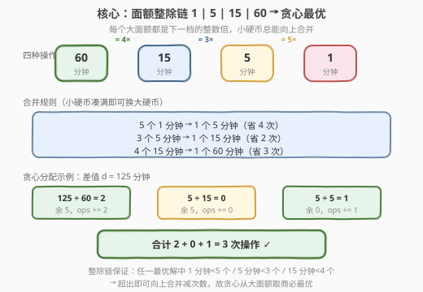
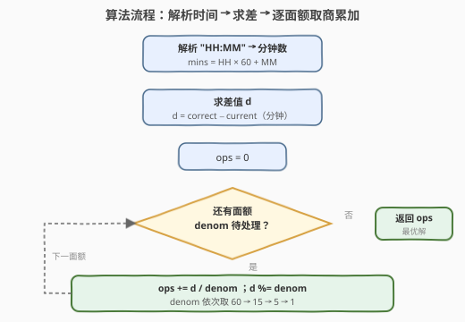
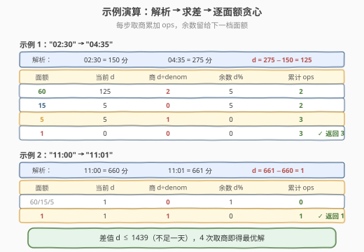

# LeetCode 转化时间需要的最少操作数 题解

## 1. 题目概述

- **标题 / 题号**：转化时间需要的最少操作数（#2224，easy）
- **链接**：https://leetcode.cn/problems/minimum-number-of-operations-to-convert-time/
- **难度**：简单
- **标签**：贪心、数学、字符串

**题意**：给你两个字符串 `current` 和 `correct`，均表示 **24 小时制** 时间，格式为 `"HH:MM"`。你可以对 `current` 进行若干次操作，每次操作使 `current` 增加 **1、5、15 或 60 分钟**。每次操作只能选择一种增量。返回将 `current` 转化为 `correct` 所需的 **最少操作次数**。

**示例 1**：

```text
输入：current = "02:30", correct = "04:35"
输出：3
解释：
操作 1：+60 分钟 → 03:30
操作 2：+60 分钟 → 04:30
操作 3：+5  分钟 → 04:35
共 3 次操作。
```

**示例 2**：

```text
输入：current = "11:00", correct = "11:01"
输出：1
解释：只需 +1 分钟，1 次操作。
```

**约束**：

- `current` 和 `correct` 均为合法 24 小时制时间 `"HH:MM"`，`HH` 范围 `00`–`23`，`MM` 范围 `00`–`59`
- `current ≤ correct`（按时间先后）

> 💡 本题本质是**固定面额的找零问题**：把「时间差」换成「金额」，把四种增量 `{60, 15, 5, 1}` 看成「硬币面额」，求凑出金额的最少硬币数。关键在于这组面额满足**整除链** $1 \mid 5 \mid 15 \mid 60$，使得贪心天然最优——无需 DP。

## 2. 解题思路

### 2.1 暴力思路：动态规划 / BFS

最直白的做法是把问题当成**完全背包 / 最短路径**：令 $dp[i]$ 表示凑出 $i$ 分钟所需的最少操作数，转移为

$$
dp[i] = \min_{c \in \{1,5,15,60\}} dp[i - c] + 1, \qquad dp[0] = 0
$$

时间与空间均为 $O(d)$，其中 $d$ 为时间差。由于 $d \le 1439$（不足一天），DP 完全能过。

> ⚠️ DP 能过 ≠ 这是最优解法。面试中给出 DP 后会被追问「能不能 $O(1)$」。关键观察：四种面额并非任意选取，它们之间有**整除关系**——这正是贪心最优的充要条件。

### 2.2 核心观察：面额整除链 → 贪心最优



四种操作面额 $\{60, 15, 5, 1\}$ 构成一条**整除链**：

$$
1 \mid 5 \mid 15 \mid 60 \qquad \text{即} \qquad 60 = 4 \times 15,\ \ 15 = 3 \times 5,\ \ 5 = 5 \times 1
$$

每个大面额都是下一档的**整数倍**。这意味着任意一堆小面额硬币，只要凑满了倍数，就可以**向上合并**成一个大面额硬币，从而**减少操作次数**：

| 合并规则 | 省下操作数 |
|----------|-----------|
| $5$ 个 $1$ 分钟 $\to$ $1$ 个 $5$ 分钟 | $-4$ |
| $3$ 个 $5$ 分钟 $\to$ $1$ 个 $15$ 分钟 | $-2$ |
| $4$ 个 $15$ 分钟 $\to$ $1$ 个 $60$ 分钟 | $-3$ |

**推论**：在任何**最优解**中，$1$ 分钟硬币必少于 $5$ 个、$5$ 分钟硬币必少于 $3$ 个、$15$ 分钟硬币必少于 $4$ 个——否则可以向上合并减次数，与最优性矛盾。

> 💡 **贪心为何最优**：从大面额往小面额「能取就取尽」（取商），等价于在每一步都把可合并的小硬币提前换成大硬币。由于整除链保证「余数一定小于下一档面额」，大面额取完后剩余量无法再用大面额表示，只能交给更小的面额——这正是贪心的无后效性来源。

于是算法极其简单：计算时间差 $d$（分钟），依次对 $60, 15, 5, 1$ 做「取商累加 + 取模留余」。

### 2.3 算法流程图



1. **解析**：把 `"HH:MM"` 转成分钟数 $\text{mins} = \text{HH} \times 60 + \text{MM}$。
2. **求差**：$d = \text{correct\_mins} - \text{current\_mins}$。
3. **贪心**：对 `denom` 依次取 $60 \to 15 \to 5 \to 1$：
   - $\text{ops} \mathrel{+}= d / \text{denom}$（整除得商）
   - $d \mathrel{\%}= \text{denom}$（取模留余数）
4. **返回** `ops`。

> ⚠️ 时间解析的细节：`"HH:MM"` 中 `HH` 和 `MM` 各占两位。用 `stoi(s.substr(0,2))` 取小时、`stoi(s.substr(3,2))` 取分钟最稳妥；切勿只取一位。由于 `current ≤ correct`，差值 $d \ge 0$，无需处理负数。

### 2.4 示例演算



**示例 1**：`current = "02:30"`, `correct = "04:35"`

| 面额 | 当前 d | 商 $d \div \text{denom}$ | 余数 $d \%$ | 累计 ops |
|------|--------|--------------------------|-------------|----------|
| 60 | 125 | 2 | 5 | 2 |
| 15 | 5 | 0 | 5 | 2 |
| 5 | 5 | 1 | 0 | 3 |
| 1 | 0 | 0 | 0 | 3 |

解析：`02:30` $= 150$ 分，`04:35` $= 275$ 分，$d = 125$。$2$ 个 $60$ 分钟 $+ 1$ 个 $5$ 分钟 $= 3$ 次操作 ✓

**示例 2**：`current = "11:00"`, `correct = "11:01"`

| 面额 | 当前 d | 商 $d \div \text{denom}$ | 余数 $d \%$ | 累计 ops |
|------|--------|--------------------------|-------------|----------|
| 60 / 15 / 5 | 1 | 0 | 1 | 0 |
| 1 | 1 | 1 | 0 | 1 |

解析：$d = 661 - 660 = 1$，只有 $1$ 分钟面额能取，$1$ 次操作 ✓

> 💡 可以看到，无论差值多大，算法都只做固定的 $4$ 次取商取模——这是 $O(1)$ 的根源，远优于 DP 的 $O(d)$。

## 3. 参考代码

### C++

```cpp
class Solution {
  public:
    int convertTime(string current, string correct) {
        int cur = stoi(current.substr(0, 2)) * 60 + stoi(current.substr(3, 2));
        int cor = stoi(correct.substr(0, 2)) * 60 + stoi(correct.substr(3, 2));
        int d = cor - cur;
        int ops = 0;
        for (int denom : {60, 15, 5, 1}) {
            ops += d / denom;
            d %= denom;
        }
        return ops;
    }
};
```

> 💡 用 `for (int denom : {60, 15, 5, 1})` 以初始化列表遍历面额，代码简洁。`d / denom` 在 `denom = 1` 时必定把剩余全部取完（商 $=$ 余数本身），因此循环结束时 `d` 一定归零，无需额外处理。

### Python

```python
class Solution:
    def convertTime(self, current: str, correct: str) -> int:
        def to_minutes(s: str) -> int:
            hh, mm = s.split(":")
            return int(hh) * 60 + int(mm)

        d = to_minutes(correct) - to_minutes(current)
        ops = 0
        for denom in (60, 15, 5, 1):
            ops += d // denom
            d %= denom
        return ops
```

> ⚠️ Python 中务必用 `//`（整除）而非 `/`（浮点除），否则 `ops` 会变成浮点数、`%` 行为也异常。`split(":")` 比切片更直观，且天然处理了可能的前导零（`int("02") == 2`）。

## 4. 复杂度分析

| 维度 | 复杂度 | 说明 |
|------|--------|------|
| **时间复杂度** | $O(1)$ | 解析两个时间字符串各 $O(1)$；贪心固定遍历 $4$ 个面额，每次取商取模 $O(1)$；差值 $d \le 1439$，无循环依赖输入规模 |
| **空间复杂度** | $O(1)$ | 仅用常数个整型变量 `d`、`ops`、`denom`，无额外数据结构 |

> 💡 对比 DP 的 $O(d)$ 时间空间：$d \le 1439$ 时 DP 也可过，但贪心把 $1440$ 级的循环压成 $4$ 次算术，且无需数组——这是「看出整除链结构」的收益。

## 5. 扩展：找零问题与贪心最优的判定

本题是经典**找零问题（Coin Change）**的特例。一般的找零问题面额任意，贪心不一定最优（如面额 $\{1, 3, 4\}$ 凑 $6$：贪心取 $4+1+1=3$ 枚，而最优是 $3+3=2$ 枚），需用 DP。

但有一类面额系统，贪心**总是最优**，称为**规范硬币系统（canonical coin system）**。一个充分条件是：

> **整除链条件**：若面额按升序排列 $c_1 < c_2 < \dots < c_k$，且满足 $c_1 \mid c_2 \mid \dots \mid c_k$（每个面额整除下一个），则贪心最优。

本题面额 $\{1, 5, 15, 60\}$ 满足 $1 \mid 5 \mid 15 \mid 60$，故贪心最优。现实中的货币系统（如人民币 $1, 5, 10, 20, 50, 100$）大多也满足或近似满足此条件，因此日常生活中「先拿大面额」的找零直觉是对的。

> ⚠️ 整除链只是贪心最优的**充分条件**，并非必要条件。例如美国硬币 $\{1, 5, 10, 25\}$ 不满足整除链（$10 \nmid 25$），但贪心依然最优——这需要更复杂的判定（如 Kozen-Zaks 算法验证规范系统）。面试中若遇到不满足整除链的面额，稳妥起见用 DP。

## 6. 面试要点

1. **为什么贪心一定最优？**

   - 四种面额 $\{60, 15, 5, 1\}$ 满足整除链 $1 \mid 5 \mid 15 \mid 60$。每个小面额凑满倍数即可换成大面额并减少操作次数（$5$ 个 $1$ 换 $1$ 个 $5$ 省 $4$ 次，等等）。因此最优解中小面额用量严格低于合并阈值，等价于「大面额能取尽就取尽」的贪心策略。

2. **为什么不直接 DP？**

   - DP 是 $O(d)$ 时间空间，$d \le 1439$ 时可过但浪费。整除链结构把问题降为 $4$ 次取商取模的 $O(1)$ 算术。面试中先给 DP 再优化到贪心，能展示「从通用到特化」的洞察力。

3. **时间字符串解析有哪些坑？**

   - `"HH:MM"` 固定 $5$ 字符，`HH` 和 `MM` 各两位，可能含前导零（如 `"02:30"`）。C++ 用 `substr(0,2)` / `substr(3,2)` + `stoi`；Python 用 `split(":")` + `int()`。切勿误用单字符或忽略前导零。`stoi("02")` 返回 $2$，前导零不影响。

4. **差值会是负数吗？**

   - 题目保证 `current ≤ correct`，故 $d \ge 0$。但若面试官追问「不保证先后呢」——只需取绝对值 $|d|$，因为操作只能「增加」时间，若 `current > correct` 则需跨天（加 $24 \times 60 = 1440$ 分钟再取模），但原题约束下无需处理。

5. **面额换成任意的还能贪心吗？**

   - 不能。只有满足整除链（或更一般的规范系统）时贪心才最优。例如面额 $\{1, 3, 4\}$ 凑 $6$，贪心得 $4+1+1$（$3$ 枚），最优是 $3+3$（$2$ 枚）。此时必须 DP。判断贪心可行性是面试的核心考点。

> 💡 **一句话总结**：2224 是「**整除链找零**」的招牌题——四种增量 $\{60,15,5,1\}$ 满足 $1 \mid 5 \mid 15 \mid 60$，贪心从大面额取商必最优；解析时间求差后 $4$ 次 $O(1)$ 算术即得答案。

## 同类练习题

| # | 题目 | 与本题的关联 |
|---|------|-------------|
| 322 | [零钱兑换](https://leetcode.cn/problems/coin-change/)（[站内题解](../0301-0400/322_零钱兑换.md)） | 通用找零 DP 母题，面额不满足整除链时贪心失效，对照本题理解「何时贪心、何时 DP」 |
| 2139 | [得到目标值的最小移动次数](https://leetcode.cn/problems/minimum-moves-to-reach-target-score/)（[站内题解](../2101-2200/2139_得到目标值的最小移动次数.md)） | 操作含「翻倍」与「加一」，用反向贪心把 $O(\text{target})$ 压成 $O(\text{maxDoubles})$，与本题同属「看出结构后贪心降复杂度」范式 |
| 2169 | [得到 0 的操作数](https://leetcode.cn/problems/count-operations-to-obtain-zero/)（[站内题解](../2101-2200/2169_得到0的操作数.md)） | 辗转相减的计数版，用「除法取商」把连减批量合并，与本题「取商累加」同构 |
| 2520 | [统计能整除数字的位数](https://leetcode.cn/problems/count-the-digits-that-divide-a-number/) | 逐位取模判定整除，巩固「整除性」在贪心与数论中的判据作用 |
| 455 | [分发饼干](https://leetcode.cn/problems/assign-cookies/)（[站内题解](../0401-0500/455_分发饼干.md)） | 排序后双指针贪心，体会「贪心配对」与「贪心取商」两种贪心范式 |
