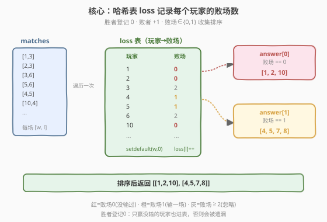
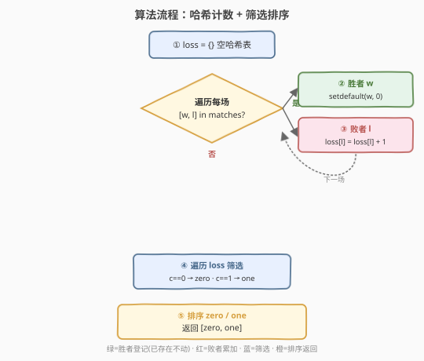
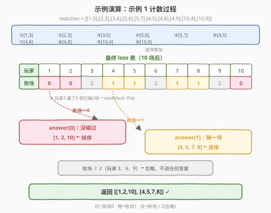

# LeetCode 找出输掉零场或一场比赛的玩家 题解

## 1. 题目概述

- **标题 / 题号**：找出输掉零场或一场比赛的玩家（#2225，medium）
- **链接**：https://leetcode.cn/problems/find-players-with-zero-or-one-losses/
- **难度**：中等
- **标签**：数组、哈希表、计数、排序

**题意**：给你一个整数数组 `matches`，其中 `matches[i] = [winner_i, loser_i]` 表示在一场比赛中 `winner_i` 击败了 `loser_i`。返回一个长度为 2 的列表 `answer`：

- `answer[0]` 是所有**没有**输掉任何比赛的玩家列表。
- `answer[1]` 是所有恰好输掉**一场**比赛的玩家列表。

两个列表中的值都应按**递增**顺序返回。

**注意**：

- 只考虑那些参与**至少一场**比赛的玩家。
- 测试用例保证**不存在**两场比赛结果**相同**。

**示例 1**：

```text
输入：matches = [[1,3],[2,3],[3,6],[5,6],[5,7],[4,5],[4,8],[4,9],[10,4],[10,9]]
输出：[[1,2,10],[4,5,7,8]]
解释：
玩家 1、2 和 10 都没有输掉任何比赛。
玩家 4、5、7 和 8 每个都输掉一场比赛。
玩家 3、6 和 9 每个都输掉两场比赛。
因此，answer[0] = [1,2,10] 和 answer[1] = [4,5,7,8]。
```

**示例 2**：

```text
输入：matches = [[2,3],[1,3],[5,4],[6,4]]
输出：[[1,2,5,6],[]]
解释：
玩家 1、2、5 和 6 都没有输掉任何比赛。
玩家 3 和 4 每个都输掉两场比赛。
因此，answer[0] = [1,2,5,6] 和 answer[1] = []。
```

**约束**：

- $1 \le \text{matches.length} \le 10^5$
- $\text{matches}[i].\text{length} = 2$
- $1 \le \text{winner}_i,\ \text{loser}_i \le 10^5$
- $\text{winner}_i \ne \text{loser}_i$
- 所有 `matches[i]` **互不相同**

> 💡 本题的本质是**按玩家聚合败场计数**：每场比赛只有一个败者，故只需对「败者」累加计数；但「胜者」也参与了比赛（败场为 0），必须被登记进表，否则会被遗漏。最终把败场数 $\in \{0, 1\}$ 的玩家分别收集、排序即得答案。难点不在计数，而在**别漏掉“只赢没输”的玩家**与**结果必须递增**。

## 2. 解题思路

### 2.1 暴力思路：对每个玩家统计败场

最直白的做法：先收集所有参与过比赛的玩家集合 `players`，再对其中每个玩家 `p` 遍历整个 `matches`，数 `p` 作为 `loser` 出现的次数。

```text
players = set()
for w, l in matches: players.add(w); players.add(l)
zero, one = [], []
for p in players:
    cnt = sum(1 for _, l in matches if l == p)   # 每个玩家重扫一遍 matches
    if cnt == 0: zero.append(p)
    elif cnt == 1: one.append(p)
sort(zero); sort(one)
```

设 $n = \text{matches.length}$、$P$ 为不同玩家数（$P \le 2n$），外层 $P$ 次、每次扫 $n$ 场，总最坏 $O(P \cdot n) = O(n^2)$。约束 $n \le 10^5$ 下约 $10^{10}$，**必然超时**。

> ⚠️ 暴力的浪费在于：败场信息其实已编码在 `matches` 的第二列里，逐玩家重扫等于把同一信息重复读 $P$ 遍。正确做法是**一次遍历就把每个玩家的败场数算好**——这正是哈希计数的目的。

### 2.2 核心观察：一次遍历建立「玩家→败场数」映射



**观察：每场比赛贡献的信息是「胜者参与且不败」「败者败一场」，二者都可写进同一张计数表。**

1. **败者累加**：对 `loser`，败场数 `+1`。
2. **胜者登记**：对 `winner`，若表中尚无该玩家，则置 `0`（表示“参与了，败场为 0”）。**若已存在则不动**——因为该玩家可能在更早的比赛中输过，胜场不会抹掉败场。
3. **结果筛选**：遍历计数表，败场 $\in \{0\}$ 入 `answer[0]`，败场 $\in \{1\}$ 入 `answer[1]`；最后各自**升序排序**。

> 💡 **关键细节——胜者为何要“登记 0”**：题目要求只考虑“参与至少一场”的玩家。一个只赢没输的玩家（如示例 1 的 1、2、10）从未作为 `loser` 出现，若不主动登记就会**缺席计数表**，从而既不在 `answer[0]` 也不在 `answer[1]`，被错误遗漏。登记 0 把“参与了但没输”和“完全没参与”区分开：前者进表（值 0），后者根本不在表里。

**为什么“胜者已存在就不动”是对的**：考虑玩家先输后赢的场景——例如 `matches = [[3,1],[1,5]]`，玩家 1 先败一场（`loss[1]=1`），后又作为胜者出现。此时 `setdefault(1, 0)` 发现 1 已在表中便跳过，`loss[1]` 保持 1。若错误地把它重置为 0，就会把“输过 1 场”算成“没输过”，破坏计数正确性。

**边界与特例**：

- **只赢没输的玩家**：如示例 1 的 1、2、10，靠“胜者登记 0”进入计数表，败场为 0 → `answer[0]`。
- **既赢又输的玩家**：如玩家 3 赢过 6、又输给 1、2，败场为 2，不进任何答案。胜场不影响败场计数。
- **`answer[1]` 为空**：如示例 2，所有败者都恰好输 2 场，没人输 1 场，`answer[1] = []`。
- **结果必须递增**：哈希表遍历顺序不固定，故收集后必须 `sort()`，增加 $O(P \log P)$。
- **两场比赛结果互不相同**：保证同一 `[w, l]` 不会重复出现，但同一对玩家可在不同场次中多次以不同角色出现（如 4 输给 10 又赢了 8），计数仍正确。

### 2.3 算法流程图



**哈希计数法**（$O(n + P \log P)$，推荐）：

1. **初始化**：空哈希表 `loss`（玩家 → 败场数）。
2. **遍历 `matches`**：对每场 `[w, l]`：
   - `loss.setdefault(w, 0)`：确保胜者在表中（已存在则不动）。
   - `loss[l] = loss.get(l, 0) + 1`：败者败场数 `+1`。
3. **筛选**：遍历 `loss`，败场 `== 0` 收入 `zero`，败场 `== 1` 收入 `one`。
4. **排序**：`zero.sort()`、`one.sort()`。
5. **返回** `[zero, one]`。

> 💡 **时间分摊**：第 2 步一次遍历 $O(n)$，每个哈希操作平均 $O(1)$；第 3 步遍历表 $O(P)$；第 4 步排序 $O(P \log P)$。由于 $P \le 2n$，总体由排序主导，为 $O(n \log n)$。若值域小（本题 $\le 10^5$），可用定长数组把排序省成 $O(V)$ 扫描，见第 5 节。

### 2.4 示例演算



**示例 1：`matches = [[1,3],[2,3],[3,6],[5,6],[5,7],[4,5],[4,8],[4,9],[10,4],[10,9]]`**

**逐场累加败场表 `loss`**：

| 场次 | `[w, l]` | 胜者处理 | 败者处理 | `loss` 当前状态 |
|------|----------|----------|----------|-----------------|
| 1 | `[1,3]` | 1 登记为 0 | 3 → 1 | `{1:0, 3:1}` |
| 2 | `[2,3]` | 2 登记为 0 | 3 → 2 | `{1:0, 2:0, 3:2}` |
| 3 | `[3,6]` | 3 已存在，不动 | 6 → 1 | `{1:0, 2:0, 3:2, 6:1}` |
| 4 | `[5,6]` | 5 登记为 0 | 6 → 2 | `{1:0, 2:0, 3:2, 5:0, 6:2}` |
| 5 | `[5,7]` | 5 已存在，不动 | 7 → 1 | `{..., 7:1}` |
| 6 | `[4,5]` | 4 登记为 0 | 5 → 1 | `{..., 4:0, 5:1}` |
| 7 | `[4,8]` | 4 已存在，不动 | 8 → 1 | `{..., 8:1}` |
| 8 | `[4,9]` | 4 已存在，不动 | 9 → 1 | `{..., 9:1}` |
| 9 | `[10,4]` | 10 登记为 0 | 4 → 1 | `{..., 10:0, 4:1}` |
| 10 | `[10,9]` | 10 已存在，不动 | 9 → 2 | `{..., 9:2}` |

**最终 `loss` 表**：

| 玩家 | 1 | 2 | 3 | 4 | 5 | 6 | 7 | 8 | 9 | 10 |
|------|---|---|---|---|---|---|---|---|---|----|
| 败场 | 0 | 0 | 2 | 1 | 1 | 2 | 1 | 1 | 2 | 0  |

**筛选 + 排序**：

- 败场 `== 0`：玩家 `{1, 2, 10}` → 排序 `answer[0] = [1, 2, 10]` ✓
- 败场 `== 1`：玩家 `{4, 5, 7, 8}` → 排序 `answer[1] = [4, 5, 7, 8]` ✓
- 败场 `== 2`（3、6、9）：不进任何答案。

返回 `[[1,2,10],[4,5,7,8]]` ✓

> 💡 注意玩家 3：它在第 3 场作为**胜者**出现（赢了 6），但 `setdefault(3, 0)` 发现 3 已在表中（第 1、2 场输了两次，值为 2），故**不动**，最终败场仍为 2。这正是“胜者已存在就不动”的正确性体现——胜场不能抹掉败场记录。

**示例 2：`matches = [[2,3],[1,3],[5,4],[6,4]]`**

- 逐场得 `loss = {2:0, 3:2, 1:0, 5:0, 4:2, 6:0}`
- 败场 `== 0`：`{1, 2, 5, 6}` → `[1, 2, 5, 6]`
- 败场 `== 1`：无 → `[]`
- 返回 `[[1,2,5,6],[]]` ✓

## 3. 参考代码

### C++（unordered_map 计数）

```cpp
class Solution {
  public:
    vector<vector<int>> findWinners(vector<vector<int>>& matches) {
        unordered_map<int, int> loss; // 玩家 -> 败场数
        for (const auto& m : matches) {
            int w = m[0], l = m[1];
            if (!loss.count(w)) loss[w] = 0;   // 胜者登记为 0（已存在则不动）
            loss[l]++;                          // 败者败场 +1
        }
        vector<int> zero, one;
        for (const auto& [p, c] : loss) {
            if (c == 0) zero.push_back(p);
            else if (c == 1) one.push_back(p);
        }
        sort(zero.begin(), zero.end());
        sort(one.begin(), one.end());
        return {zero, one};
    }
};
```

> 💡 C++ 中 `loss.count(w)` 返回 0/1，用作“是否已存在”判定；只有不存在时才 `loss[w] = 0`，避免覆盖已有败场。`loss[l]++` 借助 `unordered_map` 的 `operator[]`：键不存在时自动插入 0 再自增，故无需额外判空。

### Python（字典 setdefault，最简洁）

```python
class Solution:
    def findWinners(self, matches: List[List[int]]) -> List[List[int]]:
        loss = {}
        for w, l in matches:
            loss.setdefault(w, 0)            # 胜者登记为 0（已存在则不动）
            loss[l] = loss.get(l, 0) + 1     # 败者败场 +1
        zero = sorted(p for p, c in loss.items() if c == 0)
        one = sorted(p for p, c in loss.items() if c == 1)
        return [zero, one]
```

> ⚠️ 注意 `loss.setdefault(w, 0)` 与 `loss[w] = 0` 的区别：前者仅在键缺失时写入，后者会**无条件覆盖**——若 `w` 之前输过，`loss[w] = 0` 会把败场清零，导致错误。务必用 `setdefault`（或先 `count` 判定）。

### Python（定长数组版，值域 $10^5$ 时更快）

```python
class Solution:
    def findWinners(self, matches: List[List[int]]) -> List[List[int]]:
        loss = [-1] * 100001  # -1 表示未参与
        for w, l in matches:
            if loss[w] == -1: loss[w] = 0
            if loss[l] == -1: loss[l] = 1
            else: loss[l] += 1
        zero = [p for p in range(1, 100001) if loss[p] == 0]
        one = [p for p in range(1, 100001) if loss[p] == 1]
        return [zero, one]
```

> 💡 数组版用 `-1` 哨兵区分“未参与”与“败场 0”，扫描时天然按编号递增，**省去排序**。值域 $V = 10^5$ 时扫描 $O(V)$ 与排序 $O(P \log P)$ 谁快取决于 $P$：$P$ 接近 $V$ 时数组版常数更优；$P \ll V$ 时哈希表版更省时。详见第 5 节。

## 4. 复杂度分析

| 维度 | 复杂度 | 说明 |
|------|--------|------|
| 时间复杂度 | $O(n + P \log P)$ | 遍历 `matches` 建表 $O(n)$（$n$ 场，每场 $O(1)$ 哈希操作）；筛选 $O(P)$；两个列表排序 $O(P \log P)$。$P$ 为不同玩家数，$P \le 2n$，故总体 $O(n \log n)$ |
| 空间复杂度 | $O(P)$ | 哈希表 `loss` 存所有参与过的玩家，最坏 $P = 2n$；输出列表不计额外空间 |

> 💡 若采用定长数组版（值域 $V = 10^5$），时间 $O(n + V)$、空间 $O(V)$——无需排序，扫描即天然有序。两种写法在 $n \le 10^5$ 下都极快，哈希表版通用性更好（不依赖值域连续），数组版在值域已知且稠密时常数更优。

## 5. 扩展：哈希表 vs 定长数组的取舍

本题给出 `winner_i, loser_i <= 10^5`，值域是连续小区间 $[1, 10^5]$，是“小值域”的典型信号。两种实现各有所长：

| 方法 | 时间 | 空间 | 排序需求 | 适用场景 |
|------|------|------|----------|----------|
| 哈希表（unordered_map / dict） | $O(n + P \log P)$ | $O(P)$ | 需 `sort` | 值域任意、稀疏；玩家编号不连续 |
| 定长数组（偏移哨兵） | $O(n + V)$ | $O(V)$ | 无需排序（按下标递增扫描） | 值域 $V$ 小且已知、连续 |

**数组版为什么省掉排序**：用 `loss[p]` 直接按下标 `p` 存败场数，最后 `for p in range(1, V+1)` 扫描时 `p` 天然递增，收集结果即有序。代价是要扫完整个值域 $V$，当 $P \ll V$（玩家很少）时做了大量空扫。

**哈希表版为什么需要排序**：哈希表遍历顺序不固定，且玩家编号在表中无序存储，必须显式 `sort` 才能满足“递增”要求。

**取舍建议**：

- 值域未知 / 编号可能是任意 32 位整数（如 $10^9$ 量级）→ 必须哈希表，数组不可行。
- 值域小且连续（如本题 $V = 10^5$）→ 两种皆可；若 $P$ 接近 $V$（玩家稠密），数组版更快；若 $P \ll V$，哈希表版更快。
- 面试中先给哈希表版讲清思路，再提“值域小可换数组省排序”作为优化，体现对数据特征的敏感度。

> ⚠️ 数组版用 `-1` 哨兵区分“未参与”与“败场 0”是关键：若直接用 0 初始化，就无法区分“没参与”和“参与了但没输”两种情况，会把未参与玩家错误计入 `answer[0]`。这等价于哈希表版中“胜者登记 0”的作用——本质都是给“参与但不败”一个可识别的标记。

## 6. 面试要点

1. **为什么胜者也要写进计数表？**

   - 题目要求只考虑“参与至少一场”的玩家。一个只赢没输的玩家从未作为 `loser` 出现，若不主动登记就会缺席计数表，被错误遗漏。对胜者 `setdefault(w, 0)` 把它登记为败场 0，既标记“参与了”又正确反映“没输过”。

2. **胜者已存在时为什么不能重置为 0？**

   - 该玩家可能在更早的比赛中输过（如先输后赢）。重置为 0 会抹掉败场记录，把“输过 k 场”错算成“没输过”。`setdefault` 只在键缺失时写入，已存在则不动，保证败场计数不被胜场干扰。

3. **结果为什么必须排序？**

   - 题目明确要求两个列表按**递增**顺序返回。哈希表遍历顺序不固定，收集后必须 `sort()`。若用定长数组按下标扫描则天然有序，可省排序——这是数组版的优势之一。

4. **败场数 $\ge 2$ 的玩家如何处理？**

   - 直接忽略——既不进 `answer[0]` 也不进 `answer[1]`。筛选时只判 `c == 0` 与 `c == 1`，其余自然落选，无需额外操作。

5. **`answer[1]` 可能为空吗？**

   - 可能。如示例 2，所有败者都恰好输 2 场，没人输 1 场，`answer[1] = []`。代码用列表推导式收集，无匹配时自然得空列表，无需特判。同理 `answer[0]` 也可能为空（如所有玩家都输过至少一场）。

## 同类练习题

| # | 题目 | 与本题的关联 |
|---|------|-------------|
| 2215 | [找出两数组的不同](https://leetcode.cn/problems/find-the-difference-of-two-arrays/) | 同属“哈希集合/计数 + 分类收集”家族，对比“集合差（只判存在性）”与“计数（关心次数）”两类需求的差异 |
| 347 | [前 K 个高频元素](https://leetcode.cn/problems/top-k-frequent-elements/) | 哈希计数 + Top-K 筛选，是“按值聚合后挑出满足条件的键”的进阶，巩固“一次遍历建表”范式 |
| 692 | [前 K 个高频单词](https://leetcode.cn/problems/top-k-frequent-words/) | 计数 + 自定义排序（频率升序、同频字典序降序），对照本题“计数后排序”但排序键更复杂 |
| 1 | [两数之和](https://leetcode.cn/problems/two-sum/) | 哈希表“一次遍历边查边建”的经典入门，与本题“一次遍历建计数表”同源，适合串联复习 |
| 448 | [找到所有数组中消失的数字](https://leetcode.cn/problems/find-all-numbers-disappeared-in-an-array/) | 值域连续小且要求“按下标天然有序”时用原地标记代替哈希，是第 5 节“定长数组优化”思想的进阶 |
