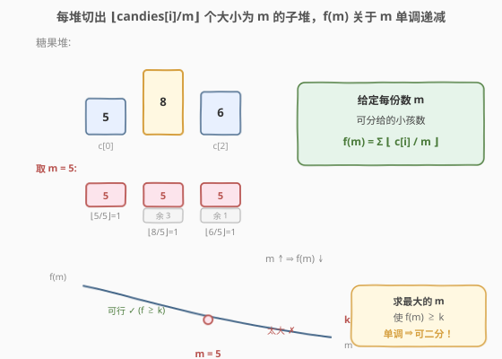
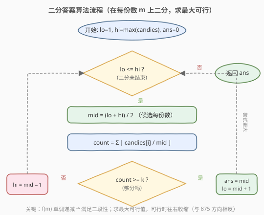

# 每个小孩最多能分到多少糖果

- **题目名称**：每个小孩最多能分到多少糖果
- **链接**：[2226. 每个小孩最多能分到多少糖果](https://leetcode.cn/problems/maximum-candies-allocated-to-k-children/)
- **难度**：中等
- **标签**：数组、二分查找

## 1. 题目概述

给你一个**下标从 0 开始**的整数数组 `candies`，每个元素表示大小为 `candies[i]` 的一堆糖果。你可以将每堆糖果分成任意数量的**子堆**，但**无法**再将两堆合并到一起。

另给你一个整数 `k`。你需要将这些糖果分配给 `k` 个小孩，使每个小孩分到**相同**数量的糖果。每个小孩可以拿走**至多一堆**糖果，有些糖果可能会不被分配。

返回每个小孩可以拿走的**最大糖果数目**。

**示例 1**：

```text
输入：candies = [5,8,6], k = 3
输出：5
解释：把 candies[1]=8 分成 5 和 3，把 candies[2]=6 分成 5 和 1，
     现有大小为 5、5、3、5、1 的五堆，挑 3 堆大小为 5 的分给 3 个小孩。
     无法让每个小孩得到超过 5 颗。
```

**示例 2**：

```text
输入：candies = [2,5], k = 11
输出：0
解释：总共只有 7 颗糖果，11 个小孩每人至少 1 颗也凑不齐，答案为 0。
```

**约束条件**：

- $1 \le \text{candies.length} \le 10^5$
- $1 \le \text{candies}[i] \le 10^7$
- $1 \le k \le 10^{12}$

> 💡 **题眼**：每堆「能切出几份大小为 $m$ 的子堆」是 $\lfloor \text{candies}[i]/m \rfloor$，只与 $m$ 有关；而「能分给几个小孩」正是各堆份数之和。一旦把目标从「枚举切法」转成「枚举每份数 $m$」，问题就降成单调函数上求最大可行点——标准二分答案。

---

## 2. 解题思路

### 2.1 暴力思路

逐个尝试每份数 $m = 1, 2, 3, \dots, \max(\text{candies})$，对每个 $m$ 计算可分给的小孩数 $f(m) = \sum \lfloor \text{candies}[i] / m \rfloor$，取最大的满足 $f(m) \ge k$ 的 $m$。验证单个 $m$ 是 $O(n)$，整体 $O(n \cdot \max(\text{candies}))$，而 $\max(\text{candies})$ 可达 $10^7$，必超时。

### 2.2 核心观察：二分答案



关键直觉是：**可分给的小孩数 $f(m)$ 关于每份数 $m$ 单调递减**。

- $m$ 越大，每堆切出的份数越少，能分给的小孩越少。
- $m = 1$ 时份数最多（$f(1) = \sum \text{candies}[i]$）；$m = \max(\text{candies})$ 时每堆至多 1 份。

于是存在一个**分界点** $m^*$：

```text
m <= m*  → f(m) >= k   (够分，可行)
m >  m*  → f(m) <  k   (份数不够，不可行)
```

我们要找的是**最大的可行 $m$**，即 $m^*$。这正是二分查找所需的**二段性**：在区间 $[1, \max(\text{candies})]$ 上二分，每次 $O(n)$ 验证 `mid`，可行则去右半找更大的，不可行则去左半缩小。

> 💡 **识别信号**：题目求「最大的满足某单调条件值」，且能 $O(n)$ 验证候选值是否合法 → 想「二分答案」。本题是 [875. 爱吃香蕉的珂珂](../0801-0900/875_爱吃香蕉的珂珂.md) 的镜像：同为单调函数上二分，但珂珂求**最小**可行速度（可行往左缩），本题求**最大**可行份数（可行往右缩），收缩方向相反。

> ⚠️ **上界取 $\max(\text{candies})$ 即可**：当 $m > \max(\text{candies})$，每堆 $\lfloor \text{candies}[i]/m \rfloor = 0$，$f(m) = 0 < k$（$k \ge 1$），必然不可行。无需取更大的上界。

### 2.3 算法流程图



注意判定为「可行」时**先记录 `ans = mid` 再收缩左界**（`lo = mid + 1`），保证最终保留的是「最大的可行值」——与求最小可行值时收缩右界的方向正好相反。

### 2.4 示例演算

![示例演算：candies = [5,8,6], k = 3](../images/candies_example_walkthrough.svg)

以 `candies = [5,8,6]`、`k = 3` 为例（`hi = max = 8`）：

- **第 1 轮** `[1,8]`，`mid=4`，$f(4) = 1+2+1 = 4 \ge 3$ ✓ → 可行，记 `ans=4`，去右半 `lo=5`。
- **第 2 轮** `[5,8]`，`mid=6`，$f(6) = 0+1+1 = 2 < 3$ ✗ → 份数不够，去左半 `hi=5`。
- **第 3 轮** `[5,5]`，`mid=5`，$f(5) = 1+1+1 = 3 \ge 3$ ✓ → 可行，记 `ans=5`，`lo=6`。
- **第 4 轮** `lo=6 > hi=5`，循环结束，返回 `ans=5`。

示例 2：`candies = [2,5]`、`k = 11`，$f(1) = 7 < 11$，整个区间都不可行，`ans` 始终保持初值 `0`，返回 `0`。

---

## 3. 参考代码

### C++

```cpp
class Solution {
  public:
    int maximumCandies(vector<int>& candies, long long k) {
        long long lo = 1;
        long long hi = *max_element(candies.begin(), candies.end());
        long long ans = 0; // 初值 0：若连 m=1 都不可行则返回 0

        while (lo <= hi) {
            long long mid = lo + (hi - lo) / 2;
            long long cnt = 0; // 防溢出：m=1 时 cnt 可达 10^12
            for (int c : candies) {
                cnt += c / mid; // 每堆可切出的份数
            }
            if (cnt >= k) {
                ans = mid;      // 可行，尝试更大的份数
                lo = mid + 1;
            } else {
                hi = mid - 1;   // 份数不够，缩小 m
            }
        }
        return (int)ans;
    }
};
```

### Python

```python
class Solution:
    def maximumCandies(self, candies: List[int], k: int) -> int:
        lo, hi = 1, max(candies)
        ans = 0

        while lo <= hi:
            mid = (lo + hi) // 2
            cnt = sum(c // mid for c in candies)  # 可分给的小孩数
            if cnt >= k:
                ans = mid       # 可行，尝试更大的份数
                lo = mid + 1
            else:
                hi = mid - 1    # 份数不够，缩小 m
        return ans
```

> ⚠️ **两个易错点**：
> 1. **溢出**：`k` 可达 $10^{12}$，且 `m=1` 时 `cnt = sum(candies)` 可达 $10^5 \times 10^7 = 10^{12}$，C++ 中 `k`、`mid`、`cnt` 都必须用 `long long`；`mid` 若用 `int`，`c / mid` 在 `mid` 超过 `int` 上界前虽无溢出，但二分上下界统一用 `long long` 更稳妥。返回时再转 `int`（答案 $\le 10^7$，安全）。
> 2. **整除即向下取整**：`c / mid` 在整数运算中天然是 $\lfloor c / \text{mid} \rfloor$，正是「一堆最多切出几个完整子堆」的语义；与 [875](../0801-0900/875_爱吃香蕉的珂珂.md) 的向上取整 `(p + mid - 1) / mid` 形成对照（吃香蕉需向上取整，因为最后不足一份也要花一小时；分糖果余下不足一份的直接丢弃）。

---

## 4. 复杂度分析

| 维度 | 复杂度 | 说明 |
|------|--------|------|
| 时间复杂度 | $O(n \log M)$ | $M = \max(\text{candies}) \le 10^7$；二分 $O(\log M) \approx 24$ 次，每次验证 $O(n)$ |
| 空间复杂度 | $O(1)$ | 仅用常数额外变量 |

> 💡 $n \le 10^5$、$\log M \approx 24$，总操作约 $2.4 \times 10^6$，远在时限内。瓶颈在验证函数的 $O(n)$ 求和，已是最优。

---

## 5. 扩展：「最大可行值」型二分答案

本题与 [875. 爱吃香蕉的珂珂](../0801-0900/875_爱吃香蕉的珂珂.md) 同属「二分答案」家族，但优化方向不同。二者可统一在一个模板下，区别仅在于可行分支的收缩方向：

**统一模板**：

```text
lo = 答案下界, hi = 答案上界, ans = 不可行哨兵(最小/最大)
while lo <= hi:
    mid = (lo + hi) / 2
    if check(mid) 合法:        # check() 是题目核心：O(n) 验证
        ans = mid
        # 求最大可行 → 往右缩：lo = mid + 1   (本题)
        # 求最小可行 → 往左缩：hi = mid - 1   (875)
    else:
        # 与上面相反
return ans
```

**方向判定口诀**：

- 求**最大**可行值（本题：每人糖果越多越好）→ 可行时 `ans = mid; lo = mid + 1`，往右找更大的。
- 求**最小**可行值（875：吃速越慢越好）→ 可行时 `ans = mid; hi = mid - 1`，往左找更小的。

两题的验证函数 $f$ 都关于候选值**单调递减**：

| 题目 | 候选值 | $f$（递减） | 约束 | 目标 |
|------|--------|------------|------|------|
| 875 珂珂 | 速度 $k$ | 总耗时 $\sum\lceil p/k\rceil$ | $f \le h$ | 最小 $k$ |
| 2226 糖果 | 每份数 $m$ | 总份数 $\sum\lfloor c/m\rfloor$ | $f \ge k$ | 最大 $m$ |

> 💡 注意约束的不等号方向：875 是「$f \le$ 阈值」（上界约束），2226 是「$f \ge$ 阈值」（下界约束）。同样是递减函数，上界约束求最小时分界点在左（可行段在右），下界约束求最大时分界点在右（可行段在左）——这正决定了 `ans` 最终落在单调曲线与阈值线交点的哪一侧。

---

## 6. 面试要点

1. **为什么能二分？二段性体现在哪？**

   - $f(m) = \sum\lfloor \text{candies}[i]/m \rfloor$ 随 $m$ 单调递减。存在分界点 $m^*$，使 $m \le m^*$ 时 $f(m) \ge k$（够分）、$m > m^*$ 时 $f(m) < k$（不够）。这种「左合法 / 右不合法」的结构就是二段性，可用二分定位 $m^*$。

2. **为什么 `ans` 初值取 0？**

   - 题目允许返回 0（示例 2）。若 $\sum \text{candies}[i] < k$，则 $f(1) = \sum \text{candies}[i] < k$，整个 $[1, \max]$ 区间都不可行，二分中可行分支不会被执行，`ans` 保持初值 0 返回。用 0 作「不可行哨兵」可省去单独的提前判断。

3. **`cnt` 求和为什么会溢出？怎么处理？**

   - `m=1` 时 `cnt = sum(candies)`，最大 $10^5 \times 10^7 = 10^{12}$，超过 32 位 `int`（约 $2.1 \times 10^9$）。同时 `k` 本身可达 $10^{12}$。故 C++ 中 `k`、`mid`、`hi`、`cnt` 全部用 `long long`，比较与累加才不会出错；Python 整数无上限无此问题。

4. **为什么用整除 `c / mid` 而不是向上取整？**

   - 一堆大小为 $c$ 的糖果切成大小为 $m$ 的子堆，最多切出 $\lfloor c/m \rfloor$ 个完整子堆，余数 $c \bmod m$ 不足一份，**丢弃不计**。这与 [875](../0801-0900/875_爱吃香蕉的珂珂.md) 相反：珂珂吃最后不足 $k$ 根的一堆也要花满一小时，故用 $\lceil p/k \rceil$。一个看「能完整切几份」，一个看「吃完要几小时」，取整方向由语义决定。

5. **如果 `k == 1`，答案是什么？**

   - 答案即 $\max(\text{candies})$：把最大那堆整堆给唯一的小孩即可。可作为快速边界检查；二分也能自然得到这个结果（`mid = max` 时 $f(\text{max}) \ge 1 = k$ 可行，且没有更大的合法值）。

---

## 7. 同类练习题

- [875. 爱吃香蕉的珂珂](https://leetcode.cn/problems/koko-eating-bananas/)（[题解](../0801-0900/875_爱吃香蕉的珂珂.md)）：二分答案母题，求**最小**可行速度，可行时往左缩；与本题构成「最小 vs 最大」镜像对照
- [1011. 在 D 天内送达包裹的能力](https://leetcode.cn/problems/capacity-to-ship-packages-within-d-days/)：二分船的运载能力求最小可行，`check` 用贪心按天装货，同为单调递减函数上二分
- [2064. 分配给商店的最小商品数量](https://leetcode.cn/problems/minimized-maximum-of-products-distributed-to-any-store/)：最大化最小值的二分答案，`check` 统计所需商店数，与本题「分堆计数」语义相近
- [410. 分割数组的最大值](https://leetcode.cn/problems/split-array-largest-sum/)：二分「最大子数组和」求最小可行，`check` 贪心划分子数组，巩固二分答案 + 贪心验证范式
- [1802. 有界数组中指定下标处的最大值](https://leetcode.cn/problems/maximum-value-at-a-given-index-in-a-bounded-array/)：二分答案求最大可行值，`check` 用等差数列求和验证构造可行性，同为「往右缩」型
