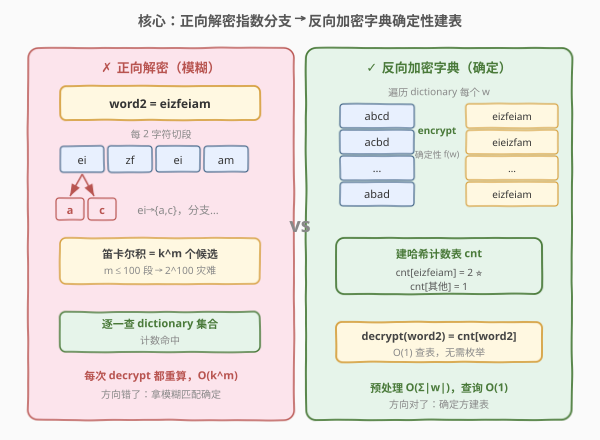
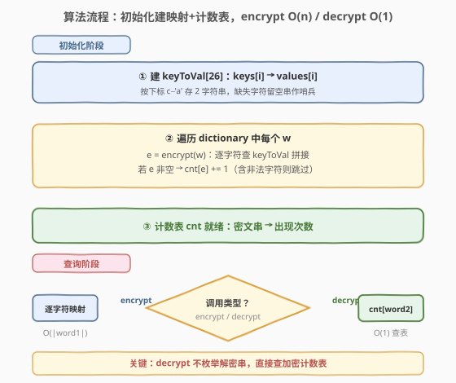
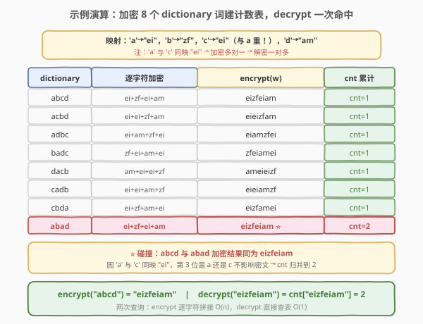

# LeetCode 加密解密字符串 题解

## 1. 题目概述

- **标题 / 题号**：加密解密字符串（#2227，hard）
- **链接**：https://leetcode.cn/problems/encrypt-and-decrypt-strings/
- **难度**：困难
- **标签**：设计、哈希表、字符串

**题意**：给定字符数组 `keys`（互不相同）、字符串数组 `values`（每个长度恰为 2）与字符串数组 `dictionary`（解密后所有允许的原串）。请实现 `Encrypter` 类：

- **加密 `encrypt(word1)`**：对 `word1` 中每个字符 `c`，找到 `keys[i] == c` 的下标 `i`，用 `values[i]` 替换 `c`；若 `keys` 中不存在 `c`，返回空串 `""`。
- **解密 `decrypt(word2)`**：将 `word2` 每相邻 2 个字符划成一段，每段 `s` 可映射回任意满足 `values[i] == s` 的 `keys[i]`（**一对多**，故解密结果可能多个）；统计「解密得到且出现在 `dictionary` 中」的字符串数目。

**示例**：

```text
输入：
["Encrypter", "encrypt", "decrypt"]
[[['a', 'b', 'c', 'd'], ["ei", "zf", "ei", "am"],
  ["abcd", "acbd", "adbc", "badc", "dacb", "cadb", "cbda", "abad"]],
 ["abcd"], ["eizfeiam"]]
输出：
[null, "eizfeiam", 2]

解释：
映射：'a'→"ei"，'b'→"zf"，'c'→"ei"，'d'→"am"
encrypt("abcd") = "ei"+"zf"+"ei"+"am" = "eizfeiam"
decrypt("eizfeiam") 拆成 "ei"/"zf"/"ei"/"am"
  "ei"→'a' 或 'c'，"zf"→'b'，"am"→'d'
  解密可能：abad / abcd / cbad / cbcd（共 4 个分支）
  其中 abad、abcd 在 dictionary 中 → 返回 2
```

**约束**：

- $1 \le \text{keys.length} = \text{values.length} \le 26$
- $\text{values}[i].length = 2$
- $1 \le \text{dictionary.length} \le 100$，$1 \le \text{dictionary}[i].length \le 100$
- $1 \le \text{word1.length} \le 2000$，$1 \le \text{word2.length} \le 200$（偶数）
- 所有 `word1[i]` 都出现在 `keys` 中
- `encrypt` 与 `decrypt` 调用总计至多 $200$ 次

> 💡 **题眼**：注意 `values` 允许重复——示例中 `'a'` 和 `'c'` 都映射到 `"ei"`，于是 `"ei"` 解密时可还原成 `'a'` 或 `'c'`。这种「**加密多对一、解密一对多**」的非双射性，使「正向解密」产生指数级分支，而「反向加密」仍是确定性的。这正是本题的破题点。

## 2. 解题思路

### 2.1 暴力思路：正向解密 + 字典匹配

最直观的写法是「老老实实按题意解密」：把 `word2` 按 2 字符切段，对每段找出所有可还原的 `keys[i]`，做笛卡尔积枚举全部解密串，再逐一查 `dictionary` 集合计数。

问题立刻暴露：

1. **指数分支**：若每段都有 $k$ 个候选字符，长度为 $2m$ 的 `word2` 可还原出 $k^m$ 个串。`word2.length ≤ 200` 即 $m ≤ 100$，分支数灾难性爆炸；
2. **重复劳动**：多次 `decrypt` 调用各自重新枚举，互不复用；
3. **方向错误**：解密本就是「一对多」的模糊过程，而加密是「一对一」的确定过程——拿模糊方去匹配确定方，必然吃亏。

> ⚠️ 暴力法在分支数上不可行。根源在于「**沿模糊方向求解**」。

### 2.2 核心观察：反向预处理——加密字典建计数表



**关键洞察**：题目问的是「`word2` 能解密出多少个 `dictionary` 中的串」，等价于「`dictionary` 中有多少个串加密后等于 `word2`」。

$$\text{decrypt}(word2) = \#\{\, w \in \text{dictionary} \mid \text{encrypt}(w) = word2 \,\}$$

为什么这个翻转成立？因为加密是**确定性函数**：给定 `w`，`encrypt(w)` 唯一。而「`w` 加密得 `word2`」与「`word2` 解密可得 `w`」是**同一事件**的两个方向描述——加密把 `w` 唯一压成 `word2`，解密把 `word2` 模糊展开成可能集合，二者互为逆过程。于是计数等价。

**预处理**：初始化时遍历 `dictionary`，对每个 `w` 调用一次 `encrypt`，用哈希表 `cnt` 累计 `cnt[encrypt(w)] += 1`。之后：

- `encrypt(word1)`：照常逐字符映射，$O(|word1|)$；
- `decrypt(word2)`：直接返回 `cnt[word2]`，$O(1)$ 平均。

> 💡 **为何能消掉指数分支**：正向解密时，`word2` 的每段「一对多」产生分支；反向加密时，`dictionary` 里每个 `w` 是**固定串**，加密只产生**一个**确定结果。我们把「对一个 `word2` 枚举 $k^m$ 个候选」换成「对 $|\text{dictionary}|$ 个固定 `w` 各算一次」，复杂度从 $O(k^m)$ 降到 $O(\sum|w|)$，且预处理一次、查询 $O(1)$ 复用。

**边界处理**：

- `dictionary` 中某 `w` 含 `keys` 外的字符时，`encrypt(w) = ""`。由于 `word2.length ≥ 2` 恒非空，`cnt[""]` 永远不会被查询命中，故直接跳过（或计入也无害）。
- `keys` 互不相同但 `values` 可重复，这正是「解密一对多」的来源，反向方案天然规避。

### 2.3 算法流程图



**初始化**（构造函数）：

1. 建 `keyToVal`：字符 → 2 字符串（数组下标 `c - 'a'`，$O(1)$ 查询）；
2. 遍历 `dictionary`，对每个 `w` 调用内部 `encrypt` 得 `e`；若 `e` 非空，`cnt[e] += 1`。

**`encrypt(word1)`**：逐字符查 `keyToVal` 拼接；遇到不在 `keys` 的字符立即返回 `""`。

**`decrypt(word2)`**：返回 `cnt` 中 `word2` 对应的计数（不存在则 0）。

### 2.4 示例演算



以官方示例展开。映射：`'a'→"ei"`，`'b'→"zf"`，`'c'→"ei"`，`'d'→"am"`。

**预处理——逐词加密 `dictionary`**：

| dictionary 词 `w` | 拆字符 | 逐字符加密 | `encrypt(w)` | `cnt` 累计 |
|------------------|--------|-----------|--------------|-----------|
| `"abcd"` | a/b/c/d | ei/zf/ei/am | `eizfeiam` | cnt[`eizfeiam`]=1 |
| `"acbd"` | a/c/b/d | ei/ei/zf/am | `eieizfam` | cnt[`eieizfam`]=1 |
| `"adbc"` | a/d/b/c | ei/am/zf/ei | `eiamzfei` | cnt[`eiamzfei`]=1 |
| `"badc"` | b/a/d/c | zf/ei/am/ei | `zfeiamei` | cnt[`zfeiamei`]=1 |
| `"dacb"` | d/a/c/b | am/ei/ei/zf | `ameieizf` | cnt[`ameieizf`]=1 |
| `"cadb"` | c/a/d/b | ei/ei/am/zf | `eieiamzf` | cnt[`eieiamzf`]=1 |
| `"cbda"` | c/b/d/a | ei/zf/am/ei | `eizfamei` | cnt[`eizfamei`]=1 |
| `"abad"` | a/b/a/d | ei/zf/ei/am | `eizfeiam` | cnt[`eizfeiam`]=2 ⭐ |

**查询**：

- `encrypt("abcd")` = `"ei"+"zf"+"ei"+"am"` = `"eizfeiam"` ✓
- `decrypt("eizfeiam")` = `cnt["eizfeiam"]` = **2** ✓

> 💡 注意 `"abcd"` 与 `"abad"` 加密结果都是 `"eizfeiam"`——因为 `'a'` 和 `'c'` 同映 `"ei"`，第 3 位是 `a` 还是 `c` 不影响密文。这正是「加密多对一」的体现，反向计数表自然把它们归并到同一桶。

## 3. 参考代码

### C++

```cpp
class Encrypter {
  public:
    Encrypter(vector<char>& keys, vector<string>& values, vector<string>& dictionary) {
        keyToVal.assign(26, "");
        for (int i = 0; i < (int)keys.size(); ++i) {
            keyToVal[keys[i] - 'a'] = values[i];
        }
        for (const string& w : dictionary) {
            string e = encrypt(w);
            if (!e.empty()) cnt[e]++;
        }
    }

    string encrypt(const string& word1) {
        string res;
        res.reserve(word1.size() * 2);
        for (char c : word1) {
            const string& v = keyToVal[c - 'a'];
            if (v.empty()) return "";
            res += v;
        }
        return res;
    }

    int decrypt(const string& word2) {
        auto it = cnt.find(word2);
        return it == cnt.end() ? 0 : it->second;
    }

  private:
    string keyToVal[26];
    unordered_map<string, int> cnt;
};
```

> ⚠️ 用 `string keyToVal[26]`（或 `array<string,26>`）按下标 `c-'a'` 索引，比 `unordered_map<char,string>` 更快且写法简洁。注意 `keys` 之外的字符对应空串，`encrypt` 中遇空串即返回 `""`，自然过滤掉含非法字符的 `dictionary` 词。

### Python

```python
class Encrypter:
    def __init__(self, keys: list[str], values: list[str], dictionary: list[str]):
        self.key_to_val = {}
        for k, v in zip(keys, values):
            self.key_to_val[k] = v
        self.cnt: dict[str, int] = {}
        for w in dictionary:
            e = self.encrypt(w)
            if e:
                self.cnt[e] = self.cnt.get(e, 0) + 1

    def encrypt(self, word1: str) -> str:
        parts = []
        for c in word1:
            v = self.key_to_val.get(c)
            if v is None:
                return ""
            parts.append(v)
        return "".join(parts)

    def decrypt(self, word2: str) -> int:
        return self.cnt.get(word2, 0)
```

> 💡 Python 用 `dict.get(c)` 判缺失返回 `None`，比捕获 `KeyError` 更简洁。`encrypt` 内部用列表收集片段再 `join`，避免字符串反复拼接的 $O(n^2)$ 开销。

## 4. 复杂度分析

| 维度 | 复杂度 | 说明 |
|------|--------|------|
| 初始化时间 | $O\big(\sum_{w} |w|\big)$ | 遍历 `dictionary` 逐词加密，总字符数 $\le 100 \times 100 = 10^4$ |
| `encrypt` | $O(|word1|)$ | 逐字符查表拼接，$|word1| \le 2000$ |
| `decrypt` | $O(|word2|)$ 均摊 | 哈希表查询；最坏哈希退化退化为 $O(|word2|)$（字符串哈希需读完整串） |
| 空间 | $O\big(\sum_{w} |w| + |\text{dictionary}|\big)$ | `cnt` 表存各密文串及计数；`keyToVal` 为 $O(26)$ 常数 |

> 💡 预处理把「每次 `decrypt` 都要枚举指数分支」摊到「初始化一次性 $O(10^4)$」，之后所有 `decrypt` 调用近乎免费。这是典型的「**空间换时间 + 预处理摊还**」范式。

## 5. 扩展：当 `dictionary` 巨大或动态变化时

本题 `dictionary.length ≤ 100` 且初始化后不变，反向计数表是正解。但若约束放宽，需考虑变体：

**`dictionary` 动态增删**：维护 `cnt` 时，增删一个词 `w` 只需对其 `encrypt(w)` 做 `cnt[e] ± 1`，单次 $O(|w|)$，仍优于正向。这把「反向预处理」升级为「反向增量维护」。

**`dictionary` 极大（如 $10^6$ 词）且只需判定存在性**：可用 Trie 存所有 `encrypt(w)`，`decrypt` 改为在 Trie 上沿 `word2` 走，到末尾节点读计数。空间压缩且支持前缀查询，但本题规模下不如哈希表直接。

**`values[i]` 长度不固定**：解密切段不再统一为 2，需用 DP / Trie 回溯解密。但「反向加密字典」的核心思想不变——只要加密是确定函数，反向计数永远可行。

> 💡 **方法论**：凡遇到「模糊展开 + 在已知集合中计数」的问题，先问一句「**能不能把已知集合预先正向变换，建成计数表**」。加密解密、编码解码、压缩还原都适用——确定性方向永远建表，模糊方向永远只查询。

## 6. 面试要点

1. **为什么反向加密字典能代替正向解密？**

   - 加密是确定性函数 `f: w → word2`，解密是其逆关系 `f⁻¹: word2 → {w}`。题目要计 $|f⁻¹(\text{word2}) \cap \text{dictionary}|$，等价于 $|\{w \in \text{dictionary} \mid f(w) = \text{word2}\}|$。把模糊的 `f⁻¹` 枚举换成对 `dictionary` 逐个算确定的 `f`，复杂度从指数降到线性。

2. **正向解密为何指数爆炸？**

   - `word2` 长 $2m$，每段 2 字符可能对应多个 `keys[i]`（`values` 可重复）。若每段平均 $k$ 个候选，解密串数 $\approx k^m$。$m \le 100$ 时即便 $k=2$ 也有 $2^{100}$，不可行。

3. **`dictionary` 中含 `keys` 外字符的词怎么处理？**

   - 这类词 `encrypt` 返回 `""`。由于 `word2.length ≥ 2` 恒非空，`cnt[""]` 不会被查询命中，可直接跳过（不插入）或插入无害。代码里 `if (!e.empty())` 跳过最干净。

4. **为何 `values` 允许重复是本题关键而非 bug？**

   - 重复 `values` 造成「加密多对一、解密一对多」，正是正向解密爆炸、反向加密仍确定的根因。若 `values` 也互异，则加解密互为双射，`decrypt` 退化为唯一还原 + 集合判定，本题难度骤降为中等。

5. **`encrypt` 用数组下标 `c-'a'` 比 `unordered_map` 好在哪？**

   - 字符集仅 26 个小写字母，数组 `keyToVal[26]` 查询 $O(1)$ 且常数极小、无哈希开销、无冲突。`keys` 外字符对应空串，天然作为「无法加密」的哨兵值，省去额外判存在逻辑。

## 同类练习题

| # | 题目 | 与本题的关联 |
|---|------|-------------|
| 535 | [TinyURL 的加密与解密](https://leetcode.cn/problems/encode-and-decode-tinyurl/) | 设计双向可逆编解码，对照本题「加密确定性 / 解密模糊性」的非对称性，理解双射与多对一的处理差异 |
| 271 | [字符串的编码与解码](https://leetcode.cn/problems/encode-and-decode-strings/) | 列表序列化为单串再还原，强调「确定性双向」编解码设计，与本题「反向建表」思想互补 |
| 139 | [单词拆分](https://leetcode.cn/problems/word-break/)（[题解](../0101-0200/139_单词拆分.md)） | 在字典集合中判定能否拼出目标串，共享「预处理字典 + 正向/反向选择」的权衡思想 |
| 208 | [实现 Trie (前缀树)](https://leetcode.cn/problems/implement-trie-prefix-tree/)（[题解](../0201-0300/208_实现Trie.md)） | 当 `dictionary` 极大或需前缀匹配时，Trie 是哈希计数表的结构化升级，承接第 5 节扩展讨论 |
| 981 | [基于时间的键值存储](https://leetcode.cn/problems/time-based-key-value-store/)（[题解](../0901-1000/981_基于时间的键值存储.md)） | 设计类预处理题，HashMap + 有序数组二分，与本题同为「初始化建索引、查询 O(1)/O(log n)」的设计范式 |
