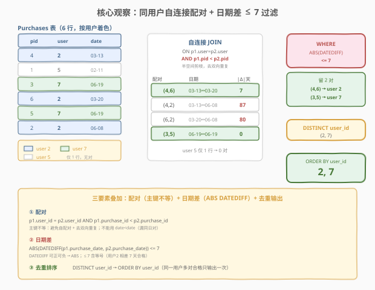
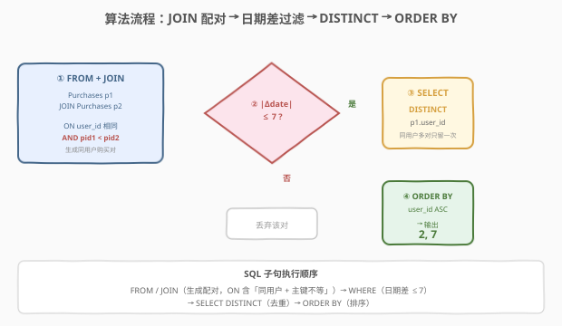
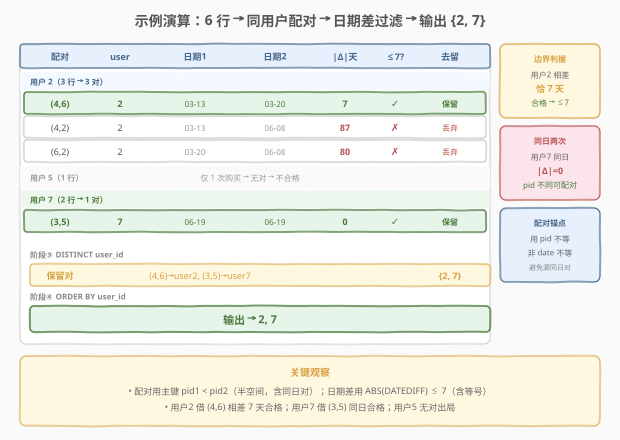

# 7 天内两次购买的用户

- **题目名称**：7 天内两次购买的用户
- **链接**：[2228. 7 天内两次购买的用户](https://leetcode.cn/problems/users-with-two-purchases-within-seven-days/)
- **难度**：中等
- **标签**：数据库、SQL、自连接、`DATEDIFF`、日期差、窗口函数 `LAG`、去重、LeetCode 锁题

## 1. 题目概述

给定 `Purchases` 表，每行记录某用户在某日期的一次购买。编写解决方案，报告在**任意 7 天时间段内**至少进行过**两次**购买的用户。按 `user_id` 升序返回结果。

**表结构**：

```text
Table: Purchases
+---------------+------+
| Column Name   | Type |
+---------------+------+
| purchase_id   | int  |  ← 主键
| user_id       | int  |
| purchase_date | date |
+---------------+------+
purchase_id 是该表的主键。
每一行包含购买 ID、用户 ID 与购买日期。
```

> ⚠️ **主键 `purchase_id` 唯一**：同一用户可在不同日期多次购买（多行），「同一用户同一日期」也可能出现多行（不同 `purchase_id`）——这正是「同日两次购买」的来源。判定「两次购买」需配对，故同一用户的多行是配对的素材，而非要去重的噪声。

**示例 1**：

```text
输入：
Purchases 表:
+-------------+---------+---------------+
| purchase_id | user_id | purchase_date |
+-------------+---------+---------------+
| 4           | 2       | 2022-03-13    |
| 1           | 5       | 2022-02-11    |
| 3           | 7       | 2022-06-19    |
| 6           | 2       | 2022-03-20    |
| 5           | 7       | 2022-06-19    |
| 2           | 2       | 2022-06-08    |
+-------------+---------+---------------+

输出：
+---------+
| user_id |
+---------+
| 2       |
| 7       |
+---------+

解释：
- 用户 2 在 2022-03-13 与 2022-03-20 各有一次购买，相差 7 天 ≤ 7，落在同一 7 天窗口内 → 合格。
- 用户 7 在 2022-06-19 有两次购买，相差 0 天 ≤ 7 → 合格。
- 用户 5 仅一次购买，无法成对 → 不合格。
```

**约束条件**：

- `purchase_id` 为表主键，行唯一。
- 同一 `user_id` 可对应多行（多次购买）；同一 `user_id` 同一 `purchase_date` 也可能多行（同日多次购买）。
- `purchase_date` 为 `DATE` 类型。
- 结果返回 `user_id` 列，按升序排列，去重。

> 💡 **审题关键**：① **「两次购买」需配对**——同一用户的任意两行组成一对，问「是否存在一对满足条件」；② **「7 天内」含边界**——日期差 $\le 7$ 天（含等号，示例中相差恰 7 天的用户 2 合格是关键判据）；③ **「任意 7 天时间段」等价于「存在一对日期差 $\le 7$」**——若两日期 $d_1 \le d_2$ 且 $d_2 - d_1 \le 7$，则 7 天窗口 $[d_1,\, d_1+7]$ 同时覆盖两者；反之亦然；④ **结果去重 + 升序**——同一用户多对合格只输出一次。

> ⚠️ **本题与 [访问日期之间最大的空档期](https://leetcode.cn/problems/biggest-window-between-visits/) 互为镜像**：同为「同一用户购买/访问日期排序后相邻差」问题，本题求「最小相邻差 $\le 7$」（存在性判定），那题求「最大相邻差」（极值）。一「最小」一「最大」，解法骨架相同（排序 + 相邻差），仅聚合方向不同。

---

## 2. 解题思路

### 2.1 暴力思路：逐用户枚举购买对

最直觉的过程式思维：取出每个用户的全部购买，两两组合成对，计算日期差，只要存在一对差 $\le 7$ 即该用户合格。

```text
for u in DISTINCT user_id:
    dates = [purchase_date of u]
    if any(abs(d1 - d2) <= 7 for d1, d2 in combinations(dates, 2)):
        emit u
return sorted(result)
```

逻辑完全正确——而 SQL 有更声明式的表达：「同一用户两两配对」正是**自连接**（self-join）的招牌场景：`Purchases p1 JOIN Purchases p2 ON p1.user_id = p2.user_id`。配对时加 `p1.purchase_id < p2.purchase_id` 既避免行与自己配对，又避免 $(a,b)$ 与 $(b,a)$ 双向重复——每对不同行只产生一次。

### 2.2 核心观察：自连接配对 + 日期差过滤



题目的三个语义——「**同用户的两次购买**」「**7 天内**」「**报告用户**」——分别对应 SQL 机制，叠加即得答案：

| 题意要求 | SQL 机制 | 语义 |
|----------|----------|------|
| 「同用户的两次购买」 | `p1.user_id = p2.user_id AND p1.purchase_id < p2.purchase_id` | **自连接 + 主键不等去重对**：每对不同行只一次 |
| 「7 天内」 | `ABS(DATEDIFF(p1.purchase_date, p2.purchase_date)) <= 7` | **日期差闭区间**：含 7 天边界 |
| 「报告用户」 | `DISTINCT p1.user_id` | **去重**：同一用户多对合格只留一次 |

$$\text{valid} = \{\, u \mid \exists\, p_1, p_2 :\, p_1.\text{user\_id} = p_2.\text{user\_id} = u \;\land\; p_1.\text{id} < p_2.\text{id} \;\land\; |p_1.d - p_2.d| \le 7 \,\}$$

> 💡 **为什么用 `p1.purchase_id < p2.purchase_id` 而非 `p1.purchase_date < p2.purchase_date`？** 日期可能相等（用户 7 同日两次购买），用日期**严格**小于会漏掉同日对；用日期**小于等于**则仍会产生 $(a,b)$ 与 $(b,a)$ 双向重复。主键 `purchase_id` 严格不等既保证两行不同、又保证每对只产生一次（半空间剪枝），且对同日对无影响——同日两行 `purchase_id` 必不同，仍能配对。

> ⚠️ **`DATEDIFF` 的方向与符号**：MySQL 中 `DATEDIFF(d1, d2)` 返回 $d_1 - d_2$ 的天数（可正可负）。由于自连接配对时未按日期排序（按主键排序），$p_1$ 的日期可能晚于 $p_2$，故必须用 `ABS(DATEDIFF(...))` 取绝对值再比 `<= 7`。若改为 `p1.purchase_date <= p2.purchase_date` 排序配对，则可直接 `DATEDIFF(p2.purchase_date, p1.purchase_date) <= 7` 无需 `ABS`，但要同时保留同日对（`<=` 而非 `<`）。

### 2.3 算法流程图



**逻辑执行步骤**：

| 步骤 | 子句 | 作用 |
|------|------|------|
| ① | `FROM Purchases p1 JOIN Purchases p2 ON p1.user_id = p2.user_id AND p1.purchase_id < p2.purchase_id` | 生成所有「同用户、不同行」的购买对（半空间，无双向重复） |
| ② | `WHERE ABS(DATEDIFF(p1.purchase_date, p2.purchase_date)) <= 7` | 日期差过滤，只留 7 天内的对 |
| ③ | `SELECT DISTINCT p1.user_id` | 同一用户多对合格只留一次 |
| ④ | `ORDER BY p1.user_id` | 升序输出 |

> 💡 **SQL 子句执行顺序**：`FROM`/`JOIN`（生成配对）→ `WHERE`（日期差过滤）→ `SELECT DISTINCT`（去重）→ `ORDER BY`（排序）。`JOIN` 的 `ON` 条件里同时含「同用户」与「主键不等」两个连接谓词，`WHERE` 再叠加日期差谓词。优化器可能把日期差谓词下推到连接过程中提前剪枝。

### 2.4 示例演算

以示例 1 的 6 行购买记录为例，观察三阶段处理：



**阶段 ①：同用户配对（`purchase_id` 不等，半空间）**

| 用户 | 购买（id : 日期） | 配对（id1 < id2） |
|------|-------------------|-------------------|
| 2 | 4:03-13, 6:03-20, 2:06-08 | (4,6), (4,2), (6,2) |
| 5 | 1:02-11 | （无，仅 1 行） |
| 7 | 3:06-19, 5:06-19 | (3,5) |

**阶段 ②：日期差 $\le 7$ 过滤**

| 配对 | 日期 1 | 日期 2 | $\lvert\Delta\rvert$ 天 | $\le 7$？ | 去留 |
|------|--------|--------|--------------------------|-----------|------|
| (4,6) | 03-13 | 03-20 | 7 | ✓ | **保留** |
| (4,2) | 03-13 | 06-08 | 87 | ✗ | 丢弃 |
| (6,2) | 03-20 | 06-08 | 80 | ✗ | 丢弃 |
| (3,5) | 06-19 | 06-19 | 0 | ✓ | **保留** |

> 💡 **用户 2 的「刚好 7 天」**：03-13 与 03-20 相差恰 7 天，`<= 7` 含等号故合格——这是判定边界开闭的关键。若题意改为「严格小于 7 天」，用户 2 将不合格，输出只剩 {7}。审题时务必抓住「示例中相差 7 天的用户是否在输出里」这一判据。

> ⚠️ **用户 7 的「同日两次」**：两行 `purchase_date` 均为 06-19，但 `purchase_id` 不同（3 与 5），故能配对。若误用 `p1.purchase_date < p2.purchase_date` 排序配对，同日对会被 `<` 漏掉，用户 7 误判为不合格——这是配对条件选主键而非日期的根本原因。

**阶段 ③④：`DISTINCT user_id` + `ORDER BY`**

保留对的 `user_id` 集合 = `{2, 7}`，去重后升序输出 `2, 7`。

---

## 3. 参考代码

### SQL（解法 A：自连接，推荐）

```sql
SELECT DISTINCT p1.user_id
FROM Purchases p1
JOIN Purchases p2
  ON p1.user_id = p2.user_id
 AND p1.purchase_id < p2.purchase_id
 AND ABS(DATEDIFF(p1.purchase_date, p2.purchase_date)) <= 7
ORDER BY p1.user_id;
```

> 💡 **写法要点**：
> - `p1.user_id = p2.user_id`：只配对同一用户的购买。
> - `p1.purchase_id < p2.purchase_id`：避免自配对（行与自己）与双向重复 $(a,b)/(b,a)$，每对不同行只产生一次。
> - `ABS(DATEDIFF(p1.purchase_date, p2.purchase_date)) <= 7`：日期差闭区间，含 7 天边界（示例用户 2 相差 7 天合格）。
> - `DISTINCT p1.user_id`：同一用户多对合格只输出一次。
> - `ORDER BY p1.user_id`：升序输出。
> - ✓ **最自然**：`JOIN` 表达「配对」、`WHERE` 表达「7 天内」、`DISTINCT` 表达「报告用户」，语义一气呵成。

### SQL（解法 B：窗口函数 `LAG`，$O(n \log n)$）

自连接对「单用户购买很多」的场景会退化为 $O(n^2)$（同一用户 $m$ 次购买产生 $\binom{m}{2}$ 对）。优化思路：把同一用户的购买按日期排序，**只检查相邻两次**的日期差——因为「任意两购买的最小日期差必出现在排序后的相邻对中」（见 5.1 证明）。

```sql
WITH ordered AS (
    SELECT user_id, purchase_date,
           LAG(purchase_date) OVER (
               PARTITION BY user_id
               ORDER BY purchase_date, purchase_id
           ) AS prev_date
    FROM Purchases
)
SELECT DISTINCT user_id
FROM ordered
WHERE prev_date IS NOT NULL
  AND DATEDIFF(purchase_date, prev_date) <= 7
ORDER BY user_id;
```

> 💡 **解法 B 要点**：
> - `LAG(purchase_date) OVER (PARTITION BY user_id ORDER BY purchase_date, purchase_id)`：取同一用户按日期排序后的「上一行」日期。`ORDER BY` 加 `purchase_id` 作次序保证同日多行有确定性顺序。
> - `DATEDIFF(purchase_date, prev_date)`：当前行减上一行，由于已按日期升序排序，结果非负，**无需 `ABS`**。
> - 同日两次购买时 `DATEDIFF = 0 \le 7`，必合格——`ORDER BY purchase_date` 把同日行排在一起，`LAG` 捕获同日相邻对。
> - ✓ **大数据优化**：排序 $O(n \log n)$ + 扫描 $O(n)$，远优于自连接 $O(n^2)$。

### Python（pandas）

```python
import pandas as pd

def users_with_two_purchases_within_seven_days(purchases: pd.DataFrame) -> pd.DataFrame:
    purchases = purchases.sort_values(['user_id', 'purchase_date', 'purchase_id'])
    purchases['prev_date'] = purchases.groupby('user_id')['purchase_date'].shift(1)
    mask = purchases['prev_date'].notna() & \
           ((purchases['purchase_date'] - purchases['prev_date']).dt.days.abs() <= 7)
    result = purchases.loc[mask, 'user_id'].drop_duplicates().sort_values()
    return result.to_frame('user_id')
```

> 💡 **pandas 对照**：
> - `sort_values(['user_id', 'purchase_date', 'purchase_id'])` 对应 SQL `PARTITION BY user_id ORDER BY purchase_date, purchase_id`（pandas 先排序再 `groupby.shift`）。
> - `groupby('user_id')['purchase_date'].shift(1)` 对应 `LAG(...) OVER (PARTITION BY user_id ...)`。
> - `(purchase_date - prev_date).dt.days.abs()` 对应 `ABS(DATEDIFF(...))`；用 `ABS` 是因为 `shift` 后 `prev_date` 是上一行（已排序故差非负，`abs` 仅为对称保险）。
> - `.drop_duplicates()` 对应 `DISTINCT`，`.sort_values()` 对应 `ORDER BY`。

---

## 4. 复杂度分析

| 维度 | 解法 A（自连接） | 解法 B（`LAG`） | pandas |
|------|------------------|-----------------|--------|
| **时间** | $O(n^2)$（最坏，单用户 $n$ 行） | $O(n \log n)$ | $O(n \log n)$ |
| **空间** | $O(p)$（配对数，最坏 $O(n^2)$） | $O(n)$ | $O(n)$ |
| **写法** | 直观，配对语义清晰 | 排序 + 相邻差，高效 | DataFrame |
| **推荐度** | ✓ 首选（$n$ 小时清晰） | ✓ 大数据优化 | ✓ 验证用 |

> - $n$ = `Purchases` 表行数，$p$ = 同用户配对总数（最坏单用户 $m = n$ 时 $p = \binom{n}{2} = O(n^2)$）。
> - **自连接**：同一用户 $m$ 次购买产生 $\binom{m}{2}$ 对，最坏 $O(n^2)$；若 `(user_id, purchase_date)` 建索引可减少配对代价，但渐近仍受最大单用户购买数制约。
> - **`LAG`**：按用户分区排序 $O(n \log n)$，扫描相邻 $O(n)$；只检查相邻而非全配对，是「最小差必相邻」性质的算法红利。
> - **空间**：自连接需物化配对集 $O(p)$；`LAG` 仅需排序缓冲 $O(n)$。

---

## 5. 扩展：相邻差充分性与变体

### 5.1 为什么「相邻差」足以判定

**定理**：排序序列 $d_1 \le d_2 \le \dots \le d_k$ 中，任意两元素差的最小值等于某相邻对差 $d_{i+1} - d_i$。

**证明**：设最小差出现在 $(d_i, d_j)$，$i > j$。若 $i > j+1$，则

$$d_i - d_j = (d_i - d_{i-1}) + (d_{i-1} - d_j) \ge d_{i-1} - d_j \ge d_i - d_j$$

故 $d_{i-1} - d_j = d_i - d_j$，即 $(d_{i-1}, d_j)$ 也是最小对。反复收缩 $i$ 直到 $i = j+1$，即最小差必在相邻对。$\square$

**推论**：「存在某对差 $\le 7$」$\Leftrightarrow$「存在某相邻对差 $\le 7$」。`LAG` 解法据此把 $O(n^2)$ 配对降为 $O(n)$ 相邻检查。

> ⚠️ 此性质**只对「存在性 / 最小值」成立**，对「最大值」不成立——最大差必是首尾 $d_k - d_1$（也是某种「相邻」于端点），但「任意对的最大值」就是首尾，仍只需看端点。故镜像题「最大空档期」也用 `LAG`/`LEAD` 看相邻差取 `MAX`。

### 5.2 变体：边界开闭

| 题意改法 | 谓词 | 示例用户 2（相差 7）是否合格 |
|----------|------|------------------------------|
| 「within 7 days」（本题） | `<= 7` | ✓ 合格 |
| 「严格小于 7 天」 | `< 7`（即 `<= 6`） | ✗ 不合格 |
| 「恰好 7 天」 | `= 7` | ✓ 合格（但用户 7 同日对不再合格） |

> 💡 审题判据：看示例中「相差恰 7 天」的用户是否出现在输出里——出现则闭区间 `<= 7`，不出现则严格 `< 7`。本题用户 2 在输出中，故 `<= 7`。

### 5.3 变体：7 天滑动窗口内至少 $k$ 次购买

若升级为「7 天滑动窗口内购买次数 $\ge k$」（$k \ge 3$），相邻差不再充分——需排序后双指针维护窗口 $[\text{left}, \text{right}]$，窗口内最大日期 − 最小日期 $\le 7$ 且窗口大小 $\ge k$。$k = 2$ 退化为本题（窗口内有 2 个即相邻差 $\le 7$）。

### 5.4 镜像题：访问日期之间最大的空档期

[访问日期之间最大的空档期](https://leetcode.cn/problems/biggest-window-between-visits/)（本题相似题）：同一用户访问日期排序后，求**相邻**访问间的**最大**间隔。同样是 `LAG` 算相邻差，但取 `MAX` 而非判 `<= 7`。一「最大」一「最小」，互为镜像——掌握排序 + 相邻差骨架，两题皆通。

---

## 6. 面试要点

1. **为什么用 `p1.purchase_id < p2.purchase_id` 而非日期比较来配对？**

   > 两个目的：① 避免自配对（行与自己 `JOIN`）；② 避免双向重复（$(a,b)$ 与 $(b,a)$ 各产生一次）。主键严格小于实现「半空间剪枝」——每对不同行只产生一次。**不能**用 `p1.purchase_date < p2.purchase_date`：日期可能相等（同日多次购买），严格小于会漏掉同日对（如用户 7）；用小于等于则仍双向重复。主键必唯一，是不等配对的最佳锚点。

2. **`DATEDIFF` 在 MySQL 中的方向与符号如何？为什么用 `ABS`？**

   > `DATEDIFF(d1, d2)` 返回 $d_1 - d_2$ 的天数，可正可负。自连接按主键配对，未保证 $p_1$ 日期 $\le p_2$ 日期，故差值可负——必须 `ABS(DATEDIFF(...))` 取绝对值再比 `<= 7`。若配对时强制 `p1.purchase_date <= p2.purchase_date`（注意 `<=` 保留同日对），则可直接 `DATEDIFF(p2.purchase_date, p1.purchase_date) <= 7` 无需 `ABS`。

3. **「7 天内」是 `<= 7` 还是 `< 7`？**

   > 闭区间 `<= 7`。示例中用户 2 两次购买（03-13 与 03-20）相差恰 7 天仍被报告合格，说明含等号。这是边界开闭的判据——审题时抓住「示例中相差 7 天的用户是否在输出中」即可定夺。

4. **「任意 7 天时间段内两次购买」为什么等价于「存在一对日期差 $\le 7$」？**

   > 充要性：若 $d_1 \le d_2$ 且 $d_2 - d_1 \le 7$，则 7 天窗口 $[d_1, d_1+7]$ 同时覆盖两者；反之若两日期落在某 7 天窗口 $[t, t+7]$，则 $d_2 - d_1 \le 7$。故「存在一对差 $\le 7$」与「存在 7 天窗口覆盖两次购买」等价，只需找一对差 $\le 7$。

5. **自连接 $O(n^2)$ 如何优化？为什么「只看相邻」就够？**

   > 排序后只检查相邻差：同一用户购买按日期升序排列，**最小日期差必出现在相邻对**（见 5.1 证明——若最小差在非相邻对 $(d_i, d_j)$，可逐步收缩到相邻而不增大）。用 `LAG() OVER (PARTITION BY user_id ORDER BY purchase_date, purchase_id)` 取上一行，`DATEDIFF(curr, prev) <= 7` 判定。复杂度降为 $O(n \log n)$，单用户购买很多时显著优于自连接。

> 💡 **一句话总结**：2228 是 SQL **"自连接配对 + 日期差过滤"** 招牌题——`Purchases p1 JOIN Purchases p2 ON 同用户且 id1<id2 WHERE ABS(DATEDIFF)<=7 → DISTINCT → ORDER BY`。考点四要素：**自连接去重对（主键不等）、日期差（`ABS(DATEDIFF)`）、闭区间（$\le 7$ 含等号）、去重排序输出**。进阶用 `LAG` 相邻差把 $O(n^2)$ 降为 $O(n \log n)$，依据是「最小差必相邻」。

---

## 7. 同类练习题

- [197. 上升的温度](https://leetcode.cn/problems/rising-temperature/)（[题解](../0101-0200/197_上升的温度.md)）：自连接 + `DATEDIFF` 比日期差（昨天 = 1 天），自连接日期差的入门母题，2228 的配对骨架即源于此
- [550. 游戏玩法分析 IV](https://leetcode.cn/problems/game-play-analysis-iv/)（[题解](../0501-0600/550_游戏玩法分析IV.md)）：`DATEDIFF` + 子查询判定「次日回归用户」，配对型日期差判定进阶，对照「存在性配对」的不同表达
- [2205. 有资格享受折扣的用户数量](2205_有资格享受折扣的用户数量.md)：同为 `Purchases` 表的 SQL 题，行级过滤 + `COUNT(DISTINCT)`，对照「过滤型」与「配对型」两类 SQL 套路
- [访问日期之间最大的空档期](https://leetcode.cn/problems/biggest-window-between-visits/)：排序 + `LAG` 算相邻访问的**最大**间隔，与本题「**最小**相邻差 $\le 7$」互为镜像，同骨架异聚合方向
