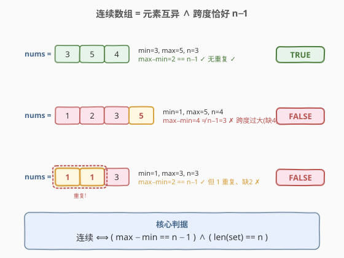
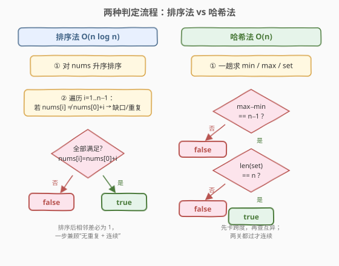
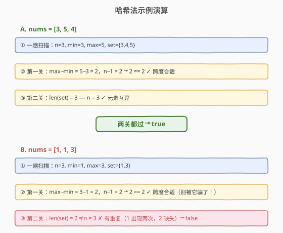

# LeetCode 检查数组是否连贯 题解

## 1. 题目概述

- **标题 / 题号**：检查数组是否连贯（#2229，easy）
- **链接**：https://leetcode.cn/problems/check-if-an-array-is-consecutive/
- **难度**：简单
- **标签**：数组、哈希表、排序

**题意**：给定一个整数数组 `nums`，判断它是否「连贯」。若数组**恰好包含**区间 $[x,\; x+n-1]$ 内的每一个整数各一次，则称其为连贯数组，其中 $x = \min(\text{nums})$ 为数组最小值，$n = \text{len(nums)}$ 为数组长度。返回 `true` / `false`。

> 💡 等价说法：数组元素**两两互异**，且 $\max - \min = n - 1$。因为 $[x, x+n-1]$ 恰有 $n$ 个整数，若 $n$ 个互异的值都落在该闭区间内，就必然是它的全部。

**示例 1**：

```text
输入：nums = [3, 5, 4]
输出：true
解释：min=3, n=3, 区间 [3, 5]。3、4、5 各出现一次 → 连贯。
```

**示例 2**：

```text
输入：nums = [1, 2, 3, 5]
输出：false
解释：min=1, n=4, 区间 [1, 4]。5 越界、4 缺失 → 不连贯。
```

**示例 3**：

```text
输入：nums = [1, 1, 3]
输出：false
解释：min=1, max=3, n=3, max−min=2 = n−1（跨度恰好！），
      但 1 重复、2 缺失 → 不连贯。这是最容易被漏判的情况。
```

**约束**：

- $1 \le \text{nums.length} \le 10^5$
- $0 \le \text{nums[i]} \le 10^9$

> ⚠️ 示例 3 是本题的「题眼」：**仅靠 $\max - \min = n - 1$ 不够**——跨度合适但元素重复时仍会出错。必须同时验证「互异」与「跨度」两个条件。

## 2. 解题思路

### 2.1 暴力思路：逐一核对区间内每个值

求出 $x = \min$ 与 $n$ 后，对区间 $[x, x+n-1]$ 内的每个目标值 $v$，扫描一遍 `nums` 看是否恰好出现一次。需 $n$ 个目标 × 每次 $O(n)$ 扫描 = $O(n^2)$。$n \le 10^5$ 时会超时，且「恰好一次」的计数逻辑容易写错。

> ⚠️ 暴力法既慢又易错。本题的优化方向是把「逐一核对」换成「整体判定」——用两个 $O(1)$ 可检验的充分必要条件替代 $n$ 次查找。

### 2.2 核心观察：互异 + 跨度恰好 $n-1$



**观察一：$n$ 个互异整数的最小跨度恰为 $n-1$**

由抽屉原理，$n$ 个互不相同的整数，其 $\max - \min \ge n - 1$（端点之间至少要容下 $n$ 个不同整数）。等号成立当且仅当这 $n$ 个值恰好填满 $[\min, \max]$，即 $\{\min, \min+1, \dots, \max\}$。

**观察二：两个条件合起来与「连贯」等价**

$$\text{连贯} \iff \bigl(\max - \min = n - 1\bigr) \;\land\; \bigl(\text{所有元素互异}\bigr)$$

- $\max - \min = n-1$ 保证跨度刚好，区间 $[\min, \max]$ 内恰有 $n$ 个整数；
- 「互异」保证这 $n$ 个数各不相同；
- $n$ 个互异的数落在一个只有 $n$ 个整数的闭区间里 $\Rightarrow$ 必然取遍该区间 $\Rightarrow$ 连贯。

反之，连贯显然蕴含这两条。故二者等价。

**观察三：互异性可用哈希集合 $O(n)$ 判定**

把 `nums` 倒入 `set`，`len(set) == n` 即互异；$\min/\max$ 也能在同一次遍历里顺手求出。无需排序，整体 $O(n)$。

> 💡 **为什么不能只看跨度？** 示例 3 `[1,1,3]` 的 $\max-\min = 2 = n-1$ 跨度合格，但因 `1` 重复、`2` 缺失而不连贯。可见「跨度」只卡住了**区间的端点距离**，没卡住**内部的覆盖**；互异条件补上了这一刀。

### 2.3 算法流程图



两条等价路线：

- **排序法**：升序排序后，连贯数组必有 $\text{nums}[i] = \text{nums}[0] + i$（$i=1,\dots,n-1$）。一步检查同时覆盖「无重复」（相邻相等会破坏递增 1 的规律）与「无缺口」。$O(n \log n)$ / $O(1)$（原地排序）。
- **哈希法**：一趟求 $\min/\max/\text{set}$，先判 $\max-\min = n-1$，再判 $|\text{set}| = n$。$O(n)$ / $O(n)$。

### 2.4 示例演算

以示例 1 `[3,5,4]`（`true`）与示例 3 `[1,1,3]`（`false`）走一遍哈希法：



**要点**：`[1,1,3]` 在「第一关（跨度）」顺利通过，败在「第二关（互异）」——`len({1,3}) = 2 ≠ 3`。这正说明两道关卡缺一不可。

> 💡 **边界 $n=1$**：单元素数组 $\max=\min$，$\max-\min=0=n-1$，`len(set)=1=n`，返回 `true`。单个数天然「连贯」。

## 3. 参考代码

### C++：哈希集合 + min/max（$O(n)$ / $O(n)$）

```cpp
class Solution {
public:
    bool isConsecutive(vector<int>& nums) {
        int n = nums.size();
        int lo = INT_MAX, hi = INT_MIN;
        unordered_set<int> st;
        for (int x : nums) {
            lo = min(lo, x);
            hi = max(hi, x);
            st.insert(x);
        }
        if (hi - lo != n - 1) return false;   // 第一关：跨度
        return (int)st.size() == n;           // 第二关：互异
    }
};
```

### C++：排序法（$O(n \log n)$ / $O(1)$）

```cpp
class Solution {
public:
    bool isConsecutive(vector<int>& nums) {
        int n = nums.size();
        sort(nums.begin(), nums.end());
        for (int i = 1; i < n; ++i) {
            if (nums[i] != nums[0] + i) return false;   // 相邻差必为 1
        }
        return true;
    }
};
```

### Python：哈希集合 + min/max（$O(n)$ / $O(n)$）

```python
class Solution:
    def isConsecutive(self, nums: List[int]) -> bool:
        n = len(nums)
        lo, hi = min(nums), max(nums)
        if hi - lo != n - 1:
            return False
        return len(set(nums)) == n
```

### Python：排序法（$O(n \log n)$ / $O(1)$）

```python
class Solution:
    def isConsecutive(self, nums: List[int]) -> int:
        nums.sort()
        return all(nums[i] == nums[0] + i for i in range(len(nums)))
```

> 💡 **选哪个？** 追求线性时间用哈希法；追求 $O(1)$ 额外空间用排序法（原地排序）。两者在 $n \le 10^5$ 下都轻松通过，面试中先写哈希法（思路最直），再提排序法作为空间优化。

## 4. 复杂度分析

| 维度 | 哈希法 | 排序法 | 说明 |
|------|--------|--------|------|
| **时间复杂度** | $O(n)$ | $O(n \log n)$ | 哈希法一趟遍历求 min/max/ set；排序法瓶颈在 `sort` |
| **空间复杂度** | $O(n)$ | $O(1)$ | 哈希法需存集合；排序法原地排序（不计递归栈） |

> 💡 $n \le 10^5$ 时两种写法均在毫秒级。若值域较小（如 $\text{nums[i]} \le 10^6$），还可用布尔数组代替哈希表来标记出现过的值，常数更小但空间受值域约束；本题值域可达 $10^9$，哈希表是稳妥选择。

## 5. 扩展：为何两个条件互为「补集」

把判定拆成两道关卡并非偶然，它们恰好覆盖两类典型反例：

| 反例类型 | 跨度 $\max-\min=n-1$？ | 互异？ | 例 |
|----------|------------------------|--------|------|
| **有缺口**（缺中间某值） | ✗ 跨度过大 | ✓ | `[1,2,3,5]`：缺 4，$\max-\min=4\neq3$ |
| **有重复**（同值出现两次） | ✓ 跨度可能恰好 | ✗ | `[1,1,3]`：1 重复，`len(set)=2 ≠ 3` |
| **既缺又重** | ✗ | ✗ | `[1,2,2,5]` |

- 仅判跨度会放过「有重复」型（如示例 3）；
- 仅判互异会放过「有缺口」型（如 `[1,2,3,5]` 互异但不连贯）。

二者**联合**才与连贯等价。这一「双条件互补」思想在许多「区间覆盖」类判定中通用：用**端点距离**卡范围大小，用**计数/集合**卡内部覆盖。

## 6. 面试要点

1. **连贯的等价定义是什么？为什么等价？**

   - 连贯 $\iff$（$\max-\min = n-1$）且（所有元素互异）。充分性：$n$ 个互异整数落在恰含 $n$ 个整数的闭区间 $[\min,\max]$ 内，必取遍该区间；必要性显然。这是把「逐一核对 $n$ 个目标值」化简为「两个 $O(1)$/ $O(n)$ 整体条件」的关键。

2. **为什么只用 $\max-\min = n-1$ 会出错？**

   - 跨度只约束端点距离，不约束内部覆盖。`[1,1,3]` 的跨度 $2 = n-1$ 合格，但 1 重复、2 缺失。必须再判 `len(set) == n` 补上「互异 + 覆盖」。

3. **排序法为什么一步 `nums[i]==nums[0]+i` 就够？**

   - 升序后，若存在相邻相等（重复），则某处 `nums[i]==nums[i-1]`，递增 1 的规律立刻被打破；若存在缺口，`nums[i]` 会比 `nums[0]+i` 大。故该等式同时否定了「重复」与「缺口」，一个循环覆盖两关。

4. **哈希法 vs 排序法如何取舍？**

   - 时间：哈希 $O(n)$ 优于排序 $O(n\log n)$；空间：排序 $O(1)$（原地）优于哈希 $O(n)$。值域巨大时不能用布尔数组，哈希表是自然选择。面试先写哈希法讲清思路，再提排序法作空间优化。

5. **$n=1$ 的边界如何处理？**

   - 单元素 $\max=\min$，$\max-\min=0=n-1$，`len(set)=1=n`，返回 `true`。两种写法都自动覆盖，无需特判，但口头点出能体现边界意识。

> 💡 **一句话总结**：2229 是「区间覆盖判定」的模板题——用 $\max-\min=n-1$ 卡跨度、用 `len(set)=n` 卡互异，两关互补，$O(n)$ 一趟搞定。

## 同类练习题

| # | 题目 | 与本题的关联 |
|---|------|-------------|
| 128 | [最长连续序列](https://leetcode.cn/problems/longest-consecutive-sequence/) | 在无序数组里找最长的「连续值段」，同样依赖「值是否相邻」的判定，从「判单个数组」升级为「全图找最长段」 |
| 217 | [存在重复元素](https://leetcode.cn/problems/contains-duplicate/) | 本题「互异」关卡的退化版——只问有没有重复，`len(set)==n` 的直接应用 |
| 219 | [存在重复元素 II](https://leetcode.cn/problems/contains-duplicate-ii/) | 在「判重」基础上加「下标距离 ≤ k」约束，哈希表记录最近下标的进阶用法 |
| 228 | [汇总区间](https://leetcode.cn/problems/summary-ranges/) | 排序后把连续值段压缩成区间表示，与排序法判定 `nums[i]==nums[0]+i` 同源，从「判是否一段」变为「找所有段」 |
