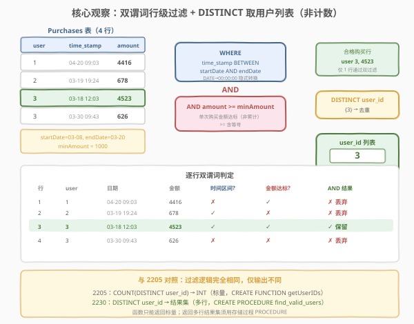
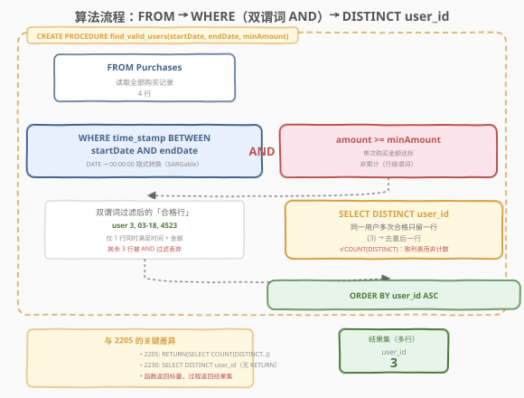
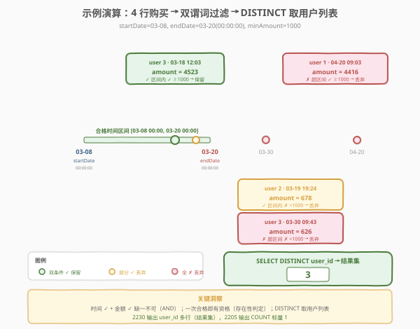

# LeetCode 查找可享受优惠的用户 题解

## 1. 题目概述

- **标题 / 题号**：查找可享受优惠的用户（#2230，easy）
- **链接**：https://leetcode.cn/problems/the-users-that-are-eligible-for-discount/
- **难度**：简单
- **标签**：数据库、SQL、`WHERE` 过滤、日期范围、`BETWEEN`、`DISTINCT`、去重、存储过程、`CREATE PROCEDURE`、结果集、SARGable、LeetCode 锁题

**题意**：给定 `Purchases` 表，每行记录一次购买行为。编写一个**存储过程** `find_valid_users(startDate, endDate, minAmount)`，查询**有资格享受优惠的用户**：即在该时间间隔 $[\text{startDate}, \text{endDate}]$ 内，**至少有一次**购买金额 $\ge \text{minAmount}$ 的不同用户，返回其 `user_id` **列表**。

> ⚠️ **LeetCode Plus 会员锁题**：本题为 Plus 会员专享题，题目描述与代码模板需会员权限查看。下述题意基于 [2205. 有资格享受折扣的用户数量](https://leetcode.cn/problems/the-number-of-users-that-are-eligible-for-discount/)（[题解](./2205_有资格享受折扣的用户数量.md)）的官方对照关系与 LeetCode 元数据（`manual: true`、`name: find_valid_users`、同一 `Purchases` 表与同一测试用例）重建。过滤逻辑与 2205 完全一致，唯一区别在输出：2205 返回**用户数量**（标量 `INT`），2230 返回**用户 ID 列表**（多行结果集）。

**表结构**：

```text
Table: Purchases
+-------------+----------+
| Column Name | Type     |
+-------------+----------+
| user_id     | int      |  ← 主键之一
| time_stamp  | datetime |  ← 主键之一
| amount      | int      |
+-------------+----------+
(user_id, time_stamp) 是该表的主键（复合主键）。
每一行都包含 ID 为 user_id 的用户的购买时间和支付金额的信息。
```

> ⚠️ **复合主键 `(user_id, time_stamp)`**：同一用户可在不同时间多次购买（多行），但「同一用户同一时刻」不会重复。正因同一用户有多行，返回用户列表需要 `DISTINCT` 去重——否则同一用户的多次合格购买会产生重复的 `user_id` 行。

**存储过程签名**：

```sql
CREATE PROCEDURE find_valid_users(startDate DATE, endDate DATE, minAmount INT)
```

> 💡 **为什么用 `PROCEDURE` 而非 `FUNCTION`？** 本题返回的是**多行结果集**（用户 ID 列表），MySQL 存储函数（`CREATE FUNCTION`）只能返回**单个标量值**，无法返回结果集。存储过程（`CREATE PROCEDURE`）体内的 `SELECT` 语句会直接把结果集返回给调用方，正是本题所需。对照 2205 返回标量 `INT` 用 `CREATE FUNCTION ... RETURNS INT`，2230 返回结果集须用 `CREATE PROCEDURE`。

**日期语义**（关键约束，与 2205 一致）：

> 若要将日期转换为时间，两个日期都应该被视为一天的**开始**（即 `endDate = 2022-03-05` 应该被视为时间 `2022-03-05 00:00:00`）。

这意味着时间间隔是 $[\text{startDate}\;00\!:\!00\!:\!00,\; \text{endDate}\;00\!:\!00\!:\!00]$——`endDate` 当天的 00:00:01 及之后**不在**区间内。MySQL 中 `DATETIME` 列与 `DATE` 参数比较时，会自动把 `DATE` 转为 `YYYY-MM-DD 00:00:00` 的 `DATETIME`，恰好实现这一语义。

**示例 1**（与 2205 共用同一测试用例）：

```text
输入：
Purchases 表:
+---------+---------------------+--------+
| user_id | time_stamp          | amount |
+---------+---------------------+--------+
| 1       | 2022-04-20 09:03:00 | 4416   |
| 2       | 2022-03-19 19:24:02 | 678    |
| 3       | 2022-03-18 12:03:09 | 4523   |
| 3       | 2022-03-30 09:43:42 | 626    |
+---------+---------------------+--------+
startDate = 2022-03-08, endDate = 2022-03-20, minAmount = 1000

输出：
+---------+
| user_id |
+---------+
| 3       |
+---------+

解释：
只有用户 3 有资格享受优惠。
 - 用户 1 有一次购买金额大于 minAmount（4416 ≥ 1000），但不在时间间隔内（2022-04-20 > endDate）。
 - 用户 2 在时间间隔内有一次购买（2022-03-19），但金额小于 minAmount（678 < 1000）。
 - 用户 3 是唯一一个购买行为同时满足两个条件的用户（2022-03-18 在区间内，4523 ≥ 1000）。
```

**约束**：

- `Purchases` 表的复合主键为 `(user_id, time_stamp)`，行唯一。
- `amount` 为整数。
- 同一 `user_id` 可对应多行（多次购买）。
- `startDate`、`endDate` 为 `DATE` 类型；`minAmount` 为 `INT`。
- 结果返回 `user_id` 列，每个合格用户一行。

> 💡 **审题关键**（与 2205 四要素相同，第五要素为输出形式）：① **两个条件都要满足**——时间在区间内 **且** 金额 $\ge$ minAmount，是 `AND` 关系；② **单次购买金额**而非累计——`WHERE amount >= minAmount` 行级过滤天然表达「该次购买达标」，无需 `SUM` 聚合；③ **用户列表需 `DISTINCT`**——同一用户多次合格购买只出一行 `user_id`；④ **日期边界**——`endDate` 是当天 00:00:00 而非 23:59:59，`BETWEEN` 配合 `DATE` 参数恰好匹配；⑤ **输出形式**——返回结果集（多行）而非标量计数，须用存储过程 `CREATE PROCEDURE` 而非存储函数 `CREATE FUNCTION`。

## 2. 解题思路

### 2.1 暴力思路：逐用户逐购买遍历

最直觉的过程式思维：取出所有不重复的用户，对每个用户检查其每一次购买——若存在某次购买同时满足「时间在 $[\text{startDate}, \text{endDate}]$ 内」且「金额 $\ge \text{minAmount}$」，则将该用户的 `user_id` 加入结果列表。

```text
users = DISTINCT user_id in Purchases
result = []
for u in users:
    if any(time_stamp in [startDate, endDate] AND amount >= minAmount for purchase of u):
        result.append(u)
return sorted(result)
```

逻辑完全正确——但 SQL 有更声明式的表达：「时间在区间内」和「金额达标」都是**行级**条件（作用于单行购买记录），用 `WHERE` 一步过滤即可——筛后某用户只要有至少一行留下，就说明该用户存在合格购买。再对筛后行取 `DISTINCT user_id` 即得「合格用户列表」。一条查询搞定，无需显式循环。

> ⚠️ **过程式思维的陷阱**：有人会想先按用户 `GROUP BY` 再 `HAVING SUM(amount) >= minAmount`——这是**错的**。题目要求的是「**单次**购买金额 $\ge$ minAmount」而非「累计金额」。`WHERE amount >= minAmount` 在分组前就过滤掉了不合格的行，剩下每一行的 `amount` 都 $\ge$ minAmount，天然表达「单次达标」。`SUM` 聚合会把多次小额购买累加，导致「单次都不达标但累计达标」的用户被误判为有资格。

### 2.2 核心观察：双谓词行级过滤 + DISTINCT 取列表



题目的四个语义——「**时间在区间内**」「**金额达标**」「**用户列表**」「**结果集输出**」——分别对应 SQL 的机制，叠加即得答案：

| 题意要求 | SQL 机制 | 语义 |
|----------|----------|------|
| 「时间在 $[\text{startDate}, \text{endDate}]$ 内」 | `time_stamp BETWEEN startDate AND endDate` | **行级日期范围谓词**：MySQL 把 `DATE` 参数转为 `00:00:00` 的 `DATETIME`，`BETWEEN` 闭区间 |
| 「金额 $\ge$ minAmount」 | `amount >= minAmount` | **行级阈值谓词**：单次购买金额达标，`>=` 含等号 |
| 「用户列表」 | `SELECT DISTINCT user_id` | **去重投影**：同一用户多次合格购买只留一行 `user_id` |
| 「结果集输出」 | `CREATE PROCEDURE` + 体内 `SELECT` | **过程返回结果集**：MySQL 函数只能返回标量，过程体内 `SELECT` 直接输出多行 |

两个行级谓词用 `AND` 连接——只有**同时满足**时间区间和金额阈值的行才被保留。筛后对 `user_id` 去重投影，即得「合格用户列表」。与 2205 的唯一差异在最右端：2205 用 `COUNT(DISTINCT user_id)` 把列表**计数**为标量，2230 用 `DISTINCT user_id` 直接**输出**列表。

$$\text{result} = \{\, \text{user\_id} \mid \exists\, \text{purchase}: \text{time\_stamp} \in [\text{startDate}, \text{endDate}] \;\land\; \text{amount} \ge \text{minAmount} \,\}$$

> 💡 **为什么用 `PROCEDURE` 而非 `FUNCTION`？** MySQL 存储函数（`CREATE FUNCTION`）的 `RETURNS` 只能指定一个标量类型（`INT`、`VARCHAR` 等），`RETURN (...)` 只能返回单个值。本题需要返回**多行 `user_id`**——这是一个结果集（result set），函数无法承载。存储过程（`CREATE PROCEDURE`）没有 `RETURNS` 子句，其体内的 `SELECT` 语句产生的结果集会直接传递给调用方，恰好满足「返回用户列表」的需求。这是 2230 与 2205 在封装形式上的根本区别：**标量→函数，结果集→过程**。

> ⚠️ **日期边界的关键细节**（与 2205 完全一致）：`endDate` 被视为当天 `00:00:00`，即区间 $[\text{startDate}\;00\!:\!00\!:\!00,\; \text{endDate}\;00\!:\!00\!:\!00]$。`BETWEEN` 是闭区间，`endDate` 当天恰好 `00:00:00` 的购买算入，`00:00:01` 及之后不算。MySQL 比较 `DATETIME` 列与 `DATE` 参数时自动把 `DATE` 转为 `DATETIME`（补 `00:00:00`），行为与此完全一致——无需手动 `CAST`。

### 2.3 算法流程图



**逻辑执行步骤**：

| 步骤 | 子句 | 作用 |
|------|------|------|
| ① | `FROM Purchases` | 读取全部购买记录（示例 4 行） |
| ② | `WHERE time_stamp BETWEEN startDate AND endDate` | 行级日期过滤，只留区间内的购买 |
| ③ | `AND amount >= minAmount` | 行级金额过滤，只留达标购买（与 ② `AND` 连接） |
| ④ | `SELECT DISTINCT user_id` | 对合格行按用户去重投影，每用户至多一行 |
| ⑤ | `ORDER BY user_id` | 结果按 `user_id` 升序排列，保证输出确定性 |

> 💡 **与 2205 流程的对照**：2205 在步骤 ④ 用 `COUNT(DISTINCT user_id) AS user_cnt` 把合格用户**计数**为标量，封装于 `CREATE FUNCTION ... RETURN (...)` 中；2230 在步骤 ④ 用 `SELECT DISTINCT user_id` 直接**输出**用户列表，封装于 `CREATE PROCEDURE` 体中——无 `RETURN`、无 `RETURNS`，`SELECT` 的结果集即为过程输出。步骤 ①②③ 的过滤逻辑完全相同。

> 💡 **`ORDER BY` 的作用**：存储过程体内的 `SELECT` 加 `ORDER BY user_id` 确保输出按用户 ID 升序排列。虽然 SQL 结果集理论上无序，但 LeetCode 的结果校验器通常对顺序敏感（逐行比对），加 `ORDER BY` 是稳妥做法。若题目不要求特定顺序，`ORDER BY` 也无害——它只是保证了确定性输出。

### 2.4 示例演算

以示例 1 的 4 行购买记录为例，参数 `startDate = 2022-03-08, endDate = 2022-03-20, minAmount = 1000`，观察两阶段处理：



**阶段 ①②③：`WHERE` 双谓词行级过滤**

对 4 行逐行检查「时间在 $[2022\text{-}03\text{-}08\;00\!:\!00\!:\!00,\; 2022\text{-}03\text{-}20\;00\!:\!00\!:\!00]$ 内」**且**「金额 $\ge 1000$」：

| 行 | user_id | time_stamp | amount | 在时间区间内？ | 金额 $\ge$ 1000？ | 双条件满足？ | 去留 |
|----|---------|------------|--------|---------------|-------------------|-------------|------|
| 1 | 1 | 2022-04-20 09:03:00 | 4416 | ✗（4 月 > endDate） | ✓（4416 ≥ 1000） | ✗ | 丢弃 |
| 2 | 2 | 2022-03-19 19:24:02 | 678 | ✓（3-19 在区间内） | ✗（678 < 1000） | ✗ | 丢弃 |
| 3 | 3 | 2022-03-18 12:03:09 | 4523 | ✓（3-18 在区间内） | ✓（4523 ≥ 1000） | ✓ | **保留** |
| 4 | 3 | 2022-03-30 09:43:42 | 626 | ✗（3-30 > endDate） | ✗（626 < 1000） | ✗ | 丢弃 |

过滤后剩 **1 行**合格购买：`(user 3, 2022-03-18 12:03:09, 4523)`。

> 💡 **用户 1 的「错位」**：金额达标（4416）但时间不在区间（4 月 20 日远超 endDate）——说明两个条件缺一不可，`AND` 确保「时间对了但金额不够」「金额够了但时间不对」的购买都被排除。用户 2 则是反面——时间对了但金额不够。只有用户 3 的第一次购买同时满足两个条件。

> ⚠️ **用户 3 的第二次购买**（2022-03-30, 626）：时间不在区间内（3-30 > 3-20），金额也不达标。即便它在时间区间内且金额达标，也不会改变结果——因为 `DISTINCT user_id` 只关心「用户 3 是否有至少一次合格购买」，而非合格购买次数。这是「存在性判定」的核心：**一次合格即入列表**。

**阶段 ④：`SELECT DISTINCT user_id`（去重投影）**

对剩余 1 行的 `user_id` 去重后投影：

| 合格购买行 | user_id |
|------------|---------|
| (3, 2022-03-18, 4523) | 3 |

去重后集合 = `{3}`，输出结果集：

```text
+---------+
| user_id |
+---------+
| 3       |
+---------+
```

> ⚠️ **若漏写 `DISTINCT` 会怎样？** `SELECT user_id` 直接投影所有合格行——本例恰好只有 1 行合格，结果也是 `{3}`。但若用户 3 有两次合格购买（如 2022-03-18 和 2022-03-19 都达标），`SELECT user_id` 会输出两行 `3`，把同一用户列了两次。`SELECT DISTINCT user_id` 则始终只输出一行 `3`——同一用户多次合格只出一行。**口诀**：问「用户列表」用 `SELECT DISTINCT`，问「合格购买明细」用 `SELECT`（不去重）。对照 2205：问「用户数」用 `COUNT(DISTINCT)`。

## 3. 参考代码

### SQL（解法 A：`WHERE` 双谓词 + `DISTINCT`，封装为 `PROCEDURE`，推荐）

```sql
CREATE PROCEDURE find_valid_users(startDate DATE, endDate DATE, minAmount INT)
BEGIN
    SELECT DISTINCT user_id
    FROM Purchases
    WHERE time_stamp BETWEEN startDate AND endDate
      AND amount >= minAmount
    ORDER BY user_id;
END
```

> 💡 **写法要点**：
> - `CREATE PROCEDURE find_valid_users(...)`：存储过程封装，接受三个参数。过程无 `RETURNS` 子句——体内 `SELECT` 的结果集即为输出。对照 2205 的 `CREATE FUNCTION getUserIDs(...) RETURNS INT ... RETURN (...)`。
> - `time_stamp BETWEEN startDate AND endDate`：MySQL 把 `DATE` 参数转为 `DATETIME`（补 `00:00:00`），`BETWEEN` 闭区间恰好匹配「两日期均视为当天开始」的语义。
> - `AND amount >= minAmount`：与时间条件 `AND` 连接，行级双谓词同时满足。`>=` 含等号，`amount = minAmount` 算合格。
> - `SELECT DISTINCT user_id`：同一用户多次合格购买只留一行——这是「用户列表」与「购买明细」的区别。对照 2205 的 `COUNT(DISTINCT user_id)`。
> - `ORDER BY user_id`：结果按用户 ID 升序排列，保证输出确定性。
> - ✓ **最自然**：两个 `WHERE` 条件表达「时间 + 金额」，`DISTINCT` 表达「去重用户列表」，`PROCEDURE` 表达「返回结果集」，语义一气呵成。

### SQL（解法 B：显式范围比较，等价写法）

```sql
CREATE PROCEDURE find_valid_users(startDate DATE, endDate DATE, minAmount INT)
BEGIN
    SELECT DISTINCT user_id
    FROM Purchases
    WHERE time_stamp >= startDate
      AND time_stamp <= endDate
      AND amount >= minAmount
    ORDER BY user_id;
END
```

> 💡 **解法 B 与解法 A 的关系**：`BETWEEN x AND y` 等价于 `>= x AND <= y`（闭区间）。MySQL 对 `DATE` 参数的隐式转换在两种写法中完全一致。解法 B 把区间边界拆开写，更直观地展示「起止边界各是什么」，适合口述思路或调试单边边界。两者执行计划相同，优先选 A（更紧凑）。

### SQL（解法 C：`GROUP BY` + 子查询，思路对照）

```sql
CREATE PROCEDURE find_valid_users(startDate DATE, endDate DATE, minAmount INT)
BEGIN
    SELECT user_id
    FROM (
        SELECT DISTINCT user_id
        FROM Purchases
        WHERE time_stamp BETWEEN startDate AND endDate
          AND amount >= minAmount
    ) t
    ORDER BY user_id;
END
```

> 💡 **解法 C 的思路**：内层子查询先 `WHERE` 双谓词过滤合格行，再 `DISTINCT user_id` 把同一用户多次合格购买归并为一行——每个合格用户至多剩一行。外层直接 `SELECT` 并 `ORDER BY`。逻辑与解法 A 完全等价，只是把「去重」用 `DISTINCT` + 子查询显式表达。解法 A 更紧凑，解法 C 更直观展示「先过滤再去重」的过程。

### Python（pandas）

```python
import pandas as pd

def find_valid_users(purchases: pd.DataFrame, startDate: str, endDate: str, minAmount: int) -> pd.DataFrame:
    mask = (purchases['time_stamp'] >= startDate) & \
           (purchases['time_stamp'] <= endDate) & \
           (purchases['amount'] >= minAmount)
    result = purchases.loc[mask, 'user_id'].drop_duplicates().sort_values().reset_index(drop=True)
    return result.to_frame()
```

> 💡 **pandas 对照**：
> - `purchases['time_stamp'] >= startDate` 对应 SQL 的 `time_stamp >= startDate`，pandas 会把字符串 `startDate` 与 `datetime` 列比较，语义一致。
> - 三个布尔 Series 用 `&` 连接（注意每个条件要加括号，因 `&` 优先级高于 `>=`），对应 SQL 的 `AND`。
> - `purchases.loc[mask, 'user_id'].drop_duplicates()` 对应 `SELECT DISTINCT user_id`——`.drop_duplicates()` 即去重，等价于 `DISTINCT`。对照 2205 用 `.nunique()` 计数。
> - `.sort_values()` 对应 `ORDER BY user_id`，`.to_frame()` 把 Series 转回单列 DataFrame（结果集）。

## 4. 复杂度分析

| 维度 | 解法 A（`BETWEEN` + `DISTINCT`） | 解法 B（显式范围） | 解法 C（子查询） | pandas |
|------|----------------------------------|--------------------|------------------|--------|
| **时间** | $O(n \log k)$ | $O(n \log k)$ | $O(n \log k)$ | $O(n \log n)$ |
| **空间** | $O(k)$ | $O(k)$ | $O(k)$ | $O(n)$ |
| **写法** | 紧凑一行 `BETWEEN` | 拆开边界 | 子查询归并 | DataFrame |
| **推荐度** | ✓ **首选** | ✓ 思路对照 | ✓ 可读性 | ✓ 验证用 |

> - $n$ = `Purchases` 表行数，$k$ = 合格的不同用户数（去重后集合大小，$k \le n$）
> - **时间**：全表扫描一次 $O(n)$ + 对筛后行去重排序 $O(k \log k)$（`DISTINCT` 通常经排序或哈希实现，`ORDER BY` 复用排序结果）。若 `time_stamp` 列有索引，`BETWEEN` 范围谓词可走索引范围扫描，只读区间内行；若建 `(time_stamp, amount, user_id)` 复合索引可实现 index-only scan（覆盖索引），避免回表。
> - **空间**：去重 + 排序需物化用户集合 $O(k)$；pandas 需 $O(n)$ 存 DataFrame。
> - **SARGable**：`time_stamp BETWEEN startDate AND endDate` 是 SARGable 的（Search Argument Able）——索引可用。**切勿**写成 `DATE(time_stamp) BETWEEN ...`，对列套函数会使索引失效，退化为全表扫描。

## 5. 扩展：存储过程 vs 存储函数 与 2205 对照

### 5.1 `PROCEDURE` 与 `FUNCTION` 的本质区别

MySQL 中存储过程（`CREATE PROCEDURE`）与存储函数（`CREATE FUNCTION`）的关键差异决定了本题的封装选择：

| 维度 | 存储函数 `CREATE FUNCTION` | 存储过程 `CREATE PROCEDURE` |
|------|---------------------------|----------------------------|
| **返回值** | 单个标量（`RETURNS <类型>` + `RETURN <值>`） | 无 `RETURNS`；体内 `SELECT` 产生结果集 |
| **结果集** | ✗ 不能返回多行结果集 | ✓ 体内 `SELECT` 直接输出结果集给调用方 |
| **调用方式** | `SELECT func(args)` 或在表达式中使用 | `CALL proc(args)` |
| **参数方向** | 只能 `IN`（输入） | `IN` / `OUT` / `INOUT` 均可 |
| **事务控制** | 不能包含事务语句 | 可包含事务语句 |
| **适用场景** | 返回单个计算值（计数、聚合标量） | 返回结果集、多步操作、带副作用 |

> 💡 **口诀**：「**标量→函数，结果集→过程**」。需要返回一个数字/字符串→`CREATE FUNCTION ... RETURNS <类型> ... RETURN (...)`；需要返回多行数据→`CREATE PROCEDURE ... BEGIN SELECT ...; END`。2205 返回计数标量用函数，2230 返回用户列表用过程——同一过滤逻辑，因输出形式不同而选择不同封装。

### 5.2 与 2205 的完整对照

[2205. 有资格享受折扣的用户数量](https://leetcode.cn/problems/the-number-of-users-that-are-eligible-for-discount/)（[题解](./2205_有资格享受折扣的用户数量.md)）与本题过滤逻辑完全相同，区别仅在输出形式与封装方式：

| 维度 | 2205（用户数量） | 2230（用户列表） |
|------|------------------|------------------|
| **输出** | 合格用户**数量**（标量 `INT`） | 合格用户 **ID 列表**（多行结果集） |
| **投影** | `COUNT(DISTINCT user_id) AS user_cnt` | `SELECT DISTINCT user_id` |
| **封装** | `CREATE FUNCTION getUserIDs(...) RETURNS INT` | `CREATE PROCEDURE find_valid_users(...)` |
| **返回机制** | `RETURN (SELECT COUNT(DISTINCT user_id) ...)` | 体内 `SELECT DISTINCT user_id ...`（无 `RETURN`） |
| **调用** | `SELECT getUserIDs('2022-03-08', '2022-03-20', 1000)` | `CALL find_valid_users('2022-03-08', '2022-03-20', 1000)` |
| **结果** | 一行一列 `user_cnt = 1` | 一行一列 `user_id = 3` |
| **过滤逻辑** | `WHERE time_stamp BETWEEN ... AND amount >= ...` | **完全相同** |
| **日期边界** | `endDate` 视为当天 00:00:00 | **完全相同** |
| **SARGable** | 列不套函数 | **完全相同** |

> 💡 **从 2205 迁移到 2230 的三步变换**：① `COUNT(DISTINCT user_id)` → `DISTINCT user_id`（计数变列表）；② `CREATE FUNCTION ... RETURNS INT ... RETURN (...)` → `CREATE PROCEDURE ... BEGIN SELECT ...; END`（函数变过程）；③ 加 `ORDER BY user_id`（保证输出有序）。过滤逻辑一行不动。

### 5.3 日期边界处理与 SARGable

与 2205 完全一致，此处简述要点（详见 [2205 题解第 5 节](./2205_有资格享受折扣的用户数量.md)）：

| 写法 | SARGable？ | endDate 当天 09:00:00 是否纳入？ |
|------|-----------|-------------------------------|
| `time_stamp BETWEEN startDate AND endDate` | ✓ | ✗ 不纳入（> endDate 00:00:00） |
| `time_stamp >= startDate AND time_stamp <= endDate` | ✓ | ✗ 不纳入 |
| `DATE(time_stamp) BETWEEN startDate AND endDate` | ✗ | ✓ 纳入（截断时间，整天比较——**语义错误**） |

> ⚠️ **第三种写法是陷阱**：`DATE(time_stamp)` 会把 `2022-03-20 09:00:00` 截断为 `2022-03-20`，与 `endDate = 2022-03-20` 相等，导致整个 endDate 当天都被纳入。同时索引失效。正确做法：让参数侧做转换（MySQL 自动完成），列保持「裸」状态。

### 5.4 若题目改为「累计金额达标」

若题意改为「用户在区间内**累计**购买金额 $\ge$ minAmount 则有资格」，条件从行级升级为**组级**，需 `GROUP BY` + `HAVING`：

```sql
CREATE PROCEDURE find_valid_users(startDate DATE, endDate DATE, minAmount INT)
BEGIN
    SELECT user_id
    FROM Purchases
    WHERE time_stamp BETWEEN startDate AND endDate
    GROUP BY user_id
    HAVING SUM(amount) >= minAmount
    ORDER BY user_id;
END
```

> 💡 注意 `WHERE time_stamp BETWEEN startDate AND endDate` 仍在——它先过滤出区间内的购买行，再 `GROUP BY user_id` 求和。`HAVING SUM(amount) >= minAmount` 判定「累计达标」。这与本题「单次达标」的 `WHERE amount >= minAmount` 形成鲜明对照：**行级条件用 `WHERE`，组级条件用 `HAVING`**。注意累计版无需 `DISTINCT`——`GROUP BY` 本身已去重。

## 6. 面试要点

1. **为什么 2230 用 `CREATE PROCEDURE` 而 2205 用 `CREATE FUNCTION`？**

   > MySQL 存储函数（`FUNCTION`）只能返回单个标量值（通过 `RETURNS <类型>` + `RETURN <值>`），无法返回多行结果集。2205 返回用户**数量**（一个 `INT` 标量），适合函数；2230 返回用户 **ID 列表**（多行结果集），函数无法承载，必须用存储过程（`PROCEDURE`）——其体内的 `SELECT` 语句产生的结果集直接传递给调用方。**口诀**：标量→函数，结果集→过程。

2. **`SELECT DISTINCT user_id` 与 `COUNT(DISTINCT user_id)` 有什么区别？**

   > `SELECT DISTINCT user_id` 是**投影去重**——对合格行按 `user_id` 去重后输出每用户一行，结果是多行结果集。`COUNT(DISTINCT user_id)` 是**聚合计数**——对去重后的用户集合计数，结果是单个标量。前者回答「哪些用户合格」（列表），后者回答「多少用户合格」（数量）。2230 用前者，2205 用后者，过滤逻辑完全相同。

3. **为什么不能写 `DATE(time_stamp) BETWEEN startDate AND endDate`？**

   > 两个问题：① **语义错误**——`DATE(time_stamp)` 丢弃时间部分，`2022-03-20 09:00:00` 被截断为 `2022-03-20`，等于 `endDate`，导致整个 endDate 当天都被纳入，与题意矛盾；② **索引失效**——对列套函数使 `time_stamp` 上的索引无法用于范围扫描，退化为全表扫描。正确做法是让参数侧做转换（MySQL 自动完成），列保持「裸」状态，即 SARGable。

4. **「单次购买达标」和「累计购买达标」在 SQL 上有什么区别？**

   > 「单次达标」是**行级**条件——`WHERE amount >= minAmount` 在分组前过滤掉不合格的行，剩下每行都达标，天然表达「存在一次合格购买」。「累计达标」是**组级**条件——需 `GROUP BY user_id HAVING SUM(amount) >= minAmount`，先分组求和再判定。本题是单次达标，用 `WHERE`。**行级用 `WHERE`，组级用 `HAVING`** 是 SQL 查询设计的基础分工。

5. **存储过程体内的 `ORDER BY` 是否必要？**

   > SQL 标准不保证结果集的行顺序，但 LeetCode 的结果校验器通常逐行比对，对顺序敏感。加 `ORDER BY user_id` 确保输出按用户 ID 升序排列，避免因顺序不一致而判错。即便题目不要求特定顺序，`ORDER BY` 也无害——它只是保证了确定性输出。生产环境中，如果调用方对顺序有依赖，也应显式 `ORDER BY` 而非依赖实现细节。

> 💡 **一句话总结**：2230 = 2205 的「列表版」——过滤逻辑完全相同（`WHERE time_stamp BETWEEN ... AND amount >= minAmount`），区别仅在输出：把 `COUNT(DISTINCT user_id)` 换成 `SELECT DISTINCT user_id`，把 `CREATE FUNCTION ... RETURNS INT` 换成 `CREATE PROCEDURE`（函数返回标量，过程返回结果集）。核心考点：**双谓词行级过滤 + DISTINCT 去重 + PROCEDURE vs FUNCTION 的选择**。

## 同类练习题

| # | 题目 | 与本题的关联 |
|---|------|-------------|
| 2205 | [有资格享受折扣的用户数量](https://leetcode.cn/problems/the-number-of-users-that-are-eligible-for-discount/)（[题解](./2205_有资格享受折扣的用户数量.md)） | 与本题过滤逻辑完全相同，区别仅返回用户**数量**而非**列表**——把 `DISTINCT user_id` 换回 `COUNT(DISTINCT user_id)`，`PROCEDURE` 换回 `FUNCTION` |
| 2082 | [富有客户的数量](https://leetcode.cn/problems/the-number-of-rich-customers/)（[题解](../2001-2100/2082_富有客户的数量.md)） | 单谓词阈值过滤 + `COUNT(DISTINCT)`，是本题去掉日期条件的基础版，对照体会「多一个 `AND` 谓词」的叠加 |
| 1327 | [列出指定时间段内所有的下单产品](https://leetcode.cn/problems/list-the-products-ordered-in-a-period/)（[题解](../1301-1400/1327_列出指定时间段内所有的下单产品.md)） | 日期范围 `BETWEEN` 过滤 + `GROUP BY` + `HAVING` 聚合，在 2230 的日期过滤基础上叠加组级条件 |
| 584 | [寻找用户推荐人](https://leetcode.cn/problems/find-customer-referee/)（[题解](../0501-0600/584_寻找用户推荐人.md)） | `WHERE` 单条件行级过滤 + `NULL` 处理，同为「行级筛选」入门题，对照理解多条件 `AND` 的组合 |
| 1693 | [每天的领导和合伙人](https://leetcode.cn/problems/daily-leads-and-partners/)（[题解](../1601-1700/1693_每天的领导和合伙人.md)） | `GROUP BY` + `COUNT(DISTINCT)` 多列分组去重计数，在 2230 的去重投影基础上叠加分组维度 |
