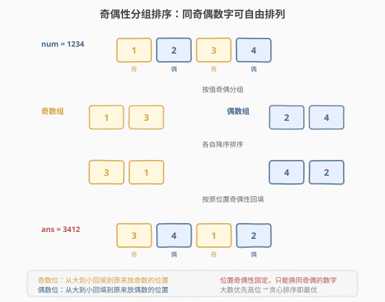
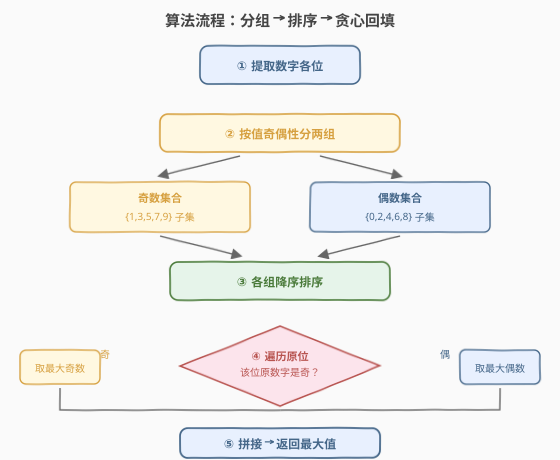
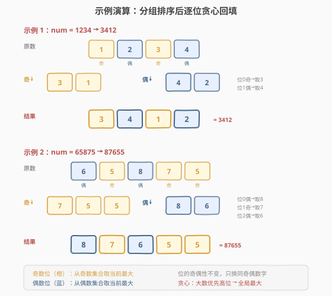

# 按奇偶性交换后的最大数字

- **题目名称**：按奇偶性交换后的最大数字
- **链接**：[2231. 按奇偶性交换后的最大数字](https://leetcode.cn/problems/largest-number-after-digit-swaps-by-parity/)
- **难度**：简单
- **标签**：贪心、排序、数学

## 1. 题目概述

给你一个正整数 `num`。你可以交换 `num` 中**奇偶性相同**的任意两位数字（即，都是奇数或者偶数）。返回交换**任意**次之后 `num` 的**最大**可能值。

**示例 1**：

```text
输入：num = 1234
输出：3412
解释：
  交换数字 3 和数字 1，结果得到 3214。
  交换数字 2 和数字 4，结果得到 3412。
  注意，不能交换数字 4 和数字 1，因为它们奇偶性不同。
```

**示例 2**：

```text
输入：num = 65875
输出：87655
解释：
  交换数字 8 和数字 6，结果得到 85675。
  交换数字 5 和数字 7，结果得到 87655。
```

**约束条件**：

- $1 \le \text{num} \le 10^9$

> 💡 题眼在于「奇偶性相同的任意两位可交换」。这意味着**所有奇数数字之间可以自由排列，所有偶数数字之间也可以自由排列**，但奇数与偶数数字的相对位置（即哪些位放奇数、哪些位放偶数）是固定的——因为奇偶数字不能互换。要使数字最大，只需让高位尽可能大：把同奇偶的数字各自降序排序，再按原位的奇偶性贪心回填即可。

---

## 2. 解题思路

### 2.1 暴力思路：模拟交换

最直观的做法是反复尝试所有同奇偶的数字对，若交换后数字变大就执行交换，直到无法再变大为为止。这本质上是一个**贪心交换**过程：每次找一个能让高位变大的交换。

但这种方法有两个问题：

1. **效率低**：每轮需枚举 $O(d^2)$ 对数字（$d$ 为位数），最坏需 $O(d)$ 轮，总时间 $O(d^3)$。虽然 $d \le 10$ 时可过，但不够优雅。
2. **正确性需要证明**：局部贪心交换能否达到全局最优？需要论证交换操作的「可到达性」——即任意同奇偶排列都能通过两两交换生成。

> ⚠️ 暴力法的核心痛点不是时间复杂度，而是**没有看透题目的结构**：「同奇偶可任意交换」等价于「同奇偶数字可自由排列」，一旦认识到这一点，排序就是天然的最优解。

### 2.2 核心观察：同奇偶数字可自由排列（分组排序贪心）



**观察一：同奇偶数字构成独立的「交换类」**

题目允许交换任意两位**奇偶性相同**的数字。由群论基础可知，**对换（两两交换）能生成全排列**——也就是说，同一奇偶性的数字之间，无论怎样排列都能通过有限次两两交换到达。因此：

- 所有奇数数字可以在它们当前占据的位置集合上**自由排列**；
- 所有偶数数字同样可以在它们当前占据的位置集合上**自由排列**。

**观察二：位的奇偶性是固定的**

由于奇数数字永远不能和偶数数字互换，**哪些位放奇数、哪些位放偶数**这一格局是固定的。我们能调整的只是「奇数位上各个奇数数字的顺序」和「偶数位上各个偶数数字的顺序」。

**观察三：贪心排序即最优**

要让整个数最大，等价于让**高位尽可能大**。对奇数位集合和偶数位集合分别独立考虑：

- 把所有奇数数字**降序排序**，从左到右填入各个奇数位（高位优先取最大）；
- 把所有偶数数字**降序排序**，从左到右填入各个偶数位。

由于两个集合互不干扰（位格局固定），各自局部最优拼接起来就是全局最优——这是**贪心选择性质**的直接体现。

> 💡 **为什么不会相互影响？** 奇数位的填充只消耗奇数数字，偶数位的填充只消耗偶数数字，两者资源独立、约束独立。每个集合内「大数优先高位」是经典的字典序最大化，独立最优即全局最优。

### 2.3 算法流程图



算法步骤总结：

1. **提取各位**：将 `num` 转为数字序列 $s$。
2. **按奇偶分组**：遍历 $s$，奇数数字收集到 `odd`，偶数数字收集到 `even`。
3. **各自降序排序**：`odd` 和 `even` 分别排序（降序）。
4. **贪心回填**：再遍历 $s$ 一次，若当前位原数字为奇，取 `odd` 中当前最大填入；若为偶，取 `even` 中当前最大填入。
5. **拼接返回**：将回填后的数字拼接成整数返回。

### 2.4 示例演算

以示例 1 `num = 1234`（答案 3412）和示例 2 `num = 65875`（答案 87655）逐步演算：



**示例 1 要点**：`1234` → 奇数 `[1,3]` 降序 `[3,1]`，偶数 `[2,4]` 降序 `[4,2]`。位 0 奇→取 3，位 1 偶→取 4，位 2 奇→取 1，位 3 偶→取 2 → `3412`。

**示例 2 要点**：`65875` → 奇数 `[5,7,5]` 降序 `[7,5,5]`，偶数 `[6,8]` 降序 `[8,6]`。位 0 偶→取 8，位 1 奇→取 7，位 2 偶→取 6，位 3 奇→取 5，位 4 奇→取 5 → `87655`。

> 💡 **关键不变量**：回填时每位取自的集合与原位数字奇偶性一致，因此位的奇偶格局不变，结果一定合法（可通过有限次同奇偶交换到达）。

---

## 3. 参考代码

### C++：分组排序 + 贪心回填（$O(d \log d)$ / $O(d)$）

```cpp
class Solution {
public:
    int largestInteger(int num) {
        string s = to_string(num);
        vector<char> odd, even;
        for (char c : s) {
            if ((c - '0') % 2) odd.push_back(c);
            else even.push_back(c);
        }
        sort(odd.rbegin(), odd.rend());
        sort(even.rbegin(), even.rend());
        int oi = 0, ei = 0, ans = 0;
        for (char c : s) {
            if ((c - '0') % 2) {
                ans = ans * 10 + (odd[oi++] - '0');
            } else {
                ans = ans * 10 + (even[ei++] - '0');
            }
        }
        return ans;
    }
};
```

### Python：分组排序 + 贪心回填（$O(d \log d)$ / $O(d)$）

```python
class Solution:
    def largestInteger(self, num: int) -> int:
        s = str(num)
        odd = sorted((c for c in s if int(c) % 2), reverse=True)
        even = sorted((c for c in s if not int(c) % 2), reverse=True)
        oi = ei = 0
        ans = 0
        for c in s:
            if int(c) % 2:
                ans = ans * 10 + int(odd[oi]); oi += 1
            else:
                ans = ans * 10 + int(even[ei]); ei += 1
        return ans
```

### Python：计数排序 $O(d)$ / $O(1)$

```python
class Solution:
    def largestInteger(self, num: int) -> int:
        s = str(num)
        cnt = [0] * 10
        for c in s:
            cnt[int(c)] += 1
        ans = 0
        for c in s:
            d = int(c)
            start = 8 if d % 2 == 0 else 9
            for i in range(start, -1, -2):
                if cnt[i] > 0:
                    cnt[i] -= 1
                    ans = ans * 10 + i
                    break
        return ans
```

> 💡 数字只有 0–9 共 10 种，可用长度 10 的计数数组代替排序：对每个原位，按同奇偶从大到小（奇数从 9 到 1，偶数从 8 到 0，步长 2）找到第一个计数大于 0 的数字取用即可。时间降到 $O(d)$，空间 $O(1)$。

---

## 4. 复杂度分析

| 维度 | 复杂度 | 说明 |
|------|--------|------|
| **时间复杂度** | $O(d \log d)$ | 分组遍历 $O(d)$；两组各自排序 $O(d \log d)$；回填遍历 $O(d)$。计数排序版可降到 $O(d)$ |
| **空间复杂度** | $O(d)$ | 存储奇偶两组数字，最坏各 $d$ 个。计数排序版为 $O(1)$（固定 10 桶） |

> 💡 本题 $d \le 10$（因 $\text{num} \le 10^9$），任意方法都瞬间通过。重点在于**将「可任意交换」转化为「可自由排列」的结构洞察**，而非性能优化。

---

## 5. 扩展：为什么「两两交换」能生成全排列

贪心排序的正确性依赖一个前提：**同奇偶的数字通过有限次两两交换，能到达任意排列**。这是群论中「对称群由对换生成」的结论，直观证明如下：

任意排列 $\pi$ 可分解为若干**轮换**的乘积。而一个长度为 $k$ 的轮换 $(a_1\; a_2\; \dots\; a_k)$ 可写成 $k-1$ 个对换的复合：

$$(a_1\; a_2\; \dots\; a_k) = (a_1\; a_k)(a_1\; a_{k-1}) \cdots (a_1\; a_2)$$

因此任何排列都能由对换生成。回到本题：题目允许交换**任意**两位同奇偶数字（不限相邻），所以同一奇偶类内的任意排列都可达——这正是我们能直接排序的理论保证。

> ⚠️ 若题目限制为「只能交换相邻两位」，则只能生成相邻对换，虽仍能生成全排列（相邻对换也是对称群的生成集），但「排序」的最少交换次数会不同（等于逆序数）。本题不限相邻，排序即最优。

---

## 6. 面试要点

1. **为什么同奇偶数字可以自由排列？**

   - 题目允许交换任意两位同奇偶数字。由「对称群由对换生成」，同一奇偶类内的任意排列都能通过有限次两两交换到达。因此同奇偶数字等价于「可自由排列」，直接排序即可。

2. **为什么不能把奇数放到偶数位？**

   - 奇数与偶数数字奇偶性不同，无法交换，所以一个奇数数字永远停留在某个奇数位上。位的奇偶格局（哪些位是奇数位）由原数决定且不变，我们只能调整同类数字在同类位上的顺序。

3. **为什么分组排序就是全局最优？**

   - 奇数位只消耗奇数数字、偶数位只消耗偶数数字，两组资源与约束相互独立。每组内「大数优先高位」是字典序最大化，独立最优拼接即全局最优——满足贪心选择性质。

4. **如何用 $O(1)$ 空间实现？**

   - 数字只有 0–9，用一个长度 10 的计数数组统计各数字出现次数。回填时按同奇偶从大到小（奇数 9→1，偶数 8→0，步长 2）找首个计数大于 0 的数字取用，计数减一。无需显式分组数组，空间 $O(1)$。

5. **如果题目改为「只能交换一次」呢？**

   - 退化为 [670. 最大交换](https://leetcode.cn/problems/maximum-swap/)：贪心找高位能换到的最大数字交换一次即可。本题是「不限交换次数 + 奇偶约束」的版本，交换次数不受限使得排序成为可能。

> 💡 **一句话总结**：2231 是「奇偶分组 + 排序贪心」的模板题——同奇偶数字可自由排列，各自降序排序后按原位奇偶性回填，$O(d \log d)$ 一趟搞定。

---

## 7. 同类练习题

- [670. 最大交换](https://leetcode.cn/problems/maximum-swap/)：最多交换一次任意两位使数字最大，本题的「单次交换 + 无奇偶限制」对照版，体会交换次数约束对策略的影响
- [179. 最大数](https://leetcode.cn/problems/largest-number/)：排列一组数字使拼接结果最大，贪心排序的另一个经典应用（自定义比较器）
- [321. 拼接最大数](https://leetcode.cn/problems/create-maximum-number/)：从两个数组各取若干位拼成最大数，贪心 + 单调栈进阶，本题「高位优先大数」思想的升级
- [402. 移掉 K 位数字](https://leetcode.cn/problems/remove-k-digits/)：移除 K 位使剩余数字最小，单调栈贪心，对照本题「重排最大化」的「删位最小化」
