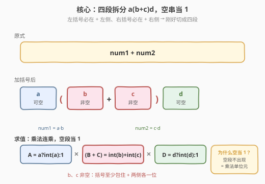
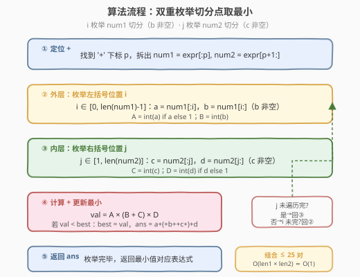
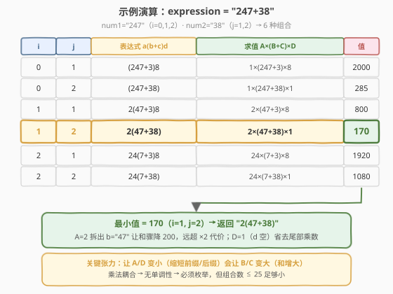

# 向表达式添加括号后的最小结果

- **题目名称**：向表达式添加括号后的最小结果
- **链接**：[2232. 向表达式添加括号后的最小结果](https://leetcode.cn/problems/minimize-result-by-adding-parentheses-to-expression/)
- **难度**：中等
- **标签**：字符串、枚举、数学

## 1. 题目概述

给定下标从 0 开始的字符串 `expression`，格式为 `"<num1>+<num2>"`，其中 `<num1>` 和 `<num2>` 是正整数。请向其中添加**一对括号**，使得：

1. 添加后仍是合法数学表达式；
2. **左括号必须添加在 `'+'` 的左侧**，**右括号必须添加在 `'+'` 的右侧**；
3. 计算后得到**最小**可能值。

返回添加括号后形成的表达式字符串。若有多个答案产生相同最小值，返回任意一个。

**示例 1**：

```text
输入：expression = "247+38"
输出："2(47+38)"
解释：2 * (47 + 38) = 2 * 85 = 170。
注意 "2(4)7+38" 非法，因为右括号必须在 '+' 右侧。170 为最小值。
```

**示例 2**：

```text
输入：expression = "12+34"
输出："1(2+3)4"
解释：1 * (2 + 3) * 4 = 1 * 5 * 4 = 20。
```

**示例 3**：

```text
输入：expression = "999+999"
输出："(999+999)"
解释：999 + 999 = 1998（前后都无额外乘数，相当于 ×1）。
```

**约束条件**：

- $3 \le \text{expression.length} \le 10$
- `expression` 仅由数字 `'1'`–`'9'` 和一个 `'+'` 组成
- 以数字开头和结尾，恰好含一个 `'+'`
- 原始值与任意合法加括号后的值均在 32-bit 带符号整数范围内

> 💡 题眼在于「**括号位置受限**」：左括号只能在 `'+'` 左侧、右括号只能在 `'+'` 右侧。这把整个表达式**刚性切成四段** `a(b+c)d`，问题从「任意加括号」退化为「在两个数字串上各选一个切分点」——搜索空间极小，枚举即可。

---

## 2. 解题思路

### 2.1 暴力思路：枚举所有切分点

设 `'+'` 下标为 $p$，则 $\text{num1} = \text{expr}[0:p]$、$\text{num2} = \text{expr}[p+1:]$。

加一对括号后，表达式必然形如：

$$\text{expr}' = a\,(b+c)\,d$$

其中：

- $\text{num1} = a \cdot b$：左括号落在 $a$ 与 $b$ 之间。**$b$ 非空**（括号至少包住 `'+'` 紧邻左侧的一位），$a$ 可空。
- $\text{num2} = c \cdot d$：右括号落在 $c$ 与 $d$ 之间。**$c$ 非空**（括号至少包住 `'+'` 紧邻右侧的一位），$d$ 可空。

求值规则（**空串当乘法单位元 1**）：

$$\text{val} = A \times (B + C) \times D, \quad A = \begin{cases}\text{int}(a) & a \neq \varepsilon \\ 1 & a = \varepsilon\end{cases}, \quad D = \begin{cases}\text{int}(d) & d \neq \varepsilon \\ 1 & d = \varepsilon\end{cases}$$

$B = \text{int}(b)$、$C = \text{int}(c)$ 始终为正整数（$b,c$ 非空）。

> ⚠️ 注意两个边界：左括号不能贴到 `'+'` 上（$b$ 不能空，否则出现 `num1(+...` 非法）；右括号同理（$c$ 不能空）。但 $a$、$d$ 可以空——此时它们「不出现」，相当于乘以 1。示例 3 的 `(999+999)` 即 $a=d=\varepsilon$。

由于 $\text{expression.length} \le 10$，$\text{num1}$、$\text{num2}$ 各至多约 4–5 位，合法切分点数 $\le 5$，组合数 $\le 25$。**直接双重循环枚举所有 $(i, j)$，计算 $\text{val}$，维护最小值与对应字符串即可。**

### 2.2 核心观察：四段拆分 + 空串当 1



关键转化在于把「加括号」这个动作翻译成**两个独立的切分决策**：

| 段 | 来源 | 是否可空 | 数值 | 角色 |
|----|------|----------|------|------|
| $a$ | num1 前缀 | 可空 | $\text{int}(a)$ 或 $1$ | 外层乘数（左） |
| $b$ | num1 后缀 | **非空** | $\text{int}(b)$ | 括号内加数（左） |
| $c$ | num2 前缀 | **非空** | $\text{int}(c)$ | 括号内加数（右） |
| $b+c$ | — | — | $\text{int}(b)+\text{int}(c)$ | 括号内求和 |
| $d$ | num2 后缀 | 可空 | $\text{int}(d)$ 或 $1$ | 外层乘数（右） |

> 💡 **为什么空段当 1 而不是 0？** 因为空段意味着「该位置没有数字出现」，表达式里直接省略。例如 `(247+38)` 中 $a$ 不出现，整个式子是 $1 \times (247+38) \times 1$——乘法中「什么都不乘」等价于乘以单位元 1，而非 0（否则任何带空段的结果都变 0，显然不符合语义）。

> 💡 **为什么不能贪心？** 直觉上「让 $A$、$D$ 尽量小（取空）」或「让 $B+C$ 尽量小」看似能最小化乘积，但二者**互相拉扯**：缩短 $a$（让 $A$ 更小）会让 $b$ 更长（$B$ 更大，和变大）；缩短 $d$ 会让 $c$ 更长（$C$ 更大）。乘法耦合下目标函数对切分点**不单调**，必须枚举。详见 2.4 示例中 `i=1, j=2` 击败 `i=0` 的反例。

### 2.3 算法流程图



算法分五步：

1. **定位 `'+'`**：找到下标 $p$，拆出 $\text{num1}$、$\text{num2}$。
2. **外层枚举 $i$**：$i \in [0,\, \text{len}(\text{num1})-1]$，$a = \text{num1}[:i]$、$b = \text{num1}[i:]$（保证 $b$ 非空）；算 $A$（空则 1）、$B$。
3. **内层枚举 $j$**：$j \in [1,\, \text{len}(\text{num2})]$，$c = \text{num2}[:j]$、$d = \text{num2}[j:]$（保证 $c$ 非空）；算 $C$、$D$（空则 1）。
4. **计算 + 更新**：$\text{val} = A \times (B + C) \times D$；若 $\text{val} < \text{best}$，更新 $\text{best}$ 与 $\text{ans} = a + \text{"("} + b + \text{"+"} + c + \text{")"} + d$。
5. **返回 $\text{ans}$**。

> 💡 **两层循环的边界是本题最易错点**：外层 $i$ 上界是 $\text{len}-1$（留至少一位给 $b$），内层 $j$ 下界是 $1$（留至少一位给 $c$）。写成 `range(len(num1))` 与 `range(1, len(num2)+1)` 即可天然满足。

### 2.4 示例演算

以示例 1 `expression = "247+38"`（答案 `"2(47+38)"`）为例，$\text{num1}=\text{"247"}$、$\text{num2}=\text{"38"}$，共 $3 \times 2 = 6$ 种组合：



| $i$ | $j$ | 表达式 | 求值 | 结果 |
|-----|-----|--------|------|------|
| 0 | 1 | `(247+3)8` | $1 \times (247+3) \times 8$ | 2000 |
| 0 | 2 | `(247+38)` | $1 \times (247+38) \times 1$ | 285 |
| 1 | 1 | `2(47+3)8` | $2 \times (47+3) \times 8$ | 800 |
| **1** | **2** | **`2(47+38)`** | $2 \times (47+38) \times 1$ | **170** ✓ |
| 2 | 1 | `24(7+3)8` | $24 \times (7+3) \times 8$ | 1920 |
| 2 | 2 | `24(7+38)` | $24 \times (7+38) \times 1$ | 1080 |

最小值 $170$ 出现在 $i=1,\, j=2$，返回 `"2(47+38)"`。

> 💡 **反贪心证据**：$i=0$（$A=1$ 最小）时最佳是 $285$，但 $i=1$（$A=2$）反而更优——因为把 $b$ 从 `"247"` 缩成 `"47"` 让和从 $285$ 降到 $85$，骤降 $200$，远超 $A$ 从 $1$ 翻到 $2$ 的代价。这正是「乘法耦合 → 无单调性 → 必须枚举」的体现。

> 💡 **示例 2 验证**：`"12+34"` 的 4 种组合中，$i=1,j=1$ 即 `1(2+3)4` $= 1 \times 5 \times 4 = 20$ 为最小。$a=\text{"1"}$、$d=\text{"4"}$ 都非空但值为 1 的前缀不增加乘积，同时把和压到最小。

---

## 3. 参考代码

### C++：双重枚举切分点（$O(n^2)$ / $O(n)$）

```cpp
class Solution {
public:
    string minimizeResult(string expression) {
        int plus = expression.find('+');
        string num1 = expression.substr(0, plus);
        string num2 = expression.substr(plus + 1);
        int n1 = num1.size(), n2 = num2.size();

        long long best = LLONG_MAX;
        string ans;
        for (int i = 0; i < n1; i++) {              // b = num1[i:], 非空
            string a = num1.substr(0, i);
            string b = num1.substr(i);
            long long A = a.empty() ? 1 : stoll(a);
            long long B = stoll(b);
            for (int j = 1; j <= n2; j++) {         // c = num2[:j], 非空
                string c = num2.substr(0, j);
                string d = num2.substr(j);
                long long C = stoll(c);
                long long D = d.empty() ? 1 : stoll(d);
                long long val = A * (B + C) * D;
                if (val < best) {
                    best = val;
                    ans = a + "(" + b + "+" + c + ")" + d;
                }
            }
        }
        return ans;
    }
};
```

### Python：双重枚举切分点（$O(n^2)$ / $O(n)$）

```python
class Solution:
    def minimizeResult(self, expression: str) -> str:
        plus = expression.index('+')
        num1 = expression[:plus]
        num2 = expression[plus + 1:]

        best = float('inf')
        ans = ""
        for i in range(len(num1)):                 # b = num1[i:], 非空
            a = num1[:i]
            b = num1[i:]
            A = int(a) if a else 1
            B = int(b)
            for j in range(1, len(num2) + 1):      # c = num2[:j], 非空
                c = num2[:j]
                d = num2[j:]
                C = int(c)
                D = int(d) if d else 1
                val = A * (B + C) * D
                if val < best:
                    best = val
                    ans = f"{a}({b}+{c}){d}"
        return ans
```

> 💡 用 `long long` / `float('inf')` 存 `best` 是稳妥写法。题目保证值在 32-bit 范围内，`int` 也够，但中间乘积 $A \times (B+C) \times D$ 用更宽类型可避免边界担忧。

---

## 4. 复杂度分析

| 维度 | 复杂度 | 说明 |
|------|--------|------|
| **时间复杂度** | $O(n^2)$，实际 $O(1)$ | 双重循环枚举切分点：外层 $\le \text{len}(\text{num1})$、内层 $\le \text{len}(\text{num2})$，组合 $\le 25$；每组 $O(n)$ 切串/转整数。因 $\text{expression.length} \le 10$，整体视为 $O(1)$ |
| **空间复杂度** | $O(n)$ | 存 $\text{num1}$、$\text{num2}$ 及答案串的临时子串，与输入长度同阶 |

> 💡 本题数据规模极小（$n \le 10$），任何多项式复杂度都能秒过。重点不在优化速度，而在**正确建模四段结构与空串当 1 的规则**。

---

## 5. 扩展：无前导零简化与解耦视角

### 5.1 为什么不用担心前导零？

题目限定 `expression` 仅含数字 `'1'`–`'9'`（**没有 `'0'`**），因此任意子串都是无前导零的合法正整数，`int("047")` 这类歧义不存在。若题目放宽允许 `'0'`，则需额外跳过「长度 > 1 且首位为 `'0'`」的非法切分（例如 `"10+20"` 中 $b=\text{"0"}$ 合法但 $b=\text{"02"}$ 非法）——这是本类枚举题常见的升级点。

### 5.2 解耦视角：固定 $i$ 后内层独立搜索

目标 $\text{val} = A \times (B + C) \times D$。固定外层 $i$ 后 $A$、$B$ 为常数，内层只需最小化：

$$\min_{j}\; (B + C(j)) \times D(j)$$

这是一个对 $j$ 的一维搜索。随 $j$ 增大，$C(j)$（num2 前缀）单调增大、$D(j)$（num2 后缀）单调减小（可能跳到 1），乘积**非单调**，故仍需线性扫描 $j$。两层合起来仍是 $O(\text{len1} \times \text{len2})$，与朴素枚举同阶——但这个视角说明了「外层与内层的选择空间是独立枚举的，只是目标函数把两者耦合」。

### 5.3 一行 Python 写法（ itertools.product ）

若偏好函数式风格，可用 `product` 把双重循环拍平：

```python
from itertools import product

class Solution:
    def minimizeResult(self, expression: str) -> str:
        p = expression.index('+')
        n1, n2 = expression[:p], expression[p + 1:]
        def val(i, j):
            a, b = n1[:i], n1[i:]
            c, d = n2[:j], n2[j:]
            return (int(a) if a else 1) * (int(b) + int(c)) * (int(d) if d else 1)
        i, j = min(product(range(len(n1)), range(1, len(n2) + 1)), key=lambda t: val(*t))
        return f"{n1[:i]}({n1[i:]}+{n2[:j]}){n2[j:]}"
```

语义与双重循环完全一致，`min` 配 `key` 直接取最优切分点。

> 💡 面试中推荐写出 2.1 节的朴素双重循环版——清晰、易讲、不易错；函数式写法作为「简洁性」补充提及即可。

---

## 6. 面试要点

1. **括号位置的约束如何转化为切分？**

   - 左括号在 `'+'` 左侧 → 把 num1 切成 $a \cdot b$；右括号在 `'+'` 右侧 → 把 num2 切成 $c \cdot d$。表达式形如 $a(b+c)d$。$b$、$c$ 必须非空（括号至少包住 `'+'` 两侧各一位），$a$、$d$ 可空。

2. **为什么空段当 1 而不是 0？**

   - 空段表示「该位置不出现数字」，在乘法表达式中直接省略。乘法单位元是 1，故空段等价于乘以 1。若当 0，任何含空段的结果都归零，与示例 3 的 `(999+999) = 1998` 矛盾。

3. **为什么不能用贪心（让 $A$、$D$ 尽量小）？**

   - 目标 $A \times (B+C) \times D$ 中，缩短 $a$ 让 $A$ 减小但 $b$ 变长使 $B$ 增大，缩短 $d$ 让 $D$ 减小但 $c$ 变长使 $C$ 增大。乘法耦合下目标对切分点不单调——示例 1 中 $A=2$ 反而比 $A=1$ 更优（和骤降 200 远超翻倍代价）。故必须枚举。

4. **双重循环的边界为什么是 `range(len(num1))` 和 `range(1, len(num2)+1)`？**

   - 外层 $i$ 是 $b$ 的起始下标，$b = \text{num1}[i:]$ 非空要求 $i \le \text{len}-1$，`range(len(num1))` 给 $0 \dots \text{len}-1$ 恰好满足。内层 $j$ 是 $c$ 的结束下标，$c = \text{num2}[:j]$ 非空要求 $j \ge 1$，`range(1, len(num2)+1)` 给 $1 \dots \text{len}$ 恰好满足。$i=0$ 使 $a$ 空、$j=\text{len}$ 使 $d$ 空，均合法。

5. **数据范围对解法选择的影响？**

   - $n \le 10$ 使组合数 $\le 25$，任何 $O(n^2)$ 甚至 $O(n^3)$ 都瞬过。本题考点不在复杂度优化，而在正确识别四段结构、空串当 1 规则、以及 $b/c$ 非空的边界——把这些讲清比追求更优复杂度更重要。

> 💡 **一句话总结**：2232 是「受限加括号 → 四段拆分 $a(b+c)d$ → 空串当 1 → 双重枚举切分点取最小」的枚举模板题；乘法耦合使贪心失效，但 $n \le 10$ 让枚举天然最优，难点全在建模与边界。

---

## 7. 同类练习题

- [224. 基本计算器](../0201-0300/224_基本计算器.md)（[题解](../0201-0300/224_基本计算器.md)）：含括号的字符串求值，栈处理一元符号与括号，本题「加括号改变求值」的对照题
- [282. 表达式得到目标值](https://leetcode.cn/problems/expression-add-operators/)：在数字间插入 `+-*` 使表达式等于目标值，回溯枚举运算符，本题「在固定 `+` 上加括号」的进阶版
- [8. 字符串转换整数 (atoi)](../0001-0100/8_字符串转换整数atoi.md)（[题解](../0001-0100/8_字符串转换整数atoi.md)）：字符串转整数的边界处理，本题 `int(substring)` 的基础能力
- [93. 复原 IP 地址](../0001-0100/93_复原IP地址.md)（[题解](../0001-0100/93_复原IP地址.md)）：在字符串上枚举切分点 + 分段合法性校验，与本题「双重枚举切分」同构
- [131. 分割回文串](../0001-0100/131_分割回文串.md)（[题解](../0001-0100/131_分割回文串.md)）：在串上枚举所有切分并校验段性质，回溯枚举切分点的母题
