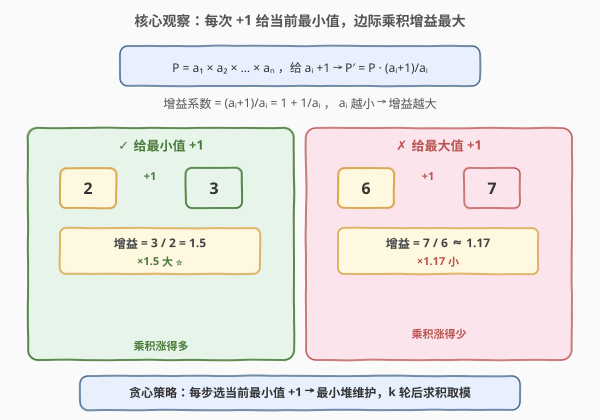
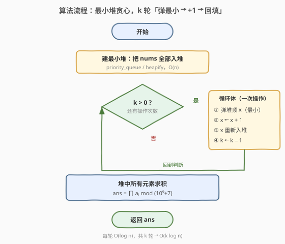

# K 次增加后的最大乘积

- **题目名称**：K 次增加后的最大乘积
- **链接**：[2233. K 次增加后的最大乘积](https://leetcode.cn/problems/maximum-product-after-k-increments/)
- **难度**：中等
- **标签**：贪心、堆（优先队列）

## 1. 题目概述

给定非负整数数组 `nums` 和整数 `k`。每次操作可任选 `nums` 中**任一**元素并将其 **+1**。问**至多** $k$ 次操作后，能得到的 `nums` 的**最大乘积**。答案对 $10^9 + 7$ 取余后返回。

**示例 1**：

```text
输入：nums = [0,4], k = 5
输出：20
解释：把第一个数 +1 五次 → [5, 4]，乘积 5 * 4 = 20。
```

**示例 2**：

```text
输入：nums = [6,3,3,2], k = 2
输出：216
解释：第二个数 +1、第四个数 +1 → [6, 4, 3, 3]，乘积 6 * 4 * 3 * 3 = 216。
```

**约束条件**：

- $1 \le \text{nums.length},\ k \le 10^5$
- $0 \le \text{nums}[i] \le 10^6$

> 💡 **题眼**：每次 +1 只能投给一个元素，要最大化「整体乘积」。直觉上应把增量投到「最弱」的元素——因为乘积对每个元素的「相对增长率」取决于该元素自身大小，越小加 1 收益越大。这指向一个贪心：**每次给当前最小值 +1**。

---

## 2. 解题思路

### 2.1 暴力思路：枚举分配方案

最朴素的想法是枚举 $k$ 次操作的所有分配方式（每个元素分到几次 +1），算乘积取最大。但分配方案数是「将 $k$ 个不可区分增量分到 $n$ 个元素」的组合数 $\binom{k+n-1}{n-1}$，$k, n$ 都到 $10^5$ 时是天文数字，完全不可行。

> ⚠️ 暴力枚举在方案数上不可行，必须找到「每一步的最优局部选择」。

### 2.2 核心观察：贪心——每次给最小值 +1



设当前乘积 $P = \prod_i a_i$。若把某元素 $a_i$ 加 1，新乘积为：

$$P' = P \cdot \frac{a_i + 1}{a_i} = P \cdot \left(1 + \frac{1}{a_i}\right)$$

**关键洞察**：乘积的相对增益系数是 $1 + \frac{1}{a_i}$，它**只取决于被加元素 $a_i$ 的大小**，且 $a_i$ 越小增益越大：

- $a_i = 2$：增益 $\frac{3}{2} = 1.5$（大）；
- $a_i = 6$：增益 $\frac{7}{6} \approx 1.17$（小）；
- $a_i = 0$：当前乘积为 0，加到 1 使乘积「从 0 变正」，增益可视作无穷大——**必须最先消除 0**。

因此**每一步的最优选择都是「当前最小值」**，贪心成立。这背后也是 AM-GM 不等式的体现：在总增量固定时，数列越「均衡」乘积越大，而反复给最小值 +1 正是把数列拉向均衡的过程。

**用最小堆维护**：每次取出堆顶（最小值）、+1、再放回，重复 $k$ 次。堆顶始终是当前最该被加的元素。

> 💡 **为何贪心全局最优**：每步的增益系数 $1 + 1/a_i$ 只依赖当前 $a_i$，与其它元素无关，且关于 $a_i$ 单调递减。这是典型的「可分解 + 边际递减」结构——逐步贪心等价于把所有增量按增益从大到小排序后依次发放，自然全局最优（交换论证：任何把某次 +1 从更小元素挪到更大元素的方案，都会使乘积变小）。

### 2.3 算法流程图



1. 把 `nums` 全部装入最小堆；
2. 重复 $k$ 次：弹出堆顶 $x$，令 $x \gets x+1$，重新入堆；
3. 堆中所有元素求积，对 $10^9+7$ 取余返回。

### 2.4 示例演算

![示例演算：[6,3,3,2] k=2 逐步给最小值 +1，最终乘积 216](../images/mpki_example_walkthrough.svg)

以 `nums = [6,3,3,2]`, `k = 2` 展开（堆按升序示意）：

| 步骤 | 堆（升序示意） | 操作 | k 剩余 |
|------|---------------|------|--------|
| 初始 | 2, 3, 3, 6 | — | 2 |
| 第 1 步 | 3, 3, 3, 6 | 弹 2 → 3 回填 | 1 |
| 第 2 步 | 3, 3, 4, 6 | 弹 3 → 4 回填 | 0 |

停止后乘积 $= 3 \times 3 \times 4 \times 6 = 216$ ✓

> 💡 注意第 2 步弹的是「其中一个 3」而非 6——给 3 加到 4 的增益 $\frac{4}{3}\approx 1.33$，远大于给 6 加到 7 的 $\frac{7}{6}\approx 1.17$。贪心始终挑最小。

---

## 3. 参考代码

### C++

```cpp
class Solution {
  public:
    int maximumProduct(vector<int>& nums, int k) {
        priority_queue<int, vector<int>, greater<int>> pq(nums.begin(), nums.end());
        while (k--) {
            int x = pq.top();
            pq.pop();
            pq.push(x + 1);
        }
        long long ans = 1, MOD = 1e9 + 7;
        while (!pq.empty()) {
            ans = (ans * pq.top()) % MOD;
            pq.pop();
        }
        return (int)ans;
    }
};
```

> 💡 用 `greater<int>` 得到最小堆；`priority_queue` 的迭代器构造直接建堆，$O(n)$。元素值最大 $10^6 + 10^5$，远小于 `int` 上限，故堆中存真值即可；只有最终乘积会爆，累乘时用 `long long` 中转并取模。

### Python

```python
import heapq


class Solution:
    def maximumProduct(self, nums: list[int], k: int) -> int:
        heapq.heapify(nums)
        for _ in range(k):
            x = heapq.heappop(nums)
            heapq.heappush(nums, x + 1)
        MOD = 10**9 + 7
        ans = 1
        for x in nums:
            ans = (ans * x) % MOD
        return ans
```

> 💡 `heapq.heapify` 原地建堆 $O(n)$。Python 大整数天然不溢出，但每步取模可控制数值大小、加速后续乘法。

---

## 4. 复杂度分析

| 维度 | 复杂度 | 说明 |
|------|--------|------|
| 建堆 | $O(n)$ | 一次性把 `nums` 装入最小堆 |
| 操作循环 | $O(k \log n)$ | 每轮弹/压各 $O(\log n)$，共 $k$ 轮；$n,k \le 10^5$ → 约 $1.7\times10^6$ |
| 求积 | $O(n)$ | 遍历堆中 $n$ 个元素边乘边模 |
| 空间 | $O(n)$ | 最小堆存全部元素 |

> 💡 $k \log n \approx 10^5 \times 17 \approx 1.7\times10^6$，远在时限内。瓶颈是操作循环而非求积。

---

## 5. 扩展：当 k 极大时——「水位填充」批量加速

本题 $k \le 10^5$，最小堆已足够。若把 $k$ 放大到 $10^9$，逐次 +1 会超时，需改用 **「水位填充」批量推进**：

1. **排序** `nums` 升序；
2. 维护「当前水位 `level`」与「已抬升的元素数 `cnt`」。从左到右扫描，尝试把前 `cnt+1` 个相等的最低元素整体抬到下一个更高元素的值，所需增量 $= (\text{next} - \text{level}) \times (\text{cnt}+1)$：
   - 若 $k$ 够，扣除并抬升水位、扩大 `cnt`；
   - 若 $k$ 不够，部分填充：水位升 $\lfloor k / (\text{cnt}+1) \rfloor$，前 $k \bmod (\text{cnt}+1)$ 个再多分 1。
3. 剩余 $k$ 在所有「已均衡」元素间均摊（同样按商 + 余分配）。

整体 $O(n \log n)$（排序），与 $k$ 无关。核心仍是「把增量投给最低者」，只是从「逐次」升级为「按层批量」，本质贪心不变。

> 💡 这与 [875. 爱吃香蕉的珂珂](https://leetcode.cn/problems/koko-eating-bananas/)、[1011. 在 D 天内送达包裹的能力](https://leetcode.cn/problems/capacity-to-ship-packages-within-d-days/) 同属「单次太慢 → 批量/二分加速」的优化思路。

---

## 6. 面试要点

1. **为什么每次给最小值 +1 是最优的？**

   - 给 $a_i$ 加 1，乘积变为 $P \cdot (1 + 1/a_i)$，相对增益 $1 + 1/a_i$ 随 $a_i$ 减小而增大。故每步选最小 $a_i$ 收益最大；且增益只依赖 $a_i$ 本身、单调递减，逐步贪心即全局最优（交换论证保证）。

2. **遇到 0 怎么办？**

   - 0 在堆中自然是最小值，会被优先 +1 消除。乘积含 0 时整体为 0，必须先抬离 0 才有意义，贪心天然优先处理。

3. **为什么取模只在最后求积时做，建堆/操作时不做？**

   - 堆中存的是「元素真值」，比较大小必须用真值（取模会破坏顺序）。元素最大 $10^6 + 10^5$ 远小于 `int` 上限，无需取模；只有最终乘积会爆，故只在累乘时取模。

4. **贪心和 AM-GM 有什么联系？**

   - AM-GM 告诉我们「总和固定时，各数越均衡乘积越大」。给最小值反复 +1 正是把数列拉向均衡，二者结论一致；但贪心从「边际增益」出发更直接，且适用于增量离散投入的场景。

5. **复杂度瓶颈在哪？能否优化？**

   - 瓶颈是 $k$ 轮堆操作 $O(k \log n)$。$k \le 10^5$ 足够；$k$ 极大时改用「水位填充」批量抬升，降到 $O(n \log n)$，见第 5 节。

---

## 7. 同类练习题

- [2208. 将数组和减半的最少操作次数](https://leetcode.cn/problems/minimum-operations-to-halve-array-sum/)（[题解](../2201-2300/2208_将数组和减半的最少操作次数.md)）：最大堆反复取最大折半直到总和减半，与本题同模板（堆 + 多轮贪心），互为「计数操作数 / 给定操作数求最值」的镜像
- [2530. 执行 K 次操作后的最大分数](https://leetcode.cn/problems/maximal-score-after-applying-k-operations/)：每次取最大值并替换为 $\lceil x/3 \rceil$，结构镜像本题（取最大 vs 取最小），同为「堆 + $k$ 轮贪心」
- [1962. 移除石子使总数最小](https://leetcode.cn/problems/remove-stones-to-minimize-the-total/)（[题解](../1901-2000/1962_移除石子使总数最小.md)）：每次取最大石堆移除 $\lfloor p/2 \rfloor$，与本题同模板（最大堆 + $k$ 轮 + 求和/求积），练手堆贪心
- [875. 爱吃香蕉的珂珂](https://leetcode.cn/problems/koko-eating-bananas/)（[题解](../0801-0900/875_爱吃香蕉的珂珂.md)）：二分答案 + 贪心验证，承接第 5 节「逐次太慢 → 批量/二分加速」的优化范式
