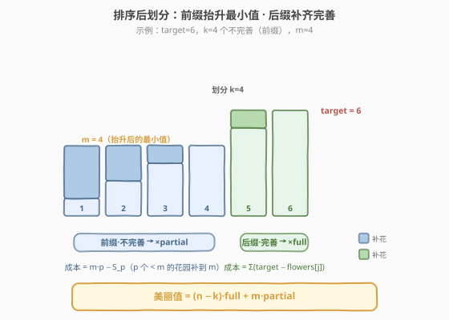
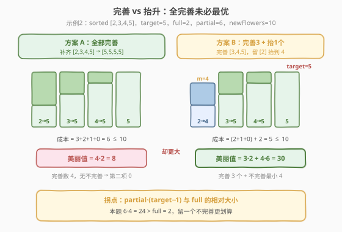
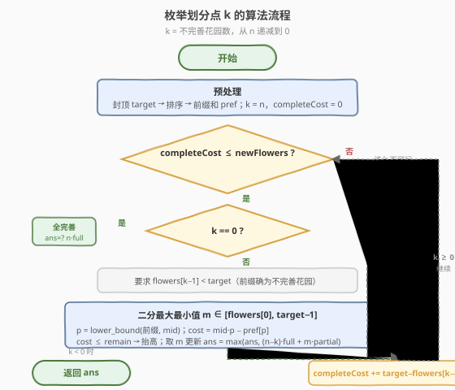
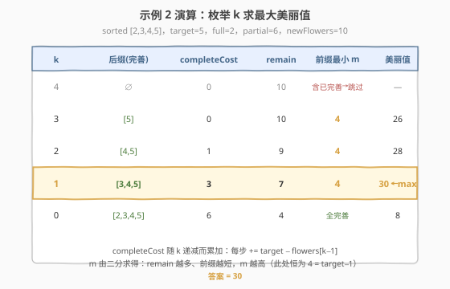

# 花园的最大总美丽值

- **题目名称**：花园的最大总美丽值
- **链接**：[2234. 花园的最大总美丽值](https://leetcode.cn/problems/maximum-total-beauty-of-the-gardens/)
- **难度**：困难
- **标签**：贪心、数组、二分查找、前缀和、排序

## 1. 题目概述

Alice 有 $n$ 个花园，`flowers[i]` 是第 $i$ 个花园**已有**的花数（已种的花不能移走）。她最多可再种 `newFlowers` 朵花，分发给任意花园。给定 `target`、`full`、`partial`：

- 若某花园花数 $\geq \text{target}$，称为**完善**；
- **总美丽值** $=$ (完善花园数目) $\times \text{full}$ $+$ (不完善花园中花数的**最小值**) $\times \text{partial}$；无不完善花园时第二项为 $0$。

求种最多 `newFlowers` 朵花后能得到的**最大**总美丽值。

**示例 1**：

```text
输入：flowers = [1,3,1,1], newFlowers = 7, target = 6, full = 12, partial = 1
输出：14
解释：种成 [3,6,2,2]（共种 7 朵）。完善 1 个，不完善最小为 2，
      美丽值 = 1×12 + 2×1 = 14。
```

**示例 2**：

```text
输入：flowers = [2,4,5,3], newFlowers = 10, target = 5, full = 2, partial = 6
输出：30
解释：种成 [5,4,5,5]（共种 5 朵）。完善 3 个，不完善最小为 4，
      美丽值 = 3×2 + 4×6 = 30。
      注意：让所有花园都完善反而美丽值更小（= 8）。
```

**约束条件**：

- $1 \leq n \leq 10^5$
- $1 \leq \text{flowers}[i],\ \text{target} \leq 10^5$
- $1 \leq \text{newFlowers} \leq 10^{10}$
- $1 \leq \text{full},\ \text{partial} \leq 10^5$

> 💡 **关键张力**：完善一个花园贡献 $\text{full}$（与花数无关，补到 $\text{target}$ 即可），不完善花园只看**最小值**乘 $\text{partial}$。于是种花有两种用途——①把某些花园补到 $\text{target}$ 使其完善；②抬高不完善花园的最小值。两者争夺有限的 `newFlowers`，必须统筹权衡，这正是本题"困难"之处。

---

## 2. 解题思路

### 2.1 暴力思路

朴素地枚举"完善哪些花园"（$2^n$ 个子集），再在每个子集下把剩余花朵分给不完善花园以抬高最小值——组合爆炸，$n \leq 10^5$ 完全不可行。需要利用结构把搜索空间降到 $O(n)$ 个候选。

### 2.2 核心观察：排序 + 前后缀划分 + 二分抬升

#### 观察一：完善集是排序后的"后缀"

把 `flowers` **升序排序**后，存在最优解使"完善花园"恰为排序数组的**后缀**（花数最大的那些，补齐成本最低），不完善花园为**前缀**。

> **交换论证**：设某最优解中 $a$ 完善而 $b$ 不完善，且 $\text{flowers}[a] \leq \text{flowers}[b]$（$a$ 排在 $b$ 前）。把 $b$ 改为完善、$a$ 改为不完善并抬到同一最小值 $m$，完善数与最小值都不变。成本变化
> $$\Delta = (\text{flowers}[a]-\text{flowers}[b]) + \max(0,m-\text{flowers}[a]) - \max(0,m-\text{flowers}[b])$$
> 按 $m$ 与 $a,b$ 大小分三种情况均得 $\Delta \leq 0$（$m \leq a$ 时 $= \text{flowers}[a]-\text{flowers}[b] < 0$；$a < m \leq b$ 时 $= m-\text{flowers}[b] \leq 0$；$a < b < m$ 时 $= 0$）。故总可把"完善者"换成更大者而不变差，反复交换即得后缀结构。

#### 观察二：抬升最小值的成本可 $O(1)$ 计算

前缀 `flowers[0..k-1]` 要把最小值抬到 $m$，只需把所有 $< m$ 的花园补到 $m$（$\geq m$ 的无需动，因为最小值由最小的决定，抬高单个高于 $m$ 的花园无收益）。设前缀中小于 $m$ 的有 $p$ 个、和为 $S_p$，则

$$\text{cost}(m) = m \cdot p - S_p$$

排序后用 `lower_bound` 定位 $p$（前缀中首个 $\geq m$ 的下标），前缀和数组 $O(1)$ 取 $S_p$。$m$ 的上界为 $\text{target}-1$——达到 $\text{target}$ 即变完善，那已由更小的 $k$ 覆盖。

#### 观察三：枚举划分点 $k$，递推后缀成本

设 $k$ = 不完善花园数（前缀大小），完善数 $= n-k$。补齐后缀 `flowers[k..n-1]` 到 $\text{target}$ 的成本

$$\text{completeCost}(k) = \sum_{j=k}^{n-1}(\text{target} - \text{flowers}[j])$$

若 $\text{completeCost}(k) \leq \text{newFlowers}$，则剩余 $\text{remain} = \text{newFlowers} - \text{completeCost}(k)$ 全用于抬升前缀最小值，**二分**求最大 $m$，更新

$$\text{ans} = \max\big(\text{ans},\ (n-k)\cdot\text{full} + m\cdot\text{partial}\big)$$

让 $k$ 从 $n$ 递减到 $0$，$\text{completeCost}$ 每步累加 $\text{target}-\text{flowers}[k-1]$（花园 $k-1$ 从前缀移入后缀），$O(1)$ 递推。



> ⚠️ **两个边界**：(1) 已有 $\geq \text{target}$ 的花园天然完善、成本 $0$——把所有 $\text{flowers}[i]$ **封顶**为 $\text{target}$ 再排序，它们自动落到后缀且补齐成本为 $0$；(2) 前缀必须全是"不完善"花园，故仅当 $\text{flowers}[k-1] < \text{target}$ 时才更新答案（否则前缀混入已完善花园，无效）。

### 2.3 权衡：完善 vs 抬升

完善一个花园净赚 $\text{full}$（花数从 $v$ 补到 $\text{target}$）；抬升最小值每多 1 朵花赚 $\text{partial}$（直到 $\text{target}-1$）。当 $\text{partial}$ 较大时，"留一个不完善并尽量抬高其最小值"可能优于"全完善"。



> 💡 **拐点判据**：比较 $\text{partial}\cdot(\text{target}-1)$ 与 $\text{full}$。示例 2 中 $6 \times 4 = 24 \gg \text{full}=2$，所以把最后一个花园留作不完善、抬到 $4$，比再补完善多赚 $24 - 2 = 22$。算法枚举所有 $k$ 自然覆盖这个拐点，无需额外判断。

### 2.4 算法流程图



### 2.5 示例演算

以示例 2 为例：排序封顶后 `flowers = [2,3,4,5]`，$\text{target}=5$，$\text{full}=2$，$\text{partial}=6$，$\text{newFlowers}=10$，$n=4$。前缀和 $\text{pref}=[0,2,5,9,14]$。



| $k$ | 后缀（完善） | $\text{completeCost}$ | $\text{remain}$ | 前缀最小 $m$ | 美丽值 |
|----:|:---|---:|---:|:---:|---:|
| 4 | $\varnothing$ | 0 | 10 | —（前缀含已完善，跳过） | — |
| 3 | $[5]$ | 0 | 10 | 4 | $1{\cdot}2+4{\cdot}6=26$ |
| 2 | $[4,5]$ | 1 | 9 | 4 | $2{\cdot}2+4{\cdot}6=28$ |
| 1 | $[3,4,5]$ | 3 | 7 | **4** | $3{\cdot}2+4{\cdot}6=\mathbf{30}$ |
| 0 | $[2,3,4,5]$ | 6 | 4 | —（全完善） | $4{\cdot}2=8$ |

> 💡 **读表**：$k$ 从 $n$ 往 $0$ 走，$\text{completeCost}$ 单调累加；$\text{remain}$ 随之递减但前缀也变短，故 $m$ 整体**非降**（此处受 $\text{target}-1=4$ 上界限制恒为 $4$）。$k=1$ 时完善 $3$ 个、留 $1$ 个抬到 $4$，取得最大 $30$。

---

## 3. 参考代码

### C++

```cpp
class Solution {
public:
    long long maximumBeauty(vector<int>& flowers, long long newFlowers,
                            int target, int full, int partial) {
        int n = flowers.size();
        for (int i = 0; i < n; ++i)
            if (flowers[i] > target) flowers[i] = target;   // 已完善花园封顶，补齐成本为 0
        sort(flowers.begin(), flowers.end());

        vector<long long> pref(n + 1, 0);
        for (int i = 0; i < n; ++i) pref[i + 1] = pref[i] + flowers[i];

        // 在前缀 flowers[0..k-1] 上用 remain 朵花把最小值尽量抬高（最高到 target-1）
        auto maxMin = [&](int k, long long remain) -> long long {
            long long lo = flowers[0], hi = target - 1;
            if (lo >= hi) return lo;                         // target=1 或最小值已到 target-1
            while (lo < hi) {
                long long mid = (lo + hi + 1) / 2;
                int p = lower_bound(flowers.begin(), flowers.begin() + k,
                                    (int)mid) - flowers.begin();   // 前缀中 < mid 的个数
                long long cost = mid * p - pref[p];               // 把这 p 个补到 mid
                if (cost <= remain) lo = mid;
                else hi = mid - 1;
            }
            return lo;
        };

        long long ans = 0;
        long long completeCost = 0;                          // 补齐后缀 flowers[k..n-1] 的成本
        for (int k = n; k >= 0; --k) {                       // k = 不完善（前缀）花园数
            if (completeCost <= newFlowers) {
                if (k == 0) {
                    ans = max(ans, (long long)n * full);     // 全部完善
                } else if (flowers[k - 1] < target) {        // 前缀确为不完善花园
                    long long m = maxMin(k, newFlowers - completeCost);
                    ans = max(ans, (long long)(n - k) * full + m * partial);
                }
            }
            if (k > 0)
                completeCost += (target - flowers[k - 1]);   // 花园 k-1 移入后缀，补齐成本入账
        }
        return ans;
    }
};
```

### Python

```python
import bisect

class Solution:
    def maximumBeauty(self, flowers: List[int], newFlowers: int,
                      target: int, full: int, partial: int) -> int:
        n = len(flowers)
        flowers = sorted(min(v, target) for v in flowers)
        pref = [0] * (n + 1)
        for i in range(n):
            pref[i + 1] = pref[i] + flowers[i]

        def max_min(k: int, remain: int) -> int:
            lo, hi = flowers[0], target - 1
            if lo >= hi:
                return lo
            while lo < hi:
                mid = (lo + hi + 1) // 2
                p = bisect.bisect_left(flowers, mid, 0, k)   # 前缀中 < mid 的个数
                if mid * p - pref[p] <= remain:
                    lo = mid
                else:
                    hi = mid - 1
            return lo

        ans = 0
        complete_cost = 0
        for k in range(n, -1, -1):
            if complete_cost <= newFlowers:
                if k == 0:
                    ans = max(ans, n * full)
                elif flowers[k - 1] < target:
                    m = max_min(k, newFlowers - complete_cost)
                    ans = max(ans, (n - k) * full + m * partial)
            if k > 0:
                complete_cost += target - flowers[k - 1]
        return ans
```

> 💡 **工程细节**：`newFlowers` 与 $\text{completeCost}$ 可达 $n\cdot\text{target}\approx 10^{10}$，美丽值可达 $n\cdot\text{full}+\text{target}\cdot\text{partial}\approx 2\times10^{10}$，C++ 一律用 `long long`；`lower_bound` 限定在前缀区间 `[begin, begin+k)` 内，返回的 $p\in[0,k]$ 天然把"前缀全 $<m$"归为 $p=k$，无需特判越界。

---

## 4. 复杂度分析

| 维度 | 复杂度 | 说明 |
|------|--------|------|
| 时间复杂度 | $O(n\log n + n\log\text{target})$ | 排序 $O(n\log n)$；枚举 $n+1$ 个 $k$，每个二分 $m$ 在 $[\text{flowers}[0],\text{target}-1]$ 上 $O(\log\text{target})$，`lower_bound` $O(\log n)$ 取较大者 |
| 空间复杂度 | $O(n)$ | 前缀和数组 $\text{pref}$ |

> ⚠️ $n\le10^5$、$\text{target}\le10^5$，总量约 $10^5 \times 17 \approx 1.7\times10^6$ 次操作，远在时限内。若需更快可用第 5 节的双指针降到 $O(n\log n)$。

---

## 5. 扩展：双指针优化到 $O(n\log n)$

观察单调性：$k$ 从 $n$ 递减到 $0$ 时，$\text{completeCost}$ 递减 ⇒ $\text{remain}$ 递增，且前缀变短 ⇒ 抬升同一 $m$ 更便宜。两者同向作用，使最大可达 $m$ 随 $k$ 递减**非降**。于是不必每个 $k$ 重新二分，用一个只升不降的指针 `mPtr` 维护当前 $m$：

- 随着 $k$ 减小，尝试把 `mPtr` 往上推，用前缀和 $O(1)$ 验证 $\text{cost}(\text{mPtr}) \le \text{remain}$；
- `mPtr` 全程最多扫过 $[\text{flowers}[0],\text{target}-1]$ 一次，均摊 $O(1)$。

总时间降为排序 $O(n\log n)$ + 单层扫描 $O(n)$。思路与"二分答案 + 双指针计数"（如 [719](../0701-0800/719_找出第K小的数对距离.md)）同源：利用单调性把内层二分换成摊还 $O(1)$ 的指针。本题主解法用二分更易讲清 correctness，双指针作为常数优化备选。

---

## 6. 面试要点

1. **为什么完善集一定是后缀？**
   - 用交换论证：把"完善的小值花园"与"不完善的大值花园"互换角色，完善数与最小值不变，补齐成本不增（按 $m$ 与两值关系分三段证 $\Delta\le0$）。反复交换即得后缀。这是把 $2^n$ 子集搜索压成 $O(n)$ 个划分点的关键。

2. **抬升最小值为什么只需补"低于 $m$ 的花园"，且 $m$ 上界是 $\text{target}-1$？**
   - 最小值由最小的花园决定，抬高任何 $\geq m$ 的花园都不提升最小值（浪费）。$m$ 到 $\text{target}$ 则该花园变完善，归入更小的 $k$，故对固定 $k$，$m\le\text{target}-1$。

3. **$m$ 的成本公式 $m\cdot p - S_p$ 怎么来的？**
   - $p$ 个低于 $m$ 的花园各补到 $m$，总补量 $= \sum(m-\text{val}) = m\cdot p - \sum\text{val}$。排序 + 前缀和 + `lower_bound` 三件套 $O(\log n)$ 定位 $p$ 与 $S_p$。

4. **为什么 $k$ 从 $n$ 往 $0$ 走、$\text{completeCost}$ 递推累加？**
   - $k$ 减一时花园 $k-1$ 从前缀移入后缀，$\text{completeCost} \mathrel{+}= \text{target}-\text{flowers}[k-1]$，$O(1)$ 更新，避免每次重算后缀和。

5. **何时"不全完善"更优？判据是什么？**
   - 比较 $\text{partial}\cdot(\text{target}-1)$ 与 $\text{full}$：前者是把一个花园从不完善抬满（到 $\text{target}-1$）的潜在收益，后者是完善它的收益。前者大时倾向留不完善。算法枚举全部 $k$ 自动覆盖拐点，无需手写判据。

---

## 7. 同类练习题

- [410. 分割数组的最大值](https://leetcode.cn/problems/split-array-largest-sum/)（[题解](../0401-0500/410_分割数组的最大值.md)）：同样"枚举划分点 + 前缀和验证"的范式，对照"二分答案"与"枚举 $k$"两种切法
- [719. 找出第 K 小的数对距离](https://leetcode.cn/problems/find-k-th-smallest-pair-distance/)（[题解](../0701-0800/719_找出第K小的数对距离.md)）：二分答案 + 双指针计数，承接本题第 5 节单调性指针优化思想
- [2141. 按照给定数字构造最大的运行时间](https://leetcode.cn/problems/maximum-running-time-of-n-computers/)：排序 + 贪心分配 + 二分判定最大值的同类"资源分配最优化"问题
- [1011. 在 D 天内送达包裹的能力](https://leetcode.cn/problems/capacity-to-ship-packages-within-d-days/)（[题解](../1001-1100/1011_在D天内送达包裹的能力.md)）：二分答案 + 贪心验证，对照"单目标二分"与本题"枚举 $k$ 求双项目标"的区别
- [1833. 雪糕的最大数量](https://leetcode.cn/problems/maximum-ice-cream-bars/)：排序 + 贪心购买最值，本题"补齐成本最低者优先"思想的简化版
