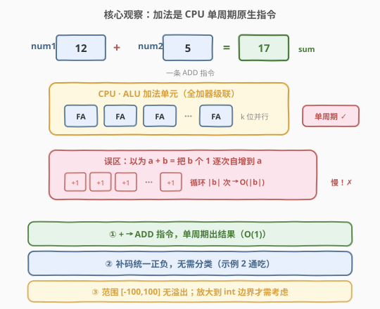
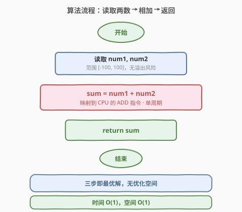
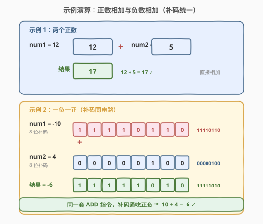

# 两整数相加

- **题目名称**：两整数相加
- **链接**：[2235. 两整数相加](https://leetcode.cn/problems/add-two-integers/)
- **难度**：简单
- **标签**：数学

## 1. 题目概述

给定两个整数 `num1` 和 `num2`，返回这两个整数的**和**。

**示例 1**：

```text
输入：num1 = 12, num2 = 5
输出：17
解释：12 + 5 = 17
```

**示例 2**：

```text
输入：num1 = -10, num2 = 4
输出：-6
解释：-10 + 4 = -6
```

**约束条件**：

- $-100 \le \text{num1}, \text{num2} \le 100$

> 💡 这是 LeetCode 上**最简单**的题目（题号 2235，曾长期作为入门签到题）。看似一行代码就能 AC，但它背后牵出一条重要链路：**计算机如何用位运算实现加法**。直接相加是工程最优解；若面试官追问「不使用 `+` 运算符如何求和」，则需转向位运算模拟加法（详见第 5 节，承接 [371. 两整数之和](../0301-0400/371_两整数之和.md)）。

---

## 2. 解题思路

### 2.1 直接思路：使用加法运算符

最直接的做法就是**调用语言内置的加法运算符**：

```python
return num1 + num2
```

由于数据范围 $[-100, 100]$ 极小，和在 $[-200, 200]$ 之间，**不存在任何溢出风险**，也不需要特殊处理负数（CPU 用补码统一处理正负数加法）。一行代码即为最优解。

> 💡 本题「暴力」与「最优」重合——加法是 CPU 的原生指令，单周期完成，没有比它更快的做法。真正的考点不在「能不能写出加法」，而在**能否讲清整数加法的底层原理**（补码、溢出、位运算实现）。

### 2.2 核心观察：加法是 CPU 原生指令



关键认识有三层：

1. **加法运算符 `+` 不是「循环累加」**：很多人误以为 `a + b` 等价于「把 `b` 个 1 逐个加到 `a` 上」（即 `b` 次自增）。实际上 `+` 直接映射到 CPU 的 **ALU 加法指令**（如 x86 的 `ADD`），**一个时钟周期**内通过组合逻辑电路（半加器 + 全加器级联）并行完成所有位的运算，与数值大小无关。

2. **补码统一正负**：无论 `num1`、`num2` 是正是负，CPU 内部一律用**补码**表示并按同一套加法电路处理——这正是示例 2 中 `-10 + 4 = -6` 无需特殊判断的原因。

3. **常数时间 $O(1)$**：加法的时间与输入数值大小无关（不像「逐次自增」会是 $O(|b|)$），空间也只用一个变量存结果。

> ⚠️ 在 $[-100, 100]$ 范围下绝无溢出；但若把数据范围放大到 `int` 边界（如 $2^{31}-1$ 与 $1$ 相加），就会触发**整数溢出**——此时需改用更大位宽类型（`long long` / Python 任意精度）或显式检测。本题无需考虑，但面试时应主动提及。

### 2.3 算法流程图



流程极其简单：

1. **读取**：接收两个整数 `num1`、`num2`。
2. **相加**：`sum = num1 + num2`（CPU 单周期 `ADD` 指令）。
3. **返回**：输出 `sum`。

### 2.4 示例演算

以两个示例对照正数相加与负数相加，验证补码统一处理：



| 示例 | num1 | num2 | 运算 | 结果 | 说明 |
|------|------|------|------|------|------|
| 1 | 12 | 5 | $12 + 5$ | 17 | 两个正数，直接相加 |
| 2 | -10 | 4 | $-10 + 4$ | -6 | 一负一正，补码同电路，结果为负 |

> 💡 示例 2 是关键验证点：`-10 + 4` 无需判断符号、无需分类讨论，CPU 用补码表示 $-10$（8 位下为 `11110110`），与 $4$（`00000100`）按位相加得 `11111010` 即 $-6$。**同一套电路、同一条指令**，正负通吃。

---

## 3. 参考代码

### C++

```cpp
class Solution {
public:
    int sum(int num1, int num2) {
        return num1 + num2;
    }
};
```

### Python

```python
class Solution:
    def sum(self, num1: int, num2: int) -> int:
        return num1 + num2
```

> 💡 两种语言的 `+` 均映射到 CPU 加法指令，$O(1)$ 时间 $O(1)$ 空间。Python 因支持任意精度整数，理论上无溢出；C++ 的 `int` 为 32 位有符号，但本题数据范围远小于边界，同样安全。

---

## 4. 复杂度分析

| 维度 | 复杂度 | 说明 |
|------|--------|------|
| **时间复杂度** | $O(1)$ | 加法是 CPU 单周期原生指令（ALU 组合逻辑），与数值大小无关 |
| **空间复杂度** | $O(1)$ | 仅用一个变量存储结果 |

> 💡 严格说，CPU 加法器对 $k$ 位整数需 $O(k)$ 个全加器级联，但由于硬件并行实现且 $k$ 固定（32/64 位），从算法视角看就是 $O(1)$。这正是不应「逐次自增」的原因——逐次自增是 $O(\lvert b \rvert)$，而原生加法是 $O(1)$。

---

## 5. 扩展：不用 `+` 运算符如何求和？——位运算模拟加法

面试中常在签到题后追加：「**不使用 `+`、`-` 运算符，求两整数之和**」（这正是 [371. 两整数之和](../0301-0400/371_两整数之和.md)）。其思路是用**位运算**模拟加法器的组合逻辑：

**核心思想**：把加法拆成「**不进位和**」与「**进位**」两部分，反复迭代直到没有进位。

- **不进位和** = `a ^ b`（异或：相同为 0，不同为 1，恰好是忽略进位的逐位相加）。
- **进位** = `(a & b) << 1`（与运算找出同时为 1 的位即产生进位的位置，左移 1 位送到高位）。
- 两者相加仍可能产生新进位，故**循环**用新的 `a = 不进位和`、`b = 进位` 继续，直到进位为 0。

```python
class Solution:
    def sum(self, num1: int, num2: int) -> int:
        MASK = 0xFFFFFFFF        # 32 位掩码
        while num2 != 0:
            carry = (num1 & num2) << 1   # 进位
            num1 = (num1 ^ num2) & MASK  # 不进位和
            num2 = carry & MASK
        # 处理 Python 负数的高位符号扩展
        return num1 if num1 <= 0x7FFFFFFF else ~(num1 ^ MASK)
```

> 💡 这就是 **半加器**（异或出和、与出门进位）级联成**全加器**的软件实现。掌握了它，2235 就从「一行代码」升级为理解计算机算术的入口。详见 [371. 两整数之和](../0301-0400/371_两整数之和.md)。

---

## 6. 面试要点

1. **这道题这么简单，面试官想考察什么？**

   - 表面上是签到题，真正考点在**后续追问**：能否讲清加法的底层原理（补码、ALU 全加器、溢出），以及能否在「禁用 `+`」时用位运算实现加法（承接 371）。

2. **为什么加法是 $O(1)$ 而不是 $O(\lvert b \rvert)$？**

   - `+` 运算符映射到 CPU 的 `ADD` 指令，由 ALU 内 $k$ 个全加器并行级联完成（$k$ 为字长，固定 32/64 位），**单周期**出结果，与数值大小无关。若误用「把 `b` 个 1 逐个自增」则是 $O(\lvert b \rvert)$，是常见的认知误区。

3. **负数相加为什么不用特殊处理？**

   - 计算机用**补码**统一表示正负数，加法电路对补码一视同仁。示例 2 中 $-10 + 4$，CPU 把 $-10$ 存为补码，与 $4$ 的补码走同一条 `ADD` 指令，结果自然为 $-6$ 的补码。无需判断符号、无需分类。

4. **本题会有溢出吗？什么情况下需要考虑溢出？**

   - 本题范围 $[-100, 100]$，和在 $[-200, 200]$，远小于 32 位 `int` 边界 $[-2^{31}, 2^{31}-1]$，**绝无溢出**。若数据范围贴近 `int` 边界（如 $2^{31}-1$ 加正数），则需用 `long long`（C++）或依赖 Python 任意精度避免溢出，或显式做溢出检测。面试中应主动提及这一边界意识。

5. **不用 `+` 怎么实现加法？**

   - 用位运算：`a ^ b` 得不进位和，`(a & b) << 1` 得进位，循环直到进位为 0。这模拟了全加器的组合逻辑，是 [371. 两整数之和](../0301-0400/371_两整数之和.md) 的核心解法。注意 Python 需用 32 位掩码处理负数的高位符号扩展。

> 💡 **一句话总结**：2235 是 LeetCode 最简题——`return num1 + num2` 即为最优解；其价值不在代码本身，而在于借这道「白纸」讲清加法的底层原理（补码统一正负、ALU 单周期指令、$O(1)$ 复杂度），并自然延伸到位运算模拟加法（371），把签到题变成理解计算机算术的起点。

---

## 7. 同类练习题

- [371. 两整数之和](../0301-0400/371_两整数之和.md)（[题解](../0301-0400/371_两整数之和.md)）：禁用 `+`/`-`，用位运算 `a^b` + `(a&b)<<1` 模拟加法，本题的进阶追问
- [2. 两数相加](../0001-0100/2_两数相加.md)（[题解](../0001-0100/2_两数相加.md)）：链表节点逐位模拟进位加法，加法思想的数据结构化版本
- [415. 字符串相加](https://leetcode.cn/problems/add-strings/)：大数加法模拟，当数值超出整数范围时退化为逐位字符加法
- [29. 两数相除](https://leetcode.cn/problems/divide-two-integers/)：禁用乘除模，用位运算（左移翻倍成倍减）模拟除法，与 371 同属「位运算模拟算术」家族
- [50. Pow(x, n)](https://leetcode.cn/problems/powx-n/)：快速幂，位运算/二分思想应用于幂运算，与 371/29 同为位运算算术系列
