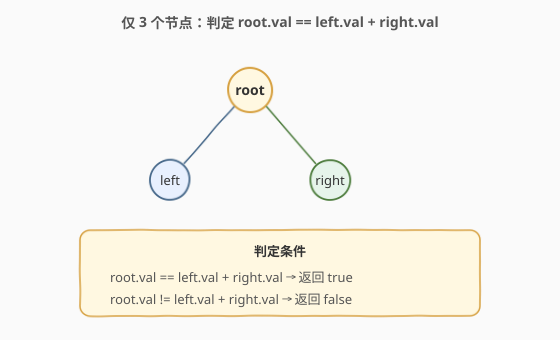
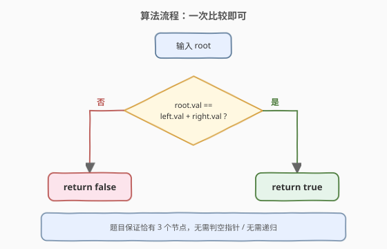
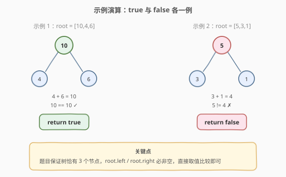

# LeetCode 根节点等于子节点之和 题解

## 1. 题目概述

- **标题 / 题号**：根节点等于子节点之和（#2236，easy）
- **链接**：https://leetcode.cn/problems/root-equals-sum-of-children/
- **难度**：简单
- **标签**：树、二叉树、模拟

**题意**：给你一棵**仅包含 3 个节点**的二叉树 `root`：根节点、根的左孩子、根的右孩子。判断**根节点的值是否等于其左右孩子值之和**，等于返回 `true`，否则返回 `false`。

**示例 1**：

```text
输入：root = [10,4,6]
输出：true
解释：根值 10，左孩子 4 + 右孩子 6 = 10，相等 → true。
```

**示例 2**：

```text
输入：root = [5,3,1]
输出：false
解释：根值 5，左孩子 3 + 右孩子 1 = 4，5 ≠ 4 → false。
```

**约束**：

- 树**恰有 3 个节点**：根、左孩子、右孩子均非空
- $1 \le \text{Node.val} \le 100$

> 💡 题眼在于「恰有 3 个节点」这一强约束——左右孩子必非空，无需任何空指针判断、无需递归遍历，直接取三个值做一次加法与比较即可。这是一道**二叉树数据结构入门**的最简识别题。

## 2. 解题思路

### 2.1 暴力思路：递归遍历求和

用前序/中序遍历整棵树，把所有节点值收集到数组，再判断 `vals[0] == vals[1] + vals[2]`。可行，但完全多余——题目已保证恰 3 个节点且结构固定（根 + 左 + 右），任何遍历都退化为访问这 3 个节点。

> ⚠️ 本题的「坑」不在于算法复杂度，而在于**是否意识到不需要递归**。新手上手二叉树题容易套用「递归遍历」模板，本题恰恰是要打破这种惯性——结构已知时直接访问。

### 2.2 核心观察：结构已知，直接取值比较



**观察一：树的结构完全确定**

题目保证「恰有 3 个节点」，即 `root`、`root.left`、`root.right` 三者均非空，且没有更深的层级。这是一棵**高度为 2 的满二叉树**，结构固定，不存在「缺左子」「缺右子」「只有一条链」等变体。

**观察二：一次加法 + 一次比较**

既然三个节点的位置都已知，只需：

$$\text{root.val} \stackrel{?}{=} \text{root.left.val} + \text{root.right.val}$$

一个加法、一个比较，$O(1)$ 时间、$O(1)$ 空间，无需递归、无需栈、无需队列。

> 💡 **「能不能不用递归」是本题的真正考点**。当题目对输入结构给出强保证（如「恰有 3 个节点」「完全二叉树」「每个节点最多两个子」）时，应优先利用结构保证走**直接访问**路径，而非套用通用遍历模板。通用模板在结构未知时才显出价值。

### 2.3 算法流程图



算法步骤总结：

1. **取根值**：`rv = root.val`。
2. **取左右孩子值**：`lv = root.left.val`，`rrv = root.right.val`（由约束保证非空）。
3. **比较**：返回 `rv == lv + rrv`。

### 2.4 示例演算

以示例 1 `[10,4,6]`（答案 `true`）和示例 2 `[5,3,1]`（答案 `false`）逐步演算：



**示例 1 要点**：`4 + 6 = 10`，`10 == 10` 成立 → `true`。

**示例 2 要点**：`3 + 1 = 4`，`5 != 4` 不成立 → `false`。

> 💡 **值域提示**：节点值 $1 \le \text{val} \le 100$，左右孩子之和最多 200，在 `int` 范围内绰绰有余，无需考虑溢出。即便值域更大，两个 `int` 相加在 64 位平台也不会溢出。

## 3. 参考代码

### C++：直接取值比较（$O(1)$ / $O(1)$）

```cpp
class Solution {
public:
    bool checkTree(TreeNode* root) {
        return root->val == root->left->val + root->right->val;
    }
};
```

### Python：直接取值比较（$O(1)$ / $O(1)$）

```python
class Solution:
    def checkTree(self, root: Optional[TreeNode]) -> bool:
        return root.val == root.left.val + root.right.val
```

> 💡 两版代码都只有一行——这正是本题的「特征签名」。当一道树题的最优解是一行直接访问时，说明考点在于**识别结构保证**而非算法设计。

## 4. 复杂度分析

| 维度 | 复杂度 | 说明 |
|------|--------|------|
| **时间复杂度** | $O(1)$ | 两次指针解引用 + 一次加法 + 一次比较，常数操作 |
| **空间复杂度** | $O(1)$ | 无递归栈、无额外数组，仅用寄存器暂存三个值 |

> 💡 这是二叉树题中少见的 $O(1)$ / $O(1)$ 双常数解，源于题目对「恰 3 个节点」的强结构保证。

## 5. 扩展：若结构不保证呢？

本题的简洁依赖「恰 3 个节点」的约束。若放宽为「任意二叉树，判断根值是否等于所有其他节点值之和」，则需用递归/迭代求**整棵子树之和**：

```python
class Solution:
    def checkTree(self, root: Optional[TreeNode]) -> bool:
        def tree_sum(node):
            if not node:
                return 0
            return node.val + tree_sum(node.left) + tree_sum(node.right)
        if not root:
            return True
        return root.val == tree_sum(root.left) + tree_sum(root.right)
```

**原理**：`tree_sum` 后序递归求子树和（当前值 + 左子和 + 右子和）。判定根值是否等于「除根外所有节点之和」⟺ 根值等于左右子树和之和。在原题的 3 节点情形下，`tree_sum(root.left)` 恰为 `root.left.val`，退化为本题的一行解。

> ⚠️ **变体陷阱**：若题目改为「根值是否等于左子树所有节点之和（不含右子树）」，则只需 `root.val == tree_sum(root.left)`，不要误把右子树也算进去。读题时务必分清「子节点之和」「子树之和」「所有其他节点之和」三种表述。

## 6. 面试要点

1. **为什么这题不需要递归？**

   - 题目明确保证「恰有 3 个节点」，即根、左孩子、右孩子均非空且无更深层级。结构完全确定时，三个值的访问路径已知，直接 `root.left.val` 取值即可，递归反而引入不必要的函数调用开销与栈空间。

2. **`root.left` 和 `root.right` 会不会是空指针？**

   - 不会。约束「恰有 3 个节点」保证左右孩子均存在。若约束放宽（如「至多 3 个节点」），则需先判 `root.left != nullptr && root.right != nullptr`，否则解引用空指针会导致未定义行为（C++）或异常（Python 的 `None.val`）。

3. **这题在考察什么？**

   - 考察**对二叉树节点结构的理解**（`root.left` / `root.right` 的访问方式）与**对题目约束的敏感度**。它是二叉树数据结构的「Hello World」——确认面试者会用节点指针访问字段，并懂得利用约束简化代码。不考察算法设计。

4. **如果面试官追问「不借助约束，写一个通用版」怎么答？**

   - 用后序递归 `tree_sum(node)` 求子树和，再比较 `root.val == tree_sum(root.left) + tree_sum(root.right)`。指出在 3 节点情形下退化为 $O(1)$，并说明通用版的时间 $O(n)$ / 空间 $O(h)$。

5. **Python 和 C++ 在写法上的差异？**

   - Python 用属性访问 `root.left.val`，`None` 时抛 `AttributeError`；C++ 用指针 `root->left->val`，空指针解引用是未定义行为。两者都依赖约束保证非空，生产代码中应加判空防御。

> 💡 **一句话总结**：2236 是二叉树入门的「结构识别」题——利用「恰 3 个节点」的强保证，一次加法一次比较 $O(1)$ 搞定，考点在于跳出递归模板的惯性。

## 同类练习题

| # | 题目 | 与本题的关联 |
|---|------|-------------|
| 965 | [单值二叉树](https://leetcode.cn/problems/univalued-binary-tree/) | 判定树中所有节点值是否相同，需递归遍历对照本题的直接访问，体会「结构已知 vs 结构未知」 |
| 100 | [相同的树](https://leetcode.cn/problems/same-tree/) | 两棵树逐节点递归比较，二叉树递归判等模板，承接本题的节点访问基础 |
| 104 | [二叉树的最大深度](https://leetcode.cn/problems/maximum-depth-of-binary-tree/) | 后序递归求高度，二叉树递归骨架入门，对照本题无需递归的特殊性 |
| 226 | [翻转二叉树](https://leetcode.cn/problems/invert-binary-tree/) | 每个节点交换左右孩子，二叉树递归修改结构的经典题，本题的进阶形态 |
