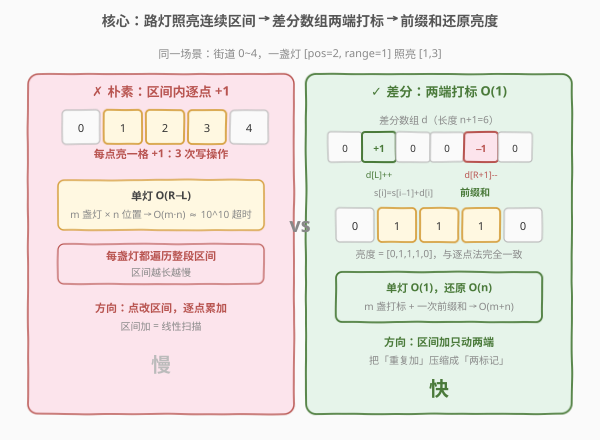
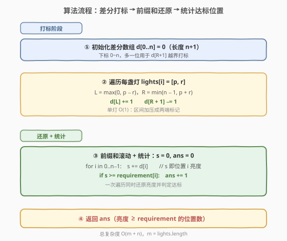
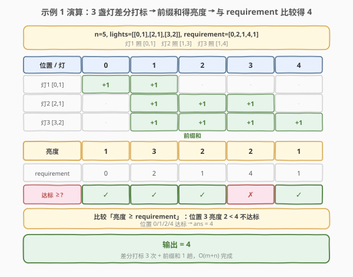

# LeetCode 计算街道上满足所需亮度的位置数量 题解

## 1. 题目概述

- **标题 / 题号**：计算街道上满足所需亮度的位置数量（#2237，medium）
- **链接**：https://leetcode.cn/problems/count-positions-on-street-with-required-brightness/
- **难度**：中等
- **标签**：数组、前缀和、差分数组

**题意**：一条笔直街道用数轴 `0` 到 `n - 1` 表示（共 `n` 个位置）。给定二维整数数组 `lights`，其中 `lights[i] = [position_i, range_i]` 表示在 `position_i` 处有一盏路灯，照亮闭区间

$$[\max(0,\; position_i - range_i),\; \min(n - 1,\; position_i + range_i)]$$

位置 `p` 的**亮度**定义为照亮该位置的路灯数量。给定长度为 `n` 的数组 `requirement`，`requirement[i]` 是位置 `i` 所需的**最小亮度**。返回亮度**至少满足** `requirement[i]`（即 $\text{brightness}[i] \ge \text{requirement}[i]$）的位置数量。

**示例 1**：

```text
输入：n = 5, lights = [[0,1],[2,1],[3,2]], requirement = [0,2,1,4,1]
输出：4
解释：
- 灯1 [0,1] 照亮 [0,1]
- 灯2 [2,1] 照亮 [1,3]
- 灯3 [3,2] 照亮 [1,4]
各位置亮度 = [1, 3, 2, 2, 1]
与 requirement [0,2,1,4,1] 比较（≥）：
  位置 0: 1 ≥ 0 ✓　位置 1: 3 ≥ 2 ✓　位置 2: 2 ≥ 1 ✓
  位置 3: 2 ≥ 4 ✗　位置 4: 1 ≥ 1 ✓
达标位置 0/1/2/4，共 4 个。
```

**示例 2**：

```text
输入：n = 1, lights = [[0,1]], requirement = [2]
输出：0
解释：灯1 照亮 [0,0]，位置 0 亮度 = 1 < 2，无位置达标。
```

**约束**：

- $1 \le n \le 10^5$
- $1 \le \text{lights.length} \le 10^5$
- $0 \le position_i < n$
- $0 \le range_i \le 10^5$
- $\text{requirement.length} = n$
- $0 \le \text{requirement}[i] \le 10^5$

> 💡 **题眼**：每盏路灯对一个**连续区间**整体贡献 $+1$，问每个位置累计亮度是否达标。这是典型的「**区间批量加、单点查询**」模型——差分数组的招牌场景。注意题目问的是「至少满足」（$\ge$），不是「恰好等于」。

## 2. 解题思路

### 2.1 暴力思路：逐位置数路灯

最直接的写法：对每个位置 `i`（$0 \le i < n$），遍历全部路灯，判定该灯是否覆盖 `i`（即 $|i - position| \le range$ 且落在 $[0, n-1]$ 内），累加覆盖数得到亮度，再与 `requirement[i]` 比较。

问题在于规模：

1. **双层循环**：$n$ 个位置 $\times$ $m$ 盏灯 = $O(n \cdot m)$。本题 $n, m \le 10^5$，最坏 $10^{10}$ 次比较，**必然超时**；
2. **重复扫描**：每盏灯的覆盖范围是连续的，却被拆成一堆单点判定，把「区间」信息白白浪费；
3. **方向低效**：对一盏照亮 $[L, R]$ 的灯，朴素法要写 $R - L + 1$ 次 $+1$，而其实只需在两端做标记就能表达整段加。

> ⚠️ 暴力法超时的根源在于「**把区间操作退化成逐点操作**」。区间加有天然的聚合结构，逐点处理等于丢掉这个结构。

### 2.2 核心观察：差分数组——区间加压缩成两端打标



**关键洞察**：每盏灯做的事是「把一段连续区间 $[L, R]$ 的每个位置都 $+1$」。这种**区间加**操作有一个经典加速器——**差分数组**。

设差分数组 $d[0..n]$（长度 $n + 1$），对一盏照亮 $[L, R]$ 的灯，只做两件事：

$$d[L] \mathrel{+}= 1,\qquad d[R + 1] \mathrel{-}= 1$$

之后对 $d$ 做一次**前缀和**即可还原每个位置的亮度：

$$\text{brightness}[i] = \sum_{k=0}^{i} d[k]$$

**为什么这样就行？** 差分数组是前缀和的逆运算。$d[L] {+}{=}1$ 让从 $L$ 起的前缀和都抬升 1；$d[R+1] {-}{=}1$ 又把抬升从 $R+1$ 起压回去。于是抬升恰好覆盖 $[L, R]$ 一段，区间外的位置不受影响。一盏灯从 $O(R-L)$ 次写压成 $O(1)$ 次写，$m$ 盏灯共 $O(m)$；最后一次性前缀和还原 $O(n)$。

> 💡 **差分 vs 前缀和的对称性**：前缀和适合「**一次预处理、多次区间和查询**」（点查区间和）；差分适合「**多次区间加、一次还原所有点值**」（区间改、单点查）。两者互为逆变换。本题是「先大量区间加、后一次性查所有点」，正是差分的主场。

**边界处理**：

- **左越界**：$position - range < 0$ 时，$L = \max(0,\; position - range)$ 截到 0，差分从 $d[0]$ 起，等价于从头开始照亮；
- **右越界**：$position + range > n - 1$ 时，$R = \min(n - 1,\; position + range)$ 截到 $n-1$，于是 $d[R+1] = d[n]$，正好用上差分数组多分配的那一位（长度 $n+1$ 的原因）；
- **requirement 判定**：题目问「至少满足」，比较时用 $\text{brightness}[i] \ge \text{requirement}[i]$，不是相等。

### 2.3 算法流程图



1. **初始化**：差分数组 $d[0..n]$ 全置 0（长度 $n + 1$，预留 $d[n]$ 给右越界打标）；
2. **打标**：遍历每盏灯 $[p, r]$，算 $L = \max(0, p - r)$、$R = \min(n - 1, p + r)$，执行 $d[L] {+}{=} 1$、$d[R + 1] {-}{=} 1$；
3. **还原 + 统计**：滚动前缀和 $s$，对 $i = 0 \ldots n-1$ 做 $s \mathrel{+}= d[i]$，若 $s \ge \text{requirement}[i]$ 则 $ans {+}{=} 1$；
4. **返回** $ans$。

> 💡 第 3 步把「还原亮度」和「判定达标」合并在同一趟遍历里，无需额外存亮度数组，空间降到 $O(n)$（仅差分数组本身）。

### 2.4 示例演算



以示例 1 展开（$n = 5$，位置 $0 \sim 4$）：

**第一步——每盏灯在差分数组两端打标**（$d$ 长度 $6$）：

| 灯 | $[p, r]$ | 覆盖 $[L, R]$ | 差分操作 |
|----|----------|---------------|---------|
| 灯1 | $[0,1]$ | $[\max(0,-1), \min(4,1)] = [0,1]$ | $d[0] {+}{=}1,\; d[2] {-}{=}1$ |
| 灯2 | $[2,1]$ | $[\max(0,1), \min(4,3)] = [1,3]$ | $d[1] {+}{=}1,\; d[4] {-}{=}1$ |
| 灯3 | $[3,2]$ | $[\max(0,1), \min(4,5)] = [1,4]$ | $d[1] {+}{=}1,\; d[5] {-}{=}1$ |

累加后 $d = [1,\; 2,\; -1,\; 0,\; -1,\; -1]$。

**第二步——前缀和还原亮度**：

| 位置 $i$ | 0 | 1 | 2 | 3 | 4 |
|----------|---|---|---|---|---|
| $d[i]$ | 1 | 2 | −1 | 0 | −1 |
| 前缀和 $s$（亮度） | 1 | 3 | 2 | 2 | 1 |

**第三步——与 requirement 比较**（$\ge$ 判定）：

| 位置 $i$ | 0 | 1 | 2 | 3 | 4 |
|----------|---|---|---|---|---|
| 亮度 | 1 | 3 | 2 | 2 | 1 |
| requirement | 0 | 2 | 1 | 4 | 1 |
| 达标 | ✓ | ✓ | ✓ | ✗ | ✓ |

位置 3 亮度 $2 < 4$ 不达标，其余 4 个达标，**答案 = 4** ✓。

> 💡 注意位置 4：灯3 的 $R = \min(4, 5) = 4$，于是 $d[5] {-}{=}1$，前缀和到 $i=4$ 时 $s = 2 + 0 + (-1) = 1$（恰好把灯2 在 $i=4$ 的抬升压回）。这正是「右截断 + $d[R+1]$ 打标」配合工作的体现——差分数组多一位 $d[n]$ 就是为了承接右越界的负标记。

## 3. 参考代码

### C++

```cpp
class Solution {
public:
    int meetRequirement(int n, vector<vector<int>>& lights, vector<int>& requirement) {
        vector<int> d(n + 1, 0);
        for (const auto& lk : lights) {
            int p = lk[0], r = lk[1];
            int L = max(0, p - r);
            int R = min(n - 1, p + r);
            ++d[L];
            --d[R + 1];
        }
        int s = 0, ans = 0;
        for (int i = 0; i < n; ++i) {
            s += d[i];
            if (s >= requirement[i]) ++ans;
        }
        return ans;
    }
};
```

> ⚠️ 差分数组长度必须开成 $n + 1$：当某盏灯 $p + r \ge n - 1$ 时，$R = n - 1$，需要写 $d[R + 1] = d[n]$，少开一位会越界。前缀和循环只跑到 $i < n$，$d[n]$ 仅作「吸收负标记」的哨兵，不参与亮度统计。

### Python

```python
class Solution:
    def meetRequirement(
        self, n: int, lights: List[List[int]], requirement: List[int]
    ) -> int:
        d = [0] * (n + 1)
        for p, r in lights:
            L = max(0, p - r)
            R = min(n - 1, p + r)
            d[L] += 1
            d[R + 1] -= 1
        s = 0
        ans = 0
        for i in range(n):
            s += d[i]
            if s >= requirement[i]:
                ans += 1
        return ans
```

> 💡 也可用 `itertools.accumulate` 一行还原亮度：`sum(s >= r for s, r in zip(accumulate(d), requirement))`。但显式滚动前缀和便于在还原同时计数、且不生成中间亮度数组，空间更省、可读性也好。

## 4. 复杂度分析

| 维度 | 复杂度 | 说明 |
|------|--------|------|
| 时间 | $O(n + m)$ | $m$ 盏灯各 $O(1)$ 打标 + 一趟 $O(n)$ 前缀和还原与统计；$m = \text{lights.length}$ |
| 空间 | $O(n)$ | 仅差分数组 $d[0..n]$，长度 $n + 1$；前缀和滚动变量 $O(1)$，不额外存亮度数组 |

> 💡 对比暴力 $O(n \cdot m)$：差分把「每盏灯遍历整段区间」压成「两端打标」，再靠一次前缀和把所有位置亮度一次性算出。$n, m \le 10^5$ 时 $O(n + m) \approx 2 \times 10^5$，比 $10^{10}$ 快约 $5 \times 10^4$ 倍。

## 5. 扩展：动态加灯与多次查询

本题「一次性给所有灯、最后查一次」是差分的最佳场景。若约束放宽，需考虑变体：

**动态增删路灯 / 在线查询**：灯随时增删、随时问某位置亮度。差分数组每次加灯仍 $O(1)$ 打标，但查询某点亮度需重新前缀和到该点 $O(n)$，频繁查询不划算。改用**树状数组（BIT）**或**线段树**做单点更新 + 区间更新 + 单点查询：加灯时对 $[L, R]$ 区间加 1（线段树懒标记 $O(\log n)$），查位置 $i$ 亮度 $O(\log n)$。

**区间加 + 区间和查询**：若改问「某连续段的亮度之和」，需用支持区间加、区间求和的线段树（双懒标记），差分数组配合二阶前缀和也可，但写法更绕。

**二维街道（网格照亮）**：路灯照亮矩形区域 $[x_1, x_2] \times [y_1, y_2]$，用**二维差分**——四角打标（$d[x_1][y_1] {+}{=}1$、$d[x_2+1][y_1] {-}{=}1$、$d[x_1][y_2+1] {-}{=}1$、$d[x_2+1][y_2+1] {+}{=}1$），再二维前缀和还原。

> 💡 **方法论**：凡遇到「**多次对连续区间整体加减、最后或中途查询单点/区间值**」，第一反应就是差分数组（一维）/ 二维差分（矩形）。只有当更新与查询**交错频繁**且要求 $O(\log n)$ 在线响应时，才升级到树状数组 / 线段树。

## 6. 面试要点

1. **为什么差分数组能把区间加降到 O(1)？**

   - 差分是前缀和的逆。$d[L] {+}{=}1$ 让所有 $i \ge L$ 的前缀和抬升 1，$d[R+1] {-}{=}1$ 让所有 $i \ge R+1$ 的前缀和压回 1，净效果是恰好在 $[L, R]$ 抬升 1。一盏灯只需改两个端点，区间加从 $O(R-L)$ 变 $O(1)$。

2. **差分数组为什么要开长度 n+1 而不是 n？**

   - 当灯右端 $R = n - 1$（右越界截断）时，要写 $d[R + 1] = d[n]$。若数组只开 $n$，下标 $n$ 越界。多开一位作「吸收负标记」的哨兵，前缀和循环只跑到 $i < n$，不参与统计。

3. **题目问「至少满足」，比较方向是 ≥ 还是 ==？**

   - 是 $\ge$。`requirement[i]` 是**最小**亮度要求，只要 $\text{brightness}[i] \ge \text{requirement}[i]$ 即达标。易错点是误判成相等，示例 1 位置 0 亮度 1、要求 0，$1 \ne 0$ 但 $1 \ge 0$ 仍达标。

4. **左右越界如何处理？**

   - $L = \max(0, p - r)$、$R = \min(n - 1, p + r)$，把照亮范围截到街道 $[0, n-1]$ 内。左越界截到 0 等于从头照亮；右越界截到 $n-1$ 配合 $d[n]$ 哨兵吸收负标记。

5. **差分和前缀和各适合什么场景？**

   - 前缀和适合「一次预处理、多次**区间和查询**」（点查区间和 $O(1)$）；差分适合「多次**区间加**、一次还原所有点值」（区间加 $O(1)$、还原 $O(n)$）。二者互为逆变换。本题是「大量区间加 + 一次全量查」，故用差分。

## 同类练习题

| # | 题目 | 与本题的关联 |
|---|------|-------------|
| 370 | [区间加法](https://leetcode.cn/problems/range-addition/)（[题解](../0301-0400/370_区间加法.md)） | 差分数组母题，多次区间加后返回最终数组，与本题「打标 + 前缀和还原」完全同模板 |
| 1109 | [航班预订统计](https://leetcode.cn/problems/corporate-flight-bookings/)（[题解](../1101-1200/1109_航班预订统计.md)） | 每条订票对一段航班区间加座位数，差分还原各航班总预订数，本题的「计数达标」版变体 |
| 1094 | [拼车](https://leetcode.cn/problems/car-pooling/)（[题解](../1001-1100/1094_拼车.md)） | 旅客上下车对里程区间加减人数，差分还原后判定容量是否超限，把「统计达标」换成「判定越界」 |
| 1526 | [形成目标数组的子数组最少增加次数](https://leetcode.cn/problems/minimum-number-of-increments-on-subarrays-to-form-a-target-array/)（[题解](../1501-1600/1526_形成目标数组的子数组最少增加次数.md)） | 差分思想的进阶应用——由目标数组反推最少区间加次数，正用差分「相邻差之和」 |
| 2381 | [字母移位后的最小美丽字符串](https://leetcode.cn/problems/shifting-letters-ii/) | 多次区间移位（字母 +shift）后求字典序最小串，差分还原每位置累计移位量，承接本题区间加模板 |
