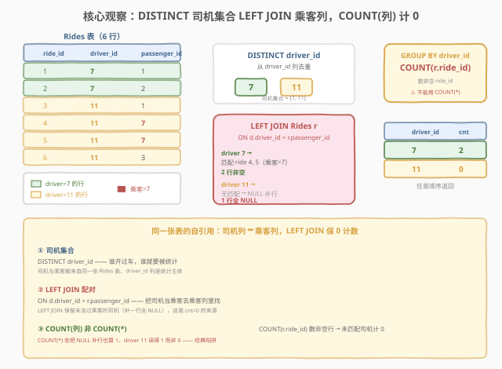
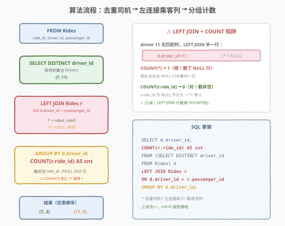
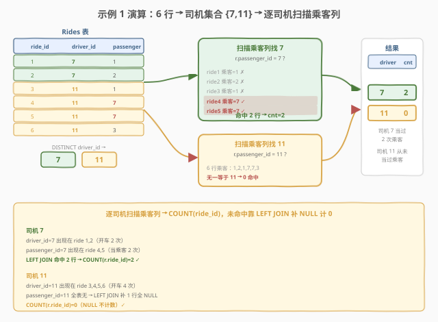

# LeetCode 司机成为乘客的次数 题解

## 1. 题目概述

- **标题 / 题号**：司机成为乘客的次数（#2238，medium）
- **链接**：https://leetcode.cn/problems/number-of-times-a-driver-was-a-passenger/
- **难度**：中等
- **标签**：数据库、SQL、自连接、`LEFT JOIN`、`GROUP BY`、`COUNT`、LeetCode 锁题

**题意**：给定 `Rides` 表，每行记录一次行程：谁开车（`driver_id`）、谁乘车（`passenger_id`）。编写解决方案，获取**每个司机**的 ID 和他们**作为乘客**出现的次数（未当过乘客则计 0）。以**任意顺序**返回结果。

**表结构**：

```text
Table: Rides
+--------------+------+
| Column Name  | Type |
+--------------+------+
| ride_id      | int  |  ← 主键
| driver_id    | int  |
| passenger_id | int  |
+--------------+------+
ride_id 是该表的主键。
每一行包含一次行程的司机 ID 与乘客 ID。
注意 driver_id != passenger_id。
```

> ⚠️ **同一张表的两个角色列**：`driver_id` 与 `passenger_id` 都是人 ID，且都来自这张 `Rides` 表——一个人既可能当司机、也可能当乘客。题目要统计的是「**司机集合里每个人，在乘客列里出现了几次**」，本质是**同一张表的自引用**：把 `driver_id` 当作待查集合，去 `passenger_id` 列里计数。

**示例 1**：

```text
输入：
Rides 表:
+---------+-----------+--------------+
| ride_id | driver_id | passenger_id |
+---------+-----------+--------------+
| 1       | 7         | 1            |
| 2       | 7         | 2            |
| 3       | 11        | 1            |
| 4       | 11        | 7            |
| 5       | 11        | 7            |
| 6       | 11        | 3            |
+---------+-----------+--------------+

输出：
+-----------+-----+
| driver_id | cnt |
+-----------+-----+
| 7         | 2   |
| 11        | 0   |
+-----------+-----+

解释：
在所有行程中有两名司机：7 和 11。
ID = 7 的司机曾两次成为乘客（ride 4、5 的 passenger_id 都是 7）。
ID = 11 的司机从来不是乘客（passenger_id 列里没有 11）→ cnt = 0。
```

**约束**：

- `ride_id` 为表主键，行唯一。
- `driver_id != passenger_id`（同一次行程里司机与乘客必不同人）。
- 司机集合 = `DISTINCT driver_id`；每名司机都要出现在结果里，哪怕计数为 0。
- 结果含 `driver_id` 与 `cnt` 两列，顺序任意。

> 💡 **题眼**：① **统计主体是「司机集合」**——谁开过车谁就要被报告，即便他从没当过乘客；② **计数对象是「乘客列」**——把每个司机 ID 拿到 `passenger_id` 列里去数出现次数；③ **0 必须保留**——没当过乘客的司机不能被丢掉，这是选 `LEFT JOIN` 而非 `INNER JOIN`、选 `COUNT(列)` 而非 `COUNT(*)` 的根本原因。

> ⚠️ **与 2142/2153「每辆车的乘客人数」对照**：那两题是「**两张表**（Buses + Passengers）按时间配对计数」；本题是「**一张表的两列**（driver_id ↔ passenger_id）自引用计数」。骨架都是 `LEFT JOIN + GROUP BY + COUNT`，但本题的连接发生在同表内部，更接近 [570. 至少有5名直接下属的经理](https://leetcode.cn/problems/managers-with-at-least-5-direct-reports/) 的「同表自引用」模式。

## 2. 解题思路

### 2.1 暴力思路：逐司机扫描乘客列

最直觉的过程式思维：先取出所有不重复的司机 ID，对每个司机遍历一遍 `Rides` 表，数 `passenger_id == 该司机` 的行数。

```text
drivers = DISTINCT driver_id in Rides
for d in drivers:
    cnt = COUNT(*) WHERE passenger_id = d
    emit (d, cnt)
```

逻辑完全正确——而 SQL 的声明式表达正是「**把司机集合和乘客列做配对计数**」：用 `LEFT JOIN` 把「司机集合」与「Rides 表（取乘客列）」按 `driver_id = passenger_id` 连起来，再 `GROUP BY` 司机、`COUNT` 命中的行。配对时**必须用左连接**，否则没当过乘客的司机会在连接时被直接滤掉，导致结果缺行。

> ⚠️ 暴力思路的隐患不在正确性，而在「**0 计数如何保留**」：若误用 `INNER JOIN`，司机 11 因乘客列无匹配会被丢弃，结果只剩 `(7, 2)`，漏掉 `(11, 0)`。这是本题最常见的一刀。

### 2.2 核心观察：DISTINCT 司机集合 LEFT JOIN 乘客列，COUNT(列) 计 0



题目的三个语义——「**每个司机**」「**作为乘客的次数**」「**0 也要保留**」——分别对应 SQL 机制，叠加即得答案：

| 题意要求 | SQL 机制 | 语义 |
|----------|----------|------|
| 「每个司机」 | `(SELECT DISTINCT driver_id FROM Rides) d` | **去重司机集合**：谁开过车谁入列 |
| 「作为乘客的次数」 | `LEFT JOIN Rides r ON d.driver_id = r.passenger_id` | **左连接配对**：把司机 ID 拿到乘客列里匹配 |
| 「0 也要保留」 | `COUNT(r.ride_id)`（**不是** `COUNT(*)`） | **数非空列**：未匹配的 NULL 补行计 0 |

$$\text{cnt}[d] = \bigl|\{\, r \in \text{Rides} \;\mid\; r.\text{passenger\_id} = d \,\}\bigr|$$

对每个 $d \in \text{DISTINCT}(\text{driver\_id})$，统计 `Rides` 中 `passenger_id` 等于 $d$ 的行数；若不存在则为 0。

> 💡 **为什么必须 `LEFT JOIN`？** `INNER JOIN` 只保留两表都能配上的行。司机 11 在乘客列无匹配，`INNER JOIN` 会把它整行丢弃，结果漏掉 `(11, 0)`。`LEFT JOIN` 保留左表（司机集合）全部行，右表无匹配时补一行全 `NULL`——这正是「0 计数」的物理来源。

> ⚠️ **`COUNT(*)` vs `COUNT(列)` 的致命差异**：`LEFT JOIN` 对未匹配的司机会补**一行全 `NULL`**。
> - `COUNT(*)` 数**所有行**，包括这行 `NULL` → 司机 11 得 **1**（错！没当过乘客却计 1）；
> - `COUNT(r.ride_id)` 数**非空值**，`NULL` 行不计入 → 司机 11 得 **0**（对！）。
>
> 口诀：**「`LEFT JOIN` 计数，用 `COUNT(列)` 不用 `COUNT(*)`」**。这是 SQL 面试最高频的陷阱之一，本题正是其招牌题。

### 2.3 算法流程图



**逻辑执行步骤**：

| 步骤 | 子句 | 作用 |
|------|------|------|
| ① | `FROM (SELECT DISTINCT driver_id FROM Rides) d` | 取司机集合，作为左表（统计主体） |
| ② | `LEFT JOIN Rides r ON d.driver_id = r.passenger_id` | 把司机 ID 拿到乘客列里配对，未匹配补 `NULL` 行 |
| ③ | `GROUP BY d.driver_id` | 按司机分组 |
| ④ | `COUNT(r.ride_id) AS cnt` | 数每组内非空的 `ride_id`，未匹配组自然为 0 |

> 💡 **SQL 子句执行顺序**：`FROM`（构造司机集合）→ `LEFT JOIN`（配对乘客行，补 `NULL`）→ `GROUP BY`（按司机归组）→ `SELECT COUNT(列)`（每组数非空）。`COUNT(r.ride_id)` 作用在分组后的行集上，`NULL` 行被自动跳过。

### 2.4 示例演算

以示例 1 的 6 行行程为例，观察三阶段处理：



**阶段 ①：取司机集合 `DISTINCT driver_id`**

| ride_id | driver_id | passenger_id |
|---------|-----------|--------------|
| 1 | 7 | 1 |
| 2 | 7 | 2 |
| 3 | 11 | 1 |
| 4 | 11 | 7 |
| 5 | 11 | 7 |
| 6 | 11 | 3 |

`driver_id` 列去重 → 司机集合 = $\{7,\; 11\}$（两人各开过车）。

**阶段 ②：`LEFT JOIN Rides r ON d.driver_id = r.passenger_id`**

把每个司机 ID 拿到 `passenger_id` 列里找匹配行：

| 司机 $d$ | 乘客列中匹配行 | 连接结果 |
|----------|----------------|----------|
| 7 | `passenger_id=7` 命中 ride 4、ride 5 | 2 行非空：$(7, \text{ride4}),\; (7, \text{ride5})$ |
| 11 | `passenger_id=11` 全表无 | 1 行全 `NULL`：$(11, \text{NULL})$（左连接补出） |

> 💡 **司机 7 的双重身份**：它在 `driver_id` 列出现 2 次（ride 1、2，开过 2 次车），在 `passenger_id` 列也出现 2 次（ride 4、5，当过 2 次乘客）。题目只问「当乘客的次数」，故 `cnt=2`，与「开过几次车」无关。

> ⚠️ **司机 11 的 `NULL` 补行**：乘客列没有 11，`LEFT JOIN` 为保住左表的司机 11，补一行 `(d.driver_id=11, r.ride_id=NULL, r.passenger_id=NULL)`。这行是「0 计数」的载体——若误用 `COUNT(*)`，这行会被数成 1。

**阶段 ③④：`GROUP BY d.driver_id` + `COUNT(r.ride_id)`**

| 分组 | 组内 `r.ride_id` 值 | `COUNT(r.ride_id)` |
|------|----------------------|---------------------|
| driver 7 | ride4, ride5 | 2 |
| driver 11 | NULL（补行） | 0（NULL 不计数） |

**答案** = $\{(7, 2),\; (11, 0)\}$，任意顺序返回 ✓。

## 3. 参考代码

### SQL（解法 A：`LEFT JOIN` + `COUNT(列)`，推荐）

```sql
SELECT d.driver_id, COUNT(r.ride_id) AS cnt
FROM (SELECT DISTINCT driver_id FROM Rides) d
LEFT JOIN Rides r ON d.driver_id = r.passenger_id
GROUP BY d.driver_id;
```

> 💡 **写法要点**：
> - `(SELECT DISTINCT driver_id FROM Rides) d`：先去重出司机集合作左表，保证「每个司机都入列」。
> - `LEFT JOIN ... ON d.driver_id = r.passenger_id`：左连接保未匹配司机；连接键是「司机 ID = 乘客 ID」，体现同表自引用。
> - `COUNT(r.ride_id)`：数非空 `ride_id`，未匹配的 `NULL` 补行计 0。**不能**写 `COUNT(*)`（会把 `NULL` 补行算 1）。
> - `GROUP BY d.driver_id`：按司机归组计数。
> - ✓ **最自然**：`DISTINCT` 表达「每个司机」、`LEFT JOIN` 表达「配对乘客」、`COUNT(列)` 表达「次数且 0 保留」，语义一气呵成。

### SQL（解法 B：相关子查询，直观但 $O(n^2)$）

不用连接，对每个司机直接跑一个子查询数乘客列命中数。`DISTINCT` 外层保证每个司机出一行，子查询 `COUNT(*)` 在无匹配时自然返回 0（`COUNT` 聚合对空集返回 0，无需 `COALESCE`）。

```sql
SELECT DISTINCT driver_id,
       (SELECT COUNT(*) FROM Rides r2
        WHERE r2.passenger_id = r.driver_id) AS cnt
FROM Rides r;
```

> 💡 **解法 B 要点**：
> - 外层 `FROM Rides r` + `SELECT DISTINCT driver_id`：遍历每个出现过的司机。
> - 子查询 `SELECT COUNT(*) ... WHERE passenger_id = r.driver_id`：对当前司机在乘客列里计数。`COUNT(*)` 对空匹配返回 0，故无需 `LEFT JOIN`/`COALESCE`。
> - ✓ **直观**：把「数乘客列命中」写成显式子查询，语义最贴题面；但每行司机都要扫一遍 `Rides`，最坏 $O(n^2)$。

### SQL（解法 C：预聚合乘客计数 + `LEFT JOIN` + `COALESCE`）

先按 `passenger_id` 分组算出「每个人当过几次乘客」，再左连接到司机集合，缺失用 `COALESCE` 补 0。把计数与连接解耦，适合乘客列很大、想复用中间结果的场景。

```sql
SELECT d.driver_id, COALESCE(p.cnt, 0) AS cnt
FROM (SELECT DISTINCT driver_id FROM Rides) d
LEFT JOIN (
    SELECT passenger_id, COUNT(*) AS cnt
    FROM Rides
    GROUP BY passenger_id
) p ON d.driver_id = p.passenger_id;
```

> 💡 **解法 C 要点**：
> - 子查询 `GROUP BY passenger_id` 预聚合：得到「每个乘客 ID 出现次数」表 `p`。
> - `LEFT JOIN p ON d.driver_id = p.passenger_id`：司机集合左连预聚合表；未当过乘客的司机在 `p` 中无匹配，`p.cnt` 为 `NULL`。
> - `COALESCE(p.cnt, 0)`：把 `NULL` 转成 0。这里**可以用 `COUNT(*)`**（预聚合表里每行都是真实命中），0 由 `COALESCE` 兜底而非靠 `COUNT` 跳 `NULL`。
> - ✓ **解耦清晰**：计数逻辑在子查询里独立完成，外层只做连接与补 0；适合预聚合结果可被多处复用的复杂查询。

### Python（pandas）

```python
import pandas as pd

def number_of_times_a_driver_was_a_passenger(rides: pd.DataFrame) -> pd.DataFrame:
    drivers = rides[['driver_id']].drop_duplicates()
    pcount = rides.groupby('passenger_id').size().reset_index(name='cnt')
    result = drivers.merge(
        pcount, left_on='driver_id', right_on='passenger_id', how='left'
    )
    result['cnt'] = result['cnt'].fillna(0).astype(int)
    return result[['driver_id', 'cnt']]
```

> 💡 **pandas 对照**：
> - `rides[['driver_id']].drop_duplicates()` 对应 `SELECT DISTINCT driver_id`。
> - `groupby('passenger_id').size()` 对应子查询 `GROUP BY passenger_id, COUNT(*)`（解法 C 的预聚合路线）。
> - `merge(..., how='left')` 对应 `LEFT JOIN`；左连接后未匹配行 `cnt` 为 `NaN`。
> - `fillna(0)` 对应 `COALESCE(p.cnt, 0)`——pandas 里没有 `COUNT(列)` 自动跳 `NULL` 的捷径，需显式补 0。

## 4. 复杂度分析

| 维度 | 解法 A（`LEFT JOIN` + `COUNT` 列） | 解法 B（相关子查询） | 解法 C（预聚合 + `LEFT JOIN`） | pandas |
|------|-----------------------------------|----------------------|-------------------------------|--------|
| **时间** | $O(n)$ ~ $O(n \log n)$ | $O(n^2)$（最坏） | $O(n \log n)$ | $O(n \log n)$ |
| **空间** | $O(n)$ | $O(1)$ 额外 | $O(n)$（预聚合表） | $O(n)$ |
| **写法** | 一气呵成，3 子句 | 直观贴题面 | 计数与连接解耦 | DataFrame |
| **推荐度** | ✓ 首选 | ✓ 理解用 | ✓ 复杂查询复用 | ✓ 验证用 |

> - $n$ = `Rides` 表行数，$d$ = 不同司机数（$d \le n$）。
> - **解法 A**：`DISTINCT` 去重 $O(n \log n)$（或哈希去重 $O(n)$），`LEFT JOIN` 配对 + `GROUP BY` 聚合 $O(n)$；整体由去重/排序主导。
> - **解法 B**：外层 $d$ 个司机，每个子查询扫全表 $O(n)$，最坏 $O(d \cdot n) = O(n^2)$。若 `passenger_id` 建索引可降为 $O(d \log n)$，但渐近仍受司机数制约。
> - **解法 C**：预聚合 `GROUP BY` $O(n \log n)$，左连接 $O(n)$；多存一张预聚合表，空间 $O(d)$，但计数与连接解耦便于复用。
> - **空间**：解法 A 仅需去重缓冲 $O(d)$；解法 C 额外存预聚合表 $O(d)$；解法 B 不物化中间结果，额外空间 $O(1)$。

## 5. 扩展：`LEFT JOIN` + `COUNT` 的 0 计数家族

### 5.1 `COUNT(*)`、`COUNT(列)`、`COUNT(DISTINCT 列)` 三兄弟

| 写法 | 数什么 | 对 `NULL` 行为 | 本题司机 11（无匹配）得 |
|------|--------|----------------|--------------------------|
| `COUNT(*)` | 所有行（含 `NULL` 行） | `NULL` 行**也算 1** | 1（错！） |
| `COUNT(r.ride_id)` | 该列非空值 | `NULL` 行**不计** | 0（对！） |
| `COUNT(DISTINCT r.ride_id)` | 该列非空去重值 | `NULL` 行不计 + 去重 | 0（对，但多余去重） |

> 💡 **判据**：凡 `LEFT JOIN` 后计数，且需保留「未匹配 = 0」语义，**一律用 `COUNT(列)`**（或解法 C 的 `COALESCE` 兜底）。`COUNT(*)` 只在 `INNER JOIN` 或确认无 `NULL` 补行时才安全。

### 5.2 何时用 `COALESCE` 兜底而非 `COUNT(列)`

- **直接 `LEFT JOIN` 原表**（解法 A）：右表无匹配时整行 `NULL`，用 `COUNT(r.ride_id)` 天然计 0，**无需 `COALESCE`**。
- **`LEFT JOIN` 聚合子查询**（解法 C）：右表是预聚合结果，无匹配时 `p.cnt` 为 `NULL`（不是补行而是缺行），`COUNT(*)` 会对左表那行算 1，故改用 `COALESCE(p.cnt, 0)` 显式补 0。

> ⚠️ 区别在于：解法 A 连的是**行级原表**，未匹配补「全 `NULL` 行」→ `COUNT(列)` 跳过；解法 C 连的是**已聚合表**，未匹配是「无行」→ 左表那行仍在但右表字段 `NULL` → 需 `COALESCE`。两者都是 0，机制不同。

### 5.3 变体：只统计「**当过**乘客的司机」

若题意改为「**只返回**当过乘客的司机」（不要 0 计数的行），把 `LEFT JOIN` 换成 `JOIN`（`INNER JOIN`）即可——未匹配的司机 11 自然被滤掉，结果只剩 `(7, 2)`。或保留 `LEFT JOIN` 后加 `WHERE p.cnt IS NOT NULL` / `HAVING cnt > 0`。本题明确要保留 0，故用 `LEFT JOIN`。

### 5.4 镜像：同表自引用计数家族

| 题目 | 自引用关系 | 统计方向 |
|------|------------|----------|
| 2238（本题） | `driver_id` ↔ `passenger_id`（同一张 `Rides`） | 司机当乘客的次数 |
| [570. 至少有5名直接下属的经理](https://leetcode.cn/problems/managers-with-at-least-5-direct-reports/) | `employee_id` ↔ `managerId`（同一张 `Employee`） | 经理的下属数（≥5 过滤） |
| [608. 树节点](https://leetcode.cn/problems/tree-node/) | `id` ↔ `p_id`（同一张 `Tree`） | 节点类型（根/叶/内部） |

> 💡 共同骨架：**同一张表的两个 ID 列互引**，用 `LEFT JOIN`（或 `NOT IN`/`NOT EXISTS`）把「主体集合」与「被引用列」配对，靠 `COUNT(列)` / `IS NULL` 处理「未引用」情形。掌握这套模板，三题皆通。

## 6. 面试要点

1. **为什么用 `LEFT JOIN` 而不是 `INNER JOIN`？**

   > 题目要求「每个司机」都要出现在结果里，哪怕他从没当过乘客（`cnt=0`）。`INNER JOIN` 只保留两表都能配上的行，司机 11 在乘客列无匹配会被直接丢弃，结果漏掉 `(11, 0)`。`LEFT JOIN` 保留左表（司机集合）全部行，右表无匹配时补一行全 `NULL`，是「0 计数」的物理来源。

2. **为什么用 `COUNT(r.ride_id)` 而不是 `COUNT(*)`？**

   > `LEFT JOIN` 对未匹配司机会补一行全 `NULL`。`COUNT(*)` 数所有行（含 `NULL` 行），司机 11 会得 1（错）；`COUNT(r.ride_id)` 数非空值，`NULL` 行不计，司机 11 得 0（对）。口诀：**`LEFT JOIN` 计数用 `COUNT(列)` 不用 `COUNT(*)`**。

3. **解法 C 里为什么可以用 `COUNT(*)` 且需要 `COALESCE`？**

   > 解法 C 连的是**已聚合子查询**（每人当乘客的次数），右表无匹配是「缺行」而非「补 `NULL` 行」，左表那行仍在但 `p.cnt` 字段为 `NULL`。此时 `COUNT(*)` 会把左表那行算 1，故不用 `COUNT(*)`，改用 `COALESCE(p.cnt, 0)` 把 `NULL` 显式转 0。与解法 A 的「补 `NULL` 行 + `COUNT(列)`」机制不同，结果同为 0。

4. **「司机集合」为什么必须 `DISTINCT driver_id`？**

   > 同一司机可能开多次车（司机 7 在 ride 1、2 出现两次）。若不去重直接用 `Rides` 作左表，`GROUP BY driver_id` 后虽也能归组，但左连接会产生重复配对，写法绕且易错。先 `DISTINCT` 出干净的司机集合作左表，语义清晰、连接代价也小。

5. **能否不用 `LEFT JOIN`，改用相关子查询？**

   > 可以（解法 B）：`SELECT DISTINCT driver_id, (SELECT COUNT(*) FROM Rides r2 WHERE r2.passenger_id = r.driver_id) AS cnt`。子查询 `COUNT(*)` 对空匹配返回 0，天然无需 `LEFT JOIN`/`COALESCE`，语义最贴题面。代价是每行司机都要扫全表，最坏 $O(n^2)$；建索引后可优化，但数据量大时不如解法 A/C 的 $O(n \log n)$。

> 💡 **一句话总结**：2238 是 SQL **"`LEFT JOIN` + `COUNT(列)` 保 0 计数"** 招牌题——`(SELECT DISTINCT driver_id) d LEFT JOIN Rides r ON d.driver_id=r.passenger_id GROUP BY d.driver_id COUNT(r.ride_id)`。考点三要素：**同表自引用（司机列↔乘客列）、`LEFT JOIN` 保未匹配司机、`COUNT(列)` 非 `COUNT(*)` 计 0**。与 570（经理下属数）同为同表自引用计数家族。

## 同类练习题

| # | 题目 | 与本题的关联 |
|---|------|-------------|
| 570 | [至少有5名直接下属的经理](https://leetcode.cn/problems/managers-with-at-least-5-direct-reports/)（[题解](../0501-0600/570_至少有5名直接下属的经理.md)） | 同一张 `Employee` 表的 `employee_id` ↔ `managerId` 自引用，`JOIN` 后 `GROUP BY` 数下属数并 `HAVING >= 5`，与本题「同表自引用 + 分组计数」同骨架，仅多了阈值过滤 |
| 608 | [树节点](https://leetcode.cn/problems/tree-node/)（[题解](../0601-0700/608_树节点.md)） | 同一张 `Tree` 表的 `id` ↔ `p_id` 自引用，用 `LEFT JOIN` / `NOT IN` 判节点是根/叶/内部，把「计数」换成「`IS NULL` 判类型」，同表自引用的另一种聚合方向 |
| 197 | [上升的温度](https://leetcode.cn/problems/rising-temperature/)（[题解](../0101-0200/197_上升的温度.md)） | 同一张 `Weather` 表按 `recordDate` 自连接找昨天，`JOIN ON DATEDIFF=1` 配对，自连接配对的入门母题，2238 的「同表配对」即源于此 |
| 1068 | [产品销售分析 I](https://leetcode.cn/problems/product-sales-analysis-i/)（[题解](../1001-1100/1068_产品销售分析I.md)） | `Sales LEFT JOIN Product` 配对 + 统计，`LEFT JOIN` 保全部 `product_id` 的标准用法，对照「两表连接保 0」与本题「同表自连接保 0」 |
| 2142 | [每辆车的乘客人数 I](https://leetcode.cn/problems/the-number-of-passengers-in-each-bus-i/)（[题解](../2101-2200/2142_每辆车的乘客人数I.md)） | 同为「乘客人数」主题的 SQL 题，两表（Buses + Passengers）按时间配对 + `LEFT JOIN` 计数，对照「两表配对计数」与本题「一表两列自引用计数」 |
