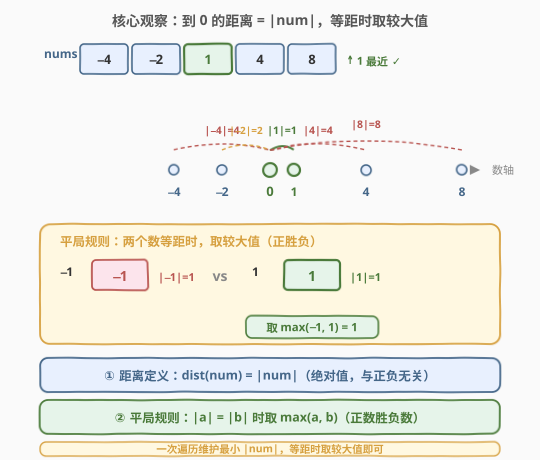
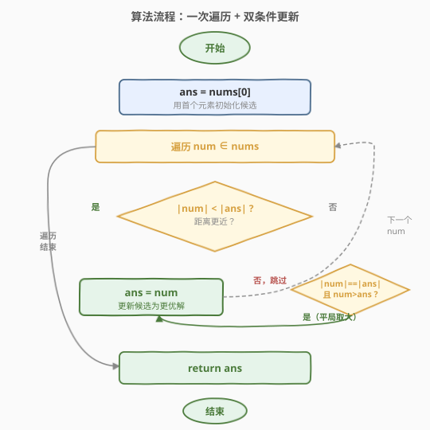
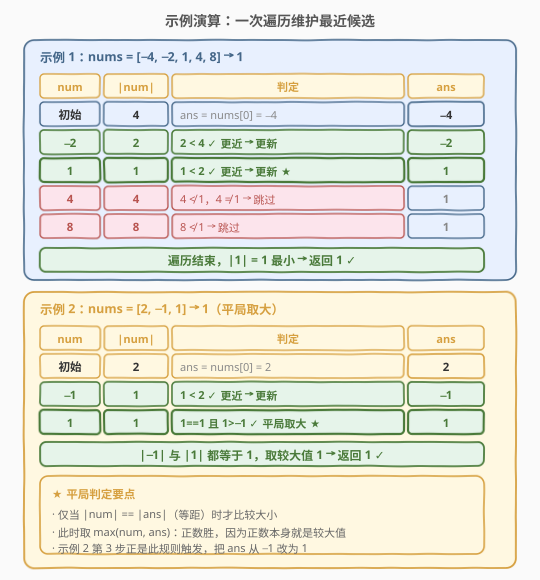

# 找到最接近 0 的数字

- **题目名称**：找到最接近 0 的数字
- **链接**：[2239. 找到最接近 0 的数字](https://leetcode.cn/problems/find-closest-number-to-zero/)
- **难度**：简单
- **标签**：数组

## 1. 题目概述

给定一个长度为 $n$ 的整数数组 `nums`，请你返回 `nums` 中**最接近 0** 的数字。若存在多个答案（即有多个数字到 0 的距离相等），返回它们中的**最大值**。

此处「数字 $x$ 到 0 的距离」定义为 $|x|$（绝对值）。

**示例 1**：

```text
输入：nums = [-4,-2,1,4,8]
输出：1
解释：
-4 到 0 的距离为 |-4| = 4
-2 到 0 的距离为 |-2| = 2
 1 到 0 的距离为 |1|  = 1   ← 最小
 4 到 0 的距离为 |4|  = 4
 8 到 0 的距离为 |8|  = 8
所以返回 1。
```

**示例 2**：

```text
输入：nums = [2,-1,1]
输出：1
解释：1 和 -1 到 0 的距离都为 1（平局），返回较大值 1。
```

**约束条件**：

- $1 \le n \le 1000$
- $-10^5 \le \text{nums}[i] \le 10^5$

> 💡 **题眼**：本质是在数组中找 $|num|$ 最小的元素。唯一坑在于「**等距取较大值**」的平局规则——若只比绝对值、不处理平局，会在 `[-1, 1]` 这类用例上翻车（误返回 $-1$）。这也是 [973. 最接近原点的 K 个点](../0901-1000/973_最接近原点的K个点.md)（$k=1$、二维）与 [658. 找到 K 个最接近的元素](../0601-0700/658_找到K个最接近的元素.md) 的一维 $k=1$ 特例。

---

## 2. 解题思路

### 2.1 暴力思路：排序后取首元素

最直观的「能 AC 但不优」做法是**排序**：按「绝对值升序、值降序」排好，第一个元素即为答案。

```python
nums.sort(key=lambda x: (abs(x), -x))
return nums[0]
```

这样可行，因为排序键 `(abs(x), -x)` 先比绝对值（小的在前），绝对值相同时比 $-x$（小的 $-x$ 意味着大的 $x$ 在前），于是首元素就是「绝对值最小、且平局时值最大」的那个。

问题在于：

1. **排序开销过剩**：我们只需要**一个**最优元素，并不需要全数组的偏序关系。为求一个最小值而把整个数组排好序，是「杀鸡用牛刀」；
2. **时间 $O(n \log n)$**：$n \le 1000$ 时虽不超时，但相比下界 $O(n)$ 多了一个 $\log$ 因子；
3. **空间 $O(\log n)$**：原地排序的递归栈开销。

> ⚠️ 暴力法低效的根源是「**用全局排序解决局部极值**」。求最小值只需线性扫描 + 逐个比较，排序把无关元素的两两关系也算了一遍，纯属浪费。

### 2.2 核心观察：一次遍历 + 双条件更新



**关键洞察**：求「最接近 0 的数字」等价于求 $|num|$ 的最小值，只是平局规则要求在等距时取较大值。这可以用**一次遍历**维护候选 `ans`，配合一条**双条件更新规则**解决：

$$
\text{若}\ \ |x| < |\text{ans}|\ \ \text{或}\ \ (|x| = |\text{ans}|\ \text{且}\ x > \text{ans}),\ \ \text{则}\ \text{ans} \leftarrow x
$$

即对每个 $x \in \text{nums}$：

- **条件一（更近）**：$|x| < |\text{ans}|$，绝对值严格更小，无条件更新；
- **条件二（等距且更大）**：$|x| = |\text{ans}|$ 且 $x > \text{ans}$，平局时取较大值，更新。

两个条件用「或」连接，覆盖所有该更新的情形；其余情况（$|x| > |\text{ans}|$，或等距但 $x \le \text{ans}$）直接跳过。

> 💡 **平局规则的等价改写**：条件二可写成 $|x| = |\text{ans}|$ 且 $x > \text{ans}$。注意当 $|x| = |\text{ans}|$ 时，$x$ 与 $\text{ans}$ 必为「同号且相等」或「互为相反数」两种。前者 $x = \text{ans}$，$x > \text{ans}$ 不成立，不更新（本就是同一个值）；后者 $x = -\text{ans}$，此时「取较大值」就是取正数——这正是「正数胜负数」的由来。

**为什么一次遍历就够？** 极值问题具有**最优子结构**：扫描到第 $i$ 个元素时，前 $i$ 个元素的最优候选只取决于「前 $i-1$ 个的候选」与「第 $i$ 个」的逐对比较。无需回头、无需全局信息，故一趟 $O(n)$ 即可定解，空间仅需 $O(1)$。

> ⚠️ **常见陷阱**：若只写 `if abs(x) < abs(ans): ans = x`（只条件一、漏条件二），在示例 2 `[-1, 1]` 处会保留先出现的 $-1$ 而非取 $1$，结果错误。同理，Python 的 `min(nums, key=abs)` 也踩这个坑——`abs` 相同时 `min` 返回**先出现**的元素，在 `[2,-1,1]` 上会返回 $-1$。平局规则必须显式处理。

### 2.3 算法流程图



1. **初始化**：`ans = nums[0]`（用首个元素作候选，避免对空数组特殊处理；本题 $n \ge 1$）；
2. **遍历**：对每个 `num ∈ nums`：
   - 若 $|\text{num}| < |\text{ans}|$ → `ans = num`（更近，更新）；
   - 否则若 $|\text{num}| = |\text{ans}|$ 且 $\text{num} > \text{ans}$ → `ans = num`（平局取大，更新）；
   - 否则跳过；
3. **返回** `ans`。

> 💡 用 `nums[0]` 初始化后，遍历从第 0 个元素开始也无妨——它与自己比较时两条件均不成立（$|x| = |\text{ans}|$ 且 $x = \text{ans}$，不满足 $x > \text{ans}$），自然跳过，不影响结果。故循环可直接 `for x in nums`，无需特判下标。

### 2.4 示例演算



以两个示例对照「更近更新」与「平局取大」两条规则：

**示例 1** `[-4,-2,1,4,8]`：

| 步骤 | num | $|$num$|$ | 判定 | ans |
|------|-----|-----------|------|-----|
| 初始 | — | 4 | `ans = nums[0] = -4` | -4 |
| 1 | -2 | 2 | $2 < 4$ ✓ 更近 → 更新 | -2 |
| 2 | 1 | 1 | $1 < 2$ ✓ 更近 → 更新 ★ | 1 |
| 3 | 4 | 4 | $4 \not< 1$，$4 \ne 1$ → 跳过 | 1 |
| 4 | 8 | 8 | $8 \not< 1$ → 跳过 | 1 |

遍历结束，$|1|=1$ 最小 → **返回 1** ✓。

**示例 2** `[2,-1,1]`（验证平局规则）：

| 步骤 | num | $|$num$|$ | 判定 | ans |
|------|-----|-----------|------|-----|
| 初始 | — | 2 | `ans = nums[0] = 2` | 2 |
| 1 | -1 | 1 | $1 < 2$ ✓ 更近 → 更新 | -1 |
| 2 | 1 | 1 | $1=1$ 且 $1>-1$ ✓ 平局取大 ★ | 1 |

$|-1|$ 与 $|1|$ 都等于 1，按规则取较大值 1 → **返回 1** ✓。

> 💡 示例 2 第 2 步是全题的「胜负手」：若漏写条件二，`ans` 会停在 $-1$，恰好踩中题目设计的陷阱。这正是本题虽为「简单」却值得一写的原因——它把「绝对值最小」与「平局处理」两件事拆开考。

---

## 3. 参考代码

### C++

```cpp
class Solution {
public:
    int findClosestNumber(vector<int>& nums) {
        int ans = nums[0];
        for (int x : nums) {
            if (abs(x) < abs(ans) || (abs(x) == abs(ans) && x > ans)) {
                ans = x;
            }
        }
        return ans;
    }
};
```

> 💡 `abs` 对 `int` 取绝对值，本题 $|\text{nums}[i]| \le 10^5$ 远小于 `int` 上界，无溢出风险。两个条件用 `||` 短路：条件一成立时不再计算条件二，逻辑清晰且高效。

### Python

```python
class Solution:
    def findClosestNumber(self, nums: List[int]) -> int:
        ans = nums[0]
        for x in nums:
            if abs(x) < abs(ans) or (abs(x) == abs(ans) and x > ans):
                ans = x
        return ans
```

> 💡 **一行优雅写法**（利用 `min` 的多键排序）：
>
> ```python
> return min(nums, key=lambda x: (abs(x), -x))
> ```
>
> `min` 按元组 `(abs(x), -x)` 比较取最小：先比 $|x|$（小者优先），$|x|$ 相同时比 $-x$（小者 $-x$ 即大者 $x$ 优先）——恰好等价于「绝对值最小、平局取较大值」。注意**不能**写成 `key=abs`，否则平局时 `min` 返回先出现的元素（示例 2 会误得 $-1$）。

---

## 4. 复杂度分析

| 维度 | 复杂度 | 说明 |
|------|--------|------|
| 时间 | $O(n)$ | 一次遍历，每个元素做 $O(1)$ 的两次绝对值比较与一次大小比较 |
| 空间 | $O(1)$ | 仅维护候选变量 `ans`，无额外数据结构 |

> 💡 对比排序暴力 $O(n \log n)$：本题只需一个极值，线性扫描已触达下界——任何算法至少要看过每个元素一眼（否则可能漏掉更近的），故 $O(n)$ 是最优。$n \le 1000$ 时排序也能 AC，但面试中应首选线性解法以体现「按需计算」的意识。

---

## 5. 扩展：从「找 1 个」到「找 K 个」

本题是「在数组中按某距离指标找极值」家族的 $k=1$ 特例。把 $k$ 放宽，就进入 **Top-K** 领域：

**找 K 个最接近 0 的数字**：不再返回单个 `ans`，而是返回距离最小的 $k$ 个数（平局规则可类推）。此时一次遍历维护单个候选不够，需引入 Top-K 结构：

- **堆（最小/最大堆）**：维护大小为 $k$ 的堆，遍历每个元素与堆顶比较，$O(n \log k)$ 时间、$O(k)$ 空间。适合 $k \ll n$ 或在线流式数据。
- **快速选择（Quickselect）**：基于 partition 找第 $k$ 小的距离，平均 $O(n)$、最坏 $O(n^2)$（随机化后极大概率线性），再收集前 $k$ 个。适合 $k$ 较大、一次性求离线 Top-K。

这正是 [973. 最接近原点的 K 个点](../0901-1000/973_最接近原点的K个点.md)（距离从 $|x|$ 升级为 $\sqrt{x^2+y^2}$，$k$ 个）与 [658. 找到 K 个最接近的元素](../0601-0700/658_找到K个最接近的元素.md)（距离从到 0 改为到 $x$，$k$ 个）的考点。当 $k=1$ 时，两者都退化为「一次遍历维护极值」的本题，无需堆或快选。

> 💡 **方法论**：凡「按某指标找极值」——$k=1$ 用线性扫描 + 比较规则；$k>1$ 用堆（$O(n\log k)$）或快速选择（平均 $O(n)$）。判断阈值在于「是否只需一个最优解」：是 → 线性；否 → Top-K 结构。

---

## 6. 面试要点

1. **这道简单题的考点在哪？**

   - 表面是「找绝对值最小的数」，一行 `min` 似乎就能搞定。真正考点是**平局规则**：能否意识到 `min(key=abs)` 在等距时会返回先出现的元素（可能是负数），从而漏掉「取较大值」的要求，并给出显式的双条件更新或正确的多键排序 `key=(abs, -x)`。

2. **为什么用 `nums[0]` 初始化 `ans`？能否用 `INT_MAX`？**

   - 用 `nums[0]` 初始化可保证 `ans` 始终是数组中真实存在的元素，逻辑自然且无需对空数组特判（本题 $n \ge 1$）。若用 `INT_MAX` 初始化，需额外处理「绝对值比较」的语义且无实际收益。从 `nums[0]` 起遍历，首个元素与自身比较不触发更新，结果正确。

3. **`min(nums, key=abs)` 为什么错？**

   - `min` 在键值相同时返回**最先出现**的元素。对 `[2,-1,1]`，`-1` 与 `1` 的 `abs` 都为 1，`-1` 先出现故返回 $-1$，但题目要求平局取较大值 $1$。正确写法是 `key=lambda x: (abs(x), -x)`，让平局时较大值排在前面。

4. **为什么一次遍历 $O(n)$ 是最优？**

   - 找极值必须至少「看」过每个元素一次，否则未看过的元素可能更近，无法保证正确性。故 $O(n)$ 是该问题的下界。排序法 $O(n\log n)$ 多出的开销来自计算无关元素间的偏序，对求单个极值是浪费。

5. **如果改问「找 K 个最接近 0 的数」怎么做？**

   - 升级为 Top-K：$k$ 较小用大小为 $k$ 的堆（最大堆维护「当前最近的 $k$ 个」中距离最大者作堆顶），$O(n\log k)$；$k$ 较大用快速选择，平均 $O(n)$。本题即 $k=1$ 的退化——堆退化为单变量、快选退化为线性扫描。详见 [973](../0901-1000/973_最接近原点的K个点.md)、[658](../0601-0700/658_找到K个最接近的元素.md)。

> 💡 **一句话总结**：2239 的最优解是「一次遍历 + 双条件更新」——$|x|<|\text{ans}|$ 更近则换，$|x|=|\text{ans}|$ 且 $x>\text{ans}$ 平局取大则换。它价值不在代码量，而在借这道签到题讲清「极值问题的线性下界」与「平局规则必须显式处理」两点，并自然延伸到 Top-K（$k>1$）家族。

---

## 7. 同类练习题

- [973. 最接近原点的 K 个点](https://leetcode.cn/problems/k-closest-points-to-origin/)（[题解](../0901-1000/973_最接近原点的K个点.md)）：本题的二维 + $k$ 个版，距离从 $|x|$ 升级为 $\sqrt{x^2+y^2}$，需用堆或快速选择求 Top-K
- [658. 找到 K 个最接近的元素](https://leetcode.cn/problems/find-k-closest-elements/)（[题解](../0601-0700/658_找到K个最接近的元素.md)）：把「到 0 的距离」换成「到 $x$ 的距离」并取 $k$ 个，二分 + 双指针收缩的招牌题
- [347. 前 K 个高频元素](https://leetcode.cn/problems/top-k-frequent-elements/)（[题解](../0301-0400/347_前K个高频元素.md)）：Top-K 的频率版，桶排序 / 堆 / 快速选择三解法对照
- [215. 数组中的第K个最大元素](https://leetcode.cn/problems/kth-largest-element-in-an-array/)（[题解](../0201-0300/215_数组中的第K个最大元素.md)）：快速选择母题，$k=1$ 即最大值退化为线性扫描，与本题「$k=1$ 退化」同构
- [912. 排序数组](https://leetcode.cn/problems/sort-an-array/)（[题解](../0901-1000/912_排序数组.md)）：第 2.1 节排序暴力的母题，对照「排序求极值」与「线性求极值」的复杂度差距
