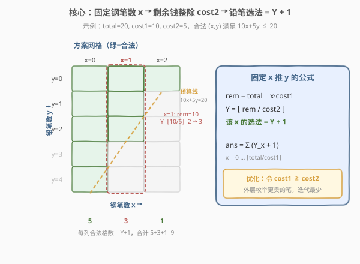
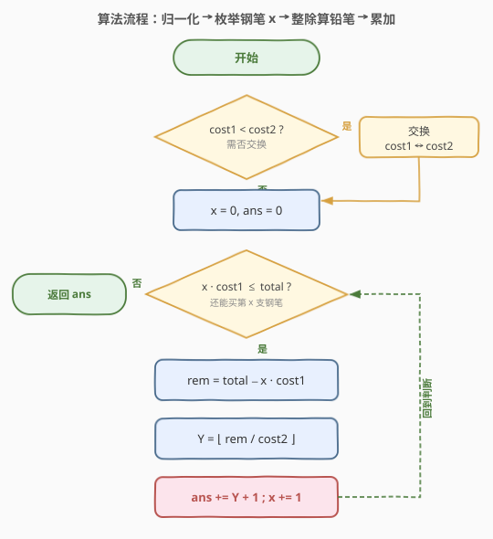
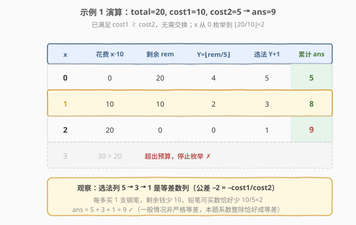

# 买钢笔和铅笔的方案数

- **题目名称**：买钢笔和铅笔的方案数
- **链接**：[2240. 买钢笔和铅笔的方案数](https://leetcode.cn/problems/number-of-ways-to-buy-pens-and-pencils/)
- **难度**：中等
- **标签**：数学、枚举

## 1. 题目概述

给定总钱数 `total`，以及一支钢笔的价格 `cost1` 和一支铅笔的价格 `cost2`。你可以花费**部分或全部**的钱，购买任意数目的两种笔（每种数量 $\ge 0$）。求购买钢笔和铅笔的**不同方案数目**。两种数量组合 $(x, y)$ 不同即视为不同方案。

**示例 1**：

```text
输入：total = 20, cost1 = 10, cost2 = 5
输出：9
解释：钢笔 10 元/支，铅笔 5 元/支。
- 买 0 支钢笔：可买 0、1、2、3、4 支铅笔 → 5 种
- 买 1 支钢笔：可买 0、1、2 支铅笔     → 3 种
- 买 2 支钢笔：可买 0 支铅笔           → 1 种
合计 5 + 3 + 1 = 9 种。
```

**示例 2**：

```text
输入：total = 5, cost1 = 10, cost2 = 10
输出：1
解释：两样都贵过总钱数，只能 0 支钢笔 + 0 支铅笔，仅 1 种方案。
```

**约束条件**：

- $1 \le \text{total}, \text{cost1}, \text{cost2} \le 10^6$

> 💡 **题眼**：方案由「钢笔数 $x$、铅笔数 $y$」唯一确定，且约束是线性不等式 $x \cdot \text{cost1} + y \cdot \text{cost2} \le \text{total}$。固定一个变量后，另一个变量的合法取值是连续整数区间，长度可在 $O(1)$ 内算出——这是典型的「**枚举一维、$O(1)$ 推另一维**」计数模型。

---

## 2. 解题思路

### 2.1 暴力思路：双层循环数对

最直白的写法：枚举钢笔数 $x$ 从 $0$ 到 $\lfloor \text{total}/\text{cost1} \rfloor$，再嵌套枚举铅笔数 $y$ 从 $0$ 到 $\lfloor (\text{total}-x\cdot\text{cost1})/\text{cost2} \rfloor$，每命中一组 $(x, y)$ 就 $+1$。

问题在于：

1. **内层是冗余遍历**：对固定的 $x$，合法的 $y$ 一旦确定上界 $Y = \lfloor \text{rem}/\text{cost2} \rfloor$（其中 $\text{rem} = \text{total} - x\cdot\text{cost1}$），合法取值就是 $0, 1, \dots, Y$ 共 $Y + 1$ 个——根本不用一个个数，直接 $+ (Y + 1)$ 即可；
2. **规模风险**：当 $\text{cost1}$ 较小（如 1）而 $\text{cost2}$ 也较小时，$Y$ 可达 $10^6$，内层逐个累加会到 $10^{12}$ 量级，必然超时。

> ⚠️ 暴力法慢的根源是「**把一个 $O(1)$ 可算的区间长度退化成逐点计数**」。内层 $y$ 的合法值是连续整数，个数等于上界 $+1$，没必要真的循环。

### 2.2 核心观察：固定一维，另一维用整除求区间长度



**关键洞察**：方案的约束是 $x \cdot \text{cost1} + y \cdot \text{cost2} \le \text{total}$。**固定 $x$** 后，把它看作常数，约束变成关于 $y$ 的一元不等式：

$$y \le \frac{\text{total} - x \cdot \text{cost1}}{\text{cost2}}$$

由于 $y$ 是非负整数，合法取值为 $y \in \{0, 1, \dots, Y_x\}$，其中

$$Y_x = \left\lfloor \frac{\text{total} - x \cdot \text{cost1}}{\text{cost2}} \right\rfloor$$

于是对固定的 $x$，铅笔有 $Y_x + 1$ 种选法。答案即对所有合法 $x$ 求和：

$$\text{ans} = \sum_{x=0}^{\lfloor \text{total}/\text{cost1} \rfloor} \left( \left\lfloor \frac{\text{total} - x \cdot \text{cost1}}{\text{cost2}} \right\rfloor + 1 \right)$$

> 💡 **降维思想**：二维计数 $(x, y)$ 通过「固定一维 + 整除求另一维区间长度」压成了一维求和。每项 $O(1)$，总复杂度由**外层枚举次数**决定。

**优化外层枚举次数**：上式中 $x$ 的范围是 $0 \dots \lfloor \text{total}/\text{cost1} \rfloor$，共 $\lfloor \text{total}/\text{cost1} \rfloor + 1$ 项。由于方案对两种笔对称（交换 $x, y$ 与 $\text{cost1}, \text{cost2}$ 不改变答案），可令外层枚举**单价更贵**的那种笔，使枚举次数最小化：

$$\text{枚举次数} = \left\lfloor \frac{\text{total}}{\max(\text{cost1}, \text{cost2})} \right\rfloor + 1 \le \frac{10^6}{1} + 1 \approx 10^6$$

实现时若 $\text{cost1} < \text{cost2}$，先交换两者，再以 $\text{cost1}$（现已是较大者）作为外层。

### 2.3 算法流程图



1. **归一化**：若 $\text{cost1} < \text{cost2}$，交换两者（保证外层枚举单价更大的笔，减少迭代次数）；
2. **枚举**：$x$ 从 $0$ 到 $\lfloor \text{total}/\text{cost1} \rfloor$，对每个 $x$：
   - 计算剩余钱 $\text{rem} = \text{total} - x \cdot \text{cost1}$；
   - 铅笔最多买 $Y = \lfloor \text{rem}/\text{cost2} \rfloor$ 支，贡献 $Y + 1$ 种方案；
   - $\text{ans} \mathrel{+}= Y + 1$；
3. **返回** $\text{ans}$。

> 💡 第 1 步的交换是**优化**而非正确性需要——不交换答案也对，只是当某一种笔特别便宜时枚举次数会偏大。交换利用了「两笔对称、答案不变」的性质，把迭代上界从 $\text{total}/\min$ 降到 $\text{total}/\max$。

### 2.4 示例演算



以示例 1 展开（$\text{total}=20$，$\text{cost1}=10$，$\text{cost2}=5$；已满足 $\text{cost1} \ge \text{cost2}$ 无需交换）：

| 钢笔数 $x$ | 花费 $x\cdot10$ | 剩余 $\text{rem}$ | $Y=\lfloor\text{rem}/5\rfloor$ | 铅笔选法 $Y+1$ | 累计 $\text{ans}$ |
|------------|-----------------|-------------------|-------------------------------|----------------|-------------------|
| 0 | 0 | 20 | 4 | 5 | 5 |
| 1 | 10 | 10 | 2 | 3 | 8 |
| 2 | 20 | 0 | 0 | 1 | 9 |

$x=3$ 时 $x\cdot10=30>20$ 超出枚举范围，停止。**答案 = 9** ✓。

> 💡 观察累加列 $5, 3, 1$：随 $x$ 增大，剩余钱线性递减，铅笔选法数也呈等差数列递减。这正是「固定一维后另一维是整除线性函数」的直观体现——本例中每多买 1 支钢笔，铅笔可买数恰好少 2（因 $\text{cost1}/\text{cost2} = 2$）。

---

## 3. 参考代码

### C++

```cpp
class Solution {
public:
    long long waysToBuyPensPencils(int total, int cost1, int cost2) {
        if (cost1 < cost2) swap(cost1, cost2);
        long long ans = 0;
        for (int x = 0; (long long)x * cost1 <= total; ++x) {
            int rem = total - x * cost1;
            ans += rem / cost2 + 1;
        }
        return ans;
    }
};
```

> ⚠️ `total` 与 `cost` 上界 $10^6$，但答案本身可达 $\sum$ 量级（最坏 $\sim 10^{12}$），必须用 `long long` 累加。循环条件写成 `(long long)x * cost1 <= total` 防止 `int` 乘法在边界溢出。

### Python

```python
class Solution:
    def waysToBuyPensPencils(self, total: int, cost1: int, cost2: int) -> int:
        if cost1 < cost2:
            cost1, cost2 = cost2, cost1
        ans = 0
        x = 0
        while x * cost1 <= total:
            rem = total - x * cost1
            ans += rem // cost2 + 1
            x += 1
        return ans
```

> 💡 Python 整数无溢出，写法更简洁。也可用 `for x in range(total // cost1 + 1)` 控制循环，等价且更清晰。交换那行保证外层枚举更贵的笔，是常数优化。

---

## 4. 复杂度分析

| 维度 | 复杂度 | 说明 |
|------|--------|------|
| 时间 | $O\!\left(\dfrac{\text{total}}{\max(\text{cost1},\text{cost2})}\right)$ | 外层枚举钢笔数 $x$，次数为 $\lfloor\text{total}/\text{cost1}\rfloor+1$（交换后 $\text{cost1}=\max$）；每项整除 $O(1)$ |
| 空间 | $O(1)$ | 仅若干累加变量，不随输入规模增长 |

> 💡 最坏情况 $\max(\text{cost1},\text{cost2}) = 1$ 时枚举 $\sim 10^6$ 次，每次 $O(1)$，约 $10^6$ 次整除运算，远在时限内。若不交换，当一种笔单价为 1 而另一种为 $10^6$ 时，枚举次数仍可能达 $10^6$——但交换后恒为 $\text{total}/\max$，是最紧的上界。

---

## 5. 扩展：超大 total 时的 O(log) 求和

本题 $\text{total} \le 10^6$，线性枚举足矣。若把 $\text{total}$ 放大到 $10^{18}$，线性枚举不再可行，需把求和

$$\text{ans} = \sum_{x=0}^{n} \left( \left\lfloor \frac{\text{total} - x\cdot\text{cost1}}{\text{cost2}} \right\rfloor + 1 \right),\quad n = \left\lfloor \frac{\text{total}}{\text{cost1}} \right\rfloor$$

在 $O(\log(\text{cost1} + \text{cost2}))$ 内算出。这本质是**类欧几里得算法**（又称 `floor_sum`）：求 $\sum_{i=0}^{n-1} \lfloor (a\cdot i + b)/m \rfloor$。核心做法与辗转相除同构——通过取模把 $a \ge m$ 的部分剥离成等差数列，再把 $a < m$ 的部分「翻转」坐标系转化为一个新的更小规模的同类求和，每轮使系数规模减半，故为 $O(\log)$。AtCoder 库的 `floor_sum` 即此算法的实现。日常面试题用不到，但在积分几何、数论计数中常见。

> 💡 **方法论**：凡「对一维枚举、每项是 $\lfloor$ 线性函数 $\rfloor$」的求和，线性枚举是默认解；只有当枚举量超大且每项形式规整时，才考虑类欧几里得 / floor_sum 降到对数级。

---

## 6. 面试要点

1. **为什么固定一维后另一维的方案数是 Y + 1 而非 Y？**

   - 固定 $x$ 后 $y$ 的合法取值是 $0, 1, \dots, Y$（$Y = \lfloor\text{rem}/\text{cost2}\rfloor$），含 $0$ 在内共 $Y + 1$ 个。易错点是误把上界 $Y$ 当成个数而漏算「$y=0$」这一种。题目允许「买 0 支」，必须 $+1$。

2. **为什么要交换 cost1、cost2，交换会改变答案吗？**

   - 不会。方案 $(x, y)$ 满足 $x\cdot\text{cost1} + y\cdot\text{cost2} \le \text{total}$，交换两种笔只是把 $(x, y)$ 与坐标轴对调，方案集合不变，答案不变。交换是为了让外层枚举单价**更大**的笔，使 $\lfloor\text{total}/\text{cost1}\rfloor$ 更小、迭代更少，属常数优化。

3. **答案为什么可能很大、要用 long long？**

   - 最坏 $\text{cost1}=\text{cost2}=1$、$\text{total}=10^6$ 时，方案数 $\approx \sum_{x=0}^{10^6}(10^6 - x + 1) \approx 5\times10^{11}$，远超 `int` 上界 $\sim2\times10^9$。C++ 必须用 `long long` 累加与返回（函数返回类型也是 `long long`）。

4. **能否不交换、直接双层 for 数对？**

   - 能过小数据但大规模会超时：内层逐个计数把 $O(1)$ 的区间长度算成了 $O(Y)$，最坏 $O(\text{total}^2)$。核心优化就是用整除把内层压成 $O(1)$，这是「区间计数」与「逐点枚举」的分水岭。

5. **这类「固定一维、整除推另一维」的计数何时适用？**

   - 当约束是**线性不等式** $a\cdot x + b\cdot y \le c$（$a, b > 0$），且变量非负整数时。固定 $x$ 后 $y$ 的合法值是连续整数区间 $[0, \lfloor(c - a x)/b\rfloor]$，长度整除即得。若约束涉及「整除关系」「倍数」「互质」等，常配合整除分块或类欧几里得进一步优化。

---

## 7. 同类练习题

- [2176. 统计数组中相等且可以被整除的数对](https://leetcode.cn/problems/count-equal-and-divisible-pairs-in-an-array/)（[题解](../2101-2200/2176_统计数组中相等且可以被整除的数对.md)）：双重枚举计数对，本题的「双变量枚举」退化版，无整除求区间长度的技巧，作对照
- [2177. 找到和为给定整数的三个连续整数](https://leetcode.cn/problems/find-three-consecutive-integers-that-sum-to-a-given-number/)（[题解](../2101-2200/2177_找到和为给定整数的三个连续整数.md)）：线性等式约束下定位整数解，承接「固定约束推变量」思路，等式版
- [2198. 单因数三元组](https://leetcode.cn/problems/single-factor-triple/)（[题解](../2101-2200/2198_单因数三元组.md)）：枚举因子组合计数三元组，同样是「枚举一维 + 数合法搭配」的计数模型
- [2180. 统计各位数字之和为偶数的整数个数](https://leetcode.cn/problems/count-integers-with-even-digit-sum/)（[题解](../2101-2200/2180_统计各位数字之和为偶数的整数个数.md)）：在一段连续整数范围内计数满足性质的数，区间计数思想的近邻
- [2931. 购买两件物品的最大花费](https://leetcode.cn/problems/maximum-spending-after-buying-items/)：在预算约束下枚举物品组合的近邻变体，把「计数方案」换成「求最优方案」，体会同一约束模型的不同问法
