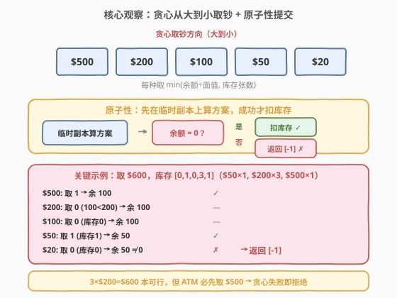
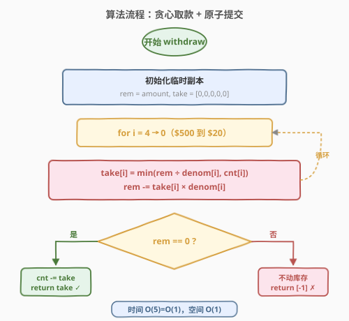
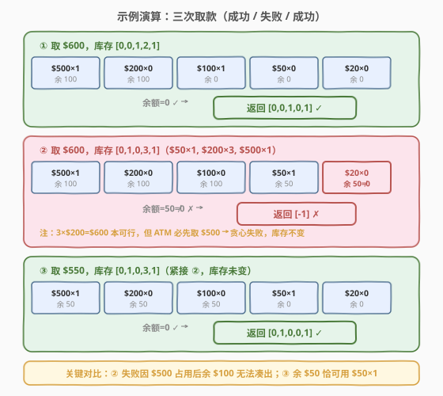

# LeetCode 设计一个ATM机器 题解

## 1. 题目概述

- **标题 / 题号**：设计一个ATM机器（#2241，medium）
- **链接**：https://leetcode.cn/problems/design-an-atm-machine/
- **难度**：中等
- **标签**：贪心、设计、数组、模拟

**题意**：设计一个 ATM 机器，存有 5 种面值的钞票：**$20**、**$50**、**$100**、**$200**、**$500**（下标 0–4）。初始时机器为空，支持两种操作：

- `deposit(banknotesCount)`：存入钞票，`banknotesCount` 为长度 5 的数组，分别表示 $20、$50、$100、$200、$500 的张数。
- `withdraw(amount)`：取款 `amount` 美元。机器**优先取较大面值**的钞票，返回长度 5 的数组表示各面值取出的张数，并更新库存。若**无法精确凑出**该数额，返回 `[-1]` 且**不取出任何钞票**（库存不变）。

**示例 1**：

```text
输入：
["ATM", "deposit", "withdraw", "deposit", "withdraw", "withdraw"]
[[], [[0,0,1,2,1]], [600], [[0,1,0,1,1]], [600], [550]]
输出：
[null, null, [0,0,1,0,1], null, [-1], [0,1,0,0,1]]

解释：
atm.deposit([0,0,1,2,1]);  // 库存：$100×1, $200×2, $500×1
atm.withdraw(600);         // 取 $500×1 + $100×1 = 600 → [0,0,1,0,1] ✓
                            // 库存变为 [0,0,0,2,0]
atm.deposit([0,1,0,1,1]);  // 库存变为 [0,1,0,3,1]
atm.withdraw(600);         // 贪心先取 $500×1，余 $100 无法凑出 → [-1] ✗
                            // 库存不变 [0,1,0,3,1]
atm.withdraw(550);         // 取 $500×1 + $50×1 = 550 → [0,1,0,0,1] ✓
```

**约束**：

- `banknotesCount.length == 5`
- $0 \le \text{banknotesCount}[i] \le 10^9$
- $1 \le \text{amount} \le 10^9$
- 总共最多有 $5000$ 次 `withdraw` 和 `deposit` 调用

> 💡 题眼在于「**优先取较大面值**」——这是 ATM 的**行为定义**，不是优化目标。机器永远从 $500 到 $20 依次贪心取钞，即使存在其他组合能凑出金额，只要贪心凑不出就返回 `[-1]`。示例中 `withdraw(600)` 第二次失败正是此原因：3×$200=600 本可行，但机器必须先取 $500，剩余 $100 无法凑出。

## 2. 解题思路

### 2.1 暴力思路：搜索所有组合

最直觉的误解是：「需要判断是否存在**任意**组合能凑出 `amount`」，于是用 DFS/回溯枚举每种面值取多少张。这会导致指数级搜索空间，且完全忽略了题目「优先取较大面值」的行为约束——ATM 的取款方式是**确定的贪心**，不存在「选择」。

> ⚠️ 最大的陷阱不是算法复杂度，而是**误读题意**：把「优先取较大面值」理解为「在所有可行解中选贪心那个」，实际上它的含义是「机器只会贪心取钞，贪心失败就拒绝」。理解这一点后，问题立即退化为 $O(5)$ 的贪心模拟。

### 2.2 核心观察：贪心模拟 + 原子性提交



关键认识有三层：

1. **贪心从大到小**：从 $500 到 $20 依次处理，每种面值取 $\min(\text{余额} \div \text{面值},\ \text{库存})$ 张。这是 ATM 的固定行为，无需搜索、无需回溯。

2. **原子性（先算后扣）**：取款必须**全部成功或全部不动**。若直接边取边扣库存，中途失败时已修改的状态难以回滚。正确做法是**先在临时副本上算出取款方案**，余额归零才提交（扣减真实库存），否则原样返回 `[-1]`。

3. **贪心不一定找到解**：面值 $50 不是 $20 的倍数，存在贪心失败但其他组合可行的情况（如取 $60：贪心取 $50 余 $10 失败，但 3×$20 可行）。但 ATM 的行为定义为贪心，故仍返回 `[-1]`——这是**题意决定**而非算法缺陷。

> ⚠️ **溢出**：单次 `deposit` 最多 $10^9$ 张，$5000$ 次调用后库存可达 $5 \times 10^{12}$，远超 32 位 `int` 范围（$\approx 2 \times 10^9$）。C++ 必须用 `long long` 存储库存；Python 无此问题。

### 2.3 算法流程图



算法步骤总结：

1. **初始化**：`rem = amount`，`take = [0,0,0,0,0]`（临时方案，不碰真实库存）。
2. **贪心循环**：`i` 从 4 到 0（$500 到 $20），`take[i] = min(rem ÷ denom[i], cnt[i])`，`rem -= take[i] × denom[i]`。
3. **判定提交**：若 `rem == 0`，扣减真实库存 `cnt[i] -= take[i]`，返回 `take`；否则返回 `[-1]`，库存不变。

### 2.4 示例演算

以示例 1 的三次 `withdraw` 逐步演算，对照成功与失败：



| 操作 | 库存 | 贪心过程 | 余额 | 结果 |
|------|------|----------|------|------|
| ① 取 600 | [0,0,1,2,1] | $500×1→余100, $100×1→余0 | 0 | [0,0,1,0,1] ✓ |
| ② 取 600 | [0,1,0,3,1] | $500×1→余100, $50×1→余50, $20×0→余50 | 50≠0 | [-1] ✗ |
| ③ 取 550 | [0,1,0,3,1] | $500×1→余50, $50×1→余0 | 0 | [0,1,0,0,1] ✓ |

> 💡 **关键对比**：② 与 ③ 的库存相同，仅取款金额不同。② 取 600 时贪心拿走 $500 后余 $100，库存中无 $100、$200 太大、$50 仅 1 张（凑 50 还差 50）、无 $20 → 失败。③ 取 550 时贪心拿走 $500 后余 $50，恰好 1 张 $50 可用 → 成功。这说明了贪心行为下，**余数能否被剩余小面值精确整除**是成功与否的关键。

## 3. 参考代码

### C++：贪心 + 临时副本（$O(1)$ / $O(1)$）

```cpp
class ATM {
    long long cnt[5];
    static constexpr int denom[5] = {20, 50, 100, 200, 500};
public:
    ATM() {
        fill(cnt, cnt + 5, 0LL);
    }

    void deposit(vector<int>& banknotesCount) {
        for (int i = 0; i < 5; ++i)
            cnt[i] += banknotesCount[i];
    }

    vector<int> withdraw(int amount) {
        long long take[5] = {0};
        long long rem = amount;
        for (int i = 4; i >= 0 && rem > 0; --i) {
            take[i] = min(rem / denom[i], cnt[i]);
            rem -= take[i] * denom[i];
        }
        if (rem != 0) return {-1};
        for (int i = 0; i < 5; ++i)
            cnt[i] -= take[i];
        return {(int)take[0], (int)take[1], (int)take[2], (int)take[3], (int)take[4]};
    }
};
```

### Python：贪心 + 临时副本（$O(1)$ / $O(1)$）

```python
class ATM:
    def __init__(self):
        self.cnt = [0] * 5
        self.denom = [20, 50, 100, 200, 500]

    def deposit(self, banknotesCount: List[int]) -> None:
        for i in range(5):
            self.cnt[i] += banknotesCount[i]

    def withdraw(self, amount: int) -> List[int]:
        take = [0] * 5
        rem = amount
        for i in range(4, -1, -1):
            take[i] = min(rem // self.denom[i], self.cnt[i])
            rem -= take[i] * self.denom[i]
        if rem != 0:
            return [-1]
        for i in range(5):
            self.cnt[i] -= take[i]
        return take
```

> 💡 两版代码结构完全一致：`withdraw` 中 `take` 是局部变量（临时副本），只在 `rem == 0` 时才写回 `self.cnt`/`cnt`。这保证了失败时库存零修改的原子性。C++ 中 `cnt` 用 `long long` 防溢出，`take` 的值不超过 `amount / 20`（$\le 5 \times 10^7$），最终强转 `int` 安全。

## 4. 复杂度分析

| 维度 | 复杂度 | 说明 |
|------|--------|------|
| **时间复杂度** | $O(1)$ | 固定 5 种面值，`withdraw` 和 `deposit` 均为常数次循环 |
| **空间复杂度** | $O(1)$ | 仅维护 5 个库存计数 + 5 个临时方案槽，常数空间 |

> 💡 严格来说单次操作是 $O(5) = O(1)$，与 `amount` 和库存大小无关。$5000$ 次调用总计 $O(5000)$。若面值种类数推广为 $k$，则单次操作为 $O(k)$。

## 5. 扩展：贪心一定正确吗？

本题的贪心是**题目规定的 ATM 行为**，不是我们选择的算法策略。但一个自然的问题是：对于面值 $[20, 50, 100, 200, 500]$，贪心是否总能在**有解时**找到解？

**答案：不能。** 关键在于 $50$ 不是 $20$ 的倍数——两者之间不存在整除关系，导致贪心可能「拿了大的，剩的零头小的凑不出」。

**反例**：ATM 有充足的 $50 和 $20 钞票，取 $60。

| 贪心过程 | 结果 |
|----------|------|
| $50: 取 min(60÷50, ∞) = 1，余 10 | 余 10 |
| $20: 取 min(10÷20, ∞) = 0，余 10 | 余 10 ≠ 0 |
| → 返回 [-1] | ✗ 失败 |

但 $3 \times 20 = 60$ 完全可行。ATM 因「优先取大面值」而拒绝了一笔本可完成的取款。

**贪心有解的充分条件**：若每种面值都是更小面值的**整数倍**（即面值序列满足「规范硬币系统」），则贪心总能在有解时找到解。本题 $100 = 2 \times 50$、$200 = 2 \times 100$，但 $50 \neq k \times 20$，打破了这一链条。

> ⚠️ 若题目改为「求**任意**能凑出 amount 的方案」（不限定贪心），则需用 DP（类似 [322. 零钱兑换](../0301-0400/322_零钱兑换.md)），但 `amount` 达 $10^9$ 使 DP 数组不可行，需改用数学分析或同余理论——这已超出本题范围。

## 6. 面试要点

1. **「优先取较大面值」是什么意思？是优化目标还是行为约束？**

   - 是**行为约束**。ATM 永远从 $500 到 $20 依次贪心取钞，不存在「在多个可行方案中择优」的逻辑。贪心凑不出就返回 `[-1]`，即使其他组合能凑出。这是本题最大的理解陷阱。

2. **为什么要在临时副本上算，而不是直接改库存？**

   - 取款要求**原子性**：要么全部成功，要么库存零修改。若边取边扣，中途发现凑不出时已破坏了库存，需逐个回滚——容易出错。先在局部 `take` 数组上算完，确认 `rem == 0` 后一次性提交，是更安全的设计模式（类似数据库事务的「先写日志后提交」）。

3. **为什么 C++ 要用 `long long`？Python 不用？**

   - 单次 `deposit` 最多 $10^9$ 张，$5000$ 次调用后单面值库存可达 $5 \times 10^{12}$，超过 32 位 `int` 上限 $\approx 2.1 \times 10^9$。C++ 的 `int` 会溢出，必须用 `long long`。Python 整数任意精度，无需处理。`take` 的值不超过 `amount / 20` $\le 5 \times 10^7$，转 `int` 安全。

4. **贪心一定能找到解吗？举一个反例。**

   - 不能。面值 $[20, 50]$ 中 $50$ 不是 $20$ 的倍数。取 $60$：贪心先取 $50 \times 1$ 余 $10$，$20$ 凑不出 $10$ → 失败。但 $3 \times 20 = 60$ 可行。贪心有解的充分条件是面值序列满足「每种大面值是小面值的整数倍」，本题因 $50 \not\mid 20$ 不满足。

5. **如果面试官追问「不用贪心，判断是否有任意组合能凑出」怎么做？**

   - 转为完全背包/硬币问题（类似 [322. 零钱兑换](../0301-0400/322_零钱兑换.md)）。但 `amount` 达 $10^9$，DP 数组空间不可行。可考虑：分析 $20$ 和 $50$ 的组合（Frobenius 数 $\text{gcd}(20,50)=10$，大于某阈值后所有 10 的倍数都可表示），结合大面值贪心预扣——但这是另一个问题了。

> 💡 **一句话总结**：2241 是一道「读题即算法」的设计题——理解了「贪心是行为约束、失败即拒绝、库存需原子提交」三点后，代码就是一个 $O(5)$ 的贪心循环。考点不在算法复杂度，而在题意理解的准确性与工程上对原子性、溢出的处理意识。

## 同类练习题

| # | 题目 | 与本题的关联 |
|---|------|-------------|
| 322 | [零钱兑换](../0301-0400/322_零钱兑换.md)（[题解](../0301-0400/322_零钱兑换.md)） | 完全背包 DP 求最少硬币数，与本题形成「贪心 vs DP」对照——贪心不总正确时需 DP |
| 146 | [LRU 缓存](../0101-0200/146_LRU缓存.md)（[题解](../0101-0200/146_LRU缓存.md)） | 经典数据结构设计题，与本题同属「设计类」题型，考察工程实现细节 |
| 460 | [LFU 缓存](../0401-0500/460_LFU缓存.md)（[题解](../0401-0500/460_LFU缓存.md)） | 更复杂的设计题，频率桶 + 哈希，对照本题的简单数组设计 |
| 860 | [柠檬水找零](https://leetcode.cn/problems/lemonade-change/) | 贪心找零模拟，$5/$10/$20 面值间找零，与本题同属贪心取钞家族但面值更简单（贪心一定正确） |
| 1405 | [最长快乐字符串](https://leetcode.cn/problems/longest-happy-string/) | 贪心构造，每次取最多的字符，与本题「优先取大面值」的贪心思想相通 |
