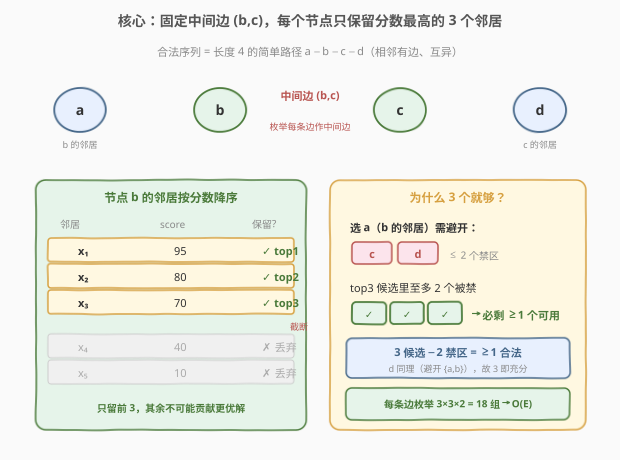
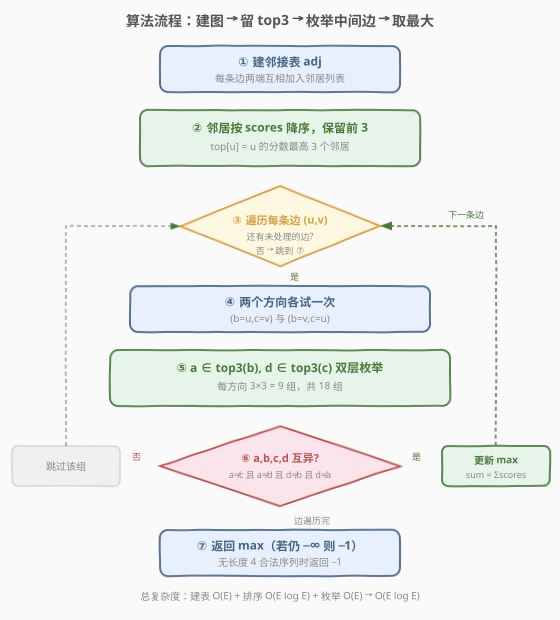

# 节点序列的最大得分

- **题目名称**：节点序列的最大得分
- **链接**：[2242. 节点序列的最大得分](https://leetcode.cn/problems/maximum-score-of-a-node-sequence/)
- **难度**：困难
- **标签**：图、贪心、枚举

## 1. 题目概述

给定一个 $n$ 个节点的**无向图**，节点编号 $0$ 到 $n-1$。每个节点 $i$ 有一个分数 `scores[i]`。同时给定边集 `edges`，其中 `edges[i] = [ai, bi]` 表示节点 `ai` 与 `bi` 间有一条无向边。

一个**合法的节点序列**满足：

- 序列中每**相邻**节点之间有边相连；
- 序列中没有节点出现超过一次。

序列的**分数** = 序列中所有节点分数之和。要求返回一个**长度为 4** 的合法节点序列的最大分数；若不存在这样的序列，返回 $-1$。

> 💡 **题意转化**：长度为 4 的合法序列就是图上一条 **4 个互异节点组成的简单路径** $a - b - c - d$（三条边 $a\text{-}b$、$b\text{-}c$、$c\text{-}d$）。问题等价于：**在所有长度为 3 的简单路径中，找节点分数和最大者**。中间边 $(b, c)$ 是枚举的关键。

**示例 1**：

```text
输入：scores = [5,2,9,8,4], edges = [[0,1],[1,2],[2,3],[0,2],[1,3],[2,4]]
输出：24
解释：节点序列 [0,1,2,3]，分数 = 5 + 2 + 9 + 8 = 24。
      没有其他序列得分超过 24。[3,1,2,0]、[1,0,2,3] 也合法且同为 24。
```

**示例 2**：

```text
输入：scores = [9,20,6,4,11,12], edges = [[0,3],[5,3],[2,4],[1,3]]
输出：-1
解释：不存在长度为 4 的合法序列，返回 -1。
```

**约束条件**：

- $n = \text{scores.length}$
- $4 \le n \le 5 \times 10^4$
- $1 \le \text{scores}[i] \le 10^8$
- $0 \le \text{edges.length} \le 5 \times 10^4$
- $0 \le a_i, b_i \le n - 1$，$a_i \ne b_i$，无重边

> ⚠️ 注意 $n$ 与边数都到 $5 \times 10^4$，朴素四层枚举 $O(n^4)$ 或对每条中间边枚举全部邻居 $O(\sum \deg_b \cdot \deg_c)$ 在星型/稠密图上会退化到 $O(n^2)$ 级别而超时。必须借助「**每点只留 top3 邻居**」剪枝。

---

## 2. 解题思路

### 2.1 暴力思路：枚举中间边 + 全部邻居

合法序列 $a - b - c - d$ 中，中间边 $(b, c)$ 是一条已存在的边。最直接的优化是：

1. 遍历每条边 $(u, v)$ 作为中间边 $(b, c)$；
2. $a$ 取 $b$ 的任意邻居（$a \ne c$），$d$ 取 $c$ 的任意邻居（$d \ne b$）；
3. 检查 $a, b, c, d$ 四者互异，更新最大分数。

问题在于第 2 步：若某个节点度数很大（极端情况一个节点连了 $O(n)$ 条边），那么 $\deg(b) \times \deg(c)$ 会达到 $O(n^2)$，遍历所有边累计下来最坏 $O(n^2)$，$n = 5 \times 10^4$ 时约 $2.5 \times 10^9$，**超时**。

> ⚠️ 暴力超时的根源是「**把所有邻居都当候选**」。但分数和要最大，真正可能入选的邻居只有分数最高的寥寥几个——大量低分邻居永远不可能成为最优解的一部分，却被白白枚举。

### 2.2 核心观察：每个节点只保留分数最高的 3 个邻居



**关键洞察**：序列分数 $= \text{scores}[a] + \text{scores}[b] + \text{scores}[c] + \text{scores}[d]$。固定中间边 $(b, c)$ 后，$b$ 和 $c$ 的分数已定，要让总和最大，只需让 $a$（$b$ 的邻居）和 $d$（$c$ 的邻居）的分数尽量大。

对每个节点 $u$，把它的邻居按 `scores` **降序**排列，**只保留前 3 个**（记为 `top[u]`）。理由如下：

- $a$ 是 $b$ 的邻居，但必须与 $c$、$d$ 都不同——即 $a$ 最多有 **2 个「禁区」**（$c$ 和 $d$）；
- `top[b]` 里存了 3 个候选，即使其中 2 个恰好是 $c$、$d$，**至少还剩 1 个合法**；
- 同理 $d$ 是 $c$ 的邻居，必须与 $b$、$a$ 都不同，禁区也至多 2 个，`top[c]` 的 3 个候选同样够用。

因此**最优解的 $a$ 一定在 `top[b]` 中、$d$ 一定在 `top[c]` 中**，低分邻居可以安全丢弃。每条中间边只需枚举 $3 \times 3 = 9$ 组 $(a, d)$（两个方向共 18 组），总枚举量 $O(E)$。

> 💡 **为何是 3 而不是 2？** 若只留 top2，当 $c$、$d$ 恰好占满两个候选时 $a$ 就无解；留 3 个则「3 候选 − 2 禁区 $\ge 1$」恒成立。这是「**候选数 = 禁区数 + 1**」的通用剪枝原理：禁区有 $k$ 个，留 $k+1$ 个候选即可保证不漏最优。

**正确性论证（交换论证）**：假设最优序列 $a^* - b - c - d^*$ 中 $a^* \notin \text{top}[b]$。则 `top[b]` 里至少有 3 个分数 $\ge \text{scores}[a^*]$ 的节点。这 3 个里至多 2 个是 $\{c, d^*\}$，故存在 $a' \in \text{top}[b]$ 满足 $a' \notin \{b, c, d^*\}$。替换 $a^* \to a'$ 后序列仍合法，且 $\text{scores}[a'] \ge \text{scores}[a^*]$，分数不降——矛盾。故 $a^*$ 必在 `top[b]` 中，$d^*$ 同理必在 `top[c]` 中。

### 2.3 算法流程图



1. **建邻接表**：遍历 `edges`，两端互相加入对方邻居列表；
2. **保留 top3**：对每个节点 $u$，将其邻居按 `scores` 降序排序，截取前 3 个存入 `top[u]`；
3. **枚举中间边**：遍历每条边 $(u, v)$，分别尝试两个方向：
   - 方向一：$b = u,\ c = v$，$a \in \text{top}[u] \setminus \{v\}$，$d \in \text{top}[v] \setminus \{u\}$；
   - 方向二：$b = v,\ c = u$，$a \in \text{top}[v] \setminus \{u\}$，$d \in \text{top}[u] \setminus \{v\}$；
4. **判定互异**：对每组 $(a, b, c, d)$，若四者互异（等价于 $a \ne c$ 且 $a \ne d$ 且 $d \ne b$，因 $a \ne b$、$c \ne d$ 已由邻居关系保证），用 $\text{scores}[a] + \text{scores}[b] + \text{scores}[c] + \text{scores}[d]$ 更新答案；
5. **返回**：若答案仍为初值（$-\infty$）说明无合法序列，返回 $-1$；否则返回最大分数。

> 💡 **两个方向都要试**：边 $(u,v)$ 在 `edges` 里只存一次，但 $b=u,c=v$（序列 $a\text{-}u\text{-}v\text{-}d$）与 $b=v,c=u$（序列 $a\text{-}v\text{-}u\text{-}d$）是**不同的路径**，候选 $a$、$d$ 来自不同节点的邻居，必须各自枚举。

### 2.4 示例演算

![示例 1 演算：scores=[5,2,9,8,4]，最优序列 [0,1,2,3] = 24](../images/2242_example_walkthrough.svg)

以示例 1 展开（$n = 5$，`scores = [5,2,9,8,4]`）：

**第一步——建邻接表并取 top3**（按邻居分数降序）：

| 节点 | 全部邻居（分数） | top3 邻居 |
|------|------------------|-----------|
| 0 | 1(2), 2(9) | [2, 1] |
| 1 | 0(5), 2(9), 3(8) | [2, 3, 0] |
| 2 | 1(2), 3(8), 0(5), 4(4) | [3, 0, 4] |
| 3 | 2(9), 1(2) | [2, 1] |
| 4 | 2(9) | [2] |

**第二步——枚举中间边 $(1, 2)$**（$b = 1,\ c = 2$）：

- $a \in \text{top}[1] \setminus \{2\} = \{3, 0\}$
- $d \in \text{top}[2] \setminus \{1\} = \{3, 0, 4\}$

枚举 $2 \times 3 = 6$ 组：

| $a$ | $d$ | 四元组 | 互异? | 分数 |
|-----|-----|--------|-------|------|
| 3 | 3 | {3,1,2,3} | ✗ 重复 | — |
| 3 | 0 | {3,1,2,0} | ✓ | 8+2+9+5 = 24 |
| 3 | 4 | {3,1,2,4} | ✓ | 8+2+9+4 = 23 |
| 0 | 3 | {0,1,2,3} | ✓ | 5+2+9+8 = **24** ★ |
| 0 | 0 | {0,1,2,0} | ✗ 重复 | — |
| 0 | 4 | {0,1,2,4} | ✓ | 5+2+9+4 = 20 |

该边最大 $24$。继续枚举其余边（如 $(2,3)$、$(0,2)$ 等），均不超过 $24$。**全局最大 $= 24$**，返回 $24$ ✓。

> 💡 注意 $a=3,d=0$ 与 $a=0,d=3$ 是同一条路径 $\{0,1,2,3\}$ 的两个方向，分数相同；两个方向都枚举到了说明「双向枚举」虽会重复同分路径，但不影响取最大值，且不会遗漏。

**示例 2 验证**：节点 $0,1,2,4,5$ 各只有 1 个邻居（$3$），节点 $3$ 的 top3 邻居是 $[1,5,0]$。任何中间边 $(u, v)$ 中，至少一端「除了对方没有别的邻居」，无法凑出 $a$ 或 $d$，故无合法序列，返回 $-1$ ✓。

---

## 3. 参考代码

### C++

```cpp
class Solution {
public:
    int maximumScore(vector<int>& scores, vector<vector<int>>& edges) {
        int n = scores.size();
        vector<vector<int>> adj(n);
        for (const auto& e : edges) {
            adj[e[0]].push_back(e[1]);
            adj[e[1]].push_back(e[0]);
        }
        // 每个节点保留分数最高的 3 个邻居
        vector<vector<int>> top(n);
        for (int i = 0; i < n; ++i) {
            vector<int>& nb = adj[i];
            sort(nb.begin(), nb.end(),
                 [&](int x, int y) { return scores[x] > scores[y]; });
            for (int k = 0; k < (int)nb.size() && k < 3; ++k) {
                top[i].push_back(nb[k]);
            }
        }
        int ans = -1;
        for (const auto& e : edges) {
            int u = e[0], v = e[1];
            // 两个方向各试一次：b=u,c=v 与 b=v,c=u
            for (int t = 0; t < 2; ++t) {
                int b = u, c = v;
                for (int a : top[b]) {
                    if (a == c) continue;          // a 不能等于 c
                    for (int d : top[c]) {
                        if (d == b) continue;      // d 不能等于 b
                        if (a == d) continue;      // a 与 d 不能相同
                        // a != b（a 是 b 的邻居）, c != d（d 是 c 的邻居）已天然保证
                        ans = max(ans, scores[a] + scores[b] + scores[c] + scores[d]);
                    }
                }
                swap(u, v);
            }
        }
        return ans;
    }
};
```

> ⚠️ 互异判定只需 3 个 `continue`：`a != b` 和 `c != d` 由「$a$ 是 $b$ 的邻居」「$d$ 是 $c$ 的邻居」天然保证（无自环），剩下只需排除 $a = c$、$d = b$、$a = d$ 三种冲突。漏掉任一会导致重复节点被判合法。

### Python

```python
class Solution:
    def maximumScore(self, scores: List[int], edges: List[List[int]]) -> int:
        n = len(scores)
        adj = [[] for _ in range(n)]
        for u, v in edges:
            adj[u].append(v)
            adj[v].append(u)

        top = []
        for i in range(n):
            nb = sorted(adj[i], key=lambda x: scores[x], reverse=True)[:3]
            top.append(nb)

        ans = -1
        for u, v in edges:
            for b, c in ((u, v), (v, u)):
                for a in top[b]:
                    if a == c:
                        continue
                    for d in top[c]:
                        if d == b or a == d:
                            continue
                        ans = max(ans, scores[a] + scores[b] + scores[c] + scores[d])
        return ans
```

> 💡 Python 用 `sorted(...)[:3]` 一行取 top3；遍历边时用 `((u, v), (v, u))` 元组直接覆盖两个方向，省去显式 `swap`。`ans` 初值取 $-1$：若无任何合法组命中，自然返回 $-1$，无需额外判空。

---

## 4. 复杂度分析

| 维度 | 复杂度 | 说明 |
|------|--------|------|
| 时间 | $O\!\left(E \log E\right)$ | 建邻接表 $O(E)$；每节点邻居排序，总规模 $\sum \deg = 2E$，排序合计 $O(E \log E)$（最坏单点度数 $O(E)$）；枚举每条边 $3 \times 3 \times 2 = 18$ 组，共 $O(E)$。瓶颈在排序 |
| 空间 | $O(n + E)$ | 邻接表存全部边 $O(E)$；`top` 数组每点至多 3 个邻居共 $O(n)$ |

> 💡 **排序可优化到 $O(E)$**：求每点 top3 不必全排序，可用 `nth_element`（C++）或手写「维护前 3 大」的单遍扫描，把时间降到 $O(E)$。但 $E \le 5 \times 10^4$ 时 $E \log E \approx 8 \times 10^5$，全排序已绰绰有余，优先保证简洁可读。

> ⚠️ **不要把 `top` 取成 top2**：top2 在禁区恰好占满两个候选时无解，会漏掉合法最优。top3 是「禁区数 2 + 1」的最小安全值。若推广到长度 $L$ 的序列，中间需避开的节点更多，候选保留数相应增加。

---

## 5. 扩展：序列长度推广与更优剪枝

**推广到长度 $L$ 的序列**：长度 $L$ 的简单路径 $v_1 - v_2 - \cdots - v_L$，固定中间某条边 $(v_i, v_{i+1})$ 后，$v_1$ 需避开路径上其余 $L-1$ 个节点中与它冲突的那些。一般地，两端各需避开的禁区数随 $L$ 增长，每点保留的候选数应取「禁区上限 + 1」。对本题 $L = 4$，禁区上限为 2，故 top3。

**与「枚举中间、两端取最优」范式的联系**：本题是「**固定中间结构、两端各自取局部最优**」的经典套路。类似的还有：

- **三数之和（15）**：固定中间数，两端双指针；
- **统计点对（如 719 数对距离）**：二分答案后双指针计数两端。

本题的特别之处在于「局部最优」不是单一值而是「top-k 候选集合」，因为两端选择之间存在互斥约束（$a \ne d$），单一最优可能冲突，需保留少量候选兜底。

**更紧的剪枝**：若 $b$、$c$ 固定后，`top[b]` 最大者与 `top[c]` 最大者恰好冲突，可继续看次大、第三大。由于候选极少（各 3 个），无需提前剪枝；但若推广到更大 $k$，可按「$a$ 的分数 + $d$ 的分数」降序枚举，命中首个合法组即跳到下一条边（因为后续组分数只会更小），本题 $k=3$ 时收益不大。

---

## 6. 面试要点

1. **为什么每个节点只留 top3 邻居就能保证不漏最优解？**

   - 固定中间边 $(b,c)$ 后，$a$（$b$ 的邻居）需避开 $\{c, d\}$ 至多 2 个禁区，$d$（$c$ 的邻居）需避开 $\{a, b\}$ 至多 2 个禁区。top3 提供 3 个候选，$3 - 2 \ge 1$，必剩至少 1 个合法。交换论证可证：若最优 $a^*$ 不在 top[b]，则 top[b] 中存在分数更高的合法替代，矛盾。

2. **互异判定为什么只需 3 个 continue（a≠c、d≠b、a≠d）？**

   - $a$ 是 $b$ 的邻居故 $a \ne b$；$d$ 是 $c$ 的邻居故 $c \ne d$；中间边保证 $b \ne c$。这 3 条天然成立，剩下可能的冲突只有 $a = c$、$d = b$、$a = d$，逐一排除即可。

3. **为什么同一条边要枚举两个方向 (b=u,c=v) 和 (b=v,c=u)？**

   - 两个方向对应不同的路径形状：$a\text{-}u\text{-}v\text{-}d$ 中 $a$ 来自 $u$ 的邻居、$d$ 来自 $v$ 的邻居；而 $a\text{-}v\text{-}u\text{-}d$ 中 $a$ 来自 $v$ 的邻居、$d$ 来自 $u$ 的邻居。它们的候选集合不同，是两条不同的路径，都可能产生最优，必须都枚举。

4. **暴力枚举全部邻居为什么会超时？复杂度退化到什么情况？**

   - 退化场景是「星型 + 一条边」：中心节点连 $O(n)$ 条边，与某叶子构成中间边时 $\deg(b) \times \deg(c) = O(n) \times O(1)$，但若有多个高度数节点相连，$\sum \deg_b \cdot \deg_c$ 可达 $O(n^2)$。$n = 5 \times 10^4$ 时约 $2.5 \times 10^9$，超时。top3 把每条边的枚举量压到常数 18。

5. **top3 的排序复杂度是瓶颈吗？能否优化？**

   - 全排序总 $O(E \log E)$，$E \le 5 \times 10^4$ 时约 $8 \times 10^5$，远低于时限，非瓶颈。若 $E$ 更大可用 `nth_element` 或单遍维护前 3 大，降到 $O(E)$。面试中提到这个优化点能展示对复杂度的精细把控。

---

## 7. 同类练习题

- [1857. 有向图中最大颜色值](https://leetcode.cn/problems/largest-color-value-in-a-directed-graph/)：图上求路径最优值，配合拓扑排序与计数，承接「图上路径 + 局部最优聚合」思路
- [2049. 统计最高分的节点数目](https://leetcode.cn/problems/count-nodes-with-the-highest-score/)：无向图（树）上以节点为中心分析邻接分量，练习「固定中心、看邻居」的视角
- [719. 找出第 K 小的数对距离](https://leetcode.cn/problems/find-k-th-smallest-pair-distance/)（[题解](../0701-0800/719_找出第K小的数对距离.md)）：固定一个端点后另一端用二分/双指针计数，与本题「固定中间、两端取最优」同属「枚举一半、压缩另一半」范式
- [15. 三数之和](https://leetcode.cn/problems/3sum/)（[题解](../0001-0100/15_三数之和.md)）：固定中间数 + 两端双指针，本题的「序列两端各自取局部最优」在更简单场景下的雏形
- [334. 递增的三元子序列](https://leetcode.cn/problems/increasing-triplet-subsequence/)（[题解](../0301-0400/334_递增的三元子序列.md)）：维护「前 1 个候选」即可判定长度 3 的递增，与本题「保留 top-k 候选」同属「用少量候选代表全局」的剪枝哲学
