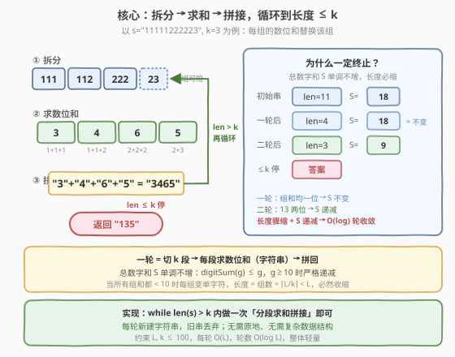
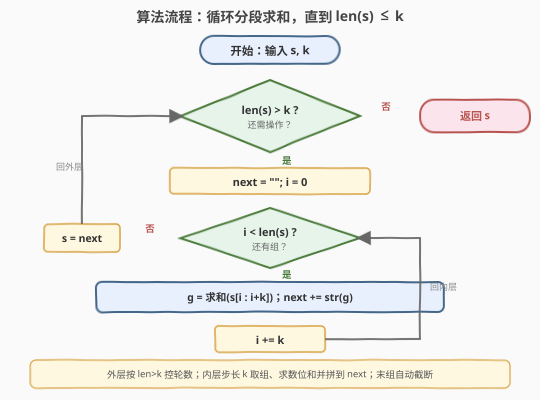
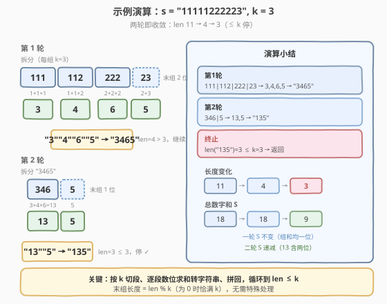

# 计算字符串的数字和

- **题目名称**：计算字符串的数字和
- **链接**：[2243. 计算字符串的数字和](https://leetcode.cn/problems/calculate-digit-sum-of-a-string/)
- **难度**：简单
- **标签**：字符串、模拟

## 1. 题目概述

给定一个由若干数字（`0`–`9`）组成的字符串 `s` 和一个整数 `k`。如果 `s` 的长度大于 `k`，则执行**一轮操作**：

1. 将 `s` **拆分**成若干长度为 `k` 的连续数字组（最后一组长度可以小于 `k`）；
2. 用每组数字之和的**字符串**替换该组（例如 `"346"` 替换为 `"13"`，因为 $3+4+6=13$）；
3. **合并**所有组得到新字符串。

若新字符串长度仍大于 `k`，重复上述步骤。返回完成所有操作后的 `s`。

**示例 1**：

```text
输入：s = "11111222223", k = 3
输出："135"
解释：
- 第一轮："111"、"112"、"222"、"23" → 和 3、4、6、5 → "3465"
- 第二轮："346"、"5" → 和 13、5 → "135"
- len("135") = 3 ≤ k，返回 "135"
```

**示例 2**：

```text
输入：s = "00000000", k = 3
输出："000"
解释：
- "000"、"000"、"00" → 和 0、0、0 → "000"，长度等于 k，返回 "000"
```

**约束条件**：

- $1 \le \text{s.length} \le 100$
- $2 \le k \le 100$
- `s` 仅由数字 `0`–`9` 组成

> 💡 这是一道**纯模拟**题：照着题意「切段 → 求和 → 拼接」循环即可。真正值得讲清的是**为什么循环一定会停**——看似每组求和可能让新串不短于旧串（如 `"9999"` 拆 `"99","99"` → `"18","18"` → `"1818"` 长度不变），但实际上**总数字和单调不增**，且当所有组和都落到一位数时长度必然骤缩，故必然终止。

---

## 2. 解题思路

### 2.1 暴力思路：逐轮重建字符串

最直白的做法是完全照搬题意：每轮新建一个空串 `next`，按步长 `k` 切分 `s`，对每段求字符数字之和并转成字符串拼到 `next` 末尾，一轮结束后令 `s = next`，直到 `len(s) <= k`。

```text
while len(s) > k:
    next = ""
    for i in range(0, len(s), k):
        group = s[i : i+k]            # 末段自动截断
        next += str(sum(int(c) for c in group))
    s = next
return s
```

> ⚠️ 切片 `s[i:i+k]` 在 `i+k` 超出长度时自动取到末尾，**无需对末组做任何特判**——这是 Python/Java/C++ `substr` 共有的安全语义，是本题最易写错的地方（手动算末段长度时容易写成 `k` 或漏掉余数）。

### 2.2 核心观察：总数字和单调不增，循环必终止



关键认识有三层：

1. **每组的数位和不超过 $9k$**：一组至多 $k$ 个数字，每个 $\le 9$，故和 $\le 9k \le 900$，其十进制串长度 $\le 3$。所以一轮后新长度 $L' \le 3 \cdot \lceil L/k \rceil$，与原长相比通常大幅缩短。

2. **总数字和 $S$ 单调不增**：设一轮前所有字符数值之和为 $S$。每组的数位和记为 $g_i$，则 $\sum g_i = S$。新串的总数字和 $S' = \sum \text{digitSum}(g_i)$。由数位和的基本性质 $\text{digitSum}(g) \le g$（且 $g \ge 10$ 时严格成立），得 $S' \le S$。换言之，**只要存在某个组的和 $\ge 10$（是个两位及以上数），$S$ 就严格递减**。

3. **当所有组和都 $< 10$ 时长度必然收缩**：此时每组都被替换成单字符，新长度 $L' = \lceil L/k \rceil$。由于循环条件是 $L > k$ 且 $k \ge 2$，有 $\lceil L/k \rceil \le \lceil L/2 \rceil < L$（对 $L \ge 3$ 成立），长度严格下降。

> 💡 两者合起来：$S$ 是非负整数，每轮要么严格递减（存在多位组和时），要么长度骤缩（所有组和为一位数时）。递减不能无限次（$S \ge 0$），骤缩也不能无限次（长度 $\ge 1$），故循环**必然终止**。以示例 1 为例：第一轮各组数位和 $3,4,6,5$ 全是一位数，$S$ 保持 18 不变，但长度由 11 骤缩到 4；第二轮出现两位数和 $13$，$S$ 严格递减到 9，长度缩到 3 停止——两轮恰好分别演示了「长度骤缩」与「$S$ 递减」两种收敛机制。

### 2.3 算法流程图



1. **外层判断**：`len(s) > k` 成立才进一轮，否则返回 `s`。
2. **内层遍历**：`i` 从 $0$ 步进 $k$ 到 $\text{len}(s)$，每次取 `s[i:i+k]`。
3. **求和拼接**：对当前组求各字符数字之和 `g`，把 `str(g)` 追加到 `next`。
4. **更新**：一轮结束 `s = next`，回到外层判断。

### 2.4 示例演算



**示例 1：`s = "11111222223", k = 3`**

| 轮次 | 拆分（k=3） | 各组数位和 | 拼接结果 | 长度 | 是否继续 |
|------|-------------|------------|----------|------|----------|
| 1 | `111` \| `112` \| `222` \| `23` | 3, 4, 6, 5 | `"3465"` | 4 | $4 > 3$，继续 |
| 2 | `346` \| `5` | 13, 5 | `"135"` | 3 | $3 \le 3$，停止 |

总数字和 $S$ 的轨迹：初始 $5{\times}1 + 5{\times}2 + 1{\times}3 = 18$；第一轮后 `"3465"` 的 $S = 3+4+6+5 = 18$（所有组和均为一位数，$S$ 不变，长度由 11 骤缩到 4）；第二轮 `13` 是两位数，$S$ 严格递减到 $1+3+5 = 9$，长度缩到 3 停止。**答案 = `"135"`** ✓

**示例 2：`s = "00000000", k = 3`**：拆 `000`|`000`|`00`，和 $0,0,0$ → `"000"`，长度 3 $= k$，停止。**答案 = `"000"`** ✓

> ⚠️ 注意示例 2 的陷阱：和为 $0$ 时要拼成 `"0"` 而非空串。用 `str(sum(...))` 天然得到 `"0"`，不会出错；但若手写「和为 0 跳过」就会漏字符。

---

## 3. 参考代码

### C++

```cpp
class Solution {
  public:
    string digitSum(string s, int k) {
        while ((int)s.size() > k) {
            string next;
            for (int i = 0; i < (int)s.size(); i += k) {
                int g = 0;
                for (int j = i; j < i + k && j < (int)s.size(); ++j)
                    g += s[j] - '0';
                next += to_string(g);
            }
            s = move(next);
        }
        return s;
    }
};
```

> 💡 内层 `j` 的上界 `min(i + k, s.size())` 处理末段不足 `k` 的情况；`to_string(g)` 把和转回字符串（含多位如 `"13"`）。`move(next)` 避免一次拷贝。

### Python

```python
class Solution:
    def digitSum(self, s: str, k: int) -> str:
        while len(s) > k:
            nxt = []
            for i in range(0, len(s), k):
                group = s[i:i + k]
                nxt.append(str(sum(int(c) for c in group)))
            s = "".join(nxt)
        return s
```

> 💡 `range(0, len(s), k)` 以步长 `k` 枚举每段起点，切片 `s[i:i+k]` 自动截断末段。用列表 `append` + `"".join` 比字符串 `+=` 拼接更高效（避免中间字符串反复分配）。

---

## 4. 复杂度分析

| 维度 | 复杂度 | 说明 |
|------|--------|------|
| 时间复杂度 | $O(L \log L)$ | 每轮 $O(L)$；轮数 $O(\log L)$：总数字和 $S \le 9L$，出现多位组和时严格递减，所有组和为一位数时长度骤缩到 $\lceil L/k \rceil$，故轮数对数级 |
| 空间复杂度 | $O(L)$ | 每轮新建 `next` 字符串，峰值长度不超过 $O(L)$；旧串丢弃 |

> 💡 在约束 $L, k \le 100$ 下，$L \log L \approx 700$ 量级，远在时限内。即便 $L$ 放大到 $10^5$，$O(L \log L)$ 仍可接受。空间可用「双缓冲」复用两个字符串进一步优化，但对本题无必要。

---

## 5. 扩展：能否避免字符串中转，直接算最终结果？

观察每轮操作的本质：**把连续 $k$ 位的数值压成它们的数位和**。这是一种「块状数位归约」。一个自然的问题是——能否像 [258. 各位相加](../0201-0300/258_各位相加.md) 那样用 $O(1)$ 的**数字根公式**直接跳过循环？

答案是**很难**。258 能 $O(1)$ 求解，依赖「$10 \equiv 1 \pmod 9$」使数位和不改变 mod 9 余数，反复求和最终落在一个一位数上。但 2243 有两层障碍：

1. **按块切分而非全串求和**：每轮是「每 $k$ 位一组分别求和再拼接」，不是「全串所有位求和」。块间是**拼接**（保留各组和的十进制串）而非相加，mod 9 同余性无法跨块传递——`"99"` 与 `"18"` 在 mod 9 下同余，但拼接 `"1818"` 与 `"99"` 的后续分块结果完全不同。

2. **终止条件是长度而非值**：258 收敛到「一位数」（值 $< 10$），2243 收敛到「长度 $\le k$」（可能是多位数，如 `"135"`）。值域判据与长度判据不可互换。

因此 2243 不存在 258 那样的闭合公式，**模拟是正解**。这也说明：同样是「反复数位求和」，分组拼接 vs 全串求和会带来本质差异——这是两题对照时最值得品味的点。

---

## 6. 面试要点

1. **末组长度不足 `k` 怎么处理？**

   - 直接用切片 `s[i:i+k]`（Python）或 `substr(i, k)`（C++），它们在越界时自动取到末尾，末组长度就是 `len % k`（为 0 时恰满 `k`）。**无需任何特判**，手动算末段长度是最常见的写错点。

2. **循环一定会终止吗？怎么证明？**

   - 会。设总数字和 $S = \sum \text{字符数值}$。每轮后 $S' = \sum \text{digitSum}(g_i) \le \sum g_i = S$，且存在某组 $g_i \ge 10$ 时严格递减。$S$ 是非负整数不能无限递减；当所有 $g_i < 10$ 时每组变单字符，新长度 $= \lceil L/k \rceil < L$（因 $L > k, k \ge 2$），长度骤缩也不能无限次。故必然终止。

3. **和为 0 时拼接会不会出错？**

   - `str(0)` 得到 `"0"`，不会是空串。但若手写「跳过零和」就会漏字符（示例 2 的 `"00000000"` 正是考验这点）。用 `str(sum(...))` 或 `to_string(g)` 天然安全。

4. **每组求和结果可能是多位数（如 13），这对下一轮有影响吗？**

   - 有，这正是循环存在的意义。下一轮会把多位数的和（如 `"13"`）当作普通数字串继续参与切分与求和。这也是 2243 与 258 的关键区别：258 全串求和，2243 按块求和后**拼接保留多位和**，无法用数字根公式一步到位。

5. **时间复杂度为什么是 $O(L \log L)$ 而非 $O(L^2)$？**

   - 每轮 $O(L)$。轮数并非最坏 $O(L)$：出现多位组和时 $S$ 严格递减（$S \le 9L$，递减次数有界），所有组和为一位数时长度骤缩到 $\lceil L/k \rceil$（对数级收缩）。两类情形交替出现，总轮数 $O(\log L)$，故整体 $O(L \log L)$。

> 💡 **一句话总结**：2243 是一道照题意模拟的签到题——`while len > k` 内做「切段 → 求数位和 → 拼回」即可；其亮点不在代码，而在**讲清循环终止性**（总数字和单调不增 + 长度骤缩），并与 258/1945 对照理解「分组拼接」为何不能套用数字根公式。

---

## 7. 同类练习题

- [258. 各位相加](https://leetcode.cn/problems/add-digits/)（[题解](../0201-0300/258_各位相加.md)）：反复求全串数位和直到一位数，可用 $O(1)$ 数字根公式 `1+(n-1)%9`；本题是它的「分组拼接」变体，因块间拼接无法套用同余公式，只能模拟
- [1945. 字符串转化后的各位数字之和](https://leetcode.cn/problems/sum-of-digits-of-string-after-convert/)（[题解](../1901-2000/1945_字符串转化后的各位数字之和.md)）：先字母转数字串，再反复求**全串**数位和 $k$ 次；与本题同为「数字串反复归约」，但它每轮全串求和（值收敛），本题每轮分块拼接（长度收敛），对照理解终止机制
- [2221. 数组的三角和](https://leetcode.cn/problems/find-triangular-sum-of-an-array/)（[题解](../2201-2300/2221_数组的三角和.md)）：相邻元素层层归约 $(a+b)\%10$，同为「反复归约模拟」家族；本题按定长 $k$ 分块归约，2221 按相邻两两归约，归约结构不同但思想相通
- [415. 字符串相加](https://leetcode.cn/problems/add-strings/)（[题解](../0401-0500/415_字符串相加.md)）：大数逐位加法模拟，与本题的「逐字符转数字求和」基础操作同源；415 处理进位传递，2243 处理分块压缩，互为「进位 vs 压缩」对照
