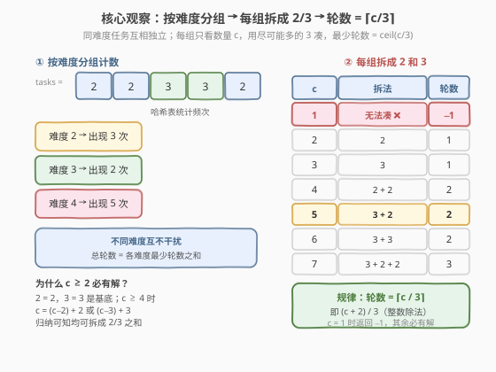
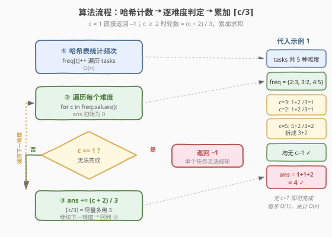

# 完成所有任务需要的最少轮数

- **题目名称**：完成所有任务需要的最少轮数
- **链接**：[2244. 完成所有任务需要的最少轮数](https://leetcode.cn/problems/minimum-rounds-to-complete-all-tasks/)
- **难度**：中等
- **标签**：贪心、哈希表、数学

## 1. 题目概述

给你一个下标从 0 开始的整数数组 `tasks`，其中 `tasks[i]` 表示任务的难度级别。在每一轮中，你可以完成 2 个或者 3 个**相同难度级别**的任务。返回完成所有任务需要的**最少**轮数，如果无法完成所有任务，返回 `-1`。

**示例 1**：

```text
输入：tasks = [2,2,3,3,2,4,4,4,4,4]
输出：4
解释：一个可能的计划是：
- 第一轮，完成难度级别为 2 的 3 个任务。
- 第二轮，完成难度级别为 3 的 2 个任务。
- 第三轮，完成难度级别为 4 的 3 个任务。
- 第四轮，完成难度级别为 4 的 2 个任务。
可以证明，无法在少于 4 轮的情况下完成所有任务。
```

**示例 2**：

```text
输入：tasks = [2,3,3]
输出：-1
解释：难度级别为 2 的任务只有 1 个，每轮只能完成 2 或 3 个，无法完成。
```

**约束条件**：

- $1 \le \text{tasks.length} \le 10^5$
- $1 \le \text{tasks[i]} \le 10^9$

> 💡 本题的核心是**按难度分组 + 贪心拆分**。不同难度的任务互不干扰，只需对每种难度的数量 $c$ 求最少轮数。关键观察：每轮只能做 2 或 3 个，所以 $c = 1$ 时无解；$c \ge 2$ 时一定可解，且最少轮数就是 $\lceil c/3 \rceil = (c+2)/3$。

---

## 2. 解题思路

### 2.1 暴力思路：逐种难度枚举拆分

最直观的做法：先用哈希表统计每种难度的出现次数，然后对每个频次 $c$，枚举它拆成若干个 2 和 3 之和的所有组合，取使用轮数最少的。

```text
for c in freq.values():
    best = INF
    for x in 0..c/3:          # 用 x 个 3
        remain = c - 3*x
        if remain >= 0 and remain % 2 == 0:   # 余下全用 2
            best = min(best, x + remain/2)
    if best == INF: return -1
    ans += best
```

时间 $O(\sum c/3) = O(n)$，看似可行，但实现繁琐且容易出错。突破口在于：**最少轮数有封闭公式**，无需枚举。

> ⚠️ 暴力法的瓶颈在于逐个枚举 3 的个数。但每种余数情况（$c \bmod 3 = 0, 1, 2$）的最优拆法是固定的，可以直接用公式算出。

### 2.2 核心观察：最少轮数 = ⌈c/3⌉



**关键观察 1：不同难度互不干扰**。每轮只能完成同一种难度的任务，因此总最少轮数 = 各难度最少轮数之和。只需对每种难度的频次 $c$ 单独求解：

$$
\text{ans} = \sum_{c \in \text{freq.values()}} f(c)
$$

**关键观察 2：$c = 1$ 是唯一无解情况**。每轮至少做 2 个，所以单个任务（$c = 1$）无法成轮。而 $c \ge 2$ 时**一定有解**：

- $c = 2$：一个 2 ✓
- $c = 3$：一个 3 ✓
- $c \ge 4$：由数学归纳法，$c = (c-2) + 2$ 或 $c = (c-3) + 3$，而 $c-2 \ge 2$ 或 $c-3 \ge 2$（归纳假设可解），故 $c$ 也可解。

**关键观察 3：最少轮数 = $\lceil c/3 \rceil$**。要最小化轮数，应**尽量多用 3**（每轮多做任务）。按 $c \bmod 3$ 分类：

| $c \bmod 3$ | 最优拆法 | 轮数 | 说明 |
|-------------|----------|------|------|
| 0 | 全用 3 | $c/3$ | 如 $c=6 \to 3+3$，2 轮 |
| 1 | 拆出一个 $4=2+2$，其余全 3 | $c/3 + 1$ | 如 $c=7 \to 3+2+2$，3 轮 |
| 2 | 拆出一个 2，其余全 3 | $c/3 + 1$ | 如 $c=5 \to 3+2$，2 轮 |

三种情况的轮数统一为 $\lceil c/3 \rceil$，可用整数除法一步算出：

$$
f(c) = \left\lceil \frac{c}{3} \right\rceil = \left\lfloor \frac{c + 2}{3} \right\rfloor
$$

> 💡 **为什么余 1 时不能直接 $(c-1)/3$？** 因为 $c \bmod 3 = 1$ 时，$c - 1$ 虽然能被 3 整除，但剩下那个 1 无法单独成轮。正确做法是把一个 3 和这个 1 合并成 $4 = 2 + 2$，所以轮数比 $c/3$ 多 1 而非少 1。公式 $(c+2)/3$ 自动处理了这一点。

### 2.3 算法流程图



1. **哈希计数**：遍历 `tasks`，统计每种难度的频次 `freq`。
2. **遍历每个频次** $c$：
   - 若 $c = 1$：直接返回 $-1$（无法完成）。
   - 否则：$\text{ans} \mathrel{+}= (c + 2) / 3$。
3. **返回** `ans`。

> 💡 判定 $c = 1$ 必须在累加之前：一旦发现任何难度只出现 1 次，整个问题就无解，立即返回 $-1$。

### 2.4 示例演算

![示例演算：tasks = [2,2,3,3,2,4,4,4,4,4]](../images/2244_example_walkthrough.svg)

以 `tasks = [2,2,3,3,2,4,4,4,4,4]` 为例：

| 难度 | 频次 $c$ | 拆分方案 | $(c+2)/3$ | 轮数 | 说明 |
|------|----------|----------|-----------|------|------|
| 2 | 3 | 3 | $(3+2)/3 = 1$ | 1 | 一轮做 3 个 |
| 3 | 2 | 2 | $(2+2)/3 = 1$ | 1 | 一轮做 2 个 |
| 4 | 5 | 3 + 2 | $(5+2)/3 = 2$ | 2 | 3 整除余 2 → +1 轮 |

- **总轮数** $= 1 + 1 + 2 = 4$ ✓

对比示例 2 `tasks = [2,3,3]`：`freq = {2:1, 3:2}`，难度 2 仅 1 个，$c = 1$ → 返回 $-1$ ✓。

> 💡 验证公式正确性：$c = 5$ 时 $5 \bmod 3 = 2$，拆成 $3 + 2$ 共 2 轮，$(5+2)/3 = 7/3 = 2$ ✓。$c = 7$ 时 $7 \bmod 3 = 1$，拆成 $3 + 2 + 2$ 共 3 轮，$(7+2)/3 = 9/3 = 3$ ✓。

---

## 3. 参考代码

### C++

```cpp
// 完成所有任务需要的最少轮数 —— 哈希计数 + 贪心公式 O(n) / O(n)
// 编译: g++ -O2 -std=c++17 solution.cpp -o mrt
#include <vector>
#include <unordered_map>
using namespace std;

class Solution {
public:
    int minimumRounds(vector<int>& tasks) {
        unordered_map<int, int> freq;
        for (int t : tasks) ++freq[t];
        int ans = 0;
        for (auto& [_, c] : freq) {
            if (c == 1) return -1;
            ans += (c + 2) / 3;
        }
        return ans;
    }
};
```

### Python

```python
class Solution:
    def minimumRounds(self, tasks: List[int]) -> int:
        from collections import Counter
        freq = Counter(tasks)
        ans = 0
        for c in freq.values():
            if c == 1:
                return -1
            ans += (c + 2) // 3
        return ans
```

> 💡 **实现细节**：① `tasks[i]` 取值可达 $10^9$，必须用哈希表（`unordered_map` / `Counter`）而非数组计数。② `(c + 2) / 3` 利用整数除法向下取整实现向上取整 $\lceil c/3 \rceil$，三种余数情况统一处理，无需分支。③ 答案最多 $n/2 \le 5 \times 10^4$，`int` 足够，无需 `long long`。

---

## 4. 复杂度分析

| 维度 | 复杂度 | 说明 |
|------|--------|------|
| **时间复杂度** | $O(n)$ | 一次遍历统计频次 $O(n)$ + 一次遍历哈希表累加 $O(\text{不同难度数}) \le O(n)$，每个频次 $O(1)$ 公式计算 |
| **空间复杂度** | $O(n)$ | 哈希表存储频次，最坏情况所有任务难度不同，需 $O(n)$ 空间 |

> ⚠️ 暴力枚举拆分虽也是 $O(n)$，但实现复杂且易错。关键在于识别出**最少轮数有封闭公式** $\lceil c/3 \rceil$，将每组的枚举 $O(c/3)$ 降为 $O(1)$。

---

## 5. 扩展：向上取整公式的通用性

### 5.1 `(c + k - 1) / k` 向上取整模板

本题用 $(c + 2) / 3$ 实现 $\lceil c/3 \rceil$，是经典的**向上取整整数除法**模板：

$$
\left\lceil \frac{a}{b} \right\rceil = \left\lfloor \frac{a + b - 1}{b} \right\rfloor \quad (a \ge 0,\ b > 0)
$$

当 $b = 3$ 时即 $(a + 2) / 3$。这种写法避免了浮点运算和条件分支，在竞赛和面试中极为常用。

### 5.2 为什么「尽量多用 3」是对的？

每轮可选 2 或 3 个任务。设用了 $x$ 个 2、$y$ 个 3，则 $c = 2x + 3y$，轮数 $= x + y$。要最小化 $x + y$：

$$
x + y = \frac{c - 3y}{2} + y = \frac{c - y}{2}
$$

$y$ 越大，轮数越小。因此**在保证 $c - 3y \ge 0$ 且能被 2 整除的前提下，$y$ 取最大**。这正是按 $c \bmod 3$ 分类时「余 0 全用 3、余 1 让出一个 3 改用两个 2、余 2 用一个 2」的策略，最终轮数恰好等于 $\lceil c/3 \rceil$。

### 5.3 推广：每轮可选 $a$ 或 $b$ 个

若题目改为「每轮完成 $a$ 或 $b$ 个同难度任务」（$\gcd(a, b) = 1$），则 $c$ 能否凑成 $ax + by$ 取决于**Frobenius 数**：当 $c > ab - a - b$ 时必有解。最少轮数同样可按贪心「尽量多用较大的那个」求出，但公式不再如此简洁，需按 $c \bmod a$ 分类讨论。

---

## 6. 面试要点

1. **为什么 $c = 1$ 是唯一无解情况？**

   - 每轮至少完成 2 个任务，所以 $c = 1$ 无法成轮。而 $c \ge 2$ 时，$c = 2$（一个 2）和 $c = 3$（一个 3）是基底，$c \ge 4$ 时 $c = (c-2) + 2$ 或 $(c-3) + 3$，由数学归纳法可知均可拆成 2 和 3 之和。

2. **为什么最少轮数是 $\lceil c/3 \rceil$ 而非简单除以 3？**

   - 要最小化轮数，应尽量多用 3（每轮多做任务）。但 $c \bmod 3 = 1$ 时余下的 1 不能单独成轮，需把一个 3 和这个 1 合并成 $4 = 2 + 2$（两轮），所以总轮数比 $c/3$ 多 1。$c \bmod 3 = 2$ 时余下的 2 单独成一轮，也是多 1。两种情况统一为 $\lceil c/3 \rceil = (c+2)/3$。

3. **`(c + 2) / 3` 为什么等价于向上取整？**

   - 整数除法向下取整。$\lceil c/3 \rceil$ 当 $c \bmod 3 = 0$ 时为 $c/3$，否则为 $c/3 + 1$。加 2 后：余 0 时 $(3k+2)/3 = k$（2 被截掉），余 1 时 $(3k+3)/3 = k+1$，余 2 时 $(3k+4)/3 = k+1$。三种情况均正确。

4. **为什么要用哈希表而非数组计数？**

   - `tasks[i]` 取值范围高达 $10^9$，无法用数组直接索引。哈希表（`unordered_map` / `Counter`）以 $O(1)$ 均摊时间完成计数，空间与不同难度数成正比。

5. **能否先排序再分组计数？**

   - 可以。排序后相同难度连续，一次遍历即可统计频次并累加轮数，时间 $O(n \log n)$、空间 $O(1)$。但哈希表法 $O(n)$ 时间更优，且代码更简洁，是首选。

> 💡 **一句话总结**：2244 是「分组计数 + 贪心公式」的典型题——按难度哈希分组，每组频次 $c$ 若为 1 则无解返回 $-1$，否则最少轮数 $= \lceil c/3 \rceil = (c+2)/3$，累加即得答案。核心难点是**识别 $c \ge 2$ 必有解**以及**推导出统一的向上取整公式**。

---

## 7. 同类练习题

- [2245. 转角路径的乘积中最多尾随零](https://leetcode.cn/problems/maximum-trailing-zeros-in-a-cornered-path/)：同题号相邻，同为贪心 + 数学分析，但场景完全不同（矩阵路径 + 质因数分解），可作横向对比
- [2136. 提早开花的最少时间](https://leetcode.cn/problems/earliest-possible-day-of-full-bloom/)：贪心排序 + 累加，「分组后按最优顺序调度」的贪心思想同源
- [453. 最小操作次数使数组元素相等](https://leetcode.cn/problems/minimum-moves-to-equal-array-elements/)：逆向思维 + 数学公式一步求解，与本题「识别封闭公式避免枚举」的思想一致
- [2541. 使数组中所有元素相等的最小操作数 II](https://leetcode.cn/problems/minimum-operations-to-make-array-equal-ii/)：按差值分组贪心，哈希计数 + 公式累加的计数型贪心
- [2335. 装满杯子需要的最短总时长](https://leetcode.cn/problems/minimum-amount-of-time-to-fill-cups/)：每轮可选 1 或 2 个，贪心「尽量并行」求最少轮数，与本题「每轮选 2 或 3」的贪心框架同源
