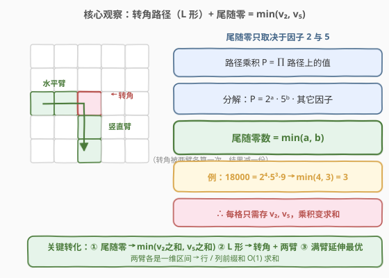
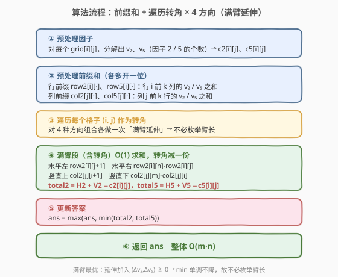
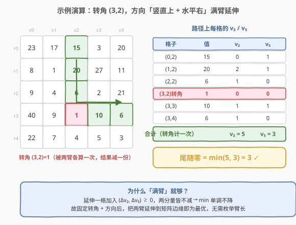

# 转角路径的乘积中最多能有几个尾随零

- **题目名称**：转角路径的乘积中最多能有几个尾随零
- **链接**：[2245. 转角路径的乘积中最多能有几个尾随零](https://leetcode.cn/problems/maximum-trailing-zeros-in-a-cornered-path/)
- **难度**：中等
- **标签**：数组、矩阵、前缀和、数学

## 1. 题目概述

给定一个大小为 $m \times n$ 的二维整数数组 `grid`，每个单元格含一个正整数。**转角路径**定义为：**至多包含一个弯**的一组相邻单元格——先完全沿水平方向（左/右）移动若干步，至多转一次弯后改为完全沿竖直方向（上/下）移动若干步（或先竖直后水平），且不能重复访问已访问过的单元格。一条路径的**乘积**为路径上所有值之积。请找出一条乘积中**尾随零数目最多**的转角路径，返回该尾随零数目。

**示例 1**：

```text
输入：grid = [[23,17,15,3,20],[8,1,20,27,11],[9,4,6,2,21],[40,9,1,10,6],[22,7,4,5,3]]
输出：3
解释：路径 15 * 20 * 6 * 1 * 10 = 18000，共 3 个尾随零。
```

**示例 2**：

```text
输入：grid = [[4,3,2],[7,6,1],[8,8,8]]
输出：0
解释：不存在乘积含尾随零的转角路径。
```

**约束条件**：

- $m = \text{grid.length}$，$n = \text{grid}[i].\text{length}$
- $1 \le m, n \le 10^5$
- $1 \le m \cdot n \le 10^5$
- $1 \le \text{grid}[i][j] \le 1000$

> 💡 三个关键信号：① 尾随零只与因子 $2$、$5$ 有关；② $m \cdot n \le 10^5$ 暗示 $O(m \cdot n)$ 解法；③ 「至多一个弯」即 L 形路径，转角确定后两臂可独立处理 → 前缀和。

---

## 2. 解题思路

### 2.1 暴力思路

枚举所有 L 形路径（转角位置 + 两臂长度），对每条路径累乘后数尾随零。路径数约为 $O((m \cdot n)(m+n))$，且乘积极大，必然超时。

### 2.2 核心观察：尾随零 = min(v₂, v₅) + 转角拆两臂 + 满臂最优



三个关键观察层层递进：

1. **尾随零只取决于因子 $2$ 和 $5$ 的个数**。乘积 $P = 2^{a} \cdot 5^{b} \cdot \text{rest}$，尾随零数 $= \min(a, b)$。由于 $\text{grid}[i][j] \le 1000$，每个格子的 $v_2$、$v_5$（含因子 $2$、$5$ 的个数）可 $O(\log V)$ 预处理。于是「求乘积尾随零」转化为「求路径上 $v_2$ 之和与 $v_5$ 之和的 $\min$」——**乘积问题变求和问题**。

2. **L 形路径 = 转角 + 水平臂 + 竖直臂**。转角 $(i, j)$ 是两臂的唯一交点：水平臂是行 $i$ 上的一段区间，竖直臂是列 $j$ 上的一段区间。两臂各自是一维区间 → **行前缀和**与**列前缀和**可 $O(1)$ 求任意臂段之和。转角被两臂各算一次，结果里减去一份。

3. **满臂延伸总是最优**（降阶核心）。对固定的转角与方向，把臂延伸到矩阵边缘只会向 $v_2$、$v_5$ 各增加**非负**值，故 $\min(v_2, v_5)$ **单调不降**。因此不必枚举臂长，每个「转角 × 4 方向」只需算「满臂延伸」一次。

> ⚠️ 第 3 点把「枚举臂长」的 $O(m+n)$ 因子直接消掉，复杂度从 $O((m \cdot n)(m+n))$ 降到 $O(m \cdot n)$。

**满臂最优性证明**：设当前 $v_2 = a$，$v_5 = b$。延伸一格加入 $(\Delta v_2, \Delta v_5)$，其中 $\Delta v_2, \Delta v_5 \ge 0$。则

$$
\min(a + \Delta v_2,\; b + \Delta v_5) \ge \min(a, b)
$$

因为 $a + \Delta v_2 \ge a$ 且 $b + \Delta v_5 \ge b$，两分量皆不减，其 $\min$ 亦不减。反复延伸，$\min$ 单调不降，故满臂最优。这也说明：**任何直线（零弯）路径都被某个满臂 L 形路径支配**——把直线的一端当作转角，再向垂直方向满臂延伸即可不降 $\min$。

### 2.3 算法流程图



定义前缀和（各多开一位，省去边界特判）：

- `row2[i][k]`：行 $i$ 前 $k$ 列（列 $0..k-1$）的 $v_2$ 之和；`row5` 同理。
- `col2[j][k]`：列 $j$ 前 $k$ 行（行 $0..k-1$）的 $v_2$ 之和；`col5` 同理。

对转角 $(i, j)$，四个方向组合的「满臂段」（均含转角）：

| 方向 | 水平段 $v_2$ | 竖直段 $v_2$ |
|------|--------------|--------------|
| 左 + 上 | `row2[i][j+1]` | `col2[j][i+1]` |
| 左 + 下 | `row2[i][j+1]` | `col2[j][m] - col2[j][i]` |
| 右 + 上 | `row2[i][n] - row2[i][j]` | `col2[j][i+1]` |
| 右 + 下 | `row2[i][n] - row2[i][j]` | `col2[j][m] - col2[j][i]` |

每种组合：

$$
\text{total2} = H_2 + V_2 - c_2[i][j], \qquad \text{total5} = H_5 + V_5 - c_5[i][j]
$$

更新 $\text{ans} = \max(\text{ans},\; \min(\text{total2}, \text{total5}))$。

> 💡 水平段「左含 $j$」= 列 $0..j$ = `row2[i][j+1]`；「右含 $j$」= 列 $j..n-1$ = `row2[i][n] - row2[i][j]`。竖直段同理。两段都包含转角，故减去一份转角贡献。

### 2.4 示例演算

以示例 1 为例，取转角 $(3, 2)$（值为 $1$），方向「竖直上 + 水平右」满臂延伸：



路径：列 $2$ 的行 $0..3$（$15, 20, 6, 1$）+ 行 $3$ 的列 $2..4$（$1, 10, 6$），转角 $(3,2)=1$ 共享（计一次）。

| 格子 | 值 | $v_2$ | $v_5$ |
|------|----|-------|-------|
| $(0,2)$ | 15 | 0 | 1 |
| $(1,2)$ | 20 | 2 | 1 |
| $(2,2)$ | 6 | 1 | 0 |
| $(3,2)$ | 1 | 0 | 0 | ← 转角（计一次） |
| $(3,3)$ | 10 | 1 | 1 |
| $(3,4)$ | 6 | 1 | 0 |

合计：$v_2 = 0+2+1+0+1+1 = 5$，$v_5 = 1+1+0+0+1+0 = 3$，$\min(5, 3) = 3$。

> 💡 题目示例的路径止于 $(3,3)$（乘积 $18000$），满臂多延伸到 $(3,4)=6$（多一个因子 $2$），$v_5$ 不变，$\min$ 仍为 $3$。这正是「满臂不降」的体现。

---

## 3. 参考代码

### C++

```cpp
class Solution {
public:
    int maxTrailingZeros(vector<vector<int>>& grid) {
        int m = grid.size(), n = grid[0].size();
        auto cnt = [](int x, int p) {
            int c = 0;
            while (x % p == 0) { ++c; x /= p; }
            return c;
        };
        vector<vector<int>> c2(m, vector<int>(n)), c5(m, vector<int>(n));
        for (int i = 0; i < m; ++i)
            for (int j = 0; j < n; ++j) {
                c2[i][j] = cnt(grid[i][j], 2);
                c5[i][j] = cnt(grid[i][j], 5);
            }
        vector<vector<int>> row2(m, vector<int>(n + 1, 0)), row5(m, vector<int>(n + 1, 0));
        for (int i = 0; i < m; ++i)
            for (int j = 0; j < n; ++j) {
                row2[i][j + 1] = row2[i][j] + c2[i][j];
                row5[i][j + 1] = row5[i][j] + c5[i][j];
            }
        vector<vector<int>> col2(n, vector<int>(m + 1, 0)), col5(n, vector<int>(m + 1, 0));
        for (int j = 0; j < n; ++j)
            for (int i = 0; i < m; ++i) {
                col2[j][i + 1] = col2[j][i] + c2[i][j];
                col5[j][i + 1] = col5[j][i] + c5[i][j];
            }
        int ans = 0;
        for (int i = 0; i < m; ++i)
            for (int j = 0; j < n; ++j) {
                int h2L = row2[i][j + 1],               h5L = row5[i][j + 1];
                int h2R = row2[i][n] - row2[i][j],      h5R = row5[i][n] - row5[i][j];
                int v2U = col2[j][i + 1],               v5U = col5[j][i + 1];
                int v2D = col2[j][m] - col2[j][i],      v5D = col5[j][m] - col5[j][i];
                int cor2 = c2[i][j], cor5 = c5[i][j];
                int H[2][2] = {{h2L, h5L}, {h2R, h5R}};
                int V[2][2] = {{v2U, v5U}, {v2D, v5D}};
                for (auto& h : H)
                    for (auto& v : V) {
                        int t2 = h[0] + v[0] - cor2;
                        int t5 = h[1] + v[1] - cor5;
                        ans = max(ans, min(t2, t5));
                    }
            }
        return ans;
    }
};
```

### Python

```python
class Solution:
    def maxTrailingZeros(self, grid: List[List[int]]) -> int:
        m, n = len(grid), len(grid[0])

        def cnt(x: int, p: int) -> int:
            c = 0
            while x % p == 0:
                c += 1
                x //= p
            return c

        c2 = [[cnt(grid[i][j], 2) for j in range(n)] for i in range(m)]
        c5 = [[cnt(grid[i][j], 5) for j in range(n)] for i in range(m)]

        row2 = [[0] * (n + 1) for _ in range(m)]
        row5 = [[0] * (n + 1) for _ in range(m)]
        for i in range(m):
            for j in range(n):
                row2[i][j + 1] = row2[i][j] + c2[i][j]
                row5[i][j + 1] = row5[i][j] + c5[i][j]

        col2 = [[0] * (m + 1) for _ in range(n)]
        col5 = [[0] * (m + 1) for _ in range(n)]
        for j in range(n):
            for i in range(m):
                col2[j][i + 1] = col2[j][i] + c2[i][j]
                col5[j][i + 1] = col5[j][i] + c5[i][j]

        ans = 0
        for i in range(m):
            for j in range(n):
                h2L, h5L = row2[i][j + 1], row5[i][j + 1]
                h2R, h5R = row2[i][n] - row2[i][j], row5[i][n] - row5[i][j]
                v2U, v5U = col2[j][i + 1], col5[j][i + 1]
                v2D, v5D = col2[j][m] - col2[j][i], col5[j][m] - col5[j][i]
                cor2, cor5 = c2[i][j], c5[i][j]
                for h2, h5 in ((h2L, h5L), (h2R, h5R)):
                    for v2, v5 in ((v2U, v5U), (v2D, v5D)):
                        ans = max(ans, min(h2 + v2 - cor2, h5 + v5 - cor5))
        return ans
```

> 💡 两版均 $O(m \cdot n)$ 时间、$O(m \cdot n)$ 空间。若追求极致空间，可在遍历时按行/列滚动复用前缀，降到 $O(m + n)$，但 $m \cdot n \le 10^5$ 下无此必要。

---

## 4. 复杂度分析

| 维度 | 复杂度 | 说明 |
|------|--------|------|
| **时间复杂度** | $O(m \cdot n)$ | 预处理因子 $O(m \cdot n)$ + 前/列前缀和 $O(m \cdot n)$ + 遍历转角 × 4 方向 $O(m \cdot n)$ |
| **空间复杂度** | $O(m \cdot n)$ | 因子表 `c2/c5` 与行/列前缀和 `row*/col*`；可滚动优化至 $O(m+n)$ |

> 💡 本题的「常数」是 4（四个方向），与 $m \cdot n \le 10^5$ 的规模相乘仍在 $4 \times 10^5$ 量级，毫无压力。

---

## 5. 扩展：满臂最优性的等价视角

「满臂延伸最优」还可从**前缀和的端点极值**角度理解。固定转角 $(i, j)$ 与方向（如左 + 下）后：

$$
\text{total2} = \underbrace{\text{row2}[i][j+1]}_{\text{左臂，固定}} + \underbrace{(\text{col2}[j][m] - \text{col2}[j][i])}_{\text{下臂，固定}} - c_2[i][j]
$$

左臂端点只能取列 $0$（最左），下臂端点只能取行 $m-1$（最下）——前缀和里「区间越长和越大」（因各项非负），所以满臂即最大和。这等价于在所有臂长组合里取了「$v_2$ 与 $v_5$ 同时最大化」的那个端点。由于两个目标在端点选择上**不冲突**（同一端点同时让两者最大），无需在「$v_2$ 大但 $v_5$ 小」与「$v_5$ 大但 $v_2$ 小」间权衡——这是本题能 $O(m \cdot n)$ 解决的本质原因。

> ⚠️ 若把题面改成「路径上值可正可负」（因子贡献可负），满臂最优立即失效，需对每个转角枚举臂长并维护双指标最大——退化为更难的双调问题。本题「正整数」是关键前提。

---

## 6. 面试要点

1. **为什么尾随零只看因子 2 和 5？**

   - 十进制尾随零 $= $ 末尾 $0$ 的个数 $= $ $10$ 的幂次 $= $ $\min(v_2, v_5)$，因为 $10 = 2 \times 5$，而其它质因子不产生 $10$。乘积的 $v_2$、$v_5$ 就是各因子 $v_2$、$v_5$ 之和，于是**乘积变求和**，可用前缀和。

2. **「至多一个弯」为什么对应行/列前缀和？**

   - 一个弯 = L 形 = 水平臂 + 竖直臂，转角为交点。水平臂在单行内是一维区间（行前缀和 $O(1)$），竖直臂在单列内是一维区间（列前缀和 $O(1)$）。多弯则会跨多行多列，前缀和失效。

3. **满臂延伸为什么一定最优？请给出证明。**

   - 延伸加入 $(\Delta v_2, \Delta v_5) \ge (0, 0)$，使 $v_2$、$v_5$ 两分量皆不减；而 $\min$ 对两分量单调，故 $\min$ 不降。反复延伸到边缘即得该转角×方向的最大 $\min$。这把枚举臂长的 $O(m+n)$ 降到 $O(1)$。

4. **转角被两臂各算一次，怎么处理？**

   - 水平段与竖直段的前缀和都包含转角格 $(i, j)$，故 $\text{total} = H + V - c[i][j]$，减去一份转角贡献即可。易错点：忘了减会把转角算两遍，导致答案偏大。

5. **数据范围 $m \cdot n \le 10^5$ 给了什么提示？**

   - 直接锁定 $O(m \cdot n)$ 解法（因子预处理 + 前缀和 + 单层遍历）。若写出 $O((m \cdot n)(m+n))$ 的暴力必然超时，必须靠「满臂最优」消去臂长维度。

> 💡 **一句话总结**：尾随零 $\to \min(v_2, v_5)$ 把乘积变求和；L 形 $\to$ 转角 + 两臂把二维拆成两个一维前缀和；满臂延伸 $\to$ 消去臂长枚举。三步合流，$O(m \cdot n)$ 一次扫描搞定。

---

## 7. 同类练习题

- [304. 二维区域和检索 - 数组不可变](../0301-0400/304_二维区域和检索 - 数组不可变.md)：二维前缀和模板，本题「行/列前缀和」的直接基础。
- [172. 阶乘后的零](../0001-0100/172_阶乘后的零.md)：尾随零 $=$ 数因子 $5$，「尾随零 $= \min(v_2, v_5)$」的一维源头。
- [1314. 矩阵区域和](https://leetcode.cn/problems/matrix-block-sum/)：二维前缀和变体，巩固矩阵预处理套路。
- [1031. 两个非重叠子数组的最大和](https://leetcode.cn/problems/maximum-sum-of-two-non-overlapping-subarrays/)：一维前缀和 + 拆段，与本题「转角拆两臂」的拆分思想相通。
- [221. 最大正方形](https://leetcode.cn/problems/maximal-square/)：矩阵 DP/前缀和判定全 $1$ 区域，矩阵预处理思想的另一应用。
