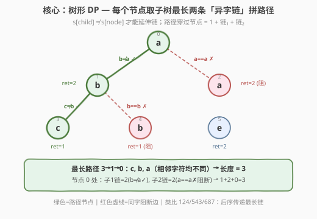
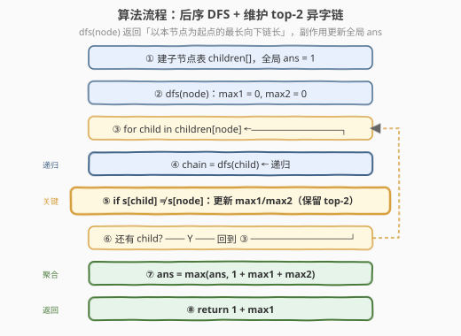
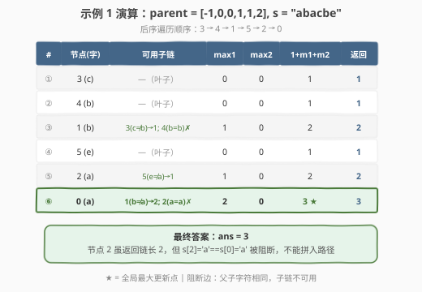

# 相邻字符不同的最长路径

- **题目名称**：相邻字符不同的最长路径
- **链接**：[2246. 相邻字符不同的最长路径](https://leetcode.cn/problems/longest-path-with-different-adjacent-characters/)
- **难度**：困难
- **标签**：树、深度优先搜索、动态规划、后序遍历

## 1. 题目概述

给定一棵以节点 `0` 为根的 **$n$ 节点树**，用 `parent` 数组描述：`parent[i]` 是节点 $i$ 的父节点（`parent[0] = -1` 表示根）。每个节点 $i$ 上有一个字符 `s[i]`。

要求找出树中一条**最长路径**，满足路径上**相邻节点的字符不同**。路径长度 = 路径上的**节点数**。

**示例 1**：

```text
输入：parent = [-1,0,0,1,1,2], s = "abacbe"
输出：3

        0(a)
       / \
     1(b) 2(a)
    / \    \
  3(c) 4(b) 5(e)
```

最长路径为 `3→1→0`（字符 `c, b, a`，相邻均不同），长度 $= 3$。边 `0-2` 因 `a==a` 被阻断，边 `1-4` 因 `b==b` 被阻断。

**示例 2**：

```text
输入：parent = [-1,0,0,0], s = "aabc"
输出：3

      0(a)
    / | \
  1(a) 2(b) 3(c)
```

最长路径为 `2→0→3`（字符 `b, a, c`，相邻均不同），长度 $= 3$。边 `0-1` 因 `a==a` 被阻断。

**约束条件**：

- $n = \text{parent.length}$
- $1 \le n \le 10^5$
- `parent[0] == -1`，对 $i \ge 1$ 有 `parent[i]` 是 $0$ 到 $i-1$ 之间的整数
- $s$ 由小写英文字母组成，$|s| = n$

> 💡 本题是「**树形 DP + 后序传递最长链**」家族的招牌题。与 [124. 二叉树最大路径和](https://leetcode.cn/problems/binary-tree-maximum-path-sum/)、[543. 二叉树直径](https://leetcode.cn/problems/diameter-of-binary-tree/)、[687. 最长同值路径](https://leetcode.cn/problems/longest-univalue-path/) 一脉相承——都是「后序 DFS 返回以本节点为起点的最长向下链，在节点处取 top-2 子链拼成路径」。区别仅在于**延伸条件**：本题要求 $s[\text{child}] \neq s[\text{node}]$（异字延伸），687 要求 $s[\text{child}] == s[\text{node}]$（同字延伸）。

---

## 2. 解题思路

### 2.1 暴力思路：枚举所有路径

最直观的做法：枚举树中每对节点 $(u, v)$，检查 $u$ 到 $v$ 的路径上相邻字符是否全不同，取最长。树中两点间路径唯一，但枚举对数 $O(n^2)$，每条路径验证 $O(n)$，总计 $O(n^3)$。$n \le 10^5$ 完全不可行。

> ⚠️ 暴力法的浪费在于：**路径信息没有复用**。子路径的「最长异字链」一旦算出，父节点可直接使用，无需重新扫描。

### 2.2 核心观察：树形 DP — 后序传递最长异字链



**关键洞察**：最长路径必定**穿过某个节点**（以该节点为「最高点」，路径在其子树中分两叉向下延伸）。因此问题转化为：对每个节点，求出从它出发向下的**两条最长异字链**，拼成穿过该节点的路径。

> **定义**：`dfs(node)` 返回**以 `node` 为起点、向下延伸的最长异字链的节点数**（含 `node` 自身）。链上相邻节点字符必须不同。

**最优子结构**：

$$\text{chain}(node) = 1 + \max_{\substack{c \in \text{children}(node) \\ s[c] \neq s[node]}} \text{chain}(c)$$

- 若没有字符不同的子节点，$\text{chain}(node) = 1$（只有自身）。
- 否则取字符不同的子节点中**最大的链**，加 1（自身）。

**路径聚合**：在 `node` 处，取字符不同的子节点链中**最大的两条** $\text{max1}, \text{max2}$，则穿过 `node` 的路径长度为：

$$\text{path}(node) = 1 + \text{max1} + \text{max2}$$

该路径形如：`子链₁ → node → 子链₂`，三段内部相邻字符均不同（子链由递归保证），`node` 与两端子节点字符也不同（筛选条件保证），因此整条路径合法。

> ⚠️ **为什么只取 top-2？** 路径至多分两叉（一条向左下、一条向右下），取超过两条子链无法构成一条简单路径。这与 124（取 top-2 贡献值）和 543（取 top-2 深度）完全同理。

### 2.3 算法流程图



**DFS 完整步骤**（函数 `dfs(node)` 返回 `int`）：

1. **初始化**：`max1 = 0, max2 = 0`（top-2 子链长，0 表示无可用子链）；
2. **遍历子节点**：对每个 `child ∈ children[node]`：
   - **递归**：`chain = dfs(child)`；
   - **异字判定**：若 $s[\text{child}] \neq s[\text{node}]$，则 `chain` 可用，更新 top-2：
     - 若 `chain > max1`：`max2 = max1; max1 = chain`；
     - 否则若 `chain > max2`：`max2 = chain`；
   - 若 $s[\text{child}] == s[\text{node}]$：**跳过**（该子链不可延伸到 `node`），但仍需递归以更新子树内部的 `ans`；
3. **聚合**：`ans = max(ans, 1 + max1 + max2)`；
4. **返回**：`return 1 + max1`（以 `node` 为起点的最长向下链）。

> 💡 **关键细节：同字子节点仍需递归**。即使 $s[\text{child}] == s[\text{node}]$ 使得该子链不能拼到 `node` 的路径上，子树内部仍可能存在更长的合法路径（如 `child` 的另一侧子树中的长链）。因此递归不能跳过，只是**不使用其返回值**更新 `max1/max2`。

### 2.4 示例演算

以示例 1 `parent = [-1,0,0,1,1,2], s = "abacbe"` 为例，后序遍历顺序 `3 → 4 → 1 → 5 → 2 → 0`：



| 后序 | 节点(字符) | 可用子链 | max1 | max2 | 穿过路径 | 返回值 |
|------|-----------|---------|------|------|---------|--------|
| ① | 3 (c) | —（叶子） | 0 | 0 | 1 | 1 |
| ② | 4 (b) | —（叶子） | 0 | 0 | 1 | 1 |
| ③ | 1 (b) | 3(c≠b)→1; 4(b=b)✗ | 1 | 0 | 2 | 2 |
| ④ | 5 (e) | —（叶子） | 0 | 0 | 1 | 1 |
| ⑤ | 2 (a) | 5(e≠a)→1 | 1 | 0 | 2 | 2 |
| ⑥ | 0 (a) | 1(b≠a)→2; 2(a=a)✗ | 2 | 0 | **3** ★ | 3 |

**关键步骤解析**：

- **③ 节点 1(b)**：子节点 3(c) 字符不同，链长 1 可用；子节点 4(b) 字符相同（`b==b`），链不可用。`max1=1, max2=0`，路径 $= 1+1+0 = 2$，返回 $1+1=2$。
- **⑤ 节点 2(a)**：子节点 5(e) 字符不同，链长 1 可用。`max1=1, max2=0`，路径 $= 2$，返回 $1+1=2$。
- **⑥ 节点 0(a)**：子节点 1(b) 字符不同，链长 2 可用 → `max1=2`；子节点 2(a) 字符相同（`a==a`），**链长 2 被阻断**，不可用。`max2=0`，路径 $= 1+2+0 = 3$ ★，返回 $1+2=3$。

最终 `ans = 3` ✓。

> 💡 **阻断效应**：节点 2 虽返回链长 2，但因 $s[2]=s[0]=\text{'a'}$，这条链无法从节点 0 延伸。若 `s` 改为 `"abacbe"` 中 `s[2]` 为非 `'a'` 字符（如 `'d'`），则节点 0 可用 `max1=2, max2=2`，路径 $= 1+2+2 = 5$，答案大幅提升。

---

## 3. 参考代码

### C++：后序 DFS + top-2 链（$O(n)$ / $O(n)$）

```cpp
class Solution {
public:
    int longestPath(vector<int>& parent, string s) {
        int n = parent.size();
        vector<vector<int>> children(n);
        for (int i = 1; i < n; i++) {
            children[parent[i]].push_back(i);
        }
        int ans = 1;
        dfs(0, children, s, ans);
        return ans;
    }

private:
    int dfs(int node, vector<vector<int>>& children, string& s, int& ans) {
        int max1 = 0, max2 = 0;
        for (int child : children[node]) {
            int chain = dfs(child, children, s, ans);
            if (s[child] != s[node]) {
                if (chain > max1) {
                    max2 = max1;
                    max1 = chain;
                } else if (chain > max2) {
                    max2 = chain;
                }
            }
        }
        ans = max(ans, 1 + max1 + max2);
        return 1 + max1;
    }
};
```

### Python：后序 DFS + top-2 链（$O(n)$ / $O(n)$）

```python
class Solution:
    def longestPath(self, parent: List[int], s: str) -> int:
        n = len(parent)
        children = [[] for _ in range(n)]
        for i in range(1, n):
            children[parent[i]].append(i)

        ans = 1

        def dfs(node: int) -> int:
            nonlocal ans
            max1 = max2 = 0
            for child in children[node]:
                chain = dfs(child)
                if s[child] != s[node]:
                    if chain > max1:
                        max1, max2 = chain, max1
                    elif chain > max2:
                        max2 = chain
            ans = max(ans, 1 + max1 + max2)
            return 1 + max1

        dfs(0)
        return ans
```

> 💡 两版等价。`dfs` 同时承担「返回最长向下链」与「副作用更新 `ans`」两职——返回值驱动父节点的 top-2 更新，副作用 `ans = max(...)` 记录全局最优。这是树形路径最值题的通用模板，与 124/543/687 的写法几乎逐行对应。

---

## 4. 复杂度分析

| 维度 | 复杂度 | 说明 |
|------|--------|------|
| **时间复杂度** | $O(n)$ | 每个节点只访问一次，每次做 $O(1)$ 的 top-2 更新（无排序） |
| **空间复杂度** | $O(n)$ | `children` 邻接表 $O(n)$ + 递归栈最深 $O(n)$（退化链状） |
| **最坏情况** | $O(n)$ 空间 | 树退化为单链时递归深度达 $n$ |

> ⚠️ **无需排序**：虽然要取 top-2 子链，但只需在遍历子节点时用 $O(1)$ 比较维护 `max1/max2`，无需对子链排序。即使某节点有 $O(n)$ 个子节点（星形树），总比较次数仍为 $O(n)$。若误用排序则总时间退化为 $O(n \log n)$。

---

## 5. 扩展：迭代法后序遍历

递归写法在树退化为单链时递归深度达 $n$，极端情况下可能栈溢出。可用显式栈做后序遍历：

```python
class Solution:
    def longestPath(self, parent: List[int], s: str) -> int:
        n = len(parent)
        children = [[] for _ in range(n)]
        for i in range(1, n):
            children[parent[i]].append(i)

        ans = 1
        chain = [0] * n           # chain[node] = dfs(node) 的返回值
        stack = [(0, False)]      # (节点, 是否已处理子节点)

        while stack:
            node, visited = stack.pop()
            if visited:
                max1 = max2 = 0
                for child in children[node]:
                    c = chain[child]
                    if s[child] != s[node]:
                        if c > max1:
                            max1, max2 = c, max1
                        elif c > max2:
                            max2 = c
                ans = max(ans, 1 + max1 + max2)
                chain[node] = 1 + max1
            else:
                stack.append((node, True))    # 后序：根最后处理
                for child in reversed(children[node]):
                    stack.append((child, False))

        return ans
```

> 💡 **迭代 vs 递归**：迭代版用 `visited` 标记模拟后序「先子后根」的顺序，用 `chain` 数组替代递归返回值传递。时间同样 $O(n)$，空间 $O(n)$（栈 + 数组）。逻辑更繁，**面试推荐递归版**——简洁且能体现对后序子结构传递的理解。迭代版仅在树极深（$n > 10^5$ 且退化为链）时才有实际优势。

---

## 6. 面试要点

1. **为什么用后序遍历？**

   > 最长路径穿过某节点时，需要知道其子树中各向下的最长异字链——这是「子问题结果决定父问题」的典型结构，对应后序（先子后根）。前序在处理父节点时尚未获取子树信息，无法一次遍历完成。

2. **同字子节点为什么仍需递归？**

   > $s[\text{child}] == s[\text{node}]$ 仅意味着该子链**不能从 `node` 向下延伸**（边 `node-child` 不合法），但子树内部仍可能有更长的合法路径（如 `child` 的另一个子节点方向上的长链）。跳过递归会遗漏子树内部的答案。递归不能省，只是**不使用其返回值**更新 `max1/max2`。

3. **为什么只取 top-2 而非所有子链？**

   > 一条简单路径至多在某个节点处**分两叉**（一左一右），取超过两条子链无法构成一条简单路径。这与 124（取 top-2 贡献值拼路径和）和 543（取 top-2 深度拼直径）完全同理——「穿过节点的最长路径 = top-1 子链 + 节点自身 + top-2 子链」。

4. **本题与 687（最长同值路径）的区别？**

   > 几乎完全相同，仅**延伸条件相反**：687 要求 $s[\text{child}] == s[\text{node}]$（同字才延伸），本题要求 $s[\text{child}] \neq s[\text{node}]$（异字才延伸）。此外 687 是二叉树（至多 2 子），本题是 N 叉树（子节点数不限），需用 top-2 维护而非直接取左右。模板一致，改一个 `!=` 为 `==` 即可互化。

5. **$n \le 10^5$ 时递归栈溢出怎么办？**

   > Python 默认递归深度约 1000，退化链状树会溢出。两种方案：① 手动调 `sys.setrecursionlimit(200000)`（简单但治标）；② 改用迭代后序遍历（第 5 节给出）。C++ 递归深度限制更宽松（取决于栈大小），一般无需特殊处理。

> 💡 **一句话总结**：2246 的灵魂是「**后序 DFS 传递最长向下异字链，在节点处取 top-2 拼路径**」——与 124/543/687 同一套「后序 + 返回值 + 副作用记录最值」模板，仅延伸条件从「同值」变为「异值」，是 N 叉树版的最长路径 DP 招牌题。

---

## 7. 同类练习题

- [124. 二叉树中的最大路径和](https://leetcode.cn/problems/binary-tree-maximum-path-sum/)：后序传递子树最大贡献值，在节点处取 top-2 拼路径和，同套「后序 + top-2 聚合」模板的鼻祖
- [543. 二叉树的直径](https://leetcode.cn/problems/diameter-of-binary-tree/)：后序传递子树深度，在节点处取 top-2 深度拼直径，模板最简洁的入门版
- [687. 最长同值路径](https://leetcode.cn/problems/longest-univalue-path/)：本题的「同字版」镜像——延伸条件从 $s[\text{child}] \neq s[\text{node}]$ 改为 $==$，其余完全相同
- [1522. N 叉树的直径](https://leetcode.cn/problems/diameter-of-n-ary-tree/)：N 叉树版直径，后序传递深度 + top-2 聚合，与本题同为 N 叉树路径最值题
- [2246. 相邻字符不同的最长路径](https://leetcode.cn/problems/longest-path-with-different-adjacent-characters/)（本题）：N 叉树 + 异字约束的最长路径，综合了 543 的结构与 687 的字符条件
