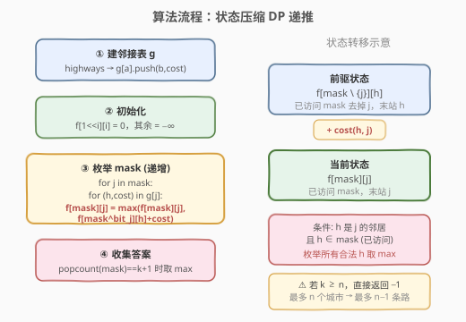
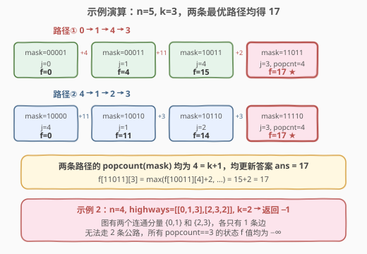

# K 条高速公路的最大旅行费用

- **题目名称**：K 条高速公路的最大旅行费用
- **链接**：[2247. K 条高速公路的最大旅行费用](https://leetcode.cn/problems/maximum-cost-of-trip-with-k-highways/)
- **难度**：困难
- **标签**：位运算、图、动态规划、状态压缩、位掩码

## 1. 题目概述

一系列高速公路连接从 `0` 到 `n - 1` 的 $n$ 个城市。给定一个二维整数数组 `highways`，其中 `highways[i] = [city1, city2, toll]` 表示一条**双向**高速公路连接 `city1` 与 `city2`，通行费用为 `toll`。

要求**正好**经过 $k$ 条公路。可以从**任意城市**出发，但旅途中每个城市**最多访问一次**。返回旅行的**最大费用**；若无合法行程，返回 $-1$。

**示例 1**：

```text
输入：n = 5, highways = [[0,1,4],[2,1,3],[1,4,11],[3,2,3],[3,4,2]], k = 3
输出：17

    0
    |4
    1 --11-- 4
    |3       |2
    2 --3--- 3
```

路径 `0→1→4→3`：费用 $4 + 11 + 2 = 17$。路径 `4→1→2→3`：费用 $11 + 3 + 3 = 17$。可以证明 $17$ 是最大值。注意 `4→1→0→1` 非法（城市 1 访问两次）。

**示例 2**：

```text
输入：n = 4, highways = [[0,1,3],[2,3,2]], k = 2
输出：-1
```

图有两个连通分量 $\{0,1\}$ 和 $\{2,3\}$，各只有 1 条边，无法走出 2 条公路的行程。

**约束条件**：

- $2 \le n \le 15$
- $1 \le \text{highways.length} \le 50$
- `highways[i].length == 3`，$0 \le \text{city1}, \text{city2} \le n-1$，$\text{city1} \neq \text{city2}$
- $0 \le \text{toll} \le 100$
- $1 \le k \le 50$
- 没有重复的高速公路

> ⚠️ **关键信号**：$n \le 15$ 是**状压 DP（bitmask DP）**的标志性范围——$2^{15} = 32768$ 个状态，恰好落在可枚举全部子集的甜区。结合「每个城市最多访问一次」的约束（即已访问集合决定后续可选城市），第一反应应是状压 DP。本题是 [526. 优美的排列](../0501-0600/526_优美的排列.md) 的图上最值变体——从「排列计数」升级为「图上路径最大费用」。

---

## 2. 解题思路

### 2.1 暴力思路：枚举所有简单路径

最直观的做法：从每个城市出发做 DFS 回溯，枚举所有长度恰好为 $k$ 的简单路径（不重复访问城市），取费用最大值。每个城市有至多 $n-1$ 个邻居可选，路径长度 $k$，最坏情况枚举量 $\approx (n-1)^k$。$n=15, k=14$ 时约 $14^{14} \approx 10^{16}$，完全不可行。

> ⚠️ 暴力法的浪费在于：**同一组已访问城市 + 同一末站**可以从不同路径到达，但后续能延伸的最大费用只取决于「已访问集合」和「当前位置」，与到达顺序无关。这正是 DP 的最优子结构信号。

### 2.2 核心观察：状态压缩 DP — 用位掩码记录已访问城市

![核心观察：位掩码记录已访问城市，f[mask][j] = 最大旅行费用](../images/2247_concept.svg)

**关键洞察**：一条合法行程是一条**简单路径**（不重复访问城市），恰好经过 $k$ 条边 = 访问 $k+1$ 个不同城市。在任意中间时刻，决定后续可能性的只有两件事：

1. **哪些城市已经访问过**（决定还能去哪些）；
2. **当前所在的城市**（决定下一步能走哪些边）。

用 $n$ 位二进制数 `mask` 编码已访问集合（第 $i$ 位为 $1$ 表示城市 $i$ 已访问），再用一个城市编号 $j$ 记录末站，即可完整刻画状态。

> **定义**：$f[\text{mask}][j]$ = 已访问城市集合为 `mask`（其中 $j$ 必在 mask 中）、当前位于城市 $j$ 时，所能获得的最大累计费用。

**提前剪枝**：$k+1$ 个不同城市 $\le n$，所以 $k \ge n$ 时直接返回 $-1$。

### 2.3 状态转移与算法流程



**状态转移方程**：

$$f[\text{mask}][j] = \max_{\substack{h \in \text{neighbors}(j) \\ h \in \text{mask}}} \left\{ f[\text{mask} \setminus \{j\}][h] + \text{cost}(h, j) \right\}$$

其中 $\text{mask} \setminus \{j\}$ 即 `mask ^ (1 << j)`（将 mask 的第 $j$ 位置 $0$）。含义：最后一步是从邻居 $h$ 经公路到达 $j$，费用累加。

**算法步骤**：

1. **建邻接表**：`g[a]` 存储 `(b, cost)` 对（双向）。
2. **初始化**：$f[1 \ll i][i] = 0$（从城市 $i$ 单独出发，费用为 $0$），其余 $= -\infty$。
3. **递推**：按 `mask` 从小到大枚举（保证前驱状态 `mask ^ (1<<j)` 已算出）。对每个在 mask 中的 $j$，枚举 $j$ 的邻居 $h$（也在 mask 中），更新：

   `f[mask][j] = max(f[mask][j], f[mask ^ (1<<j)][h] + cost)`

4. **收集答案**：对所有 `popcount(mask) == k+1` 的状态，取 $f[\text{mask}][j]$ 的最大值。若全为 $-\infty$ 则返回 $-1$。

> 💡 **为什么按 mask 递增枚举有效？** 前驱状态 `mask ^ (1<<j)` 比 `mask` 少一个 $1$，数值更小。从小到大遍历保证计算 `f[mask][j]` 时前驱已就绪。这与 [526](../0501-0600/526_优美的排列.md) 的递推方向完全同理——「推」式 DP 沿状态 DAG 自然拓扑序前进。

### 2.4 示例演算

以示例 1 `n=5, highways=[[0,1,4],[2,1,3],[1,4,11],[3,2,3],[3,4,2]], k=3` 为例。两条最优路径的 DP 演算如下：



**路径① 0→1→4→3**：

| 步骤 | mask（二进制） | 末站 j | 转移 | f 值 |
|------|---------------|--------|------|------|
| 起点 | 00001 | 0 | 初始化 | 0 |
| +4 | 00011 | 1 | $f[00001][0] + 4$ | 4 |
| +11 | 10011 | 4 | $f[00011][1] + 11$ | 15 |
| +2 | 11011 | 3 | $f[10011][4] + 2$ | **17** ★ |

**路径② 4→1→2→3**：

| 步骤 | mask（二进制） | 末站 j | 转移 | f 值 |
|------|---------------|--------|------|------|
| 起点 | 10000 | 4 | 初始化 | 0 |
| +11 | 10010 | 1 | $f[10000][4] + 11$ | 11 |
| +3 | 10110 | 2 | $f[10010][1] + 3$ | 14 |
| +3 | 11110 | 3 | $f[10110][2] + 3$ | **17** ★ |

两个最终状态的 `popcount` 均为 $4 = k+1$，共同将答案推至 $17$。

> 💡 **关键细节**：状态 $f[11011][3]$ 的前驱不止一个——`mask ^ (1<<3) = 10011`，末站可以是 $4$（费用 $15+2=17$），也可以是 $0$（但 $0$ 与 $3$ 间无公路，不可达）。DP 自动枚举所有合法前驱取 max，无需关心路径具体形状。

---

## 3. 参考代码

### C++：状压 DP 递推（$O(2^n \cdot n^2)$ / $O(2^n \cdot n)$）

```cpp
class Solution {
public:
    int maximumCost(int n, vector<vector<int>>& highways, int k) {
        if (k >= n) return -1;
        vector<vector<pair<int, int>>> g(n);
        for (auto& h : highways) {
            g[h[0]].emplace_back(h[1], h[2]);
            g[h[1]].emplace_back(h[0], h[2]);
        }
        int f[1 << n][n];
        memset(f, -0x3f, sizeof(f));
        for (int i = 0; i < n; ++i)
            f[1 << i][i] = 0;
        int ans = -1;
        for (int mask = 0; mask < (1 << n); ++mask) {
            for (int j = 0; j < n; ++j) {
                if (mask >> j & 1) {
                    for (auto& [h, cost] : g[j]) {
                        if (mask >> h & 1) {
                            f[mask][j] = max(f[mask][j], f[mask ^ (1 << j)][h] + cost);
                        }
                    }
                }
                if (__builtin_popcount(mask) == k + 1)
                    ans = max(ans, f[mask][j]);
            }
        }
        return ans;
    }
};
```

### Python：状压 DP 递推（$O(2^n \cdot n^2)$ / $O(2^n \cdot n)$）

```python
class Solution:
    def maximumCost(self, n: int, highways: List[List[int]], k: int) -> int:
        if k >= n:
            return -1
        g = [[] for _ in range(n)]
        for a, b, cost in highways:
            g[a].append((b, cost))
            g[b].append((a, cost))
        f = [[-inf] * n for _ in range(1 << n)]
        for i in range(n):
            f[1 << i][i] = 0
        ans = -1
        for mask in range(1 << n):
            for j in range(n):
                if mask >> j & 1:
                    for h, cost in g[j]:
                        if mask >> h & 1:
                            f[mask][j] = max(f[mask][j], f[mask ^ (1 << j)][h] + cost)
                if mask.bit_count() == k + 1:
                    ans = max(ans, f[mask][j])
        return ans
```

> 💡 两版等价。`memset(f, -0x3f, ...)` 用极小负数表示「不可达」，比 $-1$ 安全——路费可能为 $0$，用 $-1$ 会与合法状态混淆。`__builtin_popcount` / `int.bit_count()` 是 CPU 单指令 popcount，远快于手写循环。注意 `f[mask ^ (1<<j)][h]` 必须保证 $h \in \text{mask}$（由 `if mask >> h & 1` 守卫），否则会读取未初始化状态。

---

## 4. 复杂度分析

| 维度 | 复杂度 | 说明 |
|------|--------|------|
| **时间复杂度** | $O(2^n \cdot n^2)$ | $2^n$ 个 mask，每个 mask 枚举 $n$ 个城市 $j$，每个 $j$ 检查至多 $n$ 个邻居 |
| **空间复杂度** | $O(2^n \cdot n)$ | DP 表 $f[2^n][n]$ |
| **实际常数** | 较小 | 邻居数通常远小于 $n$（highways $\le 50$），内层循环很快 |

$n=15$ 时约为 $2^{15} \times 15 \times 15 \approx 7.4 \times 10^6$ 次操作，毫秒级完成。$k \ge n$ 的提前剪枝避免了无意义的计算。

> ⚠️ **空间优化**：由于 `f[mask]` 只依赖 `f[mask ^ (1<<j)]`（少一个 1 的状态），理论上可按 popcount 分层滚动。但 $n \le 15$ 时 $2^{15} \times 15 \times 4\text{B} \approx 2\text{MB}$，完全无需优化。面试中直接开满二维数组即可。

---

## 5. 扩展：记忆化搜索写法

递推法按 mask 从小到大填充 DP 表，逻辑清晰但需要遍历所有 $2^n$ 个状态（含大量不可达状态）。记忆化搜索（自顶向下）只在「从某个起点出发能实际到达的状态」上计算，常数更优。

### Python：记忆化搜索

```python
class Solution:
    def maximumCost(self, n: int, highways: List[List[int]], k: int) -> int:
        if k >= n:
            return -1
        g = [[] for _ in range(n)]
        for a, b, cost in highways:
            g[a].append((b, cost))
            g[b].append((a, cost))

        @lru_cache(None)
        def dfs(mask: int, j: int) -> int:
            if mask == (1 << j):
                return 0
            best = -inf
            for h, cost in g[j]:
                if mask >> h & 1:
                    val = dfs(mask ^ (1 << j), h)
                    if val > -inf:
                        best = max(best, val + cost)
            return best

        ans = -1
        target = k + 1
        for mask in range(1 << n):
            if mask.bit_count() == target:
                for j in range(n):
                    if mask >> j & 1:
                        val = dfs(mask, j)
                        if val > -inf:
                            ans = max(ans, val)
        return ans
```

> 💡 **递推 vs 记忆化**：递推写法更短、无递归栈，适合 $n$ 较大时；记忆化只访问可达状态，在图稀疏时常数更小。两者状态定义与转移完全一致，面试中任选一种即可，推荐先写递推（更不容易出错）。

---

## 6. 面试要点

1. **为什么 $n \le 15$ 提示用状压 DP？**

   > $2^{15} = 32768$，状态空间可承受。一般 $n \le 20$ 的「选/不选」或「已用集合」型计数/最值问题都可考虑状压 DP，这是识别该套路的经验阈值。本题的「每个城市最多访问一次」天然对应「已访问集合」的状态编码。

2. **状态为什么需要两维 `mask` 和 `j`，不能只用 `mask`？**

   > `mask` 只记录了已访问哪些城市，但后续能走哪些边取决于**当前所在城市**。同一组已访问城市从不同末站出发，后续可延伸的路径完全不同。因此必须额外记录末站 $j$，状态为 $f[\text{mask}][j]$。对比 [526](../0501-0600/526_优美的排列.md) 只需一维 `mask`——因为排列的下一位置由 `popcount(mask)` 唯一确定，而图上路径的下一步取决于当前节点，不能从 mask 推出。

3. **为什么 $k \ge n$ 直接返回 $-1$？**

   > $k$ 条公路的行程访问 $k+1$ 个不同城市。城市总共只有 $n$ 个，所以 $k+1 \le n$ 即 $k \le n-1$。$k \ge n$ 时不可能存在合法行程，提前返回避免无效计算。

4. **为什么用 $-\infty$ 而非 $-1$ 表示不可达？**

   > 公路费用 $\text{toll} \ge 0$，一条合法路径的累计费用也可以是 $0$（所有 toll 均为 $0$）。若用 $-1$ 表示不可达，则 $f[\text{mask}][j] = 0$ 既可能是「合法且费用为 $0$」也可能是「未初始化」，产生歧义。用极小负数（如 $-0x3f3f3f3f$）能明确区分不可达状态。

5. **递推时为什么要按 mask 从小到大枚举？**

   > 前驱状态 `mask ^ (1<<j)` 比 `mask` 少一个 1，二进制值更小。从小到大遍历 mask 保证计算 `f[mask][j]` 时 `f[mask ^ (1<<j)][h]` 已经算出。这是状态 DP 的拓扑序保证——沿「子集关系」构成的状态 DAG 自然有序。

> 💡 **一句话总结**：2247 的灵魂是「**图上简单路径最值 → 状压 DP，mask 编码已访问集合 + 末站 j 双维状态**」——与 526 同为 $n \le 15$ 的状压家族，区别在于 526 的后继由位置编号决定（一维够用），而图上路径的后继由当前节点决定（需二维）。是「图 + 位掩码 DP」交叉的招牌题。

---

## 7. 同类练习题

- [526. 优美的排列](https://leetcode.cn/problems/beautiful-arrangement/)（[站内题解](../0501-0600/526_优美的排列.md)）：状压 DP 入门招牌，`mask` 表示已放数字集合，一维状态（位置由 popcount 推出），对比本题为何需要二维
- [847. 访问所有节点的最短路径](https://leetcode.cn/problems/shortest-path-visiting-all-nodes/)：图上状压 DP 经典题，`f[mask][j]` = 访问 mask 中节点且当前在 j 的最短路径，与本题状态设计完全同构（最短 vs 最大）
- [943. 最短超级串](https://leetcode.cn/problems/find-the-shortest-superstring/)：状压 DP + 图上转移，`mask` 表示已用字符串集合，状态设计与本题同类
- [1799. N 次操作后的最大分数](https://leetcode.cn/problems/maximize-score-after-n-operations/)：状压 DP 最值型，`mask` 表示剩余可用数字，成对取数求最大得分
- [1655. 分配重复整数](https://leetcode.cn/problems/distribute-repeating-integers/)：状压 DP 进阶，`mask` 表示已分配的需求子集，承接本题的「集合编码 + 转移」思路
