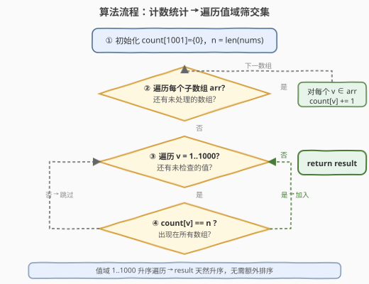
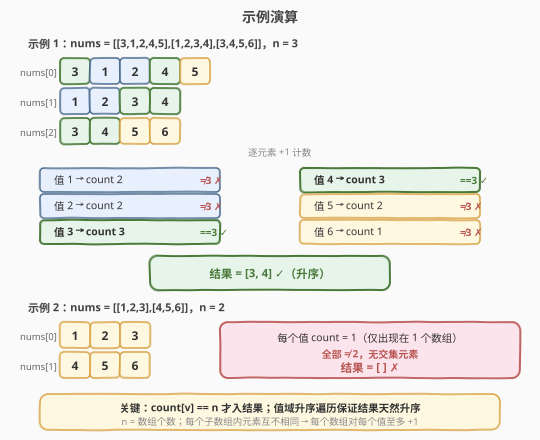

# LeetCode 多个数组求交集 题解

## 1. 题目概述

- **标题 / 题号**：多个数组求交集（#2248，easy）
- **链接**：https://leetcode.cn/problems/intersection-of-multiple-arrays/
- **难度**：简单
- **标签**：数组、哈希表、计数

**题意**：给定一个二维整数数组 `nums`，其中 `nums[i]` 是由**互不相同**的正整数组成的非空数组。要求按**升序**返回一个数组，其中的每个元素在 `nums` 的**所有数组**中都出现过。

**示例 1**：

```text
输入：nums = [[3,1,2,4,5],[1,2,3,4],[3,4,5,6]]
输出：[3,4]
解释：
nums[0] = [3,1,2,4,5]，nums[1] = [1,2,3,4]，nums[2] = [3,4,5,6]
在每个数组中都出现的数字是 3 和 4，升序返回 [3,4]。
```

**示例 2**：

```text
输入：nums = [[1,2,3],[4,5,6]]
输出：[]
解释：不存在同时出现在 nums[0] 和 nums[1] 的整数，返回空列表。
```

**约束**：

- $1 \le \text{nums.length} \le 1000$（子数组个数 $n$）
- $1 \le \sum \text{nums[i].length} \le 1000$（所有元素总数 $S$）
- $1 \le \text{nums[i][j]} \le 1000$（值域 $V = 1000$）
- `nums[i]` 中的所有值**互不相同**

> 💡 本题是「多集合求交集」的最简入门。关键约束有三：① 每个子数组内元素**互不相同**（保证计数即「数组覆盖率」，不会被同一数组重复 +1）；② 值域**紧凑** $[1,1000]$（可用定长数组代替哈希表，且升序遍历值域即得升序结果）；③ 元素总数 $\le 1000$（极小，任意 $O(S)$ 解法都轻松 AC）。把题意翻译成「`count[v] == n` 即交集元素」后，剩下的就是一次遍历计数 + 一次遍历筛值。

## 2. 解题思路

### 2.1 暴力思路：逐元素跨数组查存在性

最直观的做法：取第一个数组 `nums[0]` 的每个元素 $v$，对其余 $n-1$ 个数组逐一做**线性查找**，若 $v$ 在所有数组中都存在则收入结果。

```text
result = []
for v in nums[0]:
    if all(v in arr for arr in nums[1:]):
        result.append(v)
sort(result)
return result
```

设第一个数组长度为 $m$，元素总数为 $S$。每次跨数组查找最坏需扫描全部 $S$ 个元素，总计 $O(m \cdot S)$；最后还需 $O(m \log m)$ 排序。$m, S \le 1000$ 时约 $10^6$ 次操作，能过但**重复扫描浪费严重**——同一数组被反复遍历，且每个值的存在性被独立判定，没有复用。

> ⚠️ 暴力法的浪费在于「**信息没有一次性提取**」：我们其实只关心每个值出现在多少个数组中，而非它在某个特定数组里的位置。一次遍历就能把「出现次数」全部统计出来，后续只需比较次数。

### 2.2 核心观察：计数即数组覆盖率，count[v] == n 即交集

![核心：count[v] = v 出现在多少个数组中，count[v] == n 即交集](../images/2248_concept.svg)

**关键转化**：把「$v$ 在所有数组中都出现过」翻译成计数语言。

由于每个 `nums[i]` 内元素**互不相同**，对值 $v$ 而言，它在第 $i$ 个数组中**至多出现一次**。因此若在遍历时对「$v$ 所在的每个数组」各 $+1$，则最终计数恰好等于**包含 $v$ 的数组个数**：

$$
\text{count}[v] = |\{\, i : v \in \text{nums[i]} \,\}|
$$

> **交集判定**：$v$ 属于所有数组的交集，当且仅当 $\text{count}[v] = n$（$n$ 为数组个数）。

$$
v \in \bigcap_{i=0}^{n-1} \text{nums[i]} \iff \text{count}[v] = n
$$

**必要性**：若 $v$ 在所有数组中出现，则每个数组贡献一次，$\text{count}[v] = n$。

**充分性**：若 $\text{count}[v] = n$，由于每个数组至多贡献一次，说明全部 $n$ 个数组都包含 $v$。

> 💡 **为什么「互不相同」是关键前提？** 若同一数组内允许重复（如 `nums[i] = [3,3,4]`），则 $v=3$ 会被同一数组 $+2$，此时 $\text{count}[v]$ 不再等于「包含 $v$ 的数组个数」而是「总出现次数」，判定条件失效。本题保证互不相同，计数法才成立。若去掉该约束，需改为「每个数组用集合去重后再计数」或「逐数组集合求交」。

**值域紧凑的红利**：约束 $\text{nums[i][j]} \le 1000$ 使得可用定长数组 `count[1001]` 代替哈希表——$O(1)$ 查询、无哈希开销。更妙的是，**按 $v = 1, 2, \dots, 1000$ 升序遍历值域筛结果**，收集到的元素天然升序，无需额外排序。

**边界与特例**：

- **单个数组**（$n = 1$）：该数组所有元素 $\text{count} = 1 = n$，结果 = 该数组升序。
- **无交集**（如示例 2）：所有值 $\text{count} < n$，结果为空。
- **所有数组相同**：交集 = 该数组本身。

### 2.3 算法流程图



**完整步骤**：

1. **初始化**：`count[1001] = {0}`，`n = len(nums)`。
2. **遍历计数**：对每个子数组 `arr ∈ nums`，对每个 `v ∈ arr`，执行 `count[v] += 1`。
3. **筛交集**：令 `result = []`，对 `v` 从 $1$ 到 $1000$：若 `count[v] == n`，则 `result.append(v)`。
4. **返回** `result`（已升序）。

> 💡 **步骤 3 的升序保证**：由于按 $v$ 从小到大遍历值域，先收集小值后收集大值，`result` 天然升序。这是定长数组法相对于哈希表法的一个额外优势——哈希表法需额外排序，而定长数组法「遍历顺序即排序顺序」。

### 2.4 示例演算

以示例 1 `nums = [[3,1,2,4,5],[1,2,3,4],[3,4,5,6]]`，$n = 3$ 为例：



**计数过程**（逐数组遍历，对每个元素 $+1$）：

| 值 | nums[0] | nums[1] | nums[2] | count | == 3? |
|----|---------|---------|---------|-------|-------|
| 1  | +1      | +1      | —       | 2     | ✗     |
| 2  | +1      | +1      | —       | 2     | ✗     |
| 3  | +1      | +1      | +1      | 3     | ✓     |
| 4  | +1      | +1      | +1      | 3     | ✓     |
| 5  | +1      | —       | +1      | 2     | ✗     |
| 6  | —       | —       | +1      | 1     | ✗     |

按 $v = 1 \dots 6$ 升序筛 `count == 3`：值 3 ✓、值 4 ✓，其余 ✗。结果 `= [3, 4]` ✓。

**示例 2** `nums = [[1,2,3],[4,5,6]]`，$n = 2$：每个值只出现在 1 个数组中，$\text{count} = 1 \ne 2$，无交集元素，结果 `= []` ✓。

> ⚠️ 示例 2 中两组元素完全不相交，是「无交集」的最典型场景。即使部分元素跨组出现，只要 $\text{count} < n$ 就不入结果——判定标准统一且简洁。

## 3. 参考代码

### C++（定长数组版，推荐）

```cpp
class Solution {
public:
    vector<int> intersection(vector<vector<int>>& nums) {
        int count[1001] = {0};
        int n = nums.size();
        for (const auto& arr : nums) {
            for (int v : arr) {
                ++count[v];
            }
        }
        vector<int> result;
        for (int v = 1; v <= 1000; ++v) {
            if (count[v] == n) {
                result.push_back(v);
            }
        }
        return result;
    }
};
```

> 💡 约束 $\text{nums[i][j]} \le 1000$ 使定长数组 `count[1001]` 成为最优选择：$O(V)$ 空间（$V = 1000$，可视为 $O(1)$）、无哈希开销、缓存友好。`int` 初始化为 `{0}` 保证全零起始。升序遍历 $v$ 保证 `result` 天然升序。

### C++（哈希表版，值域不受限时通用）

```cpp
class Solution {
public:
    vector<int> intersection(vector<vector<int>>& nums) {
        unordered_map<int, int> count;
        int n = nums.size();
        for (const auto& arr : nums) {
            for (int v : arr) {
                ++count[v];
            }
        }
        vector<int> result;
        for (auto& [v, c] : count) {
            if (c == n) {
                result.push_back(v);
            }
        }
        sort(result.begin(), result.end());
        return result;
    }
};
```

> ⚠️ 哈希表版在值域稀疏或未知时更通用，但需额外 `sort`（哈希表遍历顺序无序）。本题值域紧凑，定长数组版更优——既省排序又省哈希开销。

### Python（定长数组版，推荐）

```python
class Solution:
    def intersection(self, nums: List[List[int]]) -> List[int]:
        count = [0] * 1001
        n = len(nums)
        for arr in nums:
            for v in arr:
                count[v] += 1
        return [v for v in range(1, 1001) if count[v] == n]
```

> 💡 列表推导式一行完成「升序遍历值域 + 筛 count == n」，简洁且高效。`range(1, 1001)` 保证升序，无需 `sort`。

### Python（集合求交版，对照参考）

```python
class Solution:
    def intersection(self, nums: List[List[int]]) -> List[int]:
        result = set(nums[0])
        for arr in nums[1:]:
            result &= set(arr)
        return sorted(result)
```

> ⚠️ 集合求交版逻辑最短：以第一个数组的集合为初始交集，逐个与后续数组的集合做 `&=` 求交，最后 `sorted` 升序。时间同样 $O(S)$，但需额外排序且集合操作有常数开销。适合面试时快速口述思路，定长数组版才是本题的最优实现。

## 4. 复杂度分析

| 维度 | 复杂度 | 说明 |
|------|--------|------|
| **时间复杂度（数组版）** | $O(S + V)$ | 遍历所有元素计数 $O(S)$；遍历值域 $[1,V]$ 筛结果 $O(V)$，本题 $S, V \le 1000$ |
| **时间复杂度（哈希版）** | $O(S + U \log U)$ | 计数 $O(S)$；筛结果 $O(U)$ + 排序 $O(U \log U)$，$U$ 为不同值个数 $\le \min(S, V)$ |
| **时间复杂度（集合版）** | $O(S + U \log U)$ | 逐数组集合求交 $O(S)$ + 最终排序 $O(U \log U)$ |
| **空间复杂度（数组版）** | $O(V)$ | 定长数组大小 $V + 1 = 1001$，与 $n$ 无关，可视为 $O(1)$ |
| **空间复杂度（哈希/集合版）** | $O(U)$ | 至多存 $\min(S, V)$ 个不同值 |

> 💡 本题 $S \le 1000$、$V = 1000$，三种解法均轻松 AC。差异在常数与可扩展性：值域紧凑时**定长数组版最优**（无哈希开销 + 免排序 + 升序遍历即排序）；值域未知时哈希版/集合版通用。养成「先看值域再选计数表实现」的习惯——这与 [2206. 将数组划分成相等数对](../2201-2300/2206_将数组划分成相等数对.md) 的选型逻辑完全一致。

## 5. 扩展：去掉「互不相同」约束后的处理

本题的关键前提是「每个 `nums[i]` 内元素互不相同」，保证了 $\text{count}[v]$ 恰好等于包含 $v$ 的数组个数。若去掉该约束（允许同一数组内重复），计数法会**多算**——同一数组对 $v$ 重复 $+1$，导致 $\text{count}[v] >$ 实际数组覆盖率，判定 `count[v] == n` 失效。

**修正方案一：集合去重后再计数**

```python
class Solution:
    def intersection(self, nums: List[List[int]]) -> List[int]:
        count = [0] * 1001
        n = len(nums)
        for arr in nums:
            for v in set(arr):    # 先去重，每个数组对每个值至多 +1
                count[v] += 1
        return [v for v in range(1, 1001) if count[v] == n]
```

对每个子数组先转 `set` 去重，恢复「每数组每值至多 +1」的不变量，计数法重新成立。

**修正方案二：直接集合求交**

```python
result = set(nums[0])
for arr in nums[1:]:
    result &= set(arr)
return sorted(result)
```

集合运算天然去重，无需关心数组内是否重复——这正是集合求交版在「无互不相同约束」场景下的优势。

> 💡 本题之所以能用最朴素的计数法，正是「互不相同」约束的功劳。面试时可主动讨论「若去掉该约束如何修正」，体现对前提条件的敏感度。

## 6. 面试要点

1. **为什么 `count[v] == n` 是交集的充要条件？**

   > 「互不相同」保证每个数组对值 $v$ 至多贡献一次，因此 $\text{count}[v]$ 恰好等于包含 $v$ 的数组个数。$\text{count}[v] = n$ 意味着全部 $n$ 个数组都含 $v$，即 $v$ 属于交集；反之 $\text{count}[v] < n$ 说明至少一个数组不含 $v$，不在交集中。条件既必要又充分。

2. **定长数组法和哈希表法各自的时间复杂度？为什么选数组？**

   > 数组法 $O(S + V)$，哈希法 $O(S + U \log U)$（需排序）。本题值域 $V = 1000$ 紧凑且已知，数组法无哈希开销、缓存友好，且**按值域升序遍历天然得到升序结果，免排序**——这是数组法相对哈希法的双重优势。值域稀疏或未知（如 $[-10^9, 10^9]$）时才选哈希表。

3. **如何保证结果升序？**

   > 定长数组法在筛结果时按 $v = 1, 2, \dots, 1000$ 升序遍历值域，先收集小值后收集大值，`result` 天然升序，无需 `sort`。哈希表法和集合法因遍历顺序无序，必须额外排序。

4. **若去掉「互不相同」约束，计数法为何失效？如何修正？**

   > 同一数组内若允许重复（如 `[3,3,4]`），值 3 会被同一数组 $+2$，$\text{count}[v]$ 变成「总出现次数」而非「数组覆盖率」，`count[v] == n` 不再等价于「所有数组含 $v$」。修正：对每个子数组先转 `set` 去重再计数，或直接用集合求交法（集合运算天然去重）。

5. **集合求交法和计数法相比有何优劣？**

   > 集合法（`result = set(nums[0])`，逐个 `&=`）逻辑最短、天然处理重复，适合口述思路。但需额外排序且集合运算有常数开销。计数法（定长数组）在本题值域紧凑时更优——免排序、无哈希开销、升序遍历即排序。两者时间同为 $O(S)$，差异在常数与是否需排序。

## 同类练习题

| # | 题目 | 与本题的关联 |
|---|------|-------------|
| 349 | [两个数组的交集](https://leetcode.cn/problems/intersection-of-two-arrays/) | 两集合求交集的最简版，本题 $n$ 个数组的退化情形（$n = 2$），可用集合求交或计数法 |
| 350 | [两个数组的交集 II](https://leetcode.cn/problems/intersection-of-two-arrays-ii/) | 交集需保留重复（按最小出现次数），是 349 的「带重复」进阶，需用频次表而非集合 |
| 2206 | [将数组划分成相等数对](../2201-2300/2206_将数组划分成相等数对.md) | 同样利用值域紧凑选定长数组做频次统计，判定条件从 `count == n` 变为 `count % 2 == 0`，共享「先看值域再选计数表」的选型逻辑 |
| 2244 | [完成所有任务需要的最少轮数](../2201-2300/2244_完成所有任务需要的最少轮数.md) | 频次统计后对每个频次做拆分优化（拆成 2 或 3 的和求最小轮数），是本题「频次统计 + 判定」升级为「频次统计 + 拆分优化」的进阶 |
| 1213 | [三个有序数组的交集](https://leetcode.cn/problems/intersection-of-three-sorted-arrays/) | 三个有序数组求交集，可用多指针归并（$O(S)$）替代计数法，是有序输入下的最优解法 |
