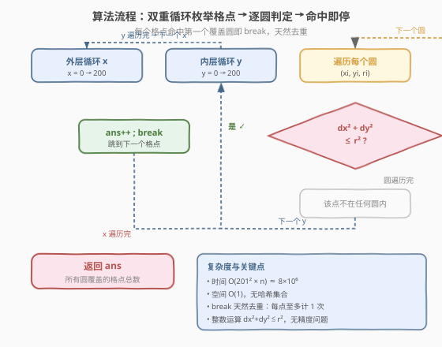

# 统计圆内格点数目

- **题目名称**：统计圆内格点数目
- **链接**：[2249. 统计圆内格点数目](https://leetcode.cn/problems/count-lattice-points-inside-a-circle/)
- **难度**：中等
- **标签**：几何、数组、枚举、哈希表

## 1. 题目概述

给你一个二维整数数组 `circles`，其中 `circles[i] = [xi, yi, ri]` 表示第 $i$ 个圆的圆心 $(x_i, y_i)$ 和半径 $r_i$。

返回**至少存在于一个圆内**的**格点**数目。格点是坐标为整数的点；点在圆内或圆上都算「存在于圆内」（即到圆心距离 $\le r_i$）。

**示例 1**：

```text
输入：circles = [[2,2,1]]
输出：5
解释：圆心 (2,2)，半径 1。
圆内格点为 (1,2)、(2,1)、(2,2)、(2,3)、(3,2)，共 5 个。
```

**示例 2**：

```text
输入：circles = [[2,2,2],[3,4,1]]
输出：16
解释：
- 圆 1 (2,2,2) 覆盖 13 个格点；
- 圆 2 (3,4,1) 覆盖 5 个格点；
- 重叠格点 (2,4)、(3,3) 被两个圆同时覆盖，去重后共 13 + 5 − 2 = 16 个。
```

**约束条件**：

- $1 \le \text{circles.length} \le 200$
- $\text{circles}[i].\text{length} == 3$
- $1 \le x_i, y_i \le 100$
- $1 \le r_i \le \min(x_i, y_i)$

> 💡 本题的关键在于**坐标范围极小**。由约束 $x_i, y_i \in [1, 100]$ 且 $r_i \le \min(x_i, y_i)$，所有圆的格点都落在 $[0, 200] \times [0, 200]$ 的网格内。因此可以**枚举所有候选格点**，逐一判定是否被任一圆覆盖，无需复杂的几何求交。

---

## 2. 解题思路

### 2.1 暴力思路：逐圆枚举边界框 + 去重

最直观的做法：对每个圆，枚举其外接矩形 $[x_i - r_i, x_i + r_i] \times [y_i - r_i, y_i + r_i]$ 内的所有格点，判定是否在圆内（$(x - x_i)^2 + (y - y_i)^2 \le r_i^2$），用集合去重后统计大小。

```text
seen = set()
for (xi, yi, ri) in circles:
    for x in [xi - ri, xi + ri]:
        for y in [yi - ri, yi + ri]:
            if (x - xi)^2 + (y - yi)^2 <= ri^2:
                seen.add((x, y))
return len(seen)
```

时间 $O(n \cdot r^2)$，$n \le 200$、$r \le 100$，约 $8 \times 10^6$ 次运算，可行但需哈希集合开销。

> ⚠️ 暴力法的瓶颈在于**哈希集合的常数较大**（插入/去重），且对每个圆独立枚举会产生大量重复点（圆重叠区域被反复判定）。

### 2.2 核心观察：枚举全局格点 + 早停判定

![核心观察：枚举 [0,200]×[0,200] 全局格点，逐圆判定命中即停](../images/2249_concept.svg)

**关键观察 1：坐标范围有限且封闭**。由约束 $1 \le x_i, y_i \le 100$ 且 $r_i \le \min(x_i, y_i)$，圆不会越过坐标轴：

$$
x_i - r_i \ge x_i - \min(x_i, y_i) \ge 0, \qquad x_i + r_i \le 100 + 100 = 200
$$

同理 $y$ 方向也落在 $[0, 200]$。因此**所有可能的格点都在 $[0, 200] \times [0, 200]$ 内**，总共 $(201)^2 \approx 4 \times 10^4$ 个候选点。

**关键观察 2：点视角优于圆视角**。与其「逐圆枚举边界框再用集合去重」，不如**逐点遍历全局网格**，对每个点检查是否被任一圆覆盖——一旦命中立即 `break`，既天然去重又避免集合开销：

```text
ans = 0
for x in 0..200:
    for y in 0..200:
        for (xi, yi, ri) in circles:
            if (x - xi)^2 + (y - yi)^2 <= ri^2:
                ans += 1
                break          # 命中即停，避免重复计数
```

**关键观察 3：距离判定用整数避免浮点**。点到圆心的距离平方 $(x - x_i)^2 + (y - y_i)^2$ 与 $r_i^2$ 比较即可，全程整数运算，无精度问题。

> 💡 **两种视角的等价性**：逐圆枚举（圆视角）与逐点枚举（点视角）的总运算量同级（都约 $n \cdot r^2$），但点视角**天然去重**（每个点至多累加一次）且**无需额外空间**，实现更简洁。

### 2.3 算法流程图



1. **初始化**：`ans = 0`。
2. **外层循环** $x$ 从 $0$ 到 $200$：
   - **内层循环** $y$ 从 $0$ 到 $200$：
     - **遍历每个圆** $(x_i, y_i, r_i)$：
       - 计算 $\text{dx} = x - x_i$，$\text{dy} = y - y_i$；
       - 若 $\text{dx}^2 + \text{dy}^2 \le r_i^2$：`ans++`，`break`（跳到下一个点）。
3. **返回** `ans`。

> 💡 **早停优化**：内层圆循环一旦命中即 `break`，避免对同一格点重复判定多个圆。最坏情况下（所有圆都不覆盖某点）需遍历全部 $n$ 个圆，但总运算量仍为 $O(201^2 \cdot n) \approx 8 \times 10^6$，完全可接受。

### 2.4 示例演算

![示例演算：circles = [[2,2,2],[3,4,1]]，逐格点判定](../images/2249_example_walkthrough.svg)

以 `circles = [[2,2,2],[3,4,1]]` 为例，展示部分格点的判定过程：

| 格点 $(x, y)$ | 圆 1 判定 $(x{-}2)^2{+}(y{-}2)^2 \le 4$？ | 圆 2 判定 $(x{-}3)^2{+}(y{-}4)^2 \le 1$？ | 命中？ |
|---------------|------------------------------------------|------------------------------------------|--------|
| $(0, 0)$ | $4 + 4 = 8 > 4$ ✗ | $9 + 16 = 25 > 1$ ✗ | ✗ |
| $(0, 2)$ | $4 + 0 = 4 \le 4$ ✓ | — | ✓ 计入 |
| $(1, 1)$ | $1 + 1 = 2 \le 4$ ✓ | — | ✓ 计入 |
| $(2, 4)$ | $0 + 4 = 4 \le 4$ ✓ | — | ✓ 计入（圆 2 也覆盖，但已早停） |
| $(3, 3)$ | $1 + 1 = 2 \le 4$ ✓ | — | ✓ 计入（圆 2 也覆盖，但已早停） |
| $(3, 4)$ | $1 + 4 = 5 > 4$ ✗ | $0 + 0 = 0 \le 1$ ✓ | ✓ 计入 |
| $(3, 5)$ | $1 + 9 = 10 > 4$ ✗ | $0 + 1 = 1 \le 1$ ✓ | ✓ 计入 |
| $(4, 4)$ | $4 + 4 = 8 > 4$ ✗ | $1 + 0 = 1 \le 1$ ✓ | ✓ 计入 |

**去重验证**：圆 1 覆盖 13 个点，圆 2 覆盖 5 个点，重叠点 $(2,4)$ 和 $(3,3)$ 在点视角下各只计一次 → 总数 $13 + 5 - 2 = 16$ ✓。

> 💡 **重叠处理的优雅性**：点视角下，重叠区域内的格点在遍历圆时命中第一个圆即 `break`，天然只计一次，无需显式去重。这是点视角相比圆视角的核心优势。

---

## 3. 参考代码

### C++

```cpp
// 统计圆内格点数目 —— 枚举全局格点 + 逐圆判定早停 O(R^2 * n) / O(1)
// 编译: g++ -O2 -std=c++17 solution.cpp -o clp
#include <vector>
using namespace std;

class Solution {
public:
    int countLatticePoints(vector<vector<int>>& circles) {
        int ans = 0;
        for (int x = 0; x <= 200; x++) {
            for (int y = 0; y <= 200; y++) {
                for (auto& c : circles) {
                    int dx = x - c[0], dy = y - c[1];
                    if (dx * dx + dy * dy <= c[2] * c[2]) {
                        ++ans;
                        break;
                    }
                }
            }
        }
        return ans;
    }
};
```

### Python

```python
class Solution:
    def countLatticePoints(self, circles: List[List[int]]) -> int:
        ans = 0
        for x in range(201):
            for y in range(201):
                for xi, yi, ri in circles:
                    if (x - xi) ** 2 + (y - yi) ** 2 <= ri ** 2:
                        ans += 1
                        break
        return ans
```

> 💡 **实现细节**：① 枚举范围 $[0, 200]$ 由约束推导得出——$x_i + r_i \le 200$ 且 $x_i - r_i \ge 0$，无需动态计算边界。② `break` 保证每个格点至多计入一次，天然去重。③ 全程整数运算，`dx * dx` 不会溢出 `int`（最大 $200^2 = 40000$，三圆参数之积远小于 $2^{31}$）。④ 空间 $O(1)$，无需哈希集合。

---

## 4. 复杂度分析

| 维度 | 复杂度 | 说明 |
|------|--------|------|
| **时间复杂度** | $O(R^2 \cdot n)$ | $R = 201$ 为坐标范围，$n \le 200$ 为圆数。每个格点至多遍历 $n$ 个圆，总计 $\approx 4 \times 10^4 \times 200 = 8 \times 10^6$ 次判定 |
| **空间复杂度** | $O(1)$ | 仅用常数变量 `ans`，无额外数据结构 |

> ⚠️ 若坐标范围不受限（如 $x_i, y_i \le 10^9$），枚举全局格点不可行，需改为逐圆枚举边界框 + 哈希集合去重，时间 $O(n \cdot r_{\max}^2)$、空间 $O(n \cdot r_{\max}^2)$。本题坐标范围小是采用点视角的前提。

---

## 5. 扩展：逐圆枚举 + 哈希集合（坐标不受限时的通用解法）

当圆心坐标和半径较大时，全局枚举不可行，应回到「圆视角」——对每个圆枚举其外接矩形内的格点，用集合去重：

```python
class Solution:
    def countLatticePoints(self, circles: List[List[int]]) -> int:
        seen = set()
        for xi, yi, ri in circles:
            r2 = ri * ri
            for x in range(xi - ri, xi + ri + 1):
                for y in range(yi - ri, yi + ri + 1):
                    if (x - xi) ** 2 + (y - yi) ** 2 <= r2:
                        seen.add((x, y))
        return len(seen)
```

- **时间**：$O(n \cdot r_{\max}^2)$，每个圆枚举 $(2r+1)^2$ 个点。
- **空间**：$O(n \cdot r_{\max}^2)$，哈希集合存储所有覆盖点。

> 💡 **两种视角的选择**：坐标范围小且封闭 → 点视角（本题）；坐标范围大但圆数少、半径小 → 圆视角 + 集合。两者本质都是「枚举候选 + 判定」，区别在于枚举的维度（点 vs 圆）和去重方式（早停 vs 集合）。

### 5.1 进一步优化：逐行扫描圆的 y 范围

对每个圆，固定 $x$ 后可用勾股定理精确求出 $y$ 的合法范围 $[y_i - \lfloor\sqrt{r_i^2 - (x-x_i)^2}\rfloor,\ y_i + \lfloor\sqrt{r_i^2 - (x-x_i)^2}\rfloor]$，避免逐 $y$ 判定：

```python
import math

class Solution:
    def countLatticePoints(self, circles: List[List[int]]) -> int:
        seen = set()
        for xi, yi, ri in circles:
            r2 = ri * ri
            for x in range(xi - ri, xi + ri + 1):
                dy = math.isqrt(r2 - (x - xi) ** 2)
                for y in range(yi - dy, yi + dy + 1):
                    seen.add((x, y))
        return len(seen)
```

`math.isqrt` 返回整数平方根（向下取整），保证枚举的 $y$ 范围精确覆盖圆内格点，无需逐点判定。时间仍为 $O(n \cdot r_{\max}^2)$ 但常数更小（省去平方运算）。

---

## 6. 面试要点

1. **为什么枚举范围是 $[0, 200]$？**

   > 由约束 $1 \le x_i, y_i \le 100$ 且 $r_i \le \min(x_i, y_i)$：下界 $x_i - r_i \ge x_i - \min(x_i, y_i) \ge 0$，上界 $x_i + r_i \le 100 + 100 = 200$。$y$ 同理，故所有格点落在 $[0, 200] \times [0, 200]$ 内。

2. **点视角和圆视角有何区别？**

   > 点视角枚举全局格点，逐圆判定命中即停，**天然去重**、空间 $O(1)$；圆视角逐圆枚举边界框，需哈希集合去重，空间 $O(n \cdot r^2)$。坐标范围小时点视角更优；坐标范围大时点视角不可行，须用圆视角。

3. **为什么用距离平方而非距离？**

   > 比较 $(x - x_i)^2 + (y - y_i)^2 \le r_i^2$ 避免开方运算，既省时又避免浮点精度问题。开方后比较 $\sqrt{\cdot} \le r_i$ 引入浮点误差，且整数开方有截断风险。

4. **`break` 的作用是什么？能否去掉？**

   > `break` 使每个格点命中第一个覆盖它的圆后立即停止，保证**每个点只计一次**，天然去重。去掉 `break` 则同一格点被多个圆覆盖时会重复计数，答案偏大。

5. **坐标不受限时怎么办？**

   > 改用圆视角：逐圆枚举外接矩形 $[x_i - r_i, x_i + r_i] \times [y_i - r_i, y_i + r_i]$ 内的格点，判定在圆内后加入哈希集合去重。时间 $O(n \cdot r_{\max}^2)$，空间 $O(n \cdot r_{\max}^2)$。

> 💡 **一句话总结**：2249 是「**小范围几何枚举**」的招牌题——利用坐标封闭范围 $[0,200]$ 枚举全部格点，逐圆判定命中即停，整数平方距离比较 + `break` 早停实现 $O(1)$ 空间去重。核心是**识别坐标范围有限**并**从点视角枚举**以天然去重。

---

## 7. 同类练习题

- [883. 三维形体投影面积](https://leetcode.cn/problems/projection-area-of-3d-shapes/)：网格几何 + 枚举，从不同视角统计投影面积，同为「小范围网格枚举」的几何题
- [733. 图像渲染](https://leetcode.cn/problems/flood-fill/)：网格坐标枚举 + BFS/DFS 泛洪，同为小范围网格上的逐点判定
- [149. 直线上最多的点数](https://leetcode.cn/problems/max-points-on-a-line/)：几何 + 哈希表，用 GCD 化简斜率分组，同为「几何 + 枚举 + 去重」但难度更高
- [1401. 圆和矩形是否有重叠](https://leetcode.cn/problems/circle-and-rectangle-overlapping/)：圆与矩形几何判定，将圆与轴对齐矩形的包含关系转化为距离比较，与本题的距离判定同源
- [1037. 有效的回旋镖](https://leetcode.cn/problems/valid-boomerang/)：几何 + 叉积判定共线，同为小规模几何枚举题，用整数运算避免精度问题
