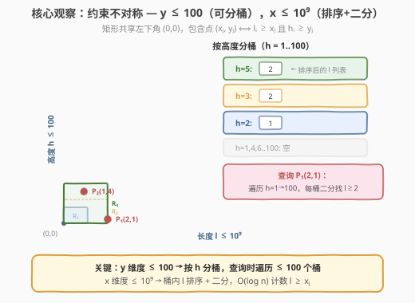
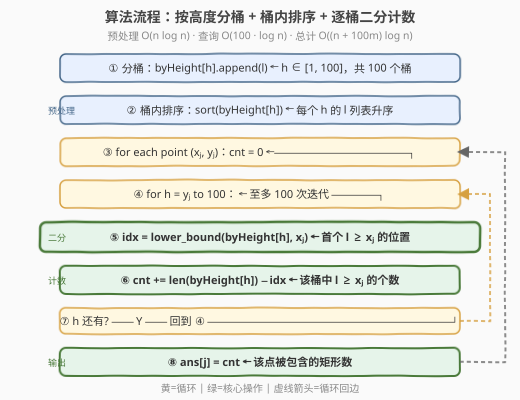
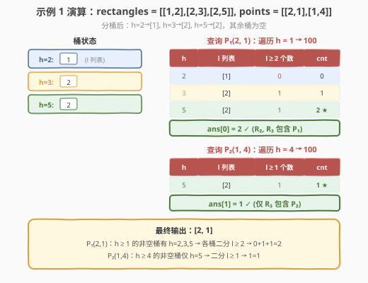

# 统计包含每个点的矩形数目

- **题目名称**：统计包含每个点的矩形数目
- **链接**：[2250. 统计包含每个点的矩形数目](https://leetcode.cn/problems/count-number-of-rectangles-containing-each-point/)
- **难度**：中等
- **标签**：数组、排序、二分查找、桶

## 1. 题目概述

给定 $n$ 个矩形，第 $i$ 个矩形的**左下角**在原点 $(0, 0)$，**右上角**在 $(l_i, h_i)$（含边界）。再给定 $m$ 个点，点 $j$ 的坐标为 $(x_j, y_j)$。

对每个点，统计**包含它的矩形数目**——矩形 $i$ 包含点 $j$ 当且仅当 $0 \le x_j \le l_i$ 且 $0 \le y_j \le h_i$。

**示例 1**：

```text
输入：rectangles = [[1,2],[2,3],[2,5]], points = [[2,1],[1,4]]
输出：[2,1]

      h
      ↑
  5   ┌──┐  R₃: (2,5)
      │  │
  4   ·────P₂(1,4) ← 仅 R₃ 包含
      │  │
  3   ┌──┐  R₂: (2,3)
      │  │
  2   ┌─┐  R₁: (1,2)
      │ │
  1   ·────P₁(2,1) ← R₂, R₃ 包含
      └──┴──┴──→ l
      0  1  2
```

包含点 $P_1(2,1)$ 的矩形：$R_2(l=2 \ge 2, h=3 \ge 1)$✓、$R_3(l=2 \ge 2, h=5 \ge 1)$✓，共 2 个；$R_1(l=1 < 2)$✗。包含点 $P_2(1,4)$ 的矩形：仅 $R_3(h=5 \ge 4, l=2 \ge 1)$✓，共 1 个。

**示例 2**：

```text
输入：rectangles = [[1,1],[2,2],[3,3]], points = [[1,3],[1,1]]
输出：[1,3]
```

$P(1,3)$ 仅被 $R_3(l=3,h=3)$ 包含（1 个）；$P(1,1)$ 被全部三个矩形包含（3 个）。

**约束条件**：

- $1 \le \text{rectangles.length}, \text{points.length} \le 5 \times 10^4$
- $1 \le l_i, x_j \le 10^9$
- $1 \le h_i, y_j \le 100$  ← **关键约束**
- 所有矩形互不相同，所有点互不相同

> 💡 本题的精髓在于**注意数据范围的不对称**：长度 $l$ 和横坐标 $x$ 可达 $10^9$，但高度 $h$ 和纵坐标 $y$ 仅 $\le 100$。这一约束决定了「**按高度分桶 + 桶内二分**」的最优策略——$y$ 维度小到可以直接枚举遍历，$x$ 维度大到必须排序二分。

---

## 2. 解题思路

### 2.1 暴力思路：逐对判定

对每个点 $(x_j, y_j)$，遍历全部 $n$ 个矩形，逐一检查 $l_i \ge x_j$ 且 $h_i \ge y_j$。时间 $O(n \cdot m)$，当 $n = m = 5 \times 10^4$ 时约 $2.5 \times 10^9$，必超时。

> ⚠️ 暴力的浪费在于：**没有利用 $h \le 100$ 的小范围特性**。高度只有 100 种取值，按高度分组后，查询时只需检查 $h \ge y_j$ 的桶（至多 100 个），而非全部 $n$ 个矩形。

### 2.2 核心观察：约束不对称 → 按高度分桶 + 桶内二分



**关键洞察**：包含条件 $l_i \ge x_j \wedge h_i \ge y_j$ 是两个**独立维度**的约束，可分别处理：

| 维度 | 范围 | 处理策略 |
|------|------|----------|
| **高度 $h$ / 纵坐标 $y$** | $\le 100$ | 按 $h$ **分桶**（101 个桶），查询时从 $y_j$ 到 100 **逐桶枚举**（至多 100 次） |
| **长度 $l$ / 横坐标 $x$** | $\le 10^9$ | 桶内 $l$ **排序**，查询时**二分**找首个 $l \ge x_j$，$O(\log)$ 计数 |

**预处理**：

1. 建立 `byHeight[h]`（$h = 1 \ldots 100$），将每个矩形 $(l_i, h_i)$ 的 $l_i$ 放入 `byHeight[h_i]`。
2. 对每个非空桶内的 $l$ 列表**升序排序**。

**查询**：对点 $(x_j, y_j)$：

$$\text{count}(x_j, y_j) = \sum_{h = y_j}^{100} \Big(\text{len}(\text{byHeight}[h]) - \text{lower\_bound}(\text{byHeight}[h],\, x_j)\Big)$$

其中 `lower_bound` 返回桶内首个 $l \ge x_j$ 的下标，`len − idx` 即该桶中 $l \ge x_j$ 的个数。

> ⚠️ **为什么不用二维前缀和或树状数组？** $x$ 维度达 $10^9$，坐标压缩虽可行但增加复杂度。而 $y \le 100$ 的天然小范围使得「分桶 + 逐桶二分」仅需 $O(100 \cdot \log n)$ 每次查询，远比坐标压缩 + 树状数组的 $O(\log n)$ 更简洁——**省去了一整个维度的数据结构**，代价仅是 100 次循环常数。

### 2.3 算法流程图



**完整步骤**：

1. **分桶**：`byHeight[h]` 为 `vector<int>`，遍历矩形将 $l_i$ 放入 `byHeight[h_i]`；
2. **排序**：对每个 $h \in [1, 100]$，`sort(byHeight[h])`；
3. **查询**：对每个点 $(x_j, y_j)$，令 `cnt = 0`，遍历 $h$ 从 $y_j$ 到 $100$：
   - `idx = lower_bound(byHeight[h].begin(), byHeight[h].end(), x_j) − byHeight[h].begin()`
   - `cnt += byHeight[h].size() − idx`
4. **输出**：`ans[j] = cnt`。

> 💡 **空桶跳过**：`byHeight[h]` 为空时 `lower_bound` 返回 0，`size() − 0 = 0`，自然跳过，无需额外判空。

### 2.4 示例演算

以示例 1 `rectangles = [[1,2],[2,3],[2,5]], points = [[2,1],[1,4]]` 为例：



**预处理 — 分桶**：

| 桶 $h$ | $l$ 列表（排序后） |
|--------|---------------------|
| 2 | $[1]$ |
| 3 | $[2]$ |
| 5 | $[2]$ |
| 1, 4, 6–100 | 空 |

**查询 $P_1(2, 1)$** — 遍历 $h = 1 \to 100$：

| $h$ | $l$ 列表 | `lower_bound(l, 2)` | $l \ge 2$ 个数 | cnt 累计 |
|-----|----------|----------------------|----------------|----------|
| 2 | $[1]$ | idx=1（1 < 2） | $1 - 1 = 0$ | 0 |
| 3 | $[2]$ | idx=0（2 ≥ 2） | $1 - 0 = 1$ | 1 |
| 5 | $[2]$ | idx=0（2 ≥ 2） | $1 - 0 = 1$ | **2** ★ |
| 其余 | 空 | — | 0 | 2 |

`ans[0] = 2` ✓

**查询 $P_2(1, 4)$** — 遍历 $h = 4 \to 100$：

| $h$ | $l$ 列表 | `lower_bound(l, 1)` | $l \ge 1$ 个数 | cnt 累计 |
|-----|----------|----------------------|----------------|----------|
| 5 | $[2]$ | idx=0（2 ≥ 1） | $1 - 0 = 1$ | **1** ★ |
| 其余 | 空 | — | 0 | 1 |

`ans[1] = 1` ✓

最终输出 `[2, 1]`。

> 💡 **注意 $P_1$ 的 $h=2$ 桶**：矩形 $R_1(l=1, h=2)$ 的高度满足 $h=2 \ge y_j=1$，但长度 $l=1 < x_j=2$ 不满足。二分 `lower_bound([1], 2)` 返回 idx=1（越界），`size() − idx = 0`，正确排除了这个矩形。

---

## 3. 参考代码

### C++：按高度分桶 + 逐桶二分（$O((n + 100m) \log n)$ / $O(n)$）

```cpp
class Solution {
public:
    vector<int> countRectangles(vector<vector<int>>& rectangles, vector<vector<int>>& points) {
        vector<vector<int>> byHeight(101);
        for (auto& r : rectangles) {
            byHeight[r[1]].push_back(r[0]);
        }
        for (int h = 1; h <= 100; h++) {
            sort(byHeight[h].begin(), byHeight[h].end());
        }

        vector<int> ans;
        ans.reserve(points.size());
        for (auto& p : points) {
            int xj = p[0], yj = p[1];
            int cnt = 0;
            for (int h = yj; h <= 100; h++) {
                auto& vec = byHeight[h];
                int idx = lower_bound(vec.begin(), vec.end(), xj) - vec.begin();
                cnt += (int)vec.size() - idx;
            }
            ans.push_back(cnt);
        }
        return ans;
    }
};
```

### Python：按高度分桶 + 逐桶二分（$O((n + 100m) \log n)$ / $O(n)$）

```python
from bisect import bisect_left

class Solution:
    def countRectangles(self, rectangles: List[List[int]], points: List[List[int]]) -> List[int]:
        by_height = [[] for _ in range(101)]
        for l, h in rectangles:
            by_height[h].append(l)
        for h in range(1, 101):
            by_height[h].sort()

        ans = []
        for xj, yj in points:
            cnt = 0
            for h in range(yj, 101):
                vec = by_height[h]
                idx = bisect_left(vec, xj)
                cnt += len(vec) - idx
            ans.append(cnt)
        return ans
```

> 💡 两版逻辑完全等价。核心就两步：**预处理**（分桶 + 排序）和**查询**（逐桶 `lower_bound` 计数）。代码极简——没有树状数组、没有坐标压缩、没有排序归并，全靠「$y \le 100$」这一约束把一个维度降为常数级枚举。

---

## 4. 复杂度分析

| 维度 | 复杂度 | 说明 |
|------|--------|------|
| **时间 — 预处理** | $O(n \log n)$ | 分桶 $O(n)$ + 每桶排序，总排序代价不超过 $O(n \log n)$（各桶大小之和为 $n$） |
| **时间 — 查询** | $O(100 \cdot m \cdot \log n)$ | 每个点遍历至多 100 个桶，每桶一次 `lower_bound` $O(\log n)$ |
| **时间 — 总计** | $O((n + 100m) \log n)$ | $n = m = 5 \times 10^4$ 时约 $5.5 \times 10^4 \times 17 \approx 9.4 \times 10^5 \times 100 \approx 10^7$，轻松通过 |
| **空间复杂度** | $O(n)$ | `byHeight` 存储 $n$ 个 $l$ 值，桶结构本身 $O(100) = O(1)$ |

> ⚠️ **常数的来源**：查询部分的 $100$ 来自 $y_j \le 100$，是最多遍历的桶数。实际中大部分桶为空（矩形数 $\le 5 \times 10^4 \ll$ 100 个桶的容量），空桶的 `lower_bound` 在空向量上 $O(1)$ 返回，真实常数远小于 100。

---

## 5. 扩展：若 $h$ 无上界约束怎么办？

本题能分桶的前提是 $h_i, y_j \le 100$。若题目改为 $h_i, y_j \le 10^9$（与 $l, x$ 同范围），分桶法失效——桶数不可控。此时需用**离线扫描 + 树状数组**：

**思路**：将「逐桶二分」的 $y$ 维度枚举替换为「按 $y$ 降序扫描 + 增量维护」。

1. 矩形按 $h$ 降序排序，点按 $y_j$ 降序排序（保留原下标）；
2. 维护一个以 $l$ 为下标的**树状数组**（坐标压缩 $l$ 值）；
3. 扫描点：将所有 $h \ge y_j$ 的矩形 $l$ 值加入树状数组（每个矩形只加一次），然后查询树状数组中 $l \ge x_j$ 的个数 = 已加入总数 $-$ 前缀和$(x_j - 1)$。

```cpp
// 摘要：扫描线 + BIT（当 h 无上界时的通用解法）
// 1. 坐标压缩所有 l_i
// 2. rectangles 按 h 降序排序
// 3. points 按 y_j 降序排序
// 4. 扫描：while (ri < n && rect[ri].h >= yj) bit.update(rank(l), +1), ri++
// 5. ans = ri - bit.query(rank(xj) - 1)
```

**时间** $O((n + m) \log n)$，**空间** $O(n)$。通用性更强但实现更复杂。

> 💡 **两种解法的本质对比**：分桶法利用 $y \le 100$ 把「找所有 $h \ge y_j$ 的矩形」变成「枚举 100 个桶」——$y$ 维度是**常数级**的；扫描线法用排序 + 增量把同一问题变成「按 $y$ 降序逐步加入」——$y$ 维度是 $O(\log n)$ 的（树状数组查询）。当 $y$ 范围小时，分桶法的 $O(100)$ 常数优于扫描线的复杂实现；当 $y$ 范围大时，只有扫描线可行。

---

## 6. 面试要点

1. **为什么按高度分桶而不是按长度分桶？**

   > 因为约束不对称：$h_i, y_j \le 100$ 而 $l_i, x_j \le 10^9$。按高度分桶后，查询时枚举 $h \ge y_j$ 的桶仅需至多 100 次迭代（常数级）；若反过来按长度分桶，桶数可达 $10^9$，无法枚举。**永远优先对小范围维度做分桶/枚举。**

2. **桶内为什么要排序？**

   > 排序后可用 `lower_bound`（二分）在 $O(\log)$ 时间内找到首个 $l \ge x_j$ 的位置，从而 $O(1)$ 算出该桶中满足 $l \ge x_j$ 的个数 = `size() − idx`。不排序则需 $O(\text{桶大小})$ 线性扫描，总时间退化为 $O(n \cdot m)$。

3. **空桶怎么处理？需要特判吗？**

   > 不需要。空 `vector` 的 `lower_bound` 返回 `begin()`，`size() − 0 = 0`，自然贡献 0。代码无需额外判空，逻辑统一。

4. **总时间复杂度是多少？常数大吗？**

   > $O((n + 100m) \log n)$。预处理 $O(n \log n)$，每次查询 $O(100 \log n)$。$n = m = 5 \times 10^4$ 时约 $10^7$ 量级。常数主要来自 100 次循环，但大部分桶为空（空桶 `lower_bound` 为 $O(1)$），实际常数远小于 100。

5. **如果面试官追问「$h$ 也到 $10^9$ 怎么办」？**

   > 改用离线扫描 + 树状数组：矩形和点都按 $y$ 降序排序，用 BIT 维护已加入的 $l$ 值（坐标压缩），扫描时增量加入 $h \ge y_j$ 的矩形，每次查询 $l \ge x_j$ 的个数。时间 $O((n+m) \log n)$，空间 $O(n)$，不依赖 $y$ 的范围。

> 💡 **一句话总结**：2250 的灵魂是「**注意到 $y \le 100$ 的小范围约束，按高度分桶把一个维度降为常数枚举，另一维度用排序 + 二分**」——是「读数据范围决定算法」的经典招牌题，与 [2080. 区间内查询数字的频率](https://leetcode.cn/problems/range-frequency-queries/)（按值分桶 + 二分）同属一类。

---

## 7. 同类练习题

- [2080. 区间内查询数字的频率](https://leetcode.cn/problems/range-frequency-queries/)：按值分桶 + 桶内保留下标排序 + 二分计数，与本题同属「按小范围维度分桶 + 桶内二分」范式
- [378. 有序矩阵中第 K 小的元素](https://leetcode.cn/problems/kth-smallest-element-in-a-sorted-matrix/)：利用行列有序性 + 二分值域计数，体现「维度不对称时降维处理」的思想
- [719. 找出第 K 小的数对距离](https://leetcode.cn/problems/find-k-th-smallest-pair-distance/)：排序后二分答案 + 双指针计数，是「排序 + 二分统计满足条件的个数」的变体
- [2280. 三角形中最小路径之和](https://leetcode.cn/problems/minimum-lines-to-represent-a-line-chart/)：同样考察对数据范围与约束的观察（斜率排序去重）
- [2251. 花期内花的数目](https://leetcode.cn/problems/number-of-flowers-in-full-bloom/)：差分 + 排序 + 二分，与本题同为「统计满足区间条件的元素个数」类问题，可对比「分桶」与「差分离线」两种思路
