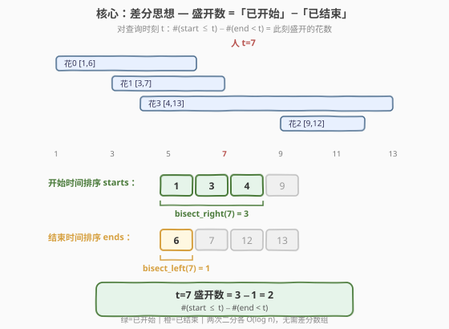
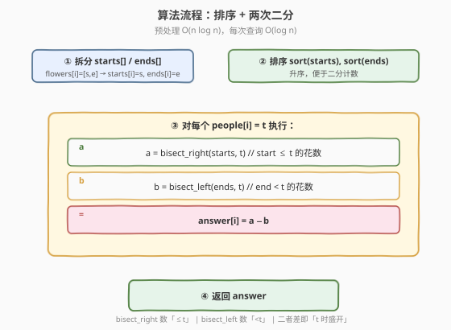
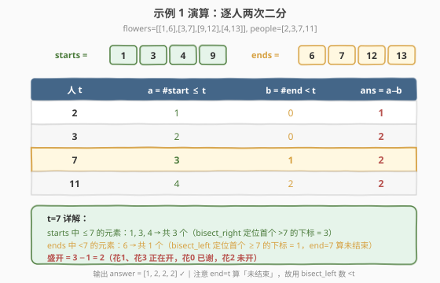

# LeetCode 花期内花的数目 题解

## 1. 题目概述

- **标题 / 题号**：花期内花的数目（#2251，hard）
- **链接**：https://leetcode.cn/problems/number-of-flowers-in-full-bloom/
- **难度**：困难
- **标签**：数组、哈希表、二分查找、前缀和、排序

**题意**：给你一个下标从 0 开始的二维整数数组 `flowers`，其中 `flowers[i] = [start_i, end_i]` 表示第 $i$ 朵花的**花期**从 `start_i` 到 `end_i`（**都包含**）。同时给你一个大小为 $n$ 的整数数组 `people`，`people[i]` 是第 $i$ 个人来看花的时间。

返回一个大小为 $n$ 的整数数组 `answer`，其中 `answer[i]` 是第 $i$ 个人到达时**在花期内花的数目**。

**示例 1**：

```text
输入：flowers = [[1,6],[3,7],[9,12],[4,13]], people = [2,3,7,11]
输出：[1,2,2,2]

时间轴：
花0 [1------6]
花1     [3------7]
花3       [4----------13]
花2              [9----12]
人：   2  3  5? 7        11
```

- $t=2$：仅花 0 在开 → 1
- $t=3$：花 0、花 1 → 2
- $t=7$：花 1、花 3（花 0 已谢于 6，花 2 未开）→ 2
- $t=11$：花 2、花 3（花 0、1 均已谢）→ 2

**示例 2**：

```text
输入：flowers = [[1,10],[3,3]], people = [3,3,2]
输出：[2,2,1]
```

- $t=3$：花 0 `[1,10]` 与花 1 `[3,3]` 都在开 → 2
- $t=2$：仅花 0（花 1 未开）→ 1

**约束**：

- $1 \le \text{flowers.length} \le 5 \times 10^4$
- $\text{flowers}[i].\text{length} = 2$
- $1 \le \text{start}_i \le \text{end}_i \le 10^9$
- $1 \le \text{people.length} \le 5 \times 10^4$
- $1 \le \text{people}[i] \le 10^9$

> 💡 本题是「**差分 + 二分计数**」家族的招牌题。核心是把「区间查询点值」转化为「两个前缀计数之差」——盛开花数 = 已开始数 − 已结束数。这与 [1854. 人口最多的年份](https://leetcode.cn/problems/maximum-population-year/) 的差分思想同源，但本题查询点离散且值域高达 $10^9$，无法开差分数组，改用**排序 + 二分**实现 $O(\log n)$ 单点查询。

## 2. 解题思路

### 2.1 暴力思路：逐人逐花判定

对每个 `people[i] = t`，遍历所有花，统计满足 $\text{start}_j \le t \le \text{end}_j$ 的花数。时间 $O(n \times m)$（$n$ 为人数，$m$ 为花数），$n, m \le 5 \times 10^4$ 时达 $2.5 \times 10^9$，必然超时。

> ⚠️ 暴力法的浪费在于：**每朵花的开/闭信息被反复扫描**，且没有利用「时间有序性」。若把所有开始时刻、结束时刻分别排序，单点查询即可用二分在 $O(\log m)$ 内完成。

### 2.2 核心观察：差分思想 —「已开始」−「已结束」



**关键洞察**：在时刻 $t$，一朵花 $[\text{start}, \text{end}]$ 正在盛开 $\iff \text{start} \le t \le \text{end}$。把这个条件拆成两半：

$$\text{盛开}(t) = \underbrace{\#\{\text{start} \le t\}}_{\text{已开始}} - \underbrace{\#\{\text{end} < t\}}_{\text{已结束}}$$

- **已开始**：$\text{start} \le t$ 的花数。花若开始得早或此刻开始，都算「已开始」。
- **已结束**：$\text{end} < t$ 的花数。注意是**严格小于**——$\text{end} = t$ 时花仍在最后一天盛开，不算结束。

> ⚠️ **边界关键**：花期**包含**两端，故 $\text{end} = t$ 时花**仍盛开**。「已结束」必须用 $\text{end} < t$（严格小于），而非 $\text{end} \le t$。这正是下面两次二分分别用 `bisect_right` 与 `bisect_left` 的原因。

**实现**：把所有 `start` 收进数组排序得 `starts`，所有 `end` 排序得 `ends`。对查询 $t$：

- $a = \text{bisect\_right}(\text{starts}, t)$：首个 `> t` 的下标，恰等于 $\#\{\text{start} \le t\}$；
- $b = \text{bisect\_left}(\text{ends}, t)$：首个 $\ge t$ 的下标，恰等于 $\#\{\text{end} < t\}$；
- $\text{answer} = a - b$。

> 💡 **为什么一个用 right、一个用 left？** 开始时间 `start == t` 算「已开始」（含等于），数 $\le t$ 用 `bisect_right`（跳过所有等于 $t$ 的，停在其后）；结束时间 `end == t` 算「未结束」（不含等于），数 $< t$ 用 `bisect_left`（停在首个等于 $t$ 处）。两个端点的包含性相反，故二分方向也相反——这是本题最易错的细节。

### 2.3 算法流程图



**完整步骤**：

1. **拆分**：遍历 `flowers`，收集 `starts[i] = flowers[i][0]`、`ends[i] = flowers[i][1]`；
2. **排序**：对 `starts`、`ends` 分别升序排序；
3. **查询**：对每个 `people[i] = t`：
   - $a = \text{bisect\_right}(\text{starts}, t)$；
   - $b = \text{bisect\_left}(\text{ends}, t)$；
   - $\text{answer}[i] = a - b$；
4. **返回** `answer`。

> 💡 **无需去重**：`starts`/`ends` 中允许重复值（多花同日开/谢），`bisect` 在重复值上仍正确定位计数边界，故排序后直接二分即可。

### 2.4 示例演算

以示例 1 `flowers = [[1,6],[3,7],[9,12],[4,13]], people = [2,3,7,11]` 为例：

- 排序后 `starts = [1, 3, 4, 9]`，`ends = [6, 7, 12, 13]`。



| 人 $t$ | $a=\text{bisect\_right}(\text{starts},t)$ | $b=\text{bisect\_left}(\text{ends},t)$ | $\text{ans}=a-b$ | 说明 |
|--------|------------------------------------------|----------------------------------------|------------------|------|
| 2 | 1（$\le2$：1） | 0（$<2$：无） | **1** | 仅花 0 开始 |
| 3 | 2（$\le3$：1,3） | 0（$<3$：无） | **2** | 花 0、1 开始 |
| 7 | 3（$\le7$：1,3,4） | 1（$<7$：6） | **2** | 3 开始 − 1 结束 |
| 11 | 4（$\le11$：1,3,4,9） | 2（$<11$：6,7） | **2** | 4 开始 − 2 结束 |

**$t=7$ 关键解析**：

- `starts` 中 $\le 7$ 的元素为 `1, 3, 4`（`9 > 7` 不算），`bisect_right` 返回 3；
- `ends` 中 $< 7$ 的元素仅 `6`（`7 == 7` 算未结束，不算），`bisect_left` 返回 1；
- $\text{ans} = 3 - 1 = 2$：花 1 `[3,7]` 与花 3 `[4,13]` 正在开，花 0 `[1,6]` 已谢于 6，花 2 `[9,12]` 未开。

最终 `answer = [1, 2, 2, 2]` ✓。

## 3. 参考代码

### C++：排序 + 两次二分（$O((n+m)\log m)$ / $O(m)$）

```cpp
class Solution {
public:
    vector<int> fullBloomFlowers(vector<vector<int>>& flowers, vector<int>& people) {
        int m = flowers.size();
        vector<int> starts(m), ends(m);
        for (int i = 0; i < m; i++) {
            starts[i] = flowers[i][0];
            ends[i] = flowers[i][1];
        }
        sort(starts.begin(), starts.end());
        sort(ends.begin(), ends.end());

        vector<int> answer;
        answer.reserve(people.size());
        for (int t : people) {
            int a = upper_bound(starts.begin(), starts.end(), t) - starts.begin();
            int b = lower_bound(ends.begin(), ends.end(), t) - ends.begin();
            answer.push_back(a - b);
        }
        return answer;
    }
};
```

### Python：排序 + `bisect`（$O((n+m)\log m)$ / $O(m)$）

```python
from bisect import bisect_right, bisect_left

class Solution:
    def fullBloomFlowers(self, flowers: List[List[int]], people: List[int]) -> List[int]:
        starts = sorted(f[0] for f in flowers)
        ends   = sorted(f[1] for f in flowers)
        return [bisect_right(starts, t) - bisect_left(ends, t) for t in people]
```

> 💡 `upper_bound` = `bisect_right`（首个 `> t` 的下标），`lower_bound` = `bisect_left`（首个 $\ge t$ 的下标）。两者之差即「$\le t$ 的数」与「$< t$ 的数」之差。C++ 与 Python 逐行对应，仅 API 名称不同。

## 4. 复杂度分析

| 维度 | 复杂度 | 说明 |
|------|--------|------|
| **时间复杂度** | $O((n + m) \log m)$ | 排序 $O(m \log m)$ + $n$ 次查询每次两次二分 $O(n \log m)$ |
| **空间复杂度** | $O(m)$ | `starts`、`ends` 各 $O(m)$（不计输出数组） |
| **最坏情况** | $n = m = 5 \times 10^4$ | 约 $10^5 \times \log_2(5 \times 10^4) \approx 1.6 \times 10^6$ 次比较，毫秒级 |

> ⚠️ **为何不用差分数组？** 值域达 $10^9$，开长度 $10^9$ 的数组不可行。差分 + **坐标压缩**（见第 5 节）可行，但实现更繁；排序 + 二分天然处理稀疏大值域，是最简洁的解法。

## 5. 扩展：差分 + 坐标压缩 / 离线排序查询

### 5.1 差分 + 坐标压缩 + 前缀和

把所有「事件点」（花的开始、花的结束+1、人的到达）收集去重排序，在压缩后的坐标上做差分与前缀和，再二分定位每个 `people[i]`。

```python
from bisect import bisect_right
from collections import Counter

class Solution:
    def fullBloomFlowers(self, flowers: List[List[int]], people: List[int]) -> List[int]:
        diff = Counter()
        for s, e in flowers:
            diff[s] += 1
            diff[e + 1] -= 1               # end+1 处花谢（端点包含）
        xs = sorted(diff)
        # 压缩坐标上的前缀和
        bloom = []
        cur = 0
        for x in xs:
            cur += diff[x]
            bloom.append(cur)
        # 每个查询 t：找 ≤ t 的最大事件点的累计值
        ans = []
        for t in people:
            i = bisect_right(xs, t) - 1
            ans.append(bloom[i] if i >= 0 else 0)
        return ans
```

> 💡 与主解对比：同样是 $O((n + m) \log m)$，但差分法把「开始 +1 / 结束 −1」在 `end + 1` 处减（因为 `end` 仍盛开），逻辑等价于「已开始 − 已结束」。差分法适合**查询点也密集**时一次前缀和回答所有点；主解（两次二分）无需建表、代码更短，是面试首选。

### 5.2 离线排序查询

把 `people` 连同原下标排序，用双指针/小顶堆按时间顺序推进花的开闭事件，可做到 $O((n + m) \log m)$ 且**无需二分**。当查询数与花数同阶时与主解相当，但需处理下标还原，实现更复杂，仅在需要避免二分常数时考虑。

## 6. 面试要点

1. **为什么「已结束」用严格小于 `end < t`？**

   > 花期**包含** `end`，即 `end` 当天花仍盛开。若用 `end ≤ t`，会把 `end == t` 的花误判为已谢，少算一朵。故「已结束」必须是 `end < t`，对应 `bisect_left(ends, t)`（停在首个 $\ge t$ 处，排除等于 $t$ 的）。

2. **`bisect_right` 与 `bisect_left` 为什么方向相反？**

   > 开始端 `start == t` 算「已开始」（含等于），数 $\le t$ 用 `bisect_right`（跳过所有等于 $t$ 的，停在首个 `> t`）；结束端 `end == t` 算「未结束」（不含等于），数 $< t$ 用 `bisect_left`（停在首个 $\ge t$，即首个等于 $t$ 处）。两端点的包含性相反，故二分方向相反——这是本题唯一且最关键的易错点。

3. **能否用差分数组？值域 $10^9$ 怎么办？**

   > 朴素差分数组需 $O(\text{值域})$ 空间，$10^9$ 不可行。用**坐标压缩**：只保留事件点（开始、结束+1、查询点）去重排序，在压缩坐标上做差分与前缀和，空间 $O(m + n)$（见 5.1）。或直接用主解的排序 + 二分，天然规避大值域。

4. **与 1854（人口最多的年份）的联系与区别？**

   > 同为「区间点值 → 差分计数」：1854 把每个人 `[birth, death-1]` 在差分数组上 `+1/-1` 再前缀和取最值，值域固定（百年）故直接开数组。本题值域 $10^9$ 且查询点离散，故改用排序 + 二分。思想同源（已开始 − 已结束），实现因值域而异。

5. **`starts`/`ends` 有重复值会影响二分吗？**

   > 不会。`bisect` 系列函数专门处理重复值：`bisect_right` 返回等于 $t$ 的最右边界之后（数 $\le t$），`bisect_left` 返回等于 $t$ 的最左边界（数 $< t$）。多花同日开/谢只是让边界处有多个相等元素，计数仍准确。

> 💡 **一句话总结**：2251 的灵魂是「**盛开花数 = 已开始数 − 已结束数**」——把区间单点查询拆成两个前缀计数之差，用排序 + 两次方向相反的二分在 $O(\log m)$ 内回答，是「差分思想 + 二分计数」处理大值域稀疏查询的招牌题。

## 同类练习题

| # | 题目 | 与本题的关联 |
|---|------|-------------|
| 1854 | [人口最多的年份](https://leetcode.cn/problems/maximum-population-year/) | 差分计数鼻祖——区间 `[birth, death-1]` 上 `+1/-1` 后前缀和取最值，值域小直接开数组，与本题思想同源 |
| 1094 | [拼车](https://leetcode.cn/problems/car-pooling/) | 差分 + 前缀和判定容量——行程区间 `[from, to-1]` 上 `+/-` 乘客数，沿途不超过容量 |
| 1109 | [航班预订统计](https://leetcode.cn/problems/corporate-flight-bookings/) | 差分 + 前缀和还原——批量区间加后还原各位置值，差分计数家族经典 |
| 2080 | [区间内查询数字的频率](https://leetcode.cn/problems/range-frequency-queries-of-digits-in-interval/) | 值排序 + 两次二分计数——在子数组区间内数某值出现次数，同为「排序后二分定位计数边界」 |
| 719 | [找出第 K 小的数对距离](https://leetcode.cn/problems/find-k-th-smallest-pair-distance/) | 二分答案 + 双指针计数——数对距离 $\le mid$ 的个数，二分计数思想的进阶应用 |
