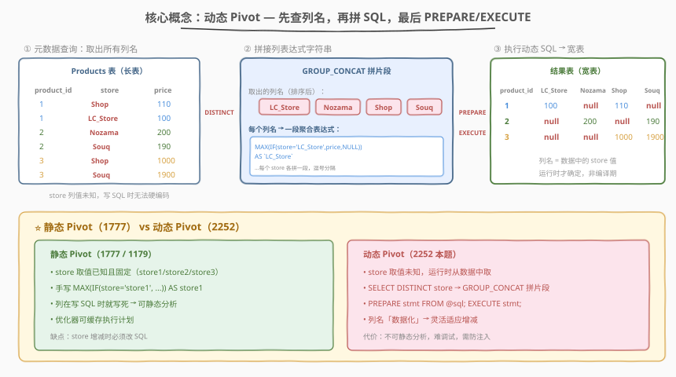
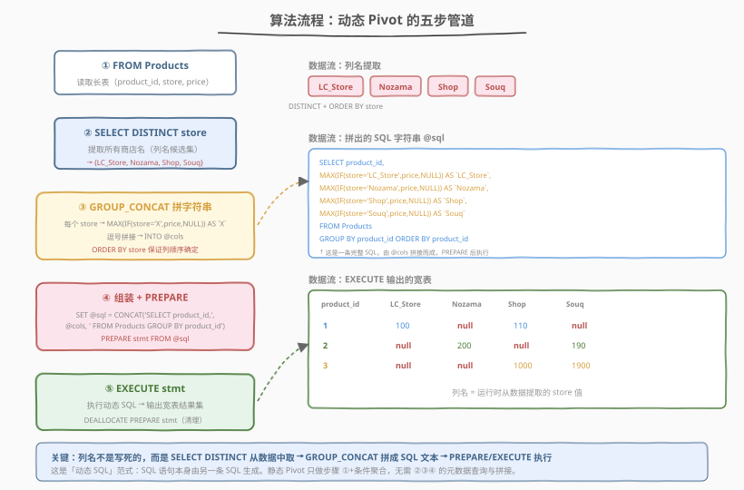
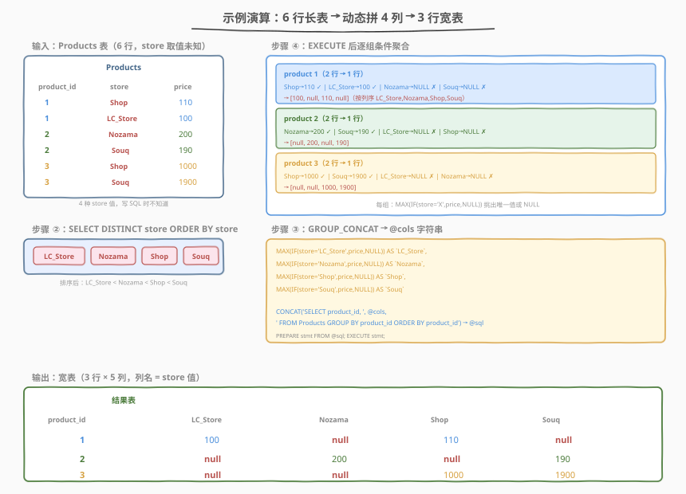

# LeetCode 表的动态旋转 题解

## 1. 题目概述

- **标题 / 题号**：表的动态旋转（#2252，hard）
- **链接**：https://leetcode.cn/problems/dynamic-pivoting-of-a-table/
- **难度**：困难
- **标签**：数据库、SQL、动态 SQL、`PREPARE`/`EXECUTE`、行转列、Pivot、`GROUP_CONCAT`、条件聚合、`MAX`+`IF`、LeetCode 锁题

**题意**：给定 `Products` 表，每行记录某产品在某商店的价格。表中 `store` 列的取值**事先未知**（不固定、可增减），要求编写 SQL 查询，把长表**动态透视**为宽表——每个产品占一行，每个不同的 `store` 值对应一个价格列；若某产品在某商店无对应行，该列填 `NULL`。列的顺序按 `store` 字典序排列，行按 `product_id` 升序排列。

> ⚠️ **LeetCode Plus 会员锁题**：本题为 Plus 会员专享题，题目描述与代码模板需会员权限查看。下述题意基于 LeetCode 元数据（`manual: true`、`mysqlSchemas` 中的 `Products(product_id int, store varchar(7), price int)` 建表语句与官方测试用例）重建。表结构与 [1777. 每家商店的产品价格](https://leetcode.cn/problems/products-price-for-each-store/)（[题解](../1701-1800/1777_每家商店的产品价格.md)）**完全相同**——同为 `Products(product_id, store, price)` 长表。唯一区别：1777 的 `store` 是**固定枚举**（`store1`/`store2`/`store3`），可手写列名；2252 的 `store` **取值未知**，必须用动态 SQL 在运行时从数据中提取列名。

**表结构**：

```text
Table: Products
+-------------+---------+
| Column Name | Type    |
+-------------+---------+
| product_id  | int     |
| store       | varchar |
| price       | int     |
+-------------+---------+
(product_id, store) 是该表的主键。
每行表示该 product_id 在该 store 的价格。
store 的取值事先未知（不固定）。
```

> ⚠️ **复合主键 `(product_id, store)`**：同一「产品-商店」组合至多一行，因此组内每个 `store` 条件下非 `NULL` 的 `price` 至多一个——`MAX`/`MIN`/`SUM` 结果相同。这与 1777 的主键约束一致，是条件聚合 pivot 能用 `MAX` 挑选唯一值的前提。

**示例 1**（来自官方 `mysqlSchemas` 测试用例）：

```text
输入：
Products 表:
+-------------+----------+-------+
| product_id  | store    | price |
+-------------+----------+-------+
| 1           | Shop     | 110   |
| 1           | LC_Store | 100   |
| 2           | Nozama   | 200   |
| 2           | Souq     | 190   |
| 3           | Shop     | 1000  |
| 3           | Souq     | 1900  |
+-------------+----------+-------+

输出：
+-------------+----------+--------+------+------+
| product_id  | LC_Store | Nozama | Shop | Souq |
+-------------+----------+--------+------+------+
| 1           | 100      | null   | 110  | null |
| 2           | null     | 200    | null | 190  |
| 3           | null     | null   | 1000 | 1900 |
+-------------+----------+--------+------+------+

解释：
数据中 store 有 4 种取值：Shop、LC_Store、Nozama、Souq。
按字典序排列为列：LC_Store、Nozama、Shop、Souq。
产品 1 在 Shop(110) 和 LC_Store(100) 有售，Nozama/Souq 无 → null。
产品 2 在 Nozama(200) 和 Souq(190) 有售，LC_Store/Shop 无 → null。
产品 3 在 Shop(1000) 和 Souq(1900) 有售，LC_Store/Nozama 无 → null。
```

**约束**：

- `(product_id, store)` 为主键，同一「产品-商店」组合至多一行
- `store` 为 `varchar`，取值**事先未知**——这是与 1777 的根本区别
- `price` 为整数
- 结果列 = `product_id` + 每个不同 `store` 值各一列，按 `store` 字典序排列
- 行按 `product_id` 升序排列
- 某产品在某商店无行时，对应列为 `NULL`

> 💡 **审题关键**（与 1777 对比）：① **store 取值未知**——写 SQL 时无法硬编码列名，必须运行时从数据提取；② **列按字典序**——`ORDER BY store` 保证输出列顺序确定；③ **行按 product_id 升序**——`ORDER BY product_id`；④ **缺失填 NULL**——条件聚合 `MAX(IF(..., NULL))` 天然处理；⑤ **主键保证唯一**——`MAX` 挑选而非累加。1777 只需 ②③④⑤（store 固定可硬编码），2252 多了 ① 这个核心难点，故难度从「简单」升至「困难」。

## 2. 解题思路

### 2.1 暴力思路：静态硬编码列名（不可行）

最直觉的做法是照搬 1777 的静态写法——手写每个 `store` 对应的聚合列：

```sql
SELECT product_id,
       MAX(IF(store = 'Shop', price, NULL)) AS Shop,
       MAX(IF(store = 'LC_Store', price, NULL)) AS LC_Store,
       MAX(IF(store = 'Nozama', price, NULL)) AS Nozama,
       MAX(IF(store = 'Souq', price, NULL)) AS Souq
FROM Products
GROUP BY product_id;
```

> ⚠️ **致命问题**：这能通过示例 1，但**无法通过隐藏测试用例**。题目明确 `store` 取值事先未知——换一组数据（如 `store` 为 `Amazon`/`Walmart`/`Target`），上面的 SQL 完全无法适应：要么漏列，要么列名错误。静态写法的本质是「**列名在编译期写死**」，而本题要求「**列名在运行期从数据生成**」。

> 💡 这正是本题被评为「困难」的原因：不是 pivot 逻辑难（条件聚合在 1777 已掌握），而是 **store 值未知** 迫使我们必须用**动态 SQL**——先用一条 SQL 查出所有列名，再拼出完整的 pivot SQL 语句，最后执行它。

### 2.2 核心观察：两阶段动态 SQL — 先取列名，再拼语句



**关键洞察**：既然 `store` 的取值只能从数据中得知，那就**分两阶段**完成：

| 阶段 | 任务 | SQL 机制 |
|------|------|----------|
| **① 元数据查询** | 取出所有不同的 `store` 值（= 未来的列名） | `SELECT DISTINCT store FROM Products ORDER BY store` |
| **② 字符串拼接** | 把每个 `store` 值拼成 `MAX(IF(store='X', price, NULL)) AS \`X\`` 片段 | `GROUP_CONCAT(... ORDER BY store) INTO @cols` |
| **③ 组装完整 SQL** | 把 `@cols` 拼进 `SELECT product_id, <cols> FROM Products GROUP BY product_id` | `SET @sql = CONCAT(...)` |
| **④ 预编译执行** | 执行拼好的 SQL 字符串 | `PREPARE stmt FROM @sql; EXECUTE stmt;` |

> **定义**：动态 SQL（Dynamic SQL）是指 **SQL 语句本身由另一条 SQL 生成**的范式。普通 SQL 的列名、表名在编译期就确定；动态 SQL 把这些「标识符」当作**数据**，先查询得到，再拼接成语句文本，最后用 `PREPARE`/`EXECUTE` 运行。

**为什么用 `GROUP_CONCAT`？** 它把多行（每个 `store` 一行）的字符串**拼接成单个字符串**，正好把「4 个列名片段」合成「一段逗号分隔的列表达式列表」：

$$\text{@cols} = \text{GROUP\_CONCAT}\Big(\bigcup_{s \in \text{stores}} \text{`MAX(IF(store='`}s\text{`', price, NULL)) AS \text{`}s\text{`'`}\Big)$$

拼接后 `@cols` 的值形如：

```text
MAX(IF(store='LC_Store',price,NULL)) AS `LC_Store`,
MAX(IF(store='Nozama',price,NULL)) AS `Nozama`,
MAX(IF(store='Shop',price,NULL)) AS `Shop`,
MAX(IF(store='Souq',price,NULL)) AS `Souq`
```

再用 `CONCAT` 把它嵌入完整 SQL 的 `SELECT product_id, <这里> FROM ...`。

> ⚠️ **`ORDER BY store` 的必要性**：`GROUP_CONCAT` 不带 `ORDER BY` 时，拼接顺序取决于存储/扫描顺序，不确定。加 `ORDER BY store` 确保**列按字典序排列**——这正是题目对输出列顺序的要求。注意 `GROUP_CONCAT` 的 `ORDER BY` 写在**函数内部**而非查询末尾。

> 💡 **与 1777 静态 pivot 的对照**：1777 的 `store` 固定为 `store1`/`store2`/`store3`，直接手写 3 列 `MAX(IF(store='storeX', ...))`。2252 把「手写列名」替换为「`SELECT DISTINCT` 取列名 + `GROUP_CONCAT` 拼片段」，pivot 的核心条件聚合逻辑（`MAX(IF(store='X', price, NULL))`）**完全相同**——只是列名的来源从「编译期字面量」变为「运行期数据」。

### 2.3 算法流程图



**完整步骤**：

| 步骤 | 语句 | 作用 |
|------|------|------|
| ① | `SET @cols = NULL;` | 初始化会话变量（容错：表为空时 `@cols` 保持 `NULL`） |
| ② | `SELECT GROUP_CONCAT(CONCAT(...) ORDER BY store) INTO @cols FROM (SELECT DISTINCT store FROM Products) t;` | 元数据查询：取所有 `store` 值，每个拼成聚合列片段，拼接成字符串存入 `@cols` |
| ③ | `SET @sql = CONCAT('SELECT product_id, ', @cols, ' FROM Products GROUP BY product_id ORDER BY product_id');` | 组装完整 SQL 文本：`product_id` + 动态列 + `FROM ... GROUP BY ... ORDER BY` |
| ④ | `PREPARE stmt FROM @sql;` | 预编译：把 `@sql` 文本解析为可执行语句模板 |
| ⑤ | `EXECUTE stmt;` | 执行：输出宽表结果集 |
| ⑥ | `DEALLOCATE PREPARE stmt;` | 清理：释放预编译语句（良好习惯，非必须） |

> 💡 **`INTO @cols` 的机制**：`SELECT ... INTO @var` 是 MySQL 的会话变量赋值语法——把 `GROUP_CONCAT` 的单行单列结果存入会话变量 `@cols`。`@cols` 是一个字符串，在步骤 ③ 被 `CONCAT` 嵌入更大的 SQL 文本。会话变量以 `@` 开头，在当前连接内有效。

> ⚠️ **为什么要用子查询 `(SELECT DISTINCT store FROM Products) t`？** 直接在 `GROUP_CONCAT` 中用 `DISTINCT` 也可以（`GROUP_CONCAT(DISTINCT CONCAT(...) ORDER BY store)`），但 MySQL 对 `GROUP_CONCAT(DISTINCT ... ORDER BY field)` 的 `ORDER BY` 有限制——`ORDER BY` 引用的列必须能去重。用子查询先 `DISTINCT store` 再 `GROUP_CONCAT(... ORDER BY store)` 更清晰、无歧义，且 `ORDER BY` 一定生效。

### 2.4 示例演算

以官方测试用例的 6 行数据为例，观察动态 pivot 的全过程：



**步骤 ①：输入 Products 表（6 行）**

| product_id | store | price |
|------------|-------|-------|
| 1 | Shop | 110 |
| 1 | LC_Store | 100 |
| 2 | Nozama | 200 |
| 2 | Souq | 190 |
| 3 | Shop | 1000 |
| 3 | Souq | 1900 |

**步骤 ②：`SELECT DISTINCT store ORDER BY store`**

从 6 行中提取不重复的 `store` 值并按字典序排列：

| 排序后 store 值 |
|----------------|
| LC_Store |
| Nozama |
| Shop |
| Souq |

> 💡 **注意列序**：原始数据中 `Shop` 先出现，但字典序排列后 `LC_Store` 排第一。这决定了输出表的列顺序——`LC_Store | Nozama | Shop | Souq`。

**步骤 ③：`GROUP_CONCAT` 拼接 `@cols`**

每个 `store` 值拼成一段聚合列表达式，逗号分隔：

```text
@cols = MAX(IF(store='LC_Store',price,NULL)) AS `LC_Store`,
        MAX(IF(store='Nozama',price,NULL)) AS `Nozama`,
        MAX(IF(store='Shop',price,NULL)) AS `Shop`,
        MAX(IF(store='Souq',price,NULL)) AS `Souq`
```

组装 `@sql`：

```text
SELECT product_id,
  MAX(IF(store='LC_Store',price,NULL)) AS `LC_Store`,
  MAX(IF(store='Nozama',price,NULL)) AS `Nozama`,
  MAX(IF(store='Shop',price,NULL)) AS `Shop`,
  MAX(IF(store='Souq',price,NULL)) AS `Souq`
FROM Products
GROUP BY product_id ORDER BY product_id
```

**步骤 ④⑤：`PREPARE` + `EXECUTE` → 逐组条件聚合**

执行拼好的 SQL，对每个 `product_id` 分组做条件聚合：

| 分组 | 行 | LC_Store 表达式 | Nozama 表达式 | Shop 表达式 | Souq 表达式 |
|------|----|-----------------|---------------|-------------|-------------|
| product 1 | Shop/110 | NULL | NULL | 110 | NULL |
| product 1 | LC_Store/100 | 100 | NULL | NULL | NULL |
| **product 1 → MAX** | — | **100** | **null** | **110** | **null** |
| product 2 | Nozama/200 | NULL | 200 | NULL | NULL |
| product 2 | Souq/190 | NULL | NULL | NULL | 190 |
| **product 2 → MAX** | — | **null** | **200** | **null** | **190** |
| product 3 | Shop/1000 | NULL | NULL | 1000 | NULL |
| product 3 | Souq/1900 | NULL | NULL | NULL | 1900 |
| **product 3 → MAX** | — | **null** | **null** | **1000** | **1900** |

**输出（3 行 × 5 列）**：

| product_id | LC_Store | Nozama | Shop | Souq |
|------------|----------|--------|------|------|
| 1 | 100 | null | 110 | null |
| 2 | null | 200 | null | 190 |
| 3 | null | null | 1000 | 1900 |

> 💡 **关键观察**：执行的那条 SQL 与 1777 的静态写法**结构完全相同**——`GROUP BY product_id` + `MAX(IF(store='X', price, NULL)) AS X`。区别仅在于：1777 是程序员手写 3 个 `storeX` 列名；2252 是 `SELECT DISTINCT` + `GROUP_CONCAT` 在运行时自动生成 4 个列名。**pivot 的核心逻辑不变，变的是列名的来源方式**。

## 3. 参考代码

### SQL（解法 A：子查询 DISTINCT + `GROUP_CONCAT` + `PREPARE`/`EXECUTE`，推荐）

```sql
SET @cols = NULL;

SELECT GROUP_CONCAT(
    CONCAT('MAX(IF(store = ''', store, ''', price, NULL)) AS `', store, '`')
    ORDER BY store
) INTO @cols
FROM (SELECT DISTINCT store FROM Products) t;

SET @sql = CONCAT(
    'SELECT product_id, ', @cols,
    ' FROM Products GROUP BY product_id ORDER BY product_id'
);

PREPARE stmt FROM @sql;
EXECUTE stmt;
DEALLOCATE PREPARE stmt;
```

> 💡 **写法要点**：
> - **`SET @cols = NULL;`**：初始化会话变量。若 `Products` 为空表，子查询无行返回，`GROUP_CONCAT` 返回 `NULL`，`@cols` 保持 `NULL`——后续 `CONCAT` 会得到 `'SELECT product_id, NULL FROM ...'`，仍可执行（输出仅 `product_id` 列 + 一个 `NULL` 列），不会报错。
> - **`(SELECT DISTINCT store FROM Products) t`**：子查询先去重取出所有 `store` 值，确保每个商店只拼一段。用子查询而非 `GROUP_CONCAT(DISTINCT ...)` 是为了让内部 `ORDER BY store` 无歧义地生效。
> - **`CONCAT('MAX(IF(store = ''', store, ''', price, NULL)) AS `', store, '`')`**：每个 `store` 值拼成一段聚合列表达式。注意 SQL 字符串内单引号需用 `''` 转义——`store = ''`后接`store`值`''`构成 `store = 'Shop'`。列名用反引号 `` ` `` 包裹，防止列名是 SQL 保留字或含特殊字符。
> - **`ORDER BY store`**：在 `GROUP_CONCAT` 内部排序，保证拼接出的列按字典序排列——这是题目对输出列顺序的要求。
> - **`INTO @cols`**：把拼接结果（单行单列字符串）存入会话变量。
> - **`SET @sql = CONCAT(...)`**：组装完整 SQL 文本。`product_id` 在前，动态列 `@cols` 在后，`FROM ... GROUP BY product_id ORDER BY product_id` 保证行有序。
> - **`PREPARE stmt FROM @sql; EXECUTE stmt;`**：预编译 + 执行。`PREPARE` 把字符串解析为语句模板，`EXECUTE` 运行它并输出结果集。
> - **`DEALLOCATE PREPARE stmt;`**：释放预编译语句，良好习惯。
> - ✓ **最推荐**：子查询 `DISTINCT` + `GROUP_CONCAT ORDER BY` 语义清晰，`ORDER BY` 一定生效。

### SQL（解法 B：`GROUP_CONCAT(DISTINCT ...)` 内联写法，等价）

```sql
SET @cols = NULL;

SELECT GROUP_CONCAT(DISTINCT
    CONCAT('MAX(IF(store = ''', store, ''', price, NULL)) AS `', store, '`')
    ORDER BY store
) INTO @cols
FROM Products;

SET @sql = CONCAT(
    'SELECT product_id, ', @cols,
    ' FROM Products GROUP BY product_id ORDER BY product_id'
);

PREPARE stmt FROM @sql;
EXECUTE stmt;
DEALLOCATE PREPARE stmt;
```

> 💡 **解法 B 与解法 A 的关系**：解法 B 把 `DISTINCT` 放进 `GROUP_CONCAT` 内部，省去子查询。MySQL 的 `GROUP_CONCAT(DISTINCT expr ORDER BY field)` 语法允许 `DISTINCT` 与 `ORDER BY` 共存——`ORDER BY` 引用 `store` 列，去重后排序。两者生成的 `@cols` 字符串完全相同。解法 A 用子查询更直观地展示「先去重再拼接」的过程；解法 B 更紧凑。优先选 A（可读性更好），B 作为等价对照。

### SQL（解法 C：`CASE WHEN` 标准写法片段，跨库思路）

```sql
SET @cols = NULL;

SELECT GROUP_CONCAT(
    CONCAT('MAX(CASE WHEN store = ''', store, ''' THEN price END) AS `', store, '`')
    ORDER BY store
) INTO @cols
FROM (SELECT DISTINCT store FROM Products) t;

SET @sql = CONCAT(
    'SELECT product_id, ', @cols,
    ' FROM Products GROUP BY product_id ORDER BY product_id'
);

PREPARE stmt FROM @sql;
EXECUTE stmt;
DEALLOCATE PREPARE stmt;
```

> 💡 **解法 C 的区别**：把 `IF(cond, price, NULL)` 换成 `CASE WHEN cond THEN price END`（省略 `ELSE` 默认 `NULL`）。`CASE WHEN` 是 SQL 标准，PostgreSQL / SQL Server / Oracle 均支持。但 `PREPARE`/`EXECUTE` 语法因数据库而异（Oracle 用 `EXECUTE IMMEDIATE`、SQL Server 用 `sp_executesql`），故解法 C 仅展示片段层面的跨库思路，整体仍为 MySQL 写法。LeetCode 默认 MySQL，解法 A/C 均通过。

### Python（pandas：原生 pivot 天然动态）

```python
import pandas as pd

def pivot_products(products: pd.DataFrame) -> pd.DataFrame:
    result = products.pivot(index='product_id', columns='store', values='price')
    result = result.reset_index()
    result.columns.name = None
    sorted_stores = sorted([c for c in result.columns if c != 'product_id'])
    result = result[['product_id'] + sorted_stores]
    result = result.sort_values('product_id').reset_index(drop=True)
    return result
```

> 💡 **pandas 对照**：
> - `products.pivot(index='product_id', columns='store', values='price')` 对应 SQL 的「`GROUP BY product_id` + 条件聚合」——pandas 的 `pivot` **天然是动态的**：列名自动从 `store` 列的取值生成，无需像 SQL 那样 `SELECT DISTINCT` + `GROUP_CONCAT` + `PREPARE`。这是声明式 API 的优势——列名「数据化」是框架内建能力。
> - `.reset_index()` 把 `product_id` 从索引还原为普通列，对应 SQL 的 `SELECT product_id`。
> - `result.columns.name = None` 去掉 `pivot` 给列名设的 `store` 层级名。
> - `sorted([c for c in ... if c != 'product_id'])` 对应 SQL 的 `ORDER BY store`——pandas 的 `pivot` 不保证列顺序，需手动排序。
> - `.sort_values('product_id')` 对应 SQL 的 `ORDER BY product_id`。
> - `NaN` 在 LeetCode pandas 判题中等价于 `NULL`，无需 `fillna`。
> - **pandas 无需动态 SQL**：这是 Python 与 SQL 的根本差异——Python 是图灵完备语言，字符串拼接 + 执行是基本能力；SQL 是声明式查询语言，列名传统上在编译期固定，动态化需借助 `PREPARE`/`EXECUTE` 这类「元编程」机制。

## 4. 复杂度分析

| 维度 | 解法 A/B/C（动态 SQL） | pandas |
|------|------------------------|--------|
| **时间** | $O(n + m \log m)$ | $O(n + m \log m)$ |
| **空间** | $O(m^2)$（`@sql` 字符串） | $O(n)$ |
| **跨数据库** | A/B=MySQL；C 片段通用 | — |
| **可静态分析** | ✗（列名运行时确定） | ✗ |
| **推荐度** | ✓ **首选** | ✓ 验证用 |

> - $n$ = `Products` 表行数，$m$ = 不同 `store` 值数量（列数，$m \le n$）
> - **时间**：① `SELECT DISTINCT store` 全表扫描 $O(n)$ + 排序 $O(m \log m)$；② `GROUP_CONCAT` 拼接 $O(m)$；③ `EXECUTE` 内的 pivot 查询全表扫描 $O(n)$ + `GROUP BY` 哈希聚合 $O(n)$ + `ORDER BY product_id` 排序 $O(n \log n)$。总计 $O(n \log n)$（排序主导）。
> - **空间**：`@sql` 字符串长度 $\approx m \times$ 每段约 50 字符 $= O(m)$；`PREPARE` 物化语句模板 $O(m)$；执行时聚合结果 $m$ 行 $\times$ $m$ 列 $= O(m^2)$（实际 $m$ 通常很小，如示例 $m=4$）。pandas 需 $O(n)$ 存 DataFrame。
> - **不可静态分析**：动态 SQL 的列名在 `PREPARE` 前是字符串，优化器无法预先分析列依赖、无法缓存执行计划（每次 `PREPARE` 都重新解析）。这是动态 SQL 相对静态 SQL 的固有代价。
> - **索引优化**：在 `Products(store)` 上建索引可加速 `SELECT DISTINCT store`（索引有序扫描 + 去重，无需排序）；在 `Products(product_id)` 上建索引可让 `GROUP BY product_id` 走索引顺序扫描。覆盖索引 `(product_id, store, price)` 可不回表。

## 5. 扩展：动态 SQL 机制与 1777 对照

### 5.1 `PREPARE`/`EXECUTE` 详解

MySQL 的预编译语句（Prepared Statement）是动态 SQL 的执行载体，三步生命周期：

| 阶段 | 语句 | 作用 |
|------|------|------|
| **准备** | `PREPARE stmt FROM @sql;` | 把 SQL 文本字符串解析为内部语句模板（语法检查 + 计划生成），`?` 占位符待绑定 |
| **执行** | `EXECUTE stmt;` | 运行模板，输出结果集（`SELECT`）或影响行数（`DML`） |
| **释放** | `DEALLOCATE PREPARE stmt;` | 释放模板资源（连接关闭时自动释放，显式释放是好习惯） |

> 💡 **`PREPARE` 接受字符串**：`PREPARE stmt FROM @sql` 中的 `@sql` 是会话变量（字符串），也可以是字面量如 `PREPARE stmt FROM 'SELECT 1'`。本题的核心是 `@sql` 由另一条 `SELECT GROUP_CONCAT` 生成——「SQL 生成 SQL」。

> ⚠️ **`PREPARE` 的限制**：① 一条 `PREPARE` 只能准备**一条语句**（不能用 `;` 分隔多条）；② `PREPARE` 不能在存储函数（`CREATE FUNCTION`）内使用，只能在存储过程（`CREATE PROCEDURE`）或普通会话中使用；③ 拼接的 SQL 文本需是合法语法，否则 `PREPARE` 报错。本题在会话级别直接执行，无存储过程封装。

### 5.2 与 1777 的完整对照

[1777. 每家商店的产品价格](https://leetcode.cn/problems/products-price-for-each-store/)（[题解](../1701-1800/1777_每家商店的产品价格.md)）与本题表结构完全相同，区别仅在 `store` 是否已知：

| 维度 | 1777（静态 Pivot） | 2252（动态 Pivot） |
|------|---------------------|---------------------|
| **store 取值** | 固定枚举（`store1`/`store2`/`store3`） | 未知，运行时从数据提取 |
| **列名来源** | 编译期字面量（手写） | 运行期数据（`SELECT DISTINCT`） |
| **核心写法** | 手写 `MAX(IF(store='store1', ...)) AS store1` | `GROUP_CONCAT` 拼片段 + `PREPARE`/`EXECUTE` |
| **难度** | 简单 | 困难 |
| **可静态分析** | ✓ | ✗ |
| **执行计划缓存** | ✓ | ✗（每次 `PREPARE` 重新解析） |
| **条件聚合逻辑** | `MAX(IF(store='X', price, NULL))` | **完全相同** |
| **缺失填 NULL** | `MAX(NULL) = NULL` | **完全相同** |
| **主键约束** | `(product_id, store)` | **完全相同** |

> 💡 **从 1777 迁移到 2252 的核心变换**：把手写的列名 `store1`/`store2`/`store3` 替换为 `SELECT DISTINCT store` + `GROUP_CONCAT` 自动生成。pivot 的条件聚合骨架（`GROUP BY product_id` + `MAX(IF(store='X', price, NULL))`）一行不变。难度提升完全来自「列名动态化」所需的动态 SQL 机制。

### 5.3 静态 vs 动态 Pivot 的适用场景

| 场景 | 选择 | 理由 |
|------|------|------|
| 列值固定且已知（如 12 个月份、7 个星期） | **静态** | 可静态分析、可缓存计划、可读性好 |
| 列值有限且稳定（如固定的 3 家商店） | **静态** | 1777 场景，手写更清晰 |
| 列值未知或可变（如用户自定义商店名） | **动态** | 2252 场景，必须运行时生成 |
| 列值多且可能增减（如所有商品类别） | **动态** | 静态写法不可维护 |

> ⚠️ **生产环境慎用动态 SQL**：① **SQL 注入风险**——若 `store` 值来自用户输入且含恶意 SQL 片段，拼接后 `EXECUTE` 会执行注入代码。生产中应校验/转义所有动态拼接的值，或使用参数化查询（但列名无法参数化，只能白名单校验）。② **难调试**——`@sql` 是运行时字符串，出错时需先 `SELECT @sql` 查看拼出的语句再排查。③ **不可缓存**——每次 `PREPARE` 重新解析，高并发下有性能开销。通常在应用层（Python/Java）拼接 SQL 字符串更清晰可控。

### 5.4 反向操作：动态 UNPIVOT（2253）

[2253. 表的动态逆透视](https://leetcode.cn/problems/dynamic-unpivoting-of-a-table/) 是本题的**镜像**——把宽表（列名未知）动态转回长表。宽表的列名同样未知，需先从 `INFORMATION_SCHEMA.COLUMNS` 查出列名，再拼 `UNION ALL` 语句动态执行。两题构成「动态 pivot ↔ 动态 unpivot」的可逆对，与 1777（静态 pivot）↔ 1795（静态 unpivot）的静态对完全平行。

> 💡 **四题关系图**：
> - **静态 pivot**：1777（`Products` 长表→宽表，store 固定）
> - **静态 unpivot**：1795（`Products` 宽表→长表，store 固定）
> - **动态 pivot**：2252（`Products` 长表→宽表，store 未知）← **本题**
> - **动态 unpivot**：2253（`Products` 宽表→长表，store 未知）

## 6. 面试要点

1. **为什么 2252 是「困难」而 1777 是「简单」？pivot 逻辑不是一样的吗？**

   > pivot 的条件聚合逻辑（`GROUP BY product_id` + `MAX(IF(store='X', price, NULL))`）确实完全相同。难度差异来自 **store 取值是否已知**：1777 的 `store` 是固定枚举，手写列名即可；2252 的 `store` 未知，必须用动态 SQL——`SELECT DISTINCT store` 取列名 → `GROUP_CONCAT` 拼字符串 → `PREPARE`/`EXECUTE` 执行。「列名动态化」才是困难点，它要求掌握 MySQL 的会话变量、`GROUP_CONCAT`、`PREPARE`/`EXECUTE` 等高级机制。

2. **`GROUP_CONCAT` 中的 `ORDER BY store` 有什么作用？不写会怎样？**

   > `GROUP_CONCAT` 的 `ORDER BY` 控制**拼接顺序**，即输出列的排列顺序。不写则顺序不确定（取决于存储/扫描顺序）。题目要求列按 `store` 字典序排列，故必须 `ORDER BY store`。注意这个 `ORDER BY` 写在 `GROUP_CONCAT` **函数内部**（`GROUP_CONCAT(expr ORDER BY field)`），不是查询末尾的 `ORDER BY`——后者控制的是行顺序。

3. **为什么要用子查询 `(SELECT DISTINCT store FROM Products) t` 而非直接 `GROUP_CONCAT(DISTINCT ...)`？**

   > 两种写法都正确。子查询版更清晰地展示「先去重取列名，再拼接」的两步逻辑，且 `ORDER BY store` 一定无歧义地作用于去重后的 `store` 值。`GROUP_CONCAT(DISTINCT expr ORDER BY field)` 内联写法更紧凑，但 MySQL 对 `DISTINCT` + `ORDER BY` 的组合有细微限制（`ORDER BY` 引用的列需与去重一致）。面试中两种都讲得出即可，推荐子查询版（可读性优先）。

4. **`PREPARE`/`EXECUTE` 能在存储函数（`CREATE FUNCTION`）里用吗？**

   > 不能。MySQL 存储函数（`CREATE FUNCTION`）内**禁止**使用 `PREPARE`/`EXECUTE`/`DEALLOCATE` 等动态 SQL 语句——函数要求确定性且无副作用，动态 SQL 违反这一约束。动态 SQL 只能在**存储过程**（`CREATE PROCEDURE`）或**普通会话**中使用。本题在会话级别直接执行多语句（`SET` → `SELECT INTO` → `SET` → `PREPARE` → `EXECUTE` → `DEALLOCATE`），LeetCode 的 MySQL 判题器支持多语句执行。

5. **动态 SQL 有什么安全风险？生产环境怎么防范？**

   > 最大风险是 **SQL 注入**：若 `store` 值来自不可信输入且含恶意片段（如 `'; DROP TABLE Products; --`），拼接后 `EXECUTE` 会执行注入代码。防范措施：① **白名单校验**——只允许 `store` 值为已知标识符模式（`^[A-Za-z_][A-Za-z0-9_]*$`）；② **应用层拼接**——在 Python/Java 中拼接 SQL 字符串前校验，比数据库层动态 SQL 更可控；③ **最小权限**——数据库用户只授 `SELECT` 权限，即便注入也无法 `DROP`/`DELETE`。注意列名**无法参数化**（`?` 占位符只能用于值，不能用于标识符），故白名单校验是唯一防线。

> 💡 **一句话总结**：2252 是 1777 的「动态版」——pivot 的条件聚合骨架（`GROUP BY product_id` + `MAX(IF(store='X', price, NULL))`）完全相同，区别在于 `store` 取值未知，必须用 `SELECT DISTINCT store` + `GROUP_CONCAT` 在运行时拼出列表达式，再 `PREPARE`/`EXECUTE` 执行。核心考点：**动态 SQL 三件套（`GROUP_CONCAT` 拼字符串 + `PREPARE` 预编译 + `EXECUTE` 执行）+ 列名数据化思想**。

## 同类练习题

| # | 题目 | 与本题的关联 |
|---|------|-------------|
| 1777 | [每家商店的产品价格](https://leetcode.cn/problems/products-price-for-each-store/)（[题解](../1701-1800/1777_每家商店的产品价格.md)） | 本题的「静态版」——同表同骨架，`store` 固定枚举可手写列名，对照体会「列名编译期写死」vs「列名运行期生成」的差异 |
| 1179 | [重新格式化部门表](https://leetcode.cn/problems/reformat-department-table/)（[题解](../1101-1200/1179_重新格式化部门表.md)） | 经典静态 pivot 母题——12 个月份固定，`SUM(IF(month='Jan', revenue, NULL))`，其第 5 节「静态 vs 动态透视」正是本题的理论铺垫 |
| 1795 | [每个产品在不同商店的价格](https://leetcode.cn/problems/rearrange-products-table/)（[题解](../1701-1800/1795_每个产品在不同商店的价格.md)） | 静态 unpivot——`UNION ALL` 把宽表列转回长表行，是 pivot 的逆操作，与 2252 构成「静态 pivot ↔ 静态 unpivot」对 |
| 2253 | [表的动态逆透视 🔒](https://leetcode.cn/problems/dynamic-unpivoting-of-a-table/) | 本题的镜像——动态 unpivot，宽表列名未知，需从 `INFORMATION_SCHEMA.COLUMNS` 取列名再拼 `UNION ALL`，与 2252 构成「动态 pivot ↔ 动态 unpivot」对 |
| 1479 | [周内每天的销售情况](https://leetcode.cn/problems/sales-by-day-of-the-week/)（[题解](../1401-1500/1479_周内每天的销售情况.md)） | `WEEKDAY()` + `SUM(CASE WHEN)` 行转列透视——7 个固定星期列，对照 2252 体会「固定列数」与「动态列数」的 pivot 写法差异 |
