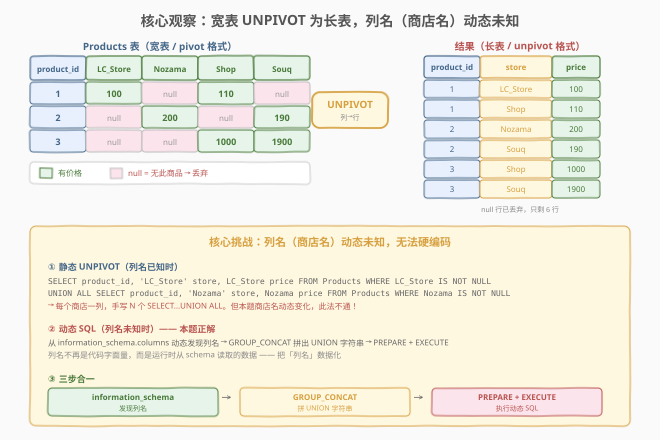
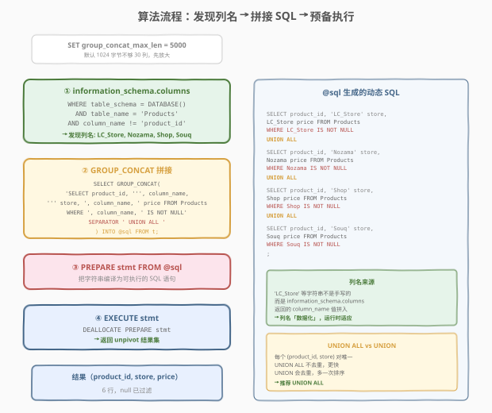
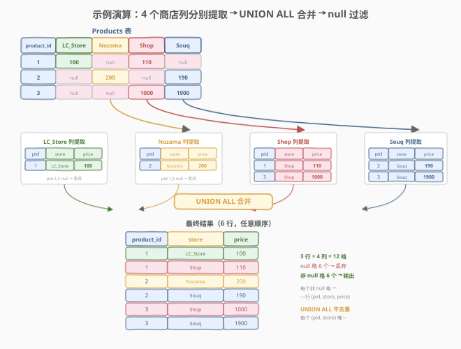

# LeetCode 动态取消表的旋转 题解

## 1. 题目概述

- **标题 / 题号**：动态取消表的旋转（#2253，hard）
- **链接**：https://leetcode.cn/problems/dynamic-unpivoting-of-a-table/
- **难度**：困难
- **标签**：数据库、SQL、动态 SQL、`information_schema`、`GROUP_CONCAT`、`PREPARE`/`EXECUTE`、`UNION ALL`、UNPIVOT、存储过程、LeetCode 锁题

**题意**：给定 `Products` 表，每行表示一个商品在 $n$ 个不同商店中的价格。表的列结构为 `product_id`（主键）加上若干**商店名列**（如 `LC_Store`、`Nozama`、`Shop`、`Souq` 等），每个商店一列。若某商品在某商店无售，则对应单元格为 `NULL`。

要求实现存储过程 `UnpivotProducts()`，将**宽表**（pivot 格式）重组为**长表**（unpivot 格式）：每行一个 `(product_id, store, price)` 三元组，**丢弃所有 `NULL` 价格行**，以**任意顺序**返回结果。

> ⚠️ **核心难点——列名动态**：不同测试用例的**商店列名不同**（可能叫 `LC_Store`，也可能叫 `Amazon`、`JD`…），且列数 $n$ 在 1–30 之间变化。你**无法在 SQL 中硬编码列名**——必须运行时从表结构中动态发现列名，再据此拼接 SQL 语句执行。这正是题名「**动态**取消表的旋转」的含义。

**表结构**：

```text
Table: Products
+-------------+---------+
| Column Name | Type    |
+-------------+---------+
| product_id  | int     |  ← 主键
| store_name_1| int     |  ← 商店列（名称动态，至少1列，最多30列）
| store_name_2| int     |
|      :      | int     |
|      :      | int     |
|      :      | int     |
| store_name_n| int     |
+-------------+---------+
product_id 是该表的主键。
每一行表示该商品在 n 个不同商店中的价格。
如果商店中没有该商品，则该商店列中的价格将为 null。
不同测试用例的商店名称可能会不同。至少有1家店，最多30家店。
```

**示例 1**：

```text
输入：
Products 表:
+------------+----------+--------+------+------+
| product_id | LC_Store | Nozama | Shop | Souq |
+------------+----------+--------+------+------+
| 1          | 100      | null   | 110  | null |
| 2          | null     | 200    | null | 190  |
| 3          | null     | null   | 1000 | 1900 |
+------------+----------+--------+------+------+

输出：
+------------+----------+-------+
| product_id | store    | price |
+------------+----------+-------+
| 1          | LC_Store | 100   |
| 1          | Shop     | 110   |
| 2          | Nozama   | 200   |
| 2          | Souq     | 190   |
| 3          | Shop     | 1000  |
| 3          | Souq     | 1900  |
+------------+----------+-------+

解释：
商品 1 在 LC_Store 和 Shop 销售，价格分别为 100 和 110。
商品 2 在 Nozama 和 Souq 销售，价格分别为 200 和 190。
商品 3 在 Shop 和 Souq 出售，价格分别为 1000 和 1900。
```

**约束**：

- `product_id` 为主键，行唯一。
- 商店列数 $n \in [1, 30]$，列名跨测试用例**动态变化**。
- 某商品在某商店无售 → 对应单元格 `NULL` → 结果中**不包含该行**。
- 结果三列：`product_id`、`store`（商店名，即原列名）、`price`（该列的值）。
- 以任意顺序返回。

> 💡 **题眼**：① **UNPIVOT**——把「列」变成「行」，每个非空单元格变成一行；② **动态**——列名不是代码字面量而是运行时数据，须从 `information_schema` 读取后拼接 SQL；③ **过滤 NULL**——`NULL` 单元格不输出。三要素叠加 → 必须用动态 SQL（`PREPARE` + `EXECUTE`）。

> ⚠️ **与 1777「每家商店的产品价格」对照**：1777 是 2253 的**逆操作**（PIVOT：长表 → 宽表），且 1777 的输入已是长表（`product_id` + `store` + `price`），用 `GROUP BY product_id` + `MAX(IF(store='X', price, NULL))` 静态旋转即可。2253 是**宽表 → 长表**，且列名动态，必须动态 SQL。两题构成 PIVOT ↔ UNPIVOT 的正反镜像。

## 2. 解题思路

### 2.1 暴力思路：手写 UNION ALL（列名已知时）

若商店列名**固定已知**（如示例中恒为 `LC_Store`、`Nozama`、`Shop`、`Souq`），最直觉的写法是：对每个商店列写一个 `SELECT`，把列名变成字符串常量、列值变成 `price`，再 `UNION ALL` 拼起来，`WHERE` 过滤 `NULL`。

```text
for each store_column in [LC_Store, Nozama, Shop, Souq]:
    SELECT product_id, 'store_column' AS store, store_column AS price
    FROM Products WHERE store_column IS NOT NULL
concat all with UNION ALL
```

对应的静态 SQL：

```sql
SELECT product_id, 'LC_Store' AS store, LC_Store AS price FROM Products WHERE LC_Store IS NOT NULL
UNION ALL
SELECT product_id, 'Nozama' AS store, Nozama AS price FROM Products WHERE Nozama IS NOT NULL
UNION ALL
SELECT product_id, 'Shop' AS store, Shop AS price FROM Products WHERE Shop IS NOT NULL
UNION ALL
SELECT product_id, 'Souq' AS store, Souq AS price FROM Products WHERE Souq IS NOT NULL;
```

逻辑完全正确——但**本题行不通**：题目明确「不同测试用例的商店名称可能会不同」，你**不知道**列名是 `LC_Store` 还是 `Amazon`，也不知道有几列。静态 SQL 把列名写成字面量，无法适应 schema 变化。

> ⚠️ 暴力思路的价值在于揭示了 UNPIVOT 的本质：**每个商店列 → 一个 `SELECT` → `UNION ALL` 合并**。只要能把这段 SQL **动态生成**，问题就解决了——这正是动态 SQL 的用武之地。

### 2.2 核心观察：动态 SQL 三步——发现列名、拼接字符串、预备执行



题目的三个语义——「**每个商店列提取**」「**列名动态未知**」「**NULL 过滤**」——分别对应 SQL 机制：

| 题意要求 | SQL 机制 | 语义 |
|----------|----------|------|
| 「列名动态未知」 | `information_schema.columns` | **运行时发现列名**：从系统目录表读取 `Products` 的所有列名（排除 `product_id`） |
| 「每个商店列提取」 | `GROUP_CONCAT(... SEPARATOR ' UNION ALL ')` | **拼接 SQL 字符串**：为每个列名生成一个 `SELECT ... UNION ALL ...` 片段 |
| 「执行拼接的 SQL」 | `PREPARE stmt FROM @sql` + `EXECUTE stmt` | **动态执行**：把字符串编译为 SQL 语句并运行 |

$$\text{UnpivotProducts} = \text{EXECUTE}\Bigl(\text{GROUP\_CONCAT}_{c \in \text{cols}}\bigl(\text{SELECT}(\text{product\_id},\; c,\; c) \;\text{WHERE}\; c \neq \text{NULL}\bigr)\Bigr)$$

其中 $\text{cols}$ 是从 `information_schema.columns` 动态发现的列名集合（不含 `product_id`）。

> 💡 **「列名数据化」**：静态 SQL 中列名是**代码字面量**（写死在 SQL 文本里）；动态 SQL 把列名变成**运行时数据**——`information_schema.columns` 返回的每一行 `column_name` 值，被 `GROUP_CONCAT` 当作字符串拼接进 SQL 文本。这是动态 SQL 的核心思想：**把不可能参数化的部分（列名、表名）从代码移到数据**。

> ⚠️ **为什么不能直接参数化？** SQL 预编译语句（`PREPARE`）的占位符 `?` 只能替换**值**（`WHERE x = ?`），**不能替换列名或表名**（`SELECT ? FROM ...` 不合法）。因此列名必须通过字符串拼接注入 SQL 文本，再用 `PREPARE` 编译整条语句。这是 SQL 标准的限制，所有数据库均如此。

### 2.3 算法流程图



**逻辑执行步骤**：

| 步骤 | 语句 | 作用 |
|------|------|------|
| ⓪ | `SET group_concat_max_len = 5000` | 放大 `GROUP_CONCAT` 结果上限（默认 1024 字节，30 列可能不够） |
| ① | `SELECT column_name FROM information_schema.columns WHERE table_schema = DATABASE() AND table_name = 'Products' AND column_name != 'product_id'` | 发现所有商店列名 |
| ② | `SELECT GROUP_CONCAT('SELECT ... ' SEPARATOR ' UNION ALL ') INTO @sql` | 为每个列名拼出一个 `SELECT` 片段，用 `UNION ALL` 连接，存入变量 `@sql` |
| ③ | `PREPARE stmt FROM @sql` | 把 `@sql` 字符串编译为可执行 SQL 语句 |
| ④ | `EXECUTE stmt` + `DEALLOCATE PREPARE stmt` | 执行并释放 |

> 💡 **`information_schema.columns` 是什么？** 它是 MySQL 的**系统目录视图**，记录当前数据库中每张表的每个列的元信息（列名、类型、位置等）。`table_schema = DATABASE()` 限定当前库，`table_name = 'Products'` 限定目标表，`column_name != 'product_id'` 排除主键列，剩下就是所有商店列名。这是动态 SQL 发现 schema 的标准入口。

> ⚠️ **`group_concat_max_len` 的坑**：MySQL 的 `GROUP_CONCAT` 默认最大输出 1024 字节。每个商店列的 `SELECT` 片段约 80 字节，30 列 ≈ 2400 字节，超出默认值会被**静默截断**导致 SQL 语法错误。因此必须先 `SET group_concat_max_len = 5000`（或更大）放大上限。这是本题最隐蔽的陷阱。

### 2.4 示例演算

以示例 1 的 3 行 × 4 商店列为例，观察动态 SQL 的完整执行过程：



**阶段 ①：`information_schema.columns` 发现列名**

```text
column_name
-----------
LC_Store
Nozama
Shop
Souq
```

`Products` 表有 5 列（`product_id` + 4 商店列），排除 `product_id` 后得到 4 个商店列名。

**阶段 ②：`GROUP_CONCAT` 拼接 SQL 字符串**

对每个列名 $c$，生成片段：

```text
SELECT product_id, 'c' AS store, c AS price FROM Products WHERE c IS NOT NULL
```

用 ` UNION ALL ` 连接 4 个片段，得到 `@sql`：

```sql
SELECT product_id, 'LC_Store' AS store, LC_Store AS price FROM Products WHERE LC_Store IS NOT NULL
UNION ALL
SELECT product_id, 'Nozama' AS store, Nozama AS price FROM Products WHERE Nozama IS NOT NULL
UNION ALL
SELECT product_id, 'Shop' AS store, Shop AS price FROM Products WHERE Shop IS NOT NULL
UNION ALL
SELECT product_id, 'Souq' AS store, Souq AS price FROM Products WHERE Souq IS NOT NULL
```

> 💡 **列名出现两次**：每个片段中列名 $c$ 出现**两次**——一次作为字符串常量 `'c'`（变成 `store` 列的值），一次作为列引用 `c`（取出该列的 `price` 值）。`GROUP_CONCAT` 把 `column_name` 的值同时拼入这两个位置。

**阶段 ③④：`PREPARE` + `EXECUTE` 执行**

每个 `SELECT` 独立执行，`WHERE c IS NOT NULL` 过滤掉 `NULL` 行：

| 商店列 | 非空行 | 提取结果 |
|--------|--------|----------|
| `LC_Store` | product 1 (100) | `(1, 'LC_Store', 100)` |
| `Nozama` | product 2 (200) | `(2, 'Nozama', 200)` |
| `Shop` | product 1 (110), product 3 (1000) | `(1, 'Shop', 110)`, `(3, 'Shop', 1000)` |
| `Souq` | product 2 (190), product 3 (1900) | `(2, 'Souq', 190)`, `(3, 'Souq', 1900)` |

`UNION ALL` 合并 6 行 → **最终结果**（任意顺序）✓。

> 💡 **3 行 × 4 列 = 12 格，其中 6 格 `NULL` 被丢弃，6 格非 `NULL` 各输出一行**。每个非 `NULL` 格变成一个 `(product_id, store, price)` 三元组——这就是 UNPIVOT 的本质：**格子变行**。

## 3. 参考代码

### SQL（解法 A：动态 SQL `information_schema` + `GROUP_CONCAT` + `PREPARE`，推荐）

```sql
CREATE PROCEDURE UnpivotProducts()
BEGIN
    SET group_concat_max_len = 5000;

    WITH t AS (
        SELECT column_name
        FROM information_schema.columns
        WHERE table_schema = DATABASE()
          AND table_name = 'Products'
          AND column_name != 'product_id'
    )
    SELECT GROUP_CONCAT(
        'SELECT product_id, ''', column_name,
        ''' AS store, ', column_name,
        ' AS price FROM Products WHERE ', column_name,
        ' IS NOT NULL' SEPARATOR ' UNION ALL '
    ) INTO @sql
    FROM t;

    PREPARE stmt FROM @sql;
    EXECUTE stmt;
    DEALLOCATE PREPARE stmt;
END;
```

> 💡 **写法要点**：
> - `SET group_concat_max_len = 5000`：放大 `GROUP_CONCAT` 输出上限，防止 30 列时字符串被截断。
> - `information_schema.columns`：从系统目录动态发现 `Products` 表的所有列名，排除 `product_id`。
> - `GROUP_CONCAT(... SEPARATOR ' UNION ALL ')`：为每个列名拼出一个 `SELECT` 片段，`UNION ALL` 连接。
> - `''' AS store`：SQL 字符串中两个单引号 `''` 转义为一个字面量单引号，生成 `'LC_Store' AS store`。
> - `INTO @sql`：把拼接结果存入会话变量 `@sql`。
> - `PREPARE stmt FROM @sql` + `EXECUTE stmt`：编译并执行动态 SQL。`DEALLOCATE PREPARE stmt` 释放。
> - ✓ **通用**：无论列名如何变化、列数多少（1–30），都能自动适应。

### SQL（解法 B：静态 `UNION ALL`，仅列名固定时可用）

若题目保证列名固定（本题不保证，仅作对照理解），可直接手写：

```sql
CREATE PROCEDURE UnpivotProducts()
BEGIN
    SELECT product_id, 'LC_Store' AS store, LC_Store AS price FROM Products WHERE LC_Store IS NOT NULL
    UNION ALL
    SELECT product_id, 'Nozama' AS store, Nozama AS price FROM Products WHERE Nozama IS NOT NULL
    UNION ALL
    SELECT product_id, 'Shop' AS store, Shop AS price FROM Products WHERE Shop IS NOT NULL
    UNION ALL
    SELECT product_id, 'Souq' AS store, Souq AS price FROM Products WHERE Souq IS NOT NULL;
END;
```

> ⚠️ **解法 B 仅适用于理解原理**——本题列名动态变化，解法 B 在其他测试用例上会因列名不存在而报错。它揭示的是 UNPIVOT 的**逻辑骨架**：每列一个 `SELECT` + `UNION ALL`，动态 SQL 只是把这个过程**自动化**。

### SQL（解法 C：使用 `UNION` 而非 `UNION ALL`）

与解法 A 相同，仅把 `SEPARATOR ' UNION ALL '` 改为 `SEPARATOR ' UNION '`：

```sql
CREATE PROCEDURE UnpivotProducts()
BEGIN
    SET group_concat_max_len = 5000;

    SELECT GROUP_CONCAT(
        'SELECT product_id, ''', column_name,
        ''' AS store, ', column_name,
        ' AS price FROM Products WHERE ', column_name,
        ' IS NOT NULL' SEPARATOR ' UNION '
    ) INTO @sql
    FROM information_schema.columns
    WHERE table_schema = DATABASE()
      AND table_name = 'Products'
      AND column_name != 'product_id';

    PREPARE stmt FROM @sql;
    EXECUTE stmt;
    DEALLOCATE PREPARE stmt;
END;
```

> 💡 **`UNION` vs `UNION ALL`**：每个 `(product_id, store)` 对在原表中最多出现一次（每个商店列每行只有一个值），因此不可能产生重复行，`UNION`（去重）和 `UNION ALL`（不去重）结果相同。`UNION ALL` **省去去重排序**，更快。推荐 `UNION ALL`。

### Python（pandas）

```python
import pandas as pd

def unpivot_products(products: pd.DataFrame) -> pd.DataFrame:
    result = products.melt(
        id_vars=['product_id'],
        var_name='store',
        value_name='price'
    )
    result = result.dropna(subset=['price'])
    result['price'] = result['price'].astype(int)
    return result[['product_id', 'store', 'price']]
```

> 💡 **pandas 对照**：
> - `melt(id_vars=['product_id'], var_name='store', value_name='price')`：pandas 内置的 UNPIVOT 操作，把所有非 `product_id` 列「融化」为 `(store, price)` 行——一行代码等价于 SQL 的整个动态 `UNION ALL`。
> - `dropna(subset=['price'])`：过滤 `NULL` 价格行，对应 SQL 的 `WHERE c IS NOT NULL`。
> - pandas 的 `melt` 天然支持动态列名（自动发现所有非 `id_vars` 列），无需 `information_schema`——这是 DataFrame API 比 SQL 静态语法灵活的地方。

## 4. 复杂度分析

| 维度 | 解法 A（动态 SQL） | 解法 B（静态 UNION ALL） | pandas |
|------|---------------------|--------------------------|--------|
| **时间** | $O(m \times n)$ | $O(m \times n)$ | $O(m \times n)$ |
| **空间** | $O(m \times n)$（`@sql` 字符串） | $O(1)$ 额外 | $O(m \times n)$ |
| **通用性** | ✓ 列名动态适应 | ✗ 列名必须固定 | ✓ 列名动态适应 |
| **推荐度** | ✓ 首选（本题唯一可行） | ✓ 理解用 | ✓ 验证用 |

> - $m$ = `Products` 表行数（商品数），$n$ = 商店列数（$1 \le n \le 30$）。
> - **解法 A**：`information_schema` 查询 $O(n)$；`GROUP_CONCAT` 拼接 $O(n)$；`EXECUTE` 执行 $n$ 个 `SELECT` 各扫 $m$ 行 → $O(m \times n)$；`UNION ALL` 合并 $O(m \times n)$ 行。`@sql` 字符串长度 $O(n \times 80)$ 字节。
> - **解法 B**：逻辑复杂度与 A 相同，但列名固定 → 无 schema 查询开销；代价是不通用。
> - **空间**：解法 A 额外存 `@sql` 字符串 $O(n)$；结果集 $O(m \times n)$ 行。解法 B 无字符串拼接，额外空间 $O(1)$。

## 5. 扩展：PIVOT ↔ UNPIVOT 与动态 SQL 模式

### 5.1 UNPIVOT 的本质：格子变行

UNPIVOT（取消旋转）把**宽表**（多列存储同类数据）变成**长表**（一列存值 + 一列存来源标签）。每个非空单元格变成一行：

```
宽表（pivot）                    长表（unpivot）
+----+ A  | B  | C           +----+-------+-------+
| id | vA | vB | vC   →      | id | store | price |
+----+----+----+----+        +----+-------+-------+
|  1 | 10 |null| 30          |  1 |   A   |  10   |
|  2 |null| 20 |null         |  1 |   C   |  30   |
+----+----+----+----+        |  2 |   B   |  20   |
                              +----+-------+-------+
```

- 宽表的每个商店列（`A`、`B`、`C`）→ 长表 `store` 列的一个值。
- 宽表每个单元格的值 → 长表 `price` 列的一个值。
- `NULL` 单元格 → 丢弃（不出现在长表中）。

### 5.2 PIVOT ↔ UNPIVOT 正反镜像

| 方向 | 操作 | 输入 → 输出 | 代表题 |
|------|------|-------------|--------|
| UNPIVOT | 列→行 | 宽表 → 长表 | **2253（本题）** |
| PIVOT | 行→列 | 长表 → 宽表 | [1777. 每家商店的产品价格](https://leetcode.cn/problems/products-price-for-each-store/) |

> 💡 **1777 是 2253 的逆操作**：1777 输入 `(product_id, store, price)` 长表，输出 `(product_id, LC_Store, Nozama, ...)` 宽表；2253 输入宽表，输出长表。两者互为镜像，掌握一个即可理解另一个。

### 5.3 动态 SQL 的三大场景

动态 SQL（`PREPARE` + `EXECUTE`）在以下场景不可替代：

| 场景 | 为什么需要动态 SQL | 代表题 |
|------|-------------------|--------|
| **列名动态** | `PREPARE` 占位符 `?` 不能替换列名 | **2253（本题）**、[1179. 重新格式化部门表](https://leetcode.cn/problems/reformat-department-table/) |
| **列数动态** | `SELECT` 的列数在运行时才确定 | [618. 学生地理信息报告](https://leetcode.cn/problems/student-geography-report/) |
| **`OFFSET` 参数化** | `LIMIT ? OFFSET ?` 在存储函数内不允许 | [177. 第N高的薪水](https://leetcode.cn/problems/nth-highest-salary/) |

> ⚠️ 动态 SQL 的代价：① 不可缓存执行计划（每次 `PREPARE` 重新编译）；② 难以调试（生成的 SQL 不直观）；③ SQL 注入风险（若列名来自用户输入需严格校验）。生产环境中，通常在应用层（Python/Java）拼接 SQL 字符串更清晰可控，存储过程内动态 SQL 是 LeetCode 判题的特殊要求。

### 5.4 `GROUP_CONCAT` 拼接模式

`GROUP_CONCAT` 是 MySQL 中把多行值拼成一个字符串的聚合函数，是动态 SQL 拼接的核心工具：

```sql
-- 把 column_name 多行拼成 'col1, col2, col3'
SELECT GROUP_CONCAT(column_name SEPARATOR ', ') FROM t;

-- 拼出 SQL 片段：每个列名生成一个 SELECT，用 UNION ALL 连接
SELECT GROUP_CONCAT(
    'SELECT ... ', column_name, ' ...' SEPARATOR ' UNION ALL '
) INTO @sql FROM t;
```

> 💡 **模式**：`GROUP_CONCAT(前缀, column_name, 后缀 SEPARATOR 连接符)` —— 对每行的 `column_name` 值，套上前缀和后缀模板，用 `SEPARATOR` 指定的字符串连接。这是「把行数据变成 SQL 代码」的标准手法。注意 `SET group_concat_max_len` 放大上限。

### 5.5 各数据库的 UNPIVOT 语法

| 数据库 | UNPIVOT 语法 | 是否支持动态列名 |
|--------|-------------|-----------------|
| **SQL Server** | `UNPIVOT(price FOR store IN (col1, col2, ...))` | ✗ 列名仍需列举 |
| **Oracle** | `UNPIVOT INCLUDES NULLS (price FOR store IN (col1, ...))` | ✗ |
| **PostgreSQL** | `UNION ALL` 或 `jsonb_each_text` | ✓（配合 `to_jsonb`） |
| **MySQL** | 无内置 `UNPIVOT`，用 `UNION ALL` 或动态 SQL | ✓（`information_schema` + `PREPARE`） |
| **pandas** | `DataFrame.melt()` | ✓ 自动发现列 |

> 💡 MySQL 没有 `UNPIVOT` 关键字，只能用 `UNION ALL` 模拟。列名动态时，`UNION ALL` 的列名也必须动态生成 → 动态 SQL。pandas 的 `melt` 天然支持动态列名，是最简洁的 UNPIVOT 方式。

## 6. 面试要点

1. **为什么本题必须用动态 SQL？**

   > 题目明确「不同测试用例的商店名称可能会不同」，列名是动态的。SQL 预编译语句的占位符 `?` 只能替换**值**，不能替换**列名**。因此必须用字符串拼接把列名注入 SQL 文本，再用 `PREPARE` + `EXECUTE` 编译执行。这是 SQL 标准的限制——列名、表名属于标识符，不能参数化。

2. **`information_schema.columns` 的作用是什么？**

   > 它是 MySQL 的系统目录视图，记录当前数据库中每张表的每个列的元信息。通过 `SELECT column_name FROM information_schema.columns WHERE table_schema = DATABASE() AND table_name = 'Products' AND column_name != 'product_id'`，运行时发现 `Products` 表的所有商店列名。这是动态 SQL 发现 schema 的标准入口——把列名从「代码字面量」变成「运行时数据」。

3. **为什么需要 `SET group_concat_max_len = 5000`？**

   > MySQL 的 `GROUP_CONCAT` 默认最大输出 1024 字节。每个商店列的 `SELECT` 片段约 80 字节，30 列 ≈ 2400 字节，超出默认值会被**静默截断**——截断后的 SQL 字符串语法不完整，`PREPARE` 会报错。先 `SET group_concat_max_len = 5000` 放大上限，确保完整拼接。这是本题最隐蔽的陷阱。

4. **`UNION ALL` 和 `UNION` 选哪个？**

   > 选 `UNION ALL`。每个 `(product_id, store)` 对在原表中最多出现一次（每个商店列每行只有一个值），不可能产生重复行。`UNION`（去重）和 `UNION ALL`（不去重）结果相同，但 `UNION ALL` 省去去重排序，更快。只有在可能产生重复行且需去重时才用 `UNION`。

5. **`GROUP_CONCAT` 中 `'''` 是什么意思？**

   > SQL 字符串中两个连续单引号 `''` 转义为一个字面量单引号 `'`。`''' AS store` 在外层 `GROUP_CONCAT` 的字符串里生成 `'LC_Store' AS store`——即把列名 `LC_Store` 包在单引号里变成字符串常量，作为 `store` 列的值。每个列名在片段中出现两次：`'column_name'`（字符串常量→store 值）和 `column_name`（列引用→price 值）。

> 💡 **一句话总结**：2253 是 SQL **动态 UNPIVOT** 招牌题——`information_schema.columns` 发现列名 → `GROUP_CONCAT` 拼出 `UNION ALL` 字符串 → `PREPARE` + `EXECUTE` 动态执行。考点四要素：**列名动态（information_schema）、SQL 拼接（GROUP_CONCAT + SEPARATOR）、动态执行（PREPARE/EXECUTE）、group_concat_max_len 放大**。与 1777（PIVOT）互为正反镜像，与 1179/618（动态 SQL pivot）同属动态 SQL 家族。

## 同类练习题

| # | 题目 | 与本题的关联 |
|---|------|-------------|
| 1777 | [每家商店的产品价格](https://leetcode.cn/problems/products-price-for-each-store/)（[题解](../1701-1800/1777_每家商店的产品价格.md)） | 2253 的**逆操作**（PIVOT：长表→宽表），输入 `(product_id, store, price)` 输出 `(product_id, 各商店列...)`，用 `GROUP BY product_id` + `MAX(IF(store='X', price, NULL))` 静态旋转，对照 PIVOT ↔ UNPIVOT 正反镜像 |
| 1179 | [重新格式化部门表](https://leetcode.cn/problems/reformat-department-table/)（[题解](../1101-1200/1179_重新格式化部门表.md)） | 动态 SQL PIVOT 母题，`GROUP_CONCAT` 拼出 `SUM(IF(month='XXX', ...)) AS XXX` 片段 + `PREPARE`/`EXECUTE`，与本题同为「列名动态 → 动态 SQL」模式，方向相反（PIVOT 而非 UNPIVOT） |
| 618 | [学生地理信息报告](https://leetcode.cn/problems/student-geography-report/)（[题解](../0601-0700/618_学生地理信息报告.md)） | 动态 SQL PIVOT，`GROUP_CONCAT` 拼出 `MAX(CASE WHEN continent='xxx' THEN name END) AS xxx` + `PREPARE`/`EXECUTE`，列数动态（大洲数量可变），与本题同属动态 SQL 家族 |
| 1783 | [大满贯数量](https://leetcode.cn/problems/grand-slam-titles/)（[题解](../1701-1800/1783_大满贯数量.md)） | 静态 `UNION ALL` UNPIVOT（列名固定 4 列），手写 4 个 `SELECT ... UNION ALL`，是本题解法 B 的简化版——列名固定时无需动态 SQL，理解 2253 的逻辑骨架 |
| 177 | [第N高的薪水](https://leetcode.cn/problems/nth-highest-salary/)（[题解](../0101-0200/177_第N高的薪水.md)） | 动态 SQL 参数化 `OFFSET`，`PREPARE` + `EXECUTE` 把变量注入 `LIMIT/OFFSET`，与本题同为「SQL 标识符/关键字不能参数化 → 动态 SQL」模式，但参数化对象不同（OFFSET vs 列名） |
