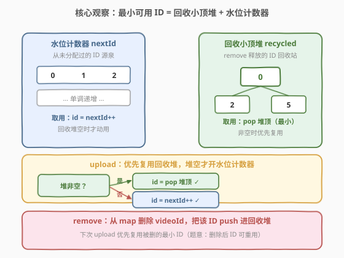
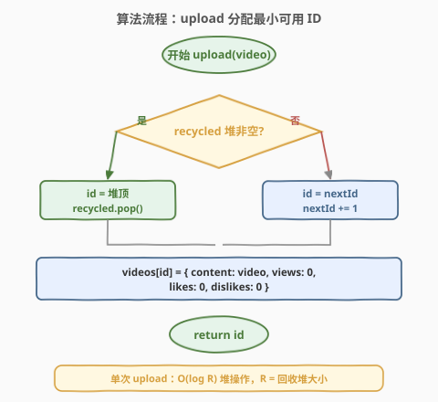
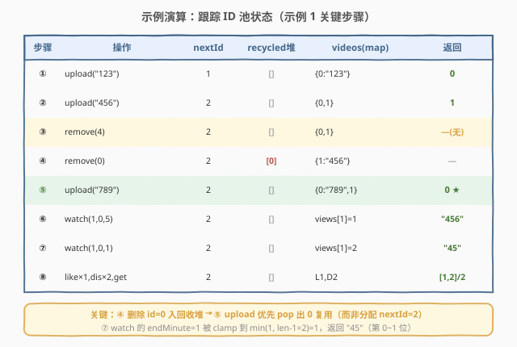

# LeetCode 设计视频共享平台 题解

## 1. 题目概述

- **标题 / 题号**：设计视频共享平台（#2254，hard）
- **链接**：https://leetcode.cn/problems/design-video-sharing-platform/
- **难度**：困难
- **标签**：设计、哈希表、堆（优先队列）

**题意**：设计一个视频分享平台，用户可以上传和删除视频。每个 `video` 是**字符串类型的数字**，其中第 `i` 位表示视频中第 `i` 分钟的内容。平台还需跟踪每个视频的**观看次数**、**点赞次数**和**不喜欢次数**。

上传时，视频与**最小可用整数 `videoId`** 关联（从 `0` 开始）；视频被删除后，其 `videoId` 可被另一个视频复用。

实现 `VideoSharingPlatform` 类：

- `VideoSharingPlatform()`：初始化对象。
- `int upload(String video)`：上传视频，返回关联的 `videoId`。
- `void remove(int videoId)`：若存在该 `videoId` 的视频，则删除它。
- `String watch(int videoId, int startMinute, int endMinute)`：若存在该视频，观看次数 `+1`，并返回视频字符串从 `startMinute` 到 `min(endMinute, video.length - 1)`（含边界）的子串；否则返回 `"-1"`。
- `void like(int videoId)`：若存在，点赞数 `+1`。
- `void dislike(int videoId)`：若存在，不喜欢数 `+1`。
- `int[] getLikesAndDislikes(int videoId)`：返回 `[likes, dislikes]`；若无此视频返回 `[-1]`。
- `int getViews(int videoId)`：返回观看次数；若无此视频返回 `-1`。

**示例 1**：

```text
输入
["VideoSharingPlatform","upload","upload","remove","remove","upload","watch","watch","like","dislike","dislike","getLikesAndDislikes","getViews"]
[[],["123"],["456"],[4],[0],["789"],[1,0,5],[1,0,1],[1],[1],[1],[1],[1]]
输出
[null,0,1,null,null,0,"456","45",null,null,null,[1,2],2]

解释
upload("123");   // 最小可用 videoId=0 → 返回 0
upload("456");   // 最小可用 videoId=1 → 返回 1
remove(4);       // 无 videoId 4，什么都不做
remove(0);       // 删除 videoId 0，0 重新可用
upload("789");   // 0 是最小可用 videoId → 复用，返回 0
watch(1,0,5);    // videoId 1 = "456"，min(5,2)=2 → "456"，views[1]=1
watch(1,0,1);    // min(1,2)=1 → "45"，views[1]=2
like(1); dislike(1); dislike(1);   // likes=1, dislikes=2
getLikesAndDislikes(1);            // [1,2]
getViews(1);                       // 2
```

**示例 2**：

```text
输入
["VideoSharingPlatform","remove","watch","like","dislike","getLikesAndDislikes","getViews"]
[[],[0],[0,0,1],[0],[0],[0],[0]]
输出
[null,null,"-1",null,null,[-1],-1]

解释：对不存在的 videoId，remove/like/dislike 静默无操作，watch 返回 "-1"，getLikesAndDislikes 返回 [-1]，getViews 返回 -1。
```

**约束**：

- $1 \le \text{video.length} \le 10^5$
- 所有 `upload` 的 `video.length` 之和不超过 $10^5$
- `video` 由数字组成
- $0 \le \text{videoId} \le 10^5$
- $0 \le \text{startMinute} < \text{endMinute} < 10^5$，且 $\text{startMinute} < \text{video.length}$
- 所有 `watch` 的 $\text{endMinute} - \text{startMinute}$ 之和不超过 $10^5$
- 所有函数总共最多调用 $10^5$ 次

> 💡 题眼有两处：① **「最小可用 `videoId`」**——删除后 ID 要回收复用，这是经典的「取最小可用整数」问题；② **`watch` 的 `endMinute` 截断**——下标要 clamp 到 `video.length - 1`。其余操作都是 $O(1)$ 的哈希查表 + 计数器自增。

## 2. 解题思路

### 2.1 暴力思路：扫描找最小空号

最直觉的做法：用一个布尔数组 `used[0..]` 标记哪些 `videoId` 被占用，`upload` 时**从 `0` 开始线性扫描**找第一个 `used[i] == false` 的下标作为新 ID。

问题：单次 `upload` 最坏 $O(N)$，$N$ 次调用总计 $O(N^2)$，$N = 10^5$ 时达 $10^{10}$，超时。而且删除后留下的「空洞」分散，扫描无法快速跳过。

> ⚠️ 暴力方案的瓶颈不在「查视频」（哈希表已 $O(1)$），而在「**分配最小可用 ID**」——这是一个独立于视频内容的子问题，需要专门的数据结构。

### 2.2 核心观察：回收小顶堆 + 水位计数器



把 ID 的来源拆成**两个互不重叠的来源**：

1. **水位计数器 `nextId`**：记录「从未被分配过」的下一个 ID。这部分是单调递增的——只有当回收池为空时才动用它，取 `id = nextId++`。因为题目保证 `videoId` 上限 $10^5$ 且总调用 $\le 10^5$，`nextId` 永不溢出。

2. **回收小顶堆 `recycled`**：`remove` 释放的 ID 全部 `push` 进小顶堆。`upload` 时**只要堆非空就 `pop` 堆顶**——堆顶天然是最小的可复用 ID。

**为什么这样能拿到全局最小可用 ID？** 因为「可用 ID」=「被释放的旧 ID」∪「从未分配的新 ID」。新 ID 段是 $[\text{nextId}, +\infty)$，最小值是 `nextId`；旧 ID 段的最小值是小顶堆堆顶。两者相比取较小即可——但由于「旧 ID 一定 $< \text{nextId}$」（被释放说明曾经分配过，故其值 $< $ 当前水位），**只要回收堆非空，堆顶一定 $<$ `nextId`**，所以「堆非空就 pop 堆顶」等价于取全局最小。这个单调性是算法正确性的关键。

> 💡 这正是「**取最小可用整数**」问题的标准范式：**小顶堆回收 + 水位计数器**，单次 $O(\log R)$（$R$ 为回收堆大小）。若调用频繁删除/上传，$R$ 可达 $O(N)$；若几乎不删除，堆常空、退化为 $O(1)$。

### 2.3 算法流程图



`upload` 的核心是上面的「堆非空？」二分支；其余操作都是直接对哈希表 `videos` 做 $O(1)$ 查改：

- `remove(id)`：`videos.find(id)`，命中则 `erase` 并把 `id` 入回收堆，否则无操作。
- `watch(id, s, e)`：命中则 `views++`，计算 `end = min(e, len-1)`，返回 `content.substr(s, end - s + 1)`；未命中返回 `"-1"`。
- `like`/`dislike`：命中则对应计数 `+1`，否则无操作。
- `getLikesAndDislikes`/`getViews`：命中返回计数，未命中返回 `[-1]`/`-1`。

> ⚠️ **`watch` 的截断**：`endMinute` 可能超过 `video.length - 1`（示例 1 中 `watch(1,0,5)` 的 `5 > 2`），必须 `end = min(endMinute, len-1)`，再 `substr(s, end - s + 1)`。少做这一步会越界返回空串或抛异常。

### 2.4 示例演算

以示例 1 跟踪 ID 池状态，重点看 ④→⑤ 的**回收复用**与 ⑦ 的**下标截断**：



| 步骤 | 操作 | nextId | recycled | videos | 返回 |
|------|------|--------|----------|--------|------|
| ① | upload("123") | 1 | [] | {0:"123"} | 0 |
| ② | upload("456") | 2 | [] | {0,1} | 1 |
| ③ | remove(4) | 2 | [] | {0,1} | —(无) |
| ④ | remove(0) | 2 | **[0]** | {1:"456"} | — |
| ⑤ | upload("789") | 2 | [] | {0:"789",1} | **0 ★复用** |
| ⑥ | watch(1,0,5) | 2 | [] | views[1]=1 | "456" |
| ⑦ | watch(1,0,1) | 2 | [] | views[1]=2 | "45" |
| ⑧ | like×1,dis×2,get | 2 | [] | L1,D2 | [1,2]/2 |

> 💡 **关键对比**：④ 删除 `id=0` 后入回收堆 → ⑤ `upload` 优先 `pop` 出 `0` 复用，而不是分配 `nextId=2`。这验证了「回收优先」的正确性。⑦ 中 `endMinute=1` 经 `min(1, 2)=1` 截断后，返回第 0~1 位 `"45"`。

## 3. 参考代码

### C++：小顶堆回收 + 水位计数器

```cpp
class VideoSharingPlatform {
    struct Video {
        string content;
        int views = 0;
        int likes = 0;
        int dislikes = 0;
    };
    unordered_map<int, Video> videos;
    priority_queue<int, vector<int>, greater<int>> recycled;  // 回收 ID 小顶堆
    int nextId = 0;                                            // 水位计数器
public:
    VideoSharingPlatform() {}

    int upload(string video) {
        int id;
        if (!recycled.empty()) {        // 回收堆非空 → 复用最小旧 ID
            id = recycled.top();
            recycled.pop();
        } else {                        // 否则开水位计数器
            id = nextId++;
        }
        videos[id].content = move(video);
        return id;
    }

    void remove(int videoId) {
        auto it = videos.find(videoId);
        if (it == videos.end()) return; // 无此视频，静默
        videos.erase(it);
        recycled.push(videoId);         // 释放的 ID 入回收堆
    }

    string watch(int videoId, int startMinute, int endMinute) {
        auto it = videos.find(videoId);
        if (it == videos.end()) return "-1";
        Video& v = it->second;
        v.views++;
        int endIdx = min(endMinute, (int)v.content.size() - 1);  // 截断到末位
        return v.content.substr(startMinute, endIdx - startMinute + 1);
    }

    void like(int videoId) {
        auto it = videos.find(videoId);
        if (it != videos.end()) it->second.likes++;
    }

    void dislike(int videoId) {
        auto it = videos.find(videoId);
        if (it != videos.end()) it->second.dislikes++;
    }

    vector<int> getLikesAndDislikes(int videoId) {
        auto it = videos.find(videoId);
        if (it == videos.end()) return {-1};
        return {it->second.likes, it->second.dislikes};
    }

    int getViews(int videoId) {
        auto it = videos.find(videoId);
        if (it == videos.end()) return -1;
        return it->second.views;
    }
};
```

### Python：小顶堆回收 + 水位计数器

```python
import heapq

class VideoSharingPlatform:
    def __init__(self):
        self.videos = {}          # videoId -> [content, views, likes, dislikes]
        self.recycled = []        # 回收 ID 小顶堆
        self.next_id = 0          # 水位计数器

    def upload(self, video: str) -> int:
        if self.recycled:         # 回收堆非空 → 复用最小旧 ID
            vid = heapq.heappop(self.recycled)
        else:                     # 否则开水位计数器
            vid = self.next_id
            self.next_id += 1
        self.videos[vid] = [video, 0, 0, 0]
        return vid

    def remove(self, videoId: int) -> None:
        if videoId in self.videos:
            del self.videos[videoId]
            heapq.heappush(self.recycled, videoId)

    def watch(self, videoId: int, startMinute: int, endMinute: int) -> str:
        v = self.videos.get(videoId)
        if v is None:
            return "-1"
        v[1] += 1                                       # views++
        end = min(endMinute, len(v[0]) - 1)             # 截断到末位
        return v[0][startMinute:end + 1]

    def like(self, videoId: int) -> None:
        v = self.videos.get(videoId)
        if v is not None:
            v[2] += 1

    def dislike(self, videoId: int) -> None:
        v = self.videos.get(videoId)
        if v is not None:
            v[3] += 1

    def getLikesAndDislikes(self, videoId: int) -> List[int]:
        v = self.videos.get(videoId)
        if v is None:
            return [-1]
        return [v[2], v[3]]

    def getViews(self, videoId: int) -> int:
        v = self.videos.get(videoId)
        return -1 if v is None else v[1]
```

> 💡 两版结构一致：`videos` 用哈希表存「内容 + 三个计数器」；`recycled` 小顶堆 + `nextId` 水位计数器共同实现「最小可用 ID」。C++ 中 `move(video)` 避免字符串拷贝；`(int)v.content.size() - 1` 先转 `int` 再减 1，规避无符号下溢。

## 4. 复杂度分析

| 维度 | 复杂度 | 说明 |
|------|--------|------|
| **时间复杂度** | $O(\log R)$ / 次 | `upload`/`remove` 含一次堆操作（$R$ = 回收堆大小）；`watch` $O(L)$（$L = \text{endIdx} - \text{startMinute}$，总和 $\le 10^5$）；`like`/`dislike`/`get*` 为 $O(1)$ 哈希查改 |
| **空间复杂度** | $O(V + \Sigma L)$ | $V$ 为当前视频数，$\Sigma L$ 为所有上传视频长度之和（$\le 10^5$）；回收堆额外 $O(R) \subseteq O(V)$ |

> 💡 全局来看，$N$ 次调用总时间为 $O(N \log N + \Sigma L + \Sigma L_{\text{watch}})$。由于 $\Sigma L$ 与 $\Sigma L_{\text{watch}}$ 均 $\le 10^5$，瓶颈在 $N \log N \approx 10^5 \times 17 \approx 1.7 \times 10^6$，轻松通过。

## 5. 扩展：还有哪些实现「最小可用 ID」的方式？

「取最小可用整数」是高频设计子问题，除了本题的「小顶堆 + 水位计数器」，还有几种等价方案：

1. **有序集合（`std::set` / `TreeSet`）**：把可用 ID 存进有序集合，`upload` 取 `*begin()`（最小）。与堆方案复杂度同阶 $O(\log R)$，但常数略大；好处是支持「判断某 ID 是否可用」等额外查询。

2. **并查集（DSU）**：维护「下一个可用 ID」的并查集——每个被占用的 ID 指向下一个候选，`find(x)` 路径压缩后均摊 $O(\alpha(N)) \approx O(1)$。适合 ID 范围固定且密集的场景，速度最优但实现稍绕。

3. **位图 + 倍增找位**：用 bitset 标记占用，按 64 位块批量找首个 0 位，单次 $O(N/64)$。ID 范围不大时极快，但 $10^5$ 量级优势不明显。

> ⚠️ 本题无需这些优化——「小顶堆 + 水位计数器」已是最简洁、且与「删除产生空洞」语义最贴合的方案：堆天然只装被释放的 ID，水位计数器天然只装新 ID，二者职责清晰、互不干扰。

**回收是否影响正确性？** 题目要求「删除后 ID 可重用」，示例 1 的 ④→⑤ 明确验证了复用 `id=0`。若偷懒不做回收、只用 `nextId++`，虽然 $10^5$ 次调用下 `nextId` 不超上限、不会越界，但会**返回错误的 ID**（⑤ 会返回 `2` 而非 `0`），判错。所以回收不是性能优化、而是**正确性要求**。

## 6. 面试要点

1. **「最小可用 ID」为什么用「小顶堆 + 水位计数器」而不是扫描或单独用堆？**

   - 单独扫描布尔数组是 $O(N)$/次，$N$ 次达 $O(N^2)$ 超时。单独用一个堆也行，但需要在堆空时能立刻给出新 ID——水位计数器 `nextId` 正是「无穷新 ID 源」的 $O(1)$ 补充。两者合起来覆盖「旧可复用 ID + 新未分配 ID」两个不交来源，且因「旧 ID $<$ `nextId`」的单调性，堆非空时堆顶就是全局最小。

2. **`watch` 的 `endMinute` 为什么要截断？怎么截？**

   - `endMinute` 可超过 `video.length - 1`（如示例 `watch(1,0,5)` 中 `5 > 2`）。需 `end = min(endMinute, len-1)`，再 `substr(start, end - start + 1)`。C++ 注意 `(int)size()-1` 先强转防无符号下溢；Python 切片 `[start:end+1]` 天然安全。

3. **回收堆会不会存入重复 ID 或已不存在的 ID？**

   - 不会。`remove` 只在 `videos.find(id)` 命中时才 `erase` 并 `push` 回收堆，且 `erase` 后该 ID 已从 `videos` 移除，不会再次被 `remove`。`upload` 从堆里 `pop` 后立即写入 `videos`，下次 `remove` 该 ID 才会再次入堆——状态机闭合，无重复无泄漏。

4. **如果面试官追问「ID 范围缩到很小、调用极频繁」怎么优化？**

   - 换并查集：`fa[x]` 指向 `x` 之后的下一个可用 ID，`upload` 取 `find(nextId)` 并把该位指向 `find(x+1)`，均摊 $O(\alpha(N)) \approx O(1)$。或位图倍增找位。本题 $N = 10^5$，$O(\log N)$ 已足够，无需过度优化。

5. **为什么所有错误情况的处理方式不统一？**

   - 这是**题意规定**的接口契约：`remove`/`like`/`dislike` 对不存在 ID「静默无操作」（返回 `void`）；而 `watch`/`getLikesAndDislikes`/`getViews` 需要**返回值**，故分别用 `"-1"`、`[-1]`、`-1` 表示缺失。实现时统一用「哈希表 `find`/`get` 判存在」即可，区别仅在返回值形式。

> 💡 **一句话总结**：2254 是一道「设计 + 数据结构选型」题——核心难点不在写 8 个方法（多数是 $O(1)$ 查改），而在识别出「最小可用 ID」这个子问题并用「小顶堆回收 + 水位计数器」$O(\log N)$ 解决，外加 `watch` 的下标截断细节。

## 同类练习题

| # | 题目 | 与本题的关联 |
|---|------|-------------|
| 380 | [O(1) 时间插入、删除和获取随机元素](https://leetcode.cn/problems/insert-delete-getrandom-o1/) | 设计 + 哈希 + 数组，用「交换至末尾再删除」实现 $O(1)$ 删除，与本题同为「设计高效增删查」家族 |
| 146 | [LRU 缓存](../0101-0200/146_LRU缓存.md)（[题解](../0101-0200/146_LRU缓存.md)） | 经典数据结构设计题，哈希 + 双向链表，与本题同属「设计类」对照 |
| 729 | [我的日程安排 I](https://leetcode.cn/problems/my-calendar-i/) | 设计 + 有序集合/线段树维护动态区间，与本题同属「设计 + 维护动态集合」 |
| 23 | [合并 K 个升序链表](https://leetcode.cn/problems/merge-k-sorted-lists/) | 小顶堆取最小元素，与本题 `upload` 用堆取最小可用 ID 的堆操作同源 |
| 264 | [丑数 II](../0201-0300/264_丑数II.md)（[题解](../0201-0300/264_丑数II.md)） | 三指针多路归并取最小，与「取最小可用 ID」思想同源，可对照堆与多路归并两种取最值手段 |
