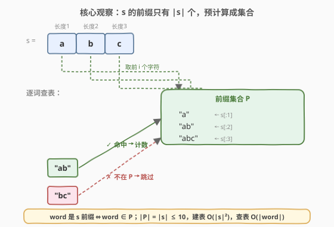

# LeetCode 统计是给定字符串前缀的字符串数目 题解

## 1. 题目概述

- **标题 / 题号**：统计是给定字符串前缀的字符串数目（#2255，easy）
- **链接**：https://leetcode.cn/problems/count-prefixes-of-a-given-string/
- **难度**：简单
- **标签**：字符串、数组、哈希表

**题意**：给定一个字符串数组 `words` 和一个字符串 `s`，其中 `words[i]` 和 `s` 只包含**小写英文字母**。返回 `words` 中是字符串 `s` **前缀**的字符串**数目**。

> **前缀**：出现在字符串开头的子字符串；**子字符串**是字符串中连续的一段字符序列。

**示例 1**：

```text
输入：words = ["a","b","c","ab","bc","abc"], s = "abc"
输出：3
解释：words 中是 s = "abc" 前缀的字符串为 "a"、"ab" 和 "abc"，共 3 个。
```

**示例 2**：

```text
输入：words = ["a","a"], s = "aa"
输出：2
解释：两个字符串都是 s 的前缀。相同的字符串可能在 words 中出现多次，应计数多次。
```

**约束**：

- $1 \le \text{words.length} \le 1000$
- $1 \le \text{words[i].length},\ \text{s.length} \le 10$
- `words[i]` 和 `s` **只**包含小写英文字母

> 💡 这是一道签到级的字符串题。约束里最关键的一条是 $|s| \le 10$——它意味着 `s` 的所有前缀**至多 10 个**，由此可把「逐词做字符级前缀判定」优化为「预计算前缀集合 + 哈希查表」，把每词的比较开销压缩为一次哈希。本解以「前缀集合」为核心观察展开。

## 2. 解题思路

### 2.1 直接思路：逐词前缀判定

最直观的做法是遍历 `words`，对每个词 `w` 判断 `s` 是否以 `w` 开头：

- 若 $|w| \le |s|$ 且 `s` 的前 $|w|$ 个字符与 `w` 完全相同，则 `w` 是 `s` 的前缀，计数加一。

```python
ans = 0
for w in words:
    if len(w) <= len(s) and s[:len(w)] == w:
        ans += 1
```

每次判定最多比较 $|w| \le 10$ 个字符，$n \le 1000$ 个词，总字符比较约 $n \cdot |w| \le 10^4$ 次，已远低于时限。**但每次都要重新切出 `s` 的前缀并逐字符比对**，存在可消除的重复——`s` 的前缀被反复取用。

### 2.2 核心观察：前缀集合化查表



关键认识有三层：

1. **前缀的数量被 $|s|$ 严格限定**：长度为 $L$ 的字符串 `s` 恰有 $L$ 个非空前缀（每个长度 $i \in [1, L]$ 对应一个 `s[:i]`）。本题 $|s| \le 10$，故前缀**至多 10 个**。

2. **判定可转化为集合查表**：「`w` 是 `s` 的前缀」当且仅当「`w ∈ P`」，其中 $P = \{s[:i] \mid 1 \le i \le |s|\}$。把 $P$ 预计算成哈希集合后，每个词的判定从「逐字符比较」变为「一次哈希查找」。

3. **重复词天然支持**：示例 2 中 `["a","a"]` 两个相同词都要计数。逐词查表对每个 `w` 独立判定，相同词各自命中一次，无需额外去重逻辑。

> ⚠️ 注意「前缀」与「子串」的区别：`"bc"` 是 `"abc"` 的子串却**不是**前缀（不在开头）。集合 $P$ 只收录从下标 0 起的连续前缀，天然排除中途出现的子串。

**时间复杂度**：建表 $O(|s|^2)$（生成 $|s|$ 个总长 $1+2+\cdots+|s|$ 的串），查表 $O\!\left(\sum |w_i|\right)$（哈希每个词）；本题下 $|s| \le 10$，建表常数极小。**空间复杂度**：$O(|s|^2)$ 存前缀集合。

### 2.3 算法流程图


流程两阶段：

1. **建表**：遍历 $i = 1 \ldots |s|$，把每个 `s[:i]` 加入哈希集合 $P$。
2. **查表计数**：遍历 `words`，对每个 `w` 查 `w ∈ P`，命中则 `ans += 1`；最终返回 `ans`。

### 2.4 示例演算

![示例演算：words = ["a","b","c","ab","bc","abc"], s = "abc"](../images/cps_example_walkthrough.svg)

以示例 1 走一遍（$P = \{\text{"a"},\ \text{"ab"},\ \text{"abc"}\}$）：

| 步骤 | word | 判定 | 是否在 P | ans |
|------|------|------|----------|-----|
| 1 | `"a"` | `s[:1]="a" == "a"` | ✓ 命中 | 1 |
| 2 | `"b"` | `s[:1]="a" ≠ "b"` | ✗ 不在 | 1 |
| 3 | `"c"` | `s[:1]="a" ≠ "c"` | ✗ 不在 | 1 |
| 4 | `"ab"` | `s[:2]="ab" == "ab"` | ✓ 命中 | 2 |
| 5 | `"bc"` | `s[:2]="ab" ≠ "bc"` | ✗ 不在 | 2 |
| 6 | `"abc"` | `s[:3]="abc" == "abc"` | ✓ 命中 | 3 |

> 💡 `"b"`、`"c"`、`"bc"` 虽是 `s` 的子串，但都不在开头，故不计入。这正是「前缀」与「子串」的边界——前缀必须从下标 0 起算。

## 3. 参考代码

### C++（直接逐词比较）

```cpp
class Solution {
public:
    int countPrefixes(vector<string>& words, string s) {
        int ans = 0;
        for (const string& w : words) {
            if (w.size() <= s.size() &&
                s.compare(0, w.size(), w) == 0) {
                ++ans;
            }
        }
        return ans;
    }
};
```

### Python（前缀集合查表）

```python
class Solution:
    def countPrefixes(self, words: List[str], s: str) -> int:
        prefixes = {s[:i] for i in range(1, len(s) + 1)}
        return sum(w in prefixes for w in words)
```

> 💡 **两种写法的取舍**：C++ 用 `s.compare(0, w.size(), w) == 0` 做定长子串比较，避免构造临时 `string`，体现底层字符比较思维；Python 用前缀集合把判定压成一次哈希，写法最简洁。二者复杂度同级——直接法 $O\!\left(\sum |w_i|\right)$，集合法 $O(|s|^2 + \sum |w_i|)$，因 $|s| \le 10$ 建表开销可忽略。Python 亦可一行 `return sum(s.startswith(w) for w in words)`，与直接法等价。

## 4. 复杂度分析

| 维度 | 复杂度 | 说明 |
|------|--------|------|
| **时间复杂度** | $O\!\left(\sum |w_i|\right)$ | 每个词查表 / 比较至多 $|w_i| \le 10$ 个字符；$n \le 1000$，总操作 $\le 10^4$ |
| **空间复杂度** | $O(\|s\|^2)$ | 前缀集合存 $|s| \le 10$ 个串，总字符数 $1+2+\cdots+|s| = O(|s|^2)$；直接法则为 $O(1)$ |

> 💡 严格说，集合法建表需生成 $|s|$ 个前缀串共 $O(|s|^2)$ 字符；但 $|s| \le 10$ 时这部分仅 $\le 55$ 字符，可视为常数。若 $|s|$ 很大（如 $10^5$），直接法 $O(\sum |w_i|)$ 反而更省空间，应改回逐词 `startswith`。

## 5. 扩展：Trie 视角与大规模变体

### 5.1 Trie 视角

把 `s` 的所有前缀插入一棵 Trie（沿 `s` 的字符逐层下走，每个节点标记「到此为一前缀」），再对每个 `w` 在 Trie 上匹配：能走完 `w` 全部字符且落在标记节点上即为前缀。建树 $O(|s|)$，每词查询 $O(|w|)$。本题 $|s| \le 10$ 用 Trie 属过度设计，但当 `words` 需要支持**动态增删**或**批量离线查询多个 `s`** 时，Trie 的结构化优势才会体现——这正是 [208. 实现 Trie](https://leetcode.cn/problems/implement-trie-prefix-tree/) 的场景。

### 5.2 大规模变体

若放宽约束至 $|s|, |w_i| \le 10^5$ 且 $n \le 10^5$，前缀集合因 $O(|s|^2)$ 建表不再可行。此时应回到直接法：对每个 `w` 调用 `s.startswith(w)`（底层为定长字符比较），总复杂度 $O\!\left(\sum |w_i|\right)$，空间 $O(1)$。可见**「集合法」的优化依赖 $|s|$ 极小这一前提**——数据范围决定算法选择，是本题最值得记取的元教训。

## 6. 面试要点

1. **「前缀」和「子串」有什么区别？**

   - 前缀是**从下标 0 起**的连续子串；子串可以是任意连续段。`"bc"` 是 `"abc"` 的子串却非前缀。判定前缀必须对齐起点 0，这正是 `s[:len(w)] == w` / `startswith` 的语义保证。

2. **为什么可以用「前缀集合」优化？前提是什么？**

   - `s` 的非空前缀恰有 $|s|$ 个，可预计算成哈希集合，把逐字符比较转为 $O(|w|)$ 哈希查表。前提是 $|s|$ 较小（建表 $O(|s|^2)$）；若 $|s|$ 很大，集合法空间爆炸，应退回直接 `startswith`。

3. **`words` 里有重复词怎么办？**

   - 无需特殊处理。逐词独立判定，相同词各查一次表、各计一次数（见示例 2 的 `["a","a"]` 输出 2）。集合查表天然支持重复，无需去重。

4. **词比 `s` 长怎么办？**

   - 长度大于 $|s|$ 的词不可能是 `s` 的前缀。直接法中 `s[:len(w)]` 会截短到整个 `s`，与 `w` 长度不等必不命中；集合法中 `w` 不可能在 $P$ 内（$P$ 中串长 $\le |s|$）。两种写法都自动排除，但显式加 `len(w) <= len(s)` 短路可省一次比较。

5. **C++ 里 `s.compare(0, w.size(), w)` 和 `s.substr(0, w.size()) == w` 有何差别？**

   - `compare` 直接在原串上比较指定子段，不分配新内存，$O(|w|)$ 时间 $O(1)$ 额外空间；`substr` 会构造一个临时 `string` 拷贝，多一次 $O(|w|)$ 分配。本题量级下差异可忽略，但 `compare` 更体现「避免无谓拷贝」的工程意识。

> 💡 **一句话总结**：2255 的最优解就是「逐词判定 `s` 是否以 `w` 开头」；当 $|s| \le 10$ 时，预计算 $|s|$ 个前缀的哈希集合把判定压缩为一次查表，是其唯一值得讲的微优化——而**数据范围决定算法选择**（小 $|s|$ 用集合、大 $|s|$ 用直接法）是本题真正的考点。

## 同类练习题

| # | 题目 | 与本题的关联 |
|---|------|-------------|
| 1961 | [检查字符串是否为数组前缀](https://leetcode.cn/problems/check-if-string-is-a-prefix-of-array/) | 判定 `s` 是否等于数组各元素顺序拼接的前缀，前缀判定的镜像变体（`s` 作前缀、数组作被匹配串） |
| 1455 | [检查单词是否为句子的前缀](https://leetcode.cn/problems/check-if-a-word-occurs-as-a-prefix-of-any-word-in-a-sentence/) | 在句子中找首个以给定词为前缀的单词，前缀匹配 + 早停检索 |
| 14 | [最长公共前缀](../0001-0100/14_最长公共前缀.md)（[题解](../0001-0100/14_最长公共前缀.md)） | 纵向 / 横向扫描求多串公共前缀，前缀家族的经典模板 |
| 392 | [判断子序列](https://leetcode.cn/problems/is-sequence/)（[题解](../0301-0400/392_判断子序列.md)） | 双指针判定一串是否为另一串的子序列，与「前缀判定」对照（连续且起于 0 vs 不连续可任意位置） |
| 208 | [实现 Trie (前缀树)](https://leetcode.cn/problems/implement-trie-prefix-tree/) | 前缀判定的结构化升级，适合动态增删与批量前缀查询场景 |
