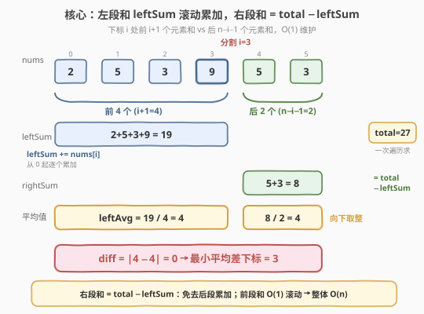
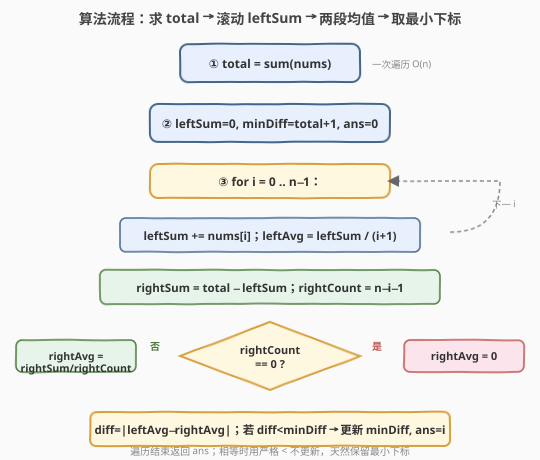

# LeetCode 最小平均差 题解

## 1. 题目概述

- **标题 / 题号**：最小平均差（#2256，medium）
- **链接**：https://leetcode.cn/problems/minimum-average-difference/
- **难度**：中等
- **标签**：数组、前缀和、数学

**题意**：给定一个下标从 **0** 开始长度为 `n` 的整数数组 `nums`。

下标 `i` 处的**平均差**指的是 `nums` 中**前** `i + 1` 个元素平均值和**后** `n - i - 1` 个元素平均值的**绝对差**。两个平均值都需要**向下取整**到最近的整数。

返回产生**最小平均差**的下标。如果有多个下标最小平均差相等，返回**最小**的一个下标。

**注意**：

- 两个数的**绝对差**是两者差的绝对值。
- `n` 个元素的平均值是 `n` 个元素之**和**除以（整数除法）`n`。
- `0` 个元素的平均值视为 `0`。

**示例 1**：

```text
输入：nums = [2,5,3,9,5,3]
输出：3
解释：
- 下标 0 处的平均差为：|2 / 1 - (5+3+9+5+3) / 5| = |2 - 5| = 3
- 下标 1 处的平均差为：|(2+5) / 2 - (3+9+5+3) / 4| = |3 - 5| = 2
- 下标 2 处的平均差为：|(2+5+3) / 3 - (9+5+3) / 3| = |3 - 5| = 2
- 下标 3 处的平均差为：|(2+5+3+9) / 4 - (5+3) / 2| = |4 - 4| = 0
- 下标 4 处的平均差为：|(2+5+3+9+5) / 5 - 3 / 1| = |4 - 3| = 1
- 下标 5 处的平均差为：|(2+5+3+9+5+3) / 6 - 0| = |4 - 0| = 4
下标 3 处为最小平均差，返回 3。
```

**示例 2**：

```text
输入：nums = [0]
输出：0
解释：唯一下标 0，平均差为 |0 / 1 - 0| = 0。
```

**约束**：

- $1 \le \text{nums.length} \le 10^5$
- $0 \le \text{nums[i]} \le 10^5$

> 💡 本题表面是"逐下标算两个平均值再比绝对差"，实质是**前缀和**的经典应用：用一次遍历的运行和把"前 `i+1` 个元素之和"与"后 `n-i-1` 个元素之和"都 $O(1)$ 维护出来，避免每个下标重新求和。

## 2. 解题思路

### 2.1 暴力思路：逐下标重新求和

最直白的做法是照搬题意：对每个下标 `i`，分别对前 `i+1` 个元素和后 `n-i-1` 个元素各跑一次累加，再除以个数取整数平均，最后求绝对差。

```text
for i in 0 .. n-1:
    leftSum  = sum(nums[0 .. i])        # 每次重新累加 i+1 个
    rightSum = sum(nums[i+1 .. n-1])    # 每次重新累加 n-i-1 个
    leftAvg  = leftSum  // (i+1)
    rightAvg = rightSum // (n-i-1) if n-i-1 > 0 else 0
    diff = abs(leftAvg - rightAvg)
```

每个下标要做 $O(n)$ 次加法，共 $n$ 个下标，时间 $O(n^2)$。当 $n = 10^5$ 时约 $10^{10}$ 次运算，**超时**。

> ⚠️ 浪费在于：相邻下标 `i` 与 `i+1` 的"前 `i+1` 个元素之和"只差一个 `nums[i+1]`，却从头累加了一遍。"后段和"同理可由总和减去前段和得到。这是前缀和登场的关键信号。

### 2.2 核心观察：运行和 + 总和一次遍历



**观察一：右段和无需单独累加**。设 `total = sum(nums)`，则下标 `i` 处：

$$\text{rightSum} = \text{total} - \text{leftSum}$$

其中 $\text{leftSum} = \sum_{k=0}^{i} \text{nums[k]}$。这样右段和由总和与前段和 $O(1)$ 推出，免去后段累加。

**观察二：前段和可滚动递推**。相邻下标间：

$$\text{leftSum}_{i} = \text{leftSum}_{i-1} + \text{nums[i]}$$

只需一个变量 `leftSum` 从 `0` 开始，每步加上 `nums[i]`，即可在 $O(1)$ 内从 `i-1` 转移到 `i`。

**观察三：整数除法天然向下取整**。题目要求"向下取整到最近整数"，而 C++/Python 中对**非负整数**的 `/`、`//` 即为向下取整。由于 $\text{nums[i]} \ge 0$，所有和、均值均为非负，直接用整数除法即可，无需额外取整函数。

$$\text{leftAvg} = \left\lfloor \frac{\text{leftSum}}{i+1} \right\rfloor, \qquad \text{rightAvg} = \begin{cases} \left\lfloor \frac{\text{rightSum}}{n-i-1} \right\rfloor & n-i-1 > 0 \\ 0 & n-i-1 = 0 \end{cases}$$

> 💡 末尾下标 $i = n-1$ 时后段元素数为 $0$，按题意其平均值为 $0$，需特判除零。这是本题唯一边界。

**观察四：溢出风险**。$n \le 10^5$ 且 $\text{nums[i]} \le 10^5$，故 $\text{total} \le 10^{10}$，超过 32 位 `int` 上界（$\approx 2.1 \times 10^9$）。C++ 中必须用 `long long` 存总和与前段和；Python 整数任意精度，无此虑。

### 2.3 算法流程图



1. **预处理**：一次遍历求 `total = sum(nums)`。
2. **滚动扫描**：`leftSum` 初始为 `0`，遍历 `i` 从 `0` 到 `n-1`：
   - `leftSum += nums[i]`，得到前 `i+1` 个元素之和。
   - `leftAvg = leftSum / (i+1)`。
   - `rightSum = total - leftSum`，`rightCount = n - i - 1`。
   - `rightAvg = rightCount == 0 ? 0 : rightSum / rightCount`。
   - `diff = |leftAvg - rightAvg|`。
3. **取最小**：维护 `minDiff` 与 `ans`，遇到更小的 `diff` 更新；相等时不更新（保留更小下标）。
4. **返回** `ans`。

> 💡 初始化 `minDiff` 为一个大于任意可能差的值（如 `total` 本身或 `LONG_MAX`），保证第一个下标必然更新它。由于遍历从 `i=0` 升序，相等时"不更新"天然保留最小下标。

### 2.4 示例演算

![示例演算：[2,5,3,9,5,3] 逐下标算两段均值与绝对差](../images/2256_example_walkthrough.svg)

以 `nums = [2,5,3,9,5,3]`（$n=6$，$\text{total}=27$）为例：

| $i$ | leftSum | leftCount | leftAvg | rightSum | rightCount | rightAvg | diff | minDiff/ans |
|-----|---------|-----------|---------|----------|------------|----------|------|-------------|
| 0 | 2       | 1         | 2       | 25       | 5          | 5        | 3    | 3 / 0       |
| 1 | 7       | 2         | 3       | 20       | 4          | 5        | 2    | 2 / 1       |
| 2 | 10      | 3         | 3       | 17       | 3          | 5        | 2    | 2 / 1（相等不换） |
| 3 | 19      | 4         | 4       | 8        | 2          | 4        | 0    | 0 / 3       |
| 4 | 24      | 5         | 4       | 3        | 1          | 3        | 1    | 0 / 3       |
| 5 | 27      | 6         | 4       | 0        | 0          | 0        | 4    | 0 / 3       |

- `i=3` 时 `leftAvg = 19/4 = 4`，`rightAvg = 8/2 = 4`，差为 `0`，达到全局最小。
- `i=2` 与 `i=1` 的差均为 `2`，但 `i=1` 先到，故 `ans` 停留在 `1`，直到被 `i=3` 的 `0` 覆盖。

**答案 = 3** ✓

> ⚠️ 注意 `i=5`（末尾）`rightCount = 0`，走特判分支 `rightAvg = 0`，避免除零。若忘记特判会触发除以零异常。

## 3. 参考代码

### C++（运行和，推荐）

```cpp
class Solution {
  public:
    int minimumAverageDifference(vector<int>& nums) {
        int n = nums.size();
        long long total = 0;
        for (int x : nums) total += x;

        long long leftSum = 0;
        int ans = 0;
        long long minDiff = total + 1; // 大于任意可能差，保证首下标必然更新

        for (int i = 0; i < n; ++i) {
            leftSum += nums[i];
            long long leftAvg = leftSum / (i + 1);
            long long rightSum = total - leftSum;
            int rightCount = n - i - 1;
            long long rightAvg = (rightCount == 0) ? 0 : rightSum / rightCount;
            long long diff = abs(leftAvg - rightAvg);
            if (diff < minDiff) {
                minDiff = diff;
                ans = i;
            }
        }
        return ans;
    }
};
```

> ⚠️ `total` 与 `leftSum` 必须用 `long long`：$n \cdot \max(\text{nums[i]}) = 10^5 \times 10^5 = 10^{10}$，超出 `int` 范围。`minDiff` 初值取 `total + 1` 既能保证被首下标覆盖，又不会因 `LONG_MAX` 与 `long long` 比较产生混淆。

### Python（运行和）

```python
class Solution:
    def minimumAverageDifference(self, nums: List[int]) -> int:
        n = len(nums)
        total = sum(nums)

        left_sum = 0
        ans = 0
        min_diff = total + 1

        for i, x in enumerate(nums):
            left_sum += x
            left_avg = left_sum // (i + 1)
            right_sum = total - left_sum
            right_count = n - i - 1
            right_avg = 0 if right_count == 0 else right_sum // right_count
            diff = abs(left_avg - right_avg)
            if diff < min_diff:
                min_diff = diff
                ans = i

        return ans
```

> 💡 Python 整数无溢出，`//` 对非负数即向下取整，逻辑与 C++ 完全对应。`right_count == 0` 的特判同样不可省。

## 4. 复杂度分析

| 维度 | 复杂度 | 说明 |
|------|--------|------|
| 时间复杂度 | $O(n)$ | 一次遍历求 `total` + 一次遍历滚动 `leftSum` 并计算每个下标的差，共 $2n$ 次运算 |
| 空间复杂度 | $O(1)$ 额外 | 仅用 `total`、`leftSum`、`minDiff`、`ans` 等常数个变量，不随 $n$ 增长 |

> 💡 相比暴力 $O(n^2)$，前缀和/运行和把"每个下标重算两段和"压缩为"$O(1)$ 滚动递推 + 总和相减"，是典型的**空间换不得、时间换得起**的线性扫描优化。

## 5. 扩展：为什么不能直接比较"和"而要比较"平均"？

直觉上，最小化 $|\text{leftAvg} - \text{rightAvg}|$ 与最小化 $|\text{leftSum} - \text{rightSum}|$ 不同——因为两段**元素个数不同**，平均值把和按"规模"归一化。

以 `nums = [0, 100]` 为例：

| $i$ | leftSum | leftAvg | rightSum | rightAvg | diff(平均) | diff(和) |
|-----|---------|---------|----------|----------|-----------|----------|
| 0 | 0       | 0       | 100      | 100      | 100       | 100      |
| 1 | 100     | 50      | 0        | 0        | 50        | 100      |

按"平均差"最小应选 $i=1$（差 50），但按"和差"两下标都是 100 无法区分。这正是除以个数的作用——**消除段长差异**，反映"人均水平"的差距。因此不能用前缀和之差代替平均值之差，必须保留除法。

> ⚠️ 若题目改为"两段元素个数始终相同"（如 $n$ 为偶数且只考虑正中分割），则比较和与比较平均等价，可省去除法。但本题每个下标都参与，段长各异，除法不可省。

## 6. 面试要点

1. **为什么用前缀和而不是每个下标重新求和？**

   - 相邻下标 `i` 与 `i+1` 的前段和只差 `nums[i+1]`，重新累加浪费 $O(n)$。用运行和 `leftSum += nums[i]` 把每个下标的前段和维护降到 $O(1)$；后段和由 `total - leftSum` 直接得到，整体 $O(n)$。

2. **为什么总和要用 `long long`？**

   - $n \le 10^5$、$\text{nums[i]} \le 10^5$，总和上界 $10^{10}$，超过 32 位 `int`（$\approx 2.1 \times 10^9$）。用 `int` 会溢出导致错误的总和与错误的最小下标。Python 无此问题。

3. **末尾下标为什么要特判 `rightCount == 0`？**

   - $i = n-1$ 时后段元素数 $n - i - 1 = 0$，直接除会除以零。题意规定 0 个元素的平均值为 0，故特判返回 0。这是本题最易踩的坑。

4. **多个下标平均差相等时如何保证返回最小下标？**

   - 遍历从 $i=0$ 升序，更新条件用严格 `<`（`diff < minDiff`）。相等时不更新，`ans` 保留更早（更小）的下标，天然满足要求。若误用 `<=` 会返回最大下标。

5. **整数除法 `//` 和"向下取整"一致吗？**

   - 对**非负**整数一致。本题所有和、个数均非负，C++ 的 `/` 与 Python 的 `//` 都向下取整。若有负数参与则需 `floor` 显式处理（C++ `/` 对负数向零截断，与向下取整不同）。

## 同类练习题

| # | 题目 | 与本题的关联 |
|---|------|-------------|
| 238 | [除自身以外数组的乘积](https://leetcode.cn/problems/product-of-array-except-self/)（[题解](../0201-0300/238_除自身以外数组的乘积.md)） | 同样用"前缀积 × 后缀积"避免每个位置重算，是前缀和思想在乘法上的镜像 |
| 560 | [和为 K 的子数组](https://leetcode.cn/problems/subarray-sum-equals-k/) | 前缀和 + 哈希统计，把"区间和"转为"两前缀和之差"的经典应用 |
| 1732 | [找到最高海拔](https://leetcode.cn/problems/find-the-highest-altitude/)（[题解](../1701-1800/1732_找到最高海拔.md)） | 前缀和取最大值，最简形态的运行和扫描 |
| 2219 | [数组的最大总分](https://leetcode.cn/problems/maximum-total-score-of-an-array/)（[题解](2219_数组的最大总分.md)） | 同区间间的"前缀和/后缀和"双向维护，取 `max(prefix[i], suffix[i])`，与本题同骨架 |
| 724 | [寻找数组的中心下标](https://leetcode.cn/problems/find-pivot-index/) | 前缀和找左右两段和相等的下标，是本题"比较两段"的等值版（改为比较和而非平均） |
